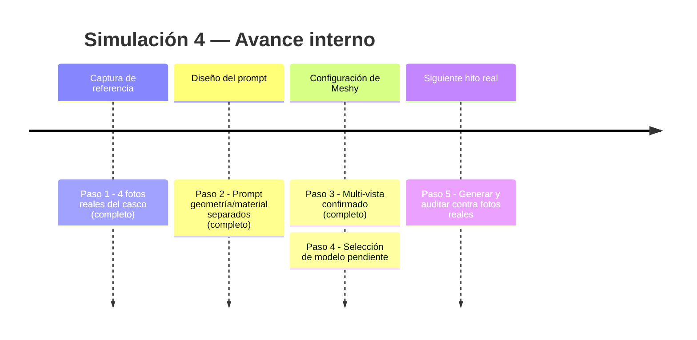
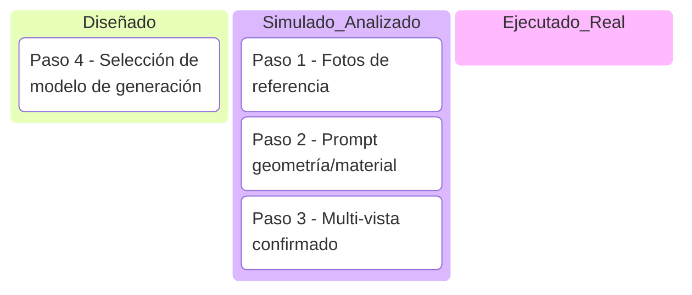
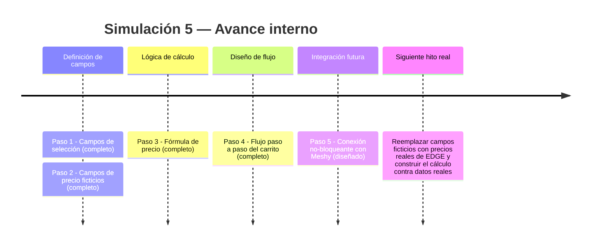
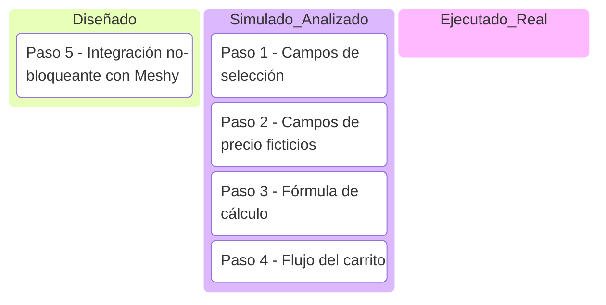
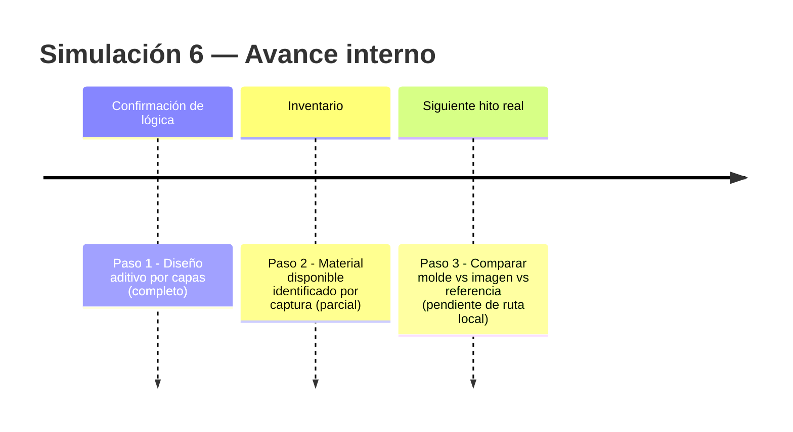
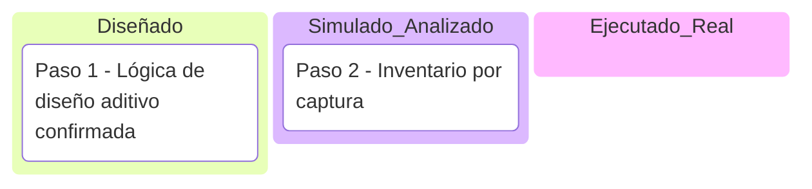

# Mis pruebas — Claude Code (VS Code local)

**Qué es este documento:** registro propio, separado de `simulaciones-ejecucion.md`. Acá solo van simulaciones/pruebas que yo (esta sesión de Claude Code, local en VS Code) corro y registro directamente — no duplica ni reemplaza lo que otras sesiones ya hicieron en este repo. Mismo formato que el documento original: pasos, línea de tiempo (Mermaid), kanban (Mermaid), todo en toggles, con bitácora de decisiones.

**Regla:** toda simulación lleva la marca 🧪 **SIMULACIÓN — no ejecutado contra datos/API real** hasta que se valide con ejecución real, momento en que pasa a ✅ **VALIDADO**.

---

<details><summary>Simulación 4 — Reconstrucción 3D del casco con Meshy AI (Etapa 2 — Turntable)</summary>

Prueba de factibilidad de reconstrucción 3D fotorrealista de un casco EDGE físico real, usando Meshy AI (Image-to-3D, modo multi-vista) como candidato para la capa visual del futuro cotizador tipo carrito.

<details><summary>Pasos de la simulación</summary>

**Paso 1 — Conseguir fotos de referencia del casco físico**
4 vistas reales tomadas: frontal, lateral, 3/4-lateral, trasera. Fondo neutro, casco montado en soporte fijo — coherente con el estándar de captura ya usado en Etapa 1 (3 ángulos obligatorios: perfil 90°, 3/4 45°, superior).

**Paso 2 — Redactar el prompt separando geometría de material**
Se armó un prompt en inglés dividido en SHELL (carcasa, geometría + reflectividad), VISOR (material distinto, mecanismo de pivote), VENTS (conteo y posición exacta), HARDWARE (remaches, correa), MATERIALS (3 materiales distintos declarados explícitamente), y restricciones explícitas de no agregar logos ni alterar proporciones. Mismo principio que el prompt de Nano Banana Pro de la Simulación 1: anclar geometría no-negociable con coordenadas/conteos exactos.

**Paso 3 — Subir referencias multi-vista a Meshy**
Confirmado: Meshy sí soporta múltiples imágenes de referencia en el mismo proyecto (no limitado a una sola foto), lo cual reduce el riesgo de "alucinación" en las partes no fotografiadas directamente.

**Paso 4 — Elegir modelo de generación**
Meshy ofrece selección de modelo 3D (Auto / Standard / Smart Topology) y de modelo de imagen intermedio (Auto / GPT-image2 / Nano-Banana-2 / Nano-Banana-Pro / Nano-Banana-2-Lite). Pendiente de decidir cuál usar — Standard es candidato natural si el objetivo es fidelidad para catálogo/render, no juegos/tiempo real.

**Paso 5 — Generar y auditar (pendiente de ejecución real)**
Falta: correr la generación, y auditar el resultado contra las 4 fotos reales, elemento por elemento (ventilaciones, spoiler, apertura de visor, reflectividad) — mismo patrón de auditoría separada del generador que ya usa el pipeline de imágenes 2D.

</details>

<details><summary>Línea de tiempo interna (Mermaid)</summary>



</details>

<details><summary>Kanban de progreso (Mermaid)</summary>



Checklist de respaldo:
- [x] Paso 1 — 4 fotos reales del casco (frontal, lateral, 3/4, trasera)
- [x] Paso 2 — Prompt con geometría/material separados
- [x] Paso 3 — Confirmado soporte multi-vista en Meshy
- [ ] Paso 4 — Elegir modelo de generación (Standard vs Auto vs Smart Topology)
- [ ] Paso 5 — Generar y auditar resultado contra fotos reales

</details>

<details><summary>Bitácora de decisiones</summary>

| Fecha | Decisión | Quién | Motivo |
|---|---|---|---|
| 2026-07-20 | Probar Meshy antes que Blender | Usuario | Menor curva de entrada, prueba rápida vía suscripción Pro con descuento primer mes |
| 2026-07-20 | Pagar suscripción Meshy Pro solo para la prueba | Usuario | Costo bajo ($10.40 primer mes) vs. valor de validar factibilidad antes de comprometer más tiempo |
| Pendiente | Cancelar suscripción tras la prueba | Usuario | Evitar cobro recurrente de $20.80/mes si no se usa continuamente |

</details>

🧪 **SIMULACIÓN — prompt diseñado y multi-vista confirmado, generación real y auditoría contra fotos aún pendientes.**

</details>

---

<details><summary>Simulación 5 — Cotizador tipo carrito (Fase 3 — Ventas/Cotización)</summary>

Diseño del flujo y los campos del cotizador donde el cliente arma su pedido de cascos EDGE eligiendo modelo, colorway, talle y cantidad, con precio calculado y (a futuro) visualización 3D del casco ensamblándose.

**Nota explícita:** el usuario confirmó que el precio SÍ varía por colorway/talle en la realidad, pero para esta etapa de diseño se usan campos ficticios — ningún precio de esta simulación es un precio real de EDGE, son placeholders para probar la lógica del flujo.

<details><summary>Pasos de la simulación</summary>

**Paso 1 — Definir los campos de selección del cliente**
- `modelo` (referencia al golden record de Etapa 0 — no se inventa un modelo que no exista en catálogo)
- `colorway` (depende del modelo elegido, limita las opciones disponibles)
- `talle` (S/M/L/XL — genérico por ahora, pendiente de tabla real de talles EDGE)
- `cantidad` (entero ≥1)

**Paso 2 — Definir campos de precio (FICTICIOS, placeholder)**

| Campo | Valor ficticio | Nota |
|---|---|---|
| `precio_base_modelo` | $XX.XX (placeholder) | Varía por modelo — dato real pendiente de EDGE |
| `recargo_colorway_especial` | +$X.XX (placeholder) | Solo aplica a colorways premium/edición limitada — a confirmar cuáles |
| `descuento_por_cantidad` | 0% (1-4u) / X% (5-9u) / X% (10+u) | Umbrales ficticios, pendiente de política real de mayorista |
| `costo_envio` | $X.XX o "a definir por destino" | Pendiente de definir si se cotiza en el mismo flujo o después |

**Paso 3 — Definir la fórmula de cálculo (con placeholders)**
```
precio_unitario = precio_base_modelo + recargo_colorway_especial
subtotal = precio_unitario × cantidad
descuento = subtotal × descuento_por_cantidad
total = subtotal − descuento + costo_envio
```

**Paso 4 — Definir el flujo paso a paso del "carrito"**
1. Cliente elige modelo → sistema muestra colorways disponibles para ese modelo
2. Cliente elige colorway → (a futuro) se actualiza vista 3D/imagen del casco
3. Cliente elige talle y cantidad → sistema calcula precio en vivo
4. Cliente confirma → se genera cotización con desglose visible (no solo el total)

**Paso 5 — Conectar con la capa visual (Meshy, opcional y no bloqueante)**
El cotizador debe funcionar completo con imágenes estáticas por colorway aunque el 3D de Meshy (Simulación 4) no esté listo — el 3D se suma como mejora visual, nunca como requisito para que el cotizador funcione.

</details>

<details><summary>Línea de tiempo interna (Mermaid)</summary>



</details>

<details><summary>Kanban de progreso (Mermaid)</summary>



Checklist de respaldo:
- [x] Paso 1 — Campos de selección (modelo, colorway, talle, cantidad)
- [x] Paso 2 — Campos de precio ficticios definidos
- [x] Paso 3 — Fórmula de cálculo definida
- [x] Paso 4 — Flujo paso a paso del carrito
- [ ] Paso 5 — Reemplazar precios ficticios por reales de EDGE
- [ ] Ejecución real contra base de datos de catálogo

</details>

🧪 **SIMULACIÓN — todos los precios son placeholders ficticios, no representan precios reales de EDGE. La lógica del flujo es la parte validable hoy; los números deben reemplazarse antes de producción.**

</details>

---

<details><summary>Simulación 6 — Adaptación 2D "God Father" con Nano Banana (Etapa 1 — Ilustración)</summary>

Proyecto nuevo: adaptar varios cascos ya existentes (carpeta local `Adaptacion God Father`, con 9 imágenes + `GODFATHER-HERO.ai.pdf`) usando el flujo ya validado de Nano Banana + prompts — no 3D, imágenes 2D listas para vender. Mismo patrón aditivo que Etapa 1: casco base + capas de colorway/gráficos superpuestas, no un diseño desde cero.

**Nota explícita:** el usuario confirmó que ya tiene un proceso y prompts que probaron funcionar en casos anteriores (mismo patrón de trasplante de máscara ya usado en EDGE Boston) — esta simulación no reinventa la técnica, la aplica al caso "God Father".

<details><summary>Pasos de la simulación</summary>

**Paso 1 — Confirmar la lógica de diseño aditivo**
El casco se arma por capas: base sin diseño → se van añadiendo elementos (color, gráfico, tono) uno sobre otro, cada capa respeta lo que ya está puesto. No es "generar un diseño específico desde cero", es "agregar N elementos sobre un casco base".

**Paso 2 — Inventario de material disponible (según captura, sin acceso al archivo real todavía)**
Carpeta local con 9 imágenes (varios ángulos: frontal, lateral, vista invertida, rotada) + 1 PDF (`GODFATHER-HERO.ai.pdf`). Pendiente confirmar cuáles son molde/checkpoint real y cuáles son intentos ya generados.

**Paso 3 — Comparación molde vs. imagen vs. referencia (PENDIENTE — requiere acceso real)**
No ejecutado todavía: falta la ruta local completa de la carpeta para leer los archivos reales y aplicar el mismo criterio de auditoría ya usado en el pipeline (comparación elemento por elemento contra checklist, separación geometría/textura vs. decal plano).

</details>

<details><summary>Línea de tiempo interna (Mermaid)</summary>



</details>

<details><summary>Kanban de progreso (Mermaid)</summary>



Checklist de respaldo:
- [x] Paso 1 — Confirmar lógica de diseño aditivo por capas
- [x] Paso 2 — Inventario preliminar (por captura de pantalla)
- [ ] Paso 3 — Leer archivos reales y comparar molde vs. imagen vs. referencia (pendiente: ruta local de la carpeta)

</details>

🧪 **SIMULACIÓN — lógica de diseño confirmada, pero la auditoría real molde/imagen/referencia no se ejecutó todavía. Falta la ruta local de `Adaptacion God Father` para leer los archivos de verdad.**

</details>

---

**Última actualización:** 2026-07-20 · registrado por Claude Code (sesión local VS Code), separado del índice de simulaciones original.
