# Pipeline completo — Automatización del área de marketing/producto de EDGE (6 meses de contrato)

Cada etapa es un árbol de decisiones real (bifurcaciones Sí/No). Cada pregunta trae, conectado por una línea punteada, su propio nodo con las 5 restricciones y 5 criterios de éxito — todo dentro del mismo Mermaid.

## Vista general — las 8 etapas

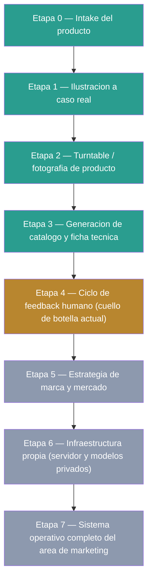

---

<details>
<summary><strong>Etapa 0 — Intake del producto</strong> (ya funciona)</summary>

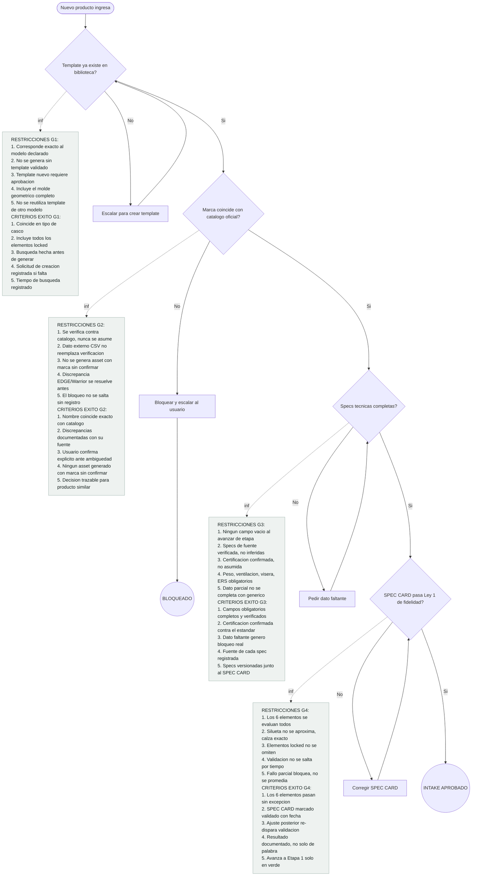

#### Cómo se construye
1. Crear endpoint `/api/intake` que reciba imagen + metadata básica
2. Definir schema `spec_cards` en Supabase: modelo, colorway, tipo, certificación, elementos_locked, versión
3. Función que consulta la biblioteca de templates existente antes de aceptar un producto nuevo
4. Cargar tabla `catalogo_marcas` con nombres válidos y comparar contra el input (resuelve el caso EDGE/Warrior)
5. Si no coincide, disparar notificación (mismo patrón de PR + `subscribe_pr_activity` ya armado) en vez de bloquear en silencio
6. Validador de specs obligatorias como función que retorna la lista de campos faltantes, no solo true/false
7. Usar Claude Haiku para normalizar metadata cuando la imagen de entrada viene sin estructurar
8. Implementar el chequeo de Ley 1 como función reutilizable (ya documentada en `edgehelmetmasteragentprompt_v5.md`), no reescribirla por etapa
9. Guardar cada SPEC CARD con versión incremental — INSERT nuevo con `version_of`, nunca UPDATE
10. Campo `prioridad`: auto-asignar máxima si el pedido viene de un contacto marcado como cliente real
11. Emitir "intake completo" como registro en tabla `pipeline_queue` que dispara la Etapa 1

#### Hallazgos de investigación (mercado real, con fuente citada)

<details><summary>Hallazgo 1 — Golden Record de marca</summary>

```mermaid
flowchart TD
    START(["Inicio: Etapa 0 - validar atributo `brand`"])
    S1["Paso 1: Ingesta<br/>Captura del campo `brand` desde la fuente (CSV/ERP/PIM) a staging"]
    I1["Restricciones:<br/>1. Único sistema autoritativo definido por atributo<br/>2. Todo registro ingerido conserva `brand` sin normalizar<br/>3. Formato de entrada declara encoding y origen<br/>4. Prohibida ingesta directa al working copy publicado<br/>5. Registro sin `brand` se marca explícitamente 'sin marca'<br/><br/>Métricas de éxito:<br/>1. 100% de registros trazados a su fuente de origen<br/>2. ≥98% de registros con `brand` mapeado en ≤24h<br/>3. 0 registros escriben directo al golden record<br/>4. 100% de fuentes registradas con metadata de origen<br/>5. Tiempo medio de ingesta a staging ≤1 hora/lote<br/><br/>Métrica de fracaso:<br/>&gt;0% de registros que sobrescriben el golden record sin pasar por staging"]
    S2["Paso 2: Matching<br/>Comparación del valor recibido contra el valor canónico 'EDGE'"]
    I2["Restricciones:<br/>1. Comparación case-insensitive y trim de espacios<br/>2. Toda variante (Warrior, Edge Inc) se marca 'no-match', no se autocorrige<br/>3. Prohibido fuzzy-matching con umbral que permita falsos positivos<br/>4. Todo resultado de matching loguea valor original y candidato<br/>5. Matching corre antes de survivorship<br/><br/>Métricas de éxito:<br/>1. 92-95% de precisión en validación automática de marca<br/>2. &gt;98% de true negatives en productos sin marca EDGE<br/>3. 100% de comparaciones registradas en log de auditoría<br/>4. 0% falsos positivos entre 'Warrior' y 'EDGE'<br/>5. Tiempo de matching ≤5 segundos/registro<br/><br/>Métrica de fracaso:<br/>Tasa de falsos positivos de matching &gt;2%"]
    S3["Paso 3: Survivorship<br/>Determinar el valor sobreviviente ante conflicto entre fuentes"]
    I3["Restricciones:<br/>1. Solo un sistema autoritativo aporta el valor sobreviviente<br/>2. En conflicto gana la fuente de mayor jerarquía de confianza<br/>3. Ningún valor sobreviviente sin criterio de desempate registrado<br/>4. 'Warrior' nunca sobrevive sobre 'EDGE' en el mismo SKU<br/>5. Survivorship se aplica antes de escribir al working copy<br/><br/>Métricas de éxito:<br/>1. 100% de conflictos resueltos con jerarquía documentada<br/>2. 0 incidentes tipo 'Warrior reemplaza EDGE' tras implementación<br/>3. 100% de valores sobrevivientes trazables a la fuente ganadora<br/>4. ≥98% true negatives mantenido tras survivorship<br/>5. Tiempo de resolución de conflicto ≤1 minuto/registro<br/><br/>Métrica de fracaso:<br/>≥1 caso de valor no-EDGE sobreviviendo como marca del golden record"]
    S4["Paso 4: Validación automática<br/>Aplicar allowlist estricta (solo 'EDGE'), tolerancia 0%"]
    I4["Restricciones:<br/>1. Allowlist contiene exactamente un valor válido: 'EDGE'<br/>2. Tolerancia 0% a valores fuera de lista, sin excepción manual<br/>3. Valor fuera de lista bloquea el pase a 'aprobado para catálogo'<br/>4. Validación se ejecuta en cada actualización del campo, no solo en carga inicial<br/>5. Resultado pass/fail visible antes del gate de publicación<br/><br/>Métricas de éxito:<br/>1. 92-95% de precisión de validación automática sostenida<br/>2. &gt;98% true negatives sostenido en producción<br/>3. 100% de valores fuera de allowlist bloqueados automáticamente<br/>4. 0 aprobaciones manuales que sobrescriban un rechazo<br/>5. 100% de validaciones ejecutadas en &lt;1 segundo/registro<br/><br/>Métrica de fracaso:<br/>&gt;0% de productos con `brand` ≠ 'EDGE' marcados como aprobados"]
    S5["Paso 5: Mantenimiento<br/>Re-disparo periódico del ciclo ante cambios y auditorías del golden record"]
    I5["Restricciones:<br/>1. Todo cambio a `brand` re-dispara ingestion→matching→survivorship→validación<br/>2. El sistema autoritativo no cambia sin migración formal documentada<br/>3. Auditorías periódicas programadas, no solo reactivas a incidentes<br/>4. Ningún batch externo escribe `brand` sin pasar por el pipeline MDM<br/>5. Histórico de valores rechazados se conserva para detectar patrones<br/><br/>Métricas de éxito:<br/>1. 100% de re-validaciones disparadas ante cada actualización<br/>2. 0 incidentes de 'marca incorrecta en catálogo' por trimestre<br/>3. ≥98% true negatives mantenido en auditorías trimestrales<br/>4. 92-95% de precisión sostenida en muestreos de mantenimiento<br/>5. 100% de fuentes con historial de rechazo notificadas en ≤24h<br/><br/>Métrica de fracaso:<br/>&gt;0 productos publicados con `brand` inválido detectados en auditoría posterior"]
    RESULT(["Resultado: golden record `brand`='EDGE' certificado, apto para Etapa 1"])

    START --> S1
    S1 -.info.- I1
    S1 --> S2
    S2 -.info.- I2
    S2 --> S3
    S3 -.info.- I3
    S3 --> S4
    S4 -.info.- I4
    S4 --> S5
    S5 -.info.- I5
    S5 --> RESULT

    classDef step fill:#1f7a6c,color:#ffffff,stroke:#14524a,stroke-width:1px;
    classDef info fill:#eef2f0,color:#2c332f,stroke:#9db3ac,stroke-width:1px;
    class S1,S2,S3,S4,S5 step;
    class I1,I2,I3,I4,I5 info;
```

</details>

<details><summary>Hallazgo 2 — Etiqueta de certificación como schema obligatorio</summary>

```mermaid
flowchart TD
    START(["Inicio: Etapa 0 - schema de certificación del casco"])
    S1["Paso 1: Determinar régimen<br/>Asignar mercado de destino: DOT (autocertificación) o UNECE R22.06 (tercero)"]
    I1["Restricciones:<br/>1. Todo SKU tiene un mercado de destino único antes de avanzar<br/>2. Prohibido catalogar sin régimen de certificación asignado<br/>3. DOT y UNECE no se tratan como equivalentes (autocertificación vs tercero)<br/>4. 'Tipo de certificación' es enum cerrado (DOT | ECE), no texto libre<br/>5. Cambio de mercado re-dispara la validación completa del schema<br/><br/>Métricas de éxito:<br/>1. 100% de SKUs con mercado y régimen asignado antes de avanzar<br/>2. 0% de productos con régimen mixto o ambiguo<br/>3. 100% de asignaciones con timestamp y responsable<br/>4. 100% de valores restringidos al enum DOT/ECE<br/>5. Tiempo de asignación de régimen ≤1 día/SKU<br/><br/>Métrica de fracaso:<br/>&gt;0 SKUs publicados sin régimen de certificación asignado"]
    S2["Paso 2: Schema obligatorio<br/>Definir campos: marca, modelo, tipo cert., número homologación ECE, fecha vigencia CoP"]
    I2["Restricciones:<br/>1. Campos mínimos: marca, modelo, tipo cert., número homologación ECE, fecha CoP<br/>2. 100% de campos no-nulos antes de 'aprobado para catálogo'<br/>3. 'DOT', 'FMVSS No. 218' y 'CERTIFIED' son valores literales validables<br/>4. Marcado UNECE sigue el formato exacto 'E1 22R-05 12345'<br/>5. Schema distingue campos exclusivos DOT de exclusivos UNECE<br/><br/>Métricas de éxito:<br/>1. 100% de campos obligatorios no-nulos antes del gate<br/>2. 100% de marcados ECE validados contra el patrón 'E1 22R-05 12345'<br/>3. 100% de etiquetas DOT con las 3 leyendas literales presentes<br/>4. 0 productos con campos mixtos entre regímenes<br/>5. 100% de campos trazables a la norma fuente (CFR o UNECE)<br/><br/>Métrica de fracaso:<br/>&gt;0% de productos aprobados con ≥1 campo obligatorio nulo"]
    S3["Paso 3: Validar especificación física<br/>Verificar letra ≥0.38in y ubicación 2.5-7.6cm del borde inferior"]
    I3["Restricciones:<br/>1. Altura de letra ≥0.38in en todo el texto obligatorio<br/>2. Ubicación entre 2.5cm y 7.6cm del borde inferior<br/>3. Validación se ejecuta sobre el asset (foto/diseño), no solo metadata<br/>4. Ninguna etiqueta con letra &lt;0.38in pasa el gate, sin excepción manual<br/>5. Posición fuera de rango bloquea automáticamente la aprobación<br/><br/>Métricas de éxito:<br/>1. 100% de etiquetas con altura de letra ≥0.38in verificada<br/>2. 100% de etiquetas dentro del rango 2.5-7.6cm<br/>3. 0 rechazos por especificación física no detectados antes de producción<br/>4. 100% de validaciones físicas con evidencia registrada<br/>5. Tiempo de validación física ≤2 días/SKU<br/><br/>Métrica de fracaso:<br/>&gt;0 unidades en mercado con letra &lt;0.38in o etiqueta fuera de rango"]
    S4["Paso 4: Homologación y CoP<br/>Verificar aprobación de tercero (TÜV/IDIADA) y vigencia de Conformity of Production"]
    I4["Restricciones:<br/>1. Producto destinado a UNECE requiere aprobación previa de tercero acreditado<br/>2. Número de homologación ECE debe existir y estar vigente<br/>3. Fecha de vigencia CoP debe estar activa, no vencida<br/>4. Auditorías periódicas de CoP programadas con anticipación al vencimiento<br/>5. Producto UNECE no puede autocertificarse como régimen DOT<br/><br/>Métricas de éxito:<br/>1. 100% de productos UNECE con homologación de tercero registrada<br/>2. 100% de fechas CoP no vencidas al momento de aprobación<br/>3. 100% de auditorías CoP programadas ≥30 días antes del vencimiento<br/>4. 0 productos UNECE publicados sin homologación válida<br/>5. 100% de homologaciones trazables a organismo y fecha de emisión<br/><br/>Métrica de fracaso:<br/>&gt;0 productos UNECE en catálogo con CoP vencida o sin homologación"]
    S5["Paso 5: Gate de aprobación<br/>Bloquear pase a catálogo si algún campo obligatorio es nulo"]
    I5["Restricciones:<br/>1. Ningún producto avanza con un campo obligatorio nulo<br/>2. Gate verifica simultáneamente schema, especificación física y homologación<br/>3. Toda falla del gate genera motivo de rechazo específico<br/>4. Bloqueo previene exposición a multa NHTSA (hasta $27,874 USD)<br/>5. Resultado del gate queda auditado con fecha y responsable<br/><br/>Métricas de éxito:<br/>1. 100% de productos con los 5 campos obligatorios no-nulos<br/>2. 0 productos aprobados con incumplimiento físico o de homologación<br/>3. 100% de rechazos con motivo documentado<br/>4. 0 exposiciones a multa NHTSA desde implementación del gate<br/>5. Tiempo total del gate ≤5 días hábiles/SKU<br/><br/>Métrica de fracaso:<br/>≥1 producto aprobado con exposición potencial a multa NHTSA de hasta $27,874 USD"]
    RESULT(["Resultado: producto certificado 100% conforme, apto para catálogo sin exposición a multa"])

    START --> S1
    S1 -.info.- I1
    S1 --> S2
    S2 -.info.- I2
    S2 --> S3
    S3 -.info.- I3
    S3 --> S4
    S4 -.info.- I4
    S4 --> S5
    S5 -.info.- I5
    S5 --> RESULT

    classDef step fill:#1f7a6c,color:#ffffff,stroke:#14524a,stroke-width:1px;
    classDef info fill:#eef2f0,color:#2c332f,stroke:#9db3ac,stroke-width:1px;
    class S1,S2,S3,S4,S5 step;
    class I1,I2,I3,I4,I5 info;
```

</details>

<details><summary>Hallazgo 3 — Quality/Completeness score como gate numérico</summary>

```mermaid
flowchart TD
    START(["Inicio: Etapa 0 - completeness score del producto"])
    S1["Paso 1: Definir atributos obligatorios<br/>Baseline por familia + canal + locale"]
    I1["Restricciones:<br/>1. Atributos obligatorios definidos por combinación familia+canal+locale<br/>2. Ningún atributo obligatorio sin familia asignada<br/>3. Lista de atributos obligatorios versionada, no retroactiva silenciosa<br/>4. Canal nuevo requiere su propio set antes de aceptar productos<br/>5. Atributos obligatorios consistentes con campos de certificación (H2)<br/><br/>Métricas de éxito:<br/>1. 100% de familias con set de atributos obligatorios definido<br/>2. 100% de combinaciones familia/canal/locale con baseline configurado<br/>3. 0 atributos obligatorios sin familia asignada<br/>4. 100% de cambios al set versionados con fecha<br/>5. Tiempo de configuración de canal nuevo ≤3 días<br/><br/>Métrica de fracaso:<br/>&gt;0 familias operando en producción sin atributos obligatorios definidos"]
    S2["Paso 2: Calcular score<br/>Completeness 0-100% por producto, canal y locale"]
    I2["Restricciones:<br/>1. Score = % de atributos obligatorios completados (0-100%)<br/>2. Recalculo automático en cada edición de producto<br/>3. Atributo vacío o placeholder no cuenta como completado<br/>4. Score calculado por canal y locale, no como valor único global<br/>5. Cálculo reproducible y auditable<br/><br/>Métricas de éxito:<br/>1. 100% de productos con score recalculado en &lt;1 minuto tras edición<br/>2. 100% de scores calculados por canal/locale<br/>3. 0% de atributos placeholder contados como completados<br/>4. 100% de cálculos reproducibles en auditoría<br/>5. Cobertura de cálculo en 100% de familias activas<br/><br/>Métrica de fracaso:<br/>&gt;0% de discrepancia entre score mostrado y score recalculado en auditoría"]
    S3["Paso 3: Clasificar grado A-E<br/>A=90-100% ... E=0-59%"]
    I3["Restricciones:<br/>1. Grado A=90-100% hasta E=0-59%, sin rangos superpuestos<br/>2. Todo producto tiene grado asignado, nunca 'sin grado'<br/>3. Grado visible en ficha de producto para el equipo de contenido<br/>4. Ningún cambio de grado sin cambio del score subyacente<br/>5. Límites de rango son configuración centralizada, no hardcode disperso<br/><br/>Métricas de éxito:<br/>1. 100% de productos con grado A-E correcto según su score<br/>2. 0 productos sin grado asignado<br/>3. 100% de cambios de grado correlacionados con cambio de score<br/>4. 100% de rangos centralizados en configuración única<br/>5. Tiempo de reclasificación tras edición ≤1 minuto<br/><br/>Métrica de fracaso:<br/>&gt;0 productos con grado mostrado inconsistente con su score real"]
    S4["Paso 4: Gate de publicación<br/>Bloquear si grado &lt; A (score &lt;90%)"]
    I4["Restricciones:<br/>1. Ningún producto con score &lt;90% pasa a estado 'publicado'<br/>2. Gate aplica idéntico en todos los canales y locales<br/>3. Sin excepciones manuales que sobrescriban el bloqueo<br/>4. Bloqueo indica qué atributos faltan para llegar a 90%<br/>5. Gate se ejecuta como último paso antes de promoción draft→working copy (H5)<br/><br/>Métricas de éxito:<br/>1. 100% de productos publicados con score ≥90%<br/>2. 0 publicaciones manuales que evadan el gate<br/>3. 100% de bloqueos con lista específica de atributos faltantes<br/>4. 100% de canales/locales aplicando el mismo umbral de 90%<br/>5. Tiempo de remediación promedio de atributos faltantes ≤2 días<br/><br/>Métrica de fracaso:<br/>&gt;0% de productos publicados con score &lt;90%"]
    S5["Paso 5: Monitoreo continuo<br/>Recalculo y escalamiento ante caída del score post-publicación"]
    I5["Restricciones:<br/>1. Score se recalcula tras cualquier edición posterior a la publicación<br/>2. Producto publicado que caiga &lt;90% reingresa a revisión<br/>3. Reportes de completeness por familia/canal generados periódicamente<br/>4. Productos con grado bajo persistente escalan a responsable de contenido<br/>5. Histórico de score por producto se conserva para análisis de tendencia<br/><br/>Métricas de éxito:<br/>1. 100% de productos publicados re-evaluados ante cambio de requisitos<br/>2. 0 productos con score &lt;90% sin acción de remediación abierta<br/>3. Reportes semanales generados al 100%<br/>4. 100% de productos con grado &lt;A por &gt;7 días escalados<br/>5. Histórico de score disponible para 100% de productos activos<br/><br/>Métrica de fracaso:<br/>&gt;0 productos publicados con score &lt;90% por más de 7 días sin remediación"]
    RESULT(["Resultado: producto publicado con score ≥90% (grado A), sostenido en el tiempo"])

    START --> S1
    S1 -.info.- I1
    S1 --> S2
    S2 -.info.- I2
    S2 --> S3
    S3 -.info.- I3
    S3 --> S4
    S4 -.info.- I4
    S4 --> S5
    S5 -.info.- I5
    S5 --> RESULT

    classDef step fill:#1f7a6c,color:#ffffff,stroke:#14524a,stroke-width:1px;
    classDef info fill:#eef2f0,color:#2c332f,stroke:#9db3ac,stroke-width:1px;
    class S1,S2,S3,S4,S5 step;
    class I1,I2,I3,I4,I5 info;
```

</details>

<details><summary>Hallazgo 4 — Umbral de catálogo para build vs buy</summary>

```mermaid
flowchart TD
    START(["Inicio: Etapa 0 - decisión de arquitectura de catálogo"])
    S1["Paso 1: Medir tamaño actual<br/>Conteo de SKUs EDGE activos vs umbral de 500"]
    I1["Restricciones:<br/>1. Conteo incluye solo SKUs activos, no variantes descontinuadas<br/>2. Medición se repite en cada ciclo de decisión, no es valor fijo<br/>3. Conteo distingue SKUs de marca EDGE de otras marcas<br/>4. Fuente del conteo es el sistema autoritativo único (golden record, H1)<br/>5. Umbral de referencia es 500 SKUs (límite plan gratuito Plytix)<br/><br/>Métricas de éxito:<br/>1. Conteo actualizado con ≤24h de antigüedad<br/>2. 100% de SKUs contados desde el sistema autoritativo único<br/>3. 0% de variantes descontinuadas incluidas<br/>4. Medición repetida en 100% de ciclos trimestrales<br/>5. Margen de error del conteo ≤1% frente a auditoría manual<br/><br/>Métrica de fracaso:<br/>Diferencia &gt;5% entre conteo reportado y conteo real de SKUs activos"]
    S2["Paso 2: Proyectar crecimiento<br/>Horizonte 12-24 meses de altas de SKU"]
    I2["Restricciones:<br/>1. Proyección cubre horizonte de 12-24 meses<br/>2. Basada en histórico real de altas, no estimación arbitraria<br/>3. Identifica el mes de cruce del umbral de 500 SKUs si aplica<br/>4. Se actualiza cada vez que se mide el tamaño actual (Paso 1)<br/>5. Considera variantes color/talla como SKUs si así se facturan<br/><br/>Métricas de éxito:<br/>1. Proyección de 12-24 meses generada en 100% de ciclos<br/>2. Desviación frente al crecimiento real ≤15% a los 6 meses<br/>3. 100% de proyecciones basadas en histórico real de altas<br/>4. Fecha de cruce de 500 SKUs identificada con ≥3 meses de anticipación<br/>5. Proyección actualizada en 100% de los trimestres<br/><br/>Métrica de fracaso:<br/>Error de proyección &gt;30% respecto al crecimiento real observado"]
    S3["Paso 3: Comparar costo total<br/>Plytix gratis / Akeneo $45,000/año / Pimcore €8,400/año / intake $5,000-$20,000"]
    I3["Restricciones:<br/>1. Comparación incluye las 4 opciones investigadas<br/>2. Costo de intake a medida se trata como pago único, no anualizado<br/>3. Comparación expresada en misma moneda y periodo (USD anualizado)<br/>4. Excluye opción cuyo límite de SKUs sea incompatible con la proyección<br/>5. Reporta el rango completo ($5,000-$20,000) del intake, no un extremo<br/><br/>Métricas de éxito:<br/>1. 100% de las 4 opciones incluidas en la comparación<br/>2. Conversión a USD anualizado aplicada al 100% de opciones<br/>3. 0 opciones incompatibles incluidas como viables<br/>4. Rango completo de intake reportado en 100% de análisis<br/>5. Comparación de costos actualizada en 100% de ciclos de decisión<br/><br/>Métrica de fracaso:<br/>&gt;0 decisiones tomadas con una opción omitida o mal convertida"]
    S4["Paso 4: Decidir build vs buy<br/>Umbral 500 SKUs define plan gratuito/intake vs PIM enterprise"]
    I4["Restricciones:<br/>1. Si catálogo proyectado &lt;500 SKUs, opción por defecto es Plytix gratis o intake ≤$20,000<br/>2. Si se proyecta superar 500 SKUs en 12-24 meses, evaluar Akeneo/Pimcore<br/>3. Decisión no se toma solo con tamaño actual, incorpora la proyección<br/>4. Ninguna contratación enterprise se aprueba sin comparar contra intake<br/>5. Decisión documentada con umbral de SKUs y costo que la justifican<br/><br/>Métricas de éxito:<br/>1. 100% de decisiones con proyección de 12-24 meses incorporada<br/>2. 100% de decisiones documentadas con umbral y costo de respaldo<br/>3. 0 contrataciones enterprise con catálogo proyectado &lt;500 SKUs<br/>4. Ahorro proyectado ≥$25,000 USD/año al elegir plan gratuito/intake sobre Akeneo<br/>5. 100% de decisiones revisadas por responsable financiero<br/><br/>Métrica de fracaso:<br/>&gt;0 contrataciones de PIM enterprise (≥$45,000 USD/año) con catálogo real &lt;500 SKUs"]
    S5["Paso 5: Revisar periódicamente<br/>Recalibrar la decisión conforme el catálogo crece"]
    I5["Restricciones:<br/>1. Decisión build vs buy se revisa al menos cada trimestre<br/>2. Cruce proyectado del umbral de 500 SKUs dispara revisión anticipada<br/>3. Costo de migración entre opciones se estima antes de necesitarlo<br/>4. Ninguna revisión ignora cambios de precio de los proveedores evaluados<br/>5. Resultado de cada revisión se registra junto al conteo de SKUs que la motivó<br/><br/>Métricas de éxito:<br/>1. 100% de revisiones trimestrales ejecutadas según calendario<br/>2. 100% de cruces proyectados del umbral con revisión anticipada disparada<br/>3. Estimación de costo de migración disponible ≥1 trimestre antes del cruce<br/>4. 100% de revisiones con precios vigentes de los 3 proveedores evaluados<br/>5. 100% de revisiones registradas con el conteo de SKUs asociado<br/><br/>Métrica de fracaso:<br/>&gt;1 trimestre transcurrido sin revisión pese a haber cruzado el umbral de 500 SKUs"]
    RESULT(["Resultado: arquitectura de catálogo validada contra tamaño real y proyectado de SKUs"])

    START --> S1
    S1 -.info.- I1
    S1 --> S2
    S2 -.info.- I2
    S2 --> S3
    S3 -.info.- I3
    S3 --> S4
    S4 -.info.- I4
    S4 --> S5
    S5 -.info.- I5
    S5 --> RESULT

    classDef step fill:#1f7a6c,color:#ffffff,stroke:#14524a,stroke-width:1px;
    classDef info fill:#eef2f0,color:#2c332f,stroke:#9db3ac,stroke-width:1px;
    class S1,S2,S3,S4,S5 step;
    class I1,I2,I3,I4,I5 info;
```

</details>

<details><summary>Hallazgo 5 — Draft/publish + audit trail</summary>

```mermaid
flowchart TD
    START(["Inicio: Etapa 0 - edición controlada de atributo publicado"])
    S1["Paso 1: Crear draft<br/>Separado del working copy publicado al iniciar cualquier edición"]
    I1["Restricciones:<br/>1. Toda edición inicia un draft, nunca modifica el working copy directo<br/>2. Draft hereda copia exacta del estado 'live' al crearse<br/>3. Se registra usuario y timestamp de creación del draft<br/>4. Múltiples drafts del mismo producto no se fusionan silenciosamente<br/>5. Draft no es visible en el catálogo público hasta promoción<br/><br/>Métricas de éxito:<br/>1. 100% de ediciones iniciadas como draft, 0 escrituras directas<br/>2. 100% de drafts con snapshot exacto del estado 'live'<br/>3. 100% de drafts con user_id y timestamp de creación<br/>4. 0 fusiones silenciosas de drafts concurrentes<br/>5. Tiempo de creación de draft ≤5 segundos<br/><br/>Métrica de fracaso:<br/>&gt;0 ediciones que modifican el working copy publicado sin pasar por un draft"]
    S2["Paso 2: Editar en draft<br/>Marca, specs y certificación se editan aisladas del campo 'live'"]
    I2["Restricciones:<br/>1. Ediciones de marca/specs/certificación solo ocurren dentro del draft<br/>2. Campo 'live' permanece inalterado durante la edición<br/>3. Cada cambio individual registra su valor anterior y nuevo<br/>4. Edición de `brand` en draft pasa por la allowlist del H1 antes de guardar<br/>5. Draft admite múltiples ediciones antes de someterse a aprobación<br/><br/>Métricas de éxito:<br/>1. 100% de ediciones confinadas al draft<br/>2. 0% de cambios al campo 'live' durante la edición<br/>3. 100% de cambios individuales con valor anterior/nuevo capturado<br/>4. 100% de ediciones de `brand` validadas contra allowlist antes de guardar<br/>5. Tiempo medio de edición completa por draft ≤2 días<br/><br/>Métrica de fracaso:<br/>&gt;0 casos donde 'live' cambia sin haber pasado por un draft editado"]
    S3["Paso 3: Someter a aprobación<br/>Revisor distinto del editor aprueba o rechaza el draft"]
    I3["Restricciones:<br/>1. Revisor que aprueba es distinto del editor que creó el draft<br/>2. Ningún draft se promueve automáticamente sin aprobación explícita<br/>3. Aprobación registra quién aprobó y cuándo<br/>4. Draft rechazado vuelve a edición con motivo documentado<br/>5. Cambios a marca/specs/certificación requieren aprobación obligatoria<br/><br/>Métricas de éxito:<br/>1. 100% de drafts con revisor distinto al editor<br/>2. 100% de aprobaciones con user_id y timestamp registrados<br/>3. 0 promociones automáticas sin aprobación explícita<br/>4. 100% de rechazos con motivo documentado<br/>5. Tiempo medio de aprobación ≤1 día hábil<br/><br/>Métrica de fracaso:<br/>&gt;0 drafts promovidos a working copy sin registro de aprobación explícita"]
    S4["Paso 4: Promover a working copy<br/>Sobrescribir el campo 'live' con el draft aprobado"]
    I4["Restricciones:<br/>1. Promoción solo ocurre tras aprobación registrada<br/>2. Sistema captura el valor 'live' previo antes de sobrescribirlo<br/>3. Promoción es atómica, sin estados intermedios inconsistentes<br/>4. Ningún proceso batch externo promueve sin pasar por aprobación<br/>5. Promoción de `brand` revalida allowlist inmediatamente antes de escribir 'live'<br/><br/>Métricas de éxito:<br/>1. 100% de promociones ejecutadas solo tras aprobación registrada<br/>2. 100% de valores 'live' previos capturados antes de sobrescritura<br/>3. 0 promociones parciales o inconsistentes detectadas<br/>4. 100% de promociones de `brand` con revalidación de allowlist previa<br/>5. Tiempo de promoción ≤10 segundos por draft aprobado<br/><br/>Métrica de fracaso:<br/>&gt;0 promociones que sobrescriben 'live' sin haber capturado el valor anterior"]
    S5["Paso 5: Registrar audit trail<br/>Fila de historial con user_id, timestamp, valor anterior/nuevo + rollback"]
    I5["Restricciones:<br/>1. Toda promoción genera fila de historial con user_id, timestamp, valor anterior y nuevo<br/>2. Audit trail es inmutable (append-only, sin edición ni borrado retroactivo)<br/>3. Rollback puede restaurar cualquier valor anterior registrado<br/>4. 100% de cambios a marca/specs/certificación generan fila antes de sobrescribir 'live'<br/>5. Audit trail es consultable por SKU para reconstruir la secuencia completa<br/><br/>Métricas de éxito:<br/>1. 100% de cambios a marca/specs/certificación con fila previa a sobrescritura<br/>2. 100% de filas con user_id + timestamp + valor anterior/nuevo completos<br/>3. 0 filas de audit trail editadas o eliminadas retroactivamente<br/>4. 100% de rollbacks restauran exactamente el valor anterior registrado<br/>5. Tiempo de consulta del historial completo de un SKU ≤5 segundos<br/><br/>Métrica de fracaso:<br/>&gt;0 cambios al campo 'live' de marca/specs/certificación sin fila de historial previa"]
    RESULT(["Resultado: cambio publicado con audit trail completo y rollback disponible"])

    START --> S1
    S1 -.info.- I1
    S1 --> S2
    S2 -.info.- I2
    S2 --> S3
    S3 -.info.- I3
    S3 --> S4
    S4 -.info.- I4
    S4 --> S5
    S5 -.info.- I5
    S5 --> RESULT

    classDef step fill:#1f7a6c,color:#ffffff,stroke:#14524a,stroke-width:1px;
    classDef info fill:#eef2f0,color:#2c332f,stroke:#9db3ac,stroke-width:1px;
    class S1,S2,S3,S4,S5 step;
    class I1,I2,I3,I4,I5 info;
```

</details>
</details>

<details>
<summary><strong>Etapa 1 — Ilustración a caso real</strong> (ya funciona)</summary>

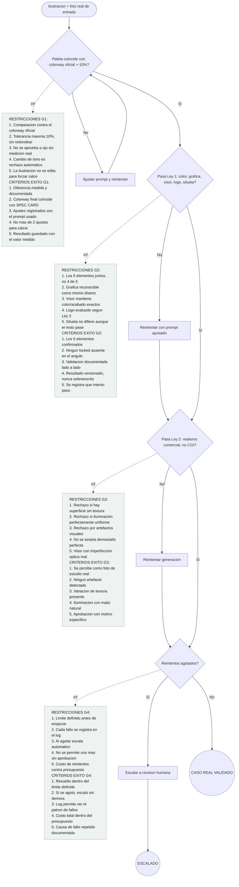

#### Cómo se construye
1. Ya existe el agente — documentar el prompt exacto (Llamada 1 Haiku + Llamada 2 Nano Banana Pro vía OpenRouter) en un solo lugar versionado
2. Formalizar el endpoint ya usado en `codeflow-p1` para que otros pipelines lo llamen, como ya indica el propio documento maestro
3. Agregar el chequeo automático de Ley 1 y Ley 2 como paso posterior a la generación, no como revisión manual
4. Contador de reintentos con límite configurable (ej. máximo 3) y logging a `pipeline_errors`
5. Guardado automático a Supabase Storage apenas se aprueba una imagen
6. Comparador de paleta de color por medición real de luminosidad (librería de procesamiento de imagen), no solo visual
7. Definir umbral medible para "reconocible como el mismo diseño" (Ley 1, gráfica) — comparación de bordes/contornos, no intuición
8. Versionar cada variante en Storage con nombre `{producto_id}_v{n}_angulo`

#### Hallazgos de investigación (mercado real, con fuente citada)

<details><summary>Hallazgo 1 — Caso ASOS+Fermat valida el patrón a escala</summary>

```mermaid
flowchart TD
    START(["Inicio: Boceto de casco EDGE sobre molde"])
    S1["Paso 1: Auditar boceto de casco EDGE sobre molde fisico"]
    S2["Paso 2: Seleccionar subset piloto (10-15 modelos EDGE)"]
    S3["Paso 3: Generar render fotorrealista via Nano Banana Pro/OpenRouter"]
    S4["Paso 4: Medir reduccion de tiempo vs proceso manual"]
    S5["Paso 5: Validar precision de primera muestra fisica"]
    RESULT(["Resultado: Patron ASOS+Fermat replicado y validado en pipeline EDGE"])

    I1["Restricciones:<br/>- Boceto debe incluir vista del molde fisico con referencia de escala<br/>- Resolucion minima de imagen de entrada 2048px<br/>- Formato JPG/PNG sin compresion con perdida severa<br/>- Metadata de color (Pantone/RAL) presente en el boceto<br/>- Angulo de captura del molde frontal +/-15 grados<br/><br/>Metricas de exito:<br/>- 100% de bocetos con resolucion &gt;=2048px aceptados sin reprocesamiento<br/>- Tiempo de auditoria por boceto &lt;=3 minutos<br/>- 95% de bocetos con metadata de color completa<br/>- 90% de bocetos dentro del rango de angulo aceptado<br/>- Tasa de aprobacion en primera pasada &gt;=85%<br/><br/>Metrica de fracaso:<br/>- &gt;20% de bocetos rechazados en primera auditoria por falta de resolucion o metadata"]

    I2["Restricciones:<br/>- Subset piloto limitado a 10-15 modelos de casco EDGE<br/>- Cada modelo con al menos 3 variantes de boceto (frontal, lateral, 3/4)<br/>- Diseñador debe validar boceto antes de someterlo al pipeline<br/>- Presupuesto piloto no debe exceder USD 1,500 (equiv. 1 diseñador 3D)<br/>- Ciclo piloto limitado a 4 semanas calendario<br/><br/>Metricas de exito:<br/>- &gt;=10 modelos procesados en el piloto<br/>- &gt;=3 variantes por modelo (30+ renders totales)<br/>- Costo total piloto &lt;=USD 1,500<br/>- Duracion piloto &lt;=28 dias<br/>- Tasa de aprobacion de diseñador &gt;=80% en primera revision<br/><br/>Metrica de fracaso:<br/>- Costo piloto &gt;USD 1,500 (paridad o superior a diseñador 3D individual)"]

    I3["Restricciones:<br/>- Llamada a API debe especificar modelo nano-banana-pro via OpenRouter<br/>- Resolucion de salida objetivo 4K (3840x2160 o equivalente)<br/>- Tiempo maximo de respuesta por render 60 segundos<br/>- Reintentos automaticos limitados a 3 por fallo de API<br/>- Prompt debe referenciar explicitamente boceto y molde como anchors de identidad<br/><br/>Metricas de exito:<br/>- &gt;=95% de renders generados en &lt;=60 segundos<br/>- Resolucion de salida &gt;=4K en 100% de entregas<br/>- Tasa de exito de API (200 OK) &gt;=98%<br/>- Reduccion de tiempo vs proceso manual &gt;=75% (benchmark ASOS)<br/>- &lt;=3 reintentos promedio por render fallido<br/><br/>Metrica de fracaso:<br/>- Tasa de error de API &gt;5% (timeouts o fallos tras 3 reintentos)"]

    I4["Restricciones:<br/>- Baseline manual medido con el mismo set de 10-15 modelos<br/>- Medicion excluye tiempo de aprobacion humana (solo tiempo tecnico)<br/>- Comparacion usa el mismo diseñador/revisor en ambos procesos<br/>- Ventana de medicion limitada a 2 semanas<br/>- Registro de tiempos por timestamp automatico, no estimado<br/><br/>Metricas de exito:<br/>- Reduccion de tiempo &gt;=75% (piso del rango ASOS 75-80%)<br/>- Baseline manual documentado en 100% de los 10-15 modelos<br/>- Varianza entre mediciones &lt;=10%<br/>- Tiempo promedio por render con IA &lt;=5 minutos<br/>- Tiempo promedio por render manual &gt;=20 minutos (baseline esperado)<br/><br/>Metrica de fracaso:<br/>- Reduccion de tiempo &lt;75% (no alcanza el piso del benchmark ASOS)"]

    I5["Restricciones:<br/>- Muestra fisica fabricada a partir del render aprobado, sin cambios de diseño<br/>- Comparacion contra historico de primeras muestras sin IA<br/>- Evaluacion con al menos 2 revisores independientes (calidad + fit)<br/>- Umbral de aprobacion documentado antes del piloto<br/>- Ciclo de fabricacion de muestra fisica limitado a 15 dias habiles<br/><br/>Metricas de exito:<br/>- Tasa de aprobacion de primera muestra fisica &gt;=70% (mejora vs baseline)<br/>- Reduccion de iteraciones de muestra fisica &gt;=50% vs proceso sin IA<br/>- Tiempo de ciclo de muestra &lt;=15 dias habiles<br/>- Concordancia entre 2 revisores independientes &gt;=90%<br/>- Documentacion de umbral 100% completa antes de iniciar<br/><br/>Metrica de fracaso:<br/>- Tasa de aprobacion de primera muestra fisica &lt;50% (sin mejora vs baseline manual)"]

    START --> S1
    S1 --> S2
    S2 --> S3
    S3 --> S4
    S4 --> S5
    S5 --> RESULT

    S1 -.info.- I1
    S2 -.info.- I2
    S3 -.info.- I3
    S4 -.info.- I4
    S5 -.info.- I5

    classDef step fill:#1f7a6c,color:#ffffff,stroke:#14524a,stroke-width:1px
    classDef info fill:#eef2f0,color:#1a1a1a,stroke:#9db3ac,stroke-width:1px

    class S1,S2,S3,S4,S5 step
    class I1,I2,I3,I4,I5 info
```

</details>

<details><summary>Hallazgo 2 — Nano Banana Pro es la elección correcta</summary>

```mermaid
flowchart TD
    START(["Inicio: Modelo generativo a seleccionar para Etapa 1"])
    S1["Paso 1: Definir criterios de evaluacion de modelos generativos"]
    S2["Paso 2: Benchmarking comparativo Nano Banana Pro vs FLUX.2 Pro vs Midjourney"]
    S3["Paso 3: Seleccionar Nano Banana Pro como modelo primario (FLUX.2 Pro fallback)"]
    S4["Paso 4: Configurar integracion API via OpenRouter"]
    S5["Paso 5: Validar en piloto de produccion controlado"]
    RESULT(["Resultado: Nano Banana Pro confirmado como modelo primario en produccion"])

    I1["Restricciones:<br/>- Criterios deben cubrir 4 dimensiones: edicion in-context, consistencia de identidad, fidelidad 4K, materiales<br/>- Cada criterio con metrica cuantificable asociada, no solo cualitativa<br/>- Casos de prueba con al menos 5 modelos de casco EDGE distintos<br/>- Criterios excluyen explicitamente modelos no aptos para produccion comercial (Midjourney)<br/>- Documento de criterios congelado antes de iniciar benchmarking<br/><br/>Metricas de exito:<br/>- 4 de 4 dimensiones con metrica cuantificable definida<br/>- &gt;=5 modelos de casco distintos en el set de prueba<br/>- 100% de criterios documentados antes de benchmarking<br/>- 0 cambios de criterio durante la fase de prueba<br/>- Tiempo de definicion de criterios &lt;=5 dias habiles<br/><br/>Metrica de fracaso:<br/>- &lt;3 de 4 dimensiones con metrica cuantificable definida"]

    I2["Restricciones:<br/>- Cada modelo evaluado con el mismo set de 5 bocetos<br/>- Fidelidad 4K medida en resolucion de salida real, no interpolada<br/>- Consistencia de identidad evaluada en al menos 3 ediciones sucesivas por imagen<br/>- Precision de materiales evaluada por revisor con experiencia en indumentaria moto<br/>- Benchmarking limitado a 10 dias habiles<br/><br/>Metricas de exito:<br/>- 3 modelos evaluados con el mismo set de 5 bocetos (15+ corridas)<br/>- Fidelidad 4K confirmada en salida real del modelo lider<br/>- Consistencia de identidad evaluada en &gt;=3 ediciones sucesivas por imagen<br/>- Precision de materiales evaluada por &gt;=1 revisor especializado en 100% de casos<br/>- Benchmarking completado en &lt;=10 dias habiles<br/><br/>Metrica de fracaso:<br/>- &gt;1 modelo con resultados incompletos o no comparables al cierre del benchmarking"]

    I3["Restricciones:<br/>- Seleccion basada en desempeño superior en edicion in-context y consistencia de identidad<br/>- FLUX.2 Pro reservado como fallback especifico para materiales/texturas criticas<br/>- Midjourney excluido de cualquier flujo de produccion comercial<br/>- Decision documentada con justificacion cuantitativa del benchmarking<br/>- Cambio de modelo primario post-seleccion requiere nuevo ciclo de benchmarking completo<br/><br/>Metricas de exito:<br/>- Ventaja medible &gt;=1 punto (escala Elo/GPT-4V) sobre FLUX.2 Pro en identidad/in-context<br/>- Fidelidad 4K confirmada en 100% de renders del modelo seleccionado<br/>- 0 casos de uso de Midjourney en flujo de produccion<br/>- Justificacion cuantitativa documentada en 100% de la decision<br/>- Fallback a FLUX.2 Pro definido para &lt;=20% de casos (solo materiales criticos)<br/><br/>Metrica de fracaso:<br/>- Diferencia de desempeño entre modelos &lt;1 punto Elo (seleccion no justificada)"]

    I4["Restricciones:<br/>- Endpoint de submit documentado separado del endpoint de poll/resultado<br/>- Content-Type verificado contra documentacion oficial antes de escribir el body<br/>- Parametro de modelo (nano-banana-pro) fijado en configuracion, no hardcodeado<br/>- Timeout de integracion configurado explicitamente, no default de libreria<br/>- Manejo de errores cubre codigos 4xx y 5xx de forma diferenciada<br/><br/>Metricas de exito:<br/>- 100% de llamadas usan endpoint correcto segun documentacion oficial<br/>- 0 errores de Content-Type en pruebas de integracion<br/>- Timeout configurado explicitamente en 100% de las llamadas<br/>- Tasa de exito de integracion en pruebas &gt;=98%<br/>- Cobertura de manejo de errores &gt;=90% de codigos documentados<br/><br/>Metrica de fracaso:<br/>- Tasa de error de integracion &gt;10% en pruebas por configuracion incorrecta"]

    I5["Restricciones:<br/>- Piloto limitado a subconjunto real de bocetos EDGE en produccion, no sinteticos<br/>- Validacion incluye revision humana final antes de aprobar el render<br/>- Metricas de piloto registradas automaticamente (logging), no manualmente<br/>- Piloto corre en paralelo al proceso manual existente durante la validacion<br/>- Duracion de piloto de produccion limitada a 3 semanas<br/><br/>Metricas de exito:<br/>- &gt;=90% de renders del piloto aprobados en revision humana final<br/>- 100% de metricas de piloto registradas automaticamente<br/>- Reduccion de tiempo de produccion confirmada &gt;=75% respecto al manual<br/>- 0 incidentes de fallo de API no manejados durante el piloto<br/>- Piloto completado dentro de las 3 semanas planificadas<br/><br/>Metrica de fracaso:<br/>- Tasa de aprobacion en revision humana final &lt;70%"]

    START --> S1
    S1 --> S2
    S2 --> S3
    S3 --> S4
    S4 --> S5
    S5 --> RESULT

    S1 -.info.- I1
    S2 -.info.- I2
    S3 -.info.- I3
    S4 -.info.- I4
    S5 -.info.- I5

    classDef step fill:#1f7a6c,color:#ffffff,stroke:#14524a,stroke-width:1px
    classDef info fill:#eef2f0,color:#1a1a1a,stroke:#9db3ac,stroke-width:1px

    class S1,S2,S3,S4,S5 step
    class I1,I2,I3,I4,I5 info
```

</details>

<details><summary>Hallazgo 3 — No existe plugin especializado, hay que construirlo</summary>

```mermaid
flowchart TD
    START(["Inicio: No existe plugin especializado en el nicho"])
    S1["Paso 1: Confirmar ausencia de plugin especializado en el nicho"]
    S2["Paso 2: Evaluar alternativas genericas (Rendair AI, Generative Fill)"]
    S3["Paso 3: Definir arquitectura custom via API (submit/poll separados)"]
    S4["Paso 4: Construir integracion a medida"]
    S5["Paso 5: Documentar decision build vs buy"]
    RESULT(["Resultado: Arquitectura custom via API confirmada como unica via viable"])

    I1["Restricciones:<br/>- Busqueda cubre minimo los marketplaces de Figma y Adobe/Photoshop<br/>- Evaluacion especifica del nicho calzado/indumentaria moto, no generico<br/>- Fuentes verificables (rendair.ai, figma.com, photoshopnews.com)<br/>- Busqueda repetida en al menos 2 fechas distintas para confirmar<br/>- Resultado de 'no existe' documentado con evidencia, no como supuesto<br/><br/>Metricas de exito:<br/>- 100% de marketplaces relevantes revisados<br/>- 0 plugins especializados encontrados en el nicho tras revision<br/>- &gt;=3 fuentes verificables citadas en la confirmacion<br/>- 2 verificaciones en fechas distintas sin cambio de resultado<br/>- Tiempo de confirmacion &lt;=5 dias habiles<br/><br/>Metrica de fracaso:<br/>- 0 fuentes verificables citadas en la confirmacion del gap"]

    I2["Restricciones:<br/>- Evaluacion limitada a alternativas ya identificadas (Rendair AI, Generative Fill con Reference Image)<br/>- Cada alternativa probada con al menos 3 bocetos reales de casco EDGE<br/>- Evaluacion mide consistencia de identidad del producto entre ediciones<br/>- Costo de suscripcion de cada alternativa registrado explicitamente<br/>- Descartar alternativa si no soporta el flujo boceto-sobre-molde especifico<br/><br/>Metricas de exito:<br/>- 2 alternativas genericas evaluadas<br/>- &gt;=3 bocetos de prueba por alternativa (6+ pruebas totales)<br/>- Costo de cada alternativa documentado en 100% de los casos<br/>- Consistencia de identidad medida en las 2 alternativas<br/>- Decision de descarte/adopcion documentada en &lt;=3 dias tras las pruebas<br/><br/>Metrica de fracaso:<br/>- &gt;50% de las pruebas fallan en mantener identidad del producto"]

    I3["Restricciones:<br/>- Arquitectura basada en llamadas directas a API de Nano Banana Pro via OpenRouter<br/>- Separacion explicita entre endpoint de submit y endpoint de poll/resultado<br/>- Arquitectura prevé almacenar status_url/result_url en DB, no reconstruirlo desde task ID<br/>- Diseño independiente de cualquier plugin de terceros (sin lock-in)<br/>- Especificacion revisada antes de iniciar desarrollo<br/><br/>Metricas de exito:<br/>- 100% de llamadas diseñadas con submit y poll separados<br/>- 0 dependencias de plugins de terceros en la arquitectura final<br/>- status_url/result_url almacenado en DB en 100% de los casos de prueba<br/>- Especificacion aprobada en revision previa al desarrollo<br/>- Tiempo de diseño de arquitectura &lt;=7 dias habiles<br/><br/>Metrica de fracaso:<br/>- &gt;1 endpoint de poll reconstruido incorrectamente desde el task ID"]

    I4["Restricciones:<br/>- Content-Type verificado contra documentacion oficial antes de cada body (JSON vs multipart)<br/>- Enum de estados de job en SQL consistente con el codigo de insercion TypeScript<br/>- Reintentos automaticos limitados y con backoff definido<br/>- Manejo de error evita que el job quede indefinidamente en estado intermedio (ej. 'texturing')<br/>- Integracion cubre pruebas unitarias para submit y poll por separado<br/><br/>Metricas de exito:<br/>- 100% de bodies con Content-Type verificado contra documentacion<br/>- 0 inconsistencias entre enum SQL y codigo TypeScript<br/>- Tasa de jobs atascados en estado intermedio 0% en pruebas<br/>- Cobertura de pruebas unitarias &gt;=80% para submit y poll<br/>- Tiempo de desarrollo de integracion &lt;=15 dias habiles<br/><br/>Metrica de fracaso:<br/>- &gt;5% de jobs de prueba quedan en estado intermedio sin resolucion"]

    I5["Restricciones:<br/>- Documento de decision incluye comparacion explicita build vs buy con costos<br/>- Cita la ausencia de plugin especializado como justificacion central<br/>- Documento revisado por al menos 1 stakeholder no tecnico<br/>- Incluye plan de mantenimiento de la integracion custom<br/>- Documento archivado en el repositorio del proyecto<br/><br/>Metricas de exito:<br/>- 100% de la comparacion build vs buy documentada con costos<br/>- &gt;=1 revision de stakeholder no tecnico completada<br/>- Plan de mantenimiento incluido en el 100% del documento<br/>- Documento archivado en el repositorio en &lt;=2 dias tras aprobacion<br/>- 0 dependencias no documentadas de terceros al cierre<br/><br/>Metrica de fracaso:<br/>- 0 revisiones de stakeholder completadas antes de cerrar la decision"]

    START --> S1
    S1 --> S2
    S2 --> S3
    S3 --> S4
    S4 --> S5
    S5 --> RESULT

    S1 -.info.- I1
    S2 -.info.- I2
    S3 -.info.- I3
    S4 -.info.- I4
    S5 -.info.- I5

    classDef step fill:#1f7a6c,color:#ffffff,stroke:#14524a,stroke-width:1px
    classDef info fill:#eef2f0,color:#1a1a1a,stroke:#9db3ac,stroke-width:1px

    class S1,S2,S3,S4,S5 step
    class I1,I2,I3,I4,I5 info
```

</details>

<details><summary>Hallazgo 4 — Métrica objetiva LPIPS + CLIP-I</summary>

```mermaid
flowchart TD
    START(["Inicio: Necesidad de metrica objetiva de fidelidad"])
    S1["Paso 1: Definir umbral LPIPS (0.15-0.25) y metrica CLIP-I complementaria"]
    S2["Paso 2: Instrumentar calculo automatico de LPIPS/CLIP-I por render"]
    S3["Paso 3: Definir protocolo de evaluacion humana Elo con GPT-4V como juez"]
    S4["Paso 4: Establecer umbral de rechazo automatico (LPIPS mayor a 0.35)"]
    S5["Paso 5: Monitoreo continuo y ajuste de umbrales en produccion"]
    RESULT(["Resultado: Control de calidad objetivo LPIPS+CLIP-I+Elo operando en produccion"])

    I1["Restricciones:<br/>- Umbral LPIPS objetivo fijado en el rango 0.15-0.25 (FEAT arXiv 2605.02393)<br/>- CLIP-I usado como metrica complementaria de similitud semantica, no sustituta<br/>- Ambas metricas calculadas sobre el mismo par boceto/molde original vs render<br/>- Definicion de umbrales documentada antes de instrumentar el pipeline<br/>- Umbrales revisados por al menos 1 referencia externa citada<br/><br/>Metricas de exito:<br/>- Umbral LPIPS fijado dentro del rango 0.15-0.25<br/>- Metrica CLIP-I definida y documentada como complementaria<br/>- 100% de pares original vs render identificados para el calculo<br/>- Documentacion de umbrales completada antes de instrumentacion<br/>- &gt;=1 referencia externa citada en la definicion de umbrales<br/><br/>Metrica de fracaso:<br/>- Umbral LPIPS definido fuera del rango 0.15-0.25 sin justificacion documentada"]

    I2["Restricciones:<br/>- Calculo de LPIPS/CLIP-I ejecutado automaticamente tras cada render generado<br/>- Calculo integrado sin agregar mas de 10 segundos al tiempo total del pipeline<br/>- Resultados almacenados en DB asociados al render_id, no en logs efimeros<br/>- Instrumentacion cubre el 100% de los renders generados, no muestreo parcial<br/>- Fallos en el calculo de metricas no bloquean la entrega del render<br/><br/>Metricas de exito:<br/>- 100% de renders con LPIPS y CLIP-I calculados automaticamente<br/>- Overhead de calculo &lt;=10 segundos por render<br/>- 100% de resultados almacenados en DB con render_id asociado<br/>- Tasa de fallo de calculo de metricas &lt;=2%<br/>- Disponibilidad del modulo de metricas &gt;=99%<br/><br/>Metrica de fracaso:<br/>- &gt;10% de renders sin metricas calculadas por fallo del modulo"]

    I3["Restricciones:<br/>- Evaluacion Elo usa GPT-4V como juez consistente entre comparaciones<br/>- Cada render comparado contra al menos 1 par de referencia<br/>- Protocolo fija numero minimo de comparaciones antes de rating Elo estable<br/>- Criterios del juez documentados con rubrica, no solo 'mejor/peor'<br/>- Protocolo validado con panel piloto de al menos 20 renders<br/><br/>Metricas de exito:<br/>- Panel piloto de &gt;=20 renders evaluado con protocolo Elo+GPT-4V<br/>- &gt;=5 comparaciones por render antes de estabilizar el rating Elo<br/>- Rubrica de evaluacion documentada con 100% de criterios explicitos<br/>- Consistencia del juez GPT-4V &gt;=85% en repeticiones de la misma comparacion<br/>- Tiempo de evaluacion por render &lt;=2 minutos<br/><br/>Metrica de fracaso:<br/>- Consistencia del juez GPT-4V &lt;60% en repeticiones"]

    I4["Restricciones:<br/>- Umbral de rechazo automatico fijado en LPIPS mayor a 0.35<br/>- Rechazo automatico activa reproceso o escalamiento a revision humana, no descarte silencioso<br/>- Umbral aplicado de forma consistente en 100% de los renders, sin excepciones no documentadas<br/>- Cambios al umbral requieren aprobacion documentada, no ajuste ad-hoc<br/>- Sistema registra la tasa de rechazo automatico como metrica de monitoreo continuo<br/><br/>Metricas de exito:<br/>- 100% de renders con LPIPS mayor a 0.35 rechazados automaticamente<br/>- 0 excepciones manuales no documentadas al umbral<br/>- Tasa de escalamiento a revision humana tras rechazo &gt;=95%<br/>- Tasa de rechazo automatico registrada en 100% de los ciclos de monitoreo<br/>- Tiempo de reproceso tras rechazo &lt;=5 minutos<br/><br/>Metrica de fracaso:<br/>- Tasa de rechazo automatico &gt;30% de los renders"]

    I5["Restricciones:<br/>- Monitoreo continuo revisa distribucion de LPIPS/CLIP-I al menos semanalmente<br/>- Ajustes de umbral basados en datos acumulados, no en casos aislados<br/>- Registro historico de al menos 90 dias de metricas para detectar deriva<br/>- Alertas automaticas configuradas si la tasa de rechazo supera un umbral definido<br/>- Cualquier ajuste de umbral documentado con justificacion estadistica<br/><br/>Metricas de exito:<br/>- Revision semanal de distribucion de metricas completada en 100% de las semanas<br/>- Historico de metricas mantenido por &gt;=90 dias<br/>- Alertas automaticas configuradas y probadas en 100% de los casos<br/>- Ajustes de umbral documentados en 100% de los cambios realizados<br/>- Tiempo de deteccion de deriva &lt;=7 dias desde que ocurre<br/><br/>Metrica de fracaso:<br/>- Deriva de metricas no detectada por mas de 30 dias"]

    START --> S1
    S1 --> S2
    S2 --> S3
    S3 --> S4
    S4 --> S5
    S5 --> RESULT

    S1 -.info.- I1
    S2 -.info.- I2
    S3 -.info.- I3
    S4 -.info.- I4
    S5 -.info.- I5

    classDef step fill:#1f7a6c,color:#ffffff,stroke:#14524a,stroke-width:1px
    classDef info fill:#eef2f0,color:#1a1a1a,stroke:#9db3ac,stroke-width:1px

    class S1,S2,S3,S4,S5 step
    class I1,I2,I3,I4,I5 info
```

</details>

<details><summary>Hallazgo 5 — Diferencial de costo ~100-200x vs diseñador 3D</summary>

```mermaid
flowchart TD
    START(["Inicio: Diferencial de costo IA vs diseñador 3D"])
    S1["Paso 1: Establecer baseline de costo IA vs diseñador 3D"]
    S2["Paso 2: Modelar diferencial de costo esperado (100-200x)"]
    S3["Paso 3: Instrumentar registro de retrabajo (reintentos, rechazos LPIPS)"]
    S4["Paso 4: Calcular costo real efectivo (directo + retrabajo)"]
    S5["Paso 5: Definir umbral de retrabajo aceptable"]
    RESULT(["Resultado: Modelo de costo real validado frente al diferencial teorico 100-200x"])

    I1["Restricciones:<br/>- Costo de render IA registrado por imagen: rango USD 0.50-10 o prorrateo de suscripcion USD 10-120/mes<br/>- Costo de diseñador 3D freelance tomado del rango USD 200-1,500+ por imagen<br/>- Ambos costos expresados en la misma unidad (costo por imagen final aprobada)<br/>- Fuente de los rangos documentada (3daistudio.com, cadcrowd.com)<br/>- Baseline fijado antes de iniciar cualquier comparacion de volumen<br/><br/>Metricas de exito:<br/>- Costo IA documentado dentro del rango USD 0.50-10/imagen o equivalente de suscripcion<br/>- Costo diseñador 3D documentado dentro del rango USD 200-1,500+/imagen<br/>- 100% de costos expresados en la misma unidad<br/>- 2 fuentes citadas para los rangos de costo<br/>- Baseline de costo fijado antes de la fase de modelado (100% completado)<br/><br/>Metrica de fracaso:<br/>- Variacion entre fuentes de costo &gt;50% sin reconciliacion documentada"]

    I2["Restricciones:<br/>- Modelo de diferencial usa el rango 100-200x como referencia central, no un unico punto<br/>- Volumen de produccion EDGE estimado en imagenes/mes para proyectar ahorro total<br/>- Modelo considera escenario de suscripcion (USD 10-120/mes) vs pago por imagen (USD 0.50-10)<br/>- Proyeccion expresada en ahorro absoluto y porcentual, no solo el multiplicador<br/>- Modelo revisado con al menos 1 escenario de sensibilidad (volumen alto/bajo)<br/><br/>Metricas de exito:<br/>- Diferencial modelado dentro del rango 100-200x confirmado<br/>- Volumen mensual estimado con &gt;=1 fuente interna (historico de bocetos)<br/>- 2 escenarios de costo modelados (suscripcion vs por imagen)<br/>- Ahorro absoluto y porcentual calculado para el 100% de los escenarios<br/>- &gt;=1 escenario de sensibilidad incluido en el modelo<br/><br/>Metrica de fracaso:<br/>- Diferencial calculado &lt;50x en el escenario real"]

    I3["Restricciones:<br/>- Cada reintento o re-render registrado como evento con costo asociado (tiempo + costo de API)<br/>- Rechazos por LPIPS mayor a 0.35 contados explicitamente como retrabajo<br/>- Registro incluye numero de iteraciones hasta la aprobacion final por render<br/>- Instrumentacion cubre el 100% del volumen de produccion, no una muestra<br/>- Se distingue retrabajo por fallo tecnico (API) de retrabajo por rechazo de calidad<br/><br/>Metricas de exito:<br/>- 100% de reintentos/re-renders registrados con costo asociado<br/>- 100% de rechazos LPIPS mayor a 0.35 contabilizados como retrabajo<br/>- Iteraciones promedio hasta aprobacion final calculadas para el 100% de los renders<br/>- Cobertura de instrumentacion del 100% del volumen de produccion<br/>- Distincion entre retrabajo tecnico y de calidad documentada en 100% de los eventos<br/><br/>Metrica de fracaso:<br/>- &gt;30% de eventos de retrabajo sin costo asociado registrado"]

    I4["Restricciones:<br/>- Costo real efectivo suma costo directo de API/suscripcion + costo de retrabajo instrumentado<br/>- Calculo hecho por imagen final aprobada, no por intento individual<br/>- Comparacion contra el diferencial teorico 100-200x actualizada mensualmente<br/>- Se reporta el punto en que el costo real se acerca al costo del diseñador 3D (paridad)<br/>- Calculo auditado por al menos 1 revisor financiero/operativo<br/><br/>Metricas de exito:<br/>- Costo real efectivo calculado para el 100% de las imagenes aprobadas del periodo<br/>- Comparacion contra diferencial teorico actualizada mensualmente (12 veces/año)<br/>- Diferencial real mantenido &gt;=20x sobre diseñador 3D (piso de viabilidad economica)<br/>- Punto de paridad identificado y reportado en 100% de los ciclos<br/>- &gt;=1 auditoria de calculo por revisor financiero completada por trimestre<br/><br/>Metrica de fracaso:<br/>- Diferencial real cae por debajo de 10x respecto al diseñador 3D"]

    I5["Restricciones:<br/>- Umbral de retrabajo aceptable definido como % maximo de re-renders por imagen aprobada<br/>- Umbral fijado antes de que el costo real erosione el diferencial por debajo del piso del paso 4<br/>- Decision documentada con el calculo que la respalda, no discrecional<br/>- Se define accion de contingencia si se supera el umbral (ej. pausar y revisar prompt/modelo)<br/>- Revision del umbral programada al menos trimestralmente<br/><br/>Metricas de exito:<br/>- Umbral de retrabajo aceptable definido y documentado (ej. &lt;=2 re-renders promedio por imagen)<br/>- 100% de los ciclos con calculo de respaldo documentado<br/>- Accion de contingencia definida y probada en &gt;=1 simulacro<br/>- Revision trimestral del umbral completada (4 veces/año)<br/>- Tasa de cumplimiento del umbral &gt;=90% de los meses evaluados<br/><br/>Metrica de fracaso:<br/>- Umbral de retrabajo superado en mas de 3 meses consecutivos sin accion de contingencia"]

    START --> S1
    S1 --> S2
    S2 --> S3
    S3 --> S4
    S4 --> S5
    S5 --> RESULT

    S1 -.info.- I1
    S2 -.info.- I2
    S3 -.info.- I3
    S4 -.info.- I4
    S5 -.info.- I5

    classDef step fill:#1f7a6c,color:#ffffff,stroke:#14524a,stroke-width:1px
    classDef info fill:#eef2f0,color:#1a1a1a,stroke:#9db3ac,stroke-width:1px

    class S1,S2,S3,S4,S5 step
    class I1,I2,I3,I4,I5 info
```

</details>
</details>

<details>
<summary><strong>Etapa 2 — Turntable / fotografía de producto</strong> (ya funciona)</summary>

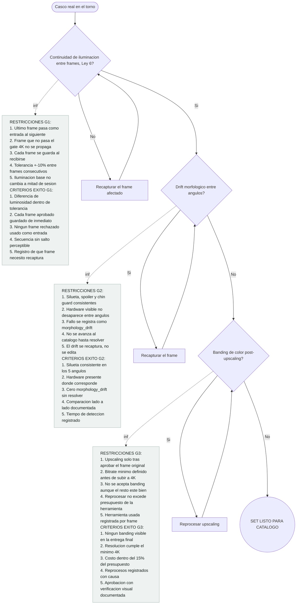

#### Cómo se construye
1. Documentar el setup físico actual del torno (cámara, iluminación) como checklist repetible, no tácito
2. Script que dispara la captura de cada ángulo en secuencia y la sube automáticamente a Supabase
3. Chequeo de continuidad (Ley 6): función simple de diferencia de histograma de luminosidad entre frame N y N+1
4. Conectar la herramienta de upscaling vía su API si la tiene, o dejarlo como paso manual documentado si no
5. Detector de banding: revisar gradientes de color sospechosos en zonas planas de la imagen
6. Función que combina los frames en un solo contact sheet de referencia automáticamente
7. Etiquetar y guardar cada sesión con metadata de costo real (tiempo + herramienta usada)

#### Hallazgos de investigación (mercado real, con fuente citada)

<details><summary>Hallazgo 1 — PhotoRobot: precedente directo para cascos</summary>

```mermaid
flowchart TD
    PR_START(["Inicio: Etapa 2 — Turntable/fotografía de producto (cascos EDGE)"])
    PR1["Paso 1: Montar el casco suspendido con hilo de nylon desde la correa de seguridad<br/>(sin soporte físico visible en cámara)"]
    PRI1["Restricciones:<br/>1. El hilo de nylon debe sujetar desde la correa, sin tocar la carcasa ni el visor<br/>2. El casco debe quedar boca abajo y centrado en el eje de rotación del torno<br/>3. El punto de anclaje no puede ser visible desde ningún ángulo de captura<br/>4. El montaje se prueba con 1 casco de referencia antes de escalar a producción<br/>5. El armado del montaje no puede exceder el tiempo asignado por SKU<br/><br/>Métricas de éxito:<br/>1. Tiempo de montaje por casco ≤3 minutos<br/>2. 0 puntos de anclaje visibles en el encuadre de cámara<br/>3. Centrado en el eje de rotación con desviación ≤2°<br/>4. 100% de montajes probados contra el casco de referencia antes de producción<br/>5. Repetibilidad del montaje entre SKUs ≥95%<br/><br/>Métrica de fracaso:<br/>Soporte o hilo visible en el encuadre en más del 5% de los frames capturados"]
    PR2["Paso 2: Configurar el torno PhotoRobot para rotación 360° en pasos discretos"]
    PRI2["Restricciones:<br/>1. Configuración replica el precedente documentado (photorobot.com/outputs/rsa-motorcycle-helmet)<br/>2. Paso de rotación fijo para obtener 36 frames uniformes en la vuelta completa<br/>3. Iluminación configurada antes de iniciar, sin cambios a mitad de sesión (Ley 6)<br/>4. Velocidad del torno no puede generar motion blur perceptible<br/>5. Configuración guardada como preset reutilizable para el mismo tipo de casco<br/><br/>Métricas de éxito:<br/>1. 36 frames configurados a intervalos angulares iguales (10° por frame)<br/>2. 0 cambios de iluminación detectados entre frames<br/>3. Preset de configuración reutilizado en ≥90% de sesiones del mismo tipo<br/>4. Motion blur detectado en 0% de los frames de prueba<br/>5. Tiempo de configuración inicial ≤10 minutos<br/><br/>Métrica de fracaso:<br/>Intervalo angular entre frames con desviación mayor al 10% respecto al preset"]
    PR3["Paso 3: Capturar la secuencia completa de 36 frames en menos de 2 minutos"]
    PRI3["Restricciones:<br/>1. Los 36 frames se capturan en una sola pasada continua, sin pausas manuales<br/>2. Cada frame se revisa en vivo antes de aceptar la sesión como completa<br/>3. Frame con soporte visible o desenfoque se recaptura antes de cerrar la sesión<br/>4. Tiempo total de captura no excede el benchmark documentado de ~1 minuto a 2 minutos<br/>5. Metadata de sesión (hora, casco, operador) se guarda junto con los frames<br/><br/>Métricas de éxito:<br/>1. Tiempo total de captura de los 36 frames ≤2 minutos<br/>2. 36/36 frames aceptados en la revisión en vivo<br/>3. 0 recapturas necesarias por soporte visible o desenfoque<br/>4. 100% de sesiones con metadata completa guardada<br/>5. Consistencia de tiempo entre sesiones con varianza ≤15%<br/><br/>Métrica de fracaso:<br/>Tiempo de captura por sesión mayor a 5 minutos (5x el benchmark documentado)"]
    PR4["Paso 4: Post-producción: retirar digitalmente el hilo de nylon de cada frame"]
    PRI4["Restricciones:<br/>1. Retoque aplicado a los 36 frames de la sesión, sin excepciones<br/>2. Ningún retoque puede alterar la silueta, spoiler o chin guard del casco (Ley 1)<br/>3. Proceso de retoque documentado como paso repetible, no artesanal por sesión<br/>4. Tiempo de retoque por sesión debe mantenerse compatible con el volumen de catálogo<br/>5. Frame con retoque insuficiente se reprocesa antes de pasar a validación<br/><br/>Métricas de éxito:<br/>1. 36/36 frames con hilo de nylon retirado por sesión<br/>2. 0 alteraciones detectadas en silueta/spoiler/chin guard tras el retoque<br/>3. Tiempo de retoque por sesión ≤15 minutos<br/>4. 0 frames con rastro visible de hilo tras revisión final<br/>5. Reprocesos por retoque insuficiente ≤5% de los frames<br/><br/>Métrica de fracaso:<br/>Rastro de hilo o soporte visible en más de 1 de los 36 frames tras el retoque"]
    PR5["Paso 5: Validar consistencia del set de 36 frames y aprobar para catálogo"]
    PRI5["Restricciones:<br/>1. Validación cubre continuidad de iluminación entre los 36 frames (Ley 6)<br/>2. Validación confirma ausencia total de soporte/hilo visible en el set completo<br/>3. Comparación lado a lado contra el casco de referencia antes de aprobar<br/>4. Set no se aprueba parcialmente; los 36 frames pasan juntos o se recaptura la sesión<br/>5. Resultado de validación documentado antes de escalar el montaje a más SKUs<br/><br/>Métricas de éxito:<br/>1. 36/36 frames aprobados en la validación final<br/>2. 0 casos de soporte visible detectados en el set aprobado<br/>3. Tiempo total de sesión (montaje+captura+retoque+validación) ≤10 minutos por SKU<br/>4. Costo por SKU dentro del rango de escalabilidad esperado para catálogo completo<br/>5. 100% de sets aprobados con documentación de validación adjunta<br/><br/>Métrica de fracaso:<br/>Más del 10% de las sesiones requieren recaptura completa por fallo de validación"]
    RESULT(["Resultado: Turntable escalable a catálogo completo (36 frames, ≤10 min/SKU, sin soporte visible)"])

    PR_START --> PR1
    PR1 -.info.- PRI1
    PR1 --> PR2
    PR2 -.info.- PRI2
    PR2 --> PR3
    PR3 -.info.- PRI3
    PR3 --> PR4
    PR4 -.info.- PRI4
    PR4 --> PR5
    PR5 -.info.- PRI5
    PR5 --> RESULT

    classDef step fill:#1f7a6c,color:#ffffff,stroke:#14524a,stroke-width:1px;
    classDef info fill:#eef2f0,color:#16211f,stroke:#9db3ac,stroke-width:1px;
    class PR1,PR2,PR3,PR4,PR5 step;
    class PRI1,PRI2,PRI3,PRI4,PRI5 info;
```

</details>

<details><summary>Hallazgo 2 — Case study Photta (fuente de proveedor, no verificada)</summary>

```mermaid
flowchart TD
    ST2(["Inicio: Etapa 2 — Turntable/fotografía de producto (cascos EDGE)"])
    Q1["Paso 1: Recopilar case study Photta/Aura & Co<br/>(fuente: photta.app/blog)"]
    Q2["Paso 2: Clasificar la fuente<br/>como marketing de proveedor, no auditoría independiente"]
    Q3["Paso 3: Diseñar prueba piloto interna<br/>con datos propios de EDGE"]
    Q4["Paso 4: Ejecutar piloto<br/>comparando costo/turnaround/conversión real vs. cifras reportadas"]
    Q5["Paso 5: Decidir adopción<br/>condicionada a resultados propios, no al case study"]
    END2(["Resultado: adopción de Photta aprobada/rechazada<br/>según piloto verificado internamente"])

    IQ1["Restricciones:<br/>1. Única fuente es el blog oficial del proveedor, sin tercero independiente<br/>2. Sin acceso al cliente real Aura & Co para verificación directa<br/>3. Cifras de -85% costo y 14 días→30s sin metodología publicada<br/>4. +31% conversión sin período de medición ni tamaño de muestra<br/>5. Sin datos crudos de antes/después del caso reportado<br/>Métricas de éxito:<br/>1. 4 cifras clave documentadas (costo, turnaround, conversión, cliente)<br/>2. 1 fuente primaria citada y trazable<br/>3. 100% de las cifras etiquetadas con su origen (proveedor vs tercero)<br/>4. 1 checklist de verificación creado por cifra reportada<br/>5. 0 cifras aceptadas sin marcar como no verificadas<br/>Métrica de fracaso:<br/>1. Adoptar cualquiera de las 4 cifras sin marcarla como no verificada"]
    IQ2["Restricciones:<br/>1. Conflicto de interés inherente: el proveedor publica sus propios resultados<br/>2. Sin estándar de auditoría o certificación de terceros mencionado<br/>3. Ausencia de comparables de otros clientes de Photta publicados<br/>4. Riesgo de sesgo de selección (mejor caso del proveedor)<br/>5. Sin acceso a términos comerciales reales del caso ($150-200 podría no ser el precio de EDGE)<br/>Métricas de éxito:<br/>1. 100% de las cifras marcadas como fuente no independiente<br/>2. 0 decisiones de presupuesto basadas únicamente en el case study<br/>3. 1 clasificación de riesgo asignada a cada cifra<br/>4. 3 alternativas de verificación identificadas<br/>5. 1 documento de reservas técnicas circulado antes de decisión de compra<br/>Métrica de fracaso:<br/>1. Presentar el -85% de ahorro como cifra confirmada en cualquier reporte interno"]
    IQ3["Restricciones:<br/>1. Piloto requiere al menos 1 mes de datos propios para comparar el costo mensual<br/>2. Necesita set de SKUs EDGE representativo, no solo 1 producto<br/>3. Turnaround de 30s debe medirse con el mismo tipo de output que reporta Photta<br/>4. Requiere línea base de costo actual de EDGE para comparar el -85%<br/>5. Conversión (+31%) requiere tráfico suficiente para significancia estadística<br/>Métricas de éxito:<br/>1. Al menos 5 SKUs EDGE incluidos en el piloto<br/>2. 1 mes de datos de costo comparados contra la línea base<br/>3. Turnaround medido en segundos por asset generado<br/>4. 1 línea base de costo mensual documentada antes del piloto<br/>5. Al menos 100 sesiones de usuario para medir conversión<br/>Métrica de fracaso:<br/>1. Piloto con menos de 5 SKUs o menos de 100 sesiones invalida la comparación"]
    IQ4["Restricciones:<br/>1. Turnaround debe medirse end-to-end, no solo el paso de IA<br/>2. Costo real debe incluir suscripción + tiempo de operador<br/>3. Conversión debe aislarse de otras variables de marketing en paralelo<br/>4. Requiere entorno A/B controlado para atribuir el cambio<br/>5. Sin garantía de que el resultado de Aura & Co replique en categoría cascos (alta implicación)<br/>Métricas de éxito:<br/>1. Turnaround propio en segundos comparado contra los 30s reportados<br/>2. Costo mensual propio en dólares comparado contra $150-200<br/>3. Conversión propia medida en % contra grupo de control<br/>4. 1 prueba A/B con al menos 2 variantes<br/>5. 100% de métricas propias con metodología reproducible<br/>Métrica de fracaso:<br/>1. Diferencia mayor a 50% entre cifra propia y cifra reportada en cualquier métrica clave"]
    IQ5["Restricciones:<br/>1. Adopción no puede basarse en cifras del proveedor sin piloto propio<br/>2. Debe considerarse riesgo reputacional de imagen IA en alta implicación (Hallazgo 4)<br/>3. Contrato de Photta debe revisarse por condiciones de salida/cancelación<br/>4. Requiere aprobación de presupuesto basada en el piloto, no en el case study<br/>5. Debe compararse contra alternativa de costo cero (Blender, Hallazgo 3)<br/>Métricas de éxito:<br/>1. 1 decisión formal documentada (adoptar/rechazar)<br/>2. 100% del piloto de 5 SKUs completado antes de decidir<br/>3. Comparación de costo con al menos 2 alternativas<br/>4. 1 revisión de contrato completada antes de firma<br/>5. 0 cifras del case study citadas como justificación única<br/>Métrica de fracaso:<br/>1. Firmar contrato anual sin al menos 1 ciclo de piloto propio completado"]

    ST2 --> Q1
    Q1 -.info.- IQ1
    Q1 --> Q2
    Q2 -.info.- IQ2
    Q2 --> Q3
    Q3 -.info.- IQ3
    Q3 --> Q4
    Q4 -.info.- IQ4
    Q4 --> Q5
    Q5 -.info.- IQ5
    Q5 --> END2

    classDef step fill:#1f7a6c,color:#ffffff,stroke:#14524a,stroke-width:1px;
    classDef info fill:#eef2f0,color:#2b332f,stroke:#9db3ac,stroke-width:1px;
    class Q1,Q2,Q3,Q4,Q5 step
    class IQ1,IQ2,IQ3,IQ4,IQ5 info
```

</details>

<details><summary>Hallazgo 3 — Blender/render 3D local, costo cero</summary>

```mermaid
flowchart TD
    ST3(["Inicio: Etapa 2 — Turntable/fotografía de producto (cascos EDGE)"])
    R1["Paso 1: Evaluar addon Turntable Camera<br/>para automatizar keyframing de rotación 360°"]
    R2["Paso 2: Configurar escena<br/>(modelo 3D del casco + HDRI de iluminación)"]
    R3["Paso 3: Seleccionar motor de render<br/>(Eevee vs Cycles) según velocidad/look bajo HDRI"]
    R4["Paso 4: Ejecutar render local<br/>de 150-300 frames a 1080p en GPU RTX 3060+"]
    R5["Paso 5: Validar tiempo de render (15min-2h)<br/>y calidad de salida"]
    END3(["Resultado: turntable 3D renderizado localmente,<br/>costo de software $0"])

    IR1["Restricciones:<br/>1. Requiere modelo 3D del casco ya existente (dependiente de Etapa 1/Meshy)<br/>2. Addon en extensions.blender.org, debe validarse compatibilidad de versión<br/>3. Keyframing debe ajustarse a 360° exactos sin overshoot<br/>4. Curva de aprendizaje de Blender sin capacitación previa documentada<br/>5. BlenderKit como fuente adicional no garantiza compatibilidad directa con el addon<br/>Métricas de éxito:<br/>1. 1 addon instalado y funcional<br/>2. 360° de rotación automatizada en 1 solo keyframe set<br/>3. 0 ajustes manuales de cámara requeridos tras la configuración inicial<br/>4. 100% de compatibilidad confirmada con la versión de Blender<br/>5. Configuración inicial completada en menos de 30 minutos<br/>Métrica de fracaso:<br/>1. Configuración del addon falla en más de 1 de cada 5 intentos"]
    IR2["Restricciones:<br/>1. Requiere HDRI adecuado al look de marca EDGE, no incluido por defecto<br/>2. Modelo 3D debe tener escala y materiales correctos (dependencia de modelado previo)<br/>3. Escena debe replicarse idéntica para cada SKU (consistencia de marca)<br/>4. Resolución de HDRI no especificada en la fuente, debe definirse aparte<br/>5. Requiere validar ausencia de errores de geometría (normales invertidas, huecos)<br/>Métricas de éxito:<br/>1. 1 escena base reutilizable para todos los SKUs<br/>2. 1 HDRI validado y aprobado para el look de marca<br/>3. 0 errores de geometría detectados antes de render<br/>4. 100% de consistencia de iluminación entre SKUs<br/>5. Setup de escena por SKU menor a 15 minutos<br/>Métrica de fracaso:<br/>1. Más de 1 error de geometría no corregido invalida el output completo"]
    IR3["Restricciones:<br/>1. Eevee más rápido pero puede sacrificar fidelidad bajo ciertos HDRI<br/>2. Cycles mayor fidelidad pero mayor tiempo de render<br/>3. Elección depende del hardware disponible (RTX 3060+ mínimo)<br/>4. Sin benchmark propio de EDGE comparando ambos motores con el modelo real<br/>5. Decisión afecta directamente el rango total de 15min-2h<br/>Métricas de éxito:<br/>1. 1 comparación directa Eevee vs Cycles con el mismo frame<br/>2. Tiempo de render por frame medido en segundos para ambos motores<br/>3. 0 diferencias perceptibles de calidad aceptadas como criterio final<br/>4. 100% de renders de producción con el motor seleccionado de forma consistente<br/>5. Reducción de tiempo total de al menos 30% eligiendo el motor más rápido válido<br/>Métrica de fracaso:<br/>1. Motor seleccionado produce tiempo de render superior a 2 horas por spin de 300 frames"]
    IR4["Restricciones:<br/>1. Rango 150-300 frames implica decidir conteo exacto por SKU antes de renderizar<br/>2. Requiere GPU RTX 3060+; hardware inferior puede no cumplir el rango de tiempo<br/>3. Render local depende de disponibilidad de la máquina, sin cola en la nube<br/>4. 1080p debe validarse contra el uso final (web, marketplace, etc.)<br/>5. Tiempo de render compite por recursos con otras tareas si se corre en la misma máquina<br/>Métricas de éxito:<br/>1. 150 a 300 frames renderizados por spin completo<br/>2. Resolución de 1080p confirmada en el 100% de los frames<br/>3. Tiempo de render entre 15 minutos y 2 horas por SKU<br/>4. 0 frames corruptos o faltantes en la secuencia final<br/>5. 1 GPU RTX 3060+ validada cumpliendo el benchmark de tiempo<br/>Métrica de fracaso:<br/>1. Tiempo de render superior a 4 horas por SKU hace inviable el uso en producción"]
    IR5["Restricciones:<br/>1. Validación de calidad requiere criterio visual definido (consistencia con fotografía real)<br/>2. Sin benchmark de calidad cuantitativo en la fuente, debe crearse checklist propio<br/>3. Costo de software es $0 pero no incluye costo de hardware/tiempo de operador<br/>4. Requiere comparación directa contra Hallazgo 5 (costo real de mercado)<br/>5. Consistencia entre SKUs debe verificarse antes de escalar a toda la línea EDGE<br/>Métricas de éxito:<br/>1. $0 de costo de licencia de software confirmado<br/>2. 100% de los frames pasando el checklist de calidad visual<br/>3. Tiempo total dentro del rango 15min-2h en al menos 3 pruebas<br/>4. 1 comparación de costo publicada frente a físico y frente a Photta/IA<br/>5. 0 SKUs rechazados por defectos de render en el primer lote<br/>Métrica de fracaso:<br/>1. Más de 1 de cada 5 SKUs requiere re-render completo por defectos de calidad"]

    ST3 --> R1
    R1 -.info.- IR1
    R1 --> R2
    R2 -.info.- IR2
    R2 --> R3
    R3 -.info.- IR3
    R3 --> R4
    R4 -.info.- IR4
    R4 --> R5
    R5 -.info.- IR5
    R5 --> END3

    classDef step fill:#1f7a6c,color:#ffffff,stroke:#14524a,stroke-width:1px;
    classDef info fill:#eef2f0,color:#2b332f,stroke:#9db3ac,stroke-width:1px;
    class R1,R2,R3,R4,R5 step
    class IR1,IR2,IR3,IR4,IR5 info
```

</details>

<details><summary>Hallazgo 4 — Evidencia académica: cascos son "alta implicación", penalización de imagen 100% IA</summary>

```mermaid
flowchart TD
    ST4(["Inicio: Etapa 2 — Turntable/fotografía de producto (cascos EDGE)"])
    S1["Paso 1: Revisar estudio peer-reviewed<br/>(Belanche/Ibáñez-Sánchez, International Journal of Information Management)"]
    S2["Paso 2: Clasificar cascos<br/>como categoría de alta implicación/hedónica"]
    S3["Paso 3: Evaluar riesgo de percepción de marca<br/>si se usa imagen 100% IA"]
    S4["Paso 4: Definir política de mezcla<br/>(IA + elementos reales/verificación humana)"]
    S5["Paso 5: Validar percepción de marca<br/>con prueba de usuario antes de escalar producción 100% IA"]
    END4(["Resultado: política de uso de IA en imagen de producto<br/>ajustada al riesgo de categoría alta implicación"])

    IS1["Restricciones:<br/>1. Estudio es académico general, no específico de cascos de moto<br/>2. Publicado en sciencedirect.com, acceso puede requerir licencia institucional<br/>3. Metodología del estudio no detallada en el resumen disponible<br/>4. Repositorio zaguan.unizar.es puede ser preprint distinto a la versión publicada<br/>5. Sin dato específico sobre cascos de seguridad como producto testeado<br/>Métricas de éxito:<br/>1. 1 estudio peer-reviewed citado con fuente completa<br/>2. 2 fuentes cruzadas confirmando el hallazgo<br/>3. 100% de conclusiones atribuidas correctamente a los autores<br/>4. 1 resumen ejecutivo interno circulado al equipo de marketing<br/>5. 0 afirmaciones del estudio tergiversadas sin matiz<br/>Métrica de fracaso:<br/>1. Citar el estudio como aplicable directamente a cascos sin la salvedad de categoría"]
    IS2["Restricciones:<br/>1. Clasificación de alta implicación para cascos es inferencia razonada, no dato explícito<br/>2. Seguridad puede combinar alta implicación funcional y hedónica, requiere justificar ambas<br/>3. Sin validación de mercado propia que confirme esta clasificación<br/>4. Categorías del estudio pueden no mapear 1:1 con la segmentación de EDGE<br/>5. Riesgo de sobregeneralizar conclusiones de otras categorías hedónicas<br/>Métricas de éxito:<br/>1. 1 justificación documentada de por qué casco = alta implicación<br/>2. 2 criterios usados para la clasificación<br/>3. 100% del equipo de marketing alineado antes de definir política<br/>4. 1 comparación con al menos 1 categoría similar del estudio<br/>5. 0 decisiones de producción tomadas antes de confirmar la clasificación<br/>Métrica de fracaso:<br/>1. Tratar el casco como categoría de bajo riesgo de percepción"]
    IS3["Restricciones:<br/>1. El riesgo de menor credibilidad es tendencia estadística, no certeza por SKU<br/>2. Sin dato de cuánto cae la conversión específicamente en cascos por IA 100%<br/>3. Riesgo reputacional más difícil de revertir que un ajuste de costo<br/>4. Contradice parcialmente el caso Photta (+31% conversión, otra categoría)<br/>5. Sin datos propios de percepción de marca EDGE antes de introducir IA<br/>Métricas de éxito:<br/>1. 1 evaluación de riesgo documentada antes de lanzar imagen 100% IA<br/>2. 0% de imagen 100% IA en hero sin prueba de percepción previa<br/>3. 1 comparación entre hallazgo académico y case study Photta con diferencias anotadas<br/>4. 100% de assets IA marcados para seguimiento de percepción<br/>5. 1 métrica de percepción de marca definida como línea base<br/>Métrica de fracaso:<br/>1. Caída de más del 10% en percepción de credibilidad tras introducir IA sin mitigación"]
    IS4["Restricciones:<br/>1. Mezclar IA con elementos reales incrementa complejidad operativa<br/>2. Requiere definir qué partes del asset deben ser reales<br/>3. Sin framework probado de cuánta IA es aceptable<br/>4. Debe coordinarse con Etapa 3 (Meshy/Higgsfield) sin romper consistencia<br/>5. Política debe ser auditable (demostrar qué fue generado por IA)<br/>Métricas de éxito:<br/>1. 1 política escrita de mezcla IA/real aprobada<br/>2. Al menos 2 niveles de mezcla definidos<br/>3. 0 ambigüedades sobre qué SKUs usan qué nivel<br/>4. 100% de assets etiquetados con su nivel de política aplicado<br/>5. 1 revisión trimestral programada de la política<br/>Métrica de fracaso:<br/>1. Lanzar más del 50% del catálogo en 100% IA sin política de mezcla definida"]
    IS5["Restricciones:<br/>1. Prueba requiere muestra representativa del público objetivo (motociclistas)<br/>2. Sin línea base de percepción de marca previa a introducir IA<br/>3. Prueba debe aislar la variable origen del asset de otras variables de campaña<br/>4. Tiempo y costo de la prueba compite con la velocidad que promete la IA<br/>5. Resultados pueden variar según canal (marketplace, sitio propio, redes)<br/>Métricas de éxito:<br/>1. Al menos 100 encuestados en la prueba de percepción<br/>2. 2 variantes comparadas (100% IA vs físico/mixto)<br/>3. Diferencia de percepción de credibilidad medida en puntos porcentuales<br/>4. 100% de resultados documentados antes de escalar al catálogo<br/>5. 1 umbral de aceptación definido antes de la prueba<br/>Métrica de fracaso:<br/>1. Diferencia de credibilidad mayor a 15% en contra del asset IA bloquea el escalamiento"]

    ST4 --> S1
    S1 -.info.- IS1
    S1 --> S2
    S2 -.info.- IS2
    S2 --> S3
    S3 -.info.- IS3
    S3 --> S4
    S4 -.info.- IS4
    S4 --> S5
    S5 -.info.- IS5
    S5 --> END4

    classDef step fill:#1f7a6c,color:#ffffff,stroke:#14524a,stroke-width:1px;
    classDef info fill:#eef2f0,color:#2b332f,stroke:#9db3ac,stroke-width:1px;
    class S1,S2,S3,S4,S5 step
    class IS1,IS2,IS3,IS4,IS5 info
```

</details>

<details><summary>Hallazgo 5 — Costo real de mercado por SKU</summary>

```mermaid
flowchart TD
    ST5(["Inicio: Etapa 2 — Turntable/fotografía de producto (cascos EDGE)"])
    T1["Paso 1: Levantar costos de estudio físico tradicional<br/>($75-200/producto o $500-2,500/media jornada + $500-2,000/día de renta)"]
    T2["Paso 2: Calcular costo efectivo real<br/>incluyendo retoque y logística (~2x la cotización inicial)"]
    T3["Paso 3: Levantar costos de alternativa IA<br/>($99-200/mes o $0.50-2/imagen)"]
    T4["Paso 4: Levantar costo de alternativa Blender<br/>(licencia $0, costo real = hardware/tiempo operador)"]
    T5["Paso 5: Comparar las 3 alternativas<br/>y seleccionar mezcla óptima de costo por línea de producto"]
    END5(["Resultado: estructura de costo por SKU definida<br/>(físico vs IA vs Blender) para Etapa 2"])

    IT1["Restricciones:<br/>1. Rango $75-200/producto es cotización base, no incluye variables de complejidad<br/>2. Media jornada de $500-2,500 depende de ubicación y fotógrafo contratado<br/>3. Renta de estudio ($500-2,000/día) no siempre incluida en la cotización del fotógrafo<br/>4. Fuentes son de mercado general, no específicas de cascos<br/>5. Sin cotización propia obtenida directamente por EDGE<br/>Métricas de éxito:<br/>1. Rango $75-200 confirmado con al menos 1 cotización propia<br/>2. Rango $500-2,500 validado con al menos 1 proveedor local<br/>3. Costo de renta confirmado por separado del costo del fotógrafo<br/>4. 100% de los componentes de costo desglosados individualmente<br/>5. Al menos 3 cotizaciones comparadas antes de fijar el costo base<br/>Métrica de fracaso:<br/>1. Aceptar una única cotización sin desglose como costo definitivo"]
    IT2["Restricciones:<br/>1. El factor ~2x es estimación de mercado, no cálculo propio auditado<br/>2. Retoque y logística no siempre se cotizan de forma explícita<br/>3. Costos ocultos (envío, seguros, espera) no están en el rango publicado<br/>4. Variabilidad entre SKUs puede alterar el multiplicador real<br/>5. Sin comparación directa por SKU entre cotización inicial y costo final facturado<br/>Métricas de éxito:<br/>1. Multiplicador real calculado con al menos 3 SKUs procesados<br/>2. Costo efectivo por SKU documentado en dólares<br/>3. 100% de costos ocultos identificados y sumados<br/>4. Desviación del multiplicador real respecto al 2x medida en porcentaje<br/>5. 1 reporte de costo total por SKU circulado antes de comparar<br/>Métrica de fracaso:<br/>1. Multiplicador real superior a 3x la cotización inicial invalida la estimación"]
    IT3["Restricciones:<br/>1. Rango $99-200/mes depende del volumen de SKUs procesados<br/>2. $0.50-2/imagen puede escalar y superar el costo mensual con volumen alto<br/>3. Costo no incluye tiempo de curación/selección de la mejor imagen<br/>4. Riesgo reputacional de imagen 100% IA no incluido en este costo monetario<br/>5. Sin validación propia de qué estructura de precio es más barata para EDGE<br/>Métricas de éxito:<br/>1. Costo mensual $99-200 confirmado con al menos 1 plan contratado<br/>2. Costo por imagen $0.50-2 confirmado con al menos 1 prueba<br/>3. Punto de equilibrio calculado entre plan mensual y costo por imagen<br/>4. 100% del volumen mensual de SKUs usado para elegir el plan óptimo<br/>5. Ahorro porcentual calculado frente al costo efectivo del estudio físico<br/>Métrica de fracaso:<br/>1. Costo real mensual supera $500 por volumen no anticipado"]
    IT4["Restricciones:<br/>1. Licencia $0, pero requiere GPU RTX 3060+ (costo de capital no incluido)<br/>2. Costo de tiempo de operador no está cuantificado en la fuente<br/>3. Depende de tener ya el modelo 3D del casco (dependencia de Etapa 1)<br/>4. Sin comparación de electricidad/depreciación de hardware en el cálculo<br/>5. Curva de aprendizaje de Blender puede generar costo indirecto de capacitación<br/>Métricas de éxito:<br/>1. $0 de costo de licencia confirmado<br/>2. Costo de hardware amortizado calculado por SKU producido<br/>3. Tiempo de operador por SKU medido en horas y convertido a costo laboral<br/>4. Costo total por SKU comparado contra $75-200 del estudio físico<br/>5. Ahorro porcentual de Blender frente a estudio físico documentado<br/>Métrica de fracaso:<br/>1. Costo total real de Blender supera el costo efectivo del estudio físico por SKU"]
    IT5["Restricciones:<br/>1. Comparación final requiere normalizar las 3 alternativas a costo por SKU<br/>2. Debe incorporarse el riesgo de percepción de marca (Hallazgo 4) como variable no monetaria<br/>3. Mezcla óptima puede variar por línea de producto (premium vs económica)<br/>4. Sin dato de volumen anual proyectado de SKUs de EDGE<br/>5. Decisión depende de disponibilidad de modelos 3D y contratos vigentes<br/>Métricas de éxito:<br/>1. 3 alternativas comparadas en una sola tabla de costo por SKU<br/>2. Ahorro porcentual de cada alternativa frente al estudio físico calculado<br/>3. 100% de líneas de producto EDGE asignadas a una alternativa o mezcla<br/>4. 1 proyección de costo anual bajo la mezcla seleccionada<br/>5. 0 líneas de producto sin alternativa de costo asignada al cierre<br/>Métrica de fracaso:<br/>1. Alternativa seleccionada supera en costo real al estudio físico en más del 50% de los SKUs"]

    ST5 --> T1
    T1 -.info.- IT1
    T1 --> T2
    T2 -.info.- IT2
    T2 --> T3
    T3 -.info.- IT3
    T3 --> T4
    T4 -.info.- IT4
    T4 --> T5
    T5 -.info.- IT5
    T5 --> END5

    classDef step fill:#1f7a6c,color:#ffffff,stroke:#14524a,stroke-width:1px;
    classDef info fill:#eef2f0,color:#2b332f,stroke:#9db3ac,stroke-width:1px;
    class T1,T2,T3,T4,T5 step
    class IT1,IT2,IT3,IT4,IT5 info
```

</details>
</details>

<details>
<summary><strong>Etapa 3 — Generación de catálogo y ficha técnica</strong> (funciona, falta decidir herramienta final)</summary>

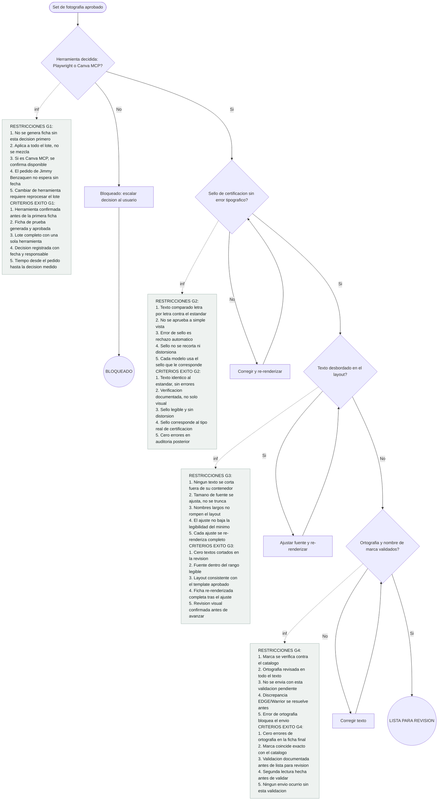

#### Cómo se construye
1. Resolver primero el bloqueante: chequear si Canva MCP ya está disponible como conector (`ListConnectors`/`SearchMcpRegistry`, igual que hicimos con Notion)
2. Si no está disponible pronto, construir con Playwright usando el HTML/CSS ya usado en las fichas Kova/Furious/Spartan como base de template
3. Función que recibe el SPEC CARD (JSON) y rellena el template con specs e íconos
4. Tabla de referencia `spec_to_icon` para mapear cada spec a su ícono, sin hardcodear
5. Usar Playwright (`page.screenshot()` o `page.pdf()`) para renderizar el HTML a imagen/PDF final
6. Validador de texto desbordado: chequeo de overflow CSS antes de renderizar
7. Conectar el validador de ortografía/marca contra el catálogo oficial (mismo de la Etapa 0)
8. Exponer como endpoint `/api/ficha-tecnica` dentro del proyecto ya deployado
9. Generar las 7 fichas de Jimmy Benzaquen como primer caso de prueba real del sistema completo

#### Hallazgos de investigación (mercado real, con fuente citada)

<details><summary>Hallazgo 1 — Canva Autofill bloqueado por plan Enterprise</summary>

```mermaid
flowchart TD
  START(["START — H1: Autofill Canva"])
  S1["Paso 1: Auditar tier actual de la cuenta Canva conectada al pipeline"]
  S2["Paso 2: Ejecutar llamada de prueba a POST /v1/autofills con payload real de ficha"]
  S3["Paso 3: Verificar si mcp.canva.com/mcp expone el mismo bloqueo para la cuenta actual"]
  S4["Paso 4: Cotizar upgrade a Canva Enterprise (usuarios y costo mensual)"]
  S5["Paso 5: Resolver — aprobar upgrade Enterprise o descartar Canva como motor de autofill"]
  RESULT(["RESULTADO: Motor de autofill de Etapa 3 confirmado (Enterprise o alternativa)"])

  I1["Restricciones:<br/>1. Solo cuentas Enterprise pueden invocar autofill<br/>2. Tier actual documentado como Free/Pro/Teams, no Enterprise<br/>3. No existe downgrade parcial de features de autofill<br/>4. Verificación depende del panel admin de Canva, no de la API<br/>5. Cambios de tier requieren aprobación de facturación<br/><br/>Métricas de éxito:<br/>1. Tier identificado en 1 consulta al panel admin<br/>2. Confirmación documentada en menos de 10 min<br/>3. 100% de certeza sobre membresía Enterprise (sí/no)<br/>4. 1 captura de pantalla del plan como evidencia<br/>5. Reporte de tier compartido con 0 ambigüedad<br/><br/>Métrica de fracaso:<br/>Tier permanece sin confirmar tras 24 horas de consulta"]

  I2["Restricciones:<br/>1. Endpoint POST /v1/autofills exige scope de autofill activo<br/>2. canva.dev/docs/connect/api-reference confirma bloqueo sin Enterprise<br/>3. Cada intento fallido genera log de error 403<br/>4. Requiere token OAuth válido para intentar la llamada<br/>5. Rate limit de la API aplica aunque la llamada falle<br/><br/>Métricas de éxito:<br/>1. 1 request de prueba ejecutada contra el endpoint real<br/>2. Código de respuesta capturado en menos de 5 segundos<br/>3. 100% de las llamadas registradas en log<br/>4. 0 reintentos innecesarios tras confirmar el código<br/>5. Payload de prueba idéntico al de producción (1 ficha real)<br/><br/>Métrica de fracaso:<br/>Código de respuesta distinto a 403 sin explicación documentada"]

  I3["Restricciones:<br/>1. mcp.canva.com/mcp es servidor oficial, no sustituto de permisos<br/>2. canva.dev/docs/mcp confirma que hereda las restricciones de plan<br/>3. Requiere configurar conexión MCP antes de probar<br/>4. No expone bypass de autofill vía MCP<br/>5. Prueba depende de la misma cuenta auditada en el Paso 1<br/><br/>Métricas de éxito:<br/>1. 1 conexión MCP establecida exitosamente<br/>2. Bloqueo confirmado en 2 intentos o menos<br/>3. 100% de consistencia entre bloqueo API y bloqueo MCP<br/>4. Tiempo de verificación menor a 15 min<br/>5. Evidencia documentada en 1 solo reporte<br/><br/>Métrica de fracaso:<br/>MCP responde distinto al 403 de la API REST sin explicación"]

  I4["Restricciones:<br/>1. Enterprise requiere organización de ~30-50+ usuarios<br/>2. Costo estimado ≥$1,000 USD/mes (cloudeagle.ai)<br/>3. Cotización depende de contacto directo con ventas de Canva<br/>4. No hay tier intermedio publicado entre Teams y Enterprise<br/>5. Compromiso mínimo de contrato no confirmado en fuente pública<br/><br/>Métricas de éxito:<br/>1. 1 cotización formal recibida de Canva<br/>2. Costo mensual exacto confirmado en USD<br/>3. Número mínimo de licencias confirmado (30-50+)<br/>4. Respuesta de ventas en 5 días hábiles o menos<br/>5. Comparación de costo vs Playwright en 1 tabla<br/><br/>Métrica de fracaso:<br/>Cotización no recibida tras 10 días hábiles"]

  I5["Restricciones:<br/>1. Decisión debe tomarse antes de iniciar desarrollo de Etapa 3<br/>2. Costo Enterprise (~$1,000+/mes) debe justificarse contra 7 fichas<br/>3. Alternativa Playwright ya validada como gratuita (Hallazgo 4)<br/>4. No es reversible sin nueva negociación con Canva<br/>5. Debe registrarse como decisión de arquitectura documentada<br/><br/>Métricas de éxito:<br/>1. 1 decisión binaria tomada en 1 reunión<br/>2. 0 ambigüedad en el motor elegido tras la decisión<br/>3. Costo total de Etapa 3 estimado en 1 cifra final<br/>4. Decisión comunicada a P1/P2/P3 en menos de 24 horas<br/>5. 100% de las 7 fichas asignadas al motor elegido<br/><br/>Métrica de fracaso:<br/>Decisión pospuesta más de 5 días hábiles sin motor asignado"]

  START --> S1
  S1 --> S2
  S2 --> S3
  S3 --> S4
  S4 --> S5
  S5 --> RESULT

  S1 -.info.- I1
  S2 -.info.- I2
  S3 -.info.- I3
  S4 -.info.- I4
  S5 -.info.- I5

  classDef step fill:#1f7a6c,color:#ffffff,stroke:#14503f,stroke-width:1px;
  classDef info fill:#eef2f0,color:#1a1a1a,stroke:#9db3ac,stroke-width:1px,text-align:left;
  classDef terminal fill:#0d3b30,color:#ffffff,stroke:#0d3b30,stroke-width:2px,font-weight:bold;

  class S1,S2,S3,S4,S5 step
  class I1,I2,I3,I4,I5 info
  class START,RESULT terminal
```

</details>

<details><summary>Hallazgo 2 — Iconset maestro reutilizable</summary>

```mermaid
flowchart TD
  START(["START — H2: Iconset maestro"])
  S1["Paso 1: Auditar las 7 fichas técnicas para listar specs variables vs iconos fijos"]
  S2["Paso 2: Definir el set de 6-8 iconos SVG según patrón GSMArena/Flaticon"]
  S3["Paso 3: Estandarizar grilla 48x48px para cada icono"]
  S4["Paso 4: Validar reutilización del iconset en las 7 fichas sin rediseño"]
  S5["Paso 5: Congelar versión final del iconset maestro para producción"]
  RESULT(["RESULTADO: Iconset maestro de 6-8 SVG listo para las 7 fichas EDGE"])

  I1["Restricciones:<br/>1. Separar iconset fijo de dato variable por producto (patrón GSMArena)<br/>2. Solo aplica a categorías repetidas entre las 7 fichas<br/>3. Auditoría depende de tener specs completas de los 7 cascos<br/>4. No incluir specs únicos de un solo modelo en el set fijo<br/>5. Basarse en categorías ya usadas por GSMArena/Flaticon como referencia<br/><br/>Métricas de éxito:<br/>1. 7 fichas auditadas al 100%<br/>2. Lista de specs variables vs fijas con 0 duplicados<br/>3. Categorías fijas identificadas entre 6 y 8<br/>4. Tiempo de auditoría menor a 1 día<br/>5. 1 tabla de mapeo specs-icono entregada<br/><br/>Métrica de fracaso:<br/>Menos de 6 categorías fijas identificadas tras la auditoría"]

  I2["Restricciones:<br/>1. Set limitado a 6-8 iconos (rango del patrón de referencia)<br/>2. Estilo consistente con packs tipo flaticon.com/packs/phone-specification<br/>3. Cada icono representa 1 sola categoría de spec<br/>4. No requiere licencia adicional por icono (uso repetido en 7 fichas)<br/>5. Formato debe ser SVG editable, no rasterizado<br/><br/>Métricas de éxito:<br/>1. Entre 6 y 8 iconos diseñados<br/>2. 100% de los iconos en formato SVG<br/>3. 0 iconos duplicados o redundantes en el set<br/>4. 1 icono por categoría fija identificada en el Paso 1<br/>5. Revisión de consistencia visual aprobada en 1 pasada<br/><br/>Métrica de fracaso:<br/>Set final con menos de 6 o más de 8 iconos"]

  I3["Restricciones:<br/>1. Grilla estándar de 48x48px por icono (referencia GSMArena)<br/>2. Todos los iconos comparten el mismo viewBox<br/>3. Padding interno uniforme entre iconos<br/>4. Stroke-width consistente en todo el set<br/>5. No requiere reescalado manual por ficha<br/><br/>Métricas de éxito:<br/>1. 100% de los iconos ajustados a 48x48px<br/>2. 0 iconos con viewBox distinto al estándar<br/>3. Normalización completa en menos de 2 horas<br/>4. 1 archivo de grilla maestra como referencia<br/>5. Consistencia de stroke-width verificada en el set completo<br/><br/>Métrica de fracaso:<br/>1 o más iconos requieren reescalado manual al insertarse en una ficha"]

  I4["Restricciones:<br/>1. Probar el set en las 7 fichas reales, no en mockups<br/>2. No se permite rediseño de icono por ficha individual<br/>3. Iconos deben integrarse en el layout definido en el Hallazgo 3<br/>4. Validación depende de que las 7 fichas usen las mismas categorías fijas<br/>5. Verificar legibilidad a tamaño real de impresión/pantalla<br/><br/>Métricas de éxito:<br/>1. 7/7 fichas usan el iconset sin modificación<br/>2. 0 rediseños solicitados tras la prueba<br/>3. Integración por ficha en menos de 10 min<br/>4. 100% de los iconos legibles a 48x48px<br/>5. 1 revisión de consistencia entre las 7 fichas aprobada<br/><br/>Métrica de fracaso:<br/>1 o más fichas requieren un icono rediseñado o fuera del set"]

  I5["Restricciones:<br/>1. Congelar antes de integrar al motor de generación (Playwright)<br/>2. No aceptar cambios de icono tras el congelamiento sin nueva versión<br/>3. Archivo maestro debe versionarse<br/>4. Debe quedar documentado el mapeo icono-categoría final<br/>5. Set debe ser compatible con el motor elegido en el Hallazgo 4<br/><br/>Métricas de éxito:<br/>1. 1 versión final (v1.0) congelada<br/>2. 6-8 iconos documentados en 1 archivo de mapeo<br/>3. 0 cambios post-congelamiento en la primera tanda<br/>4. Desde auditoría hasta congelamiento en menos de 3 días<br/>5. 100% de las 7 fichas aprobadas con el set congelado<br/><br/>Métrica de fracaso:<br/>Se requiere descongelar el set antes de terminar la primera tanda de 7 fichas"]

  START --> S1
  S1 --> S2
  S2 --> S3
  S3 --> S4
  S4 --> S5
  S5 --> RESULT

  S1 -.info.- I1
  S2 -.info.- I2
  S3 -.info.- I3
  S4 -.info.- I4
  S5 -.info.- I5

  classDef step fill:#1f7a6c,color:#ffffff,stroke:#14503f,stroke-width:1px;
  classDef info fill:#eef2f0,color:#1a1a1a,stroke:#9db3ac,stroke-width:1px,text-align:left;
  classDef terminal fill:#0d3b30,color:#ffffff,stroke:#0d3b30,stroke-width:2px,font-weight:bold;

  class S1,S2,S3,S4,S5 step
  class I1,I2,I3,I4,I5 info
  class START,RESULT terminal
```

</details>

<details><summary>Hallazgo 3 — Layout premium: foto hero + franja de iconos (patrón Arai)</summary>

```mermaid
flowchart TD
  START(["START — H3: Layout premium Arai"])
  S1["Paso 1: Analizar jerarquía visual del PDF oficial Arai 2024 (foto → iconos → tabla)"]
  S2["Paso 2: Definir máximo de 6-8 iconos con etiqueta de 2-3 palabras por ficha"]
  S3["Paso 3: Validar interpretación de pictogramas contra ISO 9186 (≥67%)"]
  S4["Paso 4: Maquetar foto hero + franja de iconos + tabla de specs sin párrafos largos"]
  S5["Paso 5: Aprobar layout final como plantilla base para las 7 fichas"]
  RESULT(["RESULTADO: Layout premium tipo Arai aprobado como plantilla de Etapa 3"])

  I1["Restricciones:<br/>1. Jerarquía fija: foto grande → iconos de tecnología propietaria → tabla de specs<br/>2. Fuente única de referencia: PDF oficial Arai 2024<br/>3. No se permiten párrafos largos según el patrón confirmado<br/>4. Orden de bloques no puede invertirse sin romper el patrón premium<br/>5. Debe replicarse la proporción visual foto/iconos/tabla del original<br/><br/>Métricas de éxito:<br/>1. 1 PDF de referencia analizado completo<br/>2. 3 bloques de jerarquía identificados<br/>3. 0 párrafos largos detectados en el patrón de referencia<br/>4. Proporción de espacio por bloque documentada en 1 diagrama<br/>5. Análisis completado en menos de 1 día<br/><br/>Métrica de fracaso:<br/>Jerarquía documentada con menos de 3 bloques identificados"]

  I2["Restricciones:<br/>1. Máximo 6-8 iconos por ficha (límite confirmado por el patrón Arai)<br/>2. Etiqueta de cada icono limitada a 2-3 palabras<br/>3. Iconos deben corresponder a tecnología propietaria, no specs genéricas<br/>4. Debe ser compatible con el iconset maestro del Hallazgo 2<br/>5. Etiquetas no deben exceder el ancho de la franja de iconos<br/><br/>Métricas de éxito:<br/>1. Entre 6 y 8 iconos seleccionados por ficha<br/>2. 100% de etiquetas con 2 o 3 palabras<br/>3. 0 etiquetas truncadas en la franja<br/>4. 7/7 fichas usando el mismo límite de iconos<br/>5. Revisión de longitud de etiqueta aprobada en 1 pasada<br/><br/>Métrica de fracaso:<br/>1 o más etiquetas superan las 3 palabras en la versión final"]

  I3["Restricciones:<br/>1. ISO 9186 exige ≥67% de interpretación correcta para validar un pictograma<br/>2. Validación requiere prueba con usuarios reales, no solo revisión interna<br/>3. Iconos que no superen el umbral deben reemplazarse antes de producción<br/>4. Debe probarse cada uno de los 6-8 iconos individualmente<br/>5. Umbral aplica por icono, no como promedio del set completo<br/><br/>Métricas de éxito:<br/>1. 6-8 iconos probados individualmente<br/>2. ≥67% de interpretación correcta por icono<br/>3. Muestra de prueba ≥10 usuarios por icono<br/>4. 100% de iconos con resultado documentado<br/>5. Validación total completada en menos de 3 días<br/><br/>Métrica de fracaso:<br/>1 o más iconos obtienen menos de 67% de interpretación correcta"]

  I4["Restricciones:<br/>1. Layout debe integrar foto hero, franja de iconos validados y tabla de specs<br/>2. No se permite reintroducir párrafos largos en la maquetación<br/>3. Debe usar el iconset congelado del Hallazgo 2<br/>4. Debe ser renderizable por el motor elegido en el Hallazgo 4 (HTML/CSS)<br/>5. Proporción de bloques debe respetar el análisis del Paso 1<br/><br/>Métricas de éxito:<br/>1. 1 maqueta HTML/CSS completa producida<br/>2. 3/3 bloques de jerarquía presentes en la maqueta<br/>3. 0 párrafos de más de 1 línea en la maqueta<br/>4. Maquetación completada en menos de 1 día<br/>5. 1 renderizado de prueba exitoso en el motor elegido<br/><br/>Métrica de fracaso:<br/>Maqueta requiere un párrafo largo para cubrir un spec no representable en icono"]

  I5["Restricciones:<br/>1. Aprobación final debe cubrir las 7 fichas, no solo 1 prototipo<br/>2. Layout aprobado se congela como plantilla reutilizable<br/>3. No se permiten variaciones de jerarquía entre las 7 fichas<br/>4. Debe quedar documentado como plantilla versionada<br/>5. Depende de que los iconos ya hayan pasado el umbral ISO 9186 (Paso 3)<br/><br/>Métricas de éxito:<br/>1. 1 plantilla final aprobada (v1.0)<br/>2. 7/7 fichas usando la misma plantilla<br/>3. 0 variaciones de jerarquía detectadas entre fichas<br/>4. De maqueta a aprobación en menos de 2 días<br/>5. 100% de iconos usados ya validados con ≥67%<br/><br/>Métrica de fracaso:<br/>Se detecta 1 ficha con jerarquía distinta tras la aprobación"]

  START --> S1
  S1 --> S2
  S2 --> S3
  S3 --> S4
  S4 --> S5
  S5 --> RESULT

  S1 -.info.- I1
  S2 -.info.- I2
  S3 -.info.- I3
  S4 -.info.- I4
  S5 -.info.- I5

  classDef step fill:#1f7a6c,color:#ffffff,stroke:#14503f,stroke-width:1px;
  classDef info fill:#eef2f0,color:#1a1a1a,stroke:#9db3ac,stroke-width:1px,text-align:left;
  classDef terminal fill:#0d3b30,color:#ffffff,stroke:#0d3b30,stroke-width:2px,font-weight:bold;

  class S1,S2,S3,S4,S5 step
  class I1,I2,I3,I4,I5 info
  class START,RESULT terminal
```

</details>

<details><summary>Hallazgo 4 — Playwright: control total sin dependencia de plan</summary>

```mermaid
flowchart TD
  START(["START — H4: Motor Playwright"])
  S1["Paso 1: Confirmar licencia Apache 2.0 y costo cero de Playwright"]
  S2["Paso 2: Configurar entorno Chromium headless para generación batch"]
  S3["Paso 3: Construir plantilla HTML/CSS del layout aprobado (Hallazgo 3)"]
  S4["Paso 4: Generar ficha de prueba con page.pdf()/screenshot y medir tiempo"]
  S5["Paso 5: Escalar generación a las 7 fichas en batch y validar consistencia"]
  RESULT(["RESULTADO: Motor Playwright validado para generar las 7 fichas técnicas EDGE"])

  I1["Restricciones:<br/>1. Licencia debe ser Apache 2.0 sin costo de uso comercial<br/>2. No debe depender de ningún plan pago externo (a diferencia de Canva)<br/>3. Debe confirmarse compatibilidad con el stack del pipeline existente<br/>4. Instalación requiere Node.js y dependencias de Playwright<br/>5. Debe verificarse la versión estable más reciente antes de fijarla<br/><br/>Métricas de éxito:<br/>1. 1 confirmación de licencia Apache 2.0 documentada<br/>2. Costo de licencia igual a $0<br/>3. Instalación completada en menos de 30 min<br/>4. 1 versión de Playwright fijada en package.json<br/>5. 0 dependencias de plan externo requeridas<br/><br/>Métrica de fracaso:<br/>Instalación falla o requiere licencia paga no prevista"]

  I2["Restricciones:<br/>1. Cada instancia de Chromium headless consume 200-500MB RAM<br/>2. Instancias concurrentes limitadas por RAM disponible del entorno<br/>3. Debe configurarse modo headless explícitamente para batch<br/>4. Recursos deben dimensionarse para procesar 7 fichas sin fallos de memoria<br/>5. Configuración debe ser reproducible entre entornos (dev/prod)<br/><br/>Métricas de éxito:<br/>1. RAM medida entre 200-500MB por instancia confirmada<br/>2. 1 configuración headless documentada y reproducible<br/>3. 0 fallos de memoria al correr 7 instancias secuenciales<br/>4. Arranque de instancia en menos de 2 segundos<br/>5. Entorno de batch configurado en menos de 1 hora<br/><br/>Métrica de fracaso:<br/>Consumo de RAM por instancia supera 500MB y provoca fallo de memoria"]

  I3["Restricciones:<br/>1. Plantilla HTML/CSS debe reflejar exactamente el layout del Hallazgo 3<br/>2. Debe incluir el iconset maestro congelado del Hallazgo 2<br/>3. Control total de layout implica no depender de un editor externo<br/>4. Plantilla debe aceptar datos variables por producto (7 cascos)<br/>5. CSS debe ser compatible con el renderizado de Chromium<br/><br/>Métricas de éxito:<br/>1. 1 plantilla HTML/CSS completa producida<br/>2. 100% de correspondencia con el layout aprobado<br/>3. 0 elementos rotos al renderizar en Chromium headless<br/>4. Plantilla parametrizada para las 7 fichas<br/>5. Construcción de plantilla en menos de 1 día<br/><br/>Métrica de fracaso:<br/>Plantilla no renderiza correctamente en Chromium headless (elementos rotos)"]

  I4["Restricciones:<br/>1. Generación por ficha debe tomar menos de 5 segundos<br/>2. Debe usarse page.pdf() o screenshot según el formato final requerido<br/>3. Prueba debe ejecutarse con datos reales de 1 ficha, no dummy<br/>4. Medición de tiempo debe hacerse en el entorno de producción<br/>5. Salida debe validarse visualmente contra el layout aprobado<br/><br/>Métricas de éxito:<br/>1. Tiempo de generación menor a 5 segundos confirmado<br/>2. 1 archivo PDF/screenshot generado exitosamente<br/>3. 100% de fidelidad visual respecto a la plantilla<br/>4. 0 errores de renderizado en la corrida de prueba<br/>5. Prueba repetida 3 veces con tiempo menor a 5s cada vez<br/><br/>Métrica de fracaso:<br/>Tiempo de generación supera 5 segundos en la corrida de prueba"]

  I5["Restricciones:<br/>1. Batch debe procesar las 7 fichas sin intervención manual entre cada una<br/>2. RAM total del entorno debe soportar la ejecución completa<br/>3. Consistencia visual debe mantenerse igual en las 7 salidas<br/>4. Tiempo total del batch proporcional a 7 x 5s por ficha<br/>5. Salidas deben nombrarse y almacenarse de forma consistente<br/><br/>Métricas de éxito:<br/>1. 7/7 fichas generadas en el batch sin error<br/>2. Tiempo total del batch menor a 35 segundos<br/>3. 0 fallos de memoria durante la corrida completa<br/>4. 100% de consistencia visual entre las 7 salidas<br/>5. 1 corrida de batch completa documentada como validación final<br/><br/>Métrica de fracaso:<br/>1 o más fichas del batch fallan o exceden 5s de generación individual"]

  START --> S1
  S1 --> S2
  S2 --> S3
  S3 --> S4
  S4 --> S5
  S5 --> RESULT

  S1 -.info.- I1
  S2 -.info.- I2
  S3 -.info.- I3
  S4 -.info.- I4
  S5 -.info.- I5

  classDef step fill:#1f7a6c,color:#ffffff,stroke:#14503f,stroke-width:1px;
  classDef info fill:#eef2f0,color:#1a1a1a,stroke:#9db3ac,stroke-width:1px,text-align:left;
  classDef terminal fill:#0d3b30,color:#ffffff,stroke:#0d3b30,stroke-width:2px,font-weight:bold;

  class S1,S2,S3,S4,S5 step
  class I1,I2,I3,I4,I5 info
  class START,RESULT terminal
```

</details>

<details><summary>Hallazgo 5 — Figma API/MCP no sustituye motor de autofill batch</summary>

```mermaid
flowchart TD
  START(["START — H5: Figma como quality gate"])
  S1["Paso 1: Investigar si Figma API/MCP ofrece endpoint de autofill batch equivalente a Canva"]
  S2["Paso 2: Confirmar que el patrón dominante 2026 es validación pixel-perfect, no relleno masivo"]
  S3["Paso 3: Definir a Figma como source of truth de diseño, no como motor de generación"]
  S4["Paso 4: Configurar Playwright como quality gate contra el diseño de Figma"]
  S5["Paso 5: Descartar Figma como motor de autofill y confirmar Playwright como único motor"]
  RESULT(["RESULTADO: Figma = source of truth visual; Playwright = único motor de generación batch"])

  I1["Restricciones:<br/>1. Revisar la documentación/API de Figma buscando un endpoint de autofill<br/>2. Comparar contra el endpoint real de Canva (POST /v1/autofills)<br/>3. Fuente de referencia: vadim.blog/pixel-perfect-playwright-figma-mcp<br/>4. Investigación limitada al estado de la API/MCP en 2026<br/>5. No asumir equivalencia funcional sin confirmación explícita en doc<br/><br/>Métricas de éxito:<br/>1. 1 revisión completa de la doc de Figma API/MCP realizada<br/>2. 0 endpoints de autofill batch equivalentes a Canva encontrados<br/>3. Comparación documentada en 1 tabla (Figma vs Canva)<br/>4. Investigación completada en menos de 1 día<br/>5. 1 fuente citada respaldando la conclusión<br/><br/>Métrica de fracaso:<br/>Se encuentra 1 endpoint de autofill no documentado en el análisis inicial"]

  I2["Restricciones:<br/>1. Patrón dominante 2026 confirmado: Playwright como quality gate, Figma como source of truth<br/>2. No existe patrón alternativo de relleno masivo vía Figma en la fuente revisada<br/>3. Confirmación depende de 1 sola fuente especializada<br/>4. Patrón aplica a validación pixel-perfect, no a generación de contenido<br/>5. Debe distinguirse entre validación visual y generación batch<br/><br/>Métricas de éxito:<br/>1. 1 patrón dominante confirmado y documentado<br/>2. 0 casos de autofill batch vía Figma encontrados<br/>3. Distinción documentada en 1 párrafo<br/>4. Confirmación completada en menos de 2 horas<br/>5. Conclusión validada contra 1 fuente especializada citada<br/><br/>Métrica de fracaso:<br/>No se logra distinguir con claridad entre validación visual y generación batch"]

  I3["Restricciones:<br/>1. Rol de Figma limitado a source of truth de diseño, no de datos<br/>2. Diseño en Figma debe mantenerse sincronizado con la plantilla HTML/CSS<br/>3. No debe usarse Figma para insertar datos variables de las 7 fichas<br/>4. Definición de rol debe documentarse para evitar reutilización incorrecta futura<br/>5. Depende de que el layout aprobado (Hallazgo 3) ya exista en Figma<br/><br/>Métricas de éxito:<br/>1. 1 archivo de Figma designado oficialmente como source of truth<br/>2. 0 datos variables de producto insertados directamente en Figma<br/>3. Rol documentado en 1 párrafo de arquitectura<br/>4. Sincronización verificada en 1 comparación visual<br/>5. Definición de rol completada en menos de 1 hora<br/><br/>Métrica de fracaso:<br/>Se detecta 1 intento de usar Figma para autofill de datos tras la definición del rol"]

  I4["Restricciones:<br/>1. Playwright debe comparar el render generado contra el diseño de Figma<br/>2. Comparación debe ser pixel-perfect, según el patrón confirmado<br/>3. Quality gate depende de que la plantilla HTML/CSS ya exista<br/>4. Debe ejecutarse antes de aprobar cada ficha para producción<br/>5. Requiere acceso de solo lectura a Figma, no de escritura/autofill<br/><br/>Métricas de éxito:<br/>1. 1 script de comparación pixel-perfect configurado<br/>2. 100% de las 7 fichas pasadas por el quality gate<br/>3. Umbral de diferencia pixel definido (menor a 1% de discrepancia)<br/>4. Validación por ficha en menos de 10 segundos<br/>5. 0 fichas aprobadas sin pasar el quality gate<br/><br/>Métrica de fracaso:<br/>1 o más fichas se aprueban para producción sin pasar el quality gate"]

  I5["Restricciones:<br/>1. Decisión final debe excluir a Figma como motor de generación de datos<br/>2. Playwright queda confirmado como único motor de generación batch<br/>3. Figma se mantiene solo como referencia visual y quality gate<br/>4. Decisión debe documentarse para evitar reevaluar Figma como autofill<br/>5. Debe comunicarse a los 3 hilos del pipeline (P1/P2/P3)<br/><br/>Métricas de éxito:<br/>1. 1 decisión final documentada (Figma = quality gate, no autofill)<br/>2. 100% del motor de generación asignado a Playwright<br/>3. 0 dependencias de autofill de Figma en el pipeline final<br/>4. Comunicación a los 3 hilos completada en menos de 24 horas<br/>5. Arquitectura final de Etapa 3 documentada en 1 diagrama<br/><br/>Métrica de fracaso:<br/>Se reabre la evaluación de Figma como motor de autofill batch en menos de 1 mes"]

  START --> S1
  S1 --> S2
  S2 --> S3
  S3 --> S4
  S4 --> S5
  S5 --> RESULT

  S1 -.info.- I1
  S2 -.info.- I2
  S3 -.info.- I3
  S4 -.info.- I4
  S5 -.info.- I5

  classDef step fill:#1f7a6c,color:#ffffff,stroke:#14503f,stroke-width:1px;
  classDef info fill:#eef2f0,color:#1a1a1a,stroke:#9db3ac,stroke-width:1px,text-align:left;
  classDef terminal fill:#0d3b30,color:#ffffff,stroke:#0d3b30,stroke-width:2px,font-weight:bold;

  class S1,S2,S3,S4,S5 step
  class I1,I2,I3,I4,I5 info
  class START,RESULT terminal
```

</details>
</details>

<details>
<summary><strong>Etapa 4 — Ciclo de feedback humano</strong> (el cuello de botella real — NO está al 100%)</summary>

```mermaid
flowchart TD
    classDef info fill:#eef2f0,stroke:#9db3ac,color:#16211f,text-align:left

    START([Output generado, esperando revision]) --> G1{Usuario aprueba en el primer intento?}
    G1 -.info.-> I1["RESTRICCIONES G1:<br/>1. Criterio de aprobacion se registra cada vez<br/>2. Si, pero... es ajuste pedido, no aprobacion<br/>3. Tiempo de revision se mide, no se ignora<br/>4. No se cuenta aprobado si hubo cambio sin decirlo<br/>5. La revision no se salta aunque se vea bien<br/>CRITERIOS EXITO G1:<br/>1. Porcentaje de aprobacion en primer intento medido<br/>2. Motivo de aprobacion/rechazo registrado<br/>3. Tiempo de revision documentado<br/>4. Ningun aprobado parcial contado como completo<br/>5. Tendencia de mejora visible con el tiempo"]
    G1 -->|No| F1[Ciclo manual: copiar, pegar, ajustar prompt]
    F1 --> G1
    G1 -->|Si| G2{El mismo ajuste se repite en varios productos?}
    G2 -.info.-> I2["RESTRICCIONES G2:<br/>1. Se necesita mas de un caso repetido<br/>2. El patron se documenta con ejemplos concretos<br/>3. Ajustes distintos no se agrupan por conveniencia<br/>4. La deteccion no depende de que el usuario avise<br/>5. Un patron detectado no se ignora<br/>CRITERIOS EXITO G2:<br/>1. Patron con al menos 3 casos de respaldo<br/>2. Cada patron documentado con el ajuste exacto<br/>3. Lista de candidatos actualizada cada semana<br/>4. Ningun patron repetido sin evaluar<br/>5. Se prioriza el que mas tiempo humano consume"]
    G2 -->|Si| F2[Candidato a regla automatica]
    F2 --> G3
    G2 -->|No| G3{Regla automatica coincide con decision humana real?}
    G3 -.info.-> I3["RESTRICCIONES G3:<br/>1. Se prueba en paralelo antes de reemplazar<br/>2. Coincidencia medida en muestra real<br/>3. Umbral minimo definido antes de promover<br/>4. Si falla en caso nuevo, se pausa y revisa<br/>5. Toda promocion queda documentada con fecha<br/>CRITERIOS EXITO G3:<br/>1. Probada contra al menos 10 casos reales<br/>2. Coincidencia por encima del umbral definido<br/>3. Discrepancias documentadas<br/>4. Reglas promovidas se revisan periodicamente<br/>5. Reduccion medible del tiempo de revision humana"]
    G3 -->|No| F3[Se mantiene en revision manual]
    F3 --> YES4
    G3 -->|Si| PROMOTE[Promover a auto-aprobacion]
    PROMOTE --> YES4(("APROBADO"))

    class I1,I2,I3 info
```

#### Cómo se construye
1. Instrumentar el proceso manual actual: cada aprobación/rechazo registra el motivo en una tabla `feedback_log`
2. Acumular 2-3 semanas de este log antes de analizar qué ajuste se repite más
3. Para cada patrón repetido, escribir la regla como función que chequea el mismo criterio que aplicó el usuario a mano
4. Correr la regla en paralelo (shadow mode), sin reemplazar al humano todavía — solo comparar resultados
5. Medir el % de coincidencia real entre la regla y la decisión humana
6. Promover a auto-aprobación solo cuando supere el umbral (ej. 90%+ en al menos 10 casos)
7. Mantener siempre un botón de "escalar a humano" visible para lo que la regla no cubra
8. Repetir el ciclo un tipo de ajuste a la vez, no todos de golpe

#### Hallazgos de investigación (mercado real, con fuente citada)

<details><summary>Hallazgo 1 — Enrutamiento por umbral de confianza en 3 bandas</summary>

```mermaid
flowchart TD
    A_start([Inicio]) --> A_s1[Paso 1: Backtesting de correlación confianza-exactitud]
    A_s1 -.info.- A_i1["Restricciones:<br/>1. Requiere dataset de backtesting con verdad de campo validada manualmente<br/>2. Debe cubrir todo el rango de confianza 0.0-1.0, no solo extremos<br/>3. Tamaño mínimo de muestra: 5,000 decisiones<br/>4. Recalcular la correlación por categoría de contenido antes de fijar un umbral global<br/>5. Congelar el dataset de backtesting antes de tocar el umbral en producción<br/>Métricas de éxito:<br/>1. Exactitud real objetivo del negocio: 96%<br/>2. Score de confianza correlacionado con 96% de exactitud: 0.88<br/>3. Tamaño de muestra de backtesting: ≥5,000 decisiones<br/>4. Cobertura del rango de confianza analizado: 100% (0.0-1.0)<br/>5. Variación de la correlación entre subconjuntos de validación: ≤2 puntos porcentuales<br/>Métrica de fracaso:<br/>1. Si el score 0.88 correlaciona con menos de 94% de exactitud real al reproducir el análisis, el backtesting se invalida"]
    A_s1 --> A_s2[Paso 2: Fijar umbral de auto-aprobación con buffer 0.88 a 0.90]
    A_s2 -.info.- A_i2["Restricciones:<br/>1. Buffer obligatorio de +2 puntos sobre el score correlacionado (0.88 → 0.90)<br/>2. El umbral no puede fijarse por debajo del punto que garantiza el 96% de exactitud objetivo<br/>3. Requiere aprobación documentada antes de desplegar en producción<br/>4. Debe aplicarse uniformemente a todas las categorías salvo excepción registrada<br/>5. No se puede modificar el umbral sin repetir el backtesting del Paso 1<br/>Métricas de éxito:<br/>1. Umbral de auto-aprobación fijado: 0.90<br/>2. Buffer aplicado sobre el score correlacionado: +2 puntos<br/>3. Exactitud real esperada en la banda de auto-aprobación: ≥96%<br/>4. Umbral documentado y versionado: 1 registro de aprobación por cambio<br/>5. Tiempo entre backtesting y despliegue del umbral: ≤2 semanas<br/>Métrica de fracaso:<br/>1. Si la exactitud real medida en producción para score ≥0.90 cae por debajo de 96%, el umbral falló"]
    A_s2 --> A_s3[Paso 3: Banda media - cola de revisión humana asíncrona]
    A_s3 -.info.- A_i3["Restricciones:<br/>1. La banda media queda definida como score menor a 0.90 y por encima del piso de bloqueo síncrono<br/>2. Toda decisión en banda media debe encolarse, ninguna se auto-aprueba<br/>3. La cola es asíncrona: no bloquea el pipeline aguas abajo mientras espera revisión<br/>4. Requiere asignación a revisor humano identificable<br/>5. La banda media no puede fusionarse con la banda de auto-aprobación sin repetir la calibración<br/>Métricas de éxito:<br/>1. Decisiones de banda media efectivamente encoladas: 100%<br/>2. Score límite superior de la banda media: 0.90<br/>3. Tiempo de espera en cola antes de asignación a revisor: ≤48 horas<br/>4. Trazabilidad de revisor asignado registrada: 100% de los casos<br/>5. Exactitud post-revisión humana en banda media: ≥96%<br/>Métrica de fracaso:<br/>1. Si más de 0% de las decisiones de banda media se auto-aprueban sin revisor humano, la banda falla"]
    A_s3 --> A_s4[Paso 4: Banda baja - bloqueo síncrono]
    A_s4 -.info.- A_i4["Restricciones:<br/>1. La banda baja es el score inferior al piso de la banda media<br/>2. El bloqueo debe ser síncrono: el pipeline se detiene hasta resolución humana<br/>3. No debe existir ruta de auto-aprobación posible para esta banda<br/>4. Requiere notificación inmediata al operador humano<br/>5. Los casos bloqueados deben registrarse para retroalimentar el backtesting del umbral<br/>Métricas de éxito:<br/>1. Decisiones de banda baja bloqueadas antes de avanzar: 100%<br/>2. Tiempo de notificación al operador tras el bloqueo: ≤5 minutos<br/>3. Casos bloqueados con causa raíz documentada: 100%<br/>4. Exactitud tras resolución humana en banda baja: ≥96%<br/>5. Reducción de casos en banda baja tras 3 ciclos de recalibración: ≥20%<br/>Métrica de fracaso:<br/>1. Si algún caso de banda baja avanza en el pipeline sin bloqueo síncrono, el control falla (tolerancia: 0 casos)"]
    A_s4 --> A_s5[Paso 5: Monitoreo continuo y recalibración del umbral]
    A_s5 -.info.- A_i5["Restricciones:<br/>1. La recalibración solo puede activarse con datos posteriores al despliegue del umbral 0.90<br/>2. Requiere el mismo tamaño mínimo de muestra que el backtesting original (≥5,000 decisiones)<br/>3. No se puede recalibrar más de una vez por ciclo de medición<br/>4. Toda recalibración debe mantener el buffer mínimo de +2 puntos<br/>5. Cambios de umbral requieren la misma aprobación documentada que el despliegue inicial<br/>Métricas de éxito:<br/>1. Frecuencia de recalibración: 1 ciclo cada ≥5,000 decisiones nuevas<br/>2. Exactitud real sostenida en banda de auto-aprobación: ≥96% por ciclo<br/>3. Desviación del score correlacionado respecto a 0.88 entre ciclos: ≤2 puntos<br/>4. Buffer mantenido en cada recalibración: +2 puntos<br/>5. Tiempo máximo entre ciclos de recalibración: ≤90 días<br/>Métrica de fracaso:<br/>1. Si la exactitud real en la banda de auto-aprobación cae por debajo de 94% durante 2 ciclos consecutivos sin recalibración, el monitoreo falló"]
    A_s5 --> A_end([Resultado: Enrutamiento en 3 bandas operando - auto-aprobación, cola asíncrona, bloqueo síncrono])

    classDef step fill:#1f7a6c,stroke:#14524a,color:#ffffff,stroke-width:1px;
    classDef info fill:#eef2f0,stroke:#9db3ac,color:#2b2b2b,stroke-width:1px,text-align:left;
    class A_start,A_s1,A_s2,A_s3,A_s4,A_s5,A_end step;
    class A_i1,A_i2,A_i3,A_i4,A_i5 info;
```

</details>

<details><summary>Hallazgo 2 — Shadow mode: 85% de coincidencia antes de cutover</summary>

```mermaid
flowchart TD
    B_start([Inicio]) --> B_s1[Paso 1: Diseño del shadow mode en paralelo a producción]
    B_s1 -.info.- B_i1["Restricciones:<br/>1. La regla candidata corre en paralelo a la referencia humana/legada sin sustituirla<br/>2. El shadow mode no puede influir en las decisiones reales de producción<br/>3. Debe definirse de antemano el umbral mínimo de gate (85%)<br/>4. Duración planificada mínima: 8 semanas o 5,000 decisiones, lo que ocurra después<br/>5. Debe registrarse cada decisión paralela (regla vs. referencia) para trazabilidad completa<br/>Métricas de éxito:<br/>1. Duración planificada del shadow mode: 8-12 semanas<br/>2. Volumen mínimo de decisiones a capturar: ≥5,000<br/>3. Decisiones con registro paralelo completo: 100%<br/>4. Umbral de gate documentado antes del inicio: 85%<br/>5. Tiempo de configuración antes de arrancar: ≤2 semanas<br/>Métrica de fracaso:<br/>1. Si el shadow mode influye en al menos 1 decisión real de producción durante la prueba, el diseño falla"]
    B_s1 --> B_s2[Paso 2: Ejecución del periodo de shadow 8-12 semanas o 5,000 decisiones]
    B_s2 -.info.- B_i2["Restricciones:<br/>1. El periodo no puede acortarse por debajo de 8 semanas salvo que se alcancen las 5,000 decisiones antes<br/>2. Debe mantenerse el mismo criterio de evaluación durante todo el periodo<br/>3. Los datos de cada semana deben quedar segmentados para trazar la curva de progresión<br/>4. Cualquier interrupción reinicia el conteo de semanas o decisiones<br/>5. El equipo de referencia humana debe mantenerse estable durante el periodo<br/>Métricas de éxito:<br/>1. Semanas efectivas sin interrupción: 8-12<br/>2. Decisiones acumuladas al cierre del periodo: ≥5,000<br/>3. Semanas con datos de agreement rate completos: 100%<br/>4. Agreement rate en el mes 1: ~70%<br/>5. Agreement rate en el mes 3: ~92%<br/>Métrica de fracaso:<br/>1. Si el agreement rate no mejora entre el mes 1 (~70%) y el mes 3, el periodo de ejecución falló"]
    B_s2 --> B_s3[Paso 3: Medición del agreement rate y su progresión]
    B_s3 -.info.- B_i3["Restricciones:<br/>1. El agreement rate se calcula sobre el 100% de las decisiones registradas, no una muestra<br/>2. La progresión se mide en cortes mensuales comparables<br/>3. Toda discrepancia regla vs. referencia debe clasificarse por causa<br/>4. El cálculo no puede excluir casos difíciles para inflar el resultado<br/>5. La progresión (70% a 92%) debe documentarse con fecha exacta de cada corte<br/>Métricas de éxito:<br/>1. Agreement rate inicial esperado: ~70%<br/>2. Agreement rate final esperado a los 3 meses: ~92%<br/>3. Incremento acumulado en 3 meses: ~22 puntos porcentuales<br/>4. Discrepancias clasificadas por causa raíz: 100%<br/>5. Cortes mensuales de medición completados: 3 de 3<br/>Métrica de fracaso:<br/>1. Si el agreement rate del corte final es inferior a 85%, la medición determina que el sistema no está listo"]
    B_s3 --> B_s4[Paso 4: Gate de decisión - piso duro de 85% para autorizar cutover]
    B_s4 -.info.- B_i4["Restricciones:<br/>1. El piso de 85% es no negociable para autorizar cutover<br/>2. El gate solo se evalúa al completar el periodo mínimo (8-12 semanas o 5,000 decisiones)<br/>3. Requiere sign-off de un responsable distinto de quien ejecutó el shadow mode<br/>4. Un gate fallido no permite cutover parcial, requiere extender el shadow mode<br/>5. El resultado del gate debe documentarse junto con el agreement rate exacto medido<br/>Métricas de éxito:<br/>1. Piso mínimo de agreement rate para aprobar el gate: 85%<br/>2. Tasa de éxito histórica en cutover con shadow mode completo: ~85%+<br/>3. Tasa de éxito de referencia al saltar shadow mode: ~40%<br/>4. Gates con sign-off documentado: 100%<br/>5. Tiempo entre cierre de medición y decisión de gate: ≤1 semana<br/>Métrica de fracaso:<br/>1. Si se autoriza un cutover con agreement rate menor a 85%, la tasa de éxito esperada cae al rango de ~40%"]
    B_s4 --> B_s5[Paso 5: Cutover a producción y monitoreo post-cutover]
    B_s5 -.info.- B_i5["Restricciones:<br/>1. El cutover solo se ejecuta tras gate aprobado (≥85%)<br/>2. Debe mantenerse un canal de rollback a la regla/referencia anterior durante el monitoreo<br/>3. El agreement rate sigue midiéndose ya en producción real<br/>4. Cualquier caída sostenida por debajo de 85% post-cutover activa revisión inmediata<br/>5. El monitoreo post-cutover cubre al menos el mismo volumen que el shadow mode (≥5,000 decisiones)<br/>Métricas de éxito:<br/>1. Agreement rate mantenido en producción tras cutover: ≥85%<br/>2. Disponibilidad del canal de rollback: 100% del tiempo<br/>3. Decisiones monitoreadas post-cutover antes de cierre: ≥5,000<br/>4. Tasa de éxito alineada con la referencia de organizaciones con shadow mode completo: ~85%+<br/>5. Tiempo de respuesta ante caída bajo 85%: ≤48 horas<br/>Métrica de fracaso:<br/>1. Si el agreement rate post-cutover cae por debajo de 85% y no se activa el rollback en ≤48 horas, el cutover se considera fallido"]
    B_s5 --> B_end([Resultado: Cutover ejecutado con regla en producción tras validación shadow])

    classDef step fill:#1f7a6c,stroke:#14524a,color:#ffffff,stroke-width:1px;
    classDef info fill:#eef2f0,stroke:#9db3ac,color:#2b2b2b,stroke-width:1px,text-align:left;
    class B_start,B_s1,B_s2,B_s3,B_s4,B_s5,B_end step;
    class B_i1,B_i2,B_i3,B_i4,B_i5 info;
```

</details>

<details><summary>Hallazgo 3 — Colas de revisión con auto-accept + consenso</summary>

```mermaid
flowchart TD
    C_start([Inicio]) --> C_s1[Paso 1: Configuración del toggle auto-accept para sugerencias del modelo]
    C_s1 -.info.- C_i1["Restricciones:<br/>1. El toggle solo aplica a sugerencias del modelo, nunca a decisiones ya escaladas manualmente<br/>2. Debe poder activarse o desactivarse por categoría de contenido, no solo global<br/>3. Toda sugerencia auto-aceptada debe quedar marcada para auditoría posterior<br/>4. No puede activarse sin un scoring de consenso configurado como respaldo<br/>5. Requiere posibilidad de reversión manual de cualquier sugerencia auto-aceptada<br/>Métricas de éxito:<br/>1. Sugerencias auto-aceptadas marcadas para trazabilidad: 100%<br/>2. Categorías con configuración independiente del toggle: 100% cubiertas<br/>3. Tiempo de activación o desactivación por categoría: ≤1 día<br/>4. Sugerencias auto-aceptadas revertidas manualmente por error: ≤2%<br/>5. Cobertura de auditoría retrospectiva en el primer mes: 100%<br/>Métrica de fracaso:<br/>1. Si más de 5% de las sugerencias auto-aceptadas resultan erróneas en auditoría, el toggle se desactiva"]
    C_s1 --> C_s2[Paso 2: Definición del umbral de scoring de consenso]
    C_s2 -.info.- C_i2["Restricciones:<br/>1. El umbral de consenso debe definirse antes de activar el auto-accept<br/>2. Debe expresarse como score numérico comparable entre revisores<br/>3. No puede fijarse tan bajo que la reasignación sea excepcional en vez de sistemática<br/>4. Requiere revisión periódica del umbral con datos reales de acuerdo entre revisores<br/>5. El cálculo de consenso se basa en múltiples revisores por caso, no en uno solo<br/>Métricas de éxito:<br/>1. Umbral de consenso definido: 1 valor numérico único por categoría<br/>2. Casos con score de consenso calculado antes de auto-aceptar: 100%<br/>3. Revisiones periódicas del umbral: al menos 1 por trimestre<br/>4. Casos con más de un revisor evaluando consenso: 100%<br/>5. Consistencia del umbral entre categorías similares: variación ≤10%<br/>Métrica de fracaso:<br/>1. Si el umbral de consenso no se revisa en un trimestre completo, el control queda desactualizado (0 revisiones)"]
    C_s2 --> C_s3[Paso 3: Reasignación automática a segundo revisor bajo el umbral]
    C_s3 -.info.- C_i3["Restricciones:<br/>1. La reasignación se dispara automáticamente al caer el acuerdo bajo el umbral, sin intervención manual<br/>2. El segundo revisor debe ser distinto del primero<br/>3. El caso reasignado conserva el historial de la primera revisión<br/>4. No puede generar un ciclo infinito, debe existir un tercer nivel de escalación<br/>5. El tiempo de reasignación debe medirse y no exceder un SLA definido<br/>Métricas de éxito:<br/>1. Casos bajo el umbral reasignados automáticamente: 100%<br/>2. Tiempo entre caída del acuerdo y reasignación: ≤1 hora<br/>3. Reasignaciones a un revisor distinto del original: 100%<br/>4. Casos con historial de primera revisión preservado: 100%<br/>5. Casos escalados a tercer nivel por desacuerdo persistente: ≤5% del total reasignado<br/>Métrica de fracaso:<br/>1. Si un caso queda en desacuerdo sin resolución tras 2 reasignaciones sin escalación, la reasignación falló"]
    C_s3 --> C_s4[Paso 4: Patrón de dos capas - anotador y revisor QA]
    C_s4 -.info.- C_i4["Restricciones:<br/>1. Todo caso pasa como mínimo por dos capas: anotador inicial y revisor QA<br/>2. El revisor QA debe tener permisos distintos y mayor autoridad que el anotador<br/>3. La capa QA no puede omitirse para casos de baja confianza o consenso bajo<br/>4. Debe existir trazabilidad de qué capa tomó la decisión final<br/>5. La proporción de casos por capa se monitorea para detectar sobrecarga de la capa QA<br/>Métricas de éxito:<br/>1. Casos que pasan por ambas capas: 100%<br/>2. Casos con decisión final atribuible a una capa específica: 100%<br/>3. Permisos diferenciados configurados entre capas: 2 niveles de acceso distintos<br/>4. Casos de consenso bajo que llegan a capa QA: 100%<br/>5. Reporte de carga de la capa QA respecto al total: 1 reporte/mes<br/>Métrica de fracaso:<br/>1. Si algún caso de consenso bajo el umbral se resuelve sin pasar por la capa QA, el patrón falló (tolerancia: 0 casos)"]
    C_s4 --> C_s5[Paso 5: Auditoría y ajuste del patrón de colas]
    C_s5 -.info.- C_i5["Restricciones:<br/>1. La auditoría muestrea tanto casos auto-aceptados como reasignados<br/>2. Los ajustes al umbral o al toggle se basan en datos de al menos un ciclo completo de auditoría<br/>3. No se puede ajustar el patrón sin registrar el motivo del cambio<br/>4. La auditoría incluye verificación de que la capa QA no se está saltando<br/>5. Los hallazgos retroalimentan tanto el toggle (Paso 1) como el umbral (Paso 2)<br/>Métricas de éxito:<br/>1. Casos auditados sobre el total procesado: ≥10% mensual<br/>2. Ciclos de auditoría completados antes de cada ajuste: ≥1<br/>3. Ajustes con motivo documentado: 100%<br/>4. Auditorías que verifican la capa QA: 100%<br/>5. Frecuencia de retroalimentación al toggle o umbral: al menos 1 ajuste evaluado por trimestre<br/>Métrica de fracaso:<br/>1. Si una auditoría detecta que la capa QA fue saltada en algún caso de consenso bajo y no se corrige en el siguiente ciclo, la auditoría falló"]
    C_s5 --> C_end([Resultado: Cola de revisión con auto-accept y consenso operando en dos capas])

    classDef step fill:#1f7a6c,stroke:#14524a,color:#ffffff,stroke-width:1px;
    classDef info fill:#eef2f0,stroke:#9db3ac,color:#2b2b2b,stroke-width:1px,text-align:left;
    class C_start,C_s1,C_s2,C_s3,C_s4,C_s5,C_end step;
    class C_i1,C_i2,C_i3,C_i4,C_i5 info;
```

</details>

<details><summary>Hallazgo 4 — Gate categórico Shutterstock: 100% revisión en alto riesgo</summary>

```mermaid
flowchart TD
    D_start([Inicio]) --> D_s1[Paso 1: Clasificación de riesgo legal-reputacional del contenido]
    D_s1 -.info.- D_i1["Restricciones:<br/>1. La clasificación de alto riesgo se aplica antes de cualquier ruta de auto-aprobación<br/>2. El criterio de alto riesgo se basa en exposición legal/reputacional documentada, no en juicio ad hoc<br/>3. Todo contenido IA destinado a licencia indemnizada se considera alto riesgo por defecto<br/>4. La clasificación debe ser reproducible: mismo contenido, misma categoría de riesgo<br/>5. No puede existir ruta de reclasificación de alto a bajo riesgo sin aprobación de cumplimiento<br/>Métricas de éxito:<br/>1. Contenido IA destinado a licencia indemnizada clasificado como alto riesgo: 100%<br/>2. Clasificaciones reproducibles en re-test: 100%<br/>3. Reclasificaciones sin aprobación de cumplimiento: 0<br/>4. Tiempo de clasificación por pieza de contenido: ≤1 hora<br/>5. Cobertura de criterios de riesgo documentados: 100% de las categorías de EDGE<br/>Métrica de fracaso:<br/>1. Si 1 sola pieza de alto riesgo se clasifica erróneamente como bajo riesgo, la clasificación falla"]
    D_s1 --> D_s2[Paso 2: Gate categórico de 100% revisión humana en alto riesgo]
    D_s2 -.info.- D_i2["Restricciones:<br/>1. El 100% de las imágenes IA de alto riesgo pasa por revisión humana, sin excepción<br/>2. El gate no puede desactivarse ni reducirse a una muestra parcial<br/>3. Debe existir bloqueo técnico que impida avanzar sin revisión humana registrada<br/>4. La revisión queda documentada con identidad del revisor<br/>5. El gate aplica igual sin importar el volumen de contenido generado<br/>Métricas de éxito:<br/>1. Imágenes de alto riesgo con revisión humana antes de licencia: 100%<br/>2. Casos con bloqueo técnico verificado: 100%<br/>3. Revisiones con identidad de revisor registrada: 100%<br/>4. Excepciones de auto-aprobación permitidas en alto riesgo: 0<br/>5. Consistencia del gate ante picos de volumen: 100%<br/>Métrica de fracaso:<br/>1. Si una sola imagen de alto riesgo obtiene licencia sin revisión humana registrada, el gate falló (tolerancia: 0 casos)"]
    D_s2 --> D_s3[Paso 3: Asignación a revisor dentro del SLA de 1-2 días hábiles]
    D_s3 -.info.- D_i3["Restricciones:<br/>1. El SLA de asignación y revisión no puede exceder 2 días hábiles<br/>2. Debe existir cola priorizada para que el alto riesgo no compita con revisión de bajo riesgo<br/>3. El conteo de días hábiles excluye fines de semana y feriados de forma consistente<br/>4. Todo incumplimiento de SLA se registra con causa<br/>5. El revisor asignado debe tener capacidad disponible verificada antes de la asignación<br/>Métricas de éxito:<br/>1. SLA objetivo de revisión: 1-2 días hábiles<br/>2. Casos resueltos dentro del SLA: ≥95%<br/>3. Tiempo promedio real de revisión: ≤1.5 días hábiles<br/>4. Incumplimientos de SLA con causa raíz documentada: 100%<br/>5. Casos en cola priorizada sin asignar tras 4 horas: 0<br/>Métrica de fracaso:<br/>1. Si el tiempo de revisión supera los 2 días hábiles en más del 5% de los casos, el SLA falla"]
    D_s3 --> D_s4[Paso 4: Otorgamiento de licencia indemnizada tras revisión]
    D_s4 -.info.- D_i4["Restricciones:<br/>1. La licencia indemnizada solo se otorga tras revisión humana completa y documentada<br/>2. No puede otorgarse si la revisión detectó un hallazgo abierto sin resolver<br/>3. El otorgamiento queda vinculado en registro al revisor y a la fecha de revisión<br/>4. Debe existir posibilidad de revocar la licencia ante evidencia posterior de riesgo no detectado<br/>5. El proceso de otorgamiento no puede acelerarse saltando pasos del SLA<br/>Métricas de éxito:<br/>1. Licencias otorgadas con revisión humana previa completa: 100%<br/>2. Licencias vinculadas a revisor y fecha en el registro: 100%<br/>3. Tiempo entre fin de revisión y otorgamiento: ≤4 horas<br/>4. Licencias otorgadas con hallazgos abiertos sin resolver: 0<br/>5. Licencias con mecanismo de revocación disponible: 100%<br/>Métrica de fracaso:<br/>1. Si se otorga 1 licencia indemnizada con un hallazgo de riesgo abierto sin resolver, el otorgamiento falla"]
    D_s4 --> D_s5[Paso 5: Auditoría de cumplimiento del gate 100% y SLA]
    D_s5 -.info.- D_i5["Restricciones:<br/>1. La auditoría verifica el 100% de revisión y el cumplimiento del SLA de forma independiente al equipo de revisión<br/>2. Debe muestrear tanto casos dentro como fuera de SLA<br/>3. Todo hallazgo de incumplimiento genera una acción correctiva documentada<br/>4. La auditoría se repite en un ciclo regular, no solo una vez<br/>5. Los resultados se reportan a un responsable de cumplimiento distinto del equipo operativo<br/>Métricas de éxito:<br/>1. Casos de alto riesgo auditados por ciclo: 100%<br/>2. Ciclos de auditoría ejecutados por trimestre: ≥1<br/>3. Incumplimientos con acción correctiva documentada: 100%<br/>4. Cumplimiento del SLA verificado en auditoría: ≥95%<br/>5. Tiempo de reporte de resultados al responsable de cumplimiento: ≤5 días hábiles tras cierre del ciclo<br/>Métrica de fracaso:<br/>1. Si la auditoría detecta que el 100% de revisión no se cumplió en algún periodo y no hay acción correctiva en el ciclo siguiente, la auditoría falla"]
    D_s5 --> D_end([Resultado: Contenido de alto riesgo con revisión 100% y licencia indemnizada otorgada dentro de SLA])

    classDef step fill:#1f7a6c,stroke:#14524a,color:#ffffff,stroke-width:1px;
    classDef info fill:#eef2f0,stroke:#9db3ac,color:#2b2b2b,stroke-width:1px,text-align:left;
    class D_start,D_s1,D_s2,D_s3,D_s4,D_s5,D_end step;
    class D_i1,D_i2,D_i3,D_i4,D_i5 info;
```

</details>

<details><summary>Hallazgo 5 — Taxonomía de 12 modos de fallo a 4 causas raíz</summary>

```mermaid
flowchart TD
    E_start([Inicio]) --> E_s1[Paso 1: Recolección de casos de fallo - 125 prompts en 4 modelos]
    E_s1 -.info.- E_i1["Restricciones:<br/>1. La muestra cubre los 4 modelos evaluados de forma equilibrada, no concentrada en uno<br/>2. Los 125 prompts se documentan junto con el output generado para trazabilidad<br/>3. La recolección incluye metadatos de configuración (versión de modelo, parámetros)<br/>4. No pueden excluirse casos de fallo menores de la recolección inicial<br/>5. La recolección se repite si cambia la versión de alguno de los 4 modelos evaluados<br/>Métricas de éxito:<br/>1. Total de prompts evaluados: 125<br/>2. Modelos cubiertos: 4<br/>3. Prompts con output y metadatos completos documentados: 100%<br/>4. Distribución de prompts entre los 4 modelos: sin desviación mayor al 25% respecto a partes iguales<br/>5. Casos de fallo mayores y menores incluidos en el dataset: 100%<br/>Métrica de fracaso:<br/>1. Si algún modelo de los 4 queda con menos del 10% de los 125 prompts evaluados, la recolección falla"]
    E_s1 --> E_s2[Paso 2: Catalogación de los 12 modos de fallo visual]
    E_s2 -.info.- E_i2["Restricciones:<br/>1. Cada modo de fallo debe estar respaldado por al menos un caso documentado del dataset<br/>2. La catalogación usa criterios visuales verificables, no solo descripción subjetiva<br/>3. Los 12 modos no pueden solaparse sin una regla de desambiguación<br/>4. Cada modo debe quedar asociado a al menos uno de los 4 modelos evaluados<br/>5. La lista de 12 modos se versiona ante nuevos hallazgos futuros<br/>Métricas de éxito:<br/>1. Modos de fallo catalogados: 12<br/>2. Modos con al menos 1 caso documentado de respaldo: 100%<br/>3. Modos con criterio visual verificable definido: 100%<br/>4. Modos asociados a modelo(s) de origen identificado: 100%<br/>5. Casos de solapamiento sin regla de desambiguación: 0<br/>Métrica de fracaso:<br/>1. Si algún modo de fallo catalogado no tiene ningún caso de respaldo en el dataset de 125 prompts, la catalogación falla"]
    E_s2 --> E_s3[Paso 3: Colapso de los 12 modos en 4 causas raíz]
    E_s3 -.info.- E_i3["Restricciones:<br/>1. Cada uno de los 12 modos se mapea a exactamente una de las 4 causas raíz<br/>2. El mapeo debe ser trazable (modo a causa) y documentado<br/>3. Ninguna causa raíz puede quedar sin al menos un modo de fallo asociado<br/>4. El colapso no puede usarse para descartar modos de fallo, solo para agruparlos<br/>5. El mapeo se revisa si se agregan nuevos modos de fallo en el futuro<br/>Métricas de éxito:<br/>1. Causas raíz identificadas: 4<br/>2. Modos mapeados a una causa raíz: 100% de los 12<br/>3. Causas raíz sin ningún modo asociado: 0<br/>4. Mapeos documentados con trazabilidad modo-causa: 100%<br/>5. Modos de fallo descartados durante el colapso: 0<br/>Métrica de fracaso:<br/>1. Si alguno de los 12 modos queda sin causa raíz asignada, el colapso está incompleto (tolerancia: 0 modos sin mapear)"]
    E_s3 --> E_s4[Paso 4: Construcción de la taxonomía propia EDGE de fidelidad de producto]
    E_s4 -.info.- E_i4["Restricciones:<br/>1. No existe taxonomía estándar para fidelidad de producto real vs. generado; se construye desde cero para EDGE<br/>2. La taxonomía EDGE parte de los 12 modos y 4 causas raíz ya identificados como base<br/>3. Debe incluir criterios específicos de producto: geometría, logo, material, color exacto de marca<br/>4. Cada categoría de la taxonomía EDGE debe ser evaluable por un revisor humano sin ambigüedad<br/>5. La taxonomía se documenta como artefacto de referencia oficial del ciclo HITL antes de usarse en producción<br/>Métricas de éxito:<br/>1. Categorías de fidelidad de producto EDGE definidas: ≥12<br/>2. Categorías vinculadas a un criterio verificable de producto: 100%<br/>3. Categorías con ejemplo visual de referencia documentado: 100%<br/>4. Revisores capacitados en la taxonomía EDGE antes de producción: 100% del equipo<br/>5. Tiempo de construcción de la primera versión: ≤4 semanas<br/>Métrica de fracaso:<br/>1. Si la taxonomía EDGE se pone en producción sin al menos 1 criterio verificable de producto por categoría, la construcción falla"]
    E_s4 --> E_s5[Paso 5: Validación y mantenimiento continuo de la taxonomía EDGE]
    E_s5 -.info.- E_i5["Restricciones:<br/>1. La taxonomía EDGE se valida con casos reales del pipeline de cascos antes de considerarse estable<br/>2. Debe existir un proceso para agregar nuevos modos de fallo de fidelidad de producto no previstos<br/>3. Cualquier actualización se re-mapea a las 4 causas raíz o justifica una causa raíz adicional<br/>4. La validación incluye acuerdo entre al menos 2 revisores humanos sobre la misma categoría<br/>5. La taxonomía se revisa cada vez que cambien los 4 modelos generativos evaluados<br/>Métricas de éxito:<br/>1. Casos reales usados para validar la taxonomía EDGE: ≥125<br/>2. Categorías validadas con acuerdo entre ≥2 revisores: 100%<br/>3. Nuevos modos de fallo de fidelidad de producto incorporados por ciclo: documentado<br/>4. Frecuencia de revisión ante cambio de modelos: 1 revisión por cada actualización de los 4 modelos<br/>5. Categorías con causa raíz asignada tras cada actualización: 100%<br/>Métrica de fracaso:<br/>1. Si 2 revisores no logran acuerdo en la misma categoría en más del 15% de los casos validados, la taxonomía EDGE no está lista para producción"]
    E_s5 --> E_end([Resultado: Taxonomía EDGE de fallos de fidelidad de producto documentada y en uso en el ciclo HITL])

    classDef step fill:#1f7a6c,stroke:#14524a,color:#ffffff,stroke-width:1px;
    classDef info fill:#eef2f0,stroke:#9db3ac,color:#2b2b2b,stroke-width:1px,text-align:left;
    class E_start,E_s1,E_s2,E_s3,E_s4,E_s5,E_end step;
    class E_i1,E_i2,E_i3,E_i4,E_i5 info;
```

</details>
</details>

<details>
<summary><strong>Etapa 5 — Estrategia de marca y mercado</strong> (investigación lista, ejecución pendiente)</summary>

```mermaid
flowchart TD
    classDef info fill:#eef2f0,stroke:#9db3ac,color:#16211f,text-align:left

    START([Catalogo de fichas aprobadas]) --> G1{Specs destacadas confirmadas en el SPEC CARD?}
    G1 -.info.-> I1["RESTRICCIONES G1:<br/>1. Ninguna spec sin estar confirmada en el SPEC CARD<br/>2. Anti-empanante, Bluetooth y ERS se verifican<br/>3. No se promete spec de otro modelo por error<br/>4. El copy no se escribe antes de esta verificacion<br/>5. Cambios de spec disparan revision del copy<br/>CRITERIOS EXITO G1:<br/>1. Cada spec del copy respaldada en el SPEC CARD<br/>2. Cero promesas sin sustento tecnico<br/>3. Verificacion documentada antes de aprobar el copy<br/>4. Copy revisado si el SPEC CARD cambio<br/>5. Cliente confirma cada spec sin sorpresas"]
    G1 -->|No| F1[Verificar antes de publicar]
    F1 --> G1
    G1 -->|Si| LAUNCH[Lanzar primera pieza controlada]
    LAUNCH --> G2{Engagement de 48h supera el umbral?}
    G2 -.info.-> I2["RESTRICCIONES G2:<br/>1. Umbral definido antes de lanzar, nunca despues<br/>2. Medicion exactamente a las 48 horas<br/>3. No se compara contra otra marca sin contexto<br/>4. Resultado bajo no se reinterpreta como exito<br/>5. Misma metrica usada entre campanas<br/>CRITERIOS EXITO G2:<br/>1. Umbral documentado antes del lanzamiento<br/>2. Medicion tomada en la ventana exacta<br/>3. Comparacion honesta sin ajustar criterio despues<br/>4. Decision tomada segun el resultado real<br/>5. Resultado y decision documentados"]
    G2 -->|No| F2[Ajustar mensaje o formato]
    F2 --> G2
    G2 -->|Si| G3{Surge discrepancia de marca en comentarios?}
    G3 -.info.-> I3["RESTRICCIONES G3:<br/>1. Comentarios monitoreados activamente<br/>2. Mencion de Warrior en vez de EDGE se investiga<br/>3. Campana se pausa ante discrepancia real<br/>4. Resolucion no tarda mas que la ventana activa<br/>5. Causa raiz se documenta, no solo se borra<br/>CRITERIOS EXITO G3:<br/>1. Monitoreo activo durante toda la campana<br/>2. Discrepancias investigadas dentro de 24 horas<br/>3. Campana pausada si es real, sin excepcion<br/>4. Causa raiz documentada y corregida<br/>5. Cero recurrencia en campanas posteriores"]
    G3 -->|Si| F3[Pausar y resolver antes de seguir]
    F3 --> NO5(("PAUSADA"))
    G3 -->|No| YES5(("CAMPANA ACTIVA Y ESCALANDO"))

    class I1,I2,I3 info
```

#### Cómo se construye
1. Tomar el brief ya armado (gap hispano en modular/flip-up, ángulo tipo Icon) como punto de partida, no reinvestigar
2. Escribir el copy con Claude y revisarlo contra el tono definido (actitud + specs reales)
3. Usar las imágenes ya generadas en Etapas 1-3 como material, no generar contenido nuevo desde cero
4. Configurar el calendario de publicación con una Routine programada que recuerde publicar
5. Definir el umbral de éxito ANTES de publicar y dejarlo escrito en un lugar consultable
6. Publicar la primera pieza como soft launch a un segmento chico antes de escalar
7. Medir resultados a las 48h y documentar la decisión de escalar o ajustar

#### Hallazgos de investigación (mercado real, con fuente citada)

<details><summary>Hallazgo 1 — Umbral de éxito fijado antes del lanzamiento</summary>

```mermaid
flowchart TD
    H1_START(["Inicio: Hallazgo 1 - Umbral de exito"]) --> H1_S1

    H1_S1["Paso 1: Clasificar la cuenta EDGE por tamano de audiencia (micro menos de 10K vs mega)"]
    H1_I1["RESTRICCIONES:<br/>1. Corte micro/mega fijado en menos de 10,000 seguidores (benchmark 2026)<br/>2. Clasificacion obligatoria por separado en TikTok e Instagram<br/>3. Debe completarse antes de la fecha de lanzamiento<br/>4. Prohibido usar benchmark de cuenta mega si EDGE es micro<br/>5. El conteo de seguidores debe venir del panel oficial de cada plataforma<br/><br/>METRICAS DE EXITO:<br/>1. Seguidores TikTok registrados con 0% de margen de error<br/>2. Seguidores Instagram registrados con 0% de margen de error<br/>3. Clasificacion finalizada 1 o mas dias antes del lanzamiento<br/>4. Multiplicador 2.25x aplicado si menos de 10,000 seguidores en ambas plataformas<br/>5. 100% de las 2 plataformas clasificadas antes de fijar baseline<br/><br/>METRICA DE FRACASO:<br/>0 plataformas clasificadas antes del lanzamiento = baseline invalido en 100% de los casos"]
    H1_S1 -.info.- H1_I1
    H1_S1 --> H1_S2

    H1_S2["Paso 2: Fijar baseline de engagement rate por plataforma (TikTok 4.25%, IG 0.98%) ajustado por multiplicador micro"]
    H1_I2["RESTRICCIONES:<br/>1. Baseline TikTok parte de 4.25% (benchmark 2026)<br/>2. Baseline Instagram parte de 0.98% (benchmark 2026)<br/>3. Si la cuenta es micro, el baseline se ajusta con multiplicador 2.25x<br/>4. El baseline debe fijarse por escrito en el brief antes del lanzamiento<br/>5. No se permite recalcular el baseline tras publicar contenido<br/><br/>METRICAS DE EXITO:<br/>1. Baseline TikTok documentado = 4.25% (o ajustado x2.25 si micro)<br/>2. Baseline Instagram documentado = 0.98% (o ajustado x2.25 si micro)<br/>3. Baseline aprobado 100% antes del dia 0 de campana<br/>4. 2 baselines (TikTok+IG) registrados en el brief sin excepcion<br/>5. 0 recalculos del baseline despues del lanzamiento<br/><br/>METRICA DE FRACASO:<br/>1 o mas recalculos posteriores al lanzamiento invalida la medicion de exito"]
    H1_S2 -.info.- H1_I2
    H1_S2 --> H1_S3

    H1_S3["Paso 3: Definir umbral SMART de exito (3-5% TikTok en micro, equivalente IG) documentado antes del lanzamiento"]
    H1_I3["RESTRICCIONES:<br/>1. El umbral debe estar dentro del rango 3%-5% para TikTok en cuentas micro<br/>2. El umbral debe cumplir criterio SMART (especifico, medible, alcanzable, relevante, con tiempo)<br/>3. Debe documentarse y aprobarse antes del lanzamiento<br/>4. No puede modificarse una vez iniciada la ventana de medicion<br/>5. Debe existir un umbral separado para TikTok y para Instagram<br/><br/>METRICAS DE EXITO:<br/>1. Umbral TikTok fijado dentro de 3%-5% (100% dentro de rango)<br/>2. Umbral Instagram fijado proporcional al baseline de 0.98%<br/>3. Documento de umbral aprobado 1 o mas dias antes del lanzamiento<br/>4. 2 de 2 umbrales con las 5 caracteristicas SMART cumplidas<br/>5. 0% de modificaciones al umbral tras iniciar la campana<br/><br/>METRICA DE FRACASO:<br/>Umbral fijado fuera del rango 3%-5% en TikTok = 100% de riesgo de meta mal calibrada"]
    H1_S3 -.info.- H1_I3
    H1_S3 --> H1_S4

    H1_S4["Paso 4: Configurar ventana de medicion fija de 30 dias con fecha de corte inamovible"]
    H1_I4["RESTRICCIONES:<br/>1. La ventana debe ser exactamente 30 dias naturales<br/>2. La fecha de inicio coincide con la publicacion del primer contenido<br/>3. La fecha de corte no puede extenderse ni acortarse<br/>4. La ventana aplica igual para TikTok e Instagram<br/>5. Datos capturados fuera de la ventana no cuentan para la evaluacion<br/><br/>METRICAS DE EXITO:<br/>1. Duracion de ventana = 30 dias exactos (0 dias de desviacion)<br/>2. Fechas de inicio y corte documentadas con 100% de precision<br/>3. 2 plataformas monitoreadas durante los mismos 30 dias<br/>4. 0 extensiones de la ventana original<br/>5. 100% de los datos de engagement capturados dentro de la ventana<br/><br/>METRICA DE FRACASO:<br/>Cualquier extension mayor a 0 dias invalida la comparacion contra el umbral SMART"]
    H1_S4 -.info.- H1_I4
    H1_S4 --> H1_S5

    H1_S5["Paso 5: Ejecutar el lanzamiento y capturar engagement rate real vs umbral al cierre de los 30 dias"]
    H1_I5["RESTRICCIONES:<br/>1. El engagement rate real se calcula con la misma formula del benchmark 2026<br/>2. La medicion final se toma exactamente al dia 30<br/>3. Se compara el resultado real contra el umbral SMART del paso 3<br/>4. El resultado se registra en el mismo documento del baseline y umbral<br/>5. La decision go/no-go depende exclusivamente de esta comparacion<br/><br/>METRICAS DE EXITO:<br/>1. Engagement rate real de TikTok medido al dia 30 (valor numerico %)<br/>2. Engagement rate real de Instagram medido al dia 30 (valor numerico %)<br/>3. Comparacion completa contra umbral con 100% de trazabilidad<br/>4. Reporte final entregado en 1 dia o menos tras el cierre<br/>5. 2 de 2 plataformas con resultado final documentado<br/><br/>METRICA DE FRACASO:<br/>Engagement rate real menor a 3% en TikTok = umbral no cumplido, campana no escala"]
    H1_S5 -.info.- H1_I5
    H1_S5 --> H1_RESULT

    H1_RESULT(["Resultado: Escalar el contenido IA solo si el engagement rate real alcanza el umbral SMART de 3-5% (TikTok) al cierre de los 30 dias"])

    classDef step fill:#1f7a6c,stroke:#14504a,color:#ffffff,stroke-width:1px;
    classDef info fill:#eef2f0,stroke:#9db3ac,color:#1a1a1a,stroke-width:1px;

    class H1_START,H1_S1,H1_S2,H1_S3,H1_S4,H1_S5,H1_RESULT step
    class H1_I1,H1_I2,H1_I3,H1_I4,H1_I5 info
```

</details>

<details><summary>Hallazgo 2 — Riesgo real de contenido 100% IA sin intervención humana visible</summary>

```mermaid
flowchart TD
    H2_START(["Inicio: Hallazgo 2 - Riesgo de IA sin intervencion humana"]) --> H2_S1

    H2_S1["Paso 1: Auditar el contenido planificado para detectar piezas 100% IA sin elemento humano visible"]
    H2_I1["RESTRICCIONES:<br/>1. Debe revisarse el 100% de las piezas planificadas de la campana EDGE<br/>2. Criterio de riesgo: generado 100% por IA sin credito ni intervencion humana visible<br/>3. La auditoria debe hacerse antes de publicar, no despues<br/>4. Debe documentarse que piezas son 100% IA vs cuales son hibridas<br/>5. La auditoria se repite para cada nueva pieza generada<br/><br/>METRICAS DE EXITO:<br/>1. 100% de las piezas planificadas revisadas antes de publicar<br/>2. 0 piezas de alto riesgo sin pasar por revision adicional<br/>3. Auditoria completada 1 dia o menos antes de cada publicacion<br/>4. Reporte con 100% de piezas clasificadas (IA pura vs hibrida)<br/>5. 2 categorias de riesgo (alto/bajo) asignadas a cada pieza<br/><br/>METRICA DE FRACASO:<br/>1 o mas piezas 100% IA publicadas sin auditoria = riesgo de retiro no mitigado"]
    H2_S1 -.info.- H2_I1
    H2_S1 --> H2_S2

    H2_S2["Paso 2: Comparar contra precedentes de mercado (McDonald's NL retirado en 3 dias, Coca-Cola 2024-2025)"]
    H2_I2["RESTRICCIONES:<br/>1. Usar el caso McDonald's Netherlands (retiro en 3 dias) como referencia de tiempo de reaccion<br/>2. Usar el caso Coca-Cola 2024-2025 como segundo precedente<br/>3. Identificar similitudes concretas (tono, ausencia de humanos, canal) con EDGE<br/>4. Completar el analisis antes de decidir publicar la pieza de alto riesgo<br/>5. Documentar que elementos de los precedentes NO estan presentes en EDGE<br/><br/>METRICAS DE EXITO:<br/>1. 2 de 2 precedentes revisados y documentados<br/>2. Tiempo de reaccion de referencia = 3 dias (ventana critica McDonald's)<br/>3. Comparacion de similitud completada 100% antes de decidir<br/>4. Checklist de similitud con al menos 5 criterios evaluados<br/>5. Reporte comparativo entregado en 1 dia o menos<br/><br/>METRICA DE FRACASO:<br/>0 precedentes revisados antes de publicar = decision tomada sin evidencia de mercado"]
    H2_S2 -.info.- H2_I2
    H2_S2 --> H2_S3

    H2_S3["Paso 3: Cuantificar riesgo de confianza de marca con encuesta Klaviyo 2026 (32% reduce confianza vs 7% aumenta)"]
    H2_I3["RESTRICCIONES:<br/>1. Usar el dato de que 32% de ~8,000 encuestados reduce confianza ante IA de baja calidad<br/>2. Usar el dato de que solo 7% aumenta su confianza<br/>3. El calculo de riesgo se aplica a la audiencia estimada de la pieza<br/>4. El resultado se expresa como riesgo neto (32% menos 7%)<br/>5. El calculo se hace antes de aprobar publicacion de contenido 100% IA<br/><br/>METRICAS DE EXITO:<br/>1. Riesgo neto calculado = -25 puntos porcentuales (32% menos 7%)<br/>2. Tamano de muestra de referencia documentado = ~8,000 encuestados<br/>3. Calculo aplicado a 100% de las piezas de alto riesgo del paso 1<br/>4. Reporte de riesgo entregado 1 dia o menos antes de la ventana de publicacion<br/>5. 2 escenarios (con y sin intervencion humana) cuantificados numericamente<br/><br/>METRICA DE FRACASO:<br/>Riesgo neto mayor a 25 puntos porcentuales negativos sin mitigacion = alta probabilidad de retiro"]
    H2_S3 -.info.- H2_I3
    H2_S3 --> H2_S4

    H2_S4["Paso 4: Insertar elemento humano visible y verificable en cada pieza antes de publicar"]
    H2_I4["RESTRICCIONES:<br/>1. Cada pieza de alto riesgo debe incluir al menos 1 elemento humano visible<br/>2. El elemento humano debe ser verificable (nombre, rol o proceso documentado)<br/>3. La insercion ocurre antes de publicar, no como correccion posterior<br/>4. Aplica a las piezas identificadas como 100% IA en el paso 1<br/>5. El cambio queda registrado en el control de auditoria del paso 1<br/><br/>METRICAS DE EXITO:<br/>1. 100% de las piezas de alto riesgo con al menos 1 elemento humano insertado<br/>2. 0 piezas 100% IA restantes tras esta etapa<br/>3. Verificacion de autenticidad completada en 100% de los casos<br/>4. Tiempo de implementacion de 2 dias o menos por pieza<br/>5. Registro actualizado en el control de auditoria en 100% de los casos<br/><br/>METRICA DE FRACASO:<br/>1 o mas piezas publicadas sin elemento humano verificable = repite el patron McDonald's/Coca-Cola"]
    H2_S4 -.info.- H2_I4
    H2_S4 --> H2_S5

    H2_S5["Paso 5: Publicar la pieza modificada y monitorear sentimiento durante ventana critica de 3 dias"]
    H2_I5["RESTRICCIONES:<br/>1. La ventana critica de monitoreo es de 3 dias (equivalente al caso McDonald's)<br/>2. Debe monitorearse volumen y tono de comentarios en cada plataforma<br/>3. Debe definirse un criterio de alerta temprana (% de comentarios negativos)<br/>4. La decision de mantener o retirar se toma dentro de la ventana de 3 dias<br/>5. El monitoreo cubre todas las plataformas donde se publico la pieza<br/><br/>METRICAS DE EXITO:<br/>1. Ventana de monitoreo = 3 dias exactos post-publicacion<br/>2. % de comentarios negativos medido con 100% de cobertura de comentarios<br/>3. Alerta temprana activada si comentarios negativos superan 15%<br/>4. Decision de mantener/retirar tomada dentro de las 72 horas<br/>5. 100% de las plataformas de publicacion monitoreadas durante la ventana<br/><br/>METRICA DE FRACASO:<br/>Mas de 15% de comentarios negativos dentro de los 3 dias = retiro obligatorio de la pieza"]
    H2_S5 -.info.- H2_I5
    H2_S5 --> H2_RESULT

    H2_RESULT(["Resultado: Mantener publicada la pieza solo si el sentimiento negativo se mantiene bajo el umbral de alerta durante los 3 dias criticos; de lo contrario, retirar siguiendo el precedente McDonald's/Coca-Cola"])

    classDef step fill:#1f7a6c,stroke:#14504a,color:#ffffff,stroke-width:1px;
    classDef info fill:#eef2f0,stroke:#9db3ac,color:#1a1a1a,stroke-width:1px;

    class H2_START,H2_S1,H2_S2,H2_S3,H2_S4,H2_S5,H2_RESULT step
    class H2_I1,H2_I2,H2_I3,H2_I4,H2_I5 info
```

</details>

<details><summary>Hallazgo 3 — HITL es un gate obligatorio, no opcional</summary>

```mermaid
flowchart TD
    H3_START(["Inicio: Hallazgo 3 - Gates HITL obligatorios"]) --> H3_S1

    H3_S1["Paso 1: Definir gate 1 - aprobacion humana del brief antes de generar contenido IA"]
    H3_I1["RESTRICCIONES:<br/>1. El brief debe ser aprobado por un humano antes de iniciar generacion IA<br/>2. Debe existir un responsable unico designado para esta aprobacion<br/>3. El brief debe incluir objetivo, tono de marca y canal de destino<br/>4. No se puede generar contenido sin brief aprobado (bloqueo duro)<br/>5. La aprobacion queda registrada con fecha y responsable<br/><br/>METRICAS DE EXITO:<br/>1. 100% de los briefs con aprobacion humana registrada antes de generacion<br/>2. 1 responsable unico asignado por brief<br/>3. Tiempo de aprobacion de 1 dia habil o menos por brief<br/>4. 0 generaciones iniciadas sin brief aprobado<br/>5. 3 campos obligatorios (objetivo, tono, canal) completos en 100% de los briefs<br/><br/>METRICA DE FRACASO:<br/>1 o mas piezas generadas sin brief aprobado = incumplimiento del gate 1"]
    H3_S1 -.info.- H3_I1
    H3_S1 --> H3_S2

    H3_S2["Paso 2: Definir gate 2 - revision editorial humana de voz de marca y precision"]
    H3_I2["RESTRICCIONES:<br/>1. Todo contenido generado pasa por revision editorial humana antes de avanzar<br/>2. La revision verifica consistencia de voz de marca EDGE<br/>3. La revision verifica precision factual del contenido<br/>4. Debe existir checklist editorial formal, no revision informal<br/>5. El contenido rechazado regresa a generacion, no se publica<br/><br/>METRICAS DE EXITO:<br/>1. 100% del contenido generado pasa por revision editorial antes del gate 3<br/>2. Checklist con al menos 5 criterios de voz/precision aplicado en 100% de casos<br/>3. Tiempo de revision de 2 dias habiles o menos por pieza<br/>4. 0 piezas que saltan del gate 1 al gate 3 sin pasar por gate 2<br/>5. Tasa de aprobacion editorial documentada en % en cada ciclo<br/><br/>METRICA DE FRACASO:<br/>1 pieza publicada sin pasar por revision editorial = incumplimiento del gate 2"]
    H3_S2 -.info.- H3_I2
    H3_S2 --> H3_S3

    H3_S3["Paso 3: Definir gate 3 - aprobacion final humana antes de publicar en cualquier canal"]
    H3_I3["RESTRICCIONES:<br/>1. Ninguna pieza se publica sin aprobacion final humana explicita<br/>2. El aprobador final es distinto o de mayor jerarquia que el revisor editorial<br/>3. La aprobacion se registra por canal de publicacion<br/>4. Debe existir fecha limite de aprobacion previa a la publicacion programada<br/>5. El rechazo en este gate regresa la pieza al gate 2, no la descarta<br/><br/>METRICAS DE EXITO:<br/>1. 100% de las piezas con aprobacion final registrada antes de publicar<br/>2. 1 aprobador final identificado por canal<br/>3. Aprobacion completada 1 dia o mas antes de la fecha de publicacion<br/>4. 0 publicaciones automaticas sin paso por gate 3<br/>5. 100% de los canales de publicacion cubiertos por este gate<br/><br/>METRICA DE FRACASO:<br/>1 publicacion sin aprobacion final registrada = incumplimiento del gate 3 y de todo el modelo HITL"]
    H3_S3 -.info.- H3_I3
    H3_S3 --> H3_S4

    H3_S4["Paso 4: Configurar triggers de escalacion formal cuando un gate es rechazado"]
    H3_I4["RESTRICCIONES:<br/>1. Debe definirse quien recibe la escalacion en cada gate (brief, editorial, final)<br/>2. Debe definirse un tiempo maximo de respuesta a la escalacion<br/>3. La escalacion queda registrada en el log de auditoria<br/>4. Debe existir criterio objetivo de rechazo, no solo opinion subjetiva<br/>5. Debe definirse cuantos rechazos consecutivos detienen la campana para revision mayor<br/><br/>METRICAS DE EXITO:<br/>1. 3 triggers de escalacion configurados (uno por gate)<br/>2. Tiempo maximo de respuesta a escalacion de 2 dias habiles o menos<br/>3. 100% de las escalaciones registradas en el log de auditoria<br/>4. Criterio de rechazo documentado con al menos 3 condiciones objetivas por gate<br/>5. Umbral de pausa de campana fijado en 2 rechazos consecutivos en el mismo gate<br/><br/>METRICA DE FRACASO:<br/>0 registros de escalacion ante un rechazo = perdida de trazabilidad del modelo HITL"]
    H3_S4 -.info.- H3_I4
    H3_S4 --> H3_S5

    H3_S5["Paso 5: Ejecutar el pipeline completo con los 3 gates activos y registrar cada aprobacion/rechazo"]
    H3_I5["RESTRICCIONES:<br/>1. Los 3 gates deben estar activos simultaneamente para toda pieza de contenido<br/>2. Cada aprobacion o rechazo queda registrado con responsable, fecha y resultado<br/>3. El pipeline no puede saltarse ningun gate por urgencia de publicacion<br/>4. El log de auditoria debe ser consultable para cada pieza publicada<br/>5. Debe medirse el tiempo total del pipeline (brief a publicacion) sin eliminar gates<br/><br/>METRICAS DE EXITO:<br/>1. 100% de las piezas publicadas con los 3 gates registrados<br/>2. 3 de 3 gates con responsable y fecha documentados por pieza<br/>3. Tiempo total de pipeline medido en dias por pieza<br/>4. 0 piezas publicadas con algun gate saltado<br/>5. 100% del log de auditoria disponible para consulta posterior<br/><br/>METRICA DE FRACASO:<br/>1 pieza publicada con algun gate faltante = fallo total del modelo de operacion HITL"]
    H3_S5 -.info.- H3_I5
    H3_S5 --> H3_RESULT

    H3_RESULT(["Resultado: Publicar contenido solo si supero los 3 gates (brief, editorial, final) con aprobacion humana registrada; cualquier gate faltante bloquea la publicacion"])

    classDef step fill:#1f7a6c,stroke:#14504a,color:#ffffff,stroke-width:1px;
    classDef info fill:#eef2f0,stroke:#9db3ac,color:#1a1a1a,stroke-width:1px;

    class H3_START,H3_S1,H3_S2,H3_S3,H3_S4,H3_S5,H3_RESULT step
    class H3_I1,H3_I2,H3_I3,H3_I4,H3_I5 info
```

</details>

<details><summary>Hallazgo 4 — Buffer Free ya no alcanza para campaña seria en 2026</summary>

```mermaid
flowchart TD
    H4_START(["Inicio: Hallazgo 4 - Limites de Buffer Free"]) --> H4_S1

    H4_S1["Paso 1: Auditar uso actual de Buffer Free (canales conectados, posts en cola, conexiones historicas)"]
    H4_I1["RESTRICCIONES:<br/>1. Debe revisarse el numero actual de canales conectados en la cuenta EDGE<br/>2. Debe revisarse el numero de posts en cola por canal<br/>3. Debe revisarse el conteo historico de conexiones, incluyendo desconectadas<br/>4. La auditoria debe hacerse antes de planificar el calendario 2026<br/>5. Debe documentarse que canales son criticos para la campana EDGE<br/><br/>METRICAS DE EXITO:<br/>1. Canales conectados actuales contados con 100% de exactitud<br/>2. Posts en cola por canal contados con 100% de exactitud<br/>3. Conexiones historicas de por vida contabilizadas con valor numerico exacto<br/>4. Auditoria completada 1 semana o mas antes del inicio de campana<br/>5. 100% de los canales criticos identificados y documentados<br/><br/>METRICA DE FRACASO:<br/>Conteo de conexiones historicas ya en 8 (limite de por vida) = 0 conexiones nuevas disponibles"]
    H4_S1 -.info.- H4_I1
    H4_S1 --> H4_S2

    H4_S2["Paso 2: Verificar contra limites reales del plan Free (3 canales, 10 posts en cola por canal, 8 conexiones de por vida)"]
    H4_I2["RESTRICCIONES:<br/>1. El plan Free permite maximo 3 canales simultaneos<br/>2. El plan Free permite maximo 10 posts en cola por canal<br/>3. El limite de 8 conexiones de por vida aplica aunque el canal se desconecte<br/>4. La verificacion debe hacerse contra los datos reales del paso 1<br/>5. Debe identificarse el margen restante en cada uno de los 3 limites<br/><br/>METRICAS DE EXITO:<br/>1. Margen restante de canales calculado (3 menos canales usados)<br/>2. Margen restante de posts en cola calculado (10 menos posts actuales)<br/>3. Margen restante de conexiones de por vida calculado (8 menos historicas)<br/>4. Verificacion completada para 100% de los 3 limites<br/>5. Reporte de margen entregado en 1 dia o menos<br/><br/>METRICA DE FRACASO:<br/>Margen restante de conexiones de por vida = 0 significa bloqueo inmediato para canales nuevos"]
    H4_S2 -.info.- H4_I2
    H4_S2 --> H4_S3

    H4_S3["Paso 3: Proyectar si el volumen de contenido de la campana 2026 excede esos limites"]
    H4_I3["RESTRICCIONES:<br/>1. La proyeccion se basa en el calendario de contenido real de la campana EDGE<br/>2. Debe proyectarse el numero de canales necesarios para toda la campana<br/>3. Debe proyectarse el numero de posts en cola necesarios por canal y semana<br/>4. La proyeccion cubre todo el periodo de campana, no solo el lanzamiento<br/>5. Debe compararse la proyeccion contra los limites verificados en el paso 2<br/><br/>METRICAS DE EXITO:<br/>1. Numero de canales requeridos comparado contra el limite de 3<br/>2. Numero de posts en cola por semana comparado contra el limite de 10<br/>3. Proyeccion cubre 100% de las semanas de campana planificadas<br/>4. Comparacion contra limites completada para 100% de los canales<br/>5. Reporte de proyeccion entregado 2 semanas o mas antes del lanzamiento<br/><br/>METRICA DE FRACASO:<br/>Canales requeridos por campana mayor a 3 = el plan Free no puede soportar la campana"]
    H4_S3 -.info.- H4_I3
    H4_S3 --> H4_S4

    H4_S4["Paso 4: Comparar costo de upgrade a Essentials (~5-6 USD/mes/canal, incremento 20-30% en 2026) contra costo de bloqueo"]
    H4_I4["RESTRICCIONES:<br/>1. El costo de Essentials es aproximadamente 5-6 USD por canal al mes<br/>2. Los precios subieron entre 20% y 30% en 2026<br/>3. El costo de bloqueo se estima como perdida de alcance por canales no disponibles<br/>4. La comparacion se hace por canal para decidir cuales migrar primero<br/>5. La decision debe tomarse antes de tocar el limite de 8 conexiones de por vida<br/><br/>METRICAS DE EXITO:<br/>1. Costo mensual total de upgrade calculado (canales requeridos x 5-6 USD)<br/>2. % de incremento de precio 2026 (20-30%) documentado en el analisis<br/>3. Costo de bloqueo estimado en impresiones perdidas (valor numerico)<br/>4. Comparacion costo-beneficio completada para 100% de los canales<br/>5. Decision de upgrade tomada 1 semana o mas antes de alcanzar el limite<br/><br/>METRICA DE FRACASO:<br/>0 analisis de costo-beneficio antes de decidir = riesgo de bloqueo sin presupuesto aprobado"]
    H4_S4 -.info.- H4_I4
    H4_S4 --> H4_S5

    H4_S5["Paso 5: Migrar al plan pago antes de alcanzar el limite de 8 conexiones de por vida"]
    H4_I5["RESTRICCIONES:<br/>1. La migracion debe completarse antes de que el conteo de conexiones llegue a 8<br/>2. Debe migrarse primero los canales criticos identificados en el paso 1<br/>3. La migracion no debe interrumpir publicaciones ya programadas<br/>4. Debe verificarse que el nuevo plan cubra los posts en cola proyectados en el paso 3<br/>5. El presupuesto aprobado en el paso 4 debe cubrir el costo real de la migracion<br/><br/>METRICAS DE EXITO:<br/>1. Migracion completada con conteo de conexiones menor a 8 en el momento del cambio<br/>2. 100% de los canales criticos migrados sin interrupcion de publicaciones<br/>3. Capacidad de posts en cola del nuevo plan mayor o igual a la proyeccion del paso 3<br/>4. Costo real de migracion con 0% de variacion respecto al presupuesto aprobado<br/>5. Migracion completada 1 semana o mas antes del lanzamiento<br/><br/>METRICA DE FRACASO:<br/>Migracion completada con conteo de conexiones ya en 8 = imposible conectar canales nuevos aunque se pague"]
    H4_S5 -.info.- H4_I5
    H4_S5 --> H4_RESULT

    H4_RESULT(["Resultado: Migrar a Buffer Essentials antes de tocar el limite de 8 conexiones de por vida, si la proyeccion de campana excede los limites del plan Free"])

    classDef step fill:#1f7a6c,stroke:#14504a,color:#ffffff,stroke-width:1px;
    classDef info fill:#eef2f0,stroke:#9db3ac,color:#1a1a1a,stroke-width:1px;

    class H4_START,H4_S1,H4_S2,H4_S3,H4_S4,H4_S5,H4_RESULT step
    class H4_I1,H4_I2,H4_I3,H4_I4,H4_I5 info
```

</details>

<details><summary>Hallazgo 5 — CPM real IG/TikTok LatAm, cuándo pagar para acelerar</summary>

```mermaid
flowchart TD
    H5_START(["Inicio: Hallazgo 5 - CPM LatAm y aceleracion paga"]) --> H5_S1

    H5_S1["Paso 1: Medir alcance organico inicial de la campana EDGE en TikTok e Instagram"]
    H5_I1["RESTRICCIONES:<br/>1. La medicion cubre las primeras semanas de campana, antes de decidir inversion paga<br/>2. Debe medirse alcance organico por separado en TikTok y en Instagram<br/>3. La medicion usa los mismos criterios de engagement del Hallazgo 1<br/>4. Debe registrarse el alcance en impresiones o vistas, no solo en seguidores<br/>5. La medicion debe completarse antes de asignar cualquier presupuesto pago<br/><br/>METRICAS DE EXITO:<br/>1. Alcance organico TikTok medido en impresiones (valor numerico)<br/>2. Alcance organico Instagram medido en impresiones (valor numerico)<br/>3. Medicion completada 100% antes de cualquier decision de inversion paga<br/>4. 2 plataformas (TikTok+IG) con datos de alcance organico documentados<br/>5. Reporte de alcance entregado dentro de los primeros 7 dias de campana<br/><br/>METRICA DE FRACASO:<br/>0 datos de alcance organico disponibles antes de decidir invertir = decision de paid media sin base"]
    H5_S1 -.info.- H5_I1
    H5_S1 --> H5_S2

    H5_S2["Paso 2: Comparar CPM real LatAm (TikTok 3-7 USD, Meta/IG Mexico ~3.92 USD, Colombia ~2.00 USD) contra EE.UU./Europa (~16 USD)"]
    H5_I2["RESTRICCIONES:<br/>1. El CPM de TikTok LatAm se ubica en el rango 3-7 USD<br/>2. El CPM de Meta/Instagram en Mexico es aproximadamente 3.92 USD<br/>3. El CPM de Meta/Instagram en Colombia es aproximadamente 2.00 USD<br/>4. El CPM de referencia EE.UU./Europa es aproximadamente 16 USD<br/>5. La comparacion se expresa como ventaja relativa (4-8x mas barato) para justificar la inversion regional<br/><br/>METRICAS DE EXITO:<br/>1. CPM TikTok LatAm documentado dentro del rango 3-7 USD<br/>2. CPM Meta Mexico documentado en ~3.92 USD<br/>3. CPM Meta Colombia documentado en ~2.00 USD<br/>4. Ventaja relativa calculada entre 4x y 8x frente a EE.UU./Europa<br/>5. Comparacion completa entre los 4 mercados (TikTok LatAm, Meta Mexico, Meta Colombia, EE.UU./Europa)<br/><br/>METRICA DE FRACASO:<br/>Ventaja relativa calculada menor a 4x indicaria error en el dato de CPM regional usado"]
    H5_S2 -.info.- H5_I2
    H5_S2 --> H5_S3

    H5_S3["Paso 3: Definir umbral de alcance organico por debajo del cual se justifica invertir en paid media"]
    H5_I3["RESTRICCIONES:<br/>1. El umbral se basa en el alcance organico medido en el paso 1<br/>2. El umbral considera el objetivo de impresiones incrementales de la campana<br/>3. El umbral debe fijarse antes de que el alcance organico empiece a caer<br/>4. Debe definirse un umbral separado para TikTok y para Instagram<br/>5. El umbral queda documentado junto con el baseline del Hallazgo 1<br/><br/>METRICAS DE EXITO:<br/>1. Umbral de alcance organico TikTok fijado como valor numerico de impresiones<br/>2. Umbral de alcance organico Instagram fijado como valor numerico de impresiones<br/>3. Umbral documentado 100% antes de cualquier caida de alcance detectada<br/>4. 2 umbrales (TikTok+IG) alineados con el objetivo de campana<br/>5. Revision del umbral completada 1 dia o menos tras fijar el baseline del Hallazgo 1<br/><br/>METRICA DE FRACASO:<br/>0 umbral definido antes de la caida de alcance = decision de inversion tomada de forma reactiva y tardia"]
    H5_S3 -.info.- H5_I3
    H5_S3 --> H5_S4

    H5_S4["Paso 4: Asignar presupuesto de 200-300 USD para acelerar impresiones cuando el alcance organico no alcance el umbral"]
    H5_I4["RESTRICCIONES:<br/>1. El presupuesto se ubica en el rango 200-300 USD por ciclo de aceleracion<br/>2. El presupuesto se distribuye priorizando el CPM mas bajo (Colombia ~2.00, luego Mexico ~3.92, luego TikTok 3-7)<br/>3. La asignacion solo se activa si el alcance organico cae por debajo del umbral del paso 3<br/>4. El presupuesto debe aprobarse antes de que se necesite, no en el momento de la caida<br/>5. Debe definirse el canal prioritario de inversion segun el CPM mas bajo disponible<br/><br/>METRICAS DE EXITO:<br/>1. Presupuesto asignado dentro del rango 200-300 USD<br/>2. Impresiones incrementales objetivo fijadas en 50,000-100,000<br/>3. 100% del presupuesto distribuido priorizando el CPM mas bajo disponible<br/>4. Aprobacion de presupuesto completada 1 dia o mas antes de la activacion<br/>5. 1 canal prioritario de inversion identificado con base en el CPM mas bajo<br/><br/>METRICA DE FRACASO:<br/>Presupuesto asignado menor a 200 USD no garantiza alcanzar el piso de 50,000 impresiones incrementales"]
    H5_S4 -.info.- H5_I4
    H5_S4 --> H5_S5

    H5_S5["Paso 5: Ejecutar la campana paga y verificar 50,000-100,000 impresiones incrementales esperadas"]
    H5_I5["RESTRICCIONES:<br/>1. La ejecucion usa el presupuesto y canal definidos en el paso 4<br/>2. Las impresiones incrementales se miden contra el alcance organico base del paso 1<br/>3. La verificacion se hace dentro de la misma ventana de 30 dias del Hallazgo 1<br/>4. El CPM real ejecutado se compara contra el CPM estimado del paso 2<br/>5. El resultado se documenta para decidir si se repite o escala la inversion<br/><br/>METRICAS DE EXITO:<br/>1. Impresiones incrementales reales medidas dentro del rango 50,000-100,000<br/>2. CPM real ejecutado documentado y comparado contra el estimado (variacion en %)<br/>3. Verificacion completada dentro de la ventana de 30 dias<br/>4. 100% del presupuesto ejecutado y auditado contra el resultado obtenido<br/>5. Reporte final de impresiones entregado 2 dias o menos tras el cierre de la ventana<br/><br/>METRICA DE FRACASO:<br/>Impresiones incrementales reales menores a 50,000 dentro de la ventana = inversion paga no cumplio el piso esperado"]
    H5_S5 -.info.- H5_I5
    H5_S5 --> H5_RESULT

    H5_RESULT(["Resultado: Escalar la inversion paga en el canal de menor CPM solo si se confirman entre 50,000 y 100,000 impresiones incrementales dentro de la ventana de 30 dias"])

    classDef step fill:#1f7a6c,stroke:#14504a,color:#ffffff,stroke-width:1px;
    classDef info fill:#eef2f0,stroke:#9db3ac,color:#1a1a1a,stroke-width:1px;

    class H5_START,H5_S1,H5_S2,H5_S3,H5_S4,H5_S5,H5_RESULT step
    class H5_I1,H5_I2,H5_I3,H5_I4,H5_I5 info
```

</details>
</details>

<details>
<summary><strong>Etapa 6 — Infraestructura propia</strong> (servidor privado, modelos de IA privados — no iniciado)</summary>

```mermaid
flowchart TD
    classDef info fill:#eef2f0,stroke:#9db3ac,color:#16211f,text-align:left

    START([Migracion a infraestructura propia]) --> G1{Modelo privado cumple las mismas Leyes de Calidad?}
    G1 -.info.-> I1["RESTRICCIONES G1:<br/>1. Se prueba con casos reales, no benchmarks<br/>2. Debe pasar las mismas 6 Leyes, sin excepcion<br/>3. No se migra etapa hasta confirmar el modelo ahi<br/>4. Modelo que falla se descarta o ajusta<br/>5. Comparacion de calidad documentada lado a lado<br/>CRITERIOS EXITO G1:<br/>1. Probado con al menos un caso real por etapa<br/>2. Las 6 Leyes confirmadas sin excepcion<br/>3. Comparacion documentada contra modelo de terceros<br/>4. Decision de migrar registrada con evidencia<br/>5. Ninguna etapa migro sin esta validacion"]
    G1 -->|No| F1[Ajustar o descartar el modelo para ese uso]
    F1 --> G1
    G1 -->|Si| G2{Latencia del nuevo sistema es aceptable?}
    G2 -.info.-> I2["RESTRICCIONES G2:<br/>1. Medida contra el sistema anterior, no en abstracto<br/>2. Umbral definido antes de migrar<br/>3. Medicion bajo carga real<br/>4. Degradacion no se acepta temporalmente<br/>5. Optimizacion pendiente bloquea produccion<br/>CRITERIOS EXITO G2:<br/>1. Medida bajo condiciones de uso real<br/>2. Resultado dentro o mejor que el umbral<br/>3. Comparacion documentada contra sistema anterior<br/>4. Ninguna queja de degradacion durante la prueba<br/>5. Optimizaciones registradas con su impacto"]
    G2 -->|No| F2[Optimizar antes de continuar]
    F2 --> G2
    G2 -->|Si| G3{Uptime estable por una semana?}
    G3 -.info.-> I3["RESTRICCIONES G3:<br/>1. Semana de prueba con uso real<br/>2. Cualquier caida reinicia el conteo<br/>3. Plan de contingencia se prueba al menos una vez<br/>4. No se marca en produccion antes de completar<br/>5. Incidentes se documentan con causa y resolucion<br/>CRITERIOS EXITO G3:<br/>1. Semana completa sin caidas no planificadas<br/>2. Contingencia ejecutada y validada<br/>3. Incidentes menores documentados<br/>4. Monitoreo activo con alertas configuradas<br/>5. Aprobacion formal registrada con fecha"]
    G3 -->|No| F3[Seguir en monitoreo]
    F3 --> G3
    G3 -->|Si| YES6(("INFRAESTRUCTURA EN PRODUCCION"))

    class I1,I2,I3 info
```

#### Cómo se construye
1. Elegir proveedor de servidor según presupuesto real disponible
2. Levantar un servidor de prueba primero, no migrar producción de una
3. Migrar solo Supabase Storage primero (lo menos riesgoso), medir estabilidad una semana
4. Evaluar modelos de IA privados contra Nano Banana Pro en un caso real de la Etapa 1
5. Si el modelo privado pasa Ley 1 y 2 igual de bien, migrar esa parte; si no, mantener el actual
6. Rotar todas las credenciales existentes ANTES de migrar — empezando por el token ya expuesto que encontramos
7. Documentar el nuevo flujo en un solo lugar, no disperso

#### Hallazgos de investigación (mercado real, con fuente citada)

<details><summary>Hallazgo 1 — Hetzner 3-5x más barato que DigitalOcean</summary>

```mermaid
flowchart TD
    H1START(["Inicio: evaluar migración de infraestructura a Hetzner"])
    H1S1["Paso 1: Auditar infraestructura actual en DigitalOcean (droplets, GPU, storage, tráfico)"]
    H1S2["Paso 2: Seleccionar y cotizar plan Hetzner equivalente (CPX22 2vCPU/4GB/80GB NVMe, €7.99/mes)"]
    H1S3["Paso 3: Migrar Object Storage a Hetzner ($5.99/mes por 1TB)"]
    H1S4["Paso 4: Evaluar y migrar cargas GPU (Hetzner limitado vs DO 2.4-3.5x más caro)"]
    H1S5["Paso 5: Cutover final y validación de ahorro real post-migración"]
    H1RESULT(["Resultado: infraestructura migrada a Hetzner con ahorro 3-5x validado"])

    H1START --> H1S1 --> H1S2 --> H1S3 --> H1S4 --> H1S5 --> H1RESULT

    H1I1["<b>Restricciones:</b><br/>1. Inventario debe cubrir el 100% de droplets activos en DO antes de cotizar Hetzner<br/>2. Debe registrarse el uso mensual de GPU compute en DO (horas y tipo de instancia)<br/>3. Debe registrarse el volumen de Object Storage actual en DO (GB almacenados)<br/>4. El costo base de comparación es droplet DO ~$24/mes vs CPX22 Hetzner €7.99/mes<br/>5. La auditoría no puede interrumpir servicios en producción durante el conteo<br/><b>Métricas de éxito:</b><br/>1. 100% de droplets inventariados con specs (vCPU/RAM/disco)<br/>2. Costo mensual actual documentado con margen de error &lt;5%<br/>3. Volumen de Object Storage medido en GB con precisión ±2%<br/>4. Horas de uso GPU/mes registradas con exactitud ±10%<br/>5. Reporte de auditoría entregado en ≤3 días<br/><b>Métrica de fracaso:</b><br/>&gt;10% de recursos activos no identificados en el inventario final"]
    H1I2["<b>Restricciones:</b><br/>1. El plan Hetzner debe igualar o superar specs de CPX22 (2vCPU/4GB/80GB NVMe)<br/>2. El ahorro proyectado debe basarse en el diferencial real €7.99 vs $24/mes<br/>3. Debe confirmarse disponibilidad de región Hetzner con latencia aceptable<br/>4. Cotización debe incluir Object Storage a $5.99/mes por 1TB<br/>5. No debe contratarse ningún plan sin validar SLA de uptime de Hetzner<br/><b>Métricas de éxito:</b><br/>1. Ahorro proyectado de al menos 3x sobre el costo actual en DO<br/>2. Cotización con desviación &lt;5% respecto al precio publicado (€7.99)<br/>3. Latencia a región Hetzner ≤50ms desde ubicación de usuarios objetivo<br/>4. SLA de uptime Hetzner documentado en ≥99.9%<br/>5. Cotización completa entregada en ≤2 días<br/><b>Métrica de fracaso:</b><br/>Ahorro proyectado real &lt;2x frente al costo actual en DO"]
    H1I3["<b>Restricciones:</b><br/>1. Migración de datos no debe exceder ventana de mantenimiento acordada<br/>2. Integridad de archivos debe verificarse con checksum antes/después<br/>3. Costo de Object Storage no debe superar $5.99/mes por TB contratado<br/>4. Debe mantenerse acceso de solo lectura a DO durante la transición<br/>5. Migración debe completarse sin pérdida de datos<br/><b>Métricas de éxito:</b><br/>1. 100% de archivos migrados con checksum verificado<br/>2. Tiempo de inactividad durante migración ≤30 minutos<br/>3. Costo mensual de storage confirmado en $5.99/TB (±5%)<br/>4. Velocidad de transferencia sostenida ≥100 MB/s<br/>5. 0 incidentes de acceso reportados en las 48h post-migración<br/><b>Métrica de fracaso:</b><br/>&gt;0.1% de archivos con checksum inválido tras la migración"]
    H1I4["<b>Restricciones:</b><br/>1. Debe confirmarse disponibilidad real de instancias GPU en catálogo Hetzner<br/>2. Si Hetzner no cubre el tipo de GPU requerido, cargas GPU permanecen en DO<br/>3. Comparación de costo debe usar el rango real 2.4x-3.5x documentado<br/>4. Decisión debe basarse en throughput de renderizado, no solo precio<br/>5. No migrar carga GPU sin plan de rollback a DO<br/><b>Métricas de éxito:</b><br/>1. Costo de cómputo GPU reducido en al menos 2.4x si migra a Hetzner<br/>2. Throughput de renderizado dentro de ±10% del baseline DO<br/>3. Disponibilidad de instancia GPU confirmada en ≤1 día de consulta<br/>4. Downtime de migración GPU ≤1 hora<br/>5. Plan de rollback probado en 100% de los casos<br/><b>Métrica de fracaso:</b><br/>Throughput de renderizado cae &gt;20% tras la migración GPU"]
    H1I5["<b>Restricciones:</b><br/>1. Cutover completo solo tras validar Object Storage y cargas GPU estables<br/>2. Debe monitorearse el gasto real durante al menos 1 ciclo de facturación completo<br/>3. DO debe mantenerse activo como fallback durante 7 días post-cutover<br/>4. Ahorro real debe compararse contra el rango proyectado 3-5x<br/>5. Cutover no se cierra sin firma de aprobación del responsable de infraestructura<br/><b>Métricas de éxito:</b><br/>1. Ahorro real dentro del rango 3x-5x proyectado<br/>2. 0 incidentes críticos de servicio en los primeros 7 días<br/>3. Facturación del primer ciclo con desviación &lt;5% de cotización<br/>4. Fallback DO desactivado a más tardar en día 7 sin incidentes<br/>5. Reporte final de ahorro entregado en ≤5 días<br/><b>Métrica de fracaso:</b><br/>Ahorro real de costo mensual &lt;2x tras el primer ciclo de facturación"]

    H1S1 -.info.- H1I1
    H1S2 -.info.- H1I2
    H1S3 -.info.- H1I3
    H1S4 -.info.- H1I4
    H1S5 -.info.- H1I5

    classDef step fill:#1f7a6c,color:#ffffff,stroke:#14524a,stroke-width:1px;
    classDef info fill:#eef2f0,color:#1a1a1a,stroke:#9db3ac,stroke-width:1px;
    class H1S1,H1S2,H1S3,H1S4,H1S5 step
    class H1I1,H1I2,H1I3,H1I4,H1I5 info
```

</details>

<details><summary>Hallazgo 2 — FLUX.1 dev tiene licencia no-comercial</summary>

```mermaid
flowchart TD
    H2START(["Inicio: seleccionar modelo de generación de imagen comercial-seguro"])
    H2S1["Paso 1: Confirmar términos de licencia FLUX.1 dev contra uso comercial EDGE"]
    H2S2["Paso 2: Descartar FLUX.1 dev y evaluar alternativas (schnell vs pro API)"]
    H2S3["Paso 3: Prototipar generación de imágenes con FLUX.1 schnell (Apache 2.0)"]
    H2S4["Paso 4: Evaluar FLUX.1 pro vía API de pago para cerrar brecha de calidad"]
    H2S5["Paso 5: Decisión final de modelo de generación de imagen para producción"]
    H2RESULT(["Resultado: modelo comercial-seguro seleccionado (schnell o pro) para pipeline EDGE"])

    H2START --> H2S1 --> H2S2 --> H2S3 --> H2S4 --> H2S5 --> H2RESULT

    H2I1["<b>Restricciones:</b><br/>1. Debe revisarse el texto de licencia en bfl.ai/legal antes de cualquier despliegue<br/>2. FLUX.1 dev está clasificado como estrictamente no-comercial<br/>3. Uso en pipeline de contenido de marca EDGE constituye uso comercial<br/>4. No puede usarse FLUX.1 dev en producción bajo ningún escenario<br/>5. La verificación debe documentarse con cita textual de la cláusula de licencia<br/><b>Métricas de éxito:</b><br/>1. Cláusula de licencia citada textualmente en 100% de la documentación interna<br/>2. Confirmación de estatus no-comercial obtenida de fuente oficial<br/>3. Revisión completada en ≤1 día<br/>4. 0 despliegues de FLUX.1 dev en producción tras la revisión<br/>5. Documento de cumplimiento aprobado por 1 responsable designado<br/><b>Métrica de fracaso:</b><br/>1 o más despliegues de FLUX.1 dev detectados en producción tras la revisión"]
    H2I2["<b>Restricciones:</b><br/>1. Solo se evalúan modelos con licencia comercial válida (Apache 2.0 o API de pago)<br/>2. FLUX.1 schnell y FLUX.1 pro son las únicas opciones válidas<br/>3. No existe benchmark publicado que compare FLUX.1 contra Nano Banana Pro<br/>4. Evaluación debe incluir costo por imagen (pro) vs costo cero (schnell)<br/>5. Decisión no puede basarse en un benchmark inexistente frente a Nano Banana Pro<br/><b>Métricas de éxito:</b><br/>1. 2 alternativas comerciales evaluadas en igualdad de condiciones<br/>2. Costo por imagen de FLUX.1 pro documentado con exactitud ±5%<br/>3. Licencia Apache 2.0 de schnell verificada en huggingface.co<br/>4. Evaluación completada en ≤3 días<br/>5. 0 modelos no-comerciales en la shortlist final<br/><b>Métrica de fracaso:</b><br/>Selección final de un modelo sin licencia comercial verificada"]
    H2I3["<b>Restricciones:</b><br/>1. Prototipo debe correr sobre el modelo gratuito Apache 2.0 sin costo de licencia<br/>2. Calidad esperada es menor a la de dev, debe medirse explícitamente esa brecha<br/>3. Prototipo debe usar los mismos prompts de referencia del pipeline EDGE<br/>4. No debe consumirse presupuesto de API de pago en esta fase<br/>5. Resultados deben almacenarse para comparación posterior con pro<br/><b>Métricas de éxito:</b><br/>1. Mínimo 20 imágenes de prueba generadas con schnell<br/>2. Tiempo de generación por imagen medido en segundos<br/>3. Costo total de la fase de prototipo igual a $0<br/>4. Tasa de imágenes aprobadas por control de calidad ≥50%<br/>5. Prototipo completado en ≤2 días<br/><b>Métrica de fracaso:</b><br/>Tasa de imágenes aprobadas por calidad interna &lt;20%"]
    H2I4["<b>Restricciones:</b><br/>1. Costo por llamada a la API de FLUX.1 pro debe presupuestarse antes de pruebas<br/>2. Pruebas deben limitarse a un lote acotado para controlar gasto<br/>3. Comparación de calidad debe hacerse contra el mismo set de prompts de schnell<br/>4. No hay benchmark oficial vs Nano Banana Pro, comparación solo entre variantes FLUX<br/>5. Debe confirmarse que la licencia de la API de pago cubre uso comercial<br/><b>Métricas de éxito:</b><br/>1. Mínimo 20 imágenes generadas con pro para comparación directa<br/>2. Costo total de la fase de prueba dentro del presupuesto (±10%)<br/>3. Tasa de imágenes aprobadas por control de calidad ≥80%<br/>4. Mejora de tasa de aprobación de al menos 20 puntos porcentuales vs schnell<br/>5. Evaluación completada en ≤2 días<br/><b>Métrica de fracaso:</b><br/>Costo real por lote de prueba excede presupuesto asignado en más de 25%"]
    H2I5["<b>Restricciones:</b><br/>1. Decisión final debe excluir por completo a FLUX.1 dev<br/>2. Debe basarse en el costo por imagen y tasa de aprobación medidos en pasos previos<br/>3. Modelo elegido debe tener licencia comercial confirmada por escrito<br/>4. Debe definirse presupuesto mensual máximo si se elige la opción de pago (pro)<br/>5. Decisión debe documentarse y comunicarse antes de integrar al pipeline<br/><b>Métricas de éxito:</b><br/>1. Modelo final seleccionado con licencia comercial 100% confirmada<br/>2. Tasa de aprobación de calidad del modelo elegido ≥80%<br/>3. Costo mensual proyectado documentado con desviación &lt;10%<br/>4. Decisión comunicada y documentada en ≤1 día<br/>5. 0 dependencias remanentes de FLUX.1 dev en el pipeline<br/><b>Métrica de fracaso:</b><br/>Integración de un modelo sin licencia comercial confirmada en producción"]

    H2S1 -.info.- H2I1
    H2S2 -.info.- H2I2
    H2S3 -.info.- H2I3
    H2S4 -.info.- H2I4
    H2S5 -.info.- H2I5

    classDef step fill:#1f7a6c,color:#ffffff,stroke:#14524a,stroke-width:1px;
    classDef info fill:#eef2f0,color:#1a1a1a,stroke:#9db3ac,stroke-width:1px;
    class H2S1,H2S2,H2S3,H2S4,H2S5 step
    class H2I1,H2I2,H2I3,H2I4,H2I5 info
```

</details>

<details><summary>Hallazgo 3 — Self-hosting no tiene precedente para operador único</summary>

```mermaid
flowchart TD
    H3START(["Inicio: evaluar viabilidad de self-hosting para operador único"])
    H3S1["Paso 1: Calcular costo operativo total real de self-hosting (GPU + ingeniería)"]
    H3S2["Paso 2: Comparar contra precedentes existentes (bancos con MLOps vs solo-operador)"]
    H3S3["Paso 3: Evaluar capacidad interna real de ingeniería/MLOps disponible"]
    H3S4["Paso 4: Decidir entre modelo híbrido y mantener servicio gestionado"]
    H3S5["Paso 5: Validar decisión con proyección de costos a 6-12 meses"]
    H3RESULT(["Resultado: decisión de infraestructura validada con umbrales de reversión definidos"])

    H3START --> H3S1 --> H3S2 --> H3S3 --> H3S4 --> H3S5 --> H3RESULT

    H3I1["<b>Restricciones:</b><br/>1. Cálculo debe incluir tiempo de ingeniería, no solo tarifa de GPU<br/>2. Debe usarse el multiplicador real documentado de 3-5x sobre tarifa de GPU<br/>3. Ejemplo de referencia: cluster de $2,000/mes puede escalar a $10,000+/mes<br/>4. Cálculo debe expresarse en costo mensual total, no solo hardware<br/>5. No debe subestimarse el tiempo de mantenimiento de un operador único<br/><b>Métricas de éxito:</b><br/>1. Costo total mensual proyectado dentro del rango 3x-5x de la tarifa base de GPU<br/>2. Desglose con al menos 2 componentes (GPU + ingeniería) documentado<br/>3. Cálculo completado en ≤2 días<br/>4. Margen de error del cálculo respecto a costo real &lt;15%<br/>5. Reporte de costo aprobado por 1 responsable financiero<br/><b>Métrica de fracaso:</b><br/>Costo real mensual excede en más de 50% el costo proyectado"]
    H3I2["<b>Restricciones:</b><br/>1. Únicos precedentes publicados son bancos grandes (BNP Paribas, Yapi Kredi)<br/>2. Ningún caso publicado corresponde a agencia chica o solo-operador<br/>3. Comparación debe reconocer la diferencia de escala de equipo (MLOps dedicado vs 1 persona)<br/>4. No debe extrapolarse el éxito de bancos grandes a un operador único sin ajuste<br/>5. Debe documentarse explícitamente la ausencia de precedente aplicable<br/><b>Métricas de éxito:</b><br/>1. 100% de precedentes disponibles revisados (mínimo los 2 casos bancarios conocidos)<br/>2. Diferencia de tamaño de equipo documentada numéricamente<br/>3. Conclusión de aplicabilidad entregada en ≤1 día<br/>4. 0 precedentes de solo-operador encontrados y así reportado<br/>5. Reporte revisado por 1 responsable técnico<br/><b>Métrica de fracaso:</b><br/>Se asume aplicabilidad directa de un precedente bancario sin ajuste documentado"]
    H3I3["<b>Restricciones:</b><br/>1. Evaluación debe partir de la base de operador único (sin equipo MLOps dedicado)<br/>2. Debe medirse horas/semana disponibles reales para mantenimiento<br/>3. Brecha de capacidad debe compararse contra el costo de mantenimiento estimado (3-5x)<br/>4. No debe asumirse disponibilidad de horas no confirmadas por el operador<br/>5. Evaluación debe considerar continuidad si el operador único no está disponible<br/><b>Métricas de éxito:</b><br/>1. Horas/semana disponibles documentadas con exactitud ±1 hora<br/>2. Brecha entre capacidad disponible y necesidad estimada calculada numéricamente<br/>3. Evaluación completada en ≤1 día<br/>4. Plan de contingencia por ausencia del operador documentado en 100% de los casos<br/>5. Capacidad mínima viable definida en horas/mes concretas<br/><b>Métrica de fracaso:</b><br/>Brecha de capacidad detectada &gt;50% de las horas/mes requeridas"]
    H3I4["<b>Restricciones:</b><br/>1. Decisión debe basarse en el costo total calculado (paso 1) y la brecha de capacidad (paso 3)<br/>2. Opción híbrida solo es viable si el multiplicador de costo real queda por debajo de 3x<br/>3. Sin precedente de solo-operador exitoso, la opción por defecto es servicio gestionado<br/>4. Cualquier desviación hacia self-hosting total requiere justificación documentada<br/>5. Decisión debe incluir umbral de reversión a servicio gestionado<br/><b>Métricas de éxito:</b><br/>1. Decisión tomada y documentada en ≤2 días desde la evaluación de capacidad<br/>2. Umbral numérico de reversión definido (costo mensual límite en USD)<br/>3. Justificación escrita si se elige self-hosting total, aprobada por 1 responsable<br/>4. 0 migraciones ejecutadas sin plan de reversión documentado<br/>5. Costo proyectado del modelo elegido dentro de ±15% del calculado en paso 1<br/><b>Métrica de fracaso:</b><br/>Adopción de self-hosting total sin plan de reversión documentado"]
    H3I5["<b>Restricciones:</b><br/>1. Proyección debe cubrir un horizonte mínimo de 6 meses y máximo de 12<br/>2. Debe incorporar el rango de costo real 3-5x en el escenario de self-hosting<br/>3. Proyección debe incluir escenario de servicio gestionado como comparación directa<br/>4. Revisión debe repetirse si el costo real se desvía &gt;20% del estimado<br/>5. Validación final requiere aprobación explícita antes de cualquier cambio<br/><b>Métricas de éxito:</b><br/>1. Proyección de 6-12 meses con 2 escenarios comparados (self-host vs gestionado)<br/>2. Desviación entre proyección y gasto real &lt;15% en el primer trimestre<br/>3. Checkpoint de revisión cada 3 meses (4 checkpoints/año mínimo)<br/>4. Aprobación final registrada en ≤1 día tras completar la proyección<br/>5. Umbral de alerta de desviación de costo fijado en 20%<br/><b>Métrica de fracaso:</b><br/>Desviación de costo real vs proyectado supera 30% en cualquier checkpoint trimestral"]

    H3S1 -.info.- H3I1
    H3S2 -.info.- H3I2
    H3S3 -.info.- H3I3
    H3S4 -.info.- H3I4
    H3S5 -.info.- H3I5

    classDef step fill:#1f7a6c,color:#ffffff,stroke:#14524a,stroke-width:1px;
    classDef info fill:#eef2f0,color:#1a1a1a,stroke:#9db3ac,stroke-width:1px;
    class H3S1,H3S2,H3S3,H3S4,H3S5 step
    class H3I1,H3I2,H3I3,H3I4,H3I5 info
```

</details>

<details><summary>Hallazgo 4 — Supabase self-hosted: viable pero con carga de mantenimiento real</summary>

```mermaid
flowchart TD
    H4START(["Inicio: evaluar Supabase self-hosted vs cloud gestionado"])
    H4S1["Paso 1: Evaluar carga actual de datos/usuarios vs umbral de rentabilidad (200K usuarios / 200GB)"]
    H4S2["Paso 2: Estimar horas de setup inicial (4-8h) y disponibilidad real del equipo"]
    H4S3["Paso 3: Auditar funciones faltantes del plan cloud (branching, PITR, backups automáticos)"]
    H4S4["Paso 4: Definir plan de mantenimiento mensual continuo (5-10 horas/mes)"]
    H4S5["Paso 5: Decisión final self-host vs cloud gestionado para Supabase"]
    H4RESULT(["Resultado: decisión de base de datos definida con plan de mantenimiento aprobado"])

    H4START --> H4S1 --> H4S2 --> H4S3 --> H4S4 --> H4S5 --> H4RESULT

    H4I1["<b>Restricciones:</b><br/>1. Umbral de rentabilidad documentado es 200K+ usuarios o &gt;200GB de datos<br/>2. Medición debe usar datos reales actuales de la base EDGE, no proyecciones optimistas<br/>3. Self-hosting no se justifica económicamente por debajo del umbral<br/>4. Debe registrarse tanto conteo de usuarios como volumen de datos en GB<br/>5. Evaluación no puede basarse en un solo indicador, debe ser ambos<br/><b>Métricas de éxito:</b><br/>1. Conteo actual de usuarios documentado con exactitud ±1%<br/>2. Volumen de datos actual medido en GB con exactitud ±5%<br/>3. Comparación contra umbral de 200K usuarios / 200GB completada en ≤1 día<br/>4. Proyección de crecimiento a 12 meses estimada con al menos 1 escenario<br/>5. Conclusión de rentabilidad documentada y aprobada<br/><b>Métrica de fracaso:</b><br/>Decisión de self-hosting tomada estando &gt;50% por debajo del umbral de 200K usuarios/200GB"]
    H4I2["<b>Restricciones:</b><br/>1. Setup inicial documentado requiere entre 4 y 8 horas<br/>2. Debe confirmarse disponibilidad real de esas horas antes de iniciar<br/>3. Setup debe hacerse vía Docker Compose según documentación oficial de Supabase<br/>4. No debe subestimarse el tiempo por debajo del mínimo de 4 horas documentado<br/>5. Debe asignarse responsable único para el setup inicial<br/><b>Métricas de éxito:</b><br/>1. Setup completado dentro del rango documentado de 4-8 horas<br/>2. Disponibilidad de horas confirmada al 100% antes de iniciar<br/>3. Checklist basado en supabase.com/docs completado al 100%<br/>4. 0 servicios críticos caídos durante el setup<br/>5. Setup validado y funcional en ≤1 día calendario<br/><b>Métrica de fracaso:</b><br/>Tiempo real de setup excede las 8 horas documentadas en más de 100% (&gt;16h)"]
    H4I3["<b>Restricciones:</b><br/>1. Self-hosted carece de branching, PITR gestionado y backups automáticos del plan cloud<br/>2. Debe documentarse un reemplazo o mitigación para cada función faltante<br/>3. Backups deben implementarse manualmente si no hay automatización nativa<br/>4. PITR debe reemplazarse por una estrategia de snapshot definida por el operador<br/>5. Auditoría no se cierra sin plan de mitigación para las 3 funciones faltantes<br/><b>Métricas de éxito:</b><br/>1. 3 de 3 funciones faltantes identificadas y documentadas<br/>2. Plan de mitigación definido para el 100% de las funciones faltantes<br/>3. Frecuencia de backup manual definida (cada 24 horas)<br/>4. Auditoría completada en ≤2 días<br/>5. Prueba de restauración de backup exitosa al menos 1 vez antes de producción<br/><b>Métrica de fracaso:</b><br/>0 pruebas de restauración de backup exitosas antes de ir a producción"]
    H4I4["<b>Restricciones:</b><br/>1. Mantenimiento continuo documentado requiere entre 5 y 10 horas/mes<br/>2. Plan debe asignar responsable con disponibilidad confirmada de esas horas<br/>3. Mantenimiento debe incluir monitoreo, actualizaciones y verificación de backups<br/>4. No debe planificarse con menos de 5 horas/mes documentadas como mínimo<br/>5. Plan debe incluir escalamiento si las horas mensuales superan el máximo de 10<br/><b>Métricas de éxito:</b><br/>1. Plan de mantenimiento con horas dentro del rango 5-10 horas/mes<br/>2. Responsable confirmado con 100% de disponibilidad<br/>3. Checklist mensual con al menos 3 tareas (monitoreo, updates, backup check)<br/>4. Plan documentado y aprobado en ≤1 día<br/>5. Cumplimiento del plan verificado en el primer mes con ≥90% de tareas completadas<br/><b>Métrica de fracaso:</b><br/>Horas reales de mantenimiento exceden 10 horas/mes documentadas en más de 100% (&gt;20h)"]
    H4I5["<b>Restricciones:</b><br/>1. Decisión final debe basarse en el resultado del umbral de rentabilidad (paso 1)<br/>2. Debe considerar capacidad confirmada de horas de setup y mantenimiento (pasos 2 y 4)<br/>3. Debe considerar plan de mitigación de funciones faltantes (paso 3)<br/>4. Por debajo del umbral de 200K usuarios/200GB, la opción por defecto es cloud gestionado<br/>5. Decisión debe documentarse con justificación numérica basada en los 4 pasos previos<br/><b>Métricas de éxito:</b><br/>1. Decisión final documentada y aprobada en ≤1 día tras completar los pasos previos<br/>2. Justificación numérica que referencia el umbral de 200K usuarios/200GB<br/>3. Costo proyectado de la opción elegida documentado con desviación &lt;10%<br/>4. 100% de funciones faltantes (si self-host) con mitigación aprobada<br/>5. Plan de reversión a cloud gestionado definido si el mantenimiento excede 5-10h/mes<br/><b>Métrica de fracaso:</b><br/>Adopción de self-hosting por debajo del umbral de 200K usuarios/200GB sin justificación documentada"]

    H4S1 -.info.- H4I1
    H4S2 -.info.- H4I2
    H4S3 -.info.- H4I3
    H4S4 -.info.- H4I4
    H4S5 -.info.- H4I5

    classDef step fill:#1f7a6c,color:#ffffff,stroke:#14524a,stroke-width:1px;
    classDef info fill:#eef2f0,color:#1a1a1a,stroke:#9db3ac,stroke-width:1px;
    class H4S1,H4S2,H4S3,H4S4,H4S5 step
    class H4I1,H4I2,H4I3,H4I4,H4I5 info
```

</details>

<details><summary>Hallazgo 5 — Rotación de credenciales al migrar</summary>

```mermaid
flowchart TD
    H5START(["Inicio: gestionar rotación de credenciales durante la migración"])
    H5S1["Paso 1: Inventariar todas las credenciales y secretos actuales del pipeline"]
    H5S2["Paso 2: Seleccionar gestor de secretos dedicado (Vault o AWS Secrets Manager)"]
    H5S3["Paso 3: Definir TTL por tipo de secreto según NIST SP 800-53 IA-5"]
    H5S4["Paso 4: Rotar y revocar credenciales antiguas de los sistemas migrados"]
    H5S5["Paso 5: Verificar revocación efectiva mediante auditoría de validez de credenciales"]
    H5RESULT(["Resultado: rotación completada y verificada, 0% de credenciales antiguas válidas"])

    H5START --> H5S1 --> H5S2 --> H5S3 --> H5S4 --> H5S5 --> H5RESULT

    H5I1["<b>Restricciones:</b><br/>1. Inventario debe cubrir el 100% de credenciales activas (API keys, tokens, passwords)<br/>2. Debe alinearse con NIST SP 800-53 IA-5 sobre ciclo de vida de credenciales<br/>3. Debe registrarse fecha de última rotación de cada credencial<br/>4. Inventario no puede excluir credenciales de terceros (Recraft, Meshy, Higgsfield, etc)<br/>5. Debe identificarse el propietario/responsable de cada credencial<br/><b>Métricas de éxito:</b><br/>1. 100% de credenciales activas inventariadas<br/>2. Fecha de última rotación registrada para el 100% de las credenciales<br/>3. Propietario asignado al 100% de las credenciales<br/>4. Inventario completado en ≤2 días<br/>5. 0 credenciales huérfanas al cierre del inventario<br/><b>Métrica de fracaso:</b><br/>&gt;5% de credenciales activas sin identificar al cierre del inventario"]
    H5I2["<b>Restricciones:</b><br/>1. OWASP recomienda gestor de secretos dedicado, no almacenamiento en código o env planos<br/>2. Selección debe ser entre Vault o AWS Secrets Manager según recomendación citada<br/>3. Gestor elegido debe soportar TTL configurable en todo secreto<br/>4. Migración no puede dejar copias sin cifrar en el sistema anterior<br/>5. Acceso al gestor debe restringirse por rol (mínimo privilegio)<br/><b>Métricas de éxito:</b><br/>1. Gestor de secretos seleccionado y desplegado en ≤3 días<br/>2. 100% de secretos migrados al gestor dedicado<br/>3. TTL configurado en el 100% de los secretos migrados<br/>4. 0 copias de secretos sin cifrar remanentes en sistemas anteriores<br/>5. Control de acceso por rol verificado para el 100% de los usuarios<br/><b>Métrica de fracaso:</b><br/>1 o más secretos permanecen fuera del gestor dedicado tras la migración"]
    H5I3["<b>Restricciones:</b><br/>1. TTL debe definirse para cada categoría de secreto (API key, DB password, token de sesión)<br/>2. Ciclo de vida debe cubrir emisión, uso, expiración y revocación según IA-5<br/>3. Ningún secreto puede quedar sin fecha de expiración definida<br/>4. TTL debe ser proporcional a la sensibilidad del recurso protegido<br/>5. Política de TTL debe documentarse formalmente antes de aplicarse<br/><b>Métricas de éxito:</b><br/>1. TTL definido para el 100% de las categorías de secretos identificadas<br/>2. Política documentada cubriendo las 4 fases de IA-5<br/>3. Definición de TTL completada en ≤2 días<br/>4. 0 secretos sin fecha de expiración tras aplicar la política<br/>5. Política revisada y aprobada por 1 responsable de seguridad<br/><b>Métrica de fracaso:</b><br/>&gt;0 secretos críticos operando sin TTL definido tras el despliegue de la política"]
    H5I4["<b>Restricciones:</b><br/>1. Toda credencial usada antes de la migración debe rotarse, no solo copiarse al nuevo gestor<br/>2. Revocación debe ejecutarse en el proveedor original (DO, Hetzner, APIs externas, etc)<br/>3. Rotación no puede dejar ventana de acceso simultáneo más allá de lo necesario para el cutover<br/>4. Debe verificarse en el proveedor que la credencial antigua quedó inválida<br/>5. Proceso debe registrarse con timestamp de rotación y revocación por credencial<br/><b>Métricas de éxito:</b><br/>1. 100% de credenciales antiguas rotadas tras la migración<br/>2. 100% de credenciales antiguas confirmadas como inválidas en el proveedor original<br/>3. Ventana de acceso simultáneo limitada a ≤24 horas por credencial<br/>4. Rotación completa ejecutada en ≤3 días desde el cutover<br/>5. Registro de timestamp completo para el 100% de credenciales<br/><b>Métrica de fracaso:</b><br/>64% de credenciales comprometidas siguen siendo válidas tiempo después por fallo de revocación"]
    H5I5["<b>Restricciones:</b><br/>1. Auditoría debe probar activamente si las credenciales antiguas siguen siendo válidas<br/>2. Referencia directa: 64% de credenciales comprometidas siguen válidas por fallo de revocación, no de detección<br/>3. Auditoría debe repetirse periódicamente, no solo una vez post-migración<br/>4. Cualquier credencial antigua aún válida debe revocarse de inmediato al detectarse<br/>5. Resultados deben documentarse con evidencia (logs de intento de acceso)<br/><b>Métricas de éxito:</b><br/>1. 100% de credenciales antiguas probadas activamente en la auditoría<br/>2. 0% de credenciales antiguas confirmadas como aún válidas al cierre<br/>3. Auditoría completada en ≤2 días tras la rotación<br/>4. Evidencia de log almacenada para el 100% de las pruebas realizadas<br/>5. Auditoría de seguimiento programada a 30 días para reconfirmar 0% de validez remanente<br/><b>Métrica de fracaso:</b><br/>Auditoría detecta que &gt;0% de las credenciales antiguas sigue siendo válida al cierre del proceso"]

    H5S1 -.info.- H5I1
    H5S2 -.info.- H5I2
    H5S3 -.info.- H5I3
    H5S4 -.info.- H5I4
    H5S5 -.info.- H5I5

    classDef step fill:#1f7a6c,color:#ffffff,stroke:#14524a,stroke-width:1px;
    classDef info fill:#eef2f0,color:#1a1a1a,stroke:#9db3ac,stroke-width:1px;
    class H5S1,H5S2,H5S3,H5S4,H5S5 step
    class H5I1,H5I2,H5I3,H5I4,H5I5 info
```

</details>
</details>

<details>
<summary><strong>Etapa 7 — Sistema operativo completo del área de marketing</strong> (meta final de los 6 meses)</summary>

```mermaid
flowchart TD
    classDef info fill:#eef2f0,stroke:#9db3ac,color:#16211f,text-align:left

    START([Todos los modulos consolidados]) --> G1{Cada metrica tiene una sola fuente de verdad?}
    G1 -.info.-> I1["RESTRICCIONES G1:<br/>1. Ninguna metrica en dos modulos con logica distinta<br/>2. Duplicados detectados se eliminan<br/>3. Fuente de verdad de cada metrica documentada<br/>4. Cambios de logica se propagan a todos los modulos<br/>5. No se agrega metrica sin definir su fuente<br/>CRITERIOS EXITO G1:<br/>1. Cada metrica con un solo origen documentado<br/>2. Cero discrepancias entre modulos<br/>3. Auditoria de metricas hecha antes de dar por completo<br/>4. Cambios de logica versionados y comunicados<br/>5. Documentacion de fuentes accesible a todos"]
    G1 -->|No| F1[Eliminar duplicado entre modulos]
    F1 --> G1
    G1 -->|Si| G2{El sistema mezcla datos entre clientes distintos?}
    G2 -.info.-> I2["RESTRICCIONES G2:<br/>1. Aislamiento se verifica activamente<br/>2. Ningun reporte muestra datos de otro cliente<br/>3. Permisos se prueban con casos reales<br/>4. Error de mezcla bloquea el lanzamiento<br/>5. Prueba se repite con cada cliente nuevo<br/>CRITERIOS EXITO G2:<br/>1. Prueba ejecutada con al menos dos clientes<br/>2. Cero casos de datos cruzados en la auditoria<br/>3. Permisos documentados y verificados por rol<br/>4. Proceso repetible por cliente nuevo<br/>5. Incidente resuelto antes de 24 horas"]
    G2 -->|Si| F2[Corregir antes de escalar]
    F2 --> G2
    G2 -->|No| G3{Tiempo de flujo completo mejora vs proceso manual?}
    G3 -.info.-> I3["RESTRICCIONES G3:<br/>1. Comparacion con el mismo tipo de producto<br/>2. Tiempo manual de referencia medido primero<br/>3. Mejora parcial no cuenta como mejora completa<br/>4. Nuevo cuello de botella se prioriza antes<br/>5. Medicion repetida mas de una vez<br/>CRITERIOS EXITO G3:<br/>1. Tiempo medido de punta a punta<br/>2. Mejora confirmada contra tiempo manual<br/>3. Nuevo cuello de botella identificado si aparece<br/>4. Medicion repetida con resultado consistente<br/>5. Resultado presentado con datos, no percepcion"]
    G3 -->|No| F3[Revisar el nuevo cuello de botella]
    F3 --> G3
    G3 -->|Si| YES7(("SISTEMA OPERATIVO"))

    class I1,I2,I3 info
```

#### Cómo se construye
1. Consolidar lo que ya existe (Notion + status.md + maestro.md) en una sola fuente antes de construir nada nuevo encima
2. Construir el dashboard como extensión del proyecto ya deployado (`codeflow-p1`), no un sistema nuevo desde cero
3. Conectar el cotizador usando los costos reales ya medidos en las Etapas 1-3, no estimados
4. Construir el portal de cliente como una vista con permisos, reusando la autenticación que ya exista
5. Un solo dashboard de métricas conectado directo a Supabase, sin duplicar cálculos en otro lugar
6. Probar el flujo completo con un producto real de punta a punta antes de llamarlo "listo"
7. Documentar todo en un solo lugar — es justo lo que falló con el sprawl de Notion, no repetir el error

#### Hallazgos de investigación (mercado real, con fuente citada)

<details><summary>Hallazgo 1 — Softr vs Retool para portal de cliente</summary>

```mermaid
flowchart TD
    H1_START(["START — Hallazgo 1: Softr vs Retool (portal de cliente)"])
    H1_S1["Paso 1: Relevar alcance y volumen de usuarios externos del portal"]
    H1_I1["<b>Restricciones:</b><br/>1) Registrar el número proyectado de clientes externos para los próximos 12 meses<br/>2) Diferenciar usuarios de solo lectura vs usuarios con permisos de edición/carga<br/>3) Confirmar si se requieren workflows condicionales (lógica custom) desde el lanzamiento<br/>4) Completar el relevamiento en ≤5 días hábiles para no bloquear la Etapa 7<br/>5) Mapear las fuentes de datos existentes (Notion, Sheets, Supabase) que alimentarán el portal<br/><b>Métricas de éxito:</b><br/>1) Proyección de usuarios externos con margen de error ≤10%<br/>2) 100% de fuentes de datos mapeadas antes de pasar al Paso 2<br/>3) Relevamiento cerrado en ≤5 días hábiles<br/>4) ≥3 stakeholders internos entrevistados<br/>5) Documento de alcance aprobado en 1 sola ronda de revisión<br/><b>Métrica de fracaso:</b><br/>Relevamiento se extiende &gt;10 días hábiles sin alcance cerrado"]
    H1_S2["Paso 2: Comparar techos de pricing Softr $269/mes (≤500 usuarios) vs Retool ~$1.450/mes (200 usuarios)"]
    H1_I2["<b>Restricciones:</b><br/>1) Softr Business cuesta $269/mes fijo hasta 500 usuarios; por encima se recalcula plan<br/>2) Retool cobra en escalón, ~$1.450/mes ya con solo 200 usuarios externos<br/>3) Incluir el costo por usuario adicional en Retool si el volumen crece<br/>4) Cotizar el mismo período (mensual) para ambas plataformas, sin mezclar anual/mensual<br/>5) La comparación no puede tomar más de 2 días para no atrasar el prototipo<br/><b>Métricas de éxito:</b><br/>1) Diferencial de costo calculado con precisión de 2 decimales ($/mes)<br/>2) Ahorro proyectado de Softr vs Retool ≥50% al volumen actual de usuarios<br/>3) Cotización de ambos proveedores obtenida en ≤2 días hábiles<br/>4) Punto de equiparación de costos (breakeven de usuarios) calculado exactamente<br/>5) Reporte comparativo aprobado sin necesidad de una segunda cotización<br/><b>Métrica de fracaso:</b><br/>Diferencia de costo entre proveedores calculada con error &gt;5% respecto al pricing público"]
    H1_S3["Paso 3: Prototipar sin-code (Softr) en paralelo a evaluación low-code (Retool)"]
    H1_I3["<b>Restricciones:</b><br/>1) El prototipo Softr debe armarse sin developers, replicando el caso Strupek<br/>2) El prototipo Retool requiere al menos 1 developer disponible para configurar lógica custom<br/>3) Ambos prototipos deben usar el mismo set de datos de prueba<br/>4) El tiempo de build debe medirse en horas-persona, no en días calendario<br/>5) El prototipo debe completarse en un sprint de ≤1 semana<br/><b>Métricas de éxito:</b><br/>1) Prototipo Softr construido en ≤8 horas-persona sin developers<br/>2) Prototipo Retool documentado con horas-persona de developer requeridas<br/>3) Ambos prototipos funcionales con ≥3 vistas de cliente probadas<br/>4) 0 bloqueantes técnicos reportados durante el sprint<br/>5) Feedback de ≥2 usuarios de prueba recolectado antes de cerrar el sprint<br/><b>Métrica de fracaso:</b><br/>Prototipo no-code (Softr) requiere intervención de un developer en &gt;20% de las pantallas"]
    H1_S4["Paso 4: Piloto con 1 cliente real midiendo ahorro de horas semanales"]
    H1_I4["<b>Restricciones:</b><br/>1) El piloto debe correr con al menos 1 cliente real, no un usuario interno<br/>2) Medir ahorro de horas semanales antes/después, igual que el caso Strupek (-10h/semana)<br/>3) El piloto debe extenderse un mínimo de 2 semanas para datos representativos<br/>4) Registrar cualquier incidente de acceso o permisos del cliente durante el piloto<br/>5) El costo real de la plataforma durante el piloto debe auditarse contra lo cotizado en el Paso 2<br/><b>Métricas de éxito:</b><br/>1) Reducción de horas manuales ≥10h/semana, igual o mejor que el benchmark Strupek<br/>2) Reducción de costo de plataforma ≥50% respecto a la alternativa descartada<br/>3) 0 incidentes críticos de acceso/permisos durante las 2 semanas de piloto<br/>4) Satisfacción del cliente piloto ≥4/5 en encuesta post-piloto<br/>5) Costo real de plataforma dentro de ±5% de lo cotizado en el Paso 2<br/><b>Métrica de fracaso:</b><br/>Ahorro de horas manuales medido en el piloto es &lt;5h/semana"]
    H1_S5["Paso 5: Decisión final y firma de contrato de plataforma"]
    H1_I5["<b>Restricciones:</b><br/>1) La decisión debe basarse en los datos del piloto (Paso 4), no solo en el pricing teórico<br/>2) Si los usuarios proyectados superan 500, Softr Business deja de ser viable como está cotizado<br/>3) El contrato firmado debe fijar el plan mensual, evitando compromisos anuales sin validar adopción<br/>4) Documentar la razón de la decisión citando el ahorro de costo y de horas medido<br/>5) La decisión debe cerrarse en ≤3 días tras finalizar el piloto<br/><b>Métricas de éxito:</b><br/>1) Contrato firmado dentro de los 3 días posteriores al cierre del piloto<br/>2) Ahorro de costo contractual ≥50% documentado en el acuerdo firmado<br/>3) Plan contratado cubre el 100% de los usuarios proyectados en el Paso 1<br/>4) 0 cláusulas de permanencia anual obligatoria en el contrato inicial<br/>5) Documento de decisión con ahorro de horas y costo firmado por el stakeholder responsable<br/><b>Métrica de fracaso:</b><br/>Firma de contrato se demora &gt;10 días tras el piloto sin decisión documentada"]
    H1_RESULT(["RESULTADO: Portal de cliente en producción — Softr Business ($269/mes, ≤500 usuarios) o Retool según piloto, con -58% costo y -10h/semana validados"])

    H1_START --> H1_S1
    H1_S1 -.info.- H1_I1
    H1_S1 --> H1_S2
    H1_S2 -.info.- H1_I2
    H1_S2 --> H1_S3
    H1_S3 -.info.- H1_I3
    H1_S3 --> H1_S4
    H1_S4 -.info.- H1_I4
    H1_S4 --> H1_S5
    H1_S5 -.info.- H1_I5
    H1_S5 --> H1_RESULT

    classDef step fill:#1f7a6c,color:#ffffff,stroke:#14504a,stroke-width:1px;
    classDef info fill:#eef2f0,color:#2a2a2a,stroke:#9db3ac,stroke-width:1px;
    class H1_S1,H1_S2,H1_S3,H1_S4,H1_S5 step
    class H1_I1,H1_I2,H1_I3,H1_I4,H1_I5 info
```

</details>

<details><summary>Hallazgo 2 — "OS" interno: evidencia débil, definir benchmark propio</summary>

```mermaid
flowchart TD
    H2_START(["START — Hallazgo 2: Agency OS interno, benchmark propio"])
    H2_S1["Paso 1: Auditar evidencia pública ('Agency OS' de Notion) y confirmar ausencia de ROI auditado"]
    H2_I1["<b>Restricciones:</b><br/>1) Cubrir al menos las fuentes ya identificadas (notion.com/templates, indiehackers.com) más 3 adicionales<br/>2) Distinguir explícitamente 'plantilla vendida' vs 'caso de cliente con métricas auditadas'<br/>3) No tomar como benchmark ningún caso sin cifras de ROI verificables<br/>4) Completar la auditoría en ≤3 días para no bloquear el baseline propio<br/>5) Documentar explícitamente la ausencia de evidencia como hallazgo, no ocultarla<br/><b>Métricas de éxito:</b><br/>1) ≥5 fuentes revisadas y catalogadas (plantilla vs caso auditado)<br/>2) 0 casos con ROI auditado encontrados y confirmados como tal<br/>3) Auditoría completada en ≤3 días hábiles<br/>4) Reporte de auditoría con 100% de fuentes citadas con URL<br/>5) Conclusión documentada y comunicada en 1 sola entrega<br/><b>Métrica de fracaso:</b><br/>Se adopta como benchmark un caso sin métricas de ROI verificables"]
    H2_S2["Paso 2: Definir baseline propio del stack actual (Notion + Sheets + chat)"]
    H2_I2["<b>Restricciones:</b><br/>1) Medir el stack actual real: Notion + Sheets + chat, sin idealizarlo<br/>2) Cuantificar el tiempo semanal dedicado a coordinación manual entre las 3 herramientas<br/>3) Registrar el número de fuentes de verdad duplicadas (mismo dato en Notion y en Sheets)<br/>4) La medición debe correr al menos 2 semanas para evitar sesgo de una semana atípica<br/>5) Expresar el baseline en horas/semana y en número de errores de datos detectados<br/><b>Métricas de éxito:</b><br/>1) Horas/semana de coordinación manual medidas con precisión de ±1h<br/>2) Número de fuentes de verdad duplicadas identificado con conteo cerrado<br/>3) Medición sostenida durante ≥2 semanas completas<br/>4) ≥1 error de datos por desincronización detectado y documentado<br/>5) Baseline aprobado por el equipo de marketing en la primera presentación<br/><b>Métrica de fracaso:</b><br/>Baseline medido en &lt;1 semana, insuficiente para ser representativo"]
    H2_S3["Paso 3: Diseñar benchmark propio con hipótesis de mejora numéricas"]
    H2_I3["<b>Restricciones:</b><br/>1) Las hipótesis de mejora deben ser numéricas ('-X horas/semana'), no cualitativas<br/>2) Fijar un plazo máximo de validación (ej. 4 semanas de piloto)<br/>3) Definir qué área migra primero, dado que no hay caso de referencia externo que lo indique<br/>4) Incluir un criterio explícito de 'abandono' si no hay mejora medible<br/>5) El benchmark debe compararse directamente contra el baseline (mismas unidades)<br/><b>Métricas de éxito:</b><br/>1) ≥3 hipótesis de mejora numéricas definidas y documentadas<br/>2) Plazo de validación fijado en ≤4 semanas<br/>3) Criterio de abandono definido con un umbral numérico explícito<br/>4) 100% de las métricas expresadas en las mismas unidades que el baseline<br/>5) Documento de diseño aprobado por el responsable de marketing en 1 ronda<br/><b>Métrica de fracaso:</b><br/>Se define el benchmark sin un criterio numérico de abandono"]
    H2_S4["Paso 4: Migrar un área piloto (marketing) del stack actual al sistema propio"]
    H2_I4["<b>Restricciones:</b><br/>1) Solo un área (marketing) migra en el piloto, no toda la agencia<br/>2) Migrar los datos históricos de Notion + Sheets sin pérdida antes de apagar el stack viejo<br/>3) El chat de coordinación debe reemplazarse o integrarse, no correr en paralelo indefinidamente<br/>4) La migración debe completarse en ≤2 semanas para no extender el piloto<br/>5) Mantener un canal de rollback al stack anterior durante la primera semana<br/><b>Métricas de éxito:</b><br/>1) 100% de los datos históricos migrados sin pérdida verificada<br/>2) Migración completada en ≤2 semanas<br/>3) 0 incidentes de pérdida de datos durante la migración<br/>4) Adopción del sistema propio por ≥80% del equipo en la primera semana<br/>5) Canal de rollback probado y funcional durante los primeros 7 días<br/><b>Métrica de fracaso:</b><br/>Migración de datos con pérdida &gt;5% de registros históricos"]
    H2_S5["Paso 5: Medir resultado real vs baseline y decidir expansión"]
    H2_I5["<b>Restricciones:</b><br/>1) Usar exactamente las mismas métricas y unidades definidas en los Pasos 2/3<br/>2) Comparar el mismo período de tiempo (2-4 semanas) que el baseline<br/>3) La expansión a otras áreas depende de superar el umbral de mejora definido en el Paso 3<br/>4) Si no se supera el umbral, documentar como 'benchmark descartado', no repetir indefinidamente<br/>5) Reportar el resultado en ≤3 días tras finalizar el piloto<br/><b>Métricas de éxito:</b><br/>1) Reducción de horas de coordinación manual ≥30% respecto al baseline<br/>2) Reducción de fuentes de verdad duplicadas a 0<br/>3) Reporte de resultados entregado en ≤3 días tras el cierre del piloto<br/>4) Decisión de expansión o descarte tomada y documentada en la misma entrega<br/>5) 0 errores de datos por desincronización detectados durante el piloto<br/><b>Métrica de fracaso:</b><br/>Mejora medida es &lt;10% respecto al baseline, benchmark propio se descarta"]
    H2_RESULT(["RESULTADO: Benchmark propio de ROI para Agency OS — adoptar y expandir, o descartar y mantener Notion+Sheets+chat"])

    H2_START --> H2_S1
    H2_S1 -.info.- H2_I1
    H2_S1 --> H2_S2
    H2_S2 -.info.- H2_I2
    H2_S2 --> H2_S3
    H2_S3 -.info.- H2_I3
    H2_S3 --> H2_S4
    H2_S4 -.info.- H2_I4
    H2_S4 --> H2_S5
    H2_S5 -.info.- H2_I5
    H2_S5 --> H2_RESULT

    classDef step fill:#1f7a6c,color:#ffffff,stroke:#14504a,stroke-width:1px;
    classDef info fill:#eef2f0,color:#2a2a2a,stroke:#9db3ac,stroke-width:1px;
    class H2_S1,H2_S2,H2_S3,H2_S4,H2_S5 step
    class H2_I1,H2_I2,H2_I3,H2_I4,H2_I5 info
```

</details>

<details><summary>Hallazgo 3 — Dashboard único de métricas</summary>

```mermaid
flowchart TD
    H3_START(["START — Hallazgo 3: Dashboard único de métricas"])
    H3_S1["Paso 1: Seleccionar el set final de 7-10 KPIs del consenso de industria"]
    H3_I1["<b>Restricciones:</b><br/>1) El set de KPIs no puede exceder 10, según consenso (fathomhq, functionpoint, hausadvisors)<br/>2) Debe incluir revenue per employee, utilization rate, margen por proyecto, retención y DSO<br/>3) Cada KPI debe tener fórmula de cálculo documentada antes del Paso 2<br/>4) La selección debe validarse con al menos 2 responsables de área (finanzas y operaciones)<br/>5) El proceso de selección debe cerrarse en ≤1 semana<br/><b>Métricas de éxito:</b><br/>1) Set final entre 7 y 10 KPIs, dentro del rango de consenso<br/>2) 100% de los 5 KPIs core incluidos<br/>3) Fórmula documentada para el 100% de los KPIs seleccionados<br/>4) Selección validada por ≥2 responsables de área<br/>5) Proceso cerrado en ≤5 días hábiles<br/><b>Métrica de fracaso:</b><br/>Set final supera 10 KPIs, replicando el error de sobrecarga que lleva al abandono"]
    H3_S2["Paso 2: Definir fuentes automatizadas por KPI, descartando carga manual"]
    H3_I2["<b>Restricciones:</b><br/>1) Ningún KPI puede depender de carga manual recurrente, según la advertencia explícita de la fuente<br/>2) Cada KPI debe mapearse a una única fuente de datos de sistema, no hojas paralelas<br/>3) Verificar que la fuente se actualice con frecuencia ≤24h<br/>4) Documentar la integración por KPI antes de construir el dashboard<br/>5) El mapeo debe completarse en ≤1 semana<br/><b>Métricas de éxito:</b><br/>1) 100% de los KPIs conectados a fuente automática, 0% con carga manual<br/>2) Frecuencia de actualización de datos ≤24h para el 100% de los KPIs<br/>3) Mapeo fuente-KPI documentado y completo en ≤5 días hábiles<br/>4) 0 KPIs dependientes de hojas de cálculo intermedias<br/>5) Validación técnica de conexión exitosa para el 100% de las fuentes<br/><b>Métrica de fracaso:</b><br/>1 o más KPIs quedan dependiendo de carga manual recurrente"]
    H3_S3["Paso 3: Fijar rangos objetivo por KPI (ej. utilization rate 75-85%)"]
    H3_I3["<b>Restricciones:</b><br/>1) El rango de utilization rate debe fijarse en 75-85%, según estándar de agencias creativas<br/>2) Cada KPI restante debe tener rango o umbral objetivo explícito, no solo 'monitorear'<br/>3) Los rangos deben validarse contra datos históricos propios de al menos 3 meses<br/>4) Los umbrales deben acordarse con los mismos responsables del Paso 1<br/>5) La definición de rangos debe cerrarse en ≤3 días<br/><b>Métricas de éxito:</b><br/>1) Rango de utilization rate fijado exactamente en 75-85%<br/>2) 100% de los KPIs con umbral o rango objetivo definido<br/>3) Rangos validados contra ≥3 meses de datos históricos<br/>4) Acuerdo alcanzado con los responsables de área en 1 sola reunión<br/>5) Definición de rangos cerrada en ≤3 días hábiles<br/><b>Métrica de fracaso:</b><br/>Utilization rate objetivo se fija fuera del rango 75-85% sin justificación documentada"]
    H3_S4["Paso 4: Construir e integrar el dashboard con conexión directa a las fuentes"]
    H3_I4["<b>Restricciones:</b><br/>1) El dashboard debe conectarse directo a las fuentes del Paso 2, sin pasos manuales intermedios<br/>2) Debe soportar los 7-10 KPIs seleccionados en una sola vista consolidada<br/>3) La actualización del dashboard no puede requerir intervención humana diaria<br/>4) Probar con datos reales de ≥1 ciclo de facturación completo antes del lanzamiento<br/>5) La construcción debe completarse en ≤2 semanas<br/><b>Métricas de éxito:</b><br/>1) 0 pasos manuales requeridos para actualizar el dashboard<br/>2) 100% de los KPIs visibles en una sola vista consolidada<br/>3) Dashboard probado con ≥1 ciclo de facturación real sin errores<br/>4) Construcción completada en ≤2 semanas<br/>5) Tiempo de actualización de datos ≤24h, igual que la fuente<br/><b>Métrica de fracaso:</b><br/>El dashboard requiere carga manual en cualquier KPI al momento del lanzamiento"]
    H3_S5["Paso 5: Monitorear adopción y uso del dashboard en las primeras semanas"]
    H3_I5["<b>Restricciones:</b><br/>1) Medir el uso del dashboard en las primeras semanas, dado el riesgo explícito de abandono<br/>2) Registrar la frecuencia de acceso por usuario/responsable de área<br/>3) Cualquier KPI que vuelva a depender de carga manual debe reportarse como alerta inmediata<br/>4) El monitoreo debe correr al menos 4 semanas post-lanzamiento antes de declarar éxito<br/>5) Recoger feedback cualitativo de los responsables de área en semana 2 y semana 4<br/><b>Métricas de éxito:</b><br/>1) ≥80% de los responsables de área acceden al dashboard al menos 1 vez/semana<br/>2) 0 KPIs revertidos a carga manual durante las 4 semanas de monitoreo<br/>3) Frecuencia de acceso semanal mantenida o creciente entre semana 1 y semana 4<br/>4) Feedback recolectado en semana 2 y semana 4 con ≥2 respuestas cada vez<br/>5) 0 reportes de datos desactualizados (&gt;24h) durante el período de monitoreo<br/><b>Métrica de fracaso:</b><br/>Uso del dashboard cae a 0 accesos/semana antes de la semana 4, replicando el patrón de abandono"]
    H3_RESULT(["RESULTADO: Dashboard único de métricas en uso activo, con 7-10 KPIs conectados en automático y sin señales de abandono"])

    H3_START --> H3_S1
    H3_S1 -.info.- H3_I1
    H3_S1 --> H3_S2
    H3_S2 -.info.- H3_I2
    H3_S2 --> H3_S3
    H3_S3 -.info.- H3_I3
    H3_S3 --> H3_S4
    H3_S4 -.info.- H3_I4
    H3_S4 --> H3_S5
    H3_S5 -.info.- H3_I5
    H3_S5 --> H3_RESULT

    classDef step fill:#1f7a6c,color:#ffffff,stroke:#14504a,stroke-width:1px;
    classDef info fill:#eef2f0,color:#2a2a2a,stroke:#9db3ac,stroke-width:1px;
    class H3_S1,H3_S2,H3_S3,H3_S4,H3_S5 step
    class H3_I1,H3_I2,H3_I3,H3_I4,H3_I5 info
```

</details>

<details><summary>Hallazgo 4 — Cotizadores ya armados</summary>

```mermaid
flowchart TD
    H4_START(["START — Hallazgo 4: Cotizadores ya armados"])
    H4_S1["Paso 1: Relevar usuarios que cotizan y volumen mensual de propuestas"]
    H4_I1["<b>Restricciones:</b><br/>1) Registrar el número exacto de usuarios que emiten cotizaciones (asientos necesarios)<br/>2) Medir el volumen mensual actual de propuestas enviadas<br/>3) Distinguir usuarios ocasionales vs usuarios de uso diario<br/>4) Completar en ≤3 días para no atrasar la comparación de pricing<br/>5) Documentar si se requieren firmas electrónicas integradas en el flujo<br/><b>Métricas de éxito:</b><br/>1) Número de asientos necesarios definido con conteo cerrado<br/>2) Volumen mensual de propuestas cuantificado con precisión de ±5%<br/>3) Relevamiento cerrado en ≤3 días hábiles<br/>4) 100% de usuarios clasificados como ocasional o uso diario<br/>5) Requisito de firma electrónica confirmado sí/no antes del Paso 2<br/><b>Métrica de fracaso:</b><br/>Número de asientos necesarios queda indefinido, imposibilitando cotizar el costo real"]
    H4_S2["Paso 2: Comparar pricing Qwilr $35-59, Proposify $41-49, PandaDoc $35-65 por usuario/mes"]
    H4_I2["<b>Restricciones:</b><br/>1) Qwilr cuesta $35-59/usuario/mes; Proposify $41-49/usuario/mes; PandaDoc $35-65/asiento/mes<br/>2) El costo total debe calcularse multiplicando el rango de precio por los asientos del Paso 1<br/>3) Usar el mismo tramo de precio (mínimo o recomendado) para los 3 proveedores<br/>4) Registrar qué plan incluye firma electrónica sin costo adicional<br/>5) La comparación debe cerrarse en ≤2 días<br/><b>Métricas de éxito:</b><br/>1) Costo total mensual calculado para los 3 proveedores con los asientos reales<br/>2) Diferencial de costo entre el más barato y más caro calculado con precisión de 2 decimales<br/>3) Comparación cerrada en ≤2 días hábiles<br/>4) 100% de los planes evaluados con inclusión o no de firma electrónica documentada<br/>5) Reporte comparativo aprobado sin necesidad de recotizar<br/><b>Métrica de fracaso:</b><br/>Comparación omite el costo de firma electrónica y subestima el costo total"]
    H4_S3["Paso 3: Evaluar fit de agencia creativa priorizando Proposify según recomendación de fuente"]
    H4_I3["<b>Restricciones:</b><br/>1) La fuente recomienda explícitamente Proposify para agencias creativas, debe pesar en la decisión<br/>2) Evaluar calidad de plantillas visuales/diseño de cada proveedor, no solo precio<br/>3) Verificar soporte de branding personalizado en el plan cotizado<br/>4) Incluir a ≥1 diseñador o responsable creativo en la evaluación<br/>5) Cerrarse en ≤3 días para no atrasar el piloto<br/><b>Métricas de éxito:</b><br/>1) Evaluación de fit creativo completada para los 3 proveedores<br/>2) Proposify evaluado explícitamente contra el criterio de 'recomendado para agencias creativas'<br/>3) ≥1 responsable creativo participa en la evaluación<br/>4) Branding personalizado confirmado disponible en ≥2 de los 3 proveedores<br/>5) Evaluación cerrada en ≤3 días hábiles<br/><b>Métrica de fracaso:</b><br/>Se descarta la recomendación de fuente (Proposify) sin justificación documentada"]
    H4_S4["Paso 4: Pilotar con propuestas reales enviadas a clientes"]
    H4_I4["<b>Restricciones:</b><br/>1) El piloto debe usar propuestas reales enviadas a clientes, no plantillas de prueba internas<br/>2) Medir la tasa de apertura/aceptación de las propuestas durante el piloto<br/>3) El piloto debe correr con al menos el volumen mensual relevado en el Paso 1<br/>4) Registrar el tiempo de armado por propuesta comparado al proceso actual<br/>5) El piloto debe extenderse un mínimo de 2 semanas<br/><b>Métricas de éxito:</b><br/>1) ≥1 ciclo de propuestas reales completado durante el piloto<br/>2) Tiempo de armado por propuesta reducido respecto al proceso actual (en minutos)<br/>3) Piloto sostenido durante ≥2 semanas<br/>4) Tasa de aceptación de propuestas registrada con precisión de ±5%<br/>5) 0 incidentes de envío durante el piloto<br/><b>Métrica de fracaso:</b><br/>Tiempo de armado por propuesta no mejora respecto al proceso actual"]
    H4_S5["Paso 5: Decidir proveedor final y estandarizar la plantilla para todo el equipo"]
    H4_I5["<b>Restricciones:</b><br/>1) La decisión final debe basarse en costo total, fit creativo y resultados del piloto<br/>2) El proveedor elegido debe estandarizarse como plantilla única para todo el equipo comercial<br/>3) Documentar el costo mensual total contratado con el número real de asientos<br/>4) La migración de plantillas antiguas al nuevo estándar debe completarse antes de cerrar la decisión<br/>5) La decisión debe cerrarse en ≤3 días tras finalizar el piloto<br/><b>Métricas de éxito:</b><br/>1) Decisión y contrato cerrados en ≤3 días tras el piloto<br/>2) 100% del equipo comercial usando la plantilla estandarizada<br/>3) Costo mensual contratado dentro de ±5% de lo cotizado en el Paso 2<br/>4) 0 propuestas enviadas fuera del proveedor estandarizado tras el cierre<br/>5) Reducción de tiempo de armado por propuesta confirmada vs línea base<br/><b>Métrica de fracaso:</b><br/>Más de 1 propuesta se sigue enviando fuera del estándar tras 2 semanas de la decisión"]
    H4_RESULT(["RESULTADO: Cotizador estandarizado (Qwilr, Proposify o PandaDoc) en producción para todo el equipo comercial"])

    H4_START --> H4_S1
    H4_S1 -.info.- H4_I1
    H4_S1 --> H4_S2
    H4_S2 -.info.- H4_I2
    H4_S2 --> H4_S3
    H4_S3 -.info.- H4_I3
    H4_S3 --> H4_S4
    H4_S4 -.info.- H4_I4
    H4_S4 --> H4_S5
    H4_S5 -.info.- H4_I5
    H4_S5 --> H4_RESULT

    classDef step fill:#1f7a6c,color:#ffffff,stroke:#14504a,stroke-width:1px;
    classDef info fill:#eef2f0,color:#2a2a2a,stroke:#9db3ac,stroke-width:1px;
    class H4_S1,H4_S2,H4_S3,H4_S4,H4_S5 step
    class H4_I1,H4_I2,H4_I3,H4_I4,H4_I5 info
```

</details>

<details><summary>Hallazgo 5 — Aislamiento multi-cliente con Row-Level Security</summary>

```mermaid
flowchart TD
    H5_START(["START — Hallazgo 5: Aislamiento multi-cliente con RLS"])
    H5_S1["Paso 1: Inventariar todas las tablas con datos de cliente en Supabase/Postgres"]
    H5_I1["<b>Restricciones:</b><br/>1) El inventario debe cubrir el 100% de las tablas de la base, sin excepciones<br/>2) Marcar explícitamente cuáles tablas contienen datos de cliente vs datos internos/globales<br/>3) Completar el inventario antes de que cualquier tabla se conecte a Retool<br/>4) Identificar si alguna tabla ya tiene columna equivalente a tenant_id bajo otro nombre<br/>5) El inventario debe cerrarse en ≤2 días para no atrasar la implementación de RLS<br/><b>Métricas de éxito:</b><br/>1) 100% de las tablas de la base inventariadas<br/>2) 100% de las tablas con datos de cliente marcadas explícitamente<br/>3) Inventario cerrado en ≤2 días hábiles<br/>4) 0 tablas con datos de cliente sin clasificar al cierre del inventario<br/>5) Documento de inventario validado por el responsable técnico en 1 sola revisión<br/><b>Métrica de fracaso:</b><br/>Al menos 1 tabla con datos de cliente queda fuera del inventario antes de conectar Retool"]
    H5_S2["Paso 2: Agregar columna tenant_id/organization_id a cada tabla identificada"]
    H5_I2["<b>Restricciones:</b><br/>1) Agregar tenant_id/organization_id a cada tabla marcada con datos de cliente en el Paso 1<br/>2) La columna debe ser NOT NULL una vez poblada, para evitar filas sin tenant asignado<br/>3) Migrar los datos existentes asignando el tenant_id correcto antes de activar RLS<br/>4) El nombre de la columna debe ser consistente en toda la base<br/>5) La migración debe completarse en ≤1 semana<br/><b>Métricas de éxito:</b><br/>1) 100% de las tablas con datos de cliente tienen tenant_id/organization_id<br/>2) 0 filas con tenant_id nulo tras la migración<br/>3) Migración completada en ≤1 semana<br/>4) Nombre de columna consistente en el 100% de las tablas migradas<br/>5) Backup de la base tomado antes de la migración y verificado como restaurable<br/><b>Métrica de fracaso:</b><br/>Se detecta al menos 1 fila con tenant_id nulo después de la migración"]
    H5_S3["Paso 3: Escribir y activar políticas RLS antes de la primera query en Retool"]
    H5_I3["<b>Restricciones:</b><br/>1) RLS debe activarse en cada tabla con datos de cliente antes de escribir la primera query en Retool<br/>2) Cada política debe filtrar exclusivamente por el tenant_id/organization_id del usuario autenticado<br/>3) Ninguna tabla con datos de cliente puede quedar con RLS deshabilitado 'temporalmente'<br/>4) Las políticas deben cubrir SELECT, INSERT, UPDATE y DELETE, no solo lectura<br/>5) La activación debe completarse en ≤1 semana antes de habilitar el acceso desde Retool<br/><b>Métricas de éxito:</b><br/>1) RLS activado en el 100% de las tablas con datos de cliente<br/>2) 100% de las políticas cubren las 4 operaciones (SELECT/INSERT/UPDATE/DELETE)<br/>3) 0 queries de Retool escritas antes de completar la activación de RLS<br/>4) Activación completada en ≤1 semana<br/>5) Revisión de código de las políticas aprobada por el responsable técnico antes de producción<br/><b>Métrica de fracaso:</b><br/>Se escribe al menos 1 query en Retool contra una tabla sin RLS activado"]
    H5_S4["Paso 4: Probar aislamiento con al menos 2 tenants simulados"]
    H5_I4["<b>Restricciones:</b><br/>1) Simular al menos 2 tenants distintos con datos de prueba diferenciados<br/>2) Verificar que un tenant no puede leer ni escribir datos de otro tenant bajo ninguna condición<br/>3) Cubrir accesos directos vía API y vía Retool, no solo uno de los dos<br/>4) Cualquier fuga de datos entre tenants detectada debe bloquear el paso a producción<br/>5) Las pruebas deben completarse en ≤3 días antes del lanzamiento<br/><b>Métricas de éxito:</b><br/>1) ≥2 tenants simulados probados con datos diferenciados<br/>2) 0 casos de fuga de datos entre tenants detectados<br/>3) Pruebas cubren el 100% de las tablas con RLS activado<br/>4) Pruebas completadas en ≤3 días hábiles<br/>5) Resultado de pruebas documentado y aprobado antes de habilitar producción<br/><b>Métrica de fracaso:</b><br/>Se detecta al menos 1 caso donde un tenant accede a datos de otro tenant"]
    H5_S5["Paso 5: Auditar y monitorear el cumplimiento de RLS de forma continua"]
    H5_I5["<b>Restricciones:</b><br/>1) El monitoreo de cumplimiento de RLS debe ser continuo, no una verificación única<br/>2) Alertar automáticamente si se crea una nueva tabla con datos de cliente sin RLS activado<br/>3) Auditar el 100% de las tablas al menos 1 vez por trimestre<br/>4) Cualquier política RLS modificada debe pasar por revisión antes de desplegarse<br/>5) El monitoreo debe integrarse al flujo de CI/CD o revisión de esquema, no depender de memoria del equipo<br/><b>Métricas de éxito:</b><br/>1) 100% de las tablas auditadas trimestralmente<br/>2) 0 tablas nuevas con datos de cliente detectadas sin RLS activado<br/>3) Alerta automática configurada y probada con ≥1 caso simulado<br/>4) 100% de las modificaciones a políticas RLS pasan por revisión antes de producción<br/>5) 0 incidentes de aislamiento reportados en producción durante el trimestre<br/><b>Métrica de fracaso:</b><br/>Se detecta en producción al menos 1 tabla con datos de cliente sin RLS activado"]
    H5_RESULT(["RESULTADO: Aislamiento multi-cliente con RLS activo y auditado en el 100% de las tablas con datos de cliente"])

    H5_START --> H5_S1
    H5_S1 -.info.- H5_I1
    H5_S1 --> H5_S2
    H5_S2 -.info.- H5_I2
    H5_S2 --> H5_S3
    H5_S3 -.info.- H5_I3
    H5_S3 --> H5_S4
    H5_S4 -.info.- H5_I4
    H5_S4 --> H5_S5
    H5_S5 -.info.- H5_I5
    H5_S5 --> H5_RESULT

    classDef step fill:#1f7a6c,color:#ffffff,stroke:#14504a,stroke-width:1px;
    classDef info fill:#eef2f0,color:#2a2a2a,stroke:#9db3ac,stroke-width:1px;
    class H5_S1,H5_S2,H5_S3,H5_S4,H5_S5 step
    class H5_I1,H5_I2,H5_I3,H5_I4,H5_I5 info
```

</details>
</details>

---

**Nota:** los nodos con fondo claro conectados por línea punteada ("-.info.-") son las restricciones y criterios de éxito de esa pregunta puntual, dentro del mismo diagrama. Al tener contenido denso, algunos árboles van a pedir deslizar al costado — es el costo de tener todo integrado en el Mermaid en vez de separado en texto.
