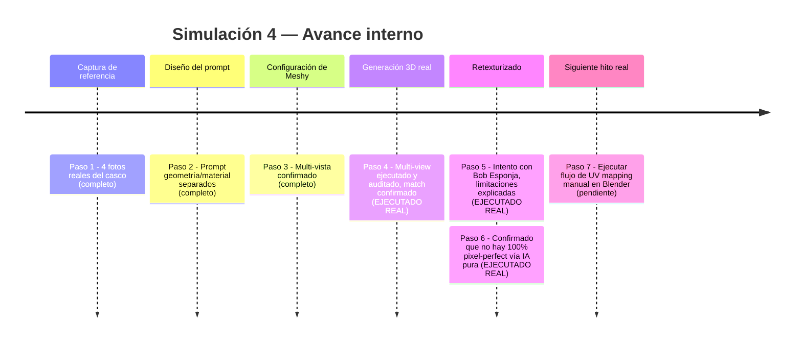
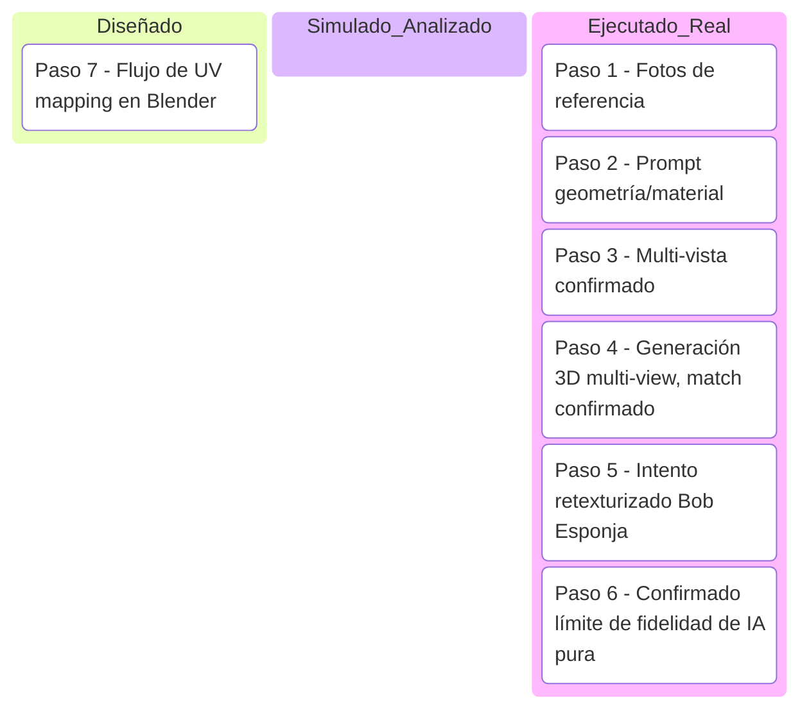

# Simulación 4 — Reconstrucción 3D del casco con Meshy AI (Etapa 2 — Turntable)

[← Volver al índice de mis pruebas](../mis-pruebas-claude-code.md)

Prueba de factibilidad de reconstrucción 3D fotorrealista de un casco EDGE físico real, usando Meshy AI (Image-to-3D, modo multi-vista) como candidato para la capa visual del futuro cotizador tipo carrito.

Pasos de la simulación

**Paso 1 — Conseguir fotos de referencia del casco físico**
4 vistas reales tomadas: frontal, lateral, 3/4-lateral, trasera. Fondo neutro, casco montado en soporte fijo — coherente con el estándar de captura ya usado en Etapa 1 (3 ángulos obligatorios: perfil 90°, 3/4 45°, superior).

**Paso 2 — Redactar el prompt separando geometría de material**
Se armó un prompt en inglés dividido en SHELL (carcasa, geometría + reflectividad), VISOR (material distinto, mecanismo de pivote), VENTS (conteo y posición exacta), HARDWARE (remaches, correa), MATERIALS (3 materiales distintos declarados explícitamente), y restricciones explícitas de no agregar logos ni alterar proporciones. Mismo principio que el prompt de Nano Banana Pro de la Simulación 1: anclar geometría no-negociable con coordenadas/conteos exactos.

**Paso 3 — Subir referencias multi-vista a Meshy**
Confirmado: Meshy sí soporta múltiples imágenes de referencia en el mismo proyecto (no limitado a una sola foto), lo cual reduce el riesgo de "alucinación" en las partes no fotografiadas directamente.

**Paso 4 — Elegir modelo de generación (multi-view, beta)**
✅ EJECUTADO REAL (en la otra sesión, Meshy web): se usó el modo multi-view (beta) con las 4 fotos de referencia juntas, en vez del modo estándar de una sola imagen. Resultado auditado por el propio agente de Meshy contra las 4 referencias:
- ✅ Carcasa blanca brillante con líneas de panel visibles
- ✅ Visor transparente con mecanismo de pivote en ambos lados
- ✅ Ventilaciones superiores (frontal-izq/frontal-der) y trasera, negras, posición correcta
- ✅ Correa con hebilla roja
- ✅ Remaches plateados cerca del mecanismo del visor
- ✅ Proporciones consistentes entre frente/atrás/lados — sin drift de geometría entre vistas
- Nota: la base/soporte quedó incluida en el modelo porque venía del trípode en las fotos (esperable con este método, hay que recortarla después)

**Paso 5 — Intento de retexturizado con diseño "Bob Esponja" (una sola vista lateral izquierda)**
✅ EJECUTADO REAL, con resultado honesto documentado: se pidió aplicar el diseño colorido tipo grafiti (imagen de referencia de una sola vista, lateral izquierda) como textura sobre el modelo 3D ya generado, sin tocar la geometría.

El agente de Meshy fue explícito sobre las limitaciones **antes** de ejecutar:
1. Retexturizar es un paso generativo, no un calcado pixel-perfecto — el resultado se inspira en colores/estilo/composición, no es una copia idéntica.
2. Detalles finos (ojos, texto pequeño, contornos delgados) tienden a perder nitidez al proyectarse sobre una malla curva.
3. La geometría (forma, ventilaciones, visor, correa) se mantiene intacta porque el retexturizado no toca la malla, solo el material de superficie.

**Paso 6 — Pregunta directa: ¿existe forma de que quede 100% igual?**
Respuesta honesta del agente de Meshy (no inventada, confirmada): **no existe proceso que garantice 100% idéntico** vía IA generativa pura, por 2 razones estructurales:
- El sistema tiene que "inventar" cómo se ve el diseño en las partes no fotografiadas (frente, lado derecho, atrás) porque solo hay 1 foto de 1 ángulo del diseño.
- El UV mapping automático de un retexturizado generativo no es edición quirúrgica — cada intento es una nueva generación completa, puede alterar partes que no se querían tocar.

**Paso 7 — Camino real para fidelidad exacta: Blender + UV mapping manual**
Blender (gratis) tiene todo lo necesario nativo:
- **UV Editing workspace** — desenvolver la malla 3D en un plano 2D para alinear la textura manualmente pieza por pieza (visor, ventilaciones, cuerpo por separado).
- **Texture Paint mode** — pintar directamente sobre el modelo 3D viendo el resultado en tiempo real sobre la superficie curva.
- **Image Editor + overlay UV** — alinear la imagen de referencia exactamente sobre las coordenadas UV.

Complementos opcionales de mayor precisión (pagos/externos): Substance 3D Painter (Adobe, estándar de industria), RizomUV (unwrapping especializado).

**Flujo propuesto para fidelidad real (pendiente de ejecutar):**
1. Exportar el GLB generado en Meshy a Blender.
2. Hacer UV unwrap limpio del casco, separando visor/ventilaciones/cuerpo.
3. Importar la imagen de referencia (Bob Esponja u otro diseño) como textura base.
4. Proyectar/pintar manualmente sobre la vista que sí tiene foto real (lateral izquierda).
5. Para las partes sin foto (frente, atrás, lado derecho), extender/inventar el diseño a mano con herramientas de pintura — este paso requiere trabajo humano o de un agente entrenado específicamente en esto, no es automático.

Línea de tiempo interna (Mermaid)

Kanban de progreso (Mermaid)

Checklist de respaldo:
- [x] Paso 1 — 4 fotos reales del casco (frontal, lateral, 3/4, trasera)
- [x] Paso 2 — Prompt con geometría/material separados
- [x] Paso 3 — Confirmado soporte multi-vista en Meshy
- [x] Paso 4 — Generación 3D real ejecutada y auditada (match confirmado en todos los elementos)
- [x] Paso 5 — Intento de retexturizado con diseño Bob Esponja (1 vista)
- [x] Paso 6 — Confirmado: no existe 100% pixel-perfect vía IA generativa pura
- [ ] Paso 7 — Ejecutar UV mapping manual en Blender para fidelidad real

Bitácora de decisiones

| Fecha | Decisión | Quién | Motivo |
|---|---|---|---|
| 2026-07-20 | Probar Meshy antes que Blender | Usuario | Menor curva de entrada, prueba rápida vía suscripción Pro con descuento primer mes |
| 2026-07-20 | Pagar suscripción Meshy Pro solo para la prueba | Usuario | Costo bajo ($10.40 primer mes) vs. valor de validar factibilidad antes de comprometer más tiempo |
| 2026-07-20 | Usar modo multi-view (beta) en vez de imagen única | Usuario, sugerido por agente Meshy | El requisito de "match exacto sin alterar proporciones" pesa más que el riesgo de artefactos de blending del modo beta |
| 2026-07-20 | Confirmado: retexturizado generativo no llega a 100% fidelidad | Agente Meshy (honesto, no forzado) | Limitación estructural: 1 sola foto de referencia de diseño, UV mapping automático no es edición quirúrgica |
| 2026-07-20 | Camino a seguir para fidelidad real: Blender + UV manual | Usuario + agente Meshy | Única forma de réplica pixel-perfect es intervención manual, no existe atajo de IA pura |
| Pendiente | Cancelar suscripción Meshy tras terminar las pruebas | Usuario | Evitar cobro recurrente de $20.80/mes si no se usa continuamente |

✅ **VALIDADO (parcial)** — la generación 3D multi-view fue ejecutada real y auditada con match confirmado. El retexturizado 100% fiel sigue 🧪 **SIMULACIÓN** — requiere el flujo de Blender (Paso 7), todavía no ejecutado.
