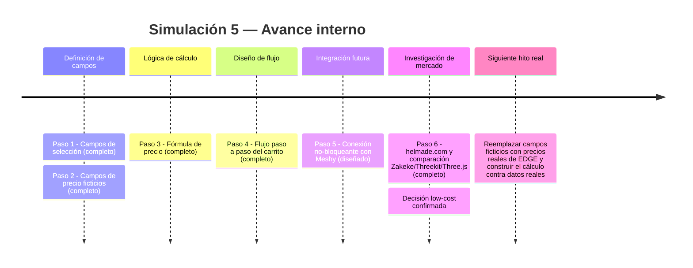
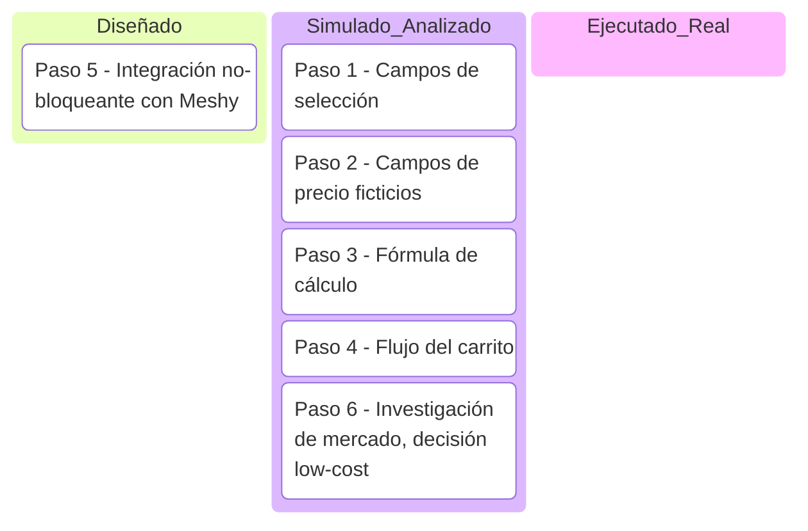

# Simulación 5 — Cotizador tipo carrito (Fase 3 — Ventas/Cotización)

[← Volver al índice de mis pruebas](../mis-pruebas-claude-code.md)

Diseño del flujo y los campos del cotizador donde el cliente arma su pedido de cascos EDGE eligiendo modelo, colorway, talle y cantidad, con precio calculado y (a futuro) visualización 3D del casco ensamblándose.

**Nota explícita:** el usuario confirmó que el precio SÍ varía por colorway/talle en la realidad, pero para esta etapa de diseño se usan campos ficticios — ningún precio de esta simulación es un precio real de EDGE, son placeholders para probar la lógica del flujo.

<details><summary>Pasos de la simulación</summary>

**Paso 1 — Definir los campos de selección del cliente**
- `modelo` (referencia al golden record de Etapa 0 — no se inventa un modelo que no exista en catálogo)
- `colorway` (depende del modelo elegido, limita las opciones disponibles)
- `talle` (S/M/L/XL — genérico por ahora, pendiente de tabla real de talles EDGE)
- `cantidad` (entero ≥1)

**Paso 2 — Definir campos de precio (FICTICIOS, placeholder)**

| Campo | Valor ficticio | Nota |
|---|---|---|
| `precio_base_modelo` | $XX.XX (placeholder) | Varía por modelo — dato real pendiente de EDGE |
| `recargo_colorway_especial` | +$X.XX (placeholder) | Solo aplica a colorways premium/edición limitada — a confirmar cuáles |
| `descuento_por_cantidad` | 0% (1-4u) / X% (5-9u) / X% (10+u) | Umbrales ficticios, pendiente de política real de mayorista |
| `costo_envio` | $X.XX o "a definir por destino" | Pendiente de definir si se cotiza en el mismo flujo o después |

**Paso 3 — Definir la fórmula de cálculo (con placeholders)**
```
precio_unitario = precio_base_modelo + recargo_colorway_especial
subtotal = precio_unitario × cantidad
descuento = subtotal × descuento_por_cantidad
total = subtotal − descuento + costo_envio
```

**Paso 4 — Definir el flujo paso a paso del "carrito"**
1. Cliente elige modelo → sistema muestra colorways disponibles para ese modelo
2. Cliente elige colorway → (a futuro) se actualiza vista 3D/imagen del casco
3. Cliente elige talle y cantidad → sistema calcula precio en vivo
4. Cliente confirma → se genera cotización con desglose visible (no solo el total)

**Paso 5 — Conectar con la capa visual (Meshy, opcional y no bloqueante)**
El cotizador debe funcionar completo con imágenes estáticas por colorway aunque el 3D de Meshy ([Simulación 4](simulacion-4-meshy-3d.md)) no esté listo — el 3D se suma como mejora visual, nunca como requisito para que el cotizador funcione.

**Paso 6 — Investigación de mercado: mejores sistemas de cotización para nichos**
Investigado (ver bitácora): helmade.com es la referencia directa más cercana (configurador 3D real de cascos de moto de marcas reales). Opciones evaluadas de más barata a más cara: Three.js/React Three Fiber + GLB de Meshy (gratis, requiere desarrollo propio) → Zakeke (~$68-340/mes, SaaS Shopify) → Threekit (enterprise, 3-6 meses de implementación). Meshy exporta GLB compatible sin conversión con cualquiera de las 3. Decisión: empezar por la ruta low-cost (Three.js + GLB de Meshy).

</details>

<details><summary>Línea de tiempo interna (Mermaid)</summary>



</details>

<details><summary>Kanban de progreso (Mermaid)</summary>



Checklist de respaldo:
- [x] Paso 1 — Campos de selección (modelo, colorway, talle, cantidad)
- [x] Paso 2 — Campos de precio ficticios definidos
- [x] Paso 3 — Fórmula de cálculo definida
- [x] Paso 4 — Flujo paso a paso del carrito
- [x] Paso 6 — Investigación de mercado completa, decisión low-cost tomada
- [ ] Paso 5 — Reemplazar precios ficticios por reales de EDGE
- [ ] Ejecución real contra base de datos de catálogo

</details>

🧪 **SIMULACIÓN — todos los precios son placeholders ficticios, no representan precios reales de EDGE. La lógica del flujo y la investigación de mercado son la parte validable hoy; los números deben reemplazarse antes de producción.**
