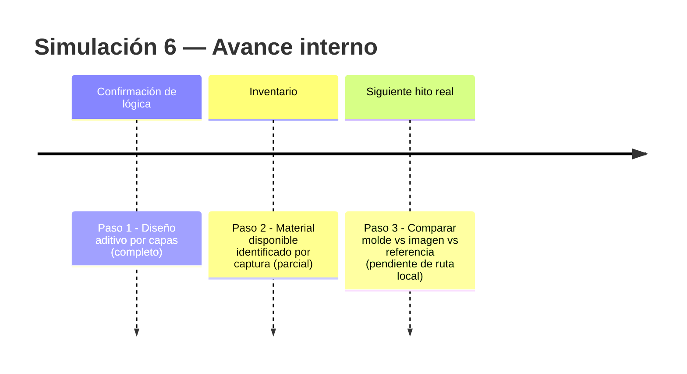
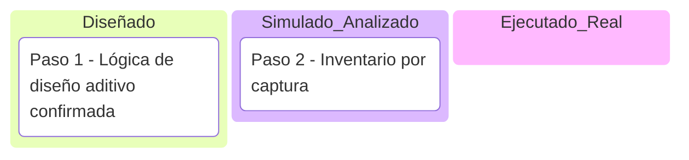

# Simulación 6 — Adaptación 2D "God Father" con Nano Banana (Etapa 1 — Ilustración)

[← Volver al índice de mis pruebas](../mis-pruebas-claude-code.md)

Proyecto nuevo: adaptar varios cascos ya existentes (carpeta local `Adaptacion God Father`, con 9 imágenes + `GODFATHER-HERO.ai.pdf`) usando el flujo ya validado de Nano Banana + prompts — no 3D, imágenes 2D listas para vender. Mismo patrón aditivo que Etapa 1: casco base + capas de colorway/gráficos superpuestas, no un diseño desde cero.

**Nota explícita:** el usuario confirmó que ya tiene un proceso y prompts que probaron funcionar en casos anteriores (mismo patrón de trasplante de máscara ya usado en EDGE Boston) — esta simulación no reinventa la técnica, la aplica al caso "God Father".

Pasos de la simulación

**Paso 1 — Confirmar la lógica de diseño aditivo**
El casco se arma por capas: base sin diseño → se van añadiendo elementos (color, gráfico, tono) uno sobre otro, cada capa respeta lo que ya está puesto. No es "generar un diseño específico desde cero", es "agregar N elementos sobre un casco base".

**Paso 2 — Inventario de material disponible (según captura, sin acceso al archivo real todavía)**
Carpeta local con 9 imágenes (varios ángulos: frontal, lateral, vista invertida, rotada) + 1 PDF (`GODFATHER-HERO.ai.pdf`). Nombres identificados en capturas posteriores: "vista lateral hero", "trasera bob", "ROTATE PADRINO". Pendiente confirmar cuáles son molde/checkpoint real y cuáles son intentos ya generados.

**Paso 3 — Comparación molde vs. imagen vs. referencia (PENDIENTE — requiere acceso real)**
No ejecutado todavía: falta la ruta local completa de la carpeta para leer los archivos reales y aplicar el mismo criterio de auditoría ya usado en el pipeline (comparación elemento por elemento contra checklist, separación geometría/textura vs. decal plano).

Línea de tiempo interna (Mermaid)

Kanban de progreso (Mermaid)

Checklist de respaldo:
- [x] Paso 1 — Confirmar lógica de diseño aditivo por capas
- [x] Paso 2 — Inventario preliminar (por captura de pantalla)
- [ ] Paso 3 — Leer archivos reales y comparar molde vs. imagen vs. referencia (pendiente: ruta local de la carpeta)

🧪 **SIMULACIÓN — lógica de diseño confirmada, pero la auditoría real molde/imagen/referencia no se ejecutó todavía. Falta la ruta local de `Adaptacion God Father` para leer los archivos de verdad.**
