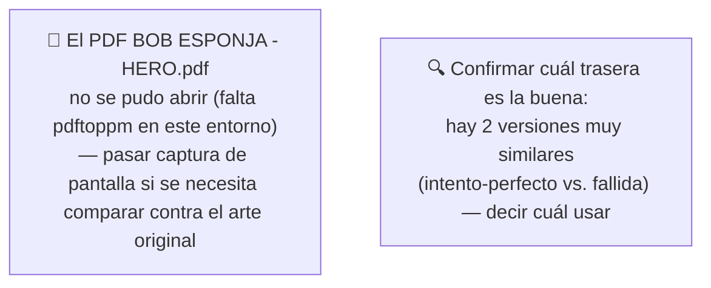
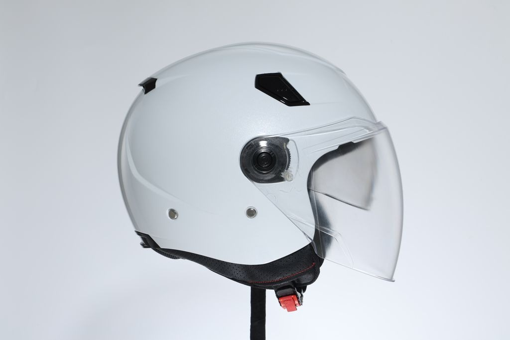
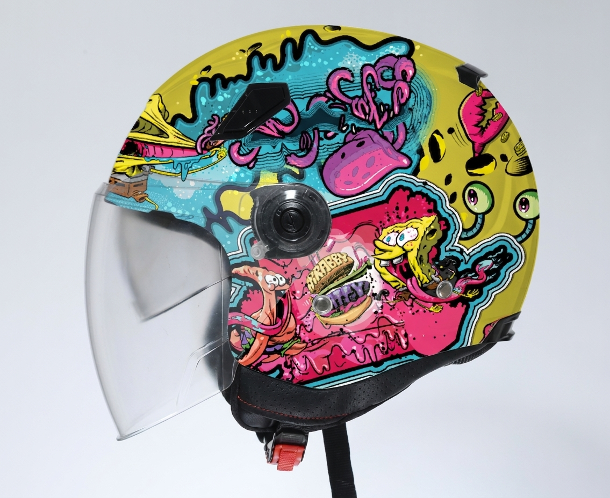
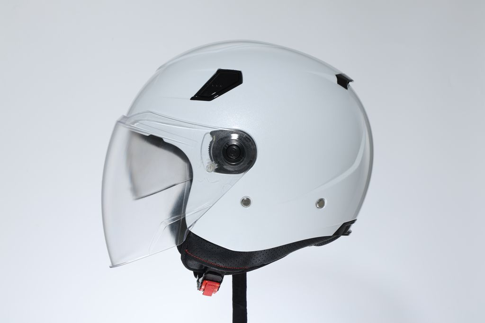
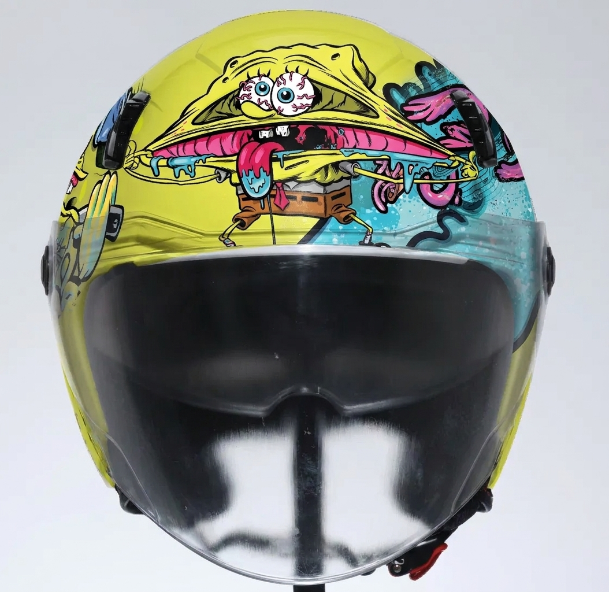
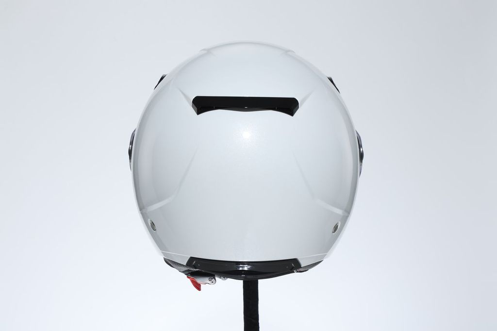
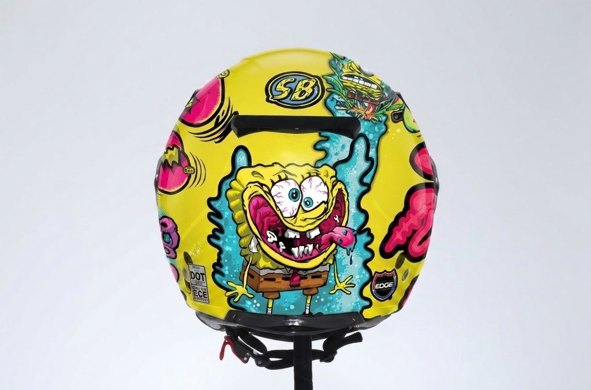
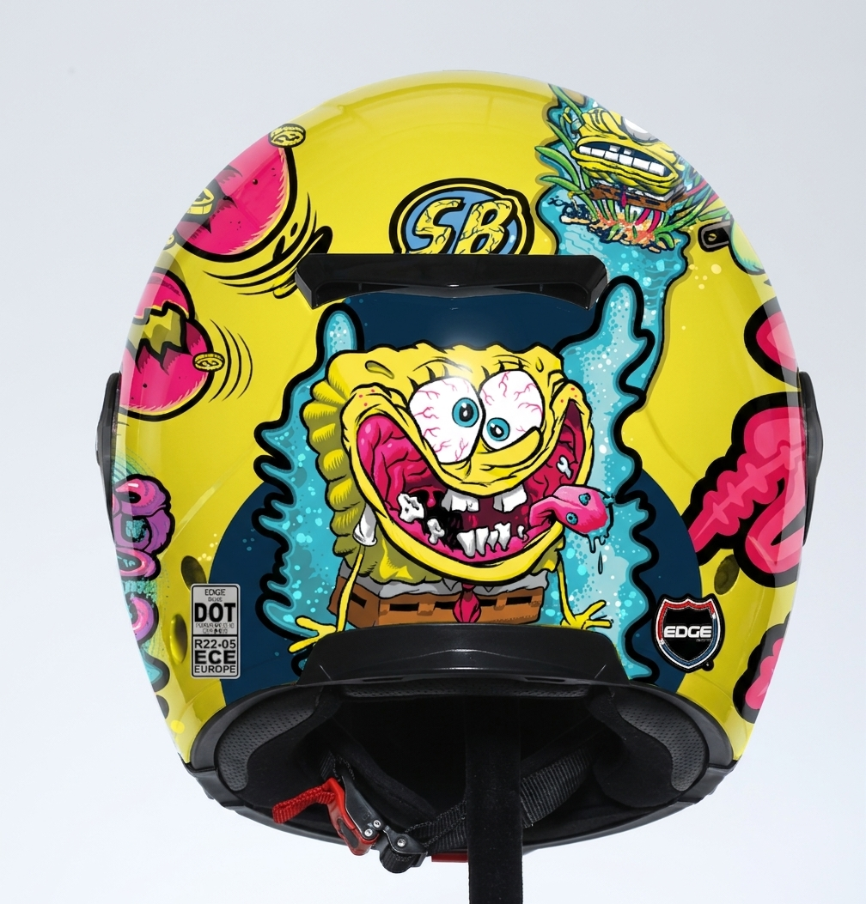
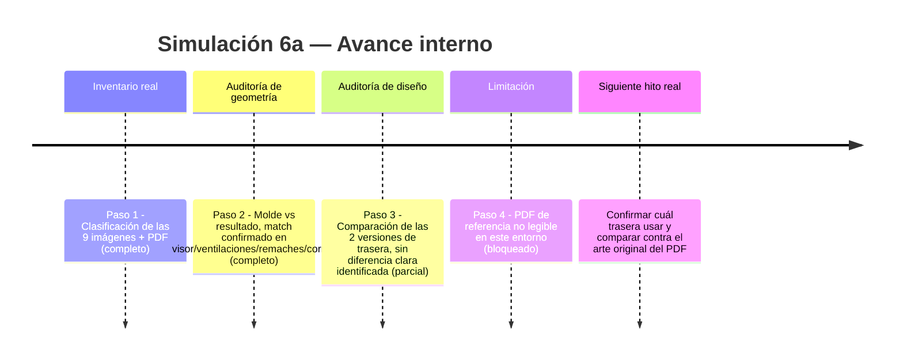
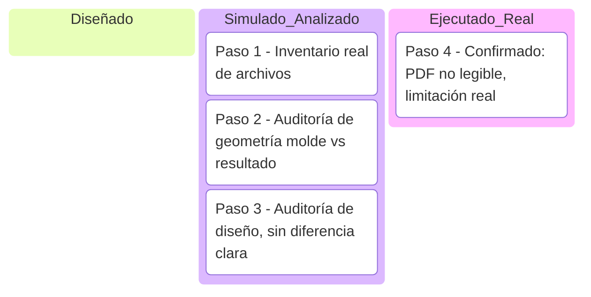

# Simulación 6a — Adaptación 2D "Bob Esponja" con Nano Banana (Etapa 1 — Ilustración)

[← Volver al índice de mis pruebas](../mis-pruebas-claude-code.md) · [← Volver a Simulación 6 (God Father)](simulacion-6-god-father.md)

Caso concreto dentro del proyecto de adaptación 2D: casco EDGE (mismo molde abierto/jet usado en varios casos) con diseño tipo grafiti "Bob Esponja" (Krabby Patty, ojos inyectados, cerebro expuesto) aplicado por capas sobre la geometría real del casco.

### 🔴 Pendiente de tu parte

Pasos de la simulación

**Paso 1 — Inventario real de archivos (ejecutado, carpeta leída completa)**
Carpeta: `Adaptacion bob sponja` — 9 imágenes + 1 PDF. Clasificación real después de ver cada archivo:

| Archivo | Rol identificado |
|---|---|
| `ROTATE PADRINO.JPG` | Molde — casco blanco liso, vista lateral |
| `WhatsApp Image 2026-07-16...jpeg` | Molde — casco blanco liso, vista frontal |
| `tarsera bob.jpeg` | Molde — casco blanco liso, vista trasera |
| `9HEnaD9u.jpeg` | Molde — casco blanco liso, vista 3/4 |
| `bob sponja uno.jpg` | Resultado — vista lateral con diseño aplicado |
| `frontal bob.jpg` | Resultado — vista frontal con diseño aplicado |
| `intento oerfecto bob e atras.jpg` | Resultado — vista trasera, marcada por el usuario como "intento perfecto" |
| `vista tarsera( fallida.jpg` | Resultado — vista trasera, marcada por el usuario como "fallida" |
| `vista tarer lsita apr edicion.jpg` | Resultado — variante lateral en edición |
| `BOB ESPONJA - HERO.pdf` | Arte de referencia original — **no se pudo abrir** (falta `pdftoppm` en este entorno) |

**Paso 2 — Auditoría de geometría: molde vs. resultado**
Comparando el molde blanco (lateral, frontal, trasera) contra las 3 vistas equivalentes del resultado:
- ✅ Visor: misma forma, mismo mecanismo de pivote circular en el mismo lugar
- ✅ Ventilaciones superiores: mismo conteo y posición (2 aberturas negras simétricas)
- ✅ Remaches plateados: en la misma posición cerca del visor
- ✅ Correa con hebilla roja: idéntica en molde y resultado
- ✅ Silueta general: sin deformación entre molde y resultado — la geometría del casco no cambió, solo se agregó color/gráfico encima (confirma el patrón aditivo, no reconstrucción)

**Paso 3 — Auditoría del diseño: las dos versiones de trasera**
Las dos imágenes traseras (`intento oerfecto...` y `...fallida`) son muy parecidas a simple vista — mismo personaje (Bob Esponja con ojos inyectados y cerebro expuesto), mismo logo "SB", mismo logo EDGE, mismas etiquetas de certificación DOT/ECE en la misma posición. La diferencia entre ambas no es evidente sin una comparación lado a lado más fina (posible diferencia de nitidez/color en detalles pequeños) — no se puede afirmar con certeza cuál falló y por qué sin que el usuario lo aclare.

**Paso 4 — Limitación: no hay comparación contra el arte original**
No se pudo abrir el PDF de referencia (`BOB ESPONJA - HERO.pdf`) por falta de herramienta de renderizado en este entorno. Esto significa que la auditoría de fidelidad de diseño (Paso 3) se hizo solo comparando resultado contra resultado, no resultado contra el arte original — es una limitación real, no se debe asumir que el diseño es 100% fiel al hero sin esa comparación.

Comparación visual (molde vs. resultado)

| Vista | Molde (real) | Resultado (generado) |
|---|---|---|
| Lateral |  |  |
| Frontal |  |  |
| Trasera |  |  |
| Trasera (alternativa) | — |  |

Línea de tiempo interna (Mermaid)

Kanban de progreso (Mermaid)

Checklist de respaldo:
- [x] Paso 1 — Inventario real de las 9 imágenes + PDF
- [x] Paso 2 — Auditoría de geometría (match confirmado)
- [x] Paso 3 — Comparación de las 2 versiones de trasera (sin diferencia clara)
- [x] Paso 4 — Confirmada limitación: PDF no renderizable en este entorno
- [ ] Comparar resultado final contra el arte original del PDF (pendiente de captura de pantalla)
- [ ] Confirmar cuál trasera es la definitiva

🧪 **SIMULACIÓN — geometría validada por auditoría real (molde vs. resultado coinciden), pero la fidelidad del diseño contra el arte original no se pudo verificar por la limitación del PDF.**
