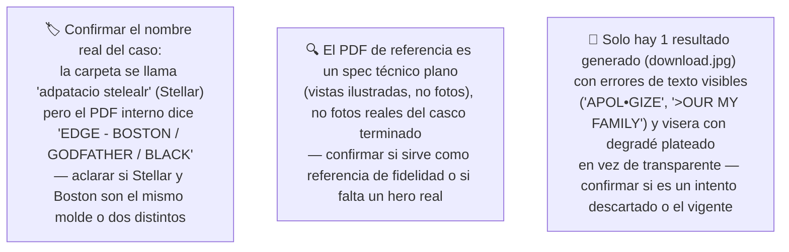
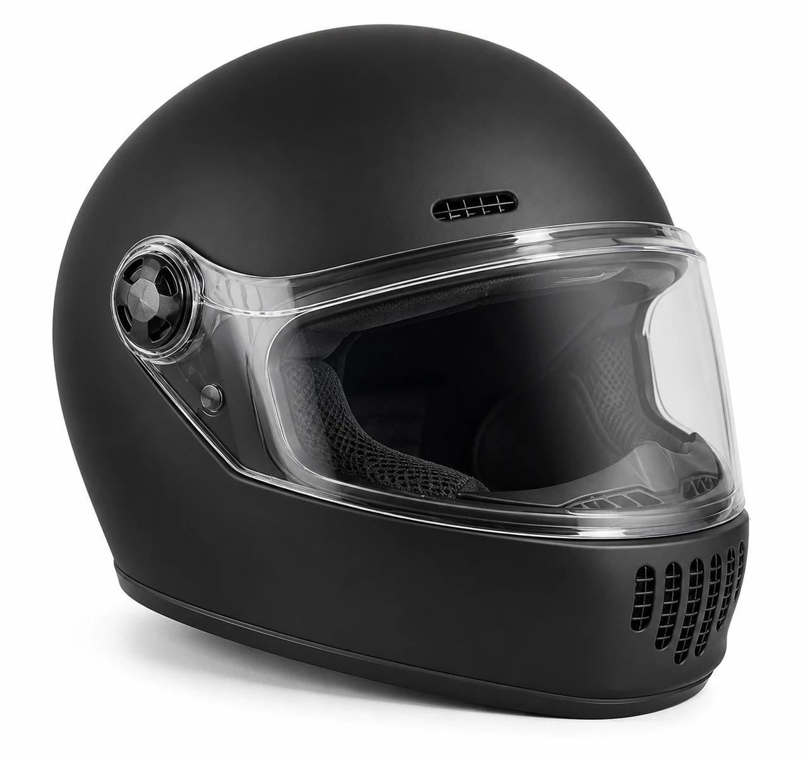
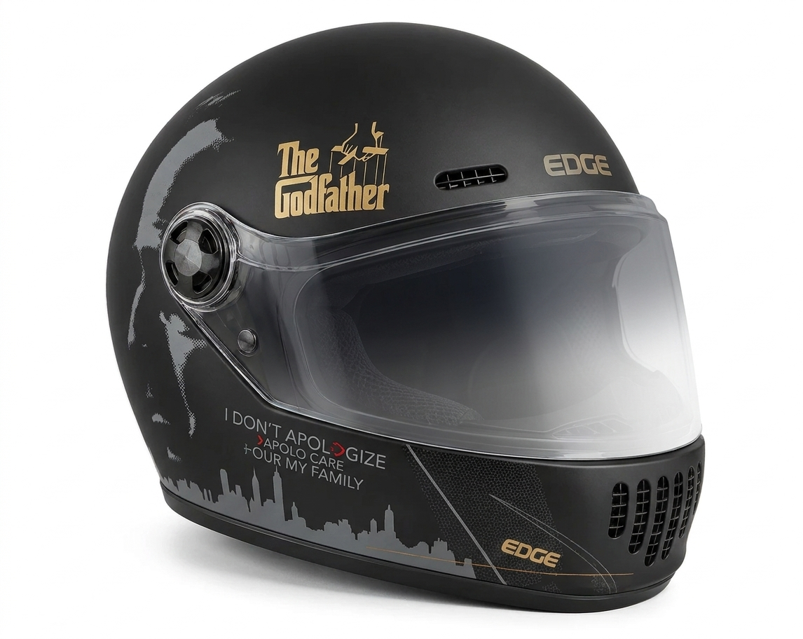
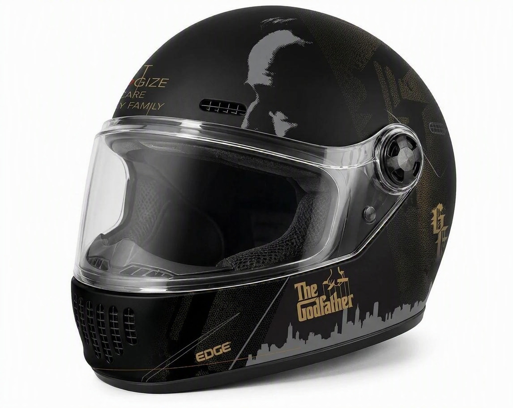
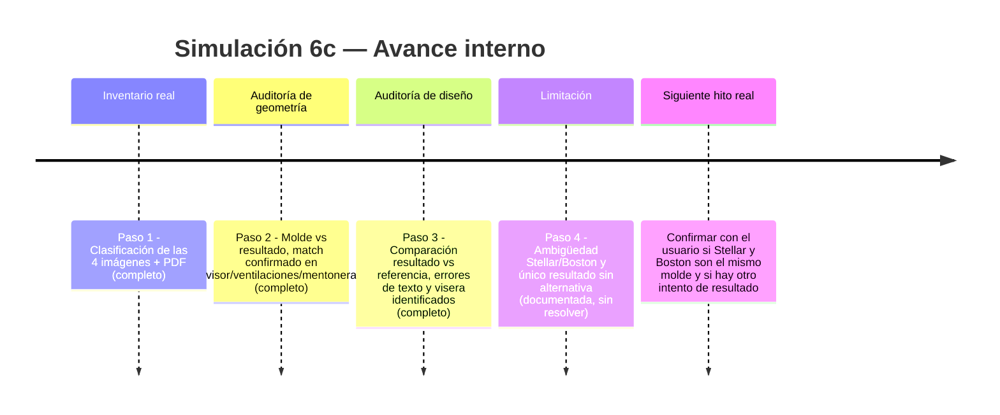
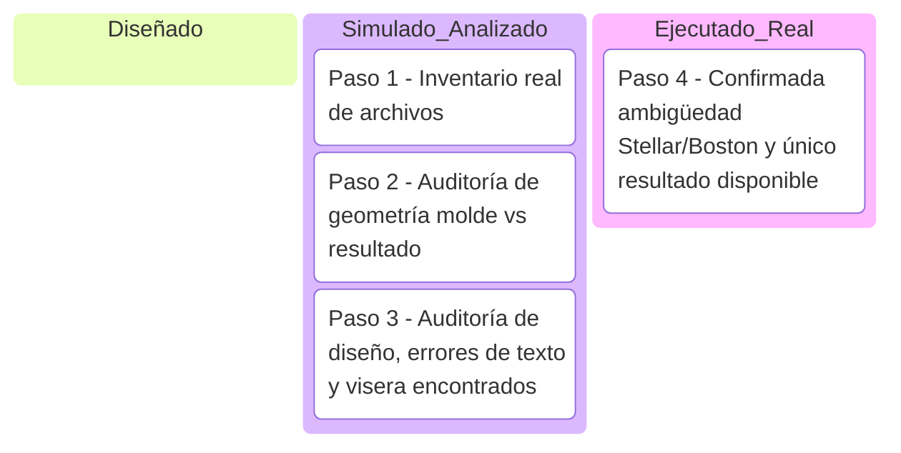

# Simulación 6c — Adaptación 2D "Stellar" con Nano Banana (Etapa 1 — Ilustración)

[← Volver al índice de mis pruebas](../mis-pruebas-claude-code.md) · [← Volver a Simulación 6 (God Father)](simulacion-6-NANO%20BANANA.md)

Caso concreto dentro del proyecto de adaptación 2D: casco EDGE tipo integral (mismo molde/carcasa cerrada usado en otros casos) al que se le intenta trasplantar el diseño gráfico "The Godfather" (ya documentado en el caso hermano God Father/Padrino) sobre la carcasa identificada como modelo **Stellar**. Mismo patrón aditivo: casco base liso → capas de colorway/gráficos superpuestas, no reconstrucción de geometría.

### 🔴 Pendiente de tu parte

Pasos de la simulación

**Paso 1 — Inventario real de archivos (ejecutado, carpeta leída completa)**
Carpeta: `Catalogo paramount/adpatacio stelealr` — 4 imágenes + 1 PDF. Clasificación real después de ver cada archivo:

| Archivo | Rol identificado |
|---|---|
| `calota stellar.png` | Molde — casco integral negro mate liso, sin ningún gráfico, vista 3/4 lateral. Es la carcasa base del modelo Stellar. |
| `GODFATHER STELLAR.pdf` | Referencia de diseño — spec técnico plano "EDGE - BOSTON / GODFATHER / BLACK" con vistas ilustradas (lateral x2, trasera, superior, 3/4), paleta Pantone (7562C, 871C, 877C, 426C) y color de pintura BLACK. Es una ilustración técnica, no una foto. |
| `stellar.jpg` | Referencia — foto de producto terminado con el diseño "The Godfather" (texto correcto: "I DON'T APOLOGIZE / TO TAKE CARE / OF MY FAMILY", logo "The Godfather" legible, silueta de ciudad, visera transparente). Idéntica en composición a `originalstellar.JPG`. |
| `originalstellar.JPG` | Referencia — misma foto que `stellar.jpg` (mismo archivo o casi idéntico, sin diferencias visibles a simple vista). |
| `download.jpg` | Resultado generado por IA — mismo diseño "Godfather" aplicado, pero con errores: texto "I DON'T APOL•GIZE" (símbolo en vez de O), ">OUR MY FAMILY" en vez de "OF MY FAMILY", visera con degradé plateado/espejado en vez de transparente, logo "The Godfather" sí presente pero doble logo "EDGE" (arriba y abajo). |

**Nota sobre ambigüedad de nombres:** el diseño gráfico en todos los archivos es "The Godfather" (mismo que el caso hermano `simulacion-6b-padrino.md`), no un diseño distinto llamado "Stellar". Todo indica que **"Stellar" es el nombre del molde/carcasa** sobre el que se está trasplantando el diseño Godfather — es decir, este caso es "Godfather aplicado al molde Stellar", igual que el caso Boston ya documentado en la memoria del proyecto (EDGE Boston — trasplante de diseño con máscara). El PDF interno incluso dice "BOSTON" en el título, lo que suma confusión sobre si Stellar y Boston son el mismo molde con nombres distintos o dos moldes distintos. No se debe asumir ninguna de las dos sin confirmación del usuario.

**Paso 2 — Auditoría de geometría: molde vs. resultado**
Comparando `calota stellar.png` (molde liso) contra `download.jpg` (resultado):
- ✅ Silueta general del casco: integral cerrado, misma proporción de calota, mentonera y mandíbula
- ✅ Ventilación superior (rejilla rectangular): misma posición y forma
- ✅ Mecanismo de pivote de la visera (tornillo circular lateral): mismo lugar, mismo tamaño
- ✅ Rejillas de ventilación inferior/mentonera: mismo patrón de ranuras
- Conclusión: no hay deformación de geometría entre molde y resultado — confirma otra vez el patrón aditivo (color/gráfico encima, casco sin reconstruir)

**Paso 3 — Auditoría de fidelidad del diseño: resultado vs. referencia**
Comparando `download.jpg` (resultado IA) contra `stellar.jpg`/`originalstellar.JPG` (referencia con diseño correcto) y el PDF (spec técnico):
- ❌ Texto "I DON'T APOLOGIZE" mal reproducido como "I DON'T APOL•GIZE" (carácter incorrecto en vez de "O")
- ❌ Texto "TO TAKE CARE / OF MY FAMILY" mal reproducido como "APOLO CARE / >OUR MY FAMILY" (texto ilegible/corrupto, típico error de generación de tipografía por IA)
- ❌ Logo "The Godfather" ausente en `download.jpg` en la posición donde debería estar (en la referencia aparece arriba cerca del logo EDGE); en el resultado no es visible con claridad
- ❌ Visera: en la referencia es transparente/clara; en el resultado tiene un degradé plateado/espejado que no coincide con ningún casco de referencia
- ⚠️ Logo "EDGE" duplicado (aparece arriba y abajo en el resultado, cuando en la referencia solo aparece una vez arriba)
- Conclusión: la fidelidad de texto y de algunos elementos gráficos del resultado es baja — son errores típicos de generación de tipografía por IA (Nano Banana), consistentes con las "debilidades mecánicas recurrentes" ya anotadas en la memoria del proyecto para este flujo.

**Paso 4 — Limitación honesta**
No se pudo determinar si `download.jpg` es el intento final/vigente o un intento descartado — no hay ningún otro resultado en la carpeta para comparar, y no hay indicación textual del usuario sobre cuál usar. Tampoco se pudo confirmar si "Stellar" y "Boston" (nombre que aparece en el PDF) son el mismo molde de casco o dos moldes distintos — se documenta la ambigüedad tal como se encontró, sin resolverla por inferencia.

Comparación visual (molde vs. referencia vs. resultado)

| Vista | Molde (real, sin diseño) | Referencia (diseño Godfather correcto) | Resultado IA (Stellar) |
|---|---|---|---|
| 3/4 lateral |  |  |  |
| 3/4 lateral (variante) | — |  | — |

Línea de tiempo interna (Mermaid)

Kanban de progreso (Mermaid)

Checklist de respaldo:
- [x] Paso 1 — Inventario real de las 4 imágenes + PDF
- [x] Paso 2 — Auditoría de geometría (match confirmado, sin deformación)
- [x] Paso 3 — Auditoría de fidelidad de diseño (errores de texto y visera confirmados)
- [x] Paso 4 — Confirmada limitación: ambigüedad Stellar/Boston, un solo resultado sin alternativa
- [ ] Confirmar con el usuario si Stellar y Boston son el mismo molde
- [ ] Confirmar si `download.jpg` es el intento final o hay que regenerar por los errores de texto

🧪 **SIMULACIÓN — geometría validada por auditoría real (molde vs. resultado coinciden), pero la fidelidad del diseño NO se valida: el único resultado disponible tiene errores de texto visibles y una visera que no coincide con la referencia. Además queda sin resolver si "Stellar" es el mismo molde que "Boston" (el PDF interno usa ese segundo nombre).**
