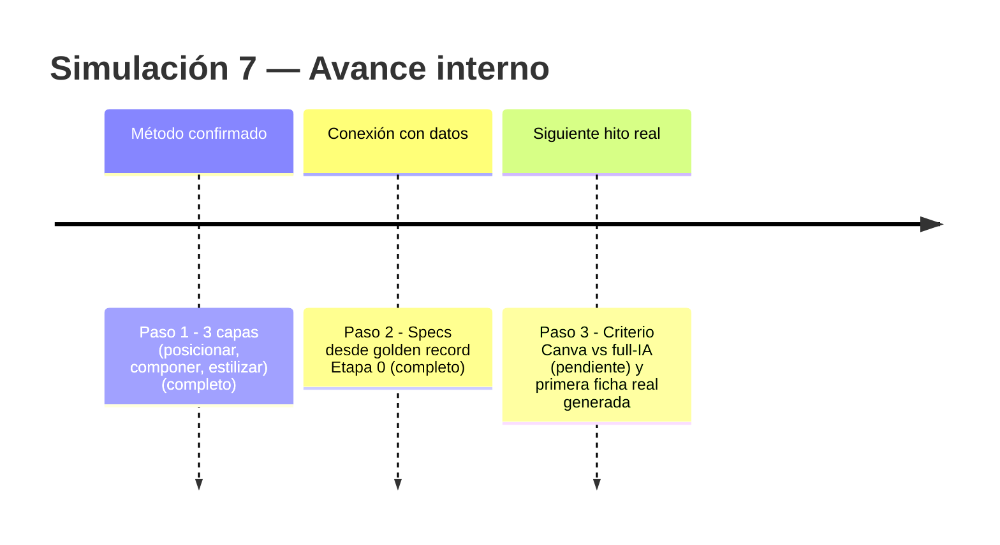
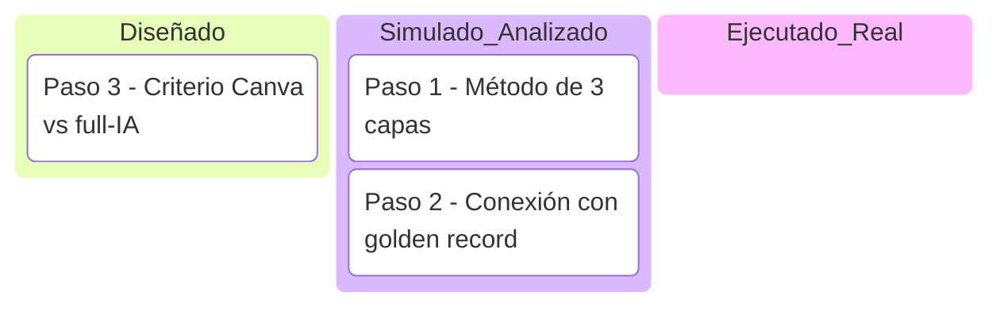

# Simulación 7 — Catálogo / ficha técnica automatizada (Etapa 3)

[← Volver al índice de mis pruebas](../mis-pruebas-claude-code.md)

Conecta directo con **Etapa 3 — Catálogo/ficha** del pipeline principal (ya tenía "10/10 decisiones cerradas, ejecución pendiente"). Esta simulación registra el método real que ya usan, no uno nuevo inventado acá.

**Método ya validado por el usuario (full IA, con Canva como acelerador opcional):**
1. Claude Code posiciona los elementos de la ficha (texto, specs, recuadros) de forma independiente de las imágenes del casco, que se generan por separado.
2. Esos elementos se pegan automáticamente sobre un lienzo/hoja en blanco (composición armada por IA, no manual).
3. Se pasa una capa de Nano Banana encima para editar y estilizar los elementos ya posicionados (tipografía, color, terminado visual).
4. Opcional: Canva como atajo para agilizar cuando full-IA es más lento que armarlo a mano en esa herramienta puntual.

Pasos de la simulación

**Paso 1 — Confirmar el método de 3 capas**
Capa 1: posicionamiento de elementos (Claude Code) → Capa 2: composición sobre lienzo en blanco (automática) → Capa 3: edición/estilizado (Nano Banana). Método ya en uso, no experimental.

**Paso 2 — Conectar con specs ya validadas**
Los datos que van en la ficha (marca, modelo, certificación, specs técnicas) deben salir del golden record de Etapa 0 — mismas restricciones de "campo no verificado no se publica" ya definidas ahí, no se duplican reglas nuevas.

**Paso 3 — Definir cuándo usar Canva vs. full-IA (PENDIENTE)**
Falta un criterio explícito: ¿Canva se usa siempre como paso intermedio, o solo cuando el flujo full-IA falla/tarda demasiado? No inventado — pendiente de que el usuario lo precise con un caso real.

Línea de tiempo interna (Mermaid)

Kanban de progreso (Mermaid)

Checklist de respaldo:
- [x] Paso 1 — Método de 3 capas confirmado (posicionar / componer / estilizar)
- [x] Paso 2 — Conexión con specs del golden record de Etapa 0
- [ ] Paso 3 — Definir criterio Canva vs. full-IA
- [ ] Generar la primera ficha real de punta a punta

🧪 **SIMULACIÓN — método de 3 capas confirmado y ya usado antes por el usuario, pero no hay todavía una ficha real generada de punta a punta dentro de este registro.**
