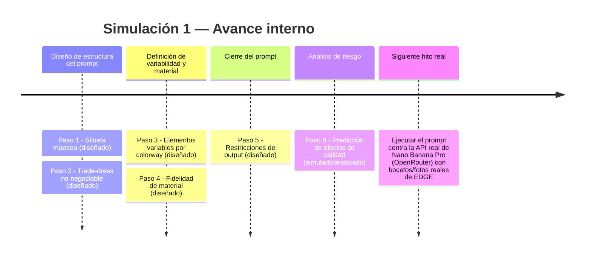
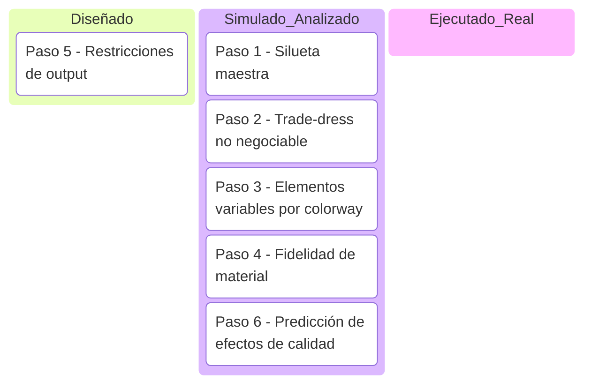
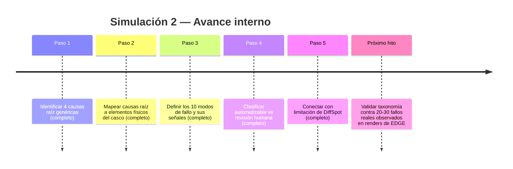
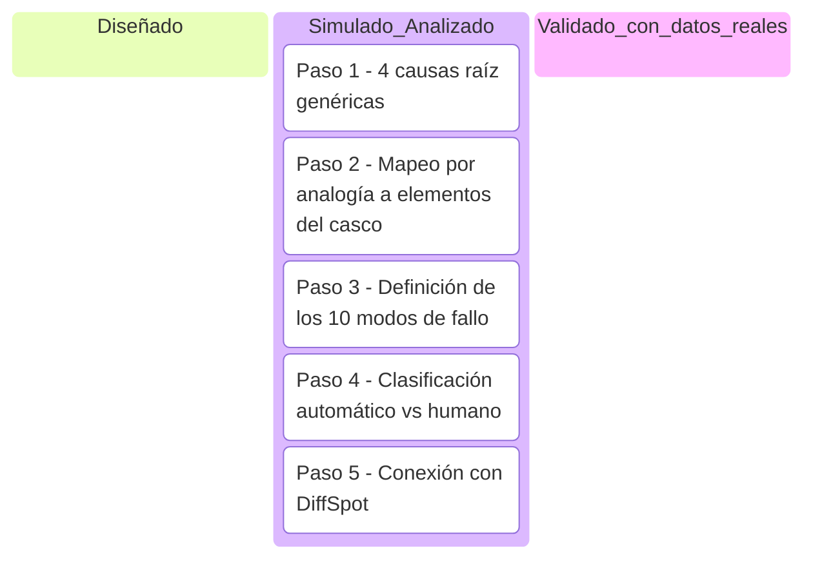
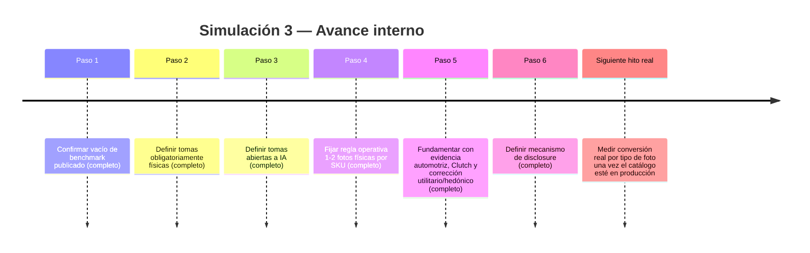
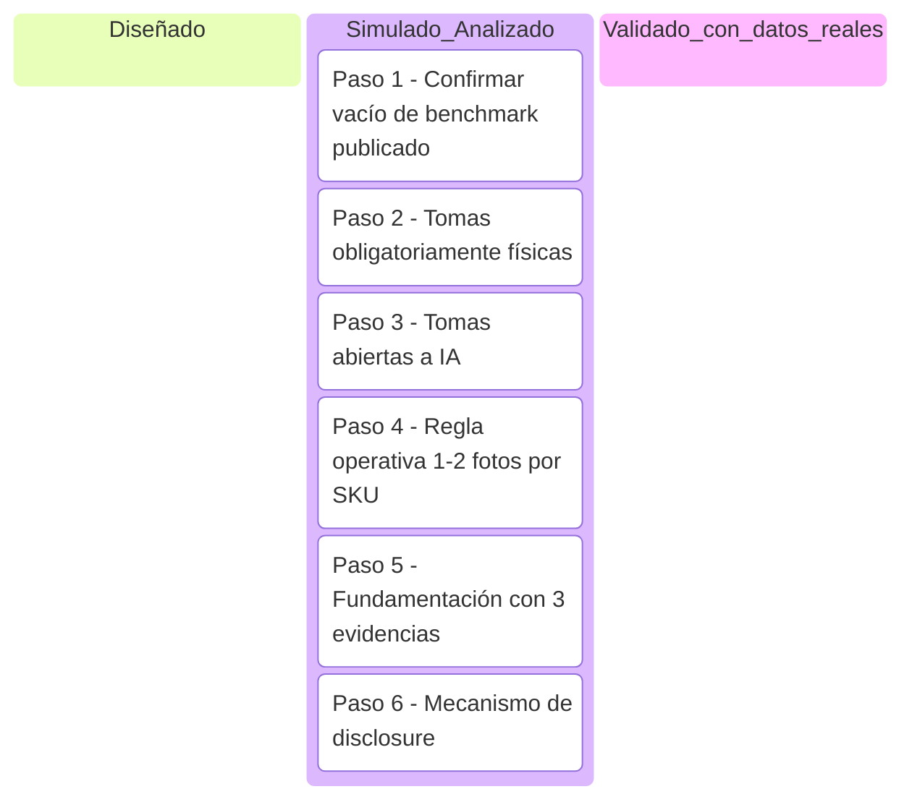

# Índice de simulaciones — Pipeline EDGE

**Qué es este documento:** un registro de pasos "ejecutados en papel" — se construye el artefacto real (prompt, política, taxonomía) y se analiza su efecto esperado usando la investigación ya validada, SIN llamar a la API real todavía. Esto no reemplaza la ejecución real: reduce el riesgo de que la primera ejecución real falle por un diseño evitable.

**Regla de este documento:** toda simulación lleva la marca 🧪 **SIMULACIÓN — no ejecutado contra la API/dato real**. Cuando una simulación se valide con ejecución real, se marca ✅ **VALIDADO** y se traslada como hallazgo real a `pipeline-edge-6-meses.md`.

**Estructura de cada simulación:** cada una es una página autocontenida, dividida en pasos, con su propia línea de tiempo (Mermaid), su propio kanban de progreso (Mermaid, con checklist de respaldo), y su propio análisis según la lógica de Tomás de Aquino (causa final, actus humanus/hominis, acto/potencia). Todo colapsable.

---

Simulación 1 — Prompt de render Nano Banana Pro (Etapa 1)

Esta simulación diseña el prompt de 5 secciones que convierte un boceto de casco EDGE sobre molde en un render fotorrealista vía Nano Banana Pro (OpenRouter), como Etapa 1 del pipeline de render del proyecto EDGE.

Pasos de la simulación

**Paso 1 — Definir la silueta maestra no negociable**
Contenido: 3 ángulos de referencia obligatorios — perfil 90°, 3/4 45°, superior — con proporciones exactas fijadas entre sí, de modo que el modelo no pueda "reinterpretar" la forma general del casco en ninguno de los tres.
Riesgo: sin la silueta con los 3 ángulos simultáneos, el render es inconsistente entre ángulos (el casco "cambia de forma" según desde dónde se ve).

**Paso 2 — Especificar elementos de trade-dress no negociables**
Contenido:
- Spoiler trasero: 4cm de alto, posicionado a 15% de la línea de corona, ángulo de 12°.
- Apertura de visor: 220mm ancho x 85mm alto, radio de esquina 8mm.
- Línea de ventilación: EXACTAMENTE 3 vents de 18x6mm, espaciados 12mm, con el conteo repetido dos veces en el texto del prompt para anclar el detalle.
- Mentonera: 70mm de profundidad, sin línea de partición visible.

Riesgos:
- Sin coordenadas exactas del spoiler, cada variante genera una forma distinta.
- Sin el radio de esquina del visor, el modelo redondea de más o produce una forma angular.
- Sin el conteo exacto de vents, el modelo funde los vents entre sí o cambia el número.

**Paso 3 — Definir elementos variables por colorway**
Contenido: color, gráficos y tinte de visor quedan como parámetros abiertos que cambian entre variantes, en contraste con las secciones 1 y 2 que son fijas.

**Paso 4 — Especificar fidelidad de material**
Contenido:
- 4a: shell en policarbonato semi-mate, sheen 20-30%, con micro-textura orange-peel.
- 4b: visor con material distinto al shell, reflectividad direccional 15-20% (ni espejo ni mate opaco).
- 4c: iluminación de estudio de 3 puntos, fondo neutro.

Riesgo: sin especificar el material del visor de forma distinta al shell, sale con reflejos inconsistentes entre variantes.

**Paso 5 — Definir restricciones de output**
Contenido: sin props, sin logos nuevos, vista 3/4 centrada.

**Paso 6 — Simular y predecir efectos de calidad (sin ejecución real todavía)**
Efectos esperados:
1. Reflejos del visor probablemente inconsistentes entre variantes — mitigación: la subsección 4b ya se agregó a una v2 del prompt.
2. Fusión o pérdida de conteo en la línea de ventilación — mitigación: redundancia del conteo en el texto + validación con LPIPS local sobre el recorte de esa zona específica (no LPIPS global, porque el benchmark DiffSpot ya demostró que ningún modelo de visión detecta bien diferencias finas entre 2 imágenes).
3. Textura de policarbonato probablemente se "lava" hacia un acabado genérico de render 3D — hipótesis abierta de un pipeline de 2 pasos: Nano Banana Pro fija forma, FLUX.2 Pro refina solo textura con LPIPS objetivo 0.05-0.10.

Línea de tiempo interna (Mermaid)

Kanban de progreso (Mermaid)

Nota: si el tipo `kanban` de Mermaid no renderiza bien en algunos visores (es una función más nueva), esta es la checklist de respaldo:

- [x] Paso 1 — Silueta maestra (simulado/analizado)
- [x] Paso 2 — Trade-dress no negociable (simulado/analizado)
- [x] Paso 3 — Elementos variables por colorway (simulado/analizado)
- [x] Paso 4 — Fidelidad de material (simulado/analizado)
- [x] Paso 5 — Restricciones de output (diseñado)
- [x] Paso 6 — Predicción de efectos de calidad (simulado/analizado)
- [ ] Ejecución real contra la API de Nano Banana Pro (pendiente — falta boceto/foto real de EDGE)

Análisis según Tomás de Aquino

**(a) Causa final:** la causa final de esta simulación es reducir a cero la ambigüedad geométrica y material del prompt de Etapa 1 *antes* de gastar una sola llamada real a la API de Nano Banana Pro. Esto sirve directamente al fin último del pipeline EDGE — producir renders de colorway consistentes y vendibles como parte del negocio que debe justificar $5,000/mes — porque cada re-ejecución fallida por un prompt mal especificado (spoiler mal ubicado, vents fundidos, visor con reflejo inconsistente) es costo directo (tiempo, cuota de API, iteración humana) que reduce el margen de ese objetivo.

**(b) Actus humanus vs. actus hominis:** esto es *actus humanus*, no *actus hominis*. No es actividad mental difusa: es una acción deliberada que fija un artefacto reusable y concreto — un prompt de 5 secciones con coordenadas exactas (4cm, 15%, 12°, 220x85mm, radio 8mm, 3 vents de 18x6mm espaciados 12mm, 70mm de mentonera, sheen 20-30%, reflectividad 15-20%) que puede reejecutarse igual en cada colorway futuro. La deliberación se ve en las decisiones explícitas de mitigación (repetir el conteo de vents, separar 4b del shell, proponer LPIPS local en vez de global) — eso es voluntad ordenada a un fin, no mera actividad.

**(c) Acto y potencia:** el PROMPT en sí está en acto — existe como texto fijado, completo en sus 5 secciones, reusable sin cambios adicionales de diseño. Pero su VALIDACIÓN contra la realidad permanece en pura potencia: nada de esto se ha corrido contra la API real de Nano Banana Pro, y ni siquiera existe todavía el boceto/foto real de EDGE que serviría de input. Es decir, el prompt tiene la forma completa de su causa (acto de diseño) pero le falta la materia final que active su causa eficiente (ejecución real). Los tres "efectos esperados" del Paso 6 son, en términos tomistas, predicciones de lo que la potencia *podría* actualizar — no conocimiento actual de lo que el render *hará*.

🧪 **SIMULACIÓN — prompt no ejecutado contra la API real. Debe validarse con imágenes reales de EDGE antes de usarse en producción.**

---

Simulación 2 — Taxonomía de fallos de fidelidad de producto (Etapa 4)

Esta simulación construye, por analogía razonada, una taxonomía de 10 modos de fallo de fidelidad de producto para renders de casco EDGE, como insumo para el ciclo de feedback humano de la Etapa 4 del pipeline (Recraft → Meshy → Higgsfield).

Pasos de la simulación

**Paso 1 — Identificar las 4 causas raíz genéricas de fallo de generación de imagen**

1. Default del modelo (el modelo revierte a su prior aprendido en vez de respetar el anchor/referencia).
2. Estructura del prompt (ambigüedad, orden o ausencia de restricciones en el prompt permite variación no deseada).
3. Distribución de entrenamiento (el modelo nunca vio suficientes ejemplos de la geometría/patrón específico y "alucina" una versión genérica).
4. Detección de plataforma (el pipeline de generación agrega elementos propios de la plataforma no solicitados por el usuario).

**Paso 2 — Mapear por analogía cada causa raíz a un elemento físico específico del casco**

Cada causa raíz genérica se proyecta sobre elementos físicos concretos del casco EDGE: carcasa (curvatura/silueta), ventilación (líneas/patrón), spoiler trasero (proporción), colorway/gráficos (logos y drift cromático), policarbonato (textura/reflejo), visor (apertura geométrica), mentonera (oclusión/deformación), framing/composición (recorte), y texto/instrucciones filtradas (prompt-leakage).

**Paso 3 — Definir los 10 modos de fallo con su señal de chequeo**

| # | Modo de fallo | Causa raíz | Señal de chequeo | Detección |
|---|---|---|---|---|
| 1 | Aplanamiento/pérdida de curvatura de carcasa en ángulos 3/4 | Default del modelo | Comparación de contorno/silueta contra anchor | Requiere revisión humana (diff fino que LPIPS agregado diluye) |
| 2 | Deformación de línea/patrón de ventilación | Distribución de entrenamiento | LPIPS local + conteo/posición contra anchor | Mixta — el conteo exacto requiere revisión humana |
| 3 | Alteración de proporción del spoiler trasero | Estructura del prompt | Bounding-box del spoiler vs anchor | Alta — candidato a chequeo automático de primera línea |
| 4 | Elementos gráficos/logos no solicitados | Detección de plataforma/default | Chequeo de whitelist de colorway | Automatizable, pero riesgo legal de marca requiere revisión humana obligatoria |
| 5 | Textura de policarbonato demasiado brillante/plástica | Default del modelo | Histograma de reflejos especulares vs referencia | Requiere revisión humana (LPIPS agregado puede pasar por alto la "sensación de material") |
| 6 | Deformación de apertura del visor | Distribución de entrenamiento | Medición geométrica vs anchor | Parcial — desviaciones grandes sí, asimetrías finas no |
| 7 | Pérdida/alteración de la mentonera | Estructura del prompt | Chequeo geométrico condicionado al ángulo | Requiere revisión humana casi siempre (oclusión válida vs deformación) |
| 8 | Recorte fuera del frame / composición inconsistente | Estructura del prompt | Bounding-box del casco completo en el canvas | Alta confiabilidad automática |
| 9 | Prompt-leakage (texto/instrucciones como gráficos) | Estructura del prompt/plataforma | OCR automático | Alta confiabilidad automática |
| 10 | Drift cromático del colorway | Default del modelo | Delta-E en LAB vs anchor | Alta confiabilidad automática (numérico y objetivo) |

**Paso 4 — Clasificar cada modo por confiabilidad de detección (automática vs. revisión humana)**

- **Gate de máquina viable** (automatizables con buena confiabilidad): #3, #4, #6 (primera línea de desviaciones grandes), #8, #9, #10.
- **Revisión humana obligatoria** (diff fino que un chequeo agregado no captura): #1, #5, #7, y los matices finos de #2 y #6.

**Paso 5 — Conectar con la limitación de DiffSpot**

Los fallos que caen en "revisión humana obligatoria" (#1, #5, #7, y los matices de #2/#6) son exactamente el tipo de "diff fino" que el benchmark DiffSpot (arXiv 2605.29615) ya confirmó que ningún modelo de visión detecta bien. Esto fija el límite actual de lo que puede automatizarse en el gate de calidad de la Etapa 4: los chequeos numéricos/geométricos gruesos pueden delegarse a máquina, pero la fidelidad de detalle sigue dependiendo de un humano hasta que exista evidencia de lo contrario.

Línea de tiempo interna (Mermaid)

Kanban de progreso (Mermaid)

Checklist de respaldo (por si el tipo `kanban` no renderiza en tu visor):

- [x] Paso 1 — Identificar las 4 causas raíz genéricas (Simulado/Analizado)
- [x] Paso 2 — Mapear por analogía a elementos físicos del casco (Simulado/Analizado)
- [x] Paso 3 — Definir los 10 modos de fallo con señal de chequeo (Simulado/Analizado)
- [x] Paso 4 — Clasificar automático vs. revisión humana (Simulado/Analizado)
- [x] Paso 5 — Conectar con la limitación de DiffSpot (Simulado/Analizado)
- [ ] Validación contra 20-30 fallos reales observados en renders de EDGE (pendiente)

Análisis según Tomás de Aquino

**(a) Causa final:** la causa final de esta simulación específica no es "clasificar fallos" en abstracto, sino habilitar que el gate de calidad de la Etapa 4 pueda automatizarse parcialmente sin depender de revisión humana exhaustiva en cada render — condición necesaria para que el pipeline de cascos EDGE sea operable a un costo que justifique los $5,000/mes del proyecto. Cada uno de los 10 modos de fallo existe, dentro de esta simulación, en función de esa causa final: no se clasifican por curiosidad taxonómica, sino para decidir qué porción del control de calidad puede delegarse a máquina y qué porción debe seguir consumiendo tiempo humano.

**(b) Actus humanus o actus hominis:** este es un *actus humanus*. La construcción de la taxonomía procede de un acto deliberado de la razón (analogía razonada desde 4 causas raíz genéricas) ordenado libremente a un fin conocido y querido (viabilizar el gate de calidad automatizado). No es un *actus hominis* porque cada paso implica juicio: elegir qué causa raíz corresponde a qué elemento físico, y decidir el umbral de confiabilidad que separa "automatizable" de "requiere humano" es una elección deliberada, no una consecuencia automática de los datos (que, de hecho, todavía no existen).

**(c) Acto y potencia:** la taxonomía *como estructura lógica* — las 10 categorías, sus causas raíz asignadas, sus señales de chequeo, su clasificación de confiabilidad — está plenamente **en acto**: existe, está completa, es coherente y utilizable tal como está escrita. Pero la *validez de esa taxonomía frente a la realidad de EDGE* permanece **en potencia**: fue derivada por analogía razonada desde causas genéricas de fallo de generación de imagen, no observada en un solo render real del casco EDGE. La taxonomía tiene la forma completa de lo que busca ser, pero le falta la actualización empírica — los 20-30 fallos reales — que la mueva de "estructura lógicamente acabada" a "estructura verificada". Es acto de forma, potencia de verdad aplicada.

🧪 **SIMULACIÓN — taxonomía derivada por analogía razonada, no de fallos reales observados en renders de EDGE. Debe corregirse/expandirse con los primeros 20-30 fallos reales una vez existan.**

---

Simulación 3 — Política de mezcla IA/físico en catálogo (Etapa 2)

Esta simulación diseña la política de qué porcentaje del catálogo fotográfico de cascos EDGE debe ser 100% IA vs. foto física real, para la Etapa 2 del pipeline (turntable/fotografía de producto), ante la ausencia de un benchmark publicado de referencia para categorías de alta implicación.

Pasos de la simulación

**Paso 1 — Confirmar el vacío de benchmark publicado**
No existe un benchmark publicado de referencia para categorías de alta implicación (como cascos) que indique qué porcentaje de un catálogo fotográfico puede ser 100% IA sin dañar conversión. La política se construye a partir de precedentes de industrias adyacentes y datos generales de consumidor, no de un estándar sectorial ya validado.

**Paso 2 — Definir qué tomas DEBEN ser físicas siempre**
- El hero shot de cada SKU (imagen principal de ficha).
- Cualquier toma de prueba de seguridad/cumplimiento normativo (etiqueta de homologación, certificación ECE/DOT visible).
- Fotos usadas en anuncios pagados de conversión directa (shopping ads).

**Paso 3 — Definir qué tomas PUEDEN ser IA**
- Variantes de color del mismo modelo (una vez que el hero shot de al menos un color esté capturado físicamente).
- Ángulos secundarios de apoyo en la galería.
- Imágenes de contexto/lifestyle no técnico.
- Miniaturas de selector de color.

**Paso 4 — Fijar la regla operativa de proporción por SKU**
En una galería típica de 6-8 imágenes por SKU, esto se traduce en 1-2 fotos físicas obligatorias por SKU, y el resto abierto a IA.

**Paso 5 — Fundamentar con las 3 piezas de evidencia**
(a) *Precedente automotriz real*: Mercedes, Tesla, BMW y Audi reservan foto real para el hero shot y usan CGI/render 3D para variantes — la política de EDGE calca esta arquitectura sustituyendo CGI por IA generativa.
(b) *Dato Clutch (encuesta real, n=401)*: cuando una imagen se percibe como IA, la intención de compra "muy probable" cae a 14% — esto justifica proteger específicamente el hero shot.
(c) *Corrección sobre una cita académica*: el estudio Belanche/Ibáñez-Sánchez que se usaba para decir "los cascos son alta implicación penalizados por IA" es en realidad sobre hostelería, no cascos. Su mecanismo real es que el rechazo a IA se intensifica en la combinación alta implicación + hedónico. Un casco es alta implicación pero UTILITARIO — el rechazo se atenúa, lo cual justifica que el resto de la galería sí pueda abrirse a IA.

**Paso 6 — Definir el mecanismo de disclosure**
Etiqueta discreta ("Render generado digitalmente") en toda imagen 100% IA, por principio de precaución. El hero shot, al ser siempre foto real, no lleva etiqueta.

Línea de tiempo interna (Mermaid)

Kanban de progreso (Mermaid)

Nota: si el tipo `kanban` de Mermaid no renderiza bien en algunos visores, checklist de respaldo:

- [x] Paso 1 — Confirmar el vacío de benchmark publicado
- [x] Paso 2 — Definir qué tomas DEBEN ser físicas siempre
- [x] Paso 3 — Definir qué tomas PUEDEN ser IA
- [x] Paso 4 — Fijar la regla operativa de proporción por SKU
- [x] Paso 5 — Fundamentar con las 3 piezas de evidencia
- [x] Paso 6 — Definir el mecanismo de disclosure
- [ ] Validar con test A/B propio y datos reales de conversión de EDGE en producción

Análisis según Tomás de Aquino

**Causa final**: la causa final de esta simulación no es "decidir cuántas fotos serán IA" como fin en sí mismo, sino proteger la conversión del catálogo de cascos EDGE sin sacrificar la totalidad del presupuesto fotográfico ni a favor de IA (que arriesga conversión en el hero shot, dato Clutch) ni a favor de foto física (que dispararía el costo de producción por SKU y variante de color). Esta protección de conversión-sin-sobrecosto es medio ordenado al fin último del proyecto: justificar los $5,000/mes de la operación EDGE.

**Actus humanus vs. actus hominis**: esta es una decisión deliberada con razón y voluntad — se sopesó evidencia (precedente automotriz, dato Clutch, corrección de la cita académica) antes de fijar la regla de 1-2 fotos físicas por SKU. Es, por tanto, *actus humanus*, no *actus hominis*: no es un acto reflejo o mecánico, sino un juicio prudencial sobre dónde el riesgo de rechazo a la IA es intolerable (hero shot, cumplimiento normativo, ads pagados) y dónde es tolerable (variantes de color, contexto, miniaturas).

**Acto y potencia**: la política, en cuanto regla escrita y adoptada, está plenamente **en acto** — es una decisión tomada, no una posibilidad abierta. Sin embargo, su *validez frente al comportamiento real de los compradores de EDGE* permanece **en potencia**: la política se apoya en precedentes de otra industria (automotriz) y en datos generales de consumidor (encuesta Clutch, n=401, no específica de cascos ni de EDGE), no en un test A/B propio con clientes reales de EDGE. La potencia se actualiza solo cuando, en producción, se mida la conversión real por tipo de foto.

🧪 **SIMULACIÓN** — política derivada de precedentes de otras industrias y datos generales de consumidor, no de test A/B propio con clientes reales de EDGE. Debe validarse midiendo conversión real por tipo de foto una vez el catálogo esté en producción.

