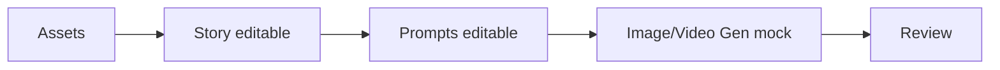

# Bitácora — FlowForge Visual

## Fecha

2026-08-11

## Agente

Tesla

## Alcance ejecutado

Se creó una primera versión funcional y original de la interfaz FlowForge Visual dentro de `proyectos/flowforge-visual/`.

## Avances

- Tablero inicial con barra superior, título “Mobile Design”, columnas Backlog / New / In Progress y tarjetas movibles.
- Botón principal para abrir “Design Project”.
- Vista Design Project con lienzo blanco, patrón de puntos negros tenues y nodos conectados.
- Nodos: Assets, Story, Prompts, Image/Video Gen y Review.
- Story y Prompts son editables en la interfaz.
- Nodos del lienzo y tarjetas del tablero pueden moverse con drag-and-drop.
- Placeholders visuales originales para casos experimentales con ChatGPT.
- Capa de comandos mock sin API ni servicios externos.

## Mermaid — flujo implementado

## Límites respetados

- No se tocó Dashboard CxC.
- No se tocaron documentos generales.
- No se usaron servicios externos.
- No se modificó GitHub, Gmail, calendario ni integraciones.
- No se promete automatización real sin API.
