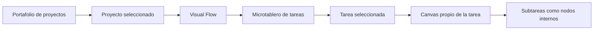

# Bitácora — Corrección de arquitectura FlowForge Visual

## Fecha

2026-08-11

## Agente

Tesla

## Cambio solicitado

El usuario corrigió el modelo de producto: la página principal no debe ser el tablero de tareas de “Mobile Design”, sino un portafolio/tablero de proyectos. Dentro de cada proyecto, la pantalla principal debe ser “Visual Flow”, con tareas a la izquierda y un canvas por tarea a la derecha.

## Nueva arquitectura implementada

## Decisiones

- `app/index.html` ahora funciona como portafolio de proyectos.
- Cada tarjeta de proyecto entra a `design-project.html?project=...`.
- `app/design-project.html` contiene la vista Visual Flow.
- El panel izquierdo es un microtablero de tareas del proyecto.
- Las tareas se expanden para mostrar sus subtareas.
- Al seleccionar una tarea, se actualizan el encabezado, el estado activo y el canvas derecho.
- Cada canvas se construye desde datos locales en `app/flow.js`.
- Las subtareas son nodos internos del canvas.
- Story y Prompts siguen siendo editables directamente.
- Los nodos siguen siendo movibles con drag-and-drop.
- Se agregaron controles de zoom: Zoom +, Zoom -, Reset y porcentaje.
- La app sigue sin API, sin conexión real a ChatGPT y sin tocar servicios externos.

## Interacciones probadas

- Selección de proyectos mediante enlaces con query param local.
- Selección de tareas dentro del microtablero.
- Expansión visual de subtareas en la tarea activa.
- Cambio visible de encabezado y nodos del canvas según tarea.
- Edición directa de nodos Story/Prompts mediante `contenteditable`.
- Movimiento de nodos con puntero.
- Zoom +, Zoom -, Reset y actualización de porcentaje.
- Comandos mock sin llamadas externas.

## Límites respetados

- No se tocó Dashboard CxC.
- No se modificó la bitácora general.
- No se usaron APIs ni conectores externos.
- No se revirtieron cambios fuera de `proyectos/flowforge-visual/`.
