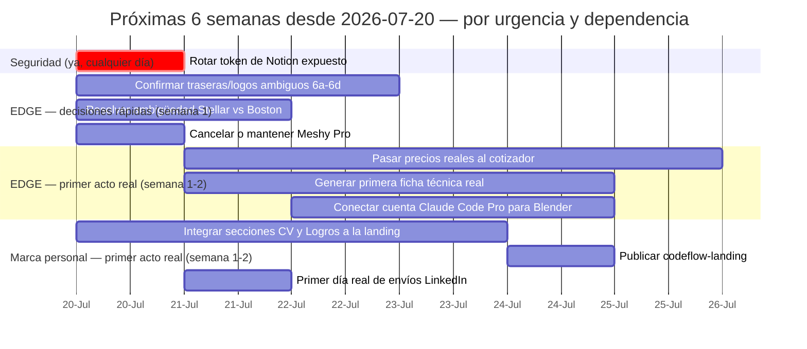

# Gestión del proyecto — Tablero de PM (SAAAS-Marketing)

**Qué es esto y qué NO es:** el índice general (`indice-general.md`) mapea contenido — qué documento existe y dónde vive. Esta página es distinta: es el tablero de **ejecución**. Agrega en un solo lugar cada pendiente real repartido en los 11 documentos del repo, con fecha estimada y con el filtro más importante: ¿esto depende de una decisión/acción tuya, o lo puede resolver un agente sin esperarte?

📂 **GitHub de este archivo:** https://github.com/juandroeleven-jpg/SAAAS-Marketing/blob/main/proyectos/gestion-pm.md
📦 **Repositorio completo:** https://github.com/juandroeleven-jpg/SAAAS-Marketing

---

## 1. Diagnóstico crítico — dónde estamos de verdad

Ningún frente tiene todavía un acto que genere ingresos. Lo que existe es investigación de calidad y varios prototipos con geometría/diseño validados — pero cero fichas de catálogo reales, cero cotizaciones reales, cero mensajes de LinkedIn enviados, cero web publicada. Eso es lo que separa hoy de los $5,000/mes: no falta investigar más, falta convertir en acto lo que ya está diseñado.

Puntos débiles concretos, sin suavizar:

- **Calidad de output con fallas confirmadas, no solo pendientes de decisión:** Simulación 6d (Stellar) tiene errores de texto reales ("APOL•GIZE", ">OUR MY FAMILY") y visera mal coloreada — si esto se mostrara a un cliente hoy, fallaría. Simulación 6c (Top Gun) tiene un logo marcado "malo" sin causa identificada todavía.
- **Cotizador y ficha de catálogo:** 100% diseño, 0% ejecución real. El cotizador tiene precios ficticios; nunca se generó una ficha real de punta a punta.
- **LinkedIn:** de 13 a 15 leads reales (mejora real de la otra sesión), con comentarios ya redactados — pero las 15 filas del tracker siguen en cero envíos reales y 15/15 sin la segunda publicación de respaldo.
- **Marca personal:** landing con esqueleto visual pero sin las 2 secciones que prueban el trabajo real — no publicada.
- **Seguridad:** token de Notion expuesto sigue sin rotar, marcado urgente desde hace varias sesiones.
- **Cronograma:** hasta este documento, el único "cronograma" era ordinal (fases en orden), sin fechas — imposible saber si vas atrasado o a tiempo.

---

## 2. Cronograma — próximas 6 semanas desde hoy

**Asunción a corregir:** no tengo la fecha real de inicio de tu contrato de 6 meses, así que este Gantt parte de hoy (2026-07-20) y prioriza por urgencia/dependencia, no por una fecha contractual real. Si me das la fecha de inicio real, reconstruyo esto contra el calendario real del contrato.



*Corrección: la versión anterior tenía `click` dentro del bloque `gantt` — Mermaid no soporta esa sintaxis ahí de forma confiable y rompió el render en GitHub. Los links reales a cada documento fuente están en la columna "Fuente" de la tabla de la sección 3, donde sí funcionan siempre.*

---

## 3. Checklist maestro de pendientes

### 🟠 Depende de tu decisión final — pero todos tienen un prompt de investigación/simulación abajo, ninguno se deja sin avanzar

| # | Pendiente | Fuente |
|---|---|---|
| 1 | Rotar el token de Notion expuesto (urgente) | seguridad |
| 2 | Cancelar suscripción Meshy Pro antes del próximo cobro ($20.80) o decidir seguir | [Simulación 4](edge-cascos/documentos/simulaciones-cc/simulacion-4-meshy-3d.md) |
| 3 | Decidir si vale la pena recortar la base/soporte del modelo 3D | [Simulación 4](edge-cascos/documentos/simulaciones-cc/simulacion-4-meshy-3d.md) |
| 4 | Pasar precio_base_modelo real por cada modelo EDGE | [Simulación 5](edge-cascos/documentos/simulaciones-cc/simulacion-5-cotizador.md) |
| 5 | Confirmar qué colorways son premium/edición limitada (recargo) | [Simulación 5](edge-cascos/documentos/simulaciones-cc/simulacion-5-cotizador.md) |
| 6 | Definir umbrales reales de descuento por cantidad mayorista | [Simulación 5](edge-cascos/documentos/simulaciones-cc/simulacion-5-cotizador.md) |
| 7 | Pasar tabla real de talles disponibles por modelo | [Simulación 5](edge-cascos/documentos/simulaciones-cc/simulacion-5-cotizador.md) |
| 8 | Definir si el envío se cotiza en el mismo flujo o después | [Simulación 5](edge-cascos/documentos/simulaciones-cc/simulacion-5-cotizador.md) |
| 9 | Confirmar cuál trasera de Bob Esponja es la buena | [Simulación 6a](edge-cascos/documentos/simulaciones-cc/simulacion-6a-bob-esponja.md) |
| 10 | Confirmar cuál intento 3/4 de Padrino es el definitivo | [Simulación 6b](edge-cascos/documentos/simulaciones-cc/simulacion-6b-padrino.md) |
| 11 | Confirmar qué está mal en el logo de Top Gun | [Simulación 6c](edge-cascos/documentos/simulaciones-cc/simulacion-6c-top-gun.md) |
| 12 | Confirmar si las fotos negra/azul de Top Gun son molde real de EDGE o referencia de proveedor | [Simulación 6c](edge-cascos/documentos/simulaciones-cc/simulacion-6c-top-gun.md) |
| 13 | Resolver si "Stellar" y "Boston" son el mismo molde o dos distintos | [Simulación 6d](edge-cascos/documentos/simulaciones-cc/simulacion-6d-stellar.md) |
| 14 | Confirmar si `download.jpg` es el intento vigente o hay que regenerar | [Simulación 6d](edge-cascos/documentos/simulaciones-cc/simulacion-6d-stellar.md) |
| 15 | Contar un caso real donde Canva o full-IA fallaron/tardaron de más | [Simulación 7](edge-cascos/documentos/simulaciones-cc/simulacion-7-catalogo.md) |
| 16 | Elegir 1 modelo EDGE para generar la primera ficha real | [Simulación 7](edge-cascos/documentos/simulaciones-cc/simulacion-7-catalogo.md) |
| 17 | Conectar tu cuenta Claude Code Pro ($100/mes) al repositorio | [Simulación 8](edge-cascos/documentos/simulaciones-cc/simulacion-8-meshy-blender.md) |
| 18 | Confirmar si Blender está instalado en la máquina que usará esa cuenta | [Simulación 8](edge-cascos/documentos/simulaciones-cc/simulacion-8-meshy-blender.md) |
| 19 | Decidir entre Substance 3D Painter/RizomUV o solo Blender nativo | [Simulación 8](edge-cascos/documentos/simulaciones-cc/simulacion-8-meshy-blender.md) |
| 20 | Aprobar la corrección de la cita Belanche/Ibáñez-Sánchez (Etapa 2, Hallazgo 4) | [pipeline-edge-6-meses.md](edge-cascos/documentos/pipeline-edge-6-meses.md), ya investigado, solo falta tu "sí" |
| 21 | Primer día real de envíos LinkedIn (Motor 1 y 2) | [linkedin-networking.md](marca-personal/documentos/linkedin-networking.md) |
| 22 | Publicar la landing una vez integradas las secciones CV/Logros | [pagina-web-progreso.md](marca-personal/documentos/pagina-web-progreso.md) |

---

## 4. Prompts de investigación/simulación — uno por cada pendiente

Ningún pendiente queda como pregunta abierta sin más: para cada grupo de abajo hay algo investigable o simulable ahora, aunque la firma final sea tuya. Los prompts que necesitan archivos físicos o el repo de código apuntan a tu sesión de Claude Code local (VS Code) — son de continuación, no tutoriales desde cero. Los que son de investigación de mercado (precios, benchmarks) los puedo correr yo mismo ahora si me das el "ok".

<details>
<summary><strong>Ítem 1 — Rotar el token de Notion (armar el paso a paso, no dejarlo abierto)</strong></summary>

```
Investigá el procedimiento exacto para rotar/regenerar un token de integración en Notion (Settings → My integrations → la integración expuesta → Regenerate/Show). Armá un checklist de máximo 5 pasos con el nombre exacto de cada botón, y confirmá en qué archivo(s)/variable(s) de entorno del proyecto hay que reemplazar el token viejo por el nuevo para que nada se rompa al rotarlo.
```
Esto no reemplaza el clic final (que solo el dueño de la cuenta puede dar), pero elimina la ambigüedad de "cómo" — deja de ser una tarea abierta.

</details>

<details>
<summary><strong>Ítems 2-3 — Simulación 4 (Meshy): cancelar suscripción y recortar la base 3D</strong></summary>

```
Retomá simulacion-4-meshy-3d.md. Confirmá la fecha exacta del próximo cobro de Meshy Pro (email de confirmación o dashboard de billing) y calculá si cancelar ahora hace perder generaciones ya pagadas de este ciclo — dejá la recomendación con el número exacto de días de por medio.

Para la base/soporte del modelo 3D: abrí el GLB en Blender, medí qué porcentaje de la malla ocupa la base respecto al casco, y generá una captura antes/después de recortarla, para decidir con evidencia visual en vez de a ciegas.
```

</details>

<details>
<summary><strong>Ítems 4-8 — Simulación 5 (Cotizador): precios, colorways, descuentos, talles, envío</strong></summary>

```
Investigá 3-5 competidores directos de EDGE en LatAm (cascos de moto gama media) y armá una tabla comparativa de: precio base por modelo, recargo típico por colorway/edición limitada (%), y umbrales de descuento por volumen usados en el sector (ej. 10+/25+/50+ unidades). Con esos benchmarks, proponé una tabla de precios INICIAL simulada para EDGE — marcada explícitamente como propuesta a confirmar, no como precio real — y una tabla estándar de talles (S-XXL) para no partir de cero. Para el envío: investigá 2-3 couriers B2C de la región y proponé si conviene cotizarlo en el mismo paso o después, con el trade-off de conversión de cada opción.
```
Puedo correr esta investigación yo mismo ahora mismo si me das el "ok" — no depende de archivos locales.

</details>

<details>
<summary><strong>Ítems 9-11 — Simulaciones 6a/6b/6c: auditoría contra el PDF original</strong></summary>

```
Retomá simulacion-6a-bob-esponja.md, simulacion-6b-padrino.md y simulacion-6c-top-gun.md (proyectos/edge-cascos/documentos/simulaciones-cc/). En los 3 quedó el mismo bloqueo: el PDF de referencia no se pudo renderizar por falta de pdftoppm/poppler-utils en el entorno remoto. Vos sí tenés acceso a los archivos físicos.

Instalá poppler-utils si falta, renderizá los 3 PDF (BOB ESPONJA - HERO.pdf, GODFATHER - HERO.ai.pdf, TOP GUN - EVOLUTION.pdf) y cerrá los 3 puntos abiertos: cuál trasera de Bob Esponja es la buena, cuál intento 3/4 de Padrino es el definitivo, y qué está mal exactamente en maver-mal-logo.jpg. Agregá la respuesta en cada archivo (sección "## Auditoría contra PDF original") y cerrá esos checkboxes.
```

</details>

<details>
<summary><strong>Ítem 12 — Simulación 6c: ¿el molde negro/azul es real de EDGE?</strong></summary>

```
Buscá en el resto del repo (pipeline-edge-6-meses.md, mis-pruebas-claude-code.md, fotos ya usadas en Simulación 4) alguna imagen de casco EDGE físico real en negro o azul con el logo EDGE visible, y compará contra molde-lateral-azul.jpg/molde-lateral-negro.png de Top Gun. Si no hay coincidencia clara, documentá qué se comparó y por qué no alcanza para confirmar, en vez de dejarlo como pregunta sin evidencia.
```

</details>

<details>
<summary><strong>Ítems 13-14 — Simulación 6d: Stellar vs. Boston, y regenerar el resultado con errores</strong></summary>

```
Buscá "Boston" en todo el repo (grep) para ver en qué otro documento aparece ese nombre de molde y compará la carcasa que describe contra calota stellar.png — proponé una hipótesis fundamentada de si son el mismo molde o dos distintos.

Además, volvé a correr la generación de Nano Banana para el caso Stellar corrigiendo explícitamente los 2 errores de texto ya identificados ("APOL•GIZE" → "APOLOGIZE", ">OUR MY FAMILY" → "OF MY FAMILY") y la visera transparente en vez del degradé plateado. Esto es 100% ejecutable ya — no hace falta esperar a que se resuelva lo de Stellar/Boston para intentarlo.
```

</details>

<details>
<summary><strong>Ítems 15-16 — Simulación 7: caso Canva vs. IA, y elegir modelo para la primera ficha</strong></summary>

```
Mientras se consigue un caso real de Canva vs. full-IA, simulá uno hipotético: con los tiempos ya conocidos de las Simulaciones 4 y 6, estimá cuánto tarda armar 1 ficha técnica completa por el flujo full-IA vs. a mano en Canva, y proponé un criterio tipo "usar Canva solo si full-IA tarda más de X minutos".

Para el modelo de la primera ficha real: usá por defecto el mismo modelo ya validado en Simulación 4 (tiene fotos reales y geometría confirmada, es el que menos fricción tiene para arrancar) y generá la ficha de punta a punta con ese.
```

</details>

<details>
<summary><strong>Ítems 17-19 — Simulación 8: Blender instalado, y Substance/RizomUV vs. nativo</strong></summary>

```
Confirmá con un comando simple (blender --version, o buscar la carpeta/ícono de instalación) si Blender ya está en la máquina que va a conectar la cuenta Claude Code Pro; si no está, es una instalación de un paso desde blender.org (gratis).

Para Substance 3D Painter/RizomUV vs. Blender nativo: armá un cuadro comparativo de precio, curva de aprendizaje, y si de verdad hace falta para el nivel de detalle ya logrado en las Simulaciones 4 y 6 — proponé "quedarse con Blender nativo hasta que aparezca una limitación concreta" como default, no como pregunta abierta.
```

</details>

<details>
<summary><strong>Ítems 21-22 — LinkedIn y publicar la landing: la única excepción honesta</strong></summary>

Estos dos no tienen más investigación pendiente — el método, las plantillas y el contenido ya están 100% listos, y agregar más análisis encima sería la misma trampa que ya identificamos antes (potencia que nunca se convierte en acto). Lo único que se puede simular es CÓMO ejecutar el primer envío sin disparar el riesgo de restricción de LinkedIn:

```
Con las 15 personas ya identificadas en linkedin-networking.md, armá un calendario escalonado de envío (ej. 3-4 conexiones por día en vez de las 15 de golpe) para el Motor 1, y confirmá cuántas del Motor 2 (contacto directo a empresas) se pueden mandar el mismo día sin activar el límite de restricción de LinkedIn que ya se documentó como riesgo aceptado.
```

</details>

<details>
<summary><strong>Ítem 2 (integrar landing) — sí queda delegable, sigue igual que antes</strong></summary>

```
Retomá pagina-web-progreso.md (proyectos/marca-personal/documentos/). Ya quedó redactado el contenido de las secciones Logros y CV — falta integrarlas al código real de codeflow-landing, en el orden Hero → Dashboard → Logros → CV, sin tocar Hero.tsx ni el rótulo de PlaceholderDashboard.tsx. Cuando esté, actualizá el kanban del documento y decime si ya queda lista para publicar o si falta algo más.
```

</details>

---

## 5. Revisión semanal

| Semana (desde 2026-07-20) | Qué se cerró de verdad (acto, no investigación) | Bloqueo |
|---|---|---|
| 1 | — | — |
| 2 | — | — |
| 3 | — | — |
| 4 | — | — |
| 5 | — | — |
| 6 | — | — |

---

**Última actualización:** 2026-07-20 · primera versión de este tablero, construida a pedido explícito de agregar todos los pendientes del repo en un solo lugar y ser crítico con el estado real de avance.
