# Análisis crítico — CodeFlow, marca personal y comunidad

**Alcance:** este documento usa únicamente la información ya conversada y la experiencia descrita. No agrega estadísticas nuevas ni pretende validar todavía el mercado.

**Propósito:** separar lo que ya sabemos por experiencia, lo que estamos suponiendo y lo que después tendremos que demostrar con datos externos.

<strong>1. La intuición central: usar IA no es lo mismo que construir un sistema</strong>

La distinción que planteas es importante:

- una persona puede usar ChatGPT para resolver una tarea puntual;
- puede crear prompts para problemas que aparecen durante el mes;
- puede tener decenas de chats, agentes o instrucciones separadas;
- pero eso no significa que exista un sistema empresarial integrado.

El problema no es que las respuestas individuales sean inútiles. El problema es que cada respuesta puede empezar de cero: hay que volver a explicar el contexto, recordar las reglas, copiar información y decidir manualmente qué hacer después.

Tu tesis es que una empresa necesita pasar de **resolver situaciones** a **diseñar procesos repetibles**.

Esta parte tiene sentido conceptualmente y es una buena base para el pitch. Sin embargo, todavía no demuestra que todas las empresas tengan ese problema ni que estén dispuestas a pagar por resolverlo. Por ahora es una hipótesis basada en experiencia.

<strong>Evidencia específica para 1. Herramientas aisladas no equivalen a sistemas</strong>

**BID — paráfrasis:** El BID diferencia entre utilizar herramientas de IA y conseguir beneficios económicos; eso respalda que tener muchos chats no equivale a tener un sistema.

**CEPAL — paráfrasis:** CEPAL mide interés regional mediante visitas a soluciones de IA, pero advierte que esa métrica no demuestra integración empresarial.

**BID Startups x AI — paráfrasis:** El BID clasifica startups integradoras como un perfil distinto de las que desarrollan modelos o apenas exploran; eso respalda la categoría de CodeFlow.

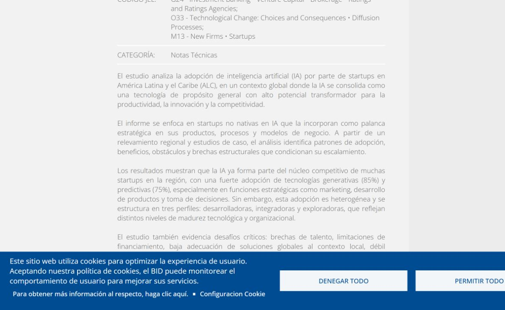

**Lectura crítica:** las tres fuentes apoyan la dirección general del supuesto, pero no prueban automáticamente que CodeFlow sea la solución ni que el cliente pagará una suscripción. Para eso hacen falta casos propios, entrevistas, precios y métricas de retención.

<strong>Evidencia específica para 2. Pasar del piloto a la operación</strong>

**BID — paráfrasis:** El BID señala que muchas empresas siguen en pruebas iniciales y necesitan capacidades para integrar IA en el núcleo operativo.

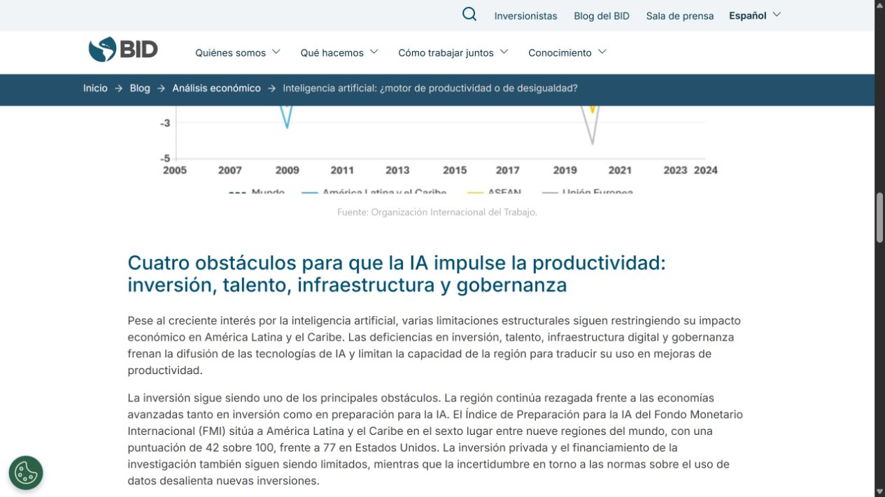

**CEPAL — paráfrasis:** CEPAL relaciona la adopción con preparación, adopción y gobernanza, no solo con interés tecnológico.

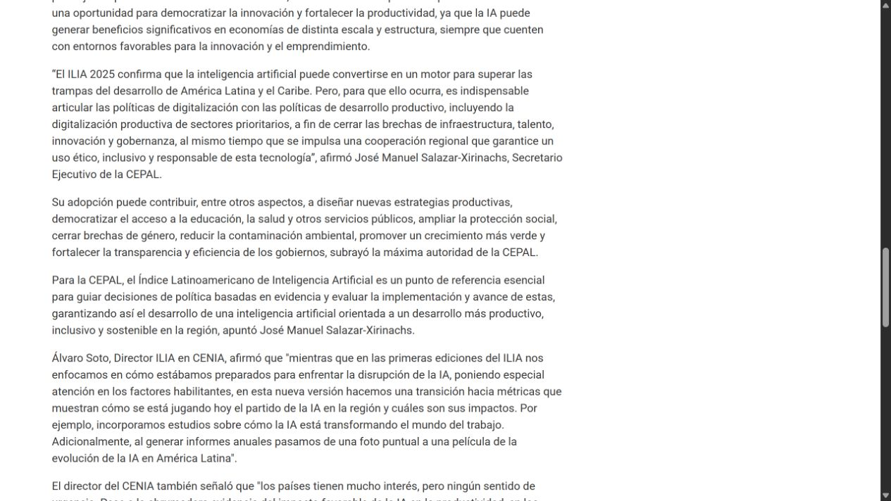

**BID Startups x AI — paráfrasis:** El BID identifica brechas que dificultan escalar soluciones regionales.

**Lectura crítica:** las tres fuentes apoyan la dirección general del supuesto, pero no prueban automáticamente que CodeFlow sea la solución ni que el cliente pagará una suscripción. Para eso hacen falta casos propios, entrevistas, precios y métricas de retención.

<strong>Evidencia específica para 3. Agente como coordinador de tareas y contexto</strong>

**BID — paráfrasis:** El BID muestra que la IA puede incorporarse a productos, procesos y modelos de negocio, no solo a chats individuales.

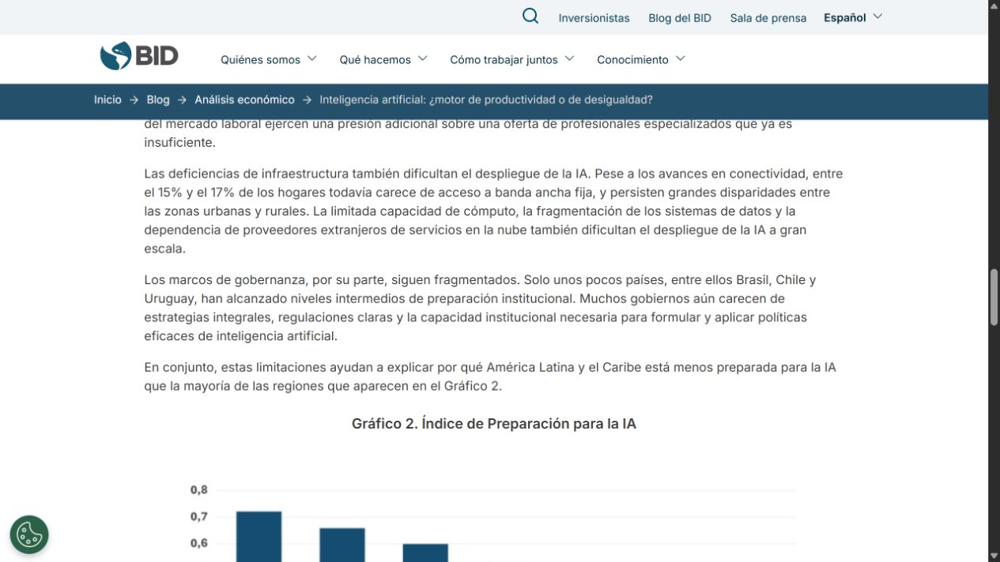

**CEPAL — paráfrasis:** CEPAL destaca la necesidad de capacidades para pasar de uso superficial a adopción productiva.

**BID Startups x AI — paráfrasis:** El BID distingue integradoras de desarrolladoras y exploradoras, lo que respalda construir agentes sobre herramientas existentes.

**Lectura crítica:** las tres fuentes apoyan la dirección general del supuesto, pero no prueban automáticamente que CodeFlow sea la solución ni que el cliente pagará una suscripción. Para eso hacen falta casos propios, entrevistas, precios y métricas de retención.

<strong>Evidencia específica para 4. Sistema que conecta varias áreas</strong>

**BID — paráfrasis:** El BID relaciona impacto con transformar la forma de trabajar e integrar IA en operaciones.

**CEPAL — paráfrasis:** CEPAL incluye infraestructura y gobernanza como condiciones habilitantes.

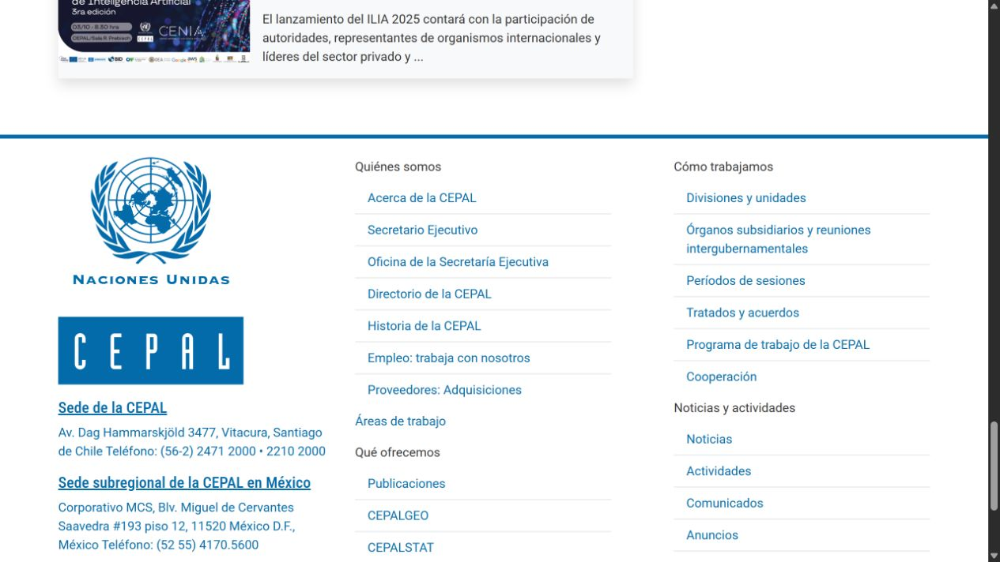

**BID Startups x AI — paráfrasis:** El estudio de startups muestra que la IA se aplica en marketing, producto y toma de decisiones, áreas que pueden conectarse.

**Lectura crítica:** las tres fuentes apoyan la dirección general del supuesto, pero no prueban automáticamente que CodeFlow sea la solución ni que el cliente pagará una suscripción. Para eso hacen falta casos propios, entrevistas, precios y métricas de retención.

<strong>Evidencia específica para 5. Interoperabilidad como diferenciador</strong>

**BID — paráfrasis:** El BID advierte que probar herramientas no garantiza resultados económicos.

**CEPAL — paráfrasis:** CEPAL muestra una adopción heterogénea, por lo que las soluciones deben adaptarse al nivel de cada país y empresa.

**BID Startups x AI — paráfrasis:** El BID identifica baja adecuación de soluciones globales al contexto local, lo que apoya integrar y adaptar.

**Lectura crítica:** las tres fuentes apoyan la dirección general del supuesto, pero no prueban automáticamente que CodeFlow sea la solución ni que el cliente pagará una suscripción. Para eso hacen falta casos propios, entrevistas, precios y métricas de retención.

<strong>Evidencia específica para 6. Mejora continua controlada</strong>

**BID — paráfrasis:** El BID vincula adopción efectiva con capacidades, infraestructura y reglas claras.

**CEPAL — paráfrasis:** CEPAL incluye gobernanza como una dimensión central de madurez de IA.

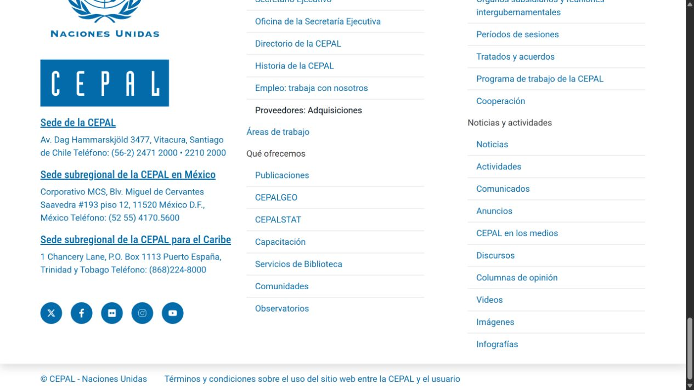

**BID Startups x AI — paráfrasis:** El BID señala prácticas incipientes de gobernanza en startups, por lo que CodeFlow debe incluir evaluación y control.

**Lectura crítica:** las tres fuentes apoyan la dirección general del supuesto, pero no prueban automáticamente que CodeFlow sea la solución ni que el cliente pagará una suscripción. Para eso hacen falta casos propios, entrevistas, precios y métricas de retención.

<strong>Evidencia específica para 7. Oportunidad regional</strong>

**BID — paráfrasis:** El BID muestra que el uso de herramientas ya es relevante en ALC.

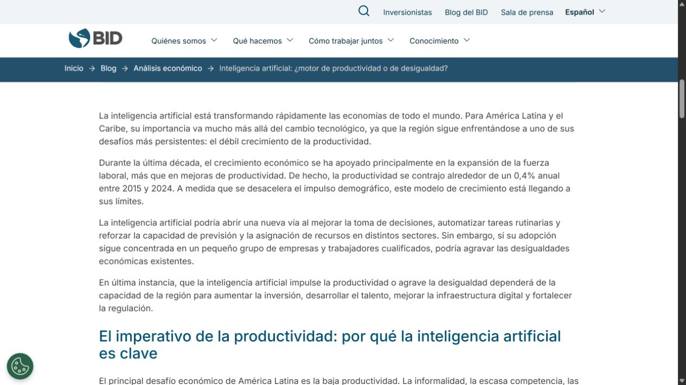

**CEPAL — paráfrasis:** CEPAL reporta 14% de visitas globales a soluciones de IA frente a 11% de usuarios de Internet.

**BID Startups x AI — paráfrasis:** El BID observa una adopción fuerte de IA generativa y predictiva en startups analizadas.

**Lectura crítica:** las tres fuentes apoyan la dirección general del supuesto, pero no prueban automáticamente que CodeFlow sea la solución ni que el cliente pagará una suscripción. Para eso hacen falta casos propios, entrevistas, precios y métricas de retención.

<strong>Evidencia específica para 8. Uso no garantiza impacto</strong>

**BID — paráfrasis:** El BID presenta el contraste 80% de uso, 23% de réditos y 6% de impacto significativo.

**CEPAL — paráfrasis:** CEPAL advierte que el proxy de tráfico no equivale a implementación empresarial.

**BID Startups x AI — paráfrasis:** El BID muestra adopción alta en startups, pero también brechas de escalamiento.

**Lectura crítica:** las tres fuentes apoyan la dirección general del supuesto, pero no prueban automáticamente que CodeFlow sea la solución ni que el cliente pagará una suscripción. Para eso hacen falta casos propios, entrevistas, precios y métricas de retención.

<strong>Evidencia específica para 9. Educación como parte del producto</strong>

**BID — paráfrasis:** El BID identifica formación y capacidades como condiciones para productividad.

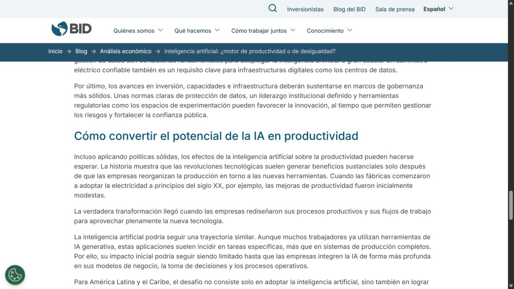

**CEPAL — paráfrasis:** CEPAL señala brechas de talento y capacidades avanzadas.

**BID Startups x AI — paráfrasis:** El BID identifica falta de talento como obstáculo para escalar la IA en startups.

**Lectura crítica:** las tres fuentes apoyan la dirección general del supuesto, pero no prueban automáticamente que CodeFlow sea la solución ni que el cliente pagará una suscripción. Para eso hacen falta casos propios, entrevistas, precios y métricas de retención.

<strong>Evidencia específica para 10. Suscripción con valor continuo</strong>

**BID — paráfrasis:** El BID explica que la productividad exige reorganizar procesos, no solo usar una herramienta una vez.

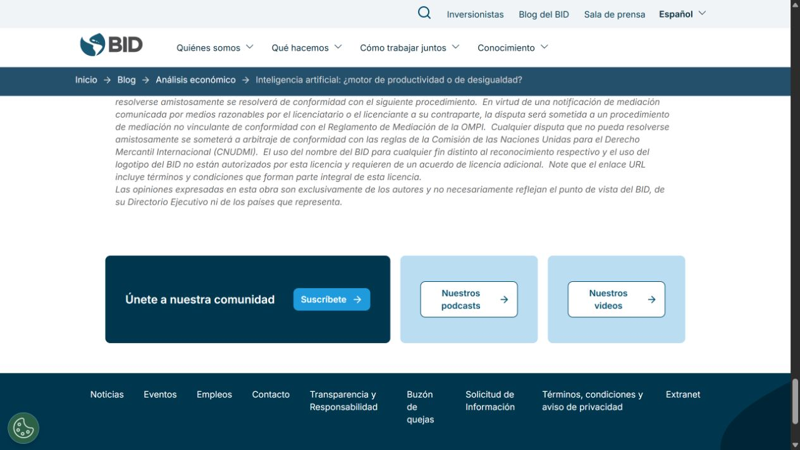

**CEPAL — paráfrasis:** CEPAL presenta la adopción como un proceso de madurez y evolución.

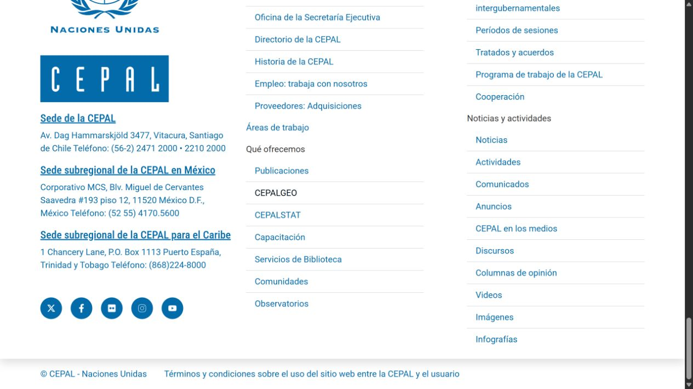

**BID Startups x AI — paráfrasis:** El BID habla de obstáculos para escalar, lo que apoya soporte e integración continua, pero no valida por sí solo un precio mensual.

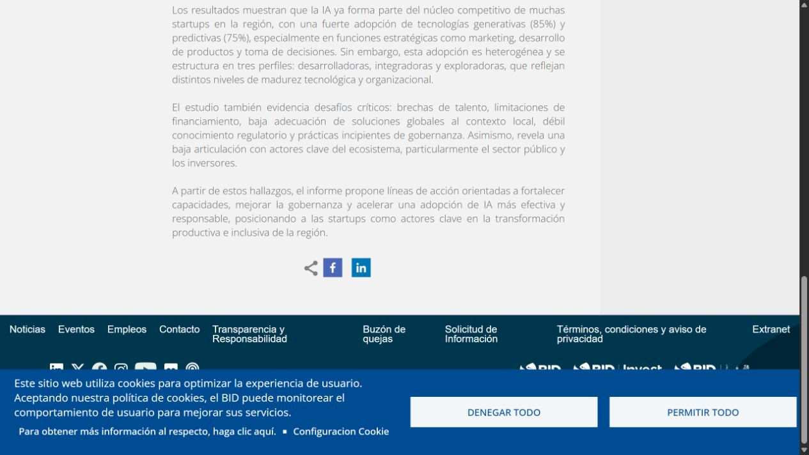

**Lectura crítica:** las tres fuentes apoyan la dirección general del supuesto, pero no prueban automáticamente que CodeFlow sea la solución ni que el cliente pagará una suscripción. Para eso hacen falta casos propios, entrevistas, precios y métricas de retención.

<strong>Evidencia específica para 11. Marca personal como canal</strong>

**BID — paráfrasis:** El BID muestra una brecha entre uso e impacto que requiere capacidades especializadas.

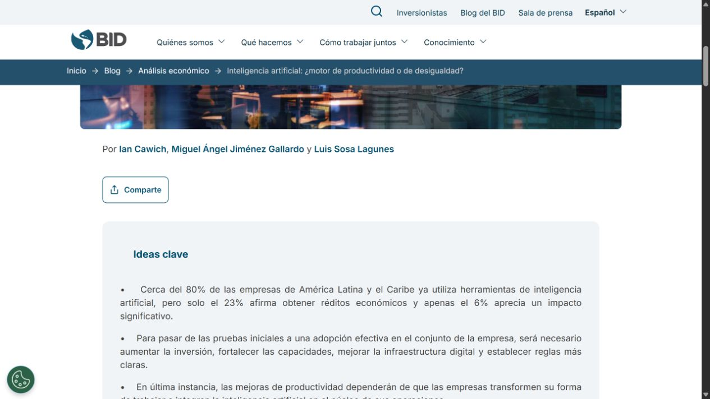

**CEPAL — paráfrasis:** CEPAL plantea que la región necesita formación, infraestructura y gobernanza.

**BID Startups x AI — paráfrasis:** El BID muestra que las startups adoptan IA en funciones estratégicas, creando demanda de conocimiento aplicado.

**Lectura crítica:** las tres fuentes apoyan la dirección general del supuesto, pero no prueban automáticamente que CodeFlow sea la solución ni que el cliente pagará una suscripción. Para eso hacen falta casos propios, entrevistas, precios y métricas de retención.

<strong>Evidencia específica para 12. Separar servicios, comunidad y plataforma</strong>

**BID — paráfrasis:** El BID muestra que la adopción debe traducirse en productividad y cambio operativo.

**CEPAL — paráfrasis:** CEPAL clasifica países por niveles de madurez, lo que favorece una oferta escalonada.

**BID Startups x AI — paráfrasis:** El BID separa desarrolladoras, integradoras y exploradoras, dando una base para diferenciar productos y clientes.

**Lectura crítica:** las tres fuentes apoyan la dirección general del supuesto, pero no prueban automáticamente que CodeFlow sea la solución ni que el cliente pagará una suscripción. Para eso hacen falta casos propios, entrevistas, precios y métricas de retención.

<strong>1. Herramientas aisladas no equivalen a sistemas</strong>

La evidencia del BID distingue entre usar herramientas y obtener resultados. Esto respalda tu idea de que muchos chats o automatizaciones puntuales no constituyen un sistema integrado.

<strong>Validación cruzada: ¿confirma o niega nuestro supuesto?</strong>

**Qué confirma o matiza:** Los datos confirman la brecha entre adopción e impacto, pero no prueban que todas las empresas tengan 40 agentes aislados. Tu experiencia formula la hipótesis; el estudio la vuelve plausible, no universal.

**Fuente:** [Estudio utilizado](https://www.iadb.org/es/blog/analisis-economico/inteligencia-artificial-motor-de-productividad-o-de-desigualdad)

<strong>2. La empresa necesita pasar del piloto a la operación</strong>

El BID señala que muchas organizaciones siguen en pruebas iniciales y necesitan capacidades, infraestructura y reglas para integrar IA en el núcleo operativo.

<strong>Validación cruzada: ¿confirma o niega nuestro supuesto?</strong>

**Qué confirma o matiza:** Esto apoya directamente el servicio de CodeFlow: diagnóstico, arquitectura, implementación, capacitación y mantenimiento. La evidencia no demuestra aún que CodeFlow sea la solución elegida; demuestra que el problema existe.

**Fuente:** [Estudio utilizado](https://www.iadb.org/es/blog/analisis-economico/inteligencia-artificial-motor-de-productividad-o-de-desigualdad)

<strong>3. Un agente debe coordinar tareas y contexto</strong>

El estudio regional del BID identifica startups desarrolladoras, integradoras y exploradoras. Esa clasificación respalda separar el modelo base de la integración aplicada.

<strong>Validación cruzada: ¿confirma o niega nuestro supuesto?</strong>

**Qué confirma o matiza:** Confirma que existe un espacio para integradores, pero no prueba que un agente tenga aprendizaje autónomo. CodeFlow debe hablar de reglas, herramientas, evaluación y supervisión, no prometer aprendizaje automático sin evidencia.

**Fuente:** [Estudio utilizado](https://publications.iadb.org/es/startups-x-ai-un-panorama-de-la-adopcion-en-america-latina-y-el-caribe)

<strong>4. Un sistema conecta varias áreas</strong>

El BID describe la necesidad de integrar IA en modelos de negocio y operaciones. CEPAL también relaciona adopción con capacidades, infraestructura y gobernanza.

<strong>Validación cruzada: ¿confirma o niega nuestro supuesto?</strong>

**Qué confirma o matiza:** Esto respalda tu concepto de conectar finanzas, operaciones, marketing y datos. Lo que falta demostrar es qué arquitectura concreta reduce costos o produce mejores resultados.

**Fuente:** [Estudio utilizado](https://www.iadb.org/es/blog/analisis-economico/inteligencia-artificial-motor-de-productividad-o-de-desigualdad)

<strong>5. La interoperabilidad puede ser un diferenciador</strong>

El estudio de startups reporta baja adecuación de soluciones globales al contexto local y obstáculos para escalar.

<strong>Validación cruzada: ¿confirma o niega nuestro supuesto?</strong>

**Qué confirma o matiza:** Esto favorece una propuesta que adapte herramientas y modelos a cada empresa. No demuestra que una interfaz única sea siempre mejor; algunos clientes pueden preferir herramientas separadas por seguridad o especialización.

**Fuente:** [Estudio utilizado](https://publications.iadb.org/es/startups-x-ai-un-panorama-de-la-adopcion-en-america-latina-y-el-caribe)

<strong>6. La mejora continua debe ser controlada</strong>

BID y CEPAL destacan gobernanza, reglas, talento y capacidades como condiciones de adopción efectiva.

<strong>Validación cruzada: ¿confirma o niega nuestro supuesto?</strong>

**Qué confirma o matiza:** Esto respalda ciclos de evaluación, monitoreo y mejora. Matiza tu idea de agentes que se mejoran solos: la mejora debe tener métricas, responsables, aprobaciones y trazabilidad.

**Fuente:** [Estudio utilizado](https://www.cepal.org/es/comunicados/america-latina-caribe-acelera-la-adopcion-la-inteligencia-artificial-aunque-desafios)

<strong>7. La adopción regional sí parece una oportunidad</strong>

CEPAL reporta que ALC concentra 14% de las visitas globales a soluciones de IA frente a 11% de usuarios globales de Internet.

<strong>Validación cruzada: ¿confirma o niega nuestro supuesto?</strong>

**Qué confirma o matiza:** Esto respalda comenzar la narrativa desde Panamá y Latinoamérica. No equivale a 14% de empresas implementando IA, porque la métrica usa tráfico web como proxy.

**Fuente:** [Estudio utilizado](https://www.cepal.org/es/comunicados/america-latina-caribe-acelera-la-adopcion-la-inteligencia-artificial-aunque-desafios)

<strong>8. El impacto económico no está garantizado</strong>

El BID reporta cerca de 80% de uso de herramientas, 23% con réditos económicos y 6% con impacto significativo.

<strong>Validación cruzada: ¿confirma o niega nuestro supuesto?</strong>

**Qué confirma o matiza:** Esto respalda fuertemente la tesis de que usar IA no basta. También obliga a CodeFlow a prometer resultados medibles, no solo integración técnica.

**Fuente:** [Estudio utilizado](https://www.iadb.org/es/blog/analisis-economico/inteligencia-artificial-motor-de-productividad-o-de-desigualdad)

<strong>9. La educación debe ser parte del producto</strong>

CEPAL y BID identifican brechas de talento y capacidades. La adopción depende de que las personas y empresas puedan reorganizar su trabajo.

<strong>Validación cruzada: ¿confirma o niega nuestro supuesto?</strong>

**Qué confirma o matiza:** Esto apoya la comunidad, las capacitaciones y los materiales específicos. La comunidad solo será defendible como suscripción si demuestra adopción, soporte y resultados, no solo publicación de contenido.

**Fuente:** [Estudio utilizado](https://www.cepal.org/es/comunicados/america-latina-caribe-acelera-la-adopcion-la-inteligencia-artificial-aunque-desafios)

<strong>10. La suscripción necesita valor continuo</strong>

Los estudios hablan de integración, escalamiento, gobernanza y capacidades sostenidas; no presentan una validación directa del precio mensual de CodeFlow.

<strong>Validación cruzada: ¿confirma o niega nuestro supuesto?</strong>

**Qué confirma o matiza:** La evidencia respalda la necesidad de acompañamiento continuo, pero no valida todavía el modelo de precio. Debemos probar qué servicios se usan cada mes y qué resultado retiene al cliente.

**Fuente:** [Estudio utilizado](https://publications.iadb.org/es/startups-x-ai-un-panorama-de-la-adopcion-en-america-latina-y-el-caribe)

<strong>11. La marca personal puede ser el canal inicial</strong>

Los estudios muestran brechas de talento, adaptación local y capacidades. Eso crea un espacio para autoridad, educación y asesoría especializada.

<strong>Validación cruzada: ¿confirma o niega nuestro supuesto?</strong>

**Qué confirma o matiza:** La evidencia apoya la necesidad del conocimiento, pero no prueba que LinkedIn, Skool o el networking conviertan por sí solos. El embudo debe medirse desde contenido hasta conversación, clase, diagnóstico y suscripción.

**Fuente:** [Estudio utilizado](https://publications.iadb.org/es/startups-x-ai-un-panorama-de-la-adopcion-en-america-latina-y-el-caribe)

<strong>12. CodeFlow debe separar servicios, comunidad y plataforma</strong>

Los estudios distinguen niveles de madurez y perfiles de adopción, lo que favorece una oferta escalonada en vez de un paquete único para todos.

<strong>Validación cruzada: ¿confirma o niega nuestro supuesto?</strong>

**Qué confirma o matiza:** La evidencia respalda segmentar la oferta, pero no decide si CodeFlow debe ser agencia, plataforma, integrador o alianza. Esa decisión requiere casos propios, entrevistas, precios y pruebas de retención.

**Fuente:** [Estudio utilizado](https://www.cepal.org/es/comunicados/america-latina-caribe-acelera-la-adopcion-la-inteligencia-artificial)

<strong>2. Definiciones críticas: herramienta, prompt, automatización, agente y sistema</strong>

### Herramienta o modelo

Es el recurso que genera, transforma, analiza o ejecuta algo: un modelo de lenguaje, una API, una aplicación, una base de datos o un software especializado.

### Prompt o chat

Es una interacción puntual. Puede resolver una tarea, pero normalmente depende de que una persona entregue contexto y revise el resultado.

### Automatización

Es un flujo de pasos previamente definidos que se ejecuta con menos intervención manual. Una automatización puede ser muy útil sin ser un agente.

### Agente

En tu concepto, un agente es una unidad que recibe un objetivo, consulta herramientas o datos, sigue reglas, ejecuta acciones y puede devolver un resultado dentro de un proceso.

**Advertencia crítica:** no todo lo que se llama “agente” tiene autonomía real, memoria, aprendizaje o capacidad de corregirse. Para usar esa palabra en CodeFlow habrá que definir qué condiciones mínimas debe cumplir.

### Sistema

Es la combinación coordinada de dos o más automatizaciones, agentes, datos, aplicaciones y reglas que trabajan dentro de un proceso completo.

### Sistema operativo empresarial

Esta es una metáfora potente, pero peligrosa si no se concreta. Para que sea creíble, CodeFlow debe mostrar:

- qué entradas recibe;
- qué agentes o módulos participan;
- cómo circula la información;
- qué decisiones requieren aprobación humana;
- dónde se almacenan los resultados;
- cómo se monitorea el desempeño;
- cómo se añaden nuevas capacidades.

<strong>3. Por qué tu argumento puede ser correcto</strong>

Tu razonamiento tiene cinco puntos sólidos:

1. Resolver tareas aisladas puede crear fragmentación.
2. Repetir contexto manualmente aumenta el costo operativo.
3. Un proceso empresarial tiene dependencias entre áreas y pasos.
4. Las herramientas necesitan reglas, datos y responsables para funcionar de forma consistente.
5. Una solución puede perder valor si nadie la mantiene, mide o mejora.

Por eso la idea de integrar agentes, datos, automatizaciones y aplicaciones tiene lógica técnica y operacional.

La parte que todavía no está demostrada es el tamaño de la oportunidad, la frecuencia del problema, el comprador y el precio que aceptaría pagar.

<strong>4. Dónde debemos ser críticos con la idea de “agentes que aprenden”</strong>

No conviene afirmar que un agente aprende automáticamente solo porque registra fallas o usa varios modelos. Hay que distinguir:

- memoria del contexto;
- registro de resultados;
- reglas de validación;
- evaluación automática;
- revisión humana;
- ajuste de prompts;
- actualización del modelo;
- aprendizaje real del sistema.

Un sistema puede mejorar porque una persona revisa errores y modifica sus reglas. Eso es mejora operacional, no necesariamente aprendizaje autónomo.

Para CodeFlow, una promesa más defendible sería:

> Los sistemas se monitorean, registran sus resultados y se mejoran mediante ciclos de evaluación y ajustes controlados.

Esa frase es menos espectacular, pero más precisa y más fácil de demostrar.

<strong>5. Qué parte está validada por tu experiencia y qué parte no</strong>

### Evidencia de experiencia

- Ya has construido automatizaciones y sistemas para empresas.
- Tienes experiencia en finanzas, ingeniería, IA, dashboards y análisis.
- Ya diste una clase de tres horas por 250 dólares.
- Tu pareja aporta capacidades de diseño de producto, contenido, marketing y análisis.
- Has visto que los clientes piden soluciones concretas.
- Has observado que muchas necesidades pueden conectarse entre sí.

### Hipótesis todavía no validadas

- Que las empresas quieran un sistema integral en vez de soluciones puntuales.
- Que acepten pagar una suscripción mensual por integración, educación y comunidad.
- Que una comunidad de empresas genere suficiente valor para retener clientes.
- Que el modelo de referidos produzca ingresos estables.
- Que el cliente prefiera una interfaz única frente a sus herramientas actuales.
- Que el mercado perciba a CodeFlow como sistema operativo y no como consultoría.

<strong>6. Arquitectura real del modelo de negocio</strong>

Tu idea actualmente mezcla cuatro negocios relacionados:

### Marca personal

Contenido, autoridad, networking, asesorías, clases y casos propios.

### Comunidad

Educación, materiales, agentes, skills, plantillas, networking y comunicación continua.

### Servicios de consultoría

Diagnóstico, estrategia, arquitectura, implementación, capacitación y acompañamiento.

### CodeFlow

Empresa o alianza que entrega un ecosistema integrado, posiblemente con suscripción, servicios recurrentes y socios de implementación.

La conexión entre los cuatro tiene sentido, pero no deben presentarse como si fueran exactamente el mismo producto.

Una secuencia más clara sería:

**Marca personal → confianza → asesoría inicial → caso de uso → comunidad → servicio recurrente → CodeFlow como empresa integradora.**

<strong>7. Análisis del plan de marca personal</strong>

El plan tiene una lógica de adquisición orgánica:

1. Publicar contenido especializado.
2. Analizar perfiles y publicaciones relevantes.
3. Comentar de forma específica y no genérica.
4. Construir relaciones sin spam.
5. Llevar conversaciones hacia asesoría, clases o comunidad.
6. Convertir casos y aprendizajes en portafolio.

Esto puede funcionar como estrategia de autoridad, pero no debe confundirse con una garantía de ventas. Las métricas que habrá que medir después son:

- publicaciones realizadas;
- conversaciones iniciadas;
- respuestas recibidas;
- llamadas agendadas;
- clases vendidas;
- empresas referidas;
- clientes convertidos;
- retención mensual.

El riesgo principal es producir mucho contenido sin una oferta clara. La marca personal necesita una escalera de productos: contenido gratuito → clase o diagnóstico → asesoría → servicio recurrente.

<strong>8. Análisis del modelo de referidos</strong>

El modelo de referir servicios de terceros puede ser útil durante una etapa intermedia porque permite monetizar relaciones sin construir toda la infraestructura de implementación.

### Ventajas

- Menor costo inicial.
- Permite aprender qué compran las empresas.
- Ayuda a construir relaciones con proveedores.
- Puede generar comisiones mientras CodeFlow se define.

### Riesgos

- Conflicto de interés si no se revela la comisión.
- Dependencia de la calidad y cumplimiento del socio.
- Menor control sobre la experiencia del cliente.
- Riesgo de que la marca personal quede asociada a un mal proveedor.
- Comisión irregular frente a una suscripción propia.

La regla recomendada sería: revelar claramente que existe comisión, definir criterios de calidad y mantener responsabilidad sobre la selección del proveedor.

<strong>9. Suscripciones, APIs, modelos locales y open source</strong>

Tu modelo contempla varias combinaciones:

- software de terceros pagado por el cliente;
- APIs consumidas por uso;
- modelos locales u open source;
- sistemas privados o desplegados en la nube;
- capacitación y comunidad;
- mantenimiento y nuevas implementaciones.

La dificultad está en no vender “todo incluido” sin calcular costos variables. Cada cliente puede tener consumos diferentes de APIs, almacenamiento, cómputo, soporte y trabajo humano.

Por eso CodeFlow debería separar:

1. **Tarifa de diagnóstico.**
2. **Tarifa de implementación.**
3. **Costo de software e infraestructura.**
4. **Suscripción de operación, soporte y evolución.**
5. **Servicios adicionales o nuevas implementaciones.**

Los modelos locales y open source pueden mejorar control, privacidad y costos en determinados casos, pero también requieren infraestructura, mantenimiento y capacidades técnicas. No son automáticamente más baratos ni más simples.

<strong>10. La comunidad: qué debe demostrar para ser un producto real</strong>

La comunidad no debe venderse solo como un grupo de chat. Debe resolver necesidades concretas:

- capacitación aplicada al trabajo de la empresa;
- plantillas y agentes reutilizables;
- sesiones de revisión;
- soporte y comunicación con CodeFlow;
- casos de uso documentados;
- networking útil;
- actualización continua de herramientas y prácticas.

La pregunta crítica es: ¿qué recibe una empresa en la comunidad que no podría obtener viendo contenido gratuito en internet?

La respuesta puede ser personalización, contexto empresarial, acompañamiento, materiales adaptados, aprendizaje entre pares y acceso a un equipo que conoce su sistema.

<strong>11. Conclusiones de esta primera investigación sin datos nuevos</strong>

### Conclusión 1

Tu distinción entre herramienta, automatización, agente y sistema tiene sentido y puede ser el núcleo conceptual de CodeFlow.

### Conclusión 2

El argumento todavía está basado principalmente en experiencia personal y casos observados. Eso sirve para formular la hipótesis, pero no para afirmar que el mercado entero tiene el mismo problema.

### Conclusión 3

El modelo de negocio tiene potencial, pero actualmente mezcla marca personal, educación, referidos, comunidad, consultoría y producto tecnológico. Debemos separarlos y definir cuál es el motor principal de ingresos.

### Conclusión 4

La suscripción es plausible solo si el cliente recibe valor continuo y medible. “Tener acceso a herramientas” no es suficiente.

### Conclusión 5

La siguiente investigación sí debe buscar estadísticas y casos sobre adopción, pilotos, integración, retorno, retención, servicios gestionados, comunidades B2B y precios.

<strong>12. Preguntas que deben guiar la investigación estadística posterior</strong>

- ¿Qué porcentaje de empresas pasa de piloto a producción?
- ¿Qué porcentaje integra IA en más de un área?
- ¿Qué problemas reportan las empresas al escalar IA?
- ¿Cuánto gastan en herramientas y servicios de IA?
- ¿Qué servicios pagan mensualmente?
- ¿Qué valor tiene la capacitación continua?
- ¿Qué retiene a un cliente de servicios gestionados?
- ¿Qué diferencia hay entre contratar una agencia y contratar una plataforma?
- ¿Qué demanda existe para modelos privados, locales u open source?
- ¿Qué modelos de comisión son comunes en alianzas tecnológicas?

