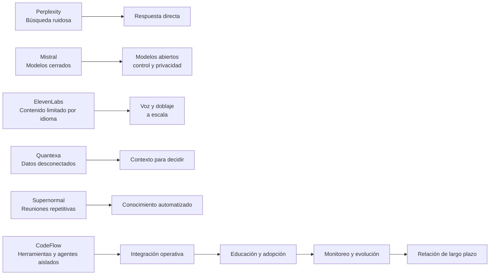

# CodeFlow — comparación de pitch y dirección visual

**Objetivo:** convertir la inspiración de otros pitch decks en una estructura propia para CodeFlow, sin copiar su contenido ni su identidad visual.

<strong>1. Qué hacen bien los pitch decks analizados</strong>

| Deck | Movimiento principal | Qué genera valor en la narrativa |
|---|---|---|
| Perplexity | Problema de búsqueda → respuesta directa → demostración | Hace visible el ahorro de tiempo y la mejora de la experiencia |
| Mistral | Tecnología transformadora → límites de modelos cerrados → apertura y control | Convierte una diferencia técnica en una razón empresarial y geopolítica |
| ElevenLabs | Problema de contenido y lenguaje → producto de voz → expansión | Conecta una capacidad técnica con muchos casos de uso y mercados |
| Quantexa | Datos desconectados → inteligencia contextual → decisiones | Presenta integración y contexto como ventaja operacional |
| Supernormal | Trabajo repetitivo → automatización de reuniones y conocimiento | Muestra cómo una tarea cotidiana se convierte en productividad medible |

<strong>2. Qué debe tomar CodeFlow de esa estructura</strong>

CodeFlow no debería empezar diciendo “hacemos automatizaciones”. La narrativa debe mostrar una tensión clara:

1. Las empresas compran herramientas de IA.
2. Las herramientas quedan separadas por áreas y proveedores.
3. Los datos, agentes y procesos no se conectan de forma continua.
4. La empresa termina pagando tecnología sin convertirla en un sistema operativo de trabajo.
5. CodeFlow conecta, implementa, educa y mantiene ese ecosistema.

La diferencia de CodeFlow está en la continuidad: no entregar una automatización y desaparecer, sino construir una base que pueda ampliarse con nuevos bloques.

<strong>3. Secuencia propuesta del pitch</strong>

### Slide 1 — Panamá

Planeta visto desde Panamá. Panamá resaltado; el resto del mapa en gris. Pregunta: **¿cuántas empresas están intentando implementar IA y cuántas logran convertirla en operación real?**

### Slide 2 — Latinoamérica

Zoom regional. Mostrar que la adopción no significa necesariamente integración, gobierno, capacitación o resultados sostenibles.

### Slide 3 — Mundo

Contexto global: la presión competitiva está llevando a las empresas a experimentar con IA, pero la ejecución sigue fragmentada.

### Slide 4 — La brecha

Embudo: empresas que conocen la IA → empresas que experimentan → empresas que implementan → empresas que integran y mantienen.

### Slide 5 — El problema operativo

Visual de muchas herramientas, APIs, agentes y automatizaciones aisladas que no comparten contexto.

### Slide 6 — CodeFlow

CodeFlow como capa de integración, implementación y evolución sobre las herramientas existentes.

### Slide 7 — Cómo funciona

Diagnóstico → priorización → arquitectura → implementación → capacitación → monitoreo → nuevas iteraciones.

### Slide 8 — Evidencia

Casos propios con problema, solución, herramientas conectadas y resultado medible.

### Slide 9 — Modelo recurrente

Consultoría inicial + implementación + operación y evolución mensual + comunidad y educación.

### Slide 10 — Cierre

**CodeFlow convierte herramientas de IA desconectadas en un ecosistema empresarial que puede crecer con la empresa.**

<strong>4. Diagrama Mermaid — comparación de narrativas</strong>

La comparación muestra que cada pitch toma un problema específico y lo convierte en una nueva categoría de valor. CodeFlow debe hacer lo mismo con la fragmentación empresarial de IA.

<strong>5. Decisiones que todavía debemos validar</strong>

- ¿El primer cliente ideal es una PYME, un grupo empresarial o una empresa tecnológica?
- ¿El mensaje inicial debe hablar de ahorro, productividad, control, integración o crecimiento?
- ¿Qué parte del sistema puede demostrarse hoy con un caso propio?
- ¿Qué datos oficiales respaldan la brecha entre experimentar e integrar?
- ¿Qué incluye exactamente la cuota mensual?
- ¿La comunidad es un producto separado o una parte del servicio CodeFlow?
- ¿Cuál es el primer flujo que CodeFlow implementaría para un cliente?

