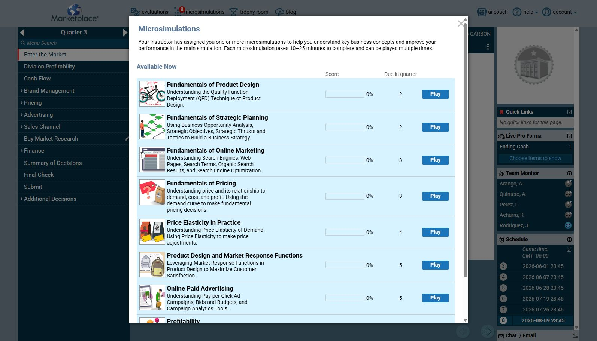
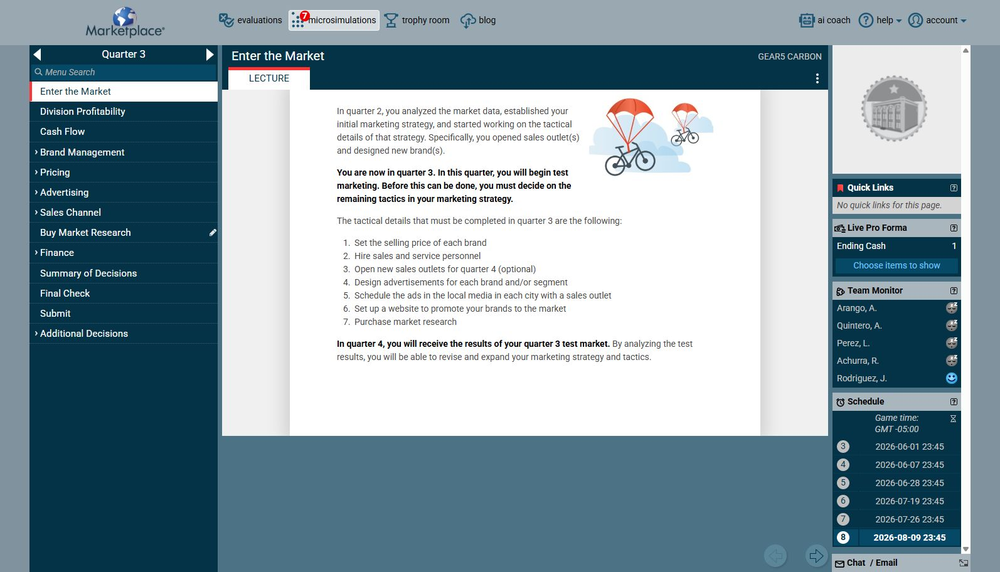

# Ejecución

Esta sección documenta la ejecución paso a paso de las simulaciones y deja evidencia visual de cada tarea antes de tomar decisiones.

<strong>▸ Estado de la simulación Marketplace</strong>

**Estado observado:** estamos en **Quarter 3** y la primera tarea disponible es **Enter the Market**. La simulación muestra la marca **GEAR5 CARBON**.

> La captura sirve como evidencia del punto de partida. Antes de modificar decisiones se debe registrar qué pide la tarea, qué datos están disponibles y qué consecuencias puede tener cada opción.

<strong>▸ Fundamentals of Product Design</strong>

Esta subsección se usará para resolver la parte de **Fundamentals of Product Design**. Cada ejercicio deberá incluir:

- captura de la pantalla inicial;
- explicación de lo que solicita la tarea;
- criterio usado para elegir la respuesta;
- resultado obtenido;
- siguiente acción pendiente.

**Estado:** pendiente de abrir la simulación específica y capturar su primera tarea.

### Primera pantalla revisada

Al pulsar **Play**, la plataforma abrió una pantalla de lectura introductoria. Lo primero que hay que revisar es el objetivo de la microsimulación y sus instrucciones antes de contestar o avanzar. En esta pantalla todavía no aparece una pregunta interactiva; por eso no se debe inventar una respuesta ni confirmar una decisión.

**Resultado de la revisión inicial:**

- La microsimulación quedó abierta desde el botón **Play**.
- La actividad pasó de estar disponible a aparecer como iniciada; el contador visible cambió de 8 a 7 microsimulaciones.
- La siguiente acción es avanzar con el botón **next** y capturar la primera pregunta o ejercicio interactivo.

### Tarea pendiente de Fundamentals of Product Design

- [x] Abrir la microsimulación desde **Play**.
- [x] Capturar la primera pantalla de lectura.
- [ ] Avanzar hasta la primera pregunta interactiva.
- [ ] Registrar la respuesta elegida y justificarla.

## Primera tarea a realizar: Enter the Market

### Qué se debe entender

La tarea **Enter the Market** corresponde a la entrada de la marca al mercado durante Quarter 3. Antes de confirmar cualquier decisión, hay que revisar los datos de mercado, el segmento objetivo, el producto y las variables de precio/costo que aparecen en las pantallas siguientes.

### Cómo la resolveremos

1. Abrir **Enter the Market**.
2. Tomar una captura de la pantalla inicial y guardar la evidencia.
3. Leer cada campo y anotar qué decisión solicita.
4. Comparar la decisión con el posicionamiento de **GEAR5 CARBON**.
5. Elegir únicamente el primer punto solicitado, sin avanzar otras decisiones todavía.
6. Registrar el resultado y la justificación en este documento.

### Tarea pendiente

- [ ] Abrir **Enter the Market**, capturar la primera pantalla de decisión y documentar la respuesta elegida.

### Nota de control

No se debe presionar **Submit** ni confirmar decisiones irreversibles hasta revisar la evidencia y validar la justificación.
