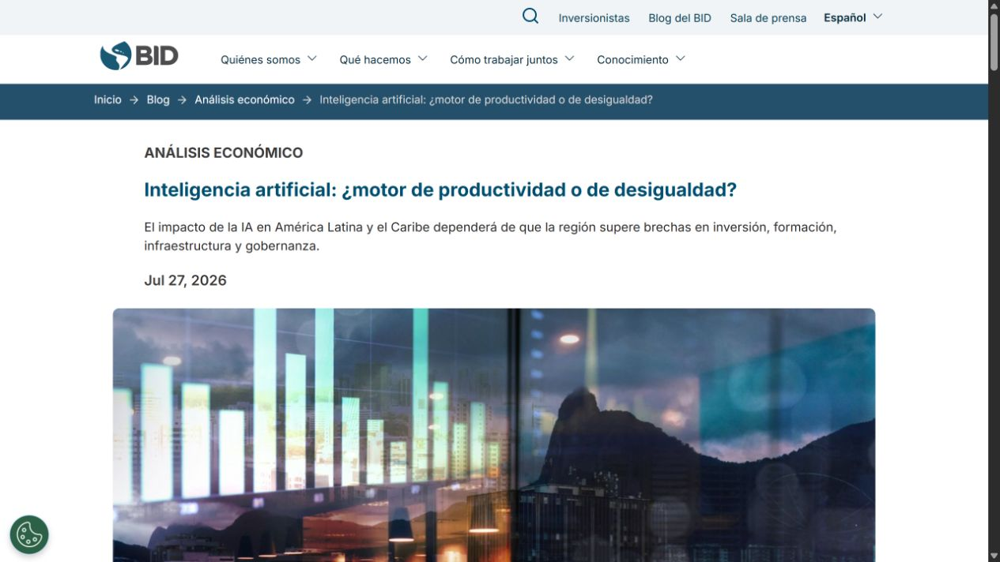
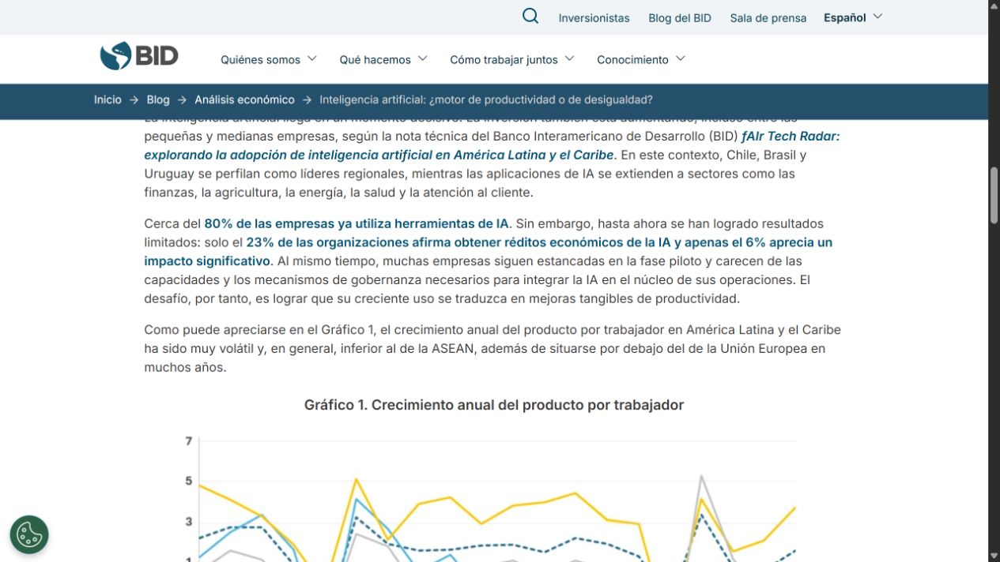
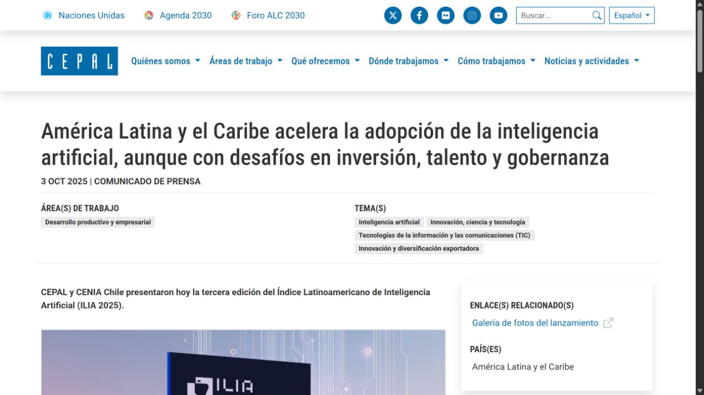
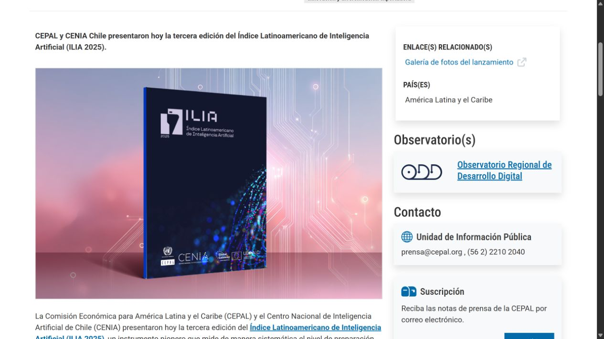
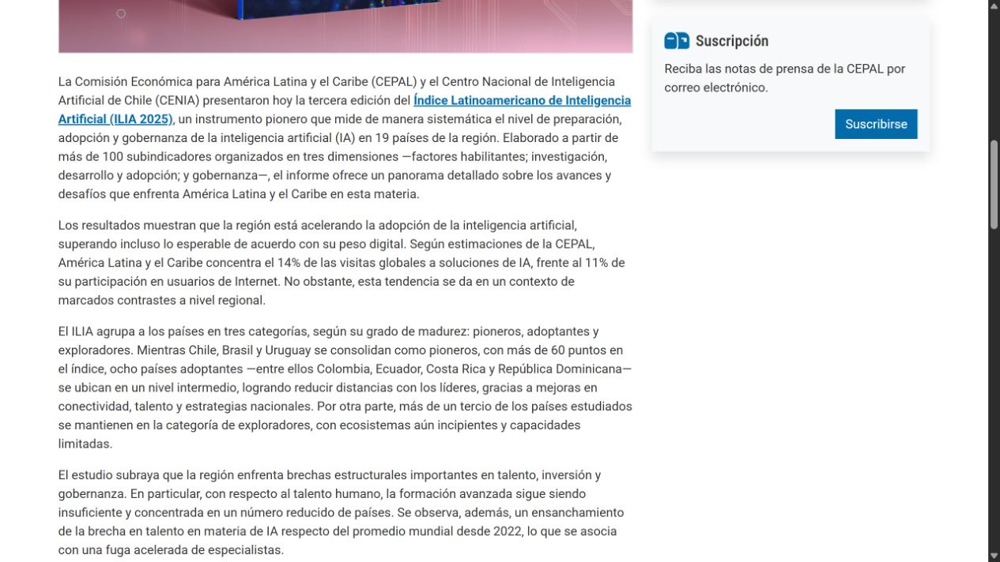
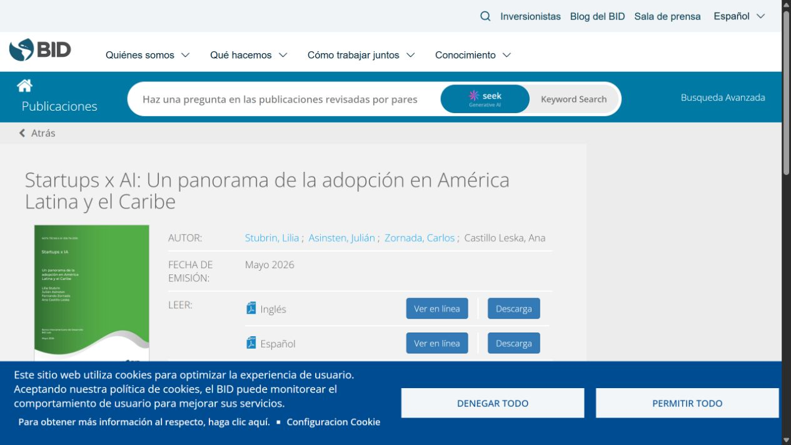
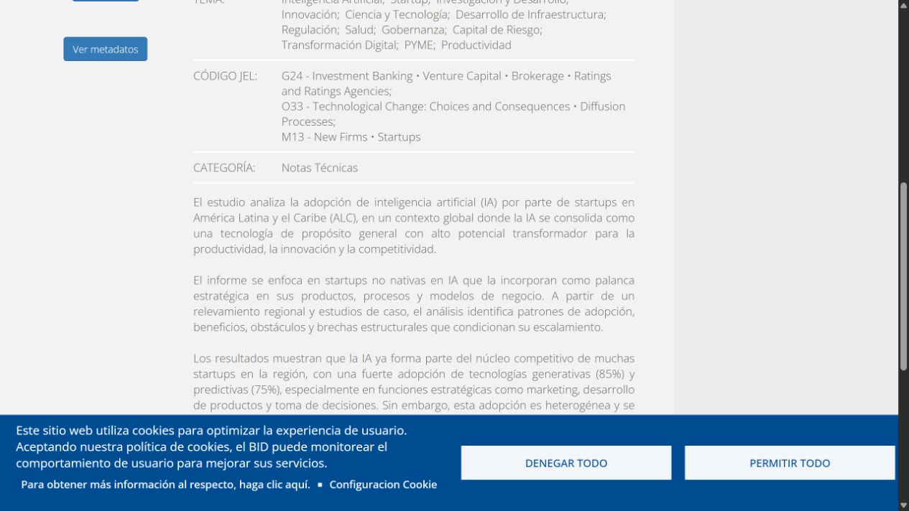

# CodeFlow — evidencia de estudios oficiales

Esta página reúne capturas de las partes más relevantes de estudios y publicaciones institucionales que respaldan la hipótesis de CodeFlow. Cada bloque separa el dato, su significado y el límite que debemos respetar al presentarlo.

<strong>1. BID — adopción alta, impacto económico todavía bajo</strong>

Fuente: [BID — Inteligencia artificial: ¿motor de productividad o de desigualdad?](https://www.iadb.org/es/blog/analisis-economico/inteligencia-artificial-motor-de-productividad-o-de-desigualdad)

El fragmento indica que cerca del **80%** de las empresas de América Latina y el Caribe utiliza herramientas de IA, pero solo **23%** afirma obtener réditos económicos y **6%** aprecia un impacto significativo.

**Por qué respalda CodeFlow:** valida el problema central de tu pitch: adoptar herramientas no es lo mismo que integrarlas en la operación y producir resultados. CodeFlow puede presentarse como la capa que ayuda a pasar de pruebas aisladas a productividad empresarial.

**Cuidado:** debemos conservar la definición y metodología exactas del BID. No decir que 80% de todas las empresas “tiene un sistema de IA integrado”. El dato habla de uso de herramientas.

## Análisis detallado con citas y partes específicas

<strong>BID — lectura detallada de las 10 capturas</strong>

### Capturas 1–2: el problema regional de productividad

El estudio ubica la IA dentro de un problema mayor: América Latina y el Caribe necesita mejorar su productividad, no solo consumir nuevas herramientas. La evidencia sirve para abrir el pitch porque CodeFlow no debería vender “tecnología por moda”, sino una forma de reorganizar el trabajo.

**Cita breve del estudio:** “el impacto de la IA [...] dependerá de que la región supere brechas en inversión, formación, infraestructura y gobernanza”.

**Relación con CodeFlow:** el diagnóstico de CodeFlow debe revisar precisamente esas cuatro brechas antes de recomendar herramientas.

**Fuente:** [BID — Inteligencia artificial: ¿motor de productividad o de desigualdad?](https://www.iadb.org/es/blog/analisis-economico/inteligencia-artificial-motor-de-productividad-o-de-desigualdad)

### Capturas 3–4: muchas empresas usan IA, pero pocas convierten ese uso en resultado

La parte central presenta el contraste entre uso, rédito económico e impacto significativo. Este es el dato más importante para la primera parte del pitch porque permite separar **adopción** de **valor creado**.

**Dato específico:** cerca del 80% utiliza herramientas de IA; 23% reporta réditos económicos y 6% percibe impacto significativo.

**Relación con CodeFlow:** CodeFlow puede posicionarse en la distancia entre “tener herramientas” y “obtener resultados”. La propuesta debe prometer integración, medición y acompañamiento, no simplemente más software.

**Limitación:** la cifra no demuestra que 80% tenga IA integrada en sus operaciones. Solo respalda el uso de herramientas y el bajo impacto reportado.

**Fuente:** [BID — cifras de adopción e impacto](https://www.iadb.org/es/blog/analisis-economico/inteligencia-artificial-motor-de-productividad-o-de-desigualdad)

### Capturas 5–6: el problema de quedarse en pilotos

El texto del BID señala que muchas empresas permanecen en fases piloto y carecen de capacidades y mecanismos de gobernanza para integrar la IA en el núcleo de sus operaciones.

**Relación con CodeFlow:** esta parte respalda el servicio recurrente. Una consultoría inicial puede detectar oportunidades, pero el valor diferencial aparece en pasar del piloto a la operación, capacitar al equipo y mantener el sistema.

**Frase para el pitch:** “El reto no es probar IA; es lograr que la IA se convierta en una capacidad operativa de la empresa”.

**Fuente:** [BID — adopción efectiva e integración operacional](https://www.iadb.org/es/blog/analisis-economico/inteligencia-artificial-motor-de-productividad-o-de-desigualdad)

### Capturas 7–8: capacidades, infraestructura y reglas

El estudio relaciona la adopción efectiva con inversión, capacidades, infraestructura digital y reglas claras.

**Relación con CodeFlow:** CodeFlow debe incluir una etapa de arquitectura y gobierno: accesos, datos, seguridad, herramientas permitidas, responsables y medición. Sin esa capa, conectar aplicaciones puede aumentar el riesgo y el desorden.

### Capturas 9–10: reorganizar la forma de trabajar

La conclusión del BID sostiene que los beneficios aparecen cuando las empresas transforman su forma de trabajar e integran la IA en el núcleo de sus operaciones.

**Relación con CodeFlow:** esta es la justificación más fuerte para llamarlo un sistema operativo empresarial y no una agencia de automatizaciones aisladas.

**Cita breve del estudio:** “integren la inteligencia artificial en el núcleo de sus operaciones”.

**Fuente:** [BID — conclusión sobre integración](https://www.iadb.org/es/blog/analisis-economico/inteligencia-artificial-motor-de-productividad-o-de-desigualdad)

<strong>CEPAL — lectura detallada de las 10 capturas</strong>

### Capturas 1–2: medir preparación, adopción y gobernanza

CEPAL explica que el ILIA 2025 mide más de 100 subindicadores agrupados en factores habilitantes, investigación/desarrollo/adopción y gobernanza.

**Relación con CodeFlow:** la estructura del pitch puede copiar esta lógica de medición: no mostrar solo uso de IA, sino preparación, implementación, impacto y gobernanza.

**Fuente:** [CEPAL — ILIA 2025](https://www.cepal.org/es/comunicados/america-latina-caribe-acelera-la-adopcion-la-inteligencia-artificial-aunque-desafios)

### Capturas 3–4: el interés regional es superior a su peso digital

**Dato específico:** la región concentra 14% de las visitas globales a soluciones de IA, frente a 11% de los usuarios globales de Internet.

**Relación con CodeFlow:** el dato respalda la existencia de interés regional, pero no debe convertirse en una afirmación exagerada sobre empresas integradas. Sirve para justificar por qué iniciar la historia desde Panamá y Latinoamérica.

**Limitación metodológica:** CEPAL utiliza tráfico web como proxy de adopción; tráfico no equivale a implementación empresarial.

### Capturas 5–6: países en diferentes niveles de madurez

CEPAL agrupa a los países en pioneros, adoptantes y exploradores. Esto permite evitar una narrativa donde toda Latinoamérica aparece como un mercado homogéneo.

**Relación con CodeFlow:** CodeFlow puede presentar su entrada a Panamá como una estrategia de acompañamiento para un mercado que necesita avanzar de exploración a adopción y después a integración.

### Capturas 7–8: brechas estructurales

El estudio destaca brechas de talento, inversión y gobernanza, además de diferencias en conectividad y estrategias nacionales.

**Relación con CodeFlow:** la educación, la comunidad, la documentación, la gobernanza y el soporte continuo deben aparecer como componentes del producto, no como extras decorativos.

### Capturas 9–10: oportunidad productiva

CEPAL presenta la IA como una oportunidad para productividad, innovación y desarrollo, pero condicionada por capacidades y políticas.

**Frase para el pitch:** “La oportunidad no está solo en usar IA, sino en construir las capacidades para usarla bien y de forma sostenible”.

**Fuente:** [CEPAL — adopción, madurez y gobernanza](https://www.cepal.org/es/comunicados/america-latina-caribe-acelera-la-adopcion-la-inteligencia-artificial-aunque-desafios)

<strong>BID Startups x AI — lectura detallada de las 10 capturas</strong>

### Capturas 1–2: la IA como palanca estratégica

El estudio analiza startups no nativas en IA que incorporan la tecnología en productos, procesos y modelos de negocio.

**Relación con CodeFlow:** respalda la idea de que una empresa no tiene que crear un modelo propio para generar valor con IA. Puede integrar IA como una capa estratégica sobre su operación.

**Fuente:** [BID — Startups x AI](https://publications.iadb.org/es/startups-x-ai-un-panorama-de-la-adopcion-en-america-latina-y-el-caribe)

### Capturas 3–4: adopción generativa y predictiva

**Datos específicos:** 85% de adopción de tecnologías generativas y 75% de tecnologías predictivas dentro de las startups analizadas.

**Relación con CodeFlow:** hay espacio para conectar capacidades distintas: agentes generativos, modelos predictivos, automatizaciones, datos y herramientas empresariales.

**Limitación:** son porcentajes de una muestra de startups; no deben presentarse como el porcentaje de todas las empresas latinoamericanas.

### Capturas 5–6: desarrolladoras, integradoras y exploradoras

El estudio distingue tres perfiles de adopción: desarrolladoras, integradoras y exploradoras.

**Relación con CodeFlow:** esta clasificación ofrece una posición estratégica clara: CodeFlow puede presentarse como integrador, especialmente para empresas que no quieren desarrollar un modelo desde cero, pero sí necesitan aplicarlo en sus procesos.

### Capturas 7–8: obstáculos de escalamiento

El estudio identifica brechas de talento, restricciones de financiamiento, baja adecuación de soluciones globales, débil conocimiento regulatorio y prácticas incipientes de gobernanza.

**Relación con CodeFlow:** cada obstáculo puede corresponder a una parte del servicio: capacitación, arquitectura, adaptación local, gobernanza y operación continua.

### Capturas 9–10: ecosistema y articulación

El estudio también señala una articulación limitada con el sector público y los inversores.

**Relación con CodeFlow:** la comunidad puede convertirse en una red de aprendizaje y colaboración, pero debemos demostrar que genera valor real y no presentarla solo como un grupo de usuarios.

**Fuente:** [BID — perfiles, adopción y brechas](https://publications.iadb.org/es/startups-x-ai-un-panorama-de-la-adopcion-en-america-latina-y-el-caribe)

<strong>BID adopción — 10 capturas</strong>

### Captura BID adopción 1

### Captura BID adopción 2

### Captura BID adopción 3

### Captura BID adopción 4

### Captura BID adopción 5

### Captura BID adopción 6

### Captura BID adopción 7

### Captura BID adopción 8

### Captura BID adopción 9

### Captura BID adopción 10

**Análisis relacionado:** estas diez capturas deben leerse como un mismo argumento: el interés por la IA ya existe, pero el valor depende de capacidades, integración, gobernanza y rediseño operativo. Para CodeFlow, esto respalda acompañar a la empresa más allá del piloto.

+

<strong>CEPAL adopción — 10 capturas</strong>

### Captura CEPAL adopción 1

### Captura CEPAL adopción 2

### Captura CEPAL adopción 3

### Captura CEPAL adopción 4

### Captura CEPAL adopción 5

### Captura CEPAL adopción 6

### Captura CEPAL adopción 7

### Captura CEPAL adopción 8

### Captura CEPAL adopción 9

### Captura CEPAL adopción 10

**Análisis relacionado:** estas diez capturas deben leerse como un mismo argumento: el interés por la IA ya existe, pero el valor depende de capacidades, integración, gobernanza y rediseño operativo. Para CodeFlow, esto respalda acompañar a la empresa más allá del piloto.

+

<strong>BID Startups x AI — 10 capturas</strong>

### Captura BID Startups x AI 1

### Captura BID Startups x AI 2

### Captura BID Startups x AI 3

### Captura BID Startups x AI 4

### Captura BID Startups x AI 5

### Captura BID Startups x AI 6

### Captura BID Startups x AI 7

### Captura BID Startups x AI 8

### Captura BID Startups x AI 9

### Captura BID Startups x AI 10

**Análisis relacionado:** estas diez capturas deben leerse como un mismo argumento: el interés por la IA ya existe, pero el valor depende de capacidades, integración, gobernanza y rediseño operativo. Para CodeFlow, esto respalda acompañar a la empresa más allá del piloto.

+

<strong>Relación entre los 30 fragmentos</strong>

Los 30 fragmentos forman una cadena: la IA ya se usa y explora, pero el uso no garantiza impacto; el impacto depende de capacidades, integración, talento, gobernanza y reorganización del trabajo.

> CodeFlow no vende simplemente acceso a IA. Ayuda a convertir adopción dispersa en una capacidad operativa integrada y medible.

<strong>2. CEPAL — el interés regional supera el peso digital</strong>

Fuente: [CEPAL — América Latina y el Caribe acelera la adopción de IA](https://www.cepal.org/es/comunicados/america-latina-caribe-acelera-la-adopcion-la-inteligencia-artificial-aunque-desafios)

La CEPAL señala que América Latina y el Caribe concentra **14% de las visitas globales a soluciones de IA**, frente a **11% de su participación en usuarios de Internet**.

**Por qué respalda CodeFlow:** demuestra que existe interés regional y un mercado que está explorando soluciones de IA. La oportunidad de CodeFlow no sería convencer a las empresas de que la IA existe, sino ayudar a convertir ese interés en sistemas operativos útiles.

**Cuidado:** este indicador mide visitas a soluciones de IA; no equivale automáticamente a número de empresas implementando IA.

<strong>3. BID — startups generativas, predictivas e integradoras</strong>

Fuente: [BID — Startups x AI: adopción en América Latina y el Caribe](https://publications.iadb.org/es/startups-x-ai-un-panorama-de-la-adopcion-en-america-latina-y-el-caribe)

El estudio reporta una adopción de **85% de IA generativa** y **75% de IA predictiva** entre las startups analizadas. También distingue perfiles de desarrolladoras, integradoras y exploradoras.

**Por qué respalda CodeFlow:** permite ubicar a CodeFlow como una empresa integradora. CodeFlow no tendría que competir creando otro modelo base; puede crear valor conectando modelos, APIs, herramientas, datos y procesos de negocio.

**Cuidado:** los porcentajes corresponden a la muestra de startups estudiada, no a todas las empresas de América Latina.

<strong>4. Conclusión para la narrativa</strong>

Los tres estudios permiten construir una secuencia sólida:

1. Hay un nivel alto de interés y uso de IA.
2. La adopción regional es desigual y enfrenta brechas de talento, infraestructura y gobernanza.
3. El impacto económico todavía no alcanza a todas las empresas.
4. El reto es integrar la IA en la forma de trabajar.
5. CodeFlow propone conectar herramientas, automatizaciones, agentes y capacitación en un ecosistema que evoluciona con la empresa.

**Frase provisional:**

> Las empresas ya están probando IA. CodeFlow existe para convertir esas pruebas y herramientas aisladas en un sistema operativo conectado que genere resultados y pueda crecer con el negocio.

