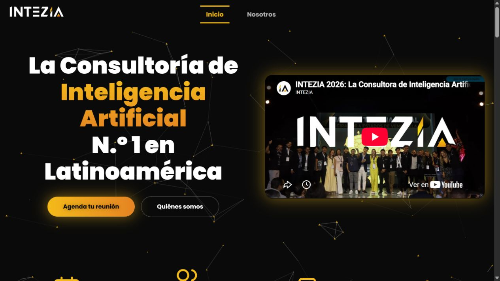
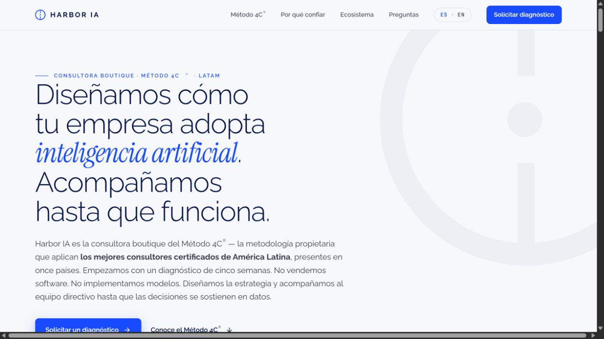
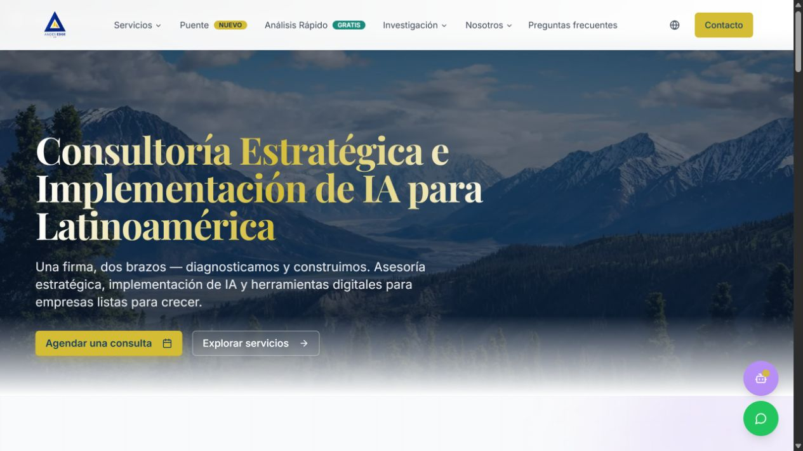
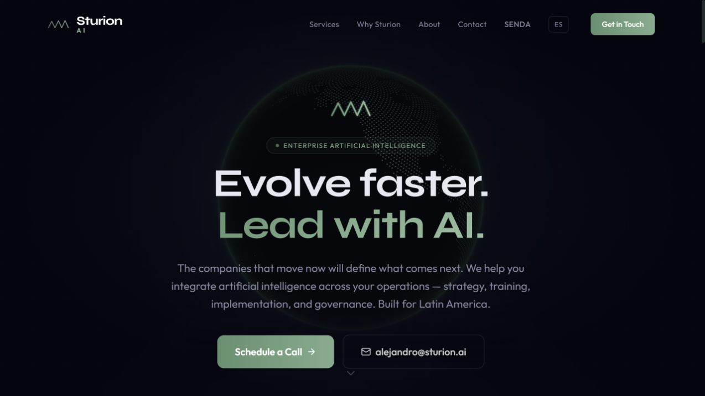
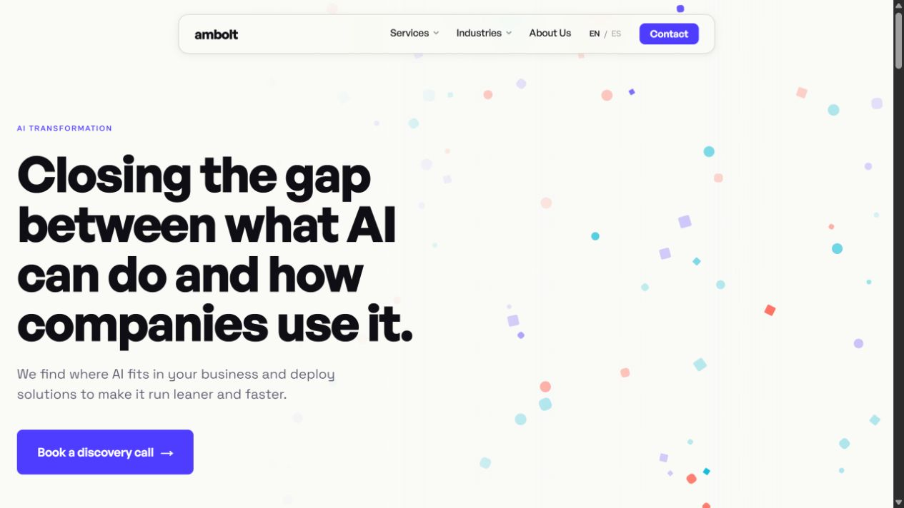

# Investigación profunda: cómo validar el modelo de CodeFlow

> Esta página amplía la investigación anterior. Se enfoca en economía de comunidades, comunidades de IA, integración de sistemas, retención y precios de consultoría. Las fuentes tienen intereses comerciales cuando son casos publicados por plataformas; por eso cada conclusión indica qué sí demuestra y qué no.

## Hallazgo central

La oportunidad de CodeFlow no está en vender “acceso a una comunidad de IA”. La oportunidad está en vender un ciclo continuo:

**diagnóstico → implementación → capacitación → uso recurrente → soporte → mejora → expansión a otro proceso.**

Los ejemplos externos respaldan esta arquitectura, pero también muestran una condición: la comunidad solo retiene miembros cuando ayuda a producir resultados, conexiones o progreso verificable.

## 1. La comunidad como producto de clientes, no solo como grupo social

<strong>Circle: comunidad integrada al producto y al CRM</strong>

Circle describe comunidades de clientes con discusiones, eventos, cursos, directorio de miembros, analítica, pagos, automatización de onboarding y conexión con CRM mediante API. Su página publica un plan Professional de **US$89/mes**, Business de **US$199/mes** y Circle Plus con precio personalizado, incluyendo agentes de IA y soporte estratégico.

Fuente: [Circle — Customer Communities](https://circle.so/platform/customer-communities)

**Aplicación:** CodeFlow puede tratar la comunidad como una extensión del sistema operativo del cliente: espacio de capacitación, solicitudes de soporte, documentación, eventos y registro de mejoras. Eso se parece más a customer success que a un grupo de contenido.

**Límite:** Circle vende una plataforma. La página prueba que esa arquitectura existe como categoría de producto, no que CodeFlow deba comprar Circle ni que el cliente acepte el mismo precio.

## 2. Economía de membresía y escalera de valor

<strong>Circle: los niveles deben corresponder a compradores distintos</strong>

Circle recomienda diseñar dos o tres niveles, con una diferencia real de valor entre ellos. La lógica es que el cliente entre por una oferta accesible y suba cuando necesite más soporte, personalización o acceso.

Fuente: [Circle — Membership Tiers](https://circle.so/blog/membership-tiers)

**Aplicación a CodeFlow:**

1. Comunidad: aprende y participa.
2. Aplicación: recibe revisión de sus procesos y sesiones de ayuda.
3. Operación: obtiene mantenimiento, monitoreo, mejoras e integraciones.

La escalera evita mezclar una membresía educativa de US$49 con un servicio empresarial de varios miles de dólares en una sola promesa confusa.

<strong>Skool: infraestructura barata, pero con comisión</strong>

Skool publica Hobby por **US$9/mes con 10% de comisión** y Pro por **US$99/mes con 2,9% de comisión**. Ofrece miembros, cursos, videos y llamadas en vivo ilimitados en ambos planes publicados.

Fuente: [Skool — Pricing](https://www.skool.com/pricing)

**Lectura:** la plataforma puede costar poco; el verdadero costo de CodeFlow será el tiempo experto, el mantenimiento técnico, los modelos/API, la documentación y la responsabilidad de que el sistema funcione.

## 3. Comunidades de IA: qué venden realmente

<strong>AI Automation Society</strong>

AI Automation Society presenta una comunidad para convertir habilidades de automatización en una carrera o negocio. Su oferta combina playbook, soporte semanal, proyectos prácticos y ayuda técnica. El mensaje comercial se centra en construir sistemas reales y monetizarlos, no en consumir noticias de IA.

Fuente: [AI Automation Society](https://aiautomationsociety.ai/)

**Aplicación:** la comunidad de CodeFlow debería organizarse alrededor de “casos enviados y resueltos”, no alrededor de una biblioteca infinita. Cada semana debería producir una plantilla, un agente, una integración o una decisión documentada.

<strong>Angelica Automates</strong>

El caso de Angelica reporta una comunidad de automatización con más de 350 miembros, tutoriales, troubleshooting, sesiones en vivo y una membresía de **US$99/mes o US$949/año**. Su audiencia llegó desde tutoriales publicados en TikTok y preguntas que luego necesitaban un espacio común.

Fuente: [Circle — Angelica Automates](https://circle.so/blog/angelica-automates-membership)

**Aplicación:** tu estrategia de marca personal tiene un paralelismo directo: publicar análisis y demostraciones públicas, identificar preguntas repetidas y convertir esas preguntas en sesiones, recursos y soporte dentro de la comunidad.

**Cuidado:** el caso no prueba que publicar contenido automáticamente produzca 350 miembros; prueba que el contenido, la autoridad y la resolución práctica pueden formar una oferta coherente.

## 4. El valor de los agentes dentro de una comunidad

<strong>AI para onboarding, soporte y retención</strong>

Circle describe usos de IA para etiquetar publicaciones, dirigir preguntas al espacio correcto, enviar seguimientos después de eventos y alertar cuando miembros dejan de participar. También explica que un agente necesita contexto de pagos, progreso, actividad e historial para responder bien.

Fuente: [Circle — What AI Does for Community Builders](https://circle.so/blog/ai-community-management-builders) y [Circle — AI Community Manager](https://circle.so/blog/what-is-an-ai-community-manager)

**Aplicación:** esto respalda tu distinción entre un chatbot aislado y un sistema. Un agente útil debe conocer el estado del cliente, activar un flujo, consultar datos y escalar los casos sensibles a una persona.

**Diseño inicial de CodeFlow:**

- Agente de onboarding: identifica objetivo y nivel técnico.
- Agente de diagnóstico: clasifica procesos y cuellos de botella.
- Agente de soporte: responde preguntas repetidas y crea tickets.
- Agente de seguimiento: revisa si la automatización se está utilizando.
- Revisión humana: aprueba cambios, permisos y decisiones de alto riesgo.

## 5. Marca personal que se convierte en negocio recurrente

<strong>Justin Welsh: audiencia, filtro y membresía</strong>

El caso de Audience & Income reporta **US$40.000 en 48 horas**, una operación de una persona y una membresía anual de **US$249**. El modelo incluye contenido, solicitud de admisión, lista de espera, pagos y automatizaciones.

Fuente: [Outseta — Justin Welsh](https://www.outseta.com/customers/building-audience-income-with-justin-welsh)

**Aplicación:** CodeFlow puede usar LinkedIn como canal de confianza, pero debe llevar a una oferta concreta: diagnóstico, workshop, comunidad o piloto. El número de seguidores es secundario frente a la cantidad de conversaciones calificadas y pilotos pagados.

<strong>Jay Clouse / Creator Science</strong>

Circle presenta a Jay Clouse como un creador que construyó un negocio de membresía de más de **US$400.000 anuales** en poco más de tres años. Su enfoque organiza el camino desde seguidores hacia una propuesta, una estrategia de contenido y una membresía.

Fuente: [Circle — Jay Clouse Masterclass](https://circle.so/jay-clouse-community-masterclass)

**Aplicación:** para CodeFlow, el contenido debe tener una función dentro del embudo: demostrar criterio, enseñar una parte del método y abrir una conversación sobre un problema empresarial real.

## 6. Casos empresariales: cuando la comunidad mejora retención

<strong>Pat Flynn / SPI</strong>

El caso de SPI afirma que el negocio pasó de cursos, Facebook, Zoom e integraciones separadas a una experiencia unificada. Circle reporta **US$700.000+ en ingresos de membresía en 2024**, crecimiento de **40,3%**, **58%** de ingresos desde comunidad y finalización de cursos **2,5–3 veces mayor**.

Fuente: [Circle — SPI Community Playbook](https://circle.so/customer-stories/spi-community)

**Aplicación:** es evidencia favorable para tu idea de “no diez herramientas aisladas”. La comunidad y la plataforma aumentan el valor cuando reducen fricción y acompañan el proceso completo.

**Advertencia:** son resultados reportados por Circle; deben presentarse en el documento como “según el caso publicado por Circle”.

<strong>RealPars: educación técnica con clientes empresariales</strong>

RealPars reporta más de **1.200 miembros**, **130 cursos**, más de **100 clientes empresariales** y una audiencia de **1,2 millones de suscriptores en YouTube**. Su transición de cursos a comunidad incorporó clases en vivo y participación de miembros.

Fuente: [Circle — RealPars](https://circle.so/customer-stories/realpars-customer-story)

**Aplicación:** demuestra una ruta parecida a CodeFlow: contenido público para alcance, formación estructurada para autoridad y comunidad para profundizar la relación. El componente empresarial permite pensar en planes para equipos, no solo individuos.

## 7. Precios de consultoría e implementación de IA

<strong>Mercado publicado de consultoría</strong>

RaftLabs publica rangos de **US$15.000–35.000** para una evaluación enfocada, **US$35.000–80.000** para una evaluación estratégica amplia y **US$5.000–15.000/mes** para un retainer de asesoría técnica.

Virgent AI publica **US$450 por hora** y retainers desde **US$6.000/mes**. Tillerbridge publica evaluaciones de **US$20.000–80.000** y señala rangos de **US$150–500 por hora** en guías de 2026.

Fuentes: [RaftLabs](https://www.raftlabs.com/services/ai-consulting), [Virgent AI](https://www.virgent.ai/services) y [Tillerbridge](https://www.tillerbridge.com/services/ai-consulting/)

**Lectura para CodeFlow:** estos precios prueban que el mercado separa evaluación, implementación y retainer. No significa que debas cobrar esos importes; significa que una mensualidad empresarial debe estar ligada a responsabilidad operativa, no a contenido genérico.

## 8. Retención: la conexión inicial es parte del producto

<strong>Networkli Retention Benchmark</strong>

Networkli reporta un análisis de más de **10.000 interacciones en 500 comunidades**. Sus hallazgos publicados indican que los miembros que logran una conexión significativa durante los primeros 30 días tienen una probabilidad de renovar **5–7 veces mayor**; también reporta que 73% de miembros que abandonaron citaron aislamiento o falta de conexión.

Fuente: [Networkli — 2025 Community Retention Benchmark](https://www.networkli.co/research/2025-community-retention-benchmark)

**Aplicación:** CodeFlow debe diseñar onboarding con una conexión concreta: mentoría, compañero de implementación, grupo por industria o primera revisión de caso. Una comunidad sin activación inicial puede perder miembros aunque el contenido sea bueno.

**Límite:** Networkli vende automatización de matching, por lo que su evidencia tiene interés comercial. Úsala como hipótesis operativa y valida tus propias tasas.

## 9. Comparación de modelos

| Modelo | Quién paga | Qué recibe continuamente | Principal motor de retención | Encaje con CodeFlow |
|---|---|---|---|---|
| Comunidad educativa | Individuo o equipo | Cursos, sesiones, plantillas, pares | Progreso y conexión | Bueno para marca personal |
| Comunidad de automatización | Practicante o agencia | Blueprints, soporte, proyectos | Resultados prácticos | Bueno para School |
| Customer community | Clientes de una empresa | Onboarding, soporte, eventos, feedback | Éxito con el producto | Bueno para el servicio B2B |
| Retainer de IA | Empresa | Asesoría, mantenimiento, nuevas mejoras | Sistema crítico y continuidad | Bueno para CodeFlow empresarial |
| Plataforma/SaaS | Empresa | Software, API, agentes, analítica | Integración en el workflow | Meta posterior; requiere más producto |

## 10. Conclusiones críticas

<strong>Lo que la investigación sí valida</strong>

- La marca personal puede ser un canal de adquisición para una membresía.
- La comunidad puede combinar aprendizaje, soporte y networking.
- La integración de herramientas y datos es una propuesta de valor reconocible.
- Los modelos recurrentes existen en rangos desde decenas de dólares hasta retainers empresariales de miles.
- La IA puede automatizar onboarding, soporte y seguimiento sin reemplazar la relación humana de alto valor.
- La continuidad se justifica mejor por mantenimiento, resultados y mejora que por publicaciones.

<strong>Lo que la investigación no valida todavía</strong>

- Que empresas panameñas paguen US$99, US$249 o una cifra superior.
- Que los clientes quieran comunidad además de implementación.
- Que CodeFlow pueda mantener calidad con muchos clientes y una operación pequeña.
- Que los agentes produzcan ahorro real sin supervisión.
- Que el cliente permanezca después de resolver su primer problema.
- Que una comunidad general de IA tenga suficiente foco para retener.

## 11. Diseño recomendado del piloto

1. Reclutar 5 empresas con un problema concreto.
2. Cobrar un diagnóstico pequeño, no regalar todo el trabajo.
3. Implementar un solo flujo prioritario por empresa.
4. Crear una sesión grupal semanal para compartir aprendizajes.
5. Medir horas ahorradas, errores, uso semanal y satisfacción.
6. Ofrecer una mensualidad separada para soporte y mejora.
7. Medir renovación al día 30 y día 90.

## Veredicto

La evidencia externa favorece la arquitectura de CodeFlow, pero no justifica venderla todavía como “el sistema operativo de todas las empresas”. La posición más creíble es empezar como un servicio especializado de diagnóstico, integración y mejora continua, apoyado por una comunidad práctica. La plataforma propia y la promesa de ecosistema deben crecer después de observar qué procesos se repiten entre clientes.

## 12. Competidores y referentes reales de consultoría e implementación de IA

Esta comparación no trata a todas las empresas como competidores idénticos. Algunas venden estrategia, otras implementación técnica, otras educación y otras transformación enterprise. Precisamente esa diferencia ayuda a encontrar el espacio de CodeFlow.

### 12.1 Intezia — consultoría, educación y eventos en Latinoamérica

Intezia se presenta como una consultora de IA enfocada en democratizar la adopción en Latinoamérica. Divide su oferta en consultoría, educación y eventos, y declara presencia en Colombia, México, Perú y Panamá. Su propuesta es llevar a los equipos desde conocer la IA hasta utilizarla en el trabajo real.

Fuente: [Intezia](https://intezia.com/)

**Diferenciación:** cobertura regional, educación y consultoría combinadas.

**Fortaleza:** reduce la barrera de entrada para equipos que todavía no saben por dónde empezar.

**Límite:** su comunicación se parece más a adopción y capacitación que a un sistema operativo integrado que conecte múltiples procesos y herramientas.

**Implicación para CodeFlow:** no conviene competir diciendo solamente “también damos capacitación”. Hay que demostrar el paso posterior: capacitación conectada a implementación, agentes, integraciones y medición de uso.

### 12.2 Harbor IA — metodología propietaria de adopción

Harbor IA se posiciona como una consultora boutique para empresas medianas y grandes de Latinoamérica. Utiliza el Método 4C®, comienza con un diagnóstico de cinco semanas y afirma que no vende software ni despliega modelos, sino que diseña la estrategia y acompaña al equipo ejecutivo hasta que las decisiones estén basadas en datos.

Fuente: [Harbor IA](https://harbor-ia.com/es)

**Diferenciación:** metodología, estrategia ejecutiva y adopción organizacional.

**Fortaleza:** comunica una posición clara: no es una agencia de software ni una academia.

**Límite:** deja espacio entre la recomendación estratégica y la construcción cotidiana de automatizaciones.

**Implicación para CodeFlow:** CodeFlow podría ocupar la posición de “de la estrategia a la operación”: diagnóstico más implementación de procesos, soporte y mejora continua. No debe prometer solo estrategia.

### 12.3 Andes Edge — diagnóstico y construcción para empresas de LATAM

Andes Edge combina asesoría estratégica con implementación de IA y herramientas digitales. Su mensaje es “diagnosticamos y construimos” y promete automatizaciones y herramientas digitales con resultados en semanas, no meses.

Fuente: [Andes Edge](https://andesedgeconsulting.com/)

**Diferenciación:** une advisory financiero/estratégico con implementación práctica para empresas latinoamericanas.

**Fortaleza:** habla el idioma de negocio y no solo el de tecnología.

**Límite:** su propuesta puede parecer proyecto por proyecto; no se observa en la página una comunidad como parte central de la continuidad.

**Implicación para CodeFlow:** combinar diagnóstico financiero y operativo con una comunidad de continuidad puede crear una experiencia diferente: cada implementación alimenta plantillas, capacitación y aprendizajes reutilizables.

### 12.4 Sturion AI — construir, entrenar, desplegar y gobernar

Sturion se posiciona como consultora enterprise para integrar IA en operaciones. Su oferta incluye estrategia, capacitación, implementación y gobernanza, y enfatiza que no solo asesora: construye, entrena, despliega y gobierna sistemas.

Fuente: [Sturion AI](https://sturion.ai/)

**Diferenciación:** ciclo técnico completo y orientación a empresas grandes en Latinoamérica.

**Fortaleza:** transmite capacidad de producción y gobernanza, no solo prototipos.

**Límite:** puede tener una estructura y un precio orientados a enterprise, menos accesibles para pymes y equipos pequeños.

**Implicación para CodeFlow:** una oportunidad sería crear una versión modular y más accesible para empresas pequeñas y medianas, manteniendo controles, documentación y supervisión.

### 12.5 Ambolt — assessment, implementation y handoff

Ambolt presenta un modelo de tres fases: assessment, implementation y handoff. Su foco está en empresas medianas y grandes de Latinoamérica, con soluciones de producción y transferencia de propiedad al equipo del cliente.

Fuente: [Ambolt](https://ambolt.studio/en)

**Diferenciación:** estructura de entrega clara y transferencia de ownership.

**Fortaleza:** evita que el cliente dependa eternamente del consultor para operar la solución.

**Límite:** el handoff puede dejar una necesidad de soporte, evolución y capacitación continua.

**Implicación para CodeFlow:** CodeFlow puede diferenciarse con “handoff más acompañamiento”: documentar y capacitar, pero mantener un plan mensual de optimización, monitoreo y nuevas integraciones.

### 12.6 Lopettia — estrategia, integración y experiencia enterprise

Lopettia se presenta como una firma de estrategia e implementación para Latinoamérica, el Caribe y Norteamérica. Resalta más de 20 años de experiencia combinada en proyectos enterprise y ofrece implementación e integración.

Fuente: [Lopettia](https://lopettia.ai/)

**Diferenciación:** disciplina de ejecución enterprise y experiencia regional.

**Fortaleza:** credibilidad para proyectos grandes y complejos.

**Límite:** su posicionamiento no parece diseñado para una comunidad de aprendizaje accesible ni para una marca personal que genere demanda de manera orgánica.

**Implicación para CodeFlow:** empezar con empresas donde la cercanía, velocidad y educación sean ventajas competitivas, antes de intentar competir por contratos enterprise.

### 12.7 Grandes consultoras: IBM y NTT DATA

IBM Consulting comunica gobierno de IA, reducción de riesgos, estrategia e implementación técnica. NTT DATA comunica estrategia, gobierno, soporte de implementación y capacitación de equipos, con una escala global y décadas de I+D.

Fuentes: [IBM AI Governance](https://www.ibm.com/consulting/ai-governance) y [NTT DATA AI Consulting](https://www.nttdata.com/global/en/services/ai/ai-consulting)

**Diferenciación:** confianza institucional, escala, especialistas, cumplimiento y capacidad de ejecutar en organizaciones complejas.

**Fortaleza:** pueden resolver problemas de gobierno, seguridad e integración que un equipo pequeño no puede cubrir solo.

**Límite:** costo, velocidad y distancia con empresas pequeñas; la experiencia puede ser más corporativa y menos personalizada.

**Implicación para CodeFlow:** no competir por tamaño. Competir por foco, cercanía, rapidez, transparencia, prototipos pequeños y una relación continua con equipos que todavía no están listos para IBM.

## 13. Mapa de diferenciación

| Empresa o tipo | Cliente principal | Qué vende | Diferenciador | Espacio que deja |
|---|---|---|---|---|
| Intezia | Equipos que están aprendiendo | Consultoría, educación y eventos | Accesibilidad regional | Integración operativa continua |
| Harbor IA | Empresas medianas/grandes | Método de adopción | Metodología ejecutiva | Construcción y mantenimiento diario |
| Andes Edge | Empresas de LATAM | Diagnóstico + herramientas | Negocio y tecnología | Comunidad y aprendizaje recurrente |
| Sturion AI | Enterprise | Construcción, despliegue y gobierno | Ciclo técnico completo | Oferta modular para pymes |
| Ambolt | Medianas/grandes | Assessment → implementación → handoff | Transferencia de ownership | Evolución posterior al handoff |
| Lopettia | Enterprise regional | Estrategia e integración | Experiencia de ejecución | Cercanía y velocidad para equipos pequeños |
| IBM / NTT DATA | Grandes organizaciones | Transformación, gobierno y delivery | Escala y confianza | Accesibilidad y acompañamiento personal |
| **CodeFlow propuesto** | Pymes y equipos en crecimiento | Sistema conectado + capacitación + comunidad + mejora | **Adopción práctica continua, modular y cercana** | Debe probarse con pilotos y métricas |

## 14. Diferenciación que CodeFlow sí podría defender

<strong>Posicionamiento recomendado</strong>

> **CodeFlow ayuda a empresas pequeñas y medianas de Latinoamérica a pasar de usar herramientas de IA aisladas a operar un sistema conectado de automatizaciones, agentes y conocimiento, con capacitación y mejora continua.**

La frase es mejor que “hacemos inteligencia artificial” porque define el cambio: de uso aislado a sistema operativo acompañado.

<strong>Las cuatro diferencias concretas</strong>

1. **Conectividad:** no entregamos diez automatizaciones independientes; diseñamos cómo se pasan información y contexto.
2. **Continuidad:** no terminamos en la implementación; mantenemos, medimos y mejoramos.
3. **Educación aplicada:** cada capacitación se conecta con procesos reales del cliente.
4. **Comunidad especializada:** los clientes comparten aprendizajes, plantillas y casos, sin mezclar una comunidad generalista con soporte confidencial.

<strong>Lo que CodeFlow no debe afirmar todavía</strong>

No debe afirmar que es “el sistema operativo universal de la empresa”, que reemplaza consultoras enterprise, que todos los agentes son autónomos o que la mensualidad está validada. Esas frases requerirían casos, métricas y referencias propias.

## 15. Recomendación estratégica final

La competencia está dividida en cuatro espacios: educación, estrategia, construcción técnica y transformación enterprise. CodeFlow puede diferenciarse al ocupar la intersección de los cuatro, pero debe entrar por un segmento concreto: empresas pequeñas y medianas que ya usan varias herramientas, tienen procesos repetitivos y necesitan acompañamiento para conectar, capacitar y mantener.

El primer producto no debería ser una plataforma completa. Debería ser un **Programa CodeFlow de 90 días**:

- Semana 1–2: mapa de procesos y herramientas.
- Semana 3–5: selección de un caso de alto valor.
- Semana 6–8: implementación conectada.
- Semana 9–10: capacitación y documentación.
- Semana 11–12: medición, corrección y plan mensual.

Después del piloto, la mensualidad puede incluir mantenimiento, una mejora prioritaria por ciclo, soporte, capacitación y acceso a la comunidad. Así la diferenciación no depende de decir “somos distintos”, sino de entregar un ciclo que los competidores separan o terminan en el handoff.
