# Networking para Esteban - primeros 100 contactos de datos e IA

Documento inicial para construir una lista de 100 contactos utiles para Esteban. Esta version ya reune los primeros 50 contactos y prioriza estudiantes y profesionales jovenes relacionados con analisis de datos, Business Intelligence, SQL, Python, Power BI, automatizacion e inteligencia artificial.

> Nota operativa: no se enviaron invitaciones ni mensajes. Este documento es solo preparacion manual: capturas, links, lectura estrategica y mensaje sugerido.

## Perfil base de Esteban

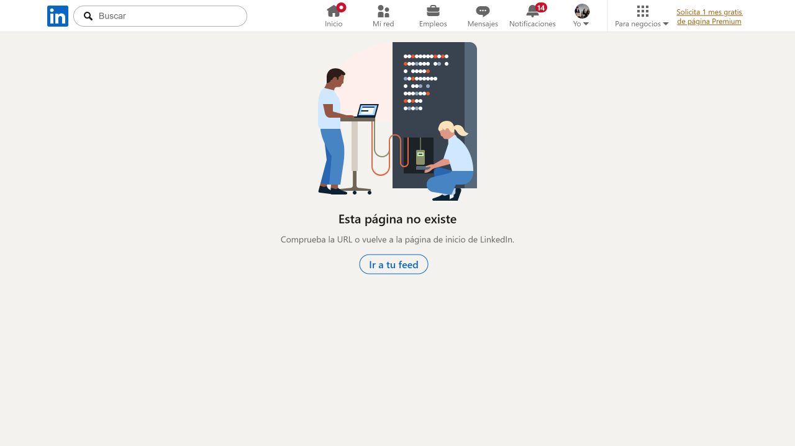

**Lectura del perfil:** Esteban aparece como estudiante de Business Analytics, con foco en visualizacion y analisis de datos. Por eso conviene buscar contactos que no sean solamente ejecutivos grandes, sino pares cercanos: estudiantes avanzados, analistas junior, perfiles de BI, automatizacion y data que puedan abrir conversaciones naturales y reciprocas.

## Criterio de busqueda

- Perfil ideal: estudiante o profesional joven.
- Area: datos, BI, Power BI, SQL, Python, automatizacion, IA o Business Analytics.
- Ubicacion preferida: Panama y LATAM; se aceptan perfiles internacionales si el encaje tecnico es fuerte.
- Objetivo: networking genuino, aprendizaje, colaboracion y posibles puentes a oportunidades B2B futuras.

<strong>Capturas de busqueda usadas como evidencia</strong>

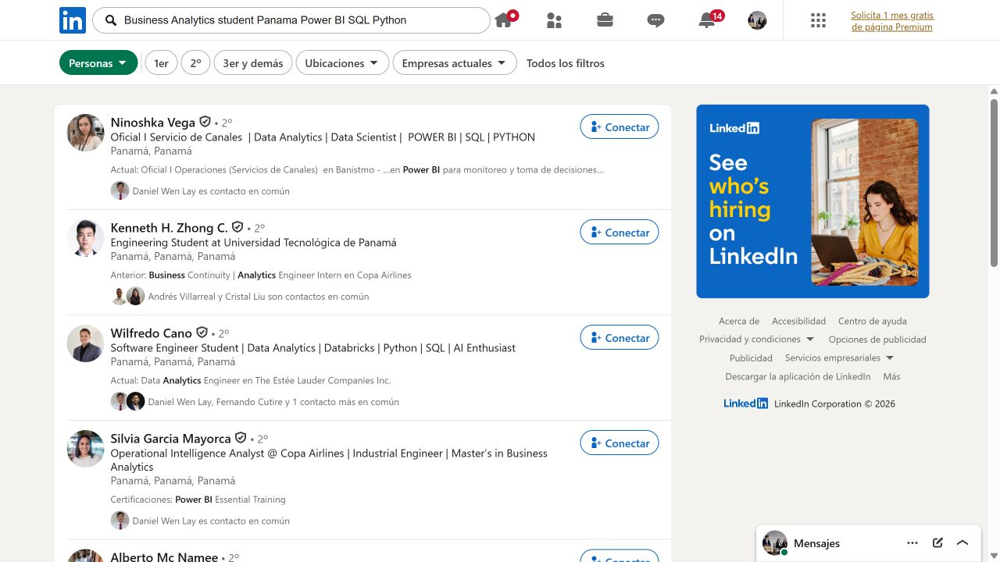

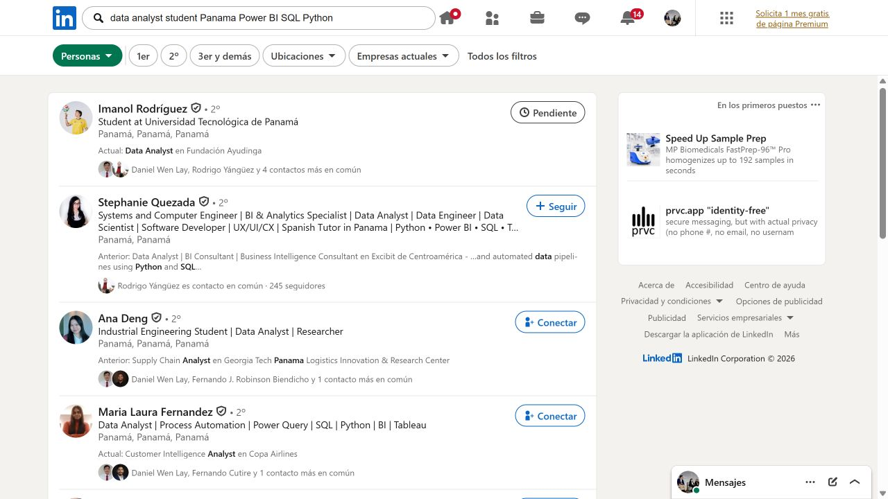

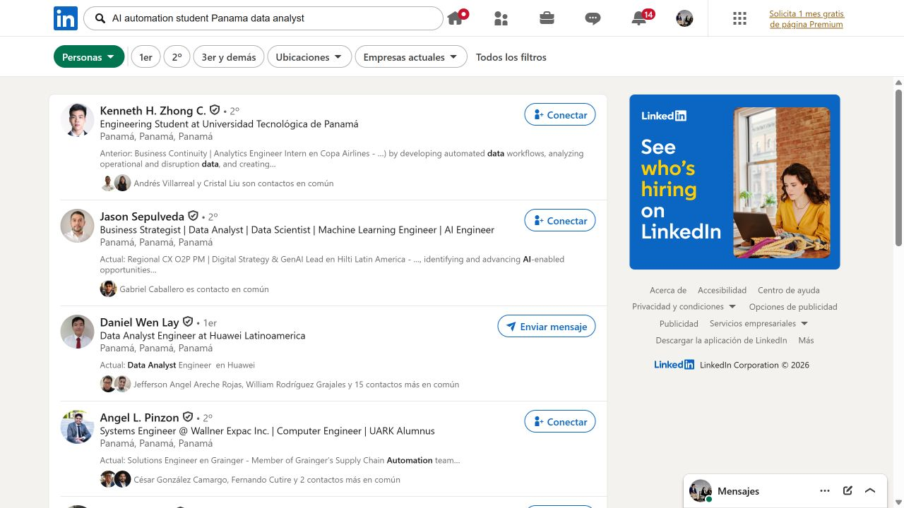

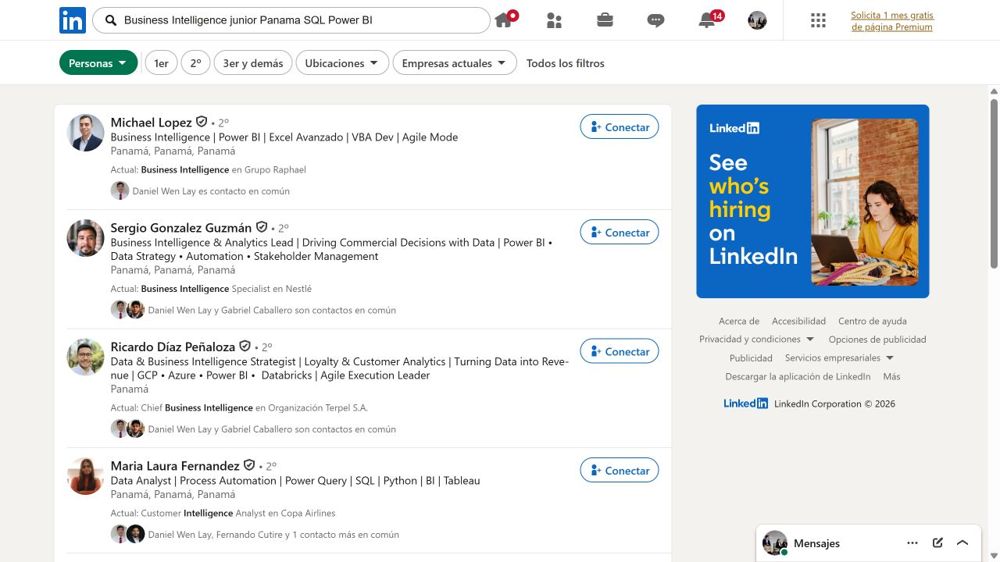

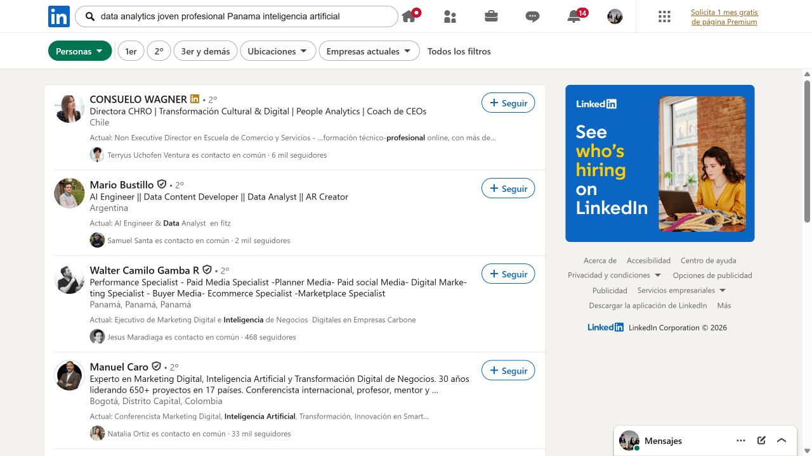

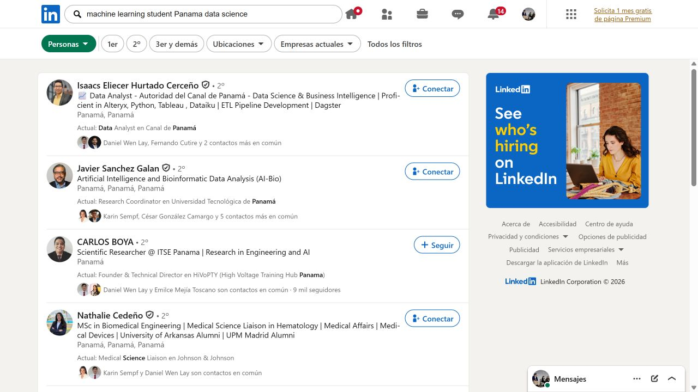

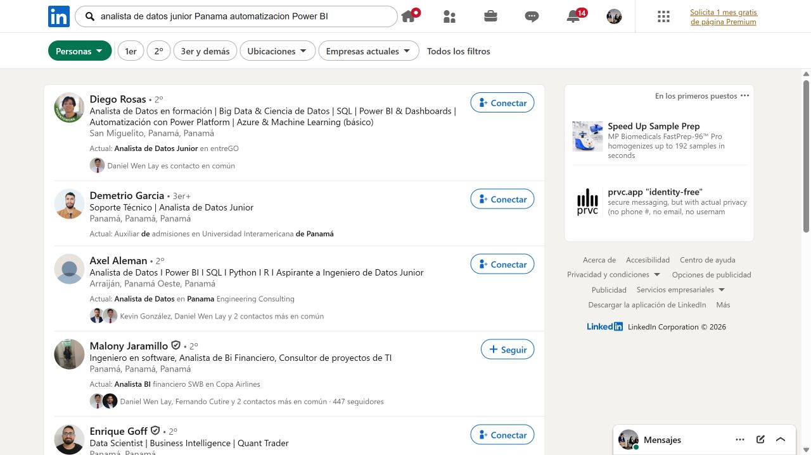

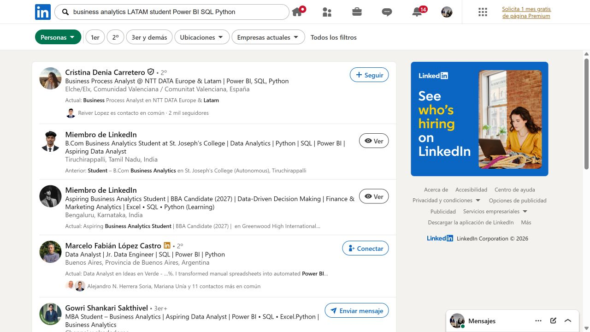

## Primeros 100 contactos seleccionados

<strong>1. Diego Rosas</strong> ? Analista de datos en formacion; Big Data, SQL, Power BI, Power Platform, Azure y ML basico.

**Link de perfil:** [Abrir perfil de LinkedIn](https://www.linkedin.com/in/diego-rosas-98891031a/)

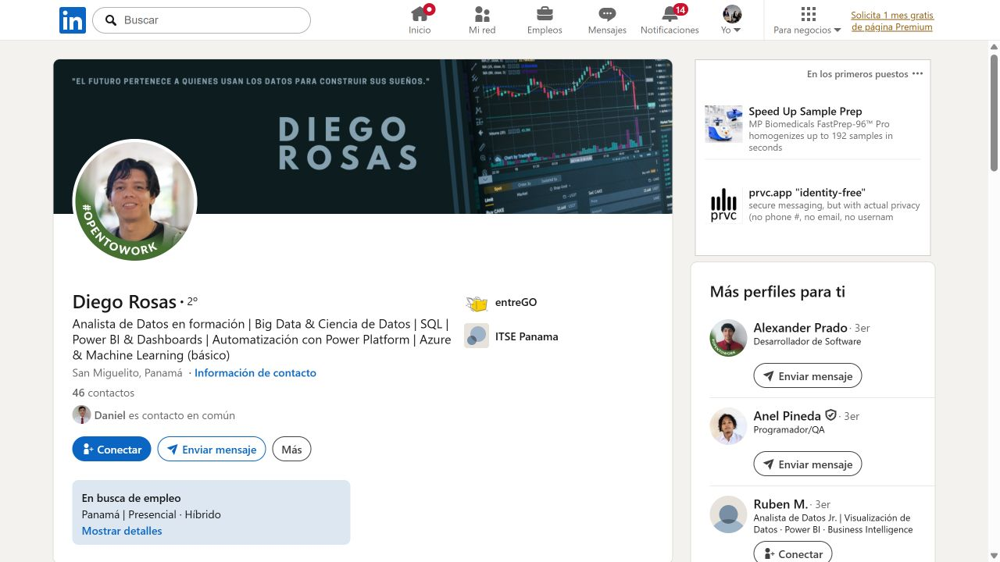

**Por que encaja con Esteban:** este perfil puede servir como contacto cercano porque conecta con el mismo territorio profesional: datos, analitica, automatizacion, BI o IA aplicada. No es un contacto frio generico; hay una razon concreta para conversar desde intereses tecnicos compartidos.

**Valor potencial:** puede aportar referencias sobre herramientas, rutas de aprendizaje, proyectos, oportunidades junior, comunidades tecnicas o formas de convertir analitica en trabajo real. Tambien puede servir como puente hacia empresas o equipos donde ya se aplican estas habilidades.

**Mensaje sugerido para enviar manualmente:**

> Hola Diego, vi que tambien estas trabajando/creciendo en temas de datos, BI, automatizacion e IA. Soy Esteban, estudio Business Analytics y estoy conectando con personas que esten construyendo en esta area. Me gusto tu enfoque en analista de datos en formacion. Seria buenisimo conectar y aprender de lo que estas haciendo.

<strong>2. Jamie Gooding</strong> ? Analista de datos junior en formacion; Excel, Power BI y estudiante de desarrollo de software.

**Link de perfil:** [Abrir perfil de LinkedIn](https://www.linkedin.com/in/jamie-gooding-0961ba346/)

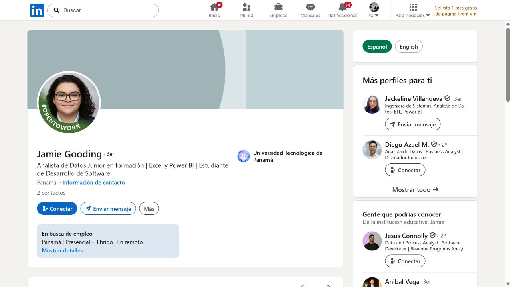

**Por que encaja con Esteban:** este perfil puede servir como contacto cercano porque conecta con el mismo territorio profesional: datos, analitica, automatizacion, BI o IA aplicada. No es un contacto frio generico; hay una razon concreta para conversar desde intereses tecnicos compartidos.

**Valor potencial:** puede aportar referencias sobre herramientas, rutas de aprendizaje, proyectos, oportunidades junior, comunidades tecnicas o formas de convertir analitica en trabajo real. Tambien puede servir como puente hacia empresas o equipos donde ya se aplican estas habilidades.

**Mensaje sugerido para enviar manualmente:**

> Hola Jamie, vi que tambien estas trabajando/creciendo en temas de datos, BI, automatizacion e IA. Soy Esteban, estudio Business Analytics y estoy conectando con personas que esten construyendo en esta area. Me gusto tu enfoque en analista de datos junior en formacion. Seria buenisimo conectar y aprender de lo que estas haciendo.

<strong>3. Wilfredo Cano</strong> ? Software Engineering Student; Data Analytics, Databricks, Python, SQL y AI Enthusiast.

**Link de perfil:** [Abrir perfil de LinkedIn](https://www.linkedin.com/in/wilfredo-cano/)

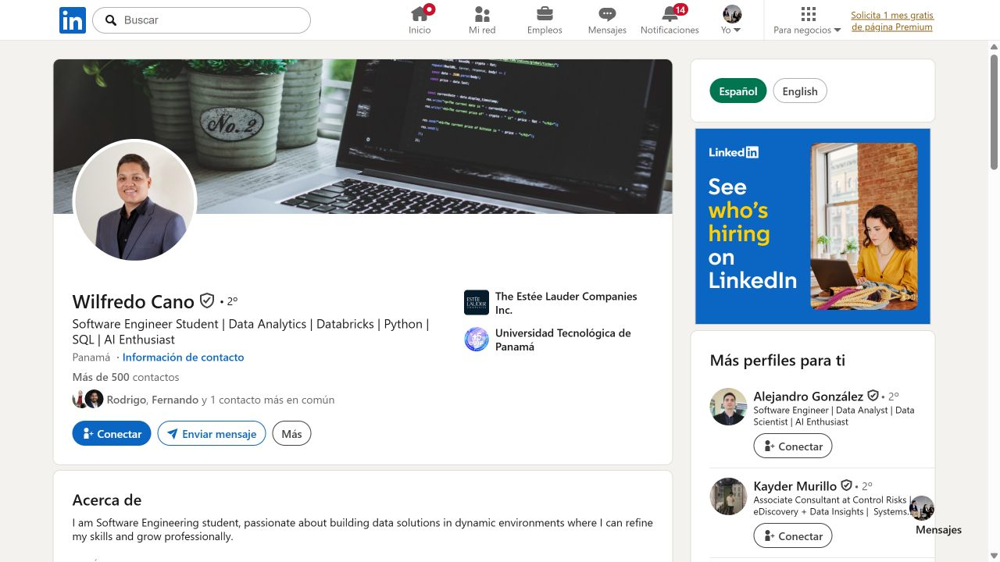

**Por que encaja con Esteban:** este perfil puede servir como contacto cercano porque conecta con el mismo territorio profesional: datos, analitica, automatizacion, BI o IA aplicada. No es un contacto frio generico; hay una razon concreta para conversar desde intereses tecnicos compartidos.

**Valor potencial:** puede aportar referencias sobre herramientas, rutas de aprendizaje, proyectos, oportunidades junior, comunidades tecnicas o formas de convertir analitica en trabajo real. Tambien puede servir como puente hacia empresas o equipos donde ya se aplican estas habilidades.

**Mensaje sugerido para enviar manualmente:**

> Hola Wilfredo, vi que tambien estas trabajando/creciendo en temas de datos, BI, automatizacion e IA. Soy Esteban, estudio Business Analytics y estoy conectando con personas que esten construyendo en esta area. Me gusto tu enfoque en software engineering student. Seria buenisimo conectar y aprender de lo que estas haciendo.

<strong>4. Axel Aleman</strong> ? Analista de datos; Power BI, SQL, Python, R y aspirante a ingeniero de datos junior.

**Link de perfil:** [Abrir perfil de LinkedIn](https://www.linkedin.com/in/axel-aleman-91a26565/)

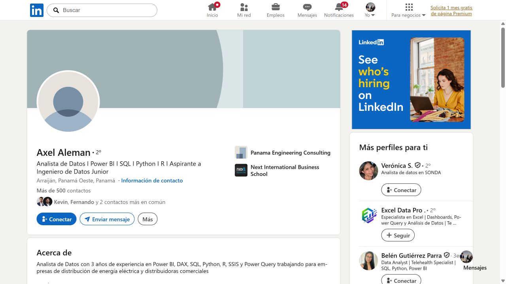

**Por que encaja con Esteban:** este perfil puede servir como contacto cercano porque conecta con el mismo territorio profesional: datos, analitica, automatizacion, BI o IA aplicada. No es un contacto frio generico; hay una razon concreta para conversar desde intereses tecnicos compartidos.

**Valor potencial:** puede aportar referencias sobre herramientas, rutas de aprendizaje, proyectos, oportunidades junior, comunidades tecnicas o formas de convertir analitica en trabajo real. Tambien puede servir como puente hacia empresas o equipos donde ya se aplican estas habilidades.

**Mensaje sugerido para enviar manualmente:**

> Hola Axel, vi que tambien estas trabajando/creciendo en temas de datos, BI, automatizacion e IA. Soy Esteban, estudio Business Analytics y estoy conectando con personas que esten construyendo en esta area. Me gusto tu enfoque en analista de datos. Seria buenisimo conectar y aprender de lo que estas haciendo.

<strong>5. Roberto Millan</strong> ? Estudiante de Informatica; backend, frontend, Python e interes en inteligencia artificial.

**Link de perfil:** [Abrir perfil de LinkedIn](https://www.linkedin.com/in/roberto-mill%C3%A1n-0399a6263/)

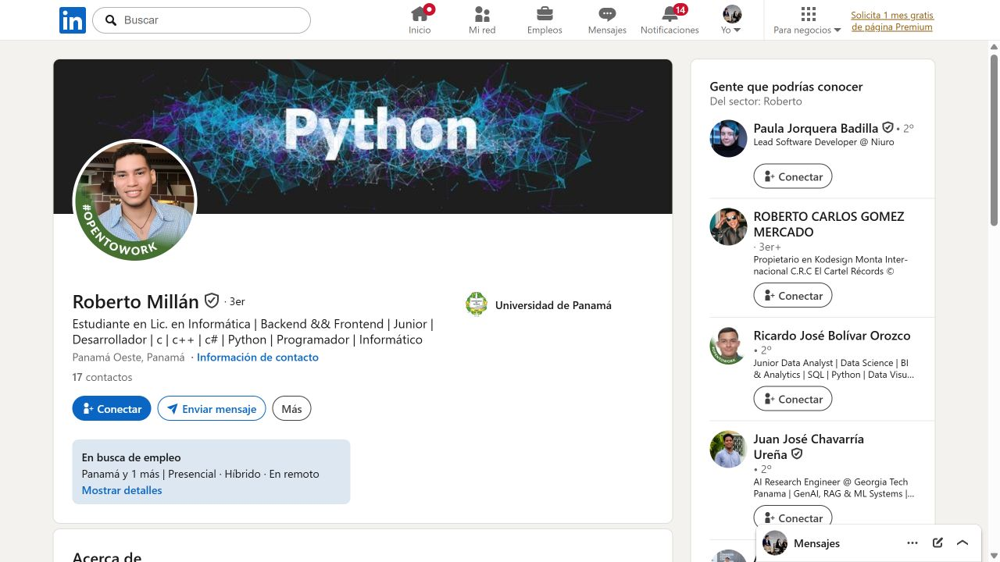

**Por que encaja con Esteban:** este perfil puede servir como contacto cercano porque conecta con el mismo territorio profesional: datos, analitica, automatizacion, BI o IA aplicada. No es un contacto frio generico; hay una razon concreta para conversar desde intereses tecnicos compartidos.

**Valor potencial:** puede aportar referencias sobre herramientas, rutas de aprendizaje, proyectos, oportunidades junior, comunidades tecnicas o formas de convertir analitica en trabajo real. Tambien puede servir como puente hacia empresas o equipos donde ya se aplican estas habilidades.

**Mensaje sugerido para enviar manualmente:**

> Hola Roberto, vi que tambien estas trabajando/creciendo en temas de datos, BI, automatizacion e IA. Soy Esteban, estudio Business Analytics y estoy conectando con personas que esten construyendo en esta area. Me gusto tu enfoque en estudiante de informatica. Seria buenisimo conectar y aprender de lo que estas haciendo.

<strong>6. Luis Alejandro Luis Campos</strong> ? Estudiante de Economia; analisis junior, logistica, finanzas, Excel, Power BI e IA aplicada a negocios.

**Link de perfil:** [Abrir perfil de LinkedIn](https://www.linkedin.com/in/luis-campos-economia/)

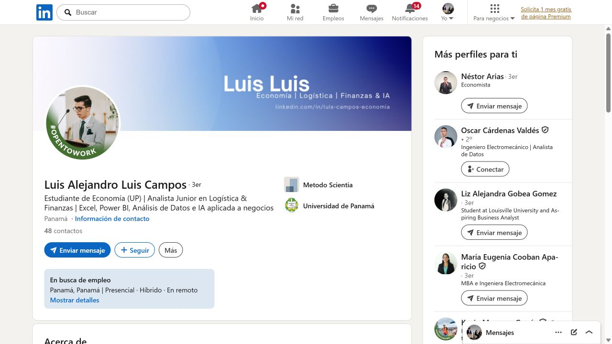

**Por que encaja con Esteban:** este perfil puede servir como contacto cercano porque conecta con el mismo territorio profesional: datos, analitica, automatizacion, BI o IA aplicada. No es un contacto frio generico; hay una razon concreta para conversar desde intereses tecnicos compartidos.

**Valor potencial:** puede aportar referencias sobre herramientas, rutas de aprendizaje, proyectos, oportunidades junior, comunidades tecnicas o formas de convertir analitica en trabajo real. Tambien puede servir como puente hacia empresas o equipos donde ya se aplican estas habilidades.

**Mensaje sugerido para enviar manualmente:**

> Hola Luis, vi que tambien estas trabajando/creciendo en temas de datos, BI, automatizacion e IA. Soy Esteban, estudio Business Analytics y estoy conectando con personas que esten construyendo en esta area. Me gusto tu enfoque en estudiante de economia. Seria buenisimo conectar y aprender de lo que estas haciendo.

<strong>7. Ana Deng</strong> ? Industrial Engineering Student; Data Analyst y Researcher con experiencia de supply chain.

**Link de perfil:** [Abrir perfil de LinkedIn](https://www.linkedin.com/in/ana-deng/es/)

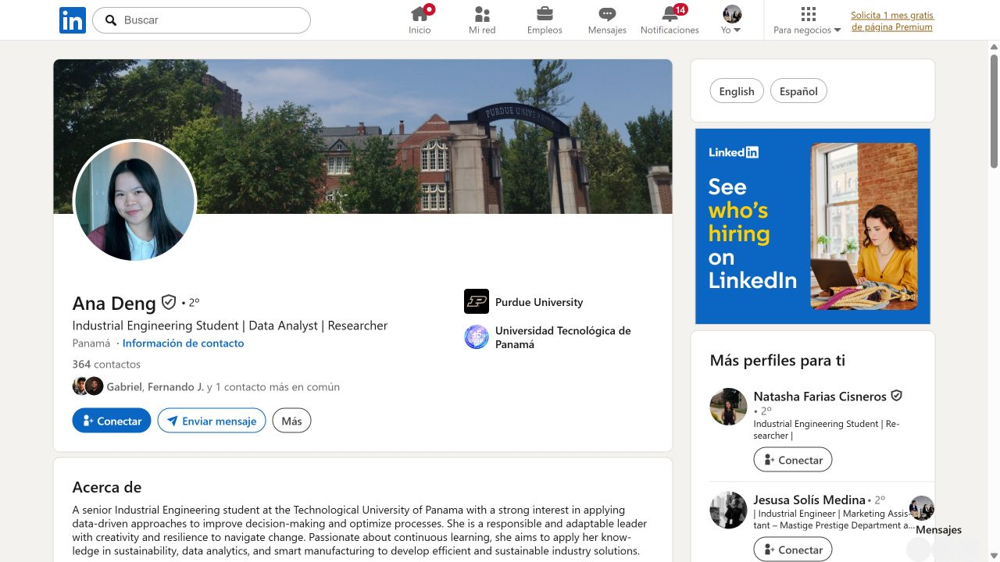

**Por que encaja con Esteban:** este perfil puede servir como contacto cercano porque conecta con el mismo territorio profesional: datos, analitica, automatizacion, BI o IA aplicada. No es un contacto frio generico; hay una razon concreta para conversar desde intereses tecnicos compartidos.

**Valor potencial:** puede aportar referencias sobre herramientas, rutas de aprendizaje, proyectos, oportunidades junior, comunidades tecnicas o formas de convertir analitica en trabajo real. Tambien puede servir como puente hacia empresas o equipos donde ya se aplican estas habilidades.

**Mensaje sugerido para enviar manualmente:**

> Hola Ana, vi que tambien estas trabajando/creciendo en temas de datos, BI, automatizacion e IA. Soy Esteban, estudio Business Analytics y estoy conectando con personas que esten construyendo en esta area. Me gusto tu enfoque en industrial engineering student. Seria buenisimo conectar y aprender de lo que estas haciendo.

<strong>8. Ninoshka Vega</strong> ? Data analytics / data science; Power BI, SQL y Python.

**Link de perfil:** [Abrir perfil de LinkedIn](https://www.linkedin.com/in/ninoshkavega/)

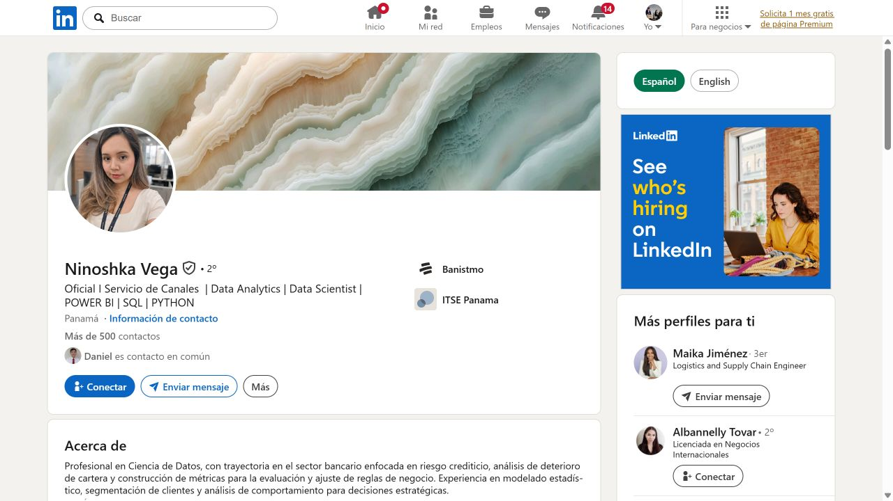

**Por que encaja con Esteban:** este perfil puede servir como contacto cercano porque conecta con el mismo territorio profesional: datos, analitica, automatizacion, BI o IA aplicada. No es un contacto frio generico; hay una razon concreta para conversar desde intereses tecnicos compartidos.

**Valor potencial:** puede aportar referencias sobre herramientas, rutas de aprendizaje, proyectos, oportunidades junior, comunidades tecnicas o formas de convertir analitica en trabajo real. Tambien puede servir como puente hacia empresas o equipos donde ya se aplican estas habilidades.

**Mensaje sugerido para enviar manualmente:**

> Hola Ninoshka, vi que tambien estas trabajando/creciendo en temas de datos, BI, automatizacion e IA. Soy Esteban, estudio Business Analytics y estoy conectando con personas que esten construyendo en esta area. Me gusto tu enfoque en data analytics / data science. Seria buenisimo conectar y aprender de lo que estas haciendo.

<strong>9. Gowri Shankari Sakthivel</strong> ? MBA Student Business Analytics; aspiring data analyst con Power BI, SQL, Excel y Python.

**Link de perfil:** [Abrir perfil de LinkedIn](https://www.linkedin.com/in/gowri-shankari-sakthivel-52142637a/)

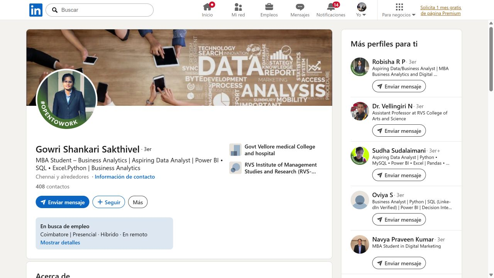

**Por que encaja con Esteban:** este perfil puede servir como contacto cercano porque conecta con el mismo territorio profesional: datos, analitica, automatizacion, BI o IA aplicada. No es un contacto frio generico; hay una razon concreta para conversar desde intereses tecnicos compartidos.

**Valor potencial:** puede aportar referencias sobre herramientas, rutas de aprendizaje, proyectos, oportunidades junior, comunidades tecnicas o formas de convertir analitica en trabajo real. Tambien puede servir como puente hacia empresas o equipos donde ya se aplican estas habilidades.

**Mensaje sugerido para enviar manualmente:**

> Hola Gowri, vi que tambien estas trabajando/creciendo en temas de datos, BI, automatizacion e IA. Soy Esteban, estudio Business Analytics y estoy conectando con personas que esten construyendo en esta area. Me gusto tu enfoque en mba student business analytics. Seria buenisimo conectar y aprender de lo que estas haciendo.

<strong>10. Ricardo Alberto Valencia</strong> ? Analista de datos y calidad de datos; Power BI, SQL, Power Query, Oracle PL/SQL y ETL.

**Link de perfil:** [Abrir perfil de LinkedIn](https://www.linkedin.com/in/ricardo-alberto-valencia/)

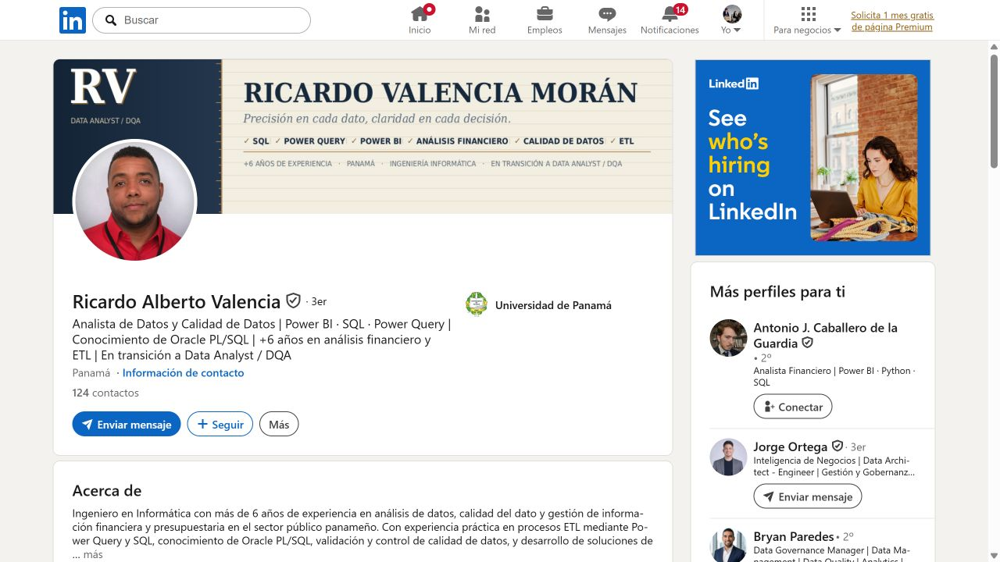

**Por que encaja con Esteban:** este perfil puede servir como contacto cercano porque conecta con el mismo territorio profesional: datos, analitica, automatizacion, BI o IA aplicada. No es un contacto frio generico; hay una razon concreta para conversar desde intereses tecnicos compartidos.

**Valor potencial:** puede aportar referencias sobre herramientas, rutas de aprendizaje, proyectos, oportunidades junior, comunidades tecnicas o formas de convertir analitica en trabajo real. Tambien puede servir como puente hacia empresas o equipos donde ya se aplican estas habilidades.

**Mensaje sugerido para enviar manualmente:**

> Hola Ricardo, vi que tambien estas trabajando/creciendo en temas de datos, BI, automatizacion e IA. Soy Esteban, estudio Business Analytics y estoy conectando con personas que esten construyendo en esta area. Me gusto tu enfoque en analista de datos y calidad de datos. Seria buenisimo conectar y aprender de lo que estas haciendo.

<strong>11. Stephanie Quezada</strong> ? BI & Analytics Specialist; Data Analyst, Data Engineer, Python, Power BI, SQL, Tableau.

**Link de perfil:** [Abrir perfil de LinkedIn](https://www.linkedin.com/in/stephanie-quezada-5a4394178/)

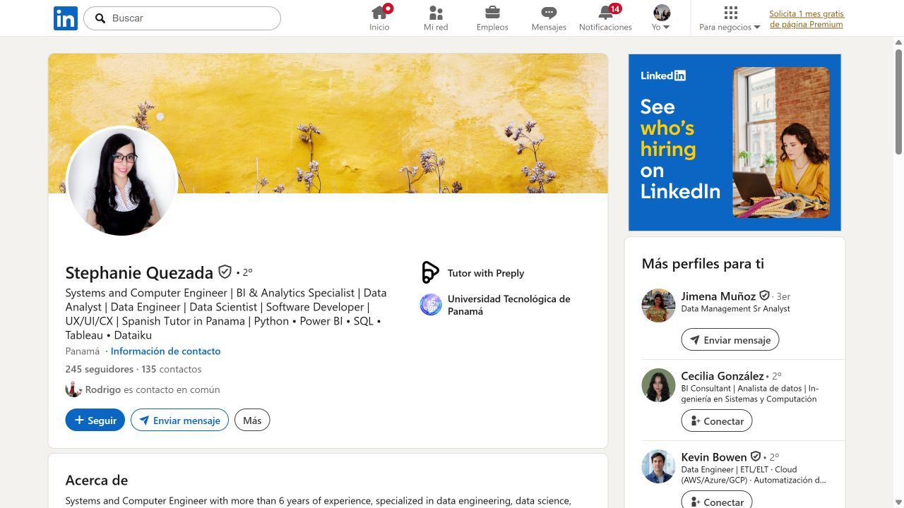

**Por que encaja con Esteban:** este perfil puede servir como contacto cercano porque conecta con el mismo territorio profesional: datos, analitica, automatizacion, BI o IA aplicada. No es un contacto frio generico; hay una razon concreta para conversar desde intereses tecnicos compartidos.

**Valor potencial:** puede aportar referencias sobre herramientas, rutas de aprendizaje, proyectos, oportunidades junior, comunidades tecnicas o formas de convertir analitica en trabajo real. Tambien puede servir como puente hacia empresas o equipos donde ya se aplican estas habilidades.

**Mensaje sugerido para enviar manualmente:**

> Hola Stephanie, vi que tambien estas trabajando/creciendo en temas de datos, BI, automatizacion e IA. Soy Esteban, estudio Business Analytics y estoy conectando con personas que esten construyendo en esta area. Me gusto tu enfoque en bi & analytics specialist. Seria buenisimo conectar y aprender de lo que estas haciendo.

<strong>12. Jairo Herrera</strong> ? Regional Data Analyst; Python, SQL, Power BI, Power Apps, Power Automate, Bizagi y ETL.

**Link de perfil:** [Abrir perfil de LinkedIn](https://www.linkedin.com/in/jairo-herrera-data/)

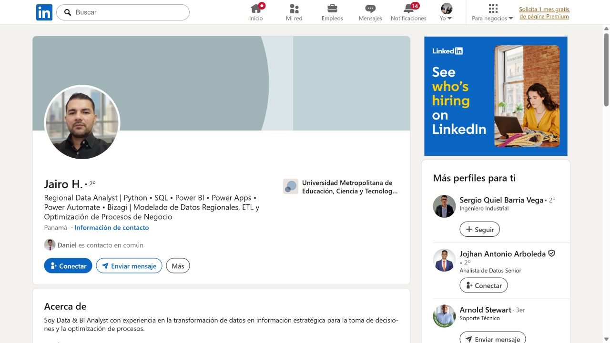

**Por que encaja con Esteban:** este perfil puede servir como contacto cercano porque conecta con el mismo territorio profesional: datos, analitica, automatizacion, BI o IA aplicada. No es un contacto frio generico; hay una razon concreta para conversar desde intereses tecnicos compartidos.

**Valor potencial:** puede aportar referencias sobre herramientas, rutas de aprendizaje, proyectos, oportunidades junior, comunidades tecnicas o formas de convertir analitica en trabajo real. Tambien puede servir como puente hacia empresas o equipos donde ya se aplican estas habilidades.

**Mensaje sugerido para enviar manualmente:**

> Hola Jairo, vi que tambien estas trabajando/creciendo en temas de datos, BI, automatizacion e IA. Soy Esteban, estudio Business Analytics y estoy conectando con personas que esten construyendo en esta area. Me gusto tu enfoque en regional data analyst. Seria buenisimo conectar y aprender de lo que estas haciendo.

<strong>13. Maria Laura Fernandez</strong> ? Data Analyst; process automation, Power Query, SQL, Python, BI y Tableau.

**Link de perfil:** [Abrir perfil de LinkedIn](https://www.linkedin.com/in/maria-laura-fernandez-000877197/)

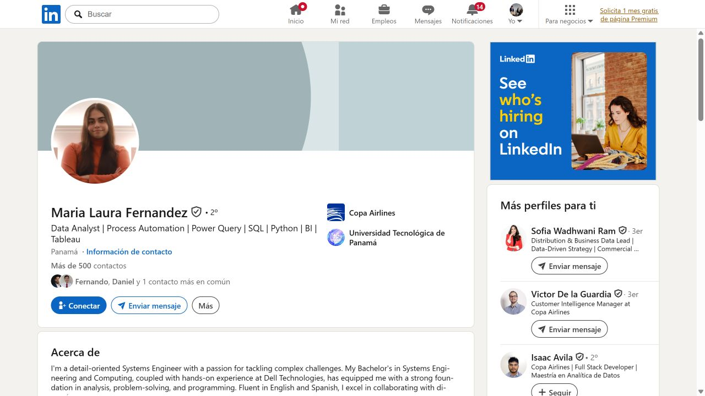

**Por que encaja con Esteban:** este perfil puede servir como contacto cercano porque conecta con el mismo territorio profesional: datos, analitica, automatizacion, BI o IA aplicada. No es un contacto frio generico; hay una razon concreta para conversar desde intereses tecnicos compartidos.

**Valor potencial:** puede aportar referencias sobre herramientas, rutas de aprendizaje, proyectos, oportunidades junior, comunidades tecnicas o formas de convertir analitica en trabajo real. Tambien puede servir como puente hacia empresas o equipos donde ya se aplican estas habilidades.

**Mensaje sugerido para enviar manualmente:**

> Hola Maria, vi que tambien estas trabajando/creciendo en temas de datos, BI, automatizacion e IA. Soy Esteban, estudio Business Analytics y estoy conectando con personas que esten construyendo en esta area. Me gusto tu enfoque en data analyst. Seria buenisimo conectar y aprender de lo que estas haciendo.

<strong>14. Tiago Neves Lopes</strong> ? AI, business leadership, data science, BI, machine learning y estrategia comercial.

**Link de perfil:** [Abrir perfil de LinkedIn](https://www.linkedin.com/in/tiagonlopes/)

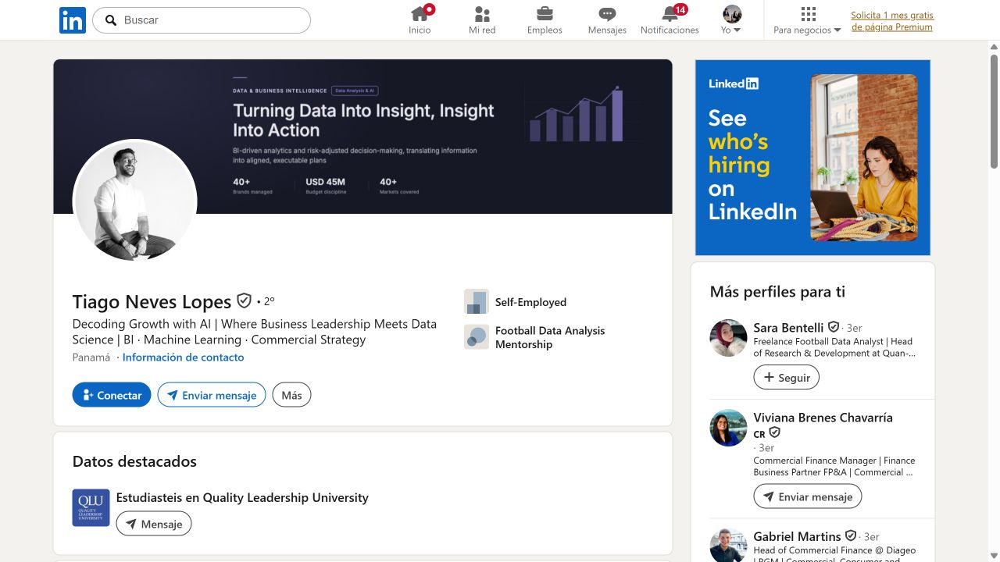

**Por que encaja con Esteban:** este perfil puede servir como contacto cercano porque conecta con el mismo territorio profesional: datos, analitica, automatizacion, BI o IA aplicada. No es un contacto frio generico; hay una razon concreta para conversar desde intereses tecnicos compartidos.

**Valor potencial:** puede aportar referencias sobre herramientas, rutas de aprendizaje, proyectos, oportunidades junior, comunidades tecnicas o formas de convertir analitica en trabajo real. Tambien puede servir como puente hacia empresas o equipos donde ya se aplican estas habilidades.

**Mensaje sugerido para enviar manualmente:**

> Hola Tiago, vi que tambien estas trabajando/creciendo en temas de datos, BI, automatizacion e IA. Soy Esteban, estudio Business Analytics y estoy conectando con personas que esten construyendo en esta area. Me gusto tu enfoque en ai, business leadership, data science, bi, machine learning y estrategia comercial.. Seria buenisimo conectar y aprender de lo que estas haciendo.

<strong>15. Jurgen Maldonado</strong> ? Business Intelligence, Data Analytics, Power Platform, SQL, MSBI, Python y cloud.

**Link de perfil:** [Abrir perfil de LinkedIn](https://www.linkedin.com/in/jurgenmaldonado/)

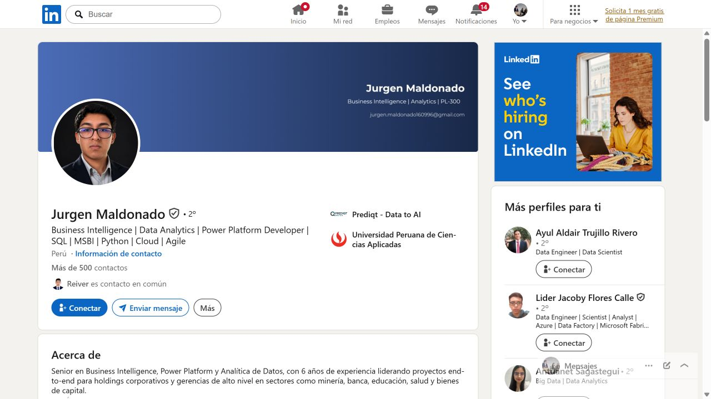

**Por que encaja con Esteban:** este perfil puede servir como contacto cercano porque conecta con el mismo territorio profesional: datos, analitica, automatizacion, BI o IA aplicada. No es un contacto frio generico; hay una razon concreta para conversar desde intereses tecnicos compartidos.

**Valor potencial:** puede aportar referencias sobre herramientas, rutas de aprendizaje, proyectos, oportunidades junior, comunidades tecnicas o formas de convertir analitica en trabajo real. Tambien puede servir como puente hacia empresas o equipos donde ya se aplican estas habilidades.

**Mensaje sugerido para enviar manualmente:**

> Hola Jurgen, vi que tambien estas trabajando/creciendo en temas de datos, BI, automatizacion e IA. Soy Esteban, estudio Business Analytics y estoy conectando con personas que esten construyendo en esta area. Me gusto tu enfoque en business intelligence, data analytics, power platform, sql, msbi, python y cloud.. Seria buenisimo conectar y aprender de lo que estas haciendo.

<strong>16. Fernando Cutire</strong> - SQL, datos y analitica

**Link de perfil:** [Abrir perfil de LinkedIn](https://www.linkedin.com/in/fernandocutire/)

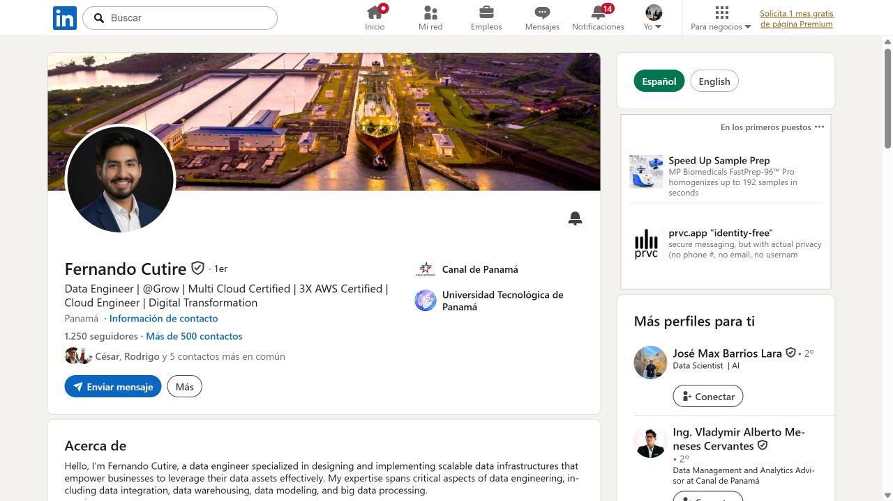

**Senal visible:** Wilfredo Cano • 2º Software Engineer Student | Data Analytics | Databricks | Python | SQL | AI Enthusiast Panamá, Panamá, Panamá Conectar Actual: Data Analytics Engineer en The Estée Lauder Companies Inc. Daniel Wen Lay, Fernando Cutire y 1 contacto más en com

**Por que encaja con Esteban:** este perfil amplia la red hacia personas que hablan el mismo lenguaje tecnico: datos, BI, SQL, Python, automatizacion, analitica o IA. Sirve para crear una conversacion natural, no forzada, desde aprendizaje y proyectos reales.

**Valor potencial:** puede abrir rutas de aprendizaje, referencias de herramientas, oportunidades junior, colaboraciones academicas/profesionales o conexiones con equipos que ya usan datos e IA en procesos reales.

**Mensaje sugerido para enviar manualmente:**

> Hola Fernando, vi tu perfil y me llamo la atencion tu enfoque en sql, datos y analitica. Soy Esteban, estudio Business Analytics y estoy conectando con personas que tambien esten creciendo en datos, BI, automatizacion e IA. Me gustaria conectar y aprender mas de lo que estas construyendo.

<strong>17. Kevin González</strong> - Power BI, datos y analitica aplicada

**Link de perfil:** [Abrir perfil de LinkedIn](https://www.linkedin.com/in/bussines-intelligence-finanzas-planner-controller-dataanalyst-kevingonzalez/)

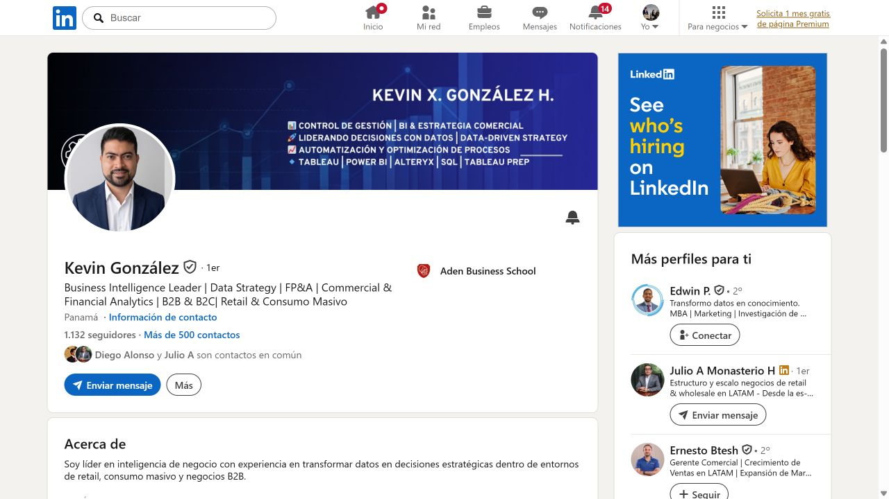

**Senal visible:** Axel Aleman • 2º Analista de Datos I Power BI I SQL I Python I R I Aspirante a Ingeniero de Datos Junior Arraiján, Panamá Oeste, Panamá Conectar Actual: Analista de Datos en Panama Engineering Consulting Kevin González, Daniel Wen Lay y 2 contactos más en comú

**Por que encaja con Esteban:** este perfil amplia la red hacia personas que hablan el mismo lenguaje tecnico: datos, BI, SQL, Python, automatizacion, analitica o IA. Sirve para crear una conversacion natural, no forzada, desde aprendizaje y proyectos reales.

**Valor potencial:** puede abrir rutas de aprendizaje, referencias de herramientas, oportunidades junior, colaboraciones academicas/profesionales o conexiones con equipos que ya usan datos e IA en procesos reales.

**Mensaje sugerido para enviar manualmente:**

> Hola Kevin, vi tu perfil y me llamo la atencion tu enfoque en power bi, datos y analitica aplicada. Soy Esteban, estudio Business Analytics y estoy conectando con personas que tambien esten creciendo en datos, BI, automatizacion e IA. Me gustaria conectar y aprender mas de lo que estas construyendo.

<strong>18. Jason Sepulveda</strong> - Power BI, datos y analitica aplicada

**Link de perfil:** [Abrir perfil de LinkedIn](https://www.linkedin.com/in/jasonsepulvedas/)

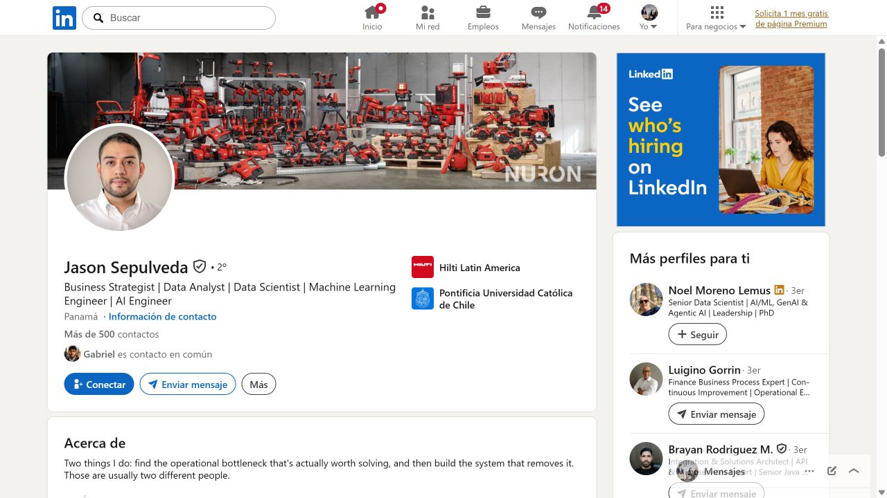

**Senal visible:** Jason Sepulveda • 2º Business Strategist | Data Analyst | Data Scientist | Machine Learning Engineer | AI Engineer Panamá, Panamá, Panamá Conectar Actual: Regional CX O2P PM | Digital Strategy & GenAI Lead en Hilti Latin America - …Python and SQL ETL pipeline 

**Por que encaja con Esteban:** este perfil amplia la red hacia personas que hablan el mismo lenguaje tecnico: datos, BI, SQL, Python, automatizacion, analitica o IA. Sirve para crear una conversacion natural, no forzada, desde aprendizaje y proyectos reales.

**Valor potencial:** puede abrir rutas de aprendizaje, referencias de herramientas, oportunidades junior, colaboraciones academicas/profesionales o conexiones con equipos que ya usan datos e IA en procesos reales.

**Mensaje sugerido para enviar manualmente:**

> Hola Jason, vi tu perfil y me llamo la atencion tu enfoque en power bi, datos y analitica aplicada. Soy Esteban, estudio Business Analytics y estoy conectando con personas que tambien esten creciendo en datos, BI, automatizacion e IA. Me gustaria conectar y aprender mas de lo que estas construyendo.

<strong>19. Gabriel Caballero</strong> - Power BI, datos y analitica aplicada

**Link de perfil:** [Abrir perfil de LinkedIn](https://www.linkedin.com/in/gabriel-caballero-1036b5301/)

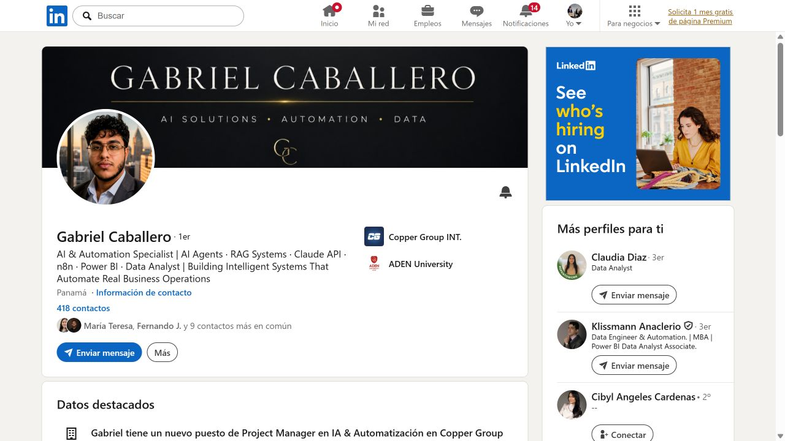

**Senal visible:** Jason Sepulveda • 2º Business Strategist | Data Analyst | Data Scientist | Machine Learning Engineer | AI Engineer Panamá, Panamá, Panamá Conectar Actual: Regional CX O2P PM | Digital Strategy & GenAI Lead en Hilti Latin America - …Python and SQL ETL pipeline 

**Por que encaja con Esteban:** este perfil amplia la red hacia personas que hablan el mismo lenguaje tecnico: datos, BI, SQL, Python, automatizacion, analitica o IA. Sirve para crear una conversacion natural, no forzada, desde aprendizaje y proyectos reales.

**Valor potencial:** puede abrir rutas de aprendizaje, referencias de herramientas, oportunidades junior, colaboraciones academicas/profesionales o conexiones con equipos que ya usan datos e IA en procesos reales.

**Mensaje sugerido para enviar manualmente:**

> Hola Gabriel, vi tu perfil y me llamo la atencion tu enfoque en power bi, datos y analitica aplicada. Soy Esteban, estudio Business Analytics y estoy conectando con personas que tambien esten creciendo en datos, BI, automatizacion e IA. Me gustaria conectar y aprender mas de lo que estas construyendo.

<strong>20. Giuliano Cucina</strong> - SQL, datos y analitica

**Link de perfil:** [Abrir perfil de LinkedIn](https://www.linkedin.com/in/giulianocucina/)

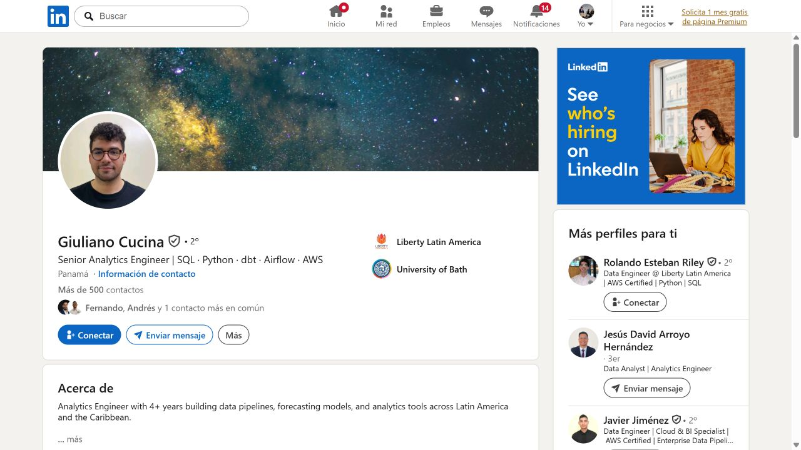

**Senal visible:** Giuliano Cucina • 2º Senior Analytics Engineer | SQL · Python · dbt · Airflow · AWS Panamá, Panamá, Panamá Conectar Anterior: Data Analyst en KIBOU Pharma Daniel Wen Lay, Fernando Cutire y 1 contacto más en común

**Por que encaja con Esteban:** este perfil amplia la red hacia personas que hablan el mismo lenguaje tecnico: datos, BI, SQL, Python, automatizacion, analitica o IA. Sirve para crear una conversacion natural, no forzada, desde aprendizaje y proyectos reales.

**Valor potencial:** puede abrir rutas de aprendizaje, referencias de herramientas, oportunidades junior, colaboraciones academicas/profesionales o conexiones con equipos que ya usan datos e IA en procesos reales.

**Mensaje sugerido para enviar manualmente:**

> Hola Giuliano, vi tu perfil y me llamo la atencion tu enfoque en sql, datos y analitica. Soy Esteban, estudio Business Analytics y estoy conectando con personas que tambien esten creciendo en datos, BI, automatizacion e IA. Me gustaria conectar y aprender mas de lo que estas construyendo.

<strong>21. Isaacs Eliecer Hurtado Cerceño</strong> - Python, datos y automatizacion

**Link de perfil:** [Abrir perfil de LinkedIn](https://www.linkedin.com/in/isaacs-hurtado/)

**Senal visible:** Isaacs Eliecer Hurtado Cerceño • 2º 📈 Data Analyst - Autoridad del Canal de Panamá - Data Science & Business Intelligence | Proficient in Alteryx, Python, Tableau , Dataiku | ETL Pipeline Development | Dagster Panamá, Panamá Conectar Actual: Data Analyst en C

**Por que encaja con Esteban:** este perfil amplia la red hacia personas que hablan el mismo lenguaje tecnico: datos, BI, SQL, Python, automatizacion, analitica o IA. Sirve para crear una conversacion natural, no forzada, desde aprendizaje y proyectos reales.

**Valor potencial:** puede abrir rutas de aprendizaje, referencias de herramientas, oportunidades junior, colaboraciones academicas/profesionales o conexiones con equipos que ya usan datos e IA en procesos reales.

**Mensaje sugerido para enviar manualmente:**

> Hola Isaacs, vi tu perfil y me llamo la atencion tu enfoque en python, datos y automatizacion. Soy Esteban, estudio Business Analytics y estoy conectando con personas que tambien esten creciendo en datos, BI, automatizacion e IA. Me gustaria conectar y aprender mas de lo que estas construyendo.

<strong>22. Fernando J. Robinson Biendicho</strong> - estudiante con enfoque en datos/tecnologia

**Link de perfil:** [Abrir perfil de LinkedIn](https://www.linkedin.com/in/fernandojrobinsonbiendicho/)

**Senal visible:** Ana Deng • 2º Industrial Engineering Student | Data Analyst | Researcher Panamá, Panamá, Panamá Conectar Anterior: Supply Chain Analyst en Georgia Tech Panama Logistics Innovation & Research Center Daniel Wen Lay, Fernando J. Robinson Biendicho y 1 contacto má

**Por que encaja con Esteban:** este perfil amplia la red hacia personas que hablan el mismo lenguaje tecnico: datos, BI, SQL, Python, automatizacion, analitica o IA. Sirve para crear una conversacion natural, no forzada, desde aprendizaje y proyectos reales.

**Valor potencial:** puede abrir rutas de aprendizaje, referencias de herramientas, oportunidades junior, colaboraciones academicas/profesionales o conexiones con equipos que ya usan datos e IA en procesos reales.

**Mensaje sugerido para enviar manualmente:**

> Hola Fernando, vi tu perfil y me llamo la atencion tu enfoque en estudiante con enfoque en datos/tecnologia. Soy Esteban, estudio Business Analytics y estoy conectando con personas que tambien esten creciendo en datos, BI, automatizacion e IA. Me gustaria conectar y aprender mas de lo que estas construyendo.

<strong>23. Alberto Mc Namee • 2º</strong> - Power BI, datos y analitica aplicada

**Link de perfil:** [Abrir perfil de LinkedIn](https://www.linkedin.com/in/albertomcn/)

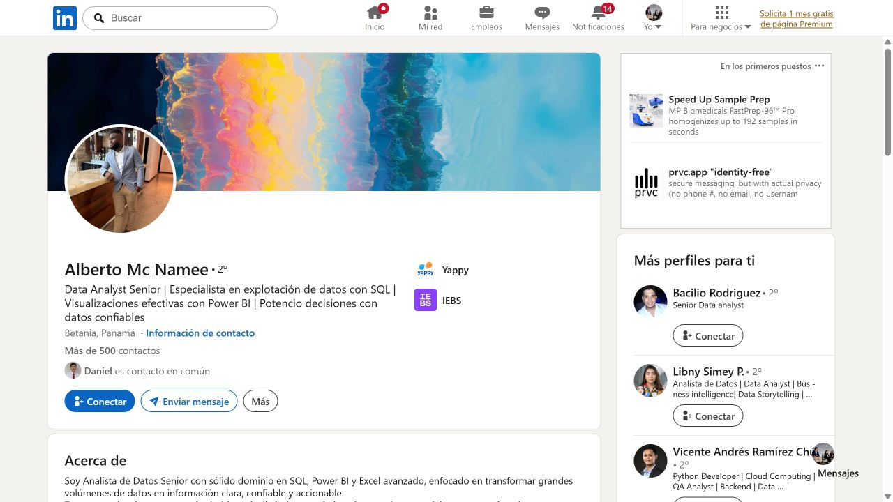

**Senal visible:** Alberto Mc Namee • 2º Data Analyst Senior | Especialista en explotación de datos con SQL | Visualizaciones efectivas con Power BI | Potencio decisiones con datos confiables Betania, Panamá, Panamá Conectar Anterior: Senior Data Analyst en Yappy - Especialista 

**Por que encaja con Esteban:** este perfil amplia la red hacia personas que hablan el mismo lenguaje tecnico: datos, BI, SQL, Python, automatizacion, analitica o IA. Sirve para crear una conversacion natural, no forzada, desde aprendizaje y proyectos reales.

**Valor potencial:** puede abrir rutas de aprendizaje, referencias de herramientas, oportunidades junior, colaboraciones academicas/profesionales o conexiones con equipos que ya usan datos e IA en procesos reales.

**Mensaje sugerido para enviar manualmente:**

> Hola Alberto, vi tu perfil y me llamo la atencion tu enfoque en power bi, datos y analitica aplicada. Soy Esteban, estudio Business Analytics y estoy conectando con personas que tambien esten creciendo en datos, BI, automatizacion e IA. Me gustaria conectar y aprender mas de lo que estas construyendo.

<strong>24. Nicolas F.</strong> - SQL, datos y analitica

**Link de perfil:** [Abrir perfil de LinkedIn](https://www.linkedin.com/in/nicolas-f-368500182/)

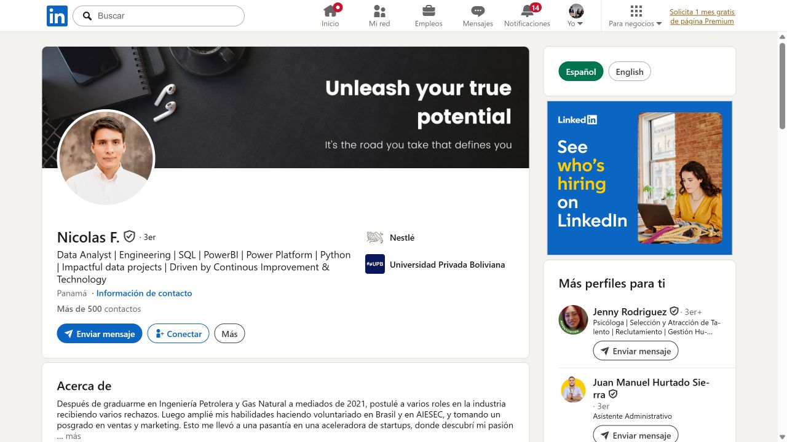

**Senal visible:** Nicolas F. • 3er+ Data Analyst | Engineering | SQL | PowerBI | Power Platform | Python | Impactful data projects | Driven by Continous Improvement & Technology Panamá, Panamá, Panamá Enviar mensaje Anterior: Digital Finance Analyst en Nestlé

**Por que encaja con Esteban:** este perfil amplia la red hacia personas que hablan el mismo lenguaje tecnico: datos, BI, SQL, Python, automatizacion, analitica o IA. Sirve para crear una conversacion natural, no forzada, desde aprendizaje y proyectos reales.

**Valor potencial:** puede abrir rutas de aprendizaje, referencias de herramientas, oportunidades junior, colaboraciones academicas/profesionales o conexiones con equipos que ya usan datos e IA en procesos reales.

**Mensaje sugerido para enviar manualmente:**

> Hola Nicolas, vi tu perfil y me llamo la atencion tu enfoque en sql, datos y analitica. Soy Esteban, estudio Business Analytics y estoy conectando con personas que tambien esten creciendo en datos, BI, automatizacion e IA. Me gustaria conectar y aprender mas de lo que estas construyendo.

<strong>25. Reiver Lopez</strong> - SQL, datos y analitica

**Link de perfil:** [Abrir perfil de LinkedIn](https://www.linkedin.com/in/reiverlopez/)

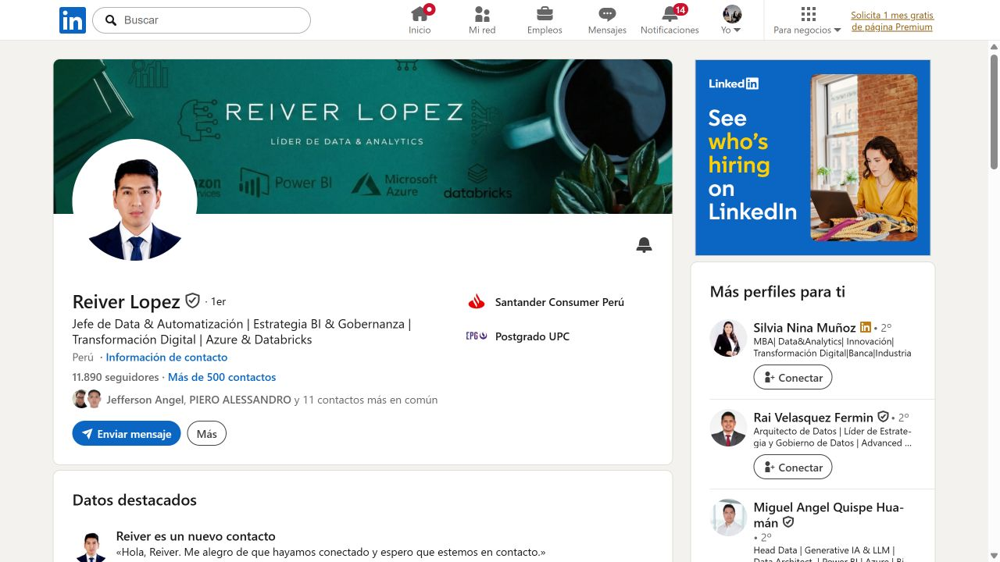

**Senal visible:** Jurgen Maldonado • 2º Business Intelligence | Data Analytics | Power Platform Developer | SQL | MSBI | Python | Cloud | Agile Perú Conectar Actual: BI Specialist en Prediqt - Data to AI Reiver Lopez es contacto en común

**Por que encaja con Esteban:** este perfil amplia la red hacia personas que hablan el mismo lenguaje tecnico: datos, BI, SQL, Python, automatizacion, analitica o IA. Sirve para crear una conversacion natural, no forzada, desde aprendizaje y proyectos reales.

**Valor potencial:** puede abrir rutas de aprendizaje, referencias de herramientas, oportunidades junior, colaboraciones academicas/profesionales o conexiones con equipos que ya usan datos e IA en procesos reales.

**Mensaje sugerido para enviar manualmente:**

> Hola Reiver, vi tu perfil y me llamo la atencion tu enfoque en sql, datos y analitica. Soy Esteban, estudio Business Analytics y estoy conectando con personas que tambien esten creciendo en datos, BI, automatizacion e IA. Me gustaria conectar y aprender mas de lo que estas construyendo.

<strong>26. Marcelo Fabián López Castro</strong> - Power BI, datos y analitica aplicada

**Link de perfil:** [Abrir perfil de LinkedIn](https://www.linkedin.com/in/marceloflopez/es/)

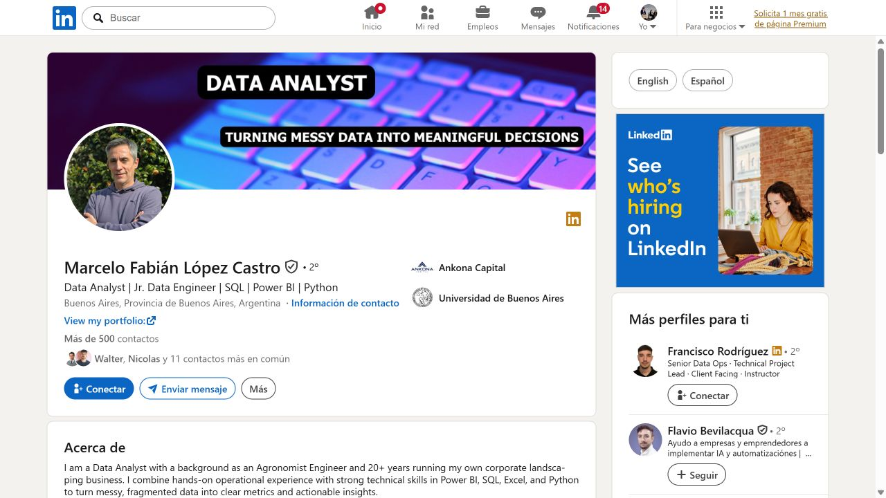

**Senal visible:** Marcelo Fabián López Castro • 2º Data Analyst | Jr. Data Engineer | SQL | Power BI | Python Buenos Aires, Provincia de Buenos Aires, Argentina Conectar Actual: Data Analyst en Ideas en Verde - …%. I transformed manual spreadsheets into automated Power BI… Alej

**Por que encaja con Esteban:** este perfil amplia la red hacia personas que hablan el mismo lenguaje tecnico: datos, BI, SQL, Python, automatizacion, analitica o IA. Sirve para crear una conversacion natural, no forzada, desde aprendizaje y proyectos reales.

**Valor potencial:** puede abrir rutas de aprendizaje, referencias de herramientas, oportunidades junior, colaboraciones academicas/profesionales o conexiones con equipos que ya usan datos e IA en procesos reales.

**Mensaje sugerido para enviar manualmente:**

> Hola Marcelo, vi tu perfil y me llamo la atencion tu enfoque en power bi, datos y analitica aplicada. Soy Esteban, estudio Business Analytics y estoy conectando con personas que tambien esten creciendo en datos, BI, automatizacion e IA. Me gustaria conectar y aprender mas de lo que estas construyendo.

<strong>27. Alejandro N. Herrera Soria</strong> - Power BI, datos y analitica aplicada

**Link de perfil:** [Abrir perfil de LinkedIn](https://www.linkedin.com/in/alejandro-nelson-herrera-soria/)

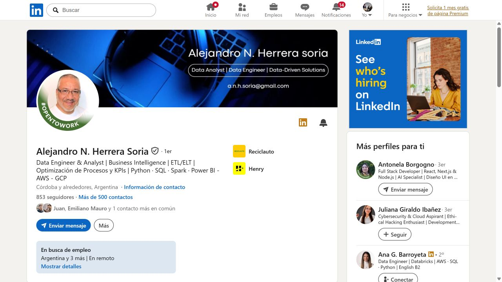

**Senal visible:** Marcelo Fabián López Castro • 2º Data Analyst | Jr. Data Engineer | SQL | Power BI | Python Buenos Aires, Provincia de Buenos Aires, Argentina Conectar Actual: Data Analyst en Ideas en Verde - …%. I transformed manual spreadsheets into automated Power BI… Alej

**Por que encaja con Esteban:** este perfil amplia la red hacia personas que hablan el mismo lenguaje tecnico: datos, BI, SQL, Python, automatizacion, analitica o IA. Sirve para crear una conversacion natural, no forzada, desde aprendizaje y proyectos reales.

**Valor potencial:** puede abrir rutas de aprendizaje, referencias de herramientas, oportunidades junior, colaboraciones academicas/profesionales o conexiones con equipos que ya usan datos e IA en procesos reales.

**Mensaje sugerido para enviar manualmente:**

> Hola Alejandro, vi tu perfil y me llamo la atencion tu enfoque en power bi, datos y analitica aplicada. Soy Esteban, estudio Business Analytics y estoy conectando con personas que tambien esten creciendo en datos, BI, automatizacion e IA. Me gustaria conectar y aprender mas de lo que estas construyendo.

<strong>28. Daniel Wen Lay</strong> - Power BI, datos y analitica aplicada

**Link de perfil:** [Abrir perfil de LinkedIn](https://www.linkedin.com/in/daniel-wen-lay/)

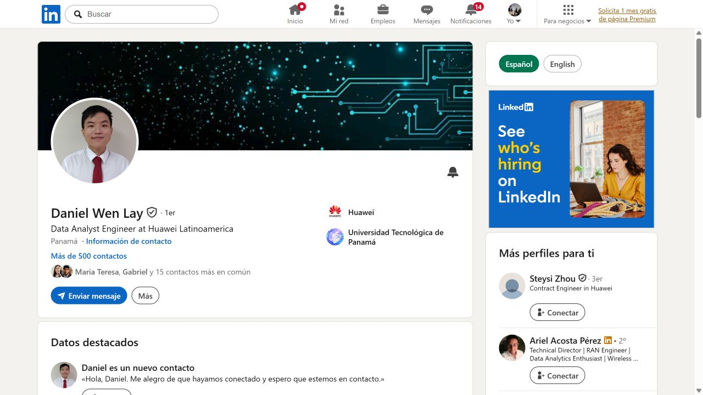

**Senal visible:** Ninoshka Vega • 2º Oficial I Servicio de Canales | Data Analytics | Data Scientist | POWER BI | SQL | PYTHON Panamá, Panamá Conectar Actual: Oficial I Operaciones (Servicios de Canales) en Banistmo - …en Power BI para monitoreo y toma de decisiones… Daniel Wen

**Por que encaja con Esteban:** este perfil amplia la red hacia personas que hablan el mismo lenguaje tecnico: datos, BI, SQL, Python, automatizacion, analitica o IA. Sirve para crear una conversacion natural, no forzada, desde aprendizaje y proyectos reales.

**Valor potencial:** puede abrir rutas de aprendizaje, referencias de herramientas, oportunidades junior, colaboraciones academicas/profesionales o conexiones con equipos que ya usan datos e IA en procesos reales.

**Mensaje sugerido para enviar manualmente:**

> Hola Daniel, vi tu perfil y me llamo la atencion tu enfoque en power bi, datos y analitica aplicada. Soy Esteban, estudio Business Analytics y estoy conectando con personas que tambien esten creciendo en datos, BI, automatizacion e IA. Me gustaria conectar y aprender mas de lo que estas construyendo.

<strong>29. Silvia Garcia Mayorca</strong> - Power BI, datos y analitica aplicada

**Link de perfil:** [Abrir perfil de LinkedIn](https://www.linkedin.com/in/silvia-garcia-mayorca/)

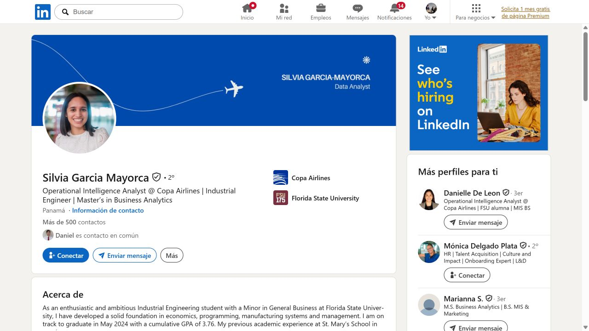

**Senal visible:** Silvia Garcia Mayorca • 2º Operational Intelligence Analyst @ Copa Airlines | Industrial Engineer | Master’s in Business Analytics Panamá, Panamá, Panamá Conectar Certificaciones: Power BI Essential Training Daniel Wen Lay es contacto en común

**Por que encaja con Esteban:** este perfil amplia la red hacia personas que hablan el mismo lenguaje tecnico: datos, BI, SQL, Python, automatizacion, analitica o IA. Sirve para crear una conversacion natural, no forzada, desde aprendizaje y proyectos reales.

**Valor potencial:** puede abrir rutas de aprendizaje, referencias de herramientas, oportunidades junior, colaboraciones academicas/profesionales o conexiones con equipos que ya usan datos e IA en procesos reales.

**Mensaje sugerido para enviar manualmente:**

> Hola Silvia, vi tu perfil y me llamo la atencion tu enfoque en power bi, datos y analitica aplicada. Soy Esteban, estudio Business Analytics y estoy conectando con personas que tambien esten creciendo en datos, BI, automatizacion e IA. Me gustaria conectar y aprender mas de lo que estas construyendo.

<strong>30. Sergio Gonzalez Guzmán</strong> - Power BI, datos y analitica aplicada

**Link de perfil:** [Abrir perfil de LinkedIn](https://www.linkedin.com/in/sergio-gonzalez-guzm%C3%A1n-07bb91167/)

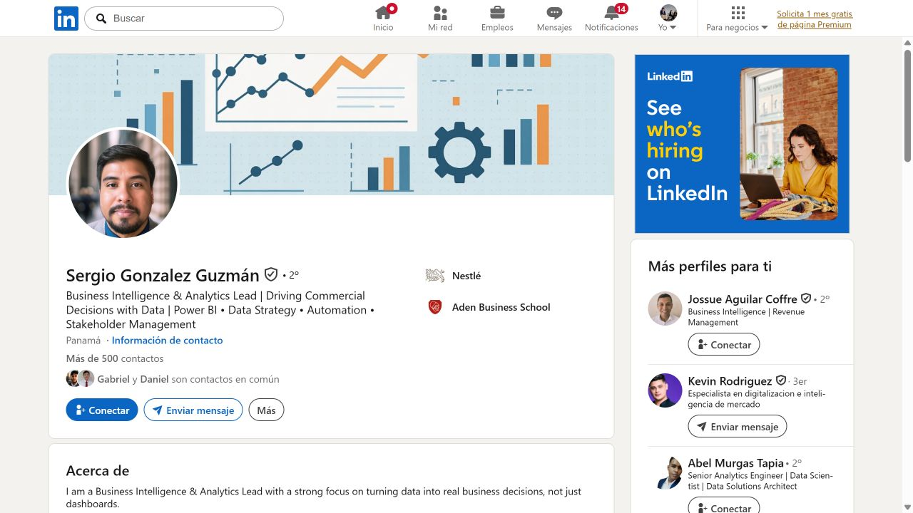

**Senal visible:** Sergio Gonzalez Guzmán • 2º Business Intelligence & Analytics Lead | Driving Commercial Decisions with Data | Power BI • Data Strategy • Automation • Stakeholder Management Panamá, Panamá, Panamá Conectar Actual: Business Intelligence Specialist en Nestlé Dani

**Por que encaja con Esteban:** este perfil amplia la red hacia personas que hablan el mismo lenguaje tecnico: datos, BI, SQL, Python, automatizacion, analitica o IA. Sirve para crear una conversacion natural, no forzada, desde aprendizaje y proyectos reales.

**Valor potencial:** puede abrir rutas de aprendizaje, referencias de herramientas, oportunidades junior, colaboraciones academicas/profesionales o conexiones con equipos que ya usan datos e IA en procesos reales.

**Mensaje sugerido para enviar manualmente:**

> Hola Sergio, vi tu perfil y me llamo la atencion tu enfoque en power bi, datos y analitica aplicada. Soy Esteban, estudio Business Analytics y estoy conectando con personas que tambien esten creciendo en datos, BI, automatizacion e IA. Me gustaria conectar y aprender mas de lo que estas construyendo.

<strong>31. Kenneth H. Zhong C.</strong> - estudiante con enfoque en datos/tecnologia

**Link de perfil:** [Abrir perfil de LinkedIn](https://www.linkedin.com/in/kennethhzhong/)

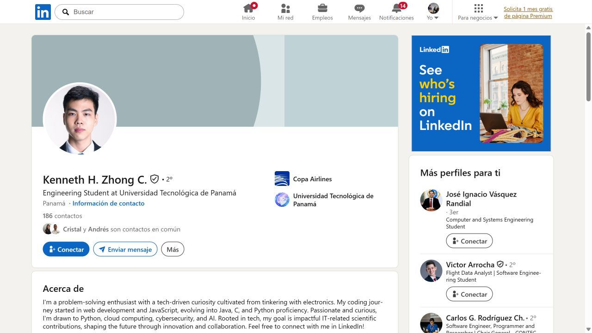

**Senal visible:** Kenneth H. Zhong C. • 2º Engineering Student at Universidad Tecnológica de Panamá Panamá, Panamá, Panamá Conectar Anterior: Business Continuity | Analytics Engineer Intern en Copa Airlines Andrés Villarreal y Cristal Liu son contactos en común

**Por que encaja con Esteban:** este perfil amplia la red hacia personas que hablan el mismo lenguaje tecnico: datos, BI, SQL, Python, automatizacion, analitica o IA. Sirve para crear una conversacion natural, no forzada, desde aprendizaje y proyectos reales.

**Valor potencial:** puede abrir rutas de aprendizaje, referencias de herramientas, oportunidades junior, colaboraciones academicas/profesionales o conexiones con equipos que ya usan datos e IA en procesos reales.

**Mensaje sugerido para enviar manualmente:**

> Hola Kenneth, vi tu perfil y me llamo la atencion tu enfoque en estudiante con enfoque en datos/tecnologia. Soy Esteban, estudio Business Analytics y estoy conectando con personas que tambien esten creciendo en datos, BI, automatizacion e IA. Me gustaria conectar y aprender mas de lo que estas construyendo.

<strong>32. Andrés Villarreal</strong> - estudiante con enfoque en datos/tecnologia

**Link de perfil:** [Abrir perfil de LinkedIn](https://www.linkedin.com/in/andr%C3%A9s-villarreal-7205b2263/)

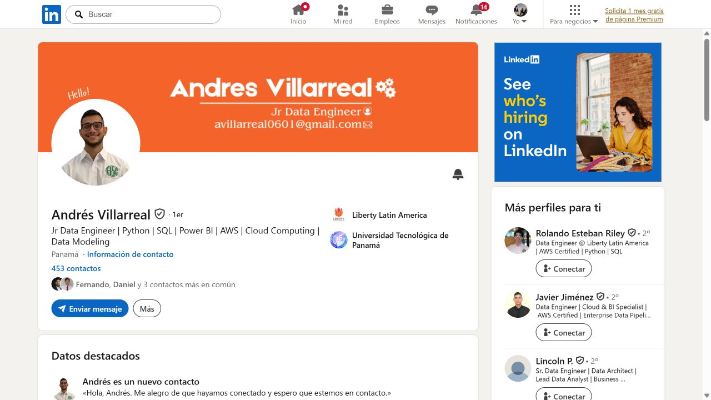

**Senal visible:** Kenneth H. Zhong C. • 2º Engineering Student at Universidad Tecnológica de Panamá Panamá, Panamá, Panamá Conectar Anterior: Business Continuity | Analytics Engineer Intern en Copa Airlines Andrés Villarreal y Cristal Liu son contactos en común

**Por que encaja con Esteban:** este perfil amplia la red hacia personas que hablan el mismo lenguaje tecnico: datos, BI, SQL, Python, automatizacion, analitica o IA. Sirve para crear una conversacion natural, no forzada, desde aprendizaje y proyectos reales.

**Valor potencial:** puede abrir rutas de aprendizaje, referencias de herramientas, oportunidades junior, colaboraciones academicas/profesionales o conexiones con equipos que ya usan datos e IA en procesos reales.

**Mensaje sugerido para enviar manualmente:**

> Hola Andrés, vi tu perfil y me llamo la atencion tu enfoque en estudiante con enfoque en datos/tecnologia. Soy Esteban, estudio Business Analytics y estoy conectando con personas que tambien esten creciendo en datos, BI, automatizacion e IA. Me gustaria conectar y aprender mas de lo que estas construyendo.

<strong>33. Cristal Liu</strong> - estudiante con enfoque en datos/tecnologia

**Link de perfil:** [Abrir perfil de LinkedIn](https://www.linkedin.com/in/liucristal/)

**Senal visible:** Kenneth H. Zhong C. • 2º Engineering Student at Universidad Tecnológica de Panamá Panamá, Panamá, Panamá Conectar Anterior: Business Continuity | Analytics Engineer Intern en Copa Airlines Andrés Villarreal y Cristal Liu son contactos en común

**Por que encaja con Esteban:** este perfil amplia la red hacia personas que hablan el mismo lenguaje tecnico: datos, BI, SQL, Python, automatizacion, analitica o IA. Sirve para crear una conversacion natural, no forzada, desde aprendizaje y proyectos reales.

**Valor potencial:** puede abrir rutas de aprendizaje, referencias de herramientas, oportunidades junior, colaboraciones academicas/profesionales o conexiones con equipos que ya usan datos e IA en procesos reales.

**Mensaje sugerido para enviar manualmente:**

> Hola Cristal, vi tu perfil y me llamo la atencion tu enfoque en estudiante con enfoque en datos/tecnologia. Soy Esteban, estudio Business Analytics y estoy conectando con personas que tambien esten creciendo en datos, BI, automatizacion e IA. Me gustaria conectar y aprender mas de lo que estas construyendo.

<strong>34. Jorge Luis Ledesma Ureña</strong> - Business Intelligence y toma de decisiones con datos

**Link de perfil:** [Abrir perfil de LinkedIn](https://www.linkedin.com/in/jledesmau/)

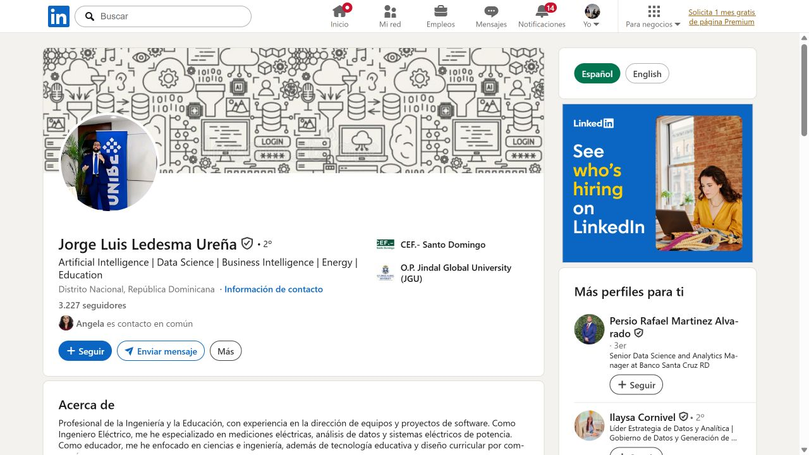

**Senal visible:** Jorge Luis Ledesma Ureña • 2º Artificial Intelligence | Data Science | Business Intelligence | Energy | Education Distrito Nacional, República Dominicana Seguir Anterior: Conferencista y Especialista en Datos e IA en Sociedad Dominicana de Ciencia de Datos BIG

**Por que encaja con Esteban:** este perfil amplia la red hacia personas que hablan el mismo lenguaje tecnico: datos, BI, SQL, Python, automatizacion, analitica o IA. Sirve para crear una conversacion natural, no forzada, desde aprendizaje y proyectos reales.

**Valor potencial:** puede abrir rutas de aprendizaje, referencias de herramientas, oportunidades junior, colaboraciones academicas/profesionales o conexiones con equipos que ya usan datos e IA en procesos reales.

**Mensaje sugerido para enviar manualmente:**

> Hola Jorge, vi tu perfil y me llamo la atencion tu enfoque en business intelligence y toma de decisiones con datos. Soy Esteban, estudio Business Analytics y estoy conectando con personas que tambien esten creciendo en datos, BI, automatizacion e IA. Me gustaria conectar y aprender mas de lo que estas construyendo.

<strong>35. Angela Sanchez Cutipa</strong> - Business Intelligence y toma de decisiones con datos

**Link de perfil:** [Abrir perfil de LinkedIn](https://www.linkedin.com/in/angelasz/)

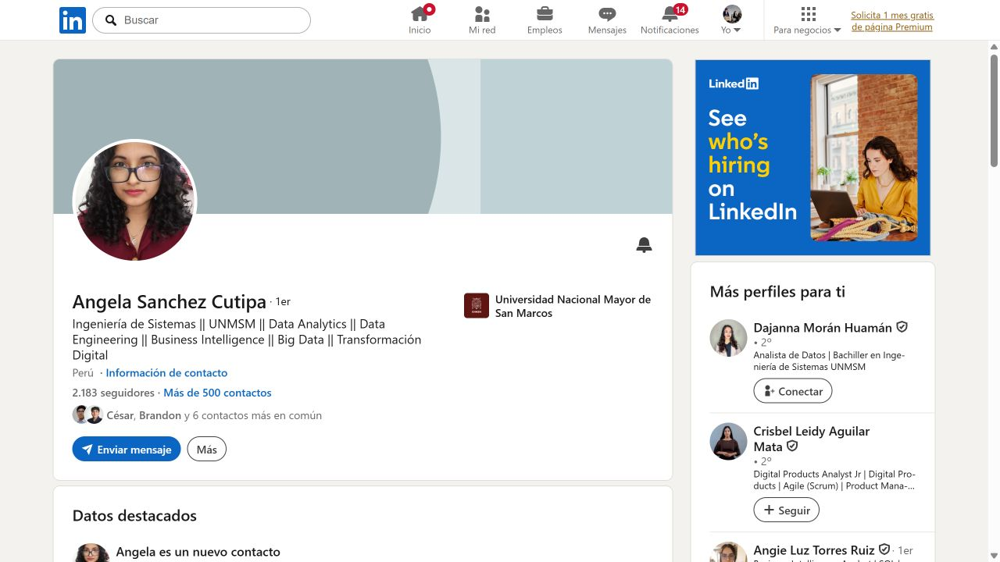

**Senal visible:** Jorge Luis Ledesma Ureña • 2º Artificial Intelligence | Data Science | Business Intelligence | Energy | Education Distrito Nacional, República Dominicana Seguir Anterior: Conferencista y Especialista en Datos e IA en Sociedad Dominicana de Ciencia de Datos BIG

**Por que encaja con Esteban:** este perfil amplia la red hacia personas que hablan el mismo lenguaje tecnico: datos, BI, SQL, Python, automatizacion, analitica o IA. Sirve para crear una conversacion natural, no forzada, desde aprendizaje y proyectos reales.

**Valor potencial:** puede abrir rutas de aprendizaje, referencias de herramientas, oportunidades junior, colaboraciones academicas/profesionales o conexiones con equipos que ya usan datos e IA en procesos reales.

**Mensaje sugerido para enviar manualmente:**

> Hola Angela, vi tu perfil y me llamo la atencion tu enfoque en business intelligence y toma de decisiones con datos. Soy Esteban, estudio Business Analytics y estoy conectando con personas que tambien esten creciendo en datos, BI, automatizacion e IA. Me gustaria conectar y aprender mas de lo que estas construyendo.

<strong>36. Alfonso E. Rangel</strong> - estudiante con enfoque en datos/tecnologia

**Link de perfil:** [Abrir perfil de LinkedIn](https://www.linkedin.com/in/alfonso-rangel/)

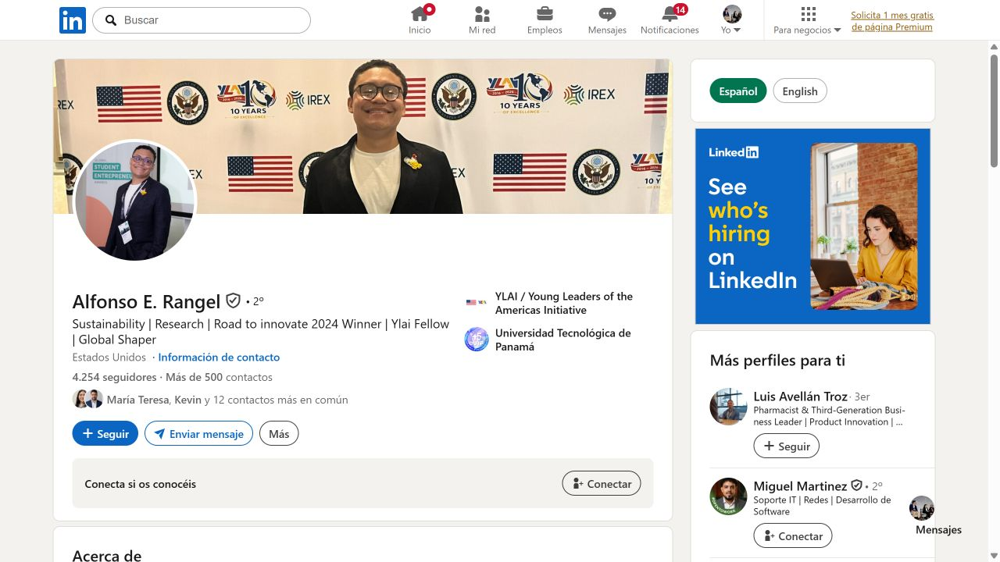

**Senal visible:** Alfonso E. Rangel • 2º Sustainability | Research | Road to innovate 2024 Winner | Ylai Fellow | Global Shaper Estados Unidos Conectar Anterior: Estudiante emprendedor destacado del año en Global Student Entrepreneur Awards (GSEA) Karin Sempf, Marc Oliveras, Ph

**Por que encaja con Esteban:** este perfil amplia la red hacia personas que hablan el mismo lenguaje tecnico: datos, BI, SQL, Python, automatizacion, analitica o IA. Sirve para crear una conversacion natural, no forzada, desde aprendizaje y proyectos reales.

**Valor potencial:** puede abrir rutas de aprendizaje, referencias de herramientas, oportunidades junior, colaboraciones academicas/profesionales o conexiones con equipos que ya usan datos e IA en procesos reales.

**Mensaje sugerido para enviar manualmente:**

> Hola Alfonso, vi tu perfil y me llamo la atencion tu enfoque en estudiante con enfoque en datos/tecnologia. Soy Esteban, estudio Business Analytics y estoy conectando con personas que tambien esten creciendo en datos, BI, automatizacion e IA. Me gustaria conectar y aprender mas de lo que estas construyendo.

<strong>37. Marc Oliveras, PhD</strong> - estudiante con enfoque en datos/tecnologia

**Link de perfil:** [Abrir perfil de LinkedIn](https://www.linkedin.com/in/marc-oliveras-phd/)

**Senal visible:** Alfonso E. Rangel • 2º Sustainability | Research | Road to innovate 2024 Winner | Ylai Fellow | Global Shaper Estados Unidos Conectar Anterior: Estudiante emprendedor destacado del año en Global Student Entrepreneur Awards (GSEA) Karin Sempf, Marc Oliveras, Ph

**Por que encaja con Esteban:** este perfil amplia la red hacia personas que hablan el mismo lenguaje tecnico: datos, BI, SQL, Python, automatizacion, analitica o IA. Sirve para crear una conversacion natural, no forzada, desde aprendizaje y proyectos reales.

**Valor potencial:** puede abrir rutas de aprendizaje, referencias de herramientas, oportunidades junior, colaboraciones academicas/profesionales o conexiones con equipos que ya usan datos e IA en procesos reales.

**Mensaje sugerido para enviar manualmente:**

> Hola Marc, vi tu perfil y me llamo la atencion tu enfoque en estudiante con enfoque en datos/tecnologia. Soy Esteban, estudio Business Analytics y estoy conectando con personas que tambien esten creciendo en datos, BI, automatizacion e IA. Me gustaria conectar y aprender mas de lo que estas construyendo.

<strong>38. Demetrio Garcia •</strong> - datos, tecnologia e inteligencia artificial aplicada

**Link de perfil:** [Abrir perfil de LinkedIn](https://www.linkedin.com/in/demetrio-garcia-14ab862a2/)

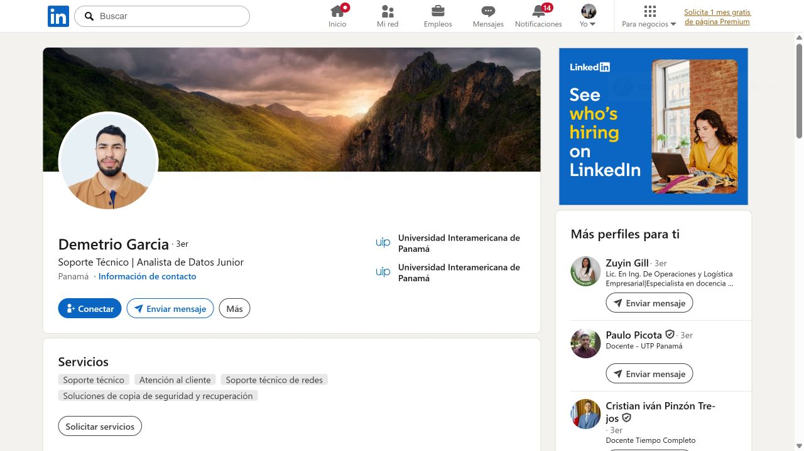

**Senal visible:** Demetrio Garcia • 3er+ Soporte Técnico | Analista de Datos Junior Panamá, Panamá, Panamá Conectar Actual: Auxiliar de admisiones en Universidad Interamericana de Panamá

**Por que encaja con Esteban:** este perfil amplia la red hacia personas que hablan el mismo lenguaje tecnico: datos, BI, SQL, Python, automatizacion, analitica o IA. Sirve para crear una conversacion natural, no forzada, desde aprendizaje y proyectos reales.

**Valor potencial:** puede abrir rutas de aprendizaje, referencias de herramientas, oportunidades junior, colaboraciones academicas/profesionales o conexiones con equipos que ya usan datos e IA en procesos reales.

**Mensaje sugerido para enviar manualmente:**

> Hola Demetrio, vi tu perfil y me llamo la atencion tu enfoque en datos, tecnologia e inteligencia artificial aplicada. Soy Esteban, estudio Business Analytics y estoy conectando con personas que tambien esten creciendo en datos, BI, automatizacion e IA. Me gustaria conectar y aprender mas de lo que estas construyendo.

<strong>39. Imanol Rodríguez</strong> - estudiante con enfoque en datos/tecnologia

**Link de perfil:** [Abrir perfil de LinkedIn](https://www.linkedin.com/in/imanolralvarez/)

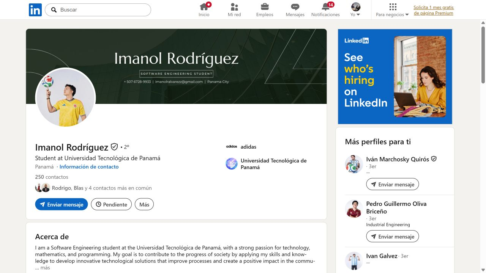

**Senal visible:** Imanol Rodríguez • 2º Student at Universidad Tecnológica de Panamá Panamá, Panamá, Panamá Pendiente Actual: Data Analyst en Fundación Ayudinga Daniel Wen Lay, Rodrigo Yángüez y 4 contactos más en común

**Por que encaja con Esteban:** este perfil amplia la red hacia personas que hablan el mismo lenguaje tecnico: datos, BI, SQL, Python, automatizacion, analitica o IA. Sirve para crear una conversacion natural, no forzada, desde aprendizaje y proyectos reales.

**Valor potencial:** puede abrir rutas de aprendizaje, referencias de herramientas, oportunidades junior, colaboraciones academicas/profesionales o conexiones con equipos que ya usan datos e IA en procesos reales.

**Mensaje sugerido para enviar manualmente:**

> Hola Imanol, vi tu perfil y me llamo la atencion tu enfoque en estudiante con enfoque en datos/tecnologia. Soy Esteban, estudio Business Analytics y estoy conectando con personas que tambien esten creciendo en datos, BI, automatizacion e IA. Me gustaria conectar y aprender mas de lo que estas construyendo.

<strong>40. Alejandro Araúz Cedeño</strong> - estudiante con enfoque en datos/tecnologia

**Link de perfil:** [Abrir perfil de LinkedIn](https://www.linkedin.com/in/alejandroarauz18/)

**Senal visible:** Alejandro Araúz Cedeño • 2º Blue Team | Cybersecurity Engineer Student | TryHackMe Arraiján, Panamá Oeste, Panamá Conectar Anterior: Infrasec Analyst en B&G Solutions Daniel Wen Lay y Jan Carlos Quintero son contactos en común

**Por que encaja con Esteban:** este perfil amplia la red hacia personas que hablan el mismo lenguaje tecnico: datos, BI, SQL, Python, automatizacion, analitica o IA. Sirve para crear una conversacion natural, no forzada, desde aprendizaje y proyectos reales.

**Valor potencial:** puede abrir rutas de aprendizaje, referencias de herramientas, oportunidades junior, colaboraciones academicas/profesionales o conexiones con equipos que ya usan datos e IA en procesos reales.

**Mensaje sugerido para enviar manualmente:**

> Hola Alejandro, vi tu perfil y me llamo la atencion tu enfoque en estudiante con enfoque en datos/tecnologia. Soy Esteban, estudio Business Analytics y estoy conectando con personas que tambien esten creciendo en datos, BI, automatizacion e IA. Me gustaria conectar y aprender mas de lo que estas construyendo.

<strong>41. Jan Carlos Quintero</strong> - estudiante con enfoque en datos/tecnologia

**Link de perfil:** [Abrir perfil de LinkedIn](https://www.linkedin.com/in/jan-quintero/)

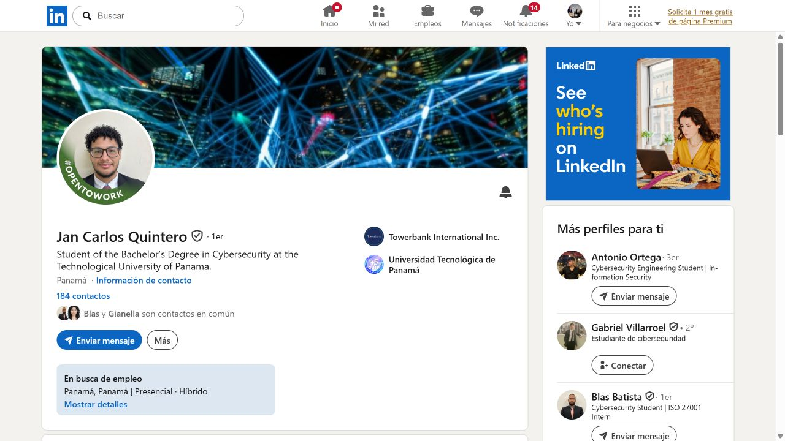

**Senal visible:** Alejandro Araúz Cedeño • 2º Blue Team | Cybersecurity Engineer Student | TryHackMe Arraiján, Panamá Oeste, Panamá Conectar Anterior: Infrasec Analyst en B&G Solutions Daniel Wen Lay y Jan Carlos Quintero son contactos en común

**Por que encaja con Esteban:** este perfil amplia la red hacia personas que hablan el mismo lenguaje tecnico: datos, BI, SQL, Python, automatizacion, analitica o IA. Sirve para crear una conversacion natural, no forzada, desde aprendizaje y proyectos reales.

**Valor potencial:** puede abrir rutas de aprendizaje, referencias de herramientas, oportunidades junior, colaboraciones academicas/profesionales o conexiones con equipos que ya usan datos e IA en procesos reales.

**Mensaje sugerido para enviar manualmente:**

> Hola Jan, vi tu perfil y me llamo la atencion tu enfoque en estudiante con enfoque en datos/tecnologia. Soy Esteban, estudio Business Analytics y estoy conectando con personas que tambien esten creciendo en datos, BI, automatizacion e IA. Me gustaria conectar y aprender mas de lo que estas construyendo.

<strong>42. Javier Jiménez</strong> - datos, tecnologia e inteligencia artificial aplicada

**Link de perfil:** [Abrir perfil de LinkedIn](https://www.linkedin.com/in/javier-j-jim%C3%A9nez/)

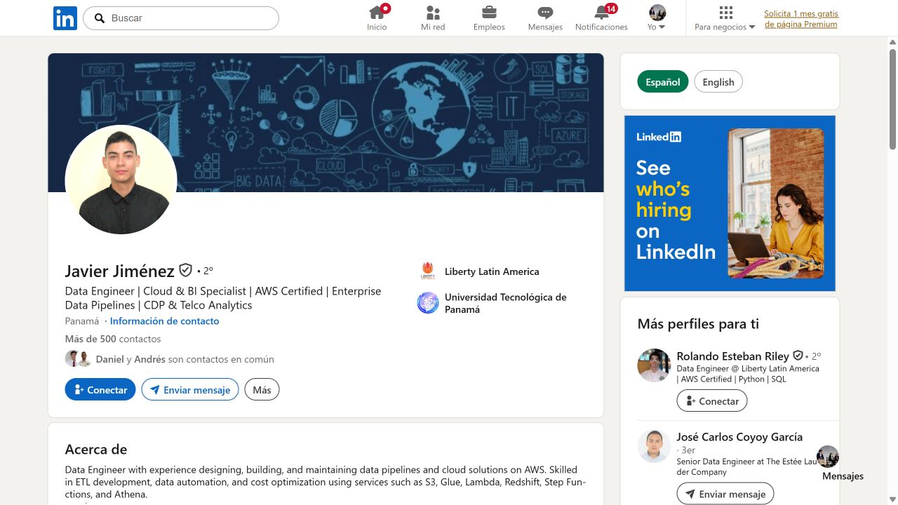

**Senal visible:** Javier Jiménez • 2º Data Engineer | Cloud & BI Specialist | AWS Certified | Enterprise Data Pipelines | CDP & Telco Analytics Panamá, Panamá Conectar Actual: Data Engineer en Liberty Latin America - …, and customer analytics use cases for marketing teams… Dani

**Por que encaja con Esteban:** este perfil amplia la red hacia personas que hablan el mismo lenguaje tecnico: datos, BI, SQL, Python, automatizacion, analitica o IA. Sirve para crear una conversacion natural, no forzada, desde aprendizaje y proyectos reales.

**Valor potencial:** puede abrir rutas de aprendizaje, referencias de herramientas, oportunidades junior, colaboraciones academicas/profesionales o conexiones con equipos que ya usan datos e IA en procesos reales.

**Mensaje sugerido para enviar manualmente:**

> Hola Javier, vi tu perfil y me llamo la atencion tu enfoque en datos, tecnologia e inteligencia artificial aplicada. Soy Esteban, estudio Business Analytics y estoy conectando con personas que tambien esten creciendo en datos, BI, automatizacion e IA. Me gustaria conectar y aprender mas de lo que estas construyendo.

<strong>43. Joana Cristina Gonzalez Coronell</strong> - datos, tecnologia e inteligencia artificial aplicada

**Link de perfil:** [Abrir perfil de LinkedIn](https://www.linkedin.com/in/joana-cristina-gonzalez-coronell-55a509287/)

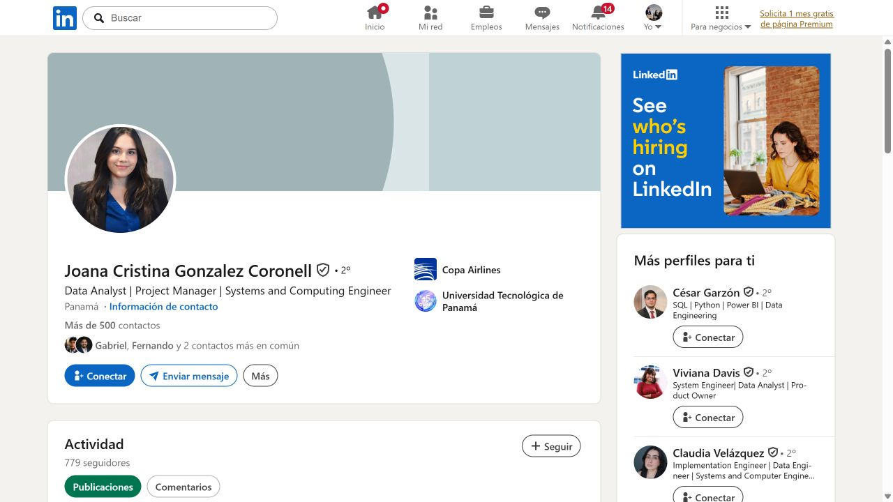

**Senal visible:** Joana Cristina Gonzalez Coronell • 2º Data Analyst | Project Manager | Systems and Computing Engineer Panamá, Panamá Conectar Actual: Revenue Analysis Analyst en Copa Airlines - …pricing strategies, and deliver actionable business… Daniel Wen Lay, Fernando Cut

**Por que encaja con Esteban:** este perfil amplia la red hacia personas que hablan el mismo lenguaje tecnico: datos, BI, SQL, Python, automatizacion, analitica o IA. Sirve para crear una conversacion natural, no forzada, desde aprendizaje y proyectos reales.

**Valor potencial:** puede abrir rutas de aprendizaje, referencias de herramientas, oportunidades junior, colaboraciones academicas/profesionales o conexiones con equipos que ya usan datos e IA en procesos reales.

**Mensaje sugerido para enviar manualmente:**

> Hola Joana, vi tu perfil y me llamo la atencion tu enfoque en datos, tecnologia e inteligencia artificial aplicada. Soy Esteban, estudio Business Analytics y estoy conectando con personas que tambien esten creciendo en datos, BI, automatizacion e IA. Me gustaria conectar y aprender mas de lo que estas construyendo.

<strong>44. Jefferson Angel Areche Rojas</strong> - datos, tecnologia e inteligencia artificial aplicada

**Link de perfil:** [Abrir perfil de LinkedIn](https://www.linkedin.com/in/jeffersonangel/es/)

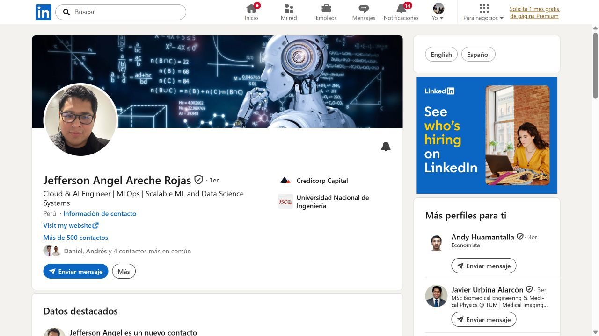

**Senal visible:** Daniel Wen Lay • 1er Data Analyst Engineer at Huawei Latinoamerica Panamá, Panamá, Panamá Enviar mensaje Actual: Data Analyst Engineer en Huawei Jefferson Angel Areche Rojas, William Rodríguez Grajales y 15 contactos más en común

**Por que encaja con Esteban:** este perfil amplia la red hacia personas que hablan el mismo lenguaje tecnico: datos, BI, SQL, Python, automatizacion, analitica o IA. Sirve para crear una conversacion natural, no forzada, desde aprendizaje y proyectos reales.

**Valor potencial:** puede abrir rutas de aprendizaje, referencias de herramientas, oportunidades junior, colaboraciones academicas/profesionales o conexiones con equipos que ya usan datos e IA en procesos reales.

**Mensaje sugerido para enviar manualmente:**

> Hola Jefferson, vi tu perfil y me llamo la atencion tu enfoque en datos, tecnologia e inteligencia artificial aplicada. Soy Esteban, estudio Business Analytics y estoy conectando con personas que tambien esten creciendo en datos, BI, automatizacion e IA. Me gustaria conectar y aprender mas de lo que estas construyendo.

<strong>45. William Rodríguez Grajales</strong> - datos, tecnologia e inteligencia artificial aplicada

**Link de perfil:** [Abrir perfil de LinkedIn](https://www.linkedin.com/in/william-rodr%C3%ADguez-grajales-67354a135/)

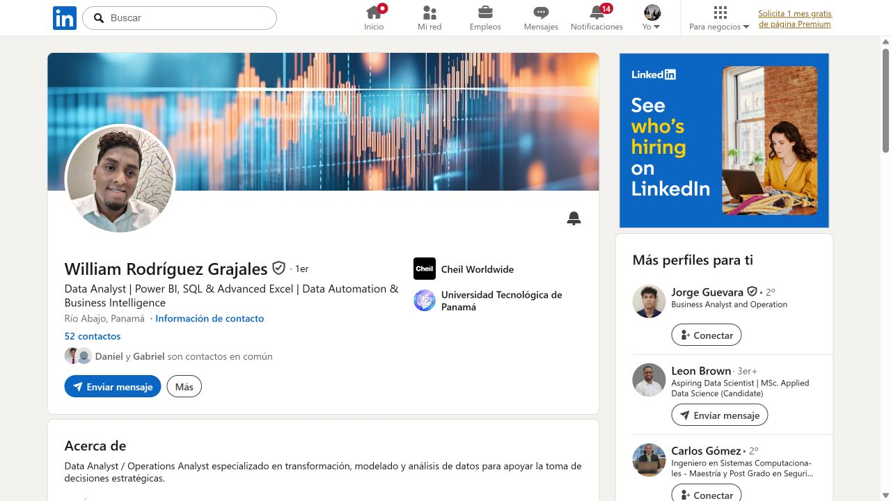

**Senal visible:** Daniel Wen Lay • 1er Data Analyst Engineer at Huawei Latinoamerica Panamá, Panamá, Panamá Enviar mensaje Actual: Data Analyst Engineer en Huawei Jefferson Angel Areche Rojas, William Rodríguez Grajales y 15 contactos más en común

**Por que encaja con Esteban:** este perfil amplia la red hacia personas que hablan el mismo lenguaje tecnico: datos, BI, SQL, Python, automatizacion, analitica o IA. Sirve para crear una conversacion natural, no forzada, desde aprendizaje y proyectos reales.

**Valor potencial:** puede abrir rutas de aprendizaje, referencias de herramientas, oportunidades junior, colaboraciones academicas/profesionales o conexiones con equipos que ya usan datos e IA en procesos reales.

**Mensaje sugerido para enviar manualmente:**

> Hola William, vi tu perfil y me llamo la atencion tu enfoque en datos, tecnologia e inteligencia artificial aplicada. Soy Esteban, estudio Business Analytics y estoy conectando con personas que tambien esten creciendo en datos, BI, automatizacion e IA. Me gustaria conectar y aprender mas de lo que estas construyendo.

<strong>46. Sergio Ibañez</strong> - datos, tecnologia e inteligencia artificial aplicada

**Link de perfil:** [Abrir perfil de LinkedIn](https://www.linkedin.com/in/sergio-ibanez-cabrera/es/)

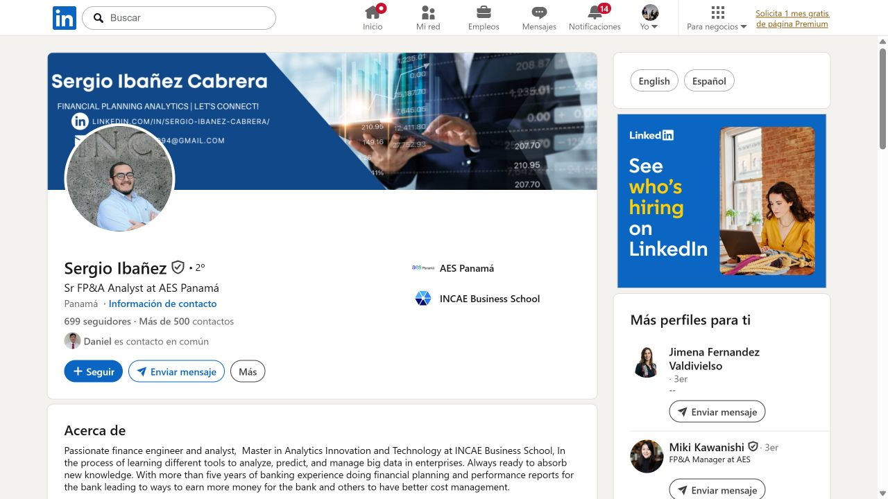

**Senal visible:** Sergio Ibañez • 2º FP&A & Data Science | Driving Business Strategy with Financial & Data Analytics Panamá, Panamá, Panamá Seguir Actual: Sr FP&A Analyst en AES Panamá Daniel Wen Lay es contacto en común · 699 seguidores

**Por que encaja con Esteban:** este perfil amplia la red hacia personas que hablan el mismo lenguaje tecnico: datos, BI, SQL, Python, automatizacion, analitica o IA. Sirve para crear una conversacion natural, no forzada, desde aprendizaje y proyectos reales.

**Valor potencial:** puede abrir rutas de aprendizaje, referencias de herramientas, oportunidades junior, colaboraciones academicas/profesionales o conexiones con equipos que ya usan datos e IA en procesos reales.

**Mensaje sugerido para enviar manualmente:**

> Hola Sergio, vi tu perfil y me llamo la atencion tu enfoque en datos, tecnologia e inteligencia artificial aplicada. Soy Esteban, estudio Business Analytics y estoy conectando con personas que tambien esten creciendo en datos, BI, automatizacion e IA. Me gustaria conectar y aprender mas de lo que estas construyendo.

<strong>47. Keisa Avila</strong> - Business Intelligence y toma de decisiones con datos

**Link de perfil:** [Abrir perfil de LinkedIn](https://www.linkedin.com/in/keisa/)

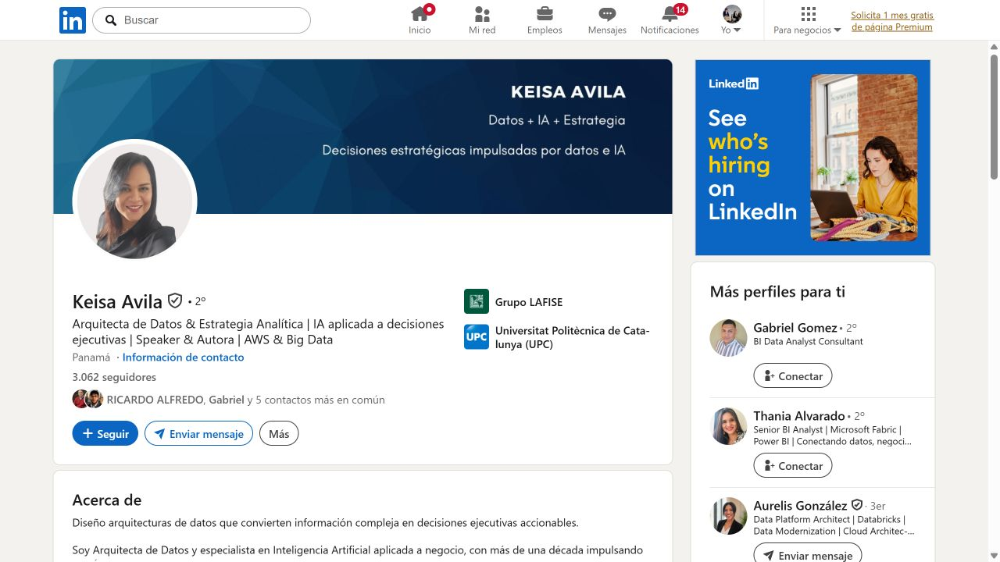

**Senal visible:** Keisa Avila • 2º Arquitecta de Datos & Estrategia Analítica | IA aplicada a decisiones ejecutivas | Speaker & Autora | AWS & Big Data Panamá, Panamá Seguir Actual: Científico de datos en Grupo LAFISE - …Regional de Business Intelligence, diseñando la… Juan Car

**Por que encaja con Esteban:** este perfil amplia la red hacia personas que hablan el mismo lenguaje tecnico: datos, BI, SQL, Python, automatizacion, analitica o IA. Sirve para crear una conversacion natural, no forzada, desde aprendizaje y proyectos reales.

**Valor potencial:** puede abrir rutas de aprendizaje, referencias de herramientas, oportunidades junior, colaboraciones academicas/profesionales o conexiones con equipos que ya usan datos e IA en procesos reales.

**Mensaje sugerido para enviar manualmente:**

> Hola Keisa, vi tu perfil y me llamo la atencion tu enfoque en business intelligence y toma de decisiones con datos. Soy Esteban, estudio Business Analytics y estoy conectando con personas que tambien esten creciendo en datos, BI, automatizacion e IA. Me gustaria conectar y aprender mas de lo que estas construyendo.

<strong>48. Juan Carlos Figueroa Figueroa</strong> - Business Intelligence y toma de decisiones con datos

**Link de perfil:** [Abrir perfil de LinkedIn](https://www.linkedin.com/in/jcffsv/)

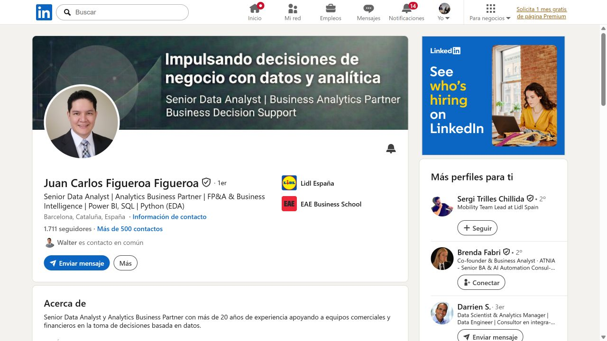

**Senal visible:** Keisa Avila • 2º Arquitecta de Datos & Estrategia Analítica | IA aplicada a decisiones ejecutivas | Speaker & Autora | AWS & Big Data Panamá, Panamá Seguir Actual: Científico de datos en Grupo LAFISE - …Regional de Business Intelligence, diseñando la… Juan Car

**Por que encaja con Esteban:** este perfil amplia la red hacia personas que hablan el mismo lenguaje tecnico: datos, BI, SQL, Python, automatizacion, analitica o IA. Sirve para crear una conversacion natural, no forzada, desde aprendizaje y proyectos reales.

**Valor potencial:** puede abrir rutas de aprendizaje, referencias de herramientas, oportunidades junior, colaboraciones academicas/profesionales o conexiones con equipos que ya usan datos e IA en procesos reales.

**Mensaje sugerido para enviar manualmente:**

> Hola Juan, vi tu perfil y me llamo la atencion tu enfoque en business intelligence y toma de decisiones con datos. Soy Esteban, estudio Business Analytics y estoy conectando con personas que tambien esten creciendo en datos, BI, automatizacion e IA. Me gustaria conectar y aprender mas de lo que estas construyendo.

<strong>49. Cristina Denia Carretero</strong> - Power BI, datos y analitica aplicada

**Link de perfil:** [Abrir perfil de LinkedIn](https://www.linkedin.com/in/cristinadeniacarretero/)

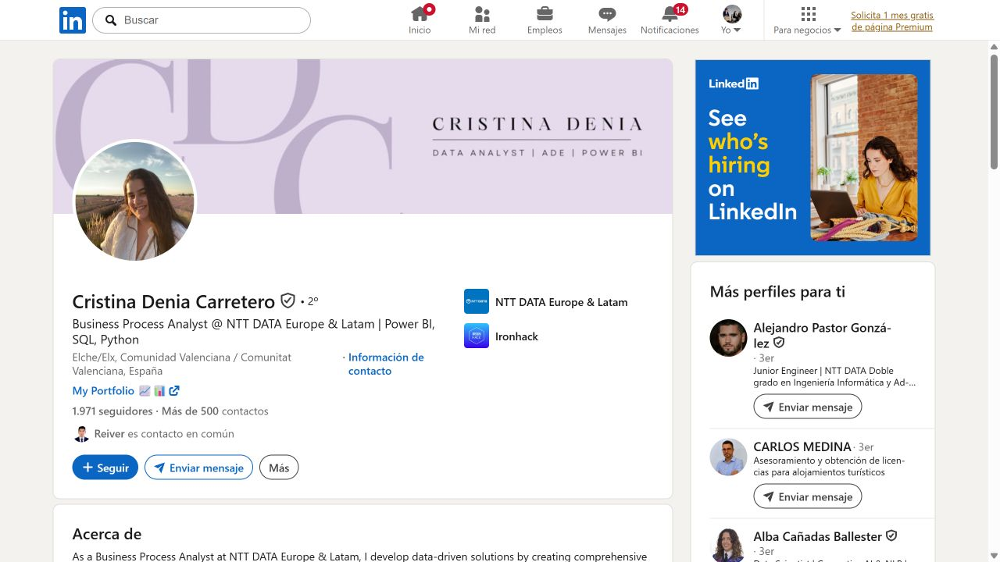

**Senal visible:** Cristina Denia Carretero • 2º Business Process Analyst @ NTT DATA Europe & Latam | Power BI, SQL, Python Elche/Elx, Comunidad Valenciana / Comunitat Valenciana, España Seguir Actual: Business Process Analyst en NTT DATA Europe & Latam Reiver Lopez es contacto 

**Por que encaja con Esteban:** este perfil amplia la red hacia personas que hablan el mismo lenguaje tecnico: datos, BI, SQL, Python, automatizacion, analitica o IA. Sirve para crear una conversacion natural, no forzada, desde aprendizaje y proyectos reales.

**Valor potencial:** puede abrir rutas de aprendizaje, referencias de herramientas, oportunidades junior, colaboraciones academicas/profesionales o conexiones con equipos que ya usan datos e IA en procesos reales.

**Mensaje sugerido para enviar manualmente:**

> Hola Cristina, vi tu perfil y me llamo la atencion tu enfoque en power bi, datos y analitica aplicada. Soy Esteban, estudio Business Analytics y estoy conectando con personas que tambien esten creciendo en datos, BI, automatizacion e IA. Me gustaria conectar y aprender mas de lo que estas construyendo.

<strong>50. Abelardo Cárcamo</strong> - estudiante con enfoque en datos/tecnologia

**Link de perfil:** [Abrir perfil de LinkedIn](https://www.linkedin.com/in/abelardocb/)

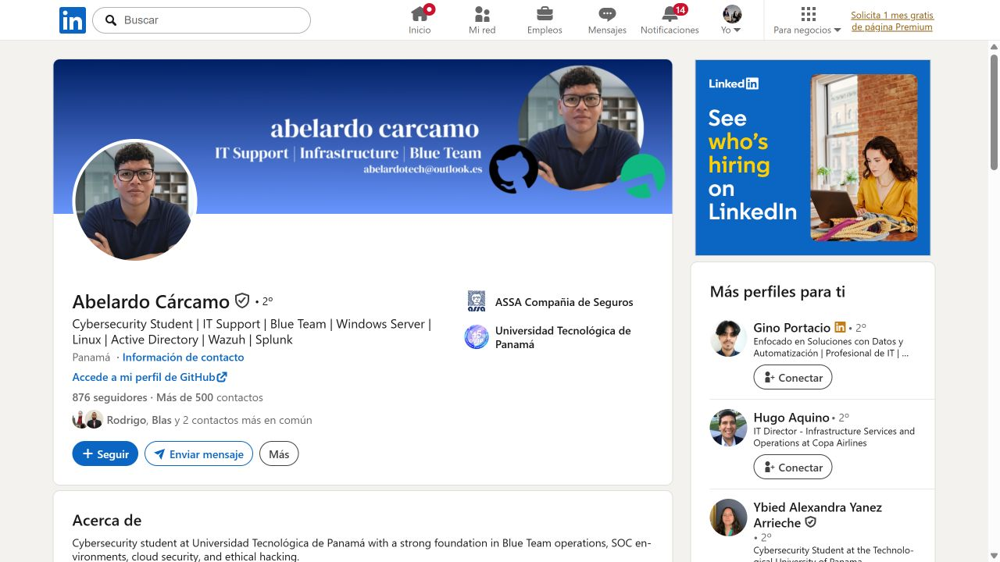

**Senal visible:** Abelardo Cárcamo • 2º Cybersecurity Student | IT Support | Blue Team | Windows Server | Linux | Active Directory | Wazuh | Splunk Panamá, Panamá, Panamá Seguir Resumen: Cybersecurity student at Universidad Tecnológica de Panamá with a strong foundation in Blue

**Por que encaja con Esteban:** este perfil amplia la red hacia personas que hablan el mismo lenguaje tecnico: datos, BI, SQL, Python, automatizacion, analitica o IA. Sirve para crear una conversacion natural, no forzada, desde aprendizaje y proyectos reales.

**Valor potencial:** puede abrir rutas de aprendizaje, referencias de herramientas, oportunidades junior, colaboraciones academicas/profesionales o conexiones con equipos que ya usan datos e IA en procesos reales.

**Mensaje sugerido para enviar manualmente:**

> Hola Abelardo, vi tu perfil y me llamo la atencion tu enfoque en estudiante con enfoque en datos/tecnologia. Soy Esteban, estudio Business Analytics y estoy conectando con personas que tambien esten creciendo en datos, BI, automatizacion e IA. Me gustaria conectar y aprender mas de lo que estas construyendo.

## Contactos 51-100 agregados

<strong>51. Cristian Lavia</strong> - Business intelligence / Power BI

**Link de perfil:** [Abrir perfil de LinkedIn](https://www.linkedin.com/in/cristianlavia)

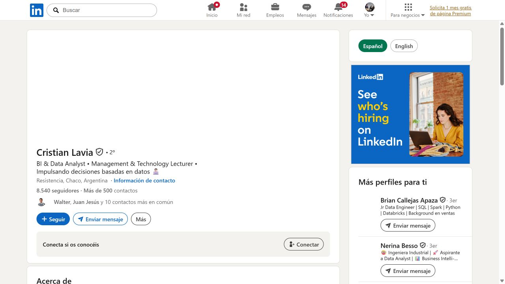

**Senal visible:** Cristian Lavia • 2º BI & Data Analyst • Management & Technology Lecturer • Impulsando decisiones basadas en datos 🧑🏻‍💻 Resistencia, Chaco, Argentina Actual: Academic Coordinator & Data Analytics Tutor en Unicorn Academy Ariel Edgardo Levy, Alejandro N. H...

**Por que encaja con Esteban:** perfil conectado con busquedas de datos, BI, automatizacion, IA o etapa junior/estudiantil. Es el tipo de contacto que puede generar conversaciones naturales sobre aprendizaje, proyectos, herramientas y oportunidades en analitica.

**Valor potencial para conseguir clientes B2B:** aunque no todos son decisores, pueden abrir puertas a equipos, profesores, comunidades, startups o empresas donde se usan datos y automatizacion. Para Esteban sirve como red puente: aprender, comentar, colaborar y detectar oportunidades tempranas.

**Mensaje sugerido para enviar manualmente:**

> Hola Cristian, vi tu perfil y me llamo la atencion tu enfoque en datos/tecnologia. Estoy conectando con personas de LATAM que tambien esten creciendo en analitica, automatizacion e IA. Me gustaria conectar y seguir aprendiendo de lo que compartes.

<strong>52. Ariel Edgardo Levy</strong> - Business intelligence / Power BI

**Link de perfil:** [Abrir perfil de LinkedIn](https://www.linkedin.com/in/arieledgardo)

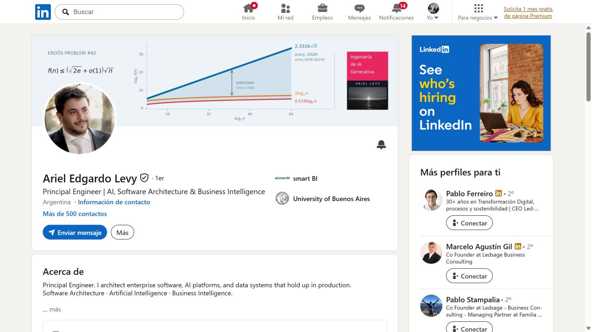

**Senal visible:** Cristian Lavia • 2º BI & Data Analyst • Management & Technology Lecturer • Impulsando decisiones basadas en datos 🧑🏻‍💻 Resistencia, Chaco, Argentina Actual: Academic Coordinator & Data Analytics Tutor en Unicorn Academy Ariel Edgardo Levy, Alejandro N. H...

**Por que encaja con Esteban:** perfil conectado con busquedas de datos, BI, automatizacion, IA o etapa junior/estudiantil. Es el tipo de contacto que puede generar conversaciones naturales sobre aprendizaje, proyectos, herramientas y oportunidades en analitica.

**Valor potencial para conseguir clientes B2B:** aunque no todos son decisores, pueden abrir puertas a equipos, profesores, comunidades, startups o empresas donde se usan datos y automatizacion. Para Esteban sirve como red puente: aprender, comentar, colaborar y detectar oportunidades tempranas.

**Mensaje sugerido para enviar manualmente:**

> Hola Ariel, vi tu perfil y me llamo la atencion tu enfoque en datos/tecnologia. Estoy conectando con personas de LATAM que tambien esten creciendo en analitica, automatizacion e IA. Me gustaria conectar y seguir aprendiendo de lo que compartes.

<strong>53. Enrique Goff</strong> - Business intelligence / Power BI

**Link de perfil:** [Abrir perfil de LinkedIn](https://www.linkedin.com/in/enrique-goff-282154194)

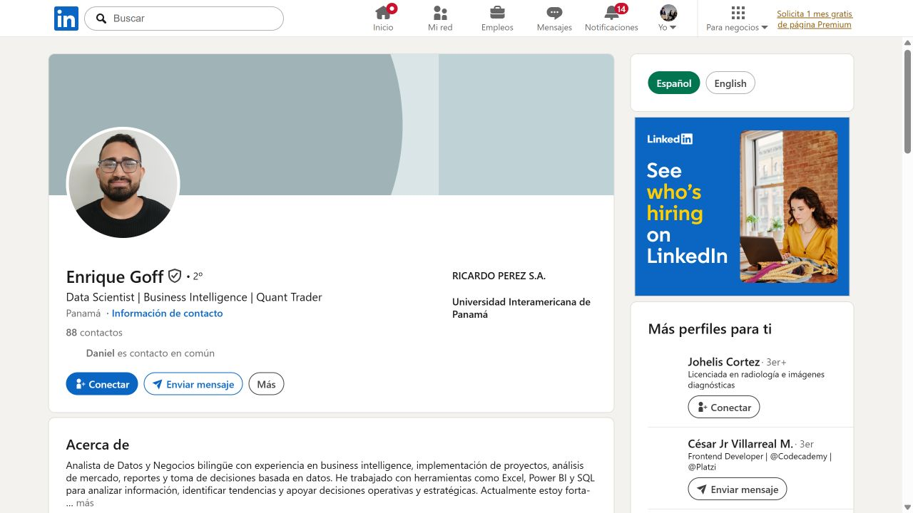

**Senal visible:** Enrique Goff • 2º Data Scientist | Business Intelligence | Quant Trader Panamá, Panamá Actual: Oficial de Información en RICARDO PEREZ S.A. Daniel Wen Lay es contacto en común

**Por que encaja con Esteban:** perfil conectado con busquedas de datos, BI, automatizacion, IA o etapa junior/estudiantil. Es el tipo de contacto que puede generar conversaciones naturales sobre aprendizaje, proyectos, herramientas y oportunidades en analitica.

**Valor potencial para conseguir clientes B2B:** aunque no todos son decisores, pueden abrir puertas a equipos, profesores, comunidades, startups o empresas donde se usan datos y automatizacion. Para Esteban sirve como red puente: aprender, comentar, colaborar y detectar oportunidades tempranas.

**Mensaje sugerido para enviar manualmente:**

> Hola Enrique, vi tu perfil y me llamo la atencion tu enfoque en datos/tecnologia. Estoy conectando con personas de LATAM que tambien esten creciendo en analitica, automatizacion e IA. Me gustaria conectar y seguir aprendiendo de lo que compartes.

<strong>54. Adolfo Huanacuni Apaza</strong> - Business intelligence / Power BI

**Link de perfil:** [Abrir perfil de LinkedIn](https://www.linkedin.com/in/adolfo-huanacuni-apaza)

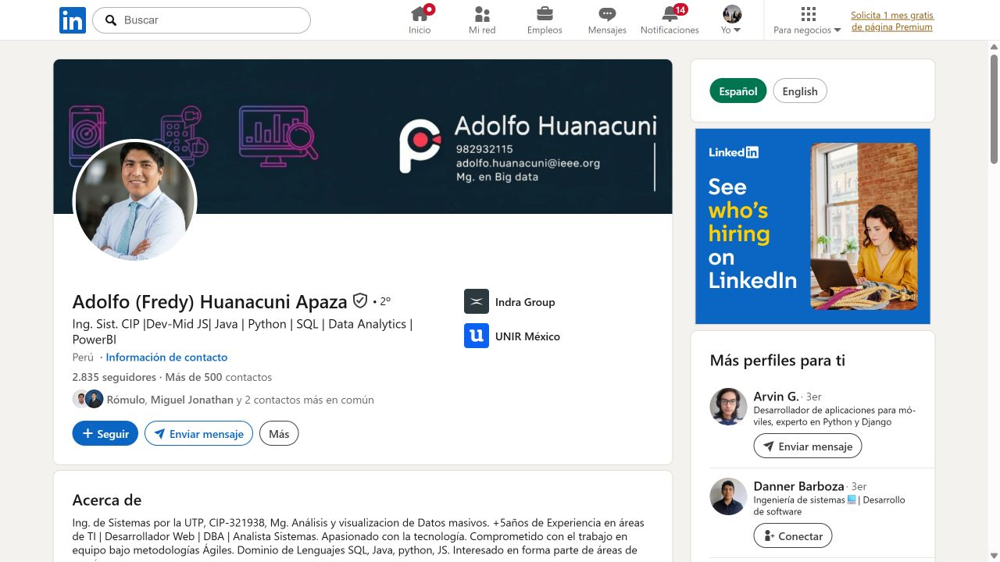

**Senal visible:** Adolfo Huanacuni Apaza • 2º Ing. Sist. CIP |Dev-Mid JS| Java | Python | SQL | Data Analytics | PowerBI Perú Seguir Anterior: Analista BI en PM COSMO S.A.C - …clientes. Tech Stack: Power BI, Excel, Sql Server, Looker Studio, python. Miguel Jonathan Mogrovejo...

**Por que encaja con Esteban:** perfil conectado con busquedas de datos, BI, automatizacion, IA o etapa junior/estudiantil. Es el tipo de contacto que puede generar conversaciones naturales sobre aprendizaje, proyectos, herramientas y oportunidades en analitica.

**Valor potencial para conseguir clientes B2B:** aunque no todos son decisores, pueden abrir puertas a equipos, profesores, comunidades, startups o empresas donde se usan datos y automatizacion. Para Esteban sirve como red puente: aprender, comentar, colaborar y detectar oportunidades tempranas.

**Mensaje sugerido para enviar manualmente:**

> Hola Adolfo, vi tu perfil y me llamo la atencion tu enfoque en datos/tecnologia. Estoy conectando con personas de LATAM que tambien esten creciendo en analitica, automatizacion e IA. Me gustaria conectar y seguir aprendiendo de lo que compartes.

<strong>55. Miguel Jonathan Mogrovejo Cardenas</strong> - Business intelligence / Power BI

**Link de perfil:** [Abrir perfil de LinkedIn](https://www.linkedin.com/in/mjmc4498)

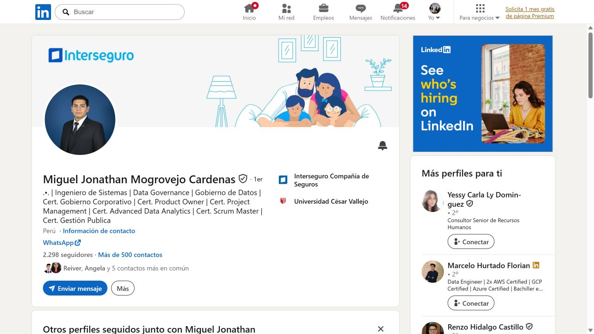

**Senal visible:** Adolfo Huanacuni Apaza • 2º Ing. Sist. CIP |Dev-Mid JS| Java | Python | SQL | Data Analytics | PowerBI Perú Seguir Anterior: Analista BI en PM COSMO S.A.C - …clientes. Tech Stack: Power BI, Excel, Sql Server, Looker Studio, python. Miguel Jonathan Mogrovejo...

**Por que encaja con Esteban:** perfil conectado con busquedas de datos, BI, automatizacion, IA o etapa junior/estudiantil. Es el tipo de contacto que puede generar conversaciones naturales sobre aprendizaje, proyectos, herramientas y oportunidades en analitica.

**Valor potencial para conseguir clientes B2B:** aunque no todos son decisores, pueden abrir puertas a equipos, profesores, comunidades, startups o empresas donde se usan datos y automatizacion. Para Esteban sirve como red puente: aprender, comentar, colaborar y detectar oportunidades tempranas.

**Mensaje sugerido para enviar manualmente:**

> Hola Miguel, vi tu perfil y me llamo la atencion tu enfoque en datos/tecnologia. Estoy conectando con personas de LATAM que tambien esten creciendo en analitica, automatizacion e IA. Me gustaria conectar y seguir aprendiendo de lo que compartes.

<strong>56. Rómulo Salvador</strong> - Business intelligence / Power BI

**Link de perfil:** [Abrir perfil de LinkedIn](https://www.linkedin.com/in/romulo-salvador)

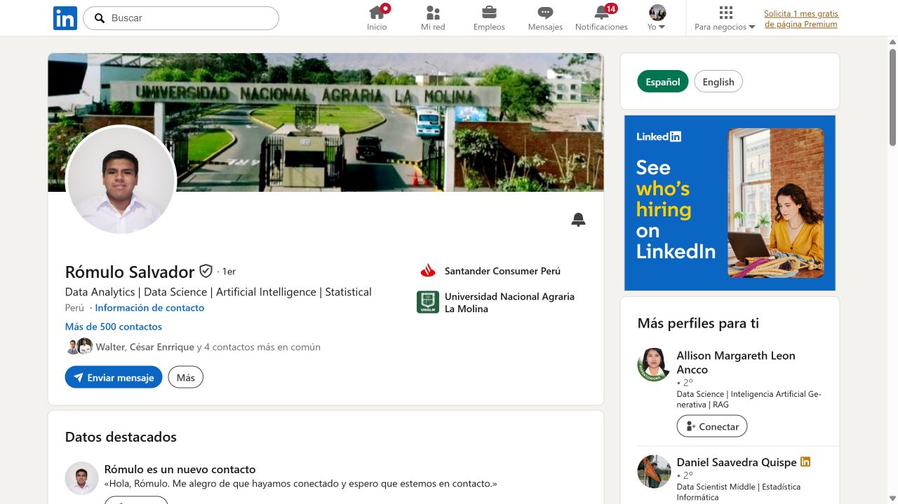

**Senal visible:** Adolfo Huanacuni Apaza • 2º Ing. Sist. CIP |Dev-Mid JS| Java | Python | SQL | Data Analytics | PowerBI Perú Seguir Anterior: Analista BI en PM COSMO S.A.C - …clientes. Tech Stack: Power BI, Excel, Sql Server, Looker Studio, python. Miguel Jonathan Mogrovejo...

**Por que encaja con Esteban:** perfil conectado con busquedas de datos, BI, automatizacion, IA o etapa junior/estudiantil. Es el tipo de contacto que puede generar conversaciones naturales sobre aprendizaje, proyectos, herramientas y oportunidades en analitica.

**Valor potencial para conseguir clientes B2B:** aunque no todos son decisores, pueden abrir puertas a equipos, profesores, comunidades, startups o empresas donde se usan datos y automatizacion. Para Esteban sirve como red puente: aprender, comentar, colaborar y detectar oportunidades tempranas.

**Mensaje sugerido para enviar manualmente:**

> Hola Rmulo, vi tu perfil y me llamo la atencion tu enfoque en datos/tecnologia. Estoy conectando con personas de LATAM que tambien esten creciendo en analitica, automatizacion e IA. Me gustaria conectar y seguir aprendiendo de lo que compartes.

<strong>57. Manuel Mauricio Serna • 2º</strong> - Business intelligence / Power BI

**Link de perfil:** [Abrir perfil de LinkedIn](https://www.linkedin.com/in/manuel-mauricio-serna-aba408157)

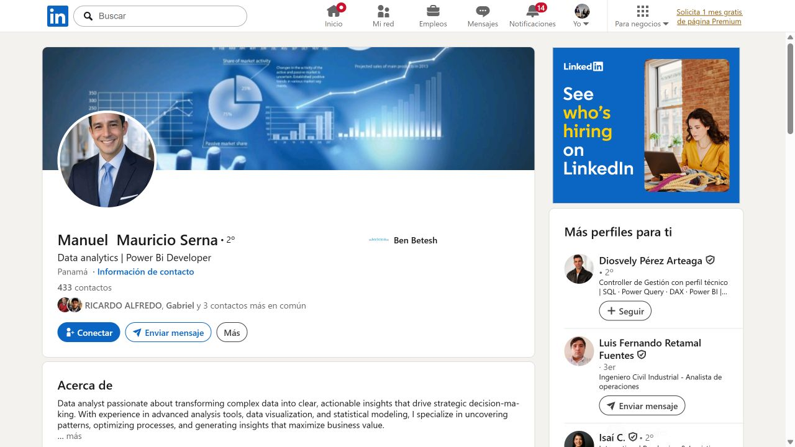

**Senal visible:** Manuel Mauricio Serna • 2º Data analytics | Power Bi Developer Panamá, Panamá Actual: Data analytics | Power Bi Developer en Ben Betesh RICARDO ALFREDO HUAMAN SUAREZ, Antonio Sánchez De Boeck y 3 contactos más en común

**Por que encaja con Esteban:** perfil conectado con busquedas de datos, BI, automatizacion, IA o etapa junior/estudiantil. Es el tipo de contacto que puede generar conversaciones naturales sobre aprendizaje, proyectos, herramientas y oportunidades en analitica.

**Valor potencial para conseguir clientes B2B:** aunque no todos son decisores, pueden abrir puertas a equipos, profesores, comunidades, startups o empresas donde se usan datos y automatizacion. Para Esteban sirve como red puente: aprender, comentar, colaborar y detectar oportunidades tempranas.

**Mensaje sugerido para enviar manualmente:**

> Hola Manuel, vi tu perfil y me llamo la atencion tu enfoque en datos/tecnologia. Estoy conectando con personas de LATAM que tambien esten creciendo en analitica, automatizacion e IA. Me gustaria conectar y seguir aprendiendo de lo que compartes.

<strong>58. RICARDO ALFREDO HUAMAN SUAREZ</strong> - Business intelligence / Power BI

**Link de perfil:** [Abrir perfil de LinkedIn](https://www.linkedin.com/in/ricardo-alfredo-huaman-suarez-65319483)

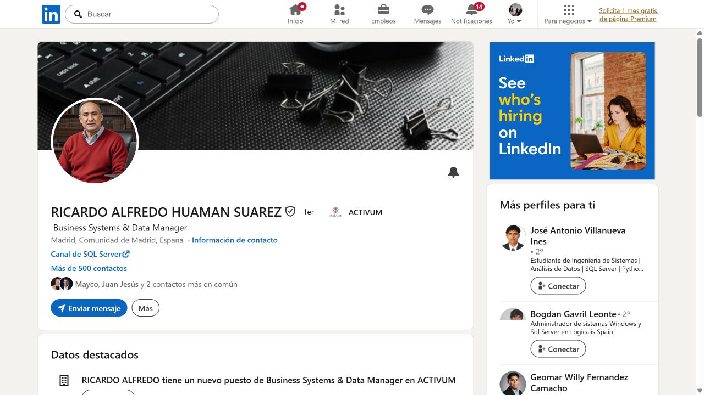

**Senal visible:** Manuel Mauricio Serna • 2º Data analytics | Power Bi Developer Panamá, Panamá Actual: Data analytics | Power Bi Developer en Ben Betesh RICARDO ALFREDO HUAMAN SUAREZ, Antonio Sánchez De Boeck y 3 contactos más en común

**Por que encaja con Esteban:** perfil conectado con busquedas de datos, BI, automatizacion, IA o etapa junior/estudiantil. Es el tipo de contacto que puede generar conversaciones naturales sobre aprendizaje, proyectos, herramientas y oportunidades en analitica.

**Valor potencial para conseguir clientes B2B:** aunque no todos son decisores, pueden abrir puertas a equipos, profesores, comunidades, startups o empresas donde se usan datos y automatizacion. Para Esteban sirve como red puente: aprender, comentar, colaborar y detectar oportunidades tempranas.

**Mensaje sugerido para enviar manualmente:**

> Hola RICARDO, vi tu perfil y me llamo la atencion tu enfoque en datos/tecnologia. Estoy conectando con personas de LATAM que tambien esten creciendo en analitica, automatizacion e IA. Me gustaria conectar y seguir aprendiendo de lo que compartes.

<strong>59. Antonio Sánchez De Boeck</strong> - Business intelligence / Power BI

**Link de perfil:** [Abrir perfil de LinkedIn](https://www.linkedin.com/in/sanchezdeboeck)

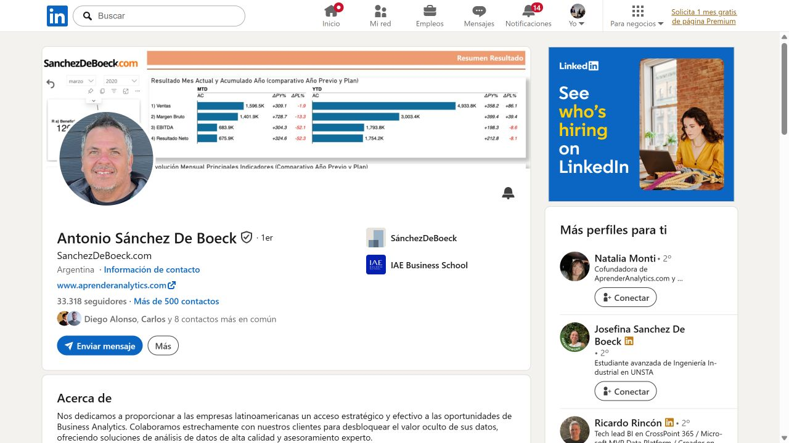

**Senal visible:** Manuel Mauricio Serna • 2º Data analytics | Power Bi Developer Panamá, Panamá Actual: Data analytics | Power Bi Developer en Ben Betesh RICARDO ALFREDO HUAMAN SUAREZ, Antonio Sánchez De Boeck y 3 contactos más en común

**Por que encaja con Esteban:** perfil conectado con busquedas de datos, BI, automatizacion, IA o etapa junior/estudiantil. Es el tipo de contacto que puede generar conversaciones naturales sobre aprendizaje, proyectos, herramientas y oportunidades en analitica.

**Valor potencial para conseguir clientes B2B:** aunque no todos son decisores, pueden abrir puertas a equipos, profesores, comunidades, startups o empresas donde se usan datos y automatizacion. Para Esteban sirve como red puente: aprender, comentar, colaborar y detectar oportunidades tempranas.

**Mensaje sugerido para enviar manualmente:**

> Hola Antonio, vi tu perfil y me llamo la atencion tu enfoque en datos/tecnologia. Estoy conectando con personas de LATAM que tambien esten creciendo en analitica, automatizacion e IA. Me gustaria conectar y seguir aprendiendo de lo que compartes.

<strong>60. Rodrigo Yángüez</strong> - Business intelligence / Power BI

**Link de perfil:** [Abrir perfil de LinkedIn](https://www.linkedin.com/in/rodrigoiyg)

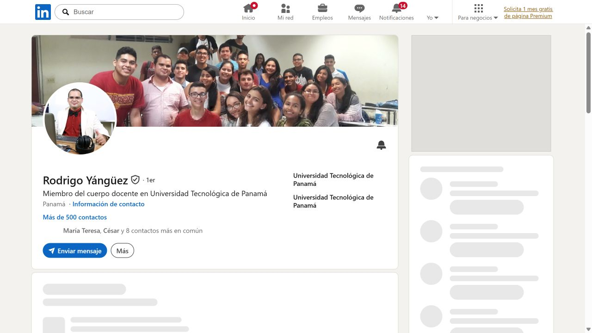

**Senal visible:** Abelardo Cárcamo • 2º Cybersecurity Student | IT Support | Blue Team | Windows Server | Linux | Active Directory | Wazuh | Splunk Panamá, Panamá, Panamá Seguir Resumen: Cybersecurity student at Universidad Tecnológica de Panamá with a strong foundation in B...

**Por que encaja con Esteban:** perfil conectado con busquedas de datos, BI, automatizacion, IA o etapa junior/estudiantil. Es el tipo de contacto que puede generar conversaciones naturales sobre aprendizaje, proyectos, herramientas y oportunidades en analitica.

**Valor potencial para conseguir clientes B2B:** aunque no todos son decisores, pueden abrir puertas a equipos, profesores, comunidades, startups o empresas donde se usan datos y automatizacion. Para Esteban sirve como red puente: aprender, comentar, colaborar y detectar oportunidades tempranas.

**Mensaje sugerido para enviar manualmente:**

> Hola Rodrigo, vi tu perfil y me llamo la atencion tu enfoque en datos/tecnologia. Estoy conectando con personas de LATAM que tambien esten creciendo en analitica, automatizacion e IA. Me gustaria conectar y seguir aprendiendo de lo que compartes.

<strong>61. Santiago Lopez</strong> - Business intelligence / Power BI

**Link de perfil:** [Abrir perfil de LinkedIn](https://www.linkedin.com/in/santiago-lopez-software-engineer)

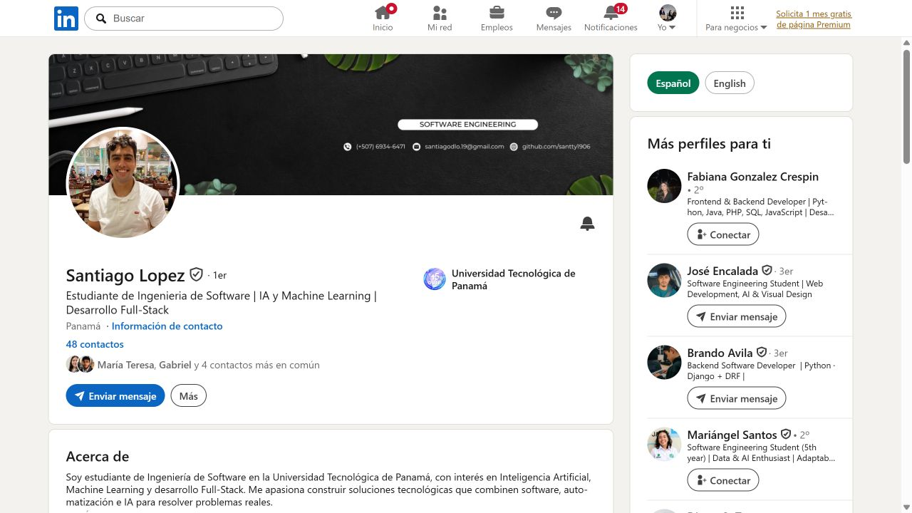

**Senal visible:** Abelardo Cárcamo • 2º Cybersecurity Student | IT Support | Blue Team | Windows Server | Linux | Active Directory | Wazuh | Splunk Panamá, Panamá, Panamá Seguir Resumen: Cybersecurity student at Universidad Tecnológica de Panamá with a strong foundation in B...

**Por que encaja con Esteban:** perfil conectado con busquedas de datos, BI, automatizacion, IA o etapa junior/estudiantil. Es el tipo de contacto que puede generar conversaciones naturales sobre aprendizaje, proyectos, herramientas y oportunidades en analitica.

**Valor potencial para conseguir clientes B2B:** aunque no todos son decisores, pueden abrir puertas a equipos, profesores, comunidades, startups o empresas donde se usan datos y automatizacion. Para Esteban sirve como red puente: aprender, comentar, colaborar y detectar oportunidades tempranas.

**Mensaje sugerido para enviar manualmente:**

> Hola Santiago, vi tu perfil y me llamo la atencion tu enfoque en datos/tecnologia. Estoy conectando con personas de LATAM que tambien esten creciendo en analitica, automatizacion e IA. Me gustaria conectar y seguir aprendiendo de lo que compartes.

<strong>62. Javier Sanchez Galan</strong> - IA y machine learning

**Link de perfil:** [Abrir perfil de LinkedIn](https://www.linkedin.com/in/javier-sanchez-galan-19303220)

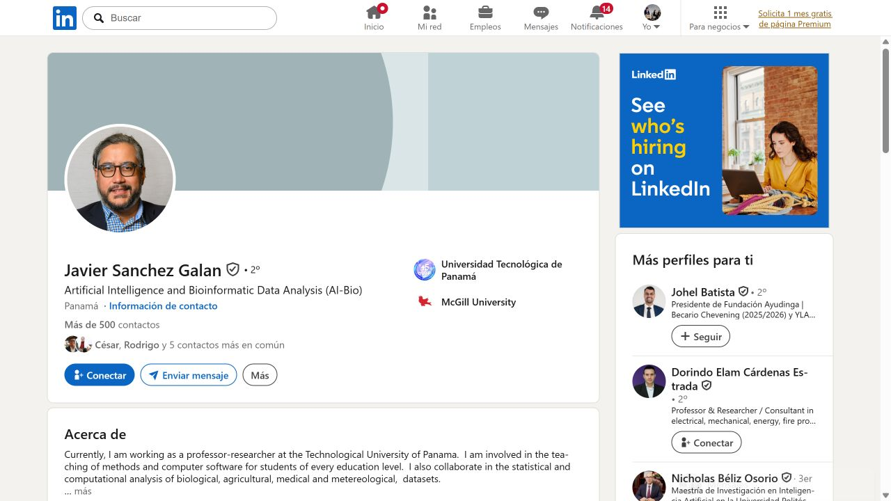

**Senal visible:** Javier Sanchez Galan • 2º Artificial Intelligence and Bioinformatic Data Analysis (AI-Bio) Panamá, Panamá, Panamá Actual: Research Coordinator en Universidad Tecnológica de Panamá Karin Sempf, César González Camargo y 5 contactos más en común

**Por que encaja con Esteban:** perfil conectado con busquedas de datos, BI, automatizacion, IA o etapa junior/estudiantil. Es el tipo de contacto que puede generar conversaciones naturales sobre aprendizaje, proyectos, herramientas y oportunidades en analitica.

**Valor potencial para conseguir clientes B2B:** aunque no todos son decisores, pueden abrir puertas a equipos, profesores, comunidades, startups o empresas donde se usan datos y automatizacion. Para Esteban sirve como red puente: aprender, comentar, colaborar y detectar oportunidades tempranas.

**Mensaje sugerido para enviar manualmente:**

> Hola Javier, vi tu perfil y me llamo la atencion tu enfoque en datos/tecnologia. Estoy conectando con personas de LATAM que tambien esten creciendo en analitica, automatizacion e IA. Me gustaria conectar y seguir aprendiendo de lo que compartes.

<strong>63. Aurio De la Cruz</strong> - IA y machine learning

**Link de perfil:** [Abrir perfil de LinkedIn](https://www.linkedin.com/in/aurio-de-la-cruz-05299b49)

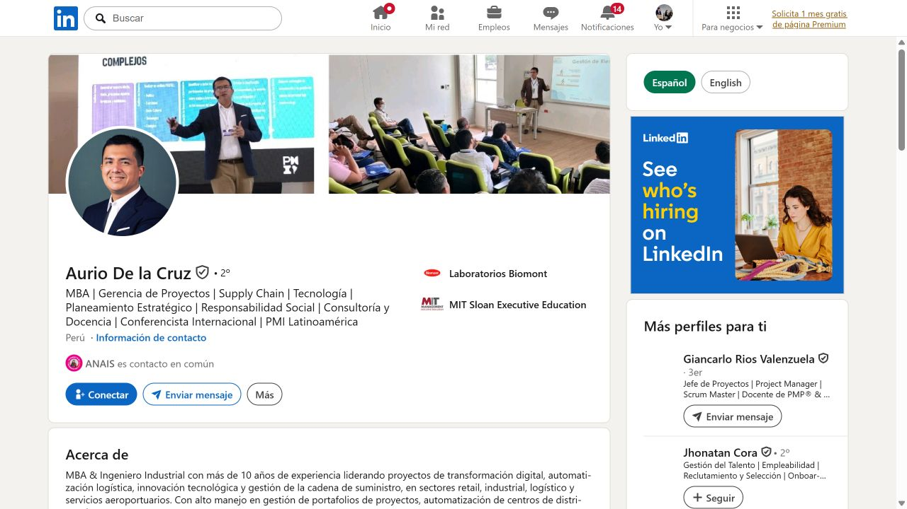

**Senal visible:** Aurio De la Cruz • 2º MBA | Gerencia de Proyectos | Supply Chain | Tecnología | Planeamiento Estratégico | Responsabilidad Social | Consultoría y Docencia | Conferencista Internacional | PMI Latinoamérica Perú Anterior: Jefe de Proyectos Estratégicos en Pan...

**Por que encaja con Esteban:** perfil conectado con busquedas de datos, BI, automatizacion, IA o etapa junior/estudiantil. Es el tipo de contacto que puede generar conversaciones naturales sobre aprendizaje, proyectos, herramientas y oportunidades en analitica.

**Valor potencial para conseguir clientes B2B:** aunque no todos son decisores, pueden abrir puertas a equipos, profesores, comunidades, startups o empresas donde se usan datos y automatizacion. Para Esteban sirve como red puente: aprender, comentar, colaborar y detectar oportunidades tempranas.

**Mensaje sugerido para enviar manualmente:**

> Hola Aurio, vi tu perfil y me llamo la atencion tu enfoque en datos/tecnologia. Estoy conectando con personas de LATAM que tambien esten creciendo en analitica, automatizacion e IA. Me gustaria conectar y seguir aprendiendo de lo que compartes.

<strong>64. ANAIS CASTILLO QUIROZ</strong> - IA y machine learning

**Link de perfil:** [Abrir perfil de LinkedIn](https://www.linkedin.com/in/anais-c-76824217a)

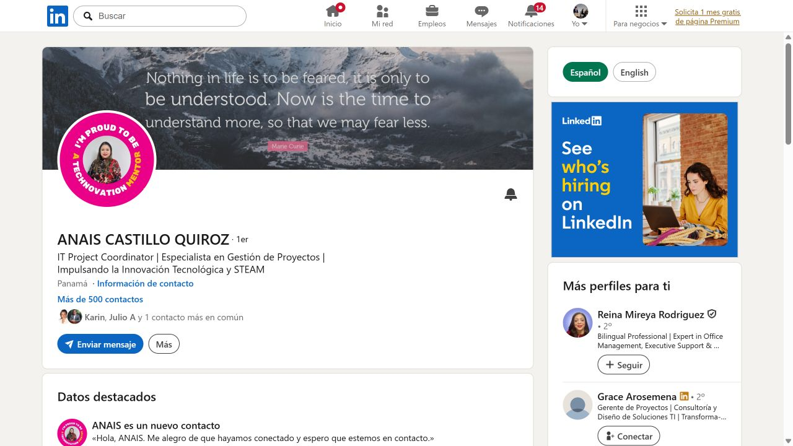

**Senal visible:** Aurio De la Cruz • 2º MBA | Gerencia de Proyectos | Supply Chain | Tecnología | Planeamiento Estratégico | Responsabilidad Social | Consultoría y Docencia | Conferencista Internacional | PMI Latinoamérica Perú Anterior: Jefe de Proyectos Estratégicos en Pan...

**Por que encaja con Esteban:** perfil conectado con busquedas de datos, BI, automatizacion, IA o etapa junior/estudiantil. Es el tipo de contacto que puede generar conversaciones naturales sobre aprendizaje, proyectos, herramientas y oportunidades en analitica.

**Valor potencial para conseguir clientes B2B:** aunque no todos son decisores, pueden abrir puertas a equipos, profesores, comunidades, startups o empresas donde se usan datos y automatizacion. Para Esteban sirve como red puente: aprender, comentar, colaborar y detectar oportunidades tempranas.

**Mensaje sugerido para enviar manualmente:**

> Hola ANAIS, vi tu perfil y me llamo la atencion tu enfoque en datos/tecnologia. Estoy conectando con personas de LATAM que tambien esten creciendo en analitica, automatizacion e IA. Me gustaria conectar y seguir aprendiendo de lo que compartes.

<strong>65. Jonatan Arauz</strong> - Business intelligence / Power BI

**Link de perfil:** [Abrir perfil de LinkedIn](https://www.linkedin.com/in/jonatan-arauz-0b671b22a)

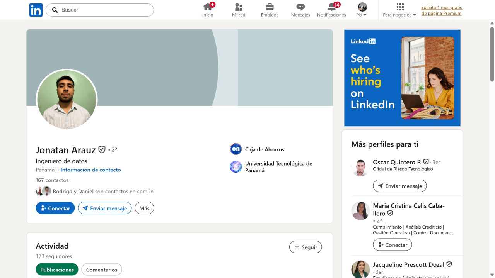

**Senal visible:** Jonatan Arauz • 2º Ingeniero de datos Panamá, Panamá, Panamá Actual: Oficial de Ingeniería y Arquitectura de datos en Caja de Ahorros Daniel Wen Lay y Rodrigo Yángüez son contactos en común

**Por que encaja con Esteban:** perfil conectado con busquedas de datos, BI, automatizacion, IA o etapa junior/estudiantil. Es el tipo de contacto que puede generar conversaciones naturales sobre aprendizaje, proyectos, herramientas y oportunidades en analitica.

**Valor potencial para conseguir clientes B2B:** aunque no todos son decisores, pueden abrir puertas a equipos, profesores, comunidades, startups o empresas donde se usan datos y automatizacion. Para Esteban sirve como red puente: aprender, comentar, colaborar y detectar oportunidades tempranas.

**Mensaje sugerido para enviar manualmente:**

> Hola Jonatan, vi tu perfil y me llamo la atencion tu enfoque en datos/tecnologia. Estoy conectando con personas de LATAM que tambien esten creciendo en analitica, automatizacion e IA. Me gustaria conectar y seguir aprendiendo de lo que compartes.

<strong>66. Malony Jaramillo</strong> - Business intelligence / Power BI

**Link de perfil:** [Abrir perfil de LinkedIn](https://www.linkedin.com/in/malonyjaramillo)

**Senal visible:** Malony Jaramillo • 2º Ingeniero en software, Analista de Bi Financiero, Consultor de proyectos de TI Panamá, Panamá, Panamá Seguir Actual: Analista BI financiero SWB en Copa Airlines Daniel Wen Lay, Fernando Cutire y 2 contactos más en común · 447 seguidores

**Por que encaja con Esteban:** perfil conectado con busquedas de datos, BI, automatizacion, IA o etapa junior/estudiantil. Es el tipo de contacto que puede generar conversaciones naturales sobre aprendizaje, proyectos, herramientas y oportunidades en analitica.

**Valor potencial para conseguir clientes B2B:** aunque no todos son decisores, pueden abrir puertas a equipos, profesores, comunidades, startups o empresas donde se usan datos y automatizacion. Para Esteban sirve como red puente: aprender, comentar, colaborar y detectar oportunidades tempranas.

**Mensaje sugerido para enviar manualmente:**

> Hola Malony, vi tu perfil y me llamo la atencion tu enfoque en datos/tecnologia. Estoy conectando con personas de LATAM que tambien esten creciendo en analitica, automatizacion e IA. Me gustaria conectar y seguir aprendiendo de lo que compartes.

<strong>67. Georgett Vásquez •</strong> - Business intelligence / Power BI

**Link de perfil:** [Abrir perfil de LinkedIn](https://www.linkedin.com/in/georgett-v%C3%A1squez-26a017385)

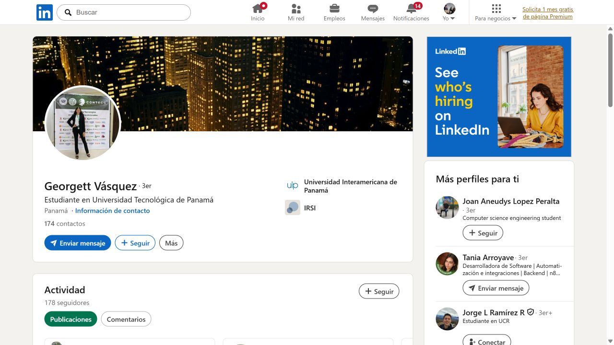

**Senal visible:** Georgett Vásquez • 3er+ Estudiante en Universidad Tecnológica de Panamá Panamá, Panamá, Panamá Enviar mensaje Anterior: Analista de datos en Universidad Interamericana de Panamá

**Por que encaja con Esteban:** perfil conectado con busquedas de datos, BI, automatizacion, IA o etapa junior/estudiantil. Es el tipo de contacto que puede generar conversaciones naturales sobre aprendizaje, proyectos, herramientas y oportunidades en analitica.

**Valor potencial para conseguir clientes B2B:** aunque no todos son decisores, pueden abrir puertas a equipos, profesores, comunidades, startups o empresas donde se usan datos y automatizacion. Para Esteban sirve como red puente: aprender, comentar, colaborar y detectar oportunidades tempranas.

**Mensaje sugerido para enviar manualmente:**

> Hola Georgett, vi tu perfil y me llamo la atencion tu enfoque en datos/tecnologia. Estoy conectando con personas de LATAM que tambien esten creciendo en analitica, automatizacion e IA. Me gustaria conectar y seguir aprendiendo de lo que compartes.

<strong>68. Alberto Saenz</strong> - Automatizacion y procesos

**Link de perfil:** [Abrir perfil de LinkedIn](https://www.linkedin.com/in/alberto-saenz/es)

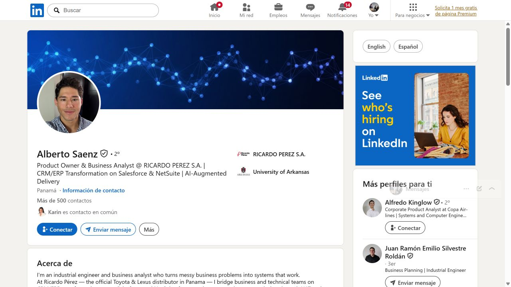

**Senal visible:** Alberto Saenz • 2º Industrial Engineer and Operations Analyst | University of Arkansas Alumnus Panamá, Panamá, Panamá Actual: Product Owner & Business Analyst en RICARDO PEREZ S.A. Karin Sempf es contacto en común

**Por que encaja con Esteban:** perfil conectado con busquedas de datos, BI, automatizacion, IA o etapa junior/estudiantil. Es el tipo de contacto que puede generar conversaciones naturales sobre aprendizaje, proyectos, herramientas y oportunidades en analitica.

**Valor potencial para conseguir clientes B2B:** aunque no todos son decisores, pueden abrir puertas a equipos, profesores, comunidades, startups o empresas donde se usan datos y automatizacion. Para Esteban sirve como red puente: aprender, comentar, colaborar y detectar oportunidades tempranas.

**Mensaje sugerido para enviar manualmente:**

> Hola Alberto, vi tu perfil y me llamo la atencion tu enfoque en datos/tecnologia. Estoy conectando con personas de LATAM que tambien esten creciendo en analitica, automatizacion e IA. Me gustaria conectar y seguir aprendiendo de lo que compartes.

<strong>69. Karin Sempf</strong> - Automatizacion y procesos

**Link de perfil:** [Abrir perfil de LinkedIn](https://www.linkedin.com/in/karinsempf)

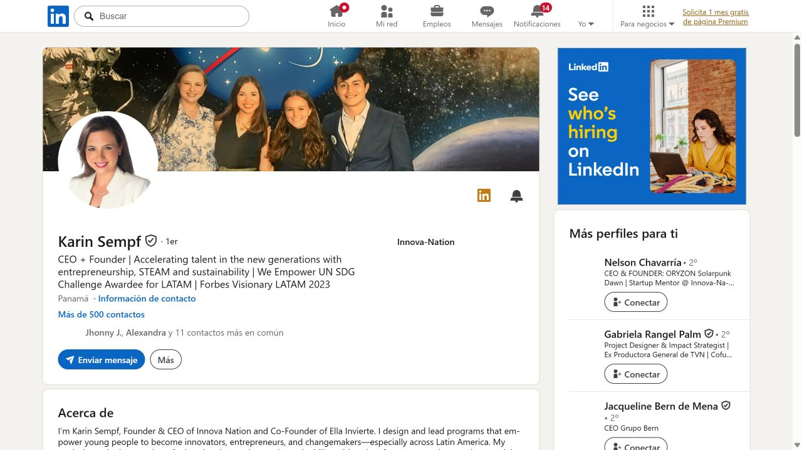

**Senal visible:** Alberto Saenz • 2º Industrial Engineer and Operations Analyst | University of Arkansas Alumnus Panamá, Panamá, Panamá Actual: Product Owner & Business Analyst en RICARDO PEREZ S.A. Karin Sempf es contacto en común

**Por que encaja con Esteban:** perfil conectado con busquedas de datos, BI, automatizacion, IA o etapa junior/estudiantil. Es el tipo de contacto que puede generar conversaciones naturales sobre aprendizaje, proyectos, herramientas y oportunidades en analitica.

**Valor potencial para conseguir clientes B2B:** aunque no todos son decisores, pueden abrir puertas a equipos, profesores, comunidades, startups o empresas donde se usan datos y automatizacion. Para Esteban sirve como red puente: aprender, comentar, colaborar y detectar oportunidades tempranas.

**Mensaje sugerido para enviar manualmente:**

> Hola Karin, vi tu perfil y me llamo la atencion tu enfoque en datos/tecnologia. Estoy conectando con personas de LATAM que tambien esten creciendo en analitica, automatizacion e IA. Me gustaria conectar y seguir aprendiendo de lo que compartes.

<strong>70. Rodrigo Díaz</strong> - Automatizacion y procesos

**Link de perfil:** [Abrir perfil de LinkedIn](https://www.linkedin.com/in/rodrodiaz)

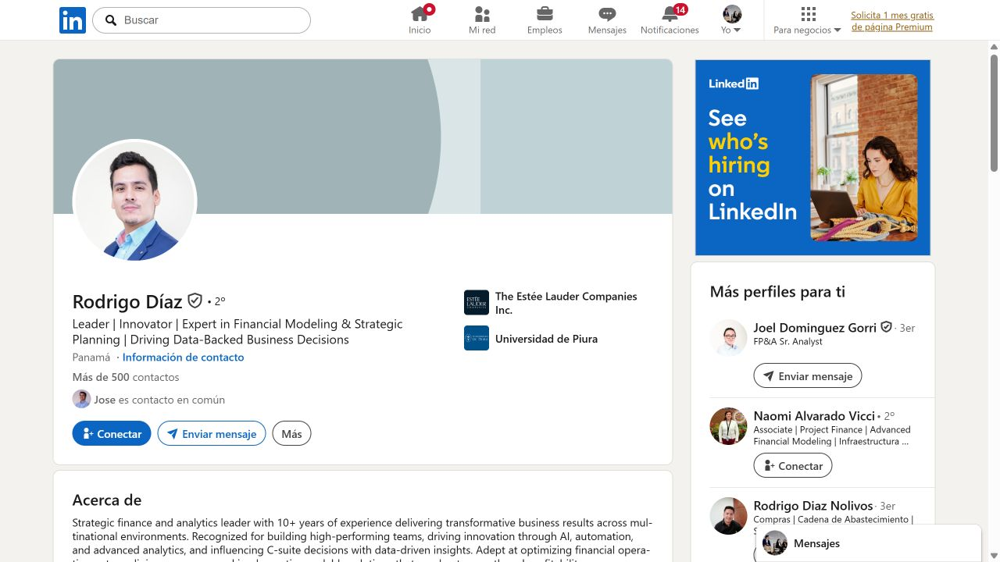

**Senal visible:** Rodrigo Díaz • 2º Leader | Innovator | Expert in Financial Modeling & Strategic Planning | Driving Data-Backed Business Decisions Panamá, Panamá, Panamá Certificaciones: The Transformative Impact of AI: Co-Intelligence: Living and Working with AI Jose Lizal...

**Por que encaja con Esteban:** perfil conectado con busquedas de datos, BI, automatizacion, IA o etapa junior/estudiantil. Es el tipo de contacto que puede generar conversaciones naturales sobre aprendizaje, proyectos, herramientas y oportunidades en analitica.

**Valor potencial para conseguir clientes B2B:** aunque no todos son decisores, pueden abrir puertas a equipos, profesores, comunidades, startups o empresas donde se usan datos y automatizacion. Para Esteban sirve como red puente: aprender, comentar, colaborar y detectar oportunidades tempranas.

**Mensaje sugerido para enviar manualmente:**

> Hola Rodrigo, vi tu perfil y me llamo la atencion tu enfoque en datos/tecnologia. Estoy conectando con personas de LATAM que tambien esten creciendo en analitica, automatizacion e IA. Me gustaria conectar y seguir aprendiendo de lo que compartes.

<strong>71. Jose Lizallo</strong> - Automatizacion y procesos

**Link de perfil:** [Abrir perfil de LinkedIn](https://www.linkedin.com/in/joselizallo)

**Senal visible:** Rodrigo Díaz • 2º Leader | Innovator | Expert in Financial Modeling & Strategic Planning | Driving Data-Backed Business Decisions Panamá, Panamá, Panamá Certificaciones: The Transformative Impact of AI: Co-Intelligence: Living and Working with AI Jose Lizal...

**Por que encaja con Esteban:** perfil conectado con busquedas de datos, BI, automatizacion, IA o etapa junior/estudiantil. Es el tipo de contacto que puede generar conversaciones naturales sobre aprendizaje, proyectos, herramientas y oportunidades en analitica.

**Valor potencial para conseguir clientes B2B:** aunque no todos son decisores, pueden abrir puertas a equipos, profesores, comunidades, startups o empresas donde se usan datos y automatizacion. Para Esteban sirve como red puente: aprender, comentar, colaborar y detectar oportunidades tempranas.

**Mensaje sugerido para enviar manualmente:**

> Hola Jose, vi tu perfil y me llamo la atencion tu enfoque en datos/tecnologia. Estoy conectando con personas de LATAM que tambien esten creciendo en analitica, automatizacion e IA. Me gustaria conectar y seguir aprendiendo de lo que compartes.

<strong>72. Natasha Guanti • 2º</strong> - Business intelligence / Power BI

**Link de perfil:** [Abrir perfil de LinkedIn](https://www.linkedin.com/in/natasha-guanti-583b8a148)

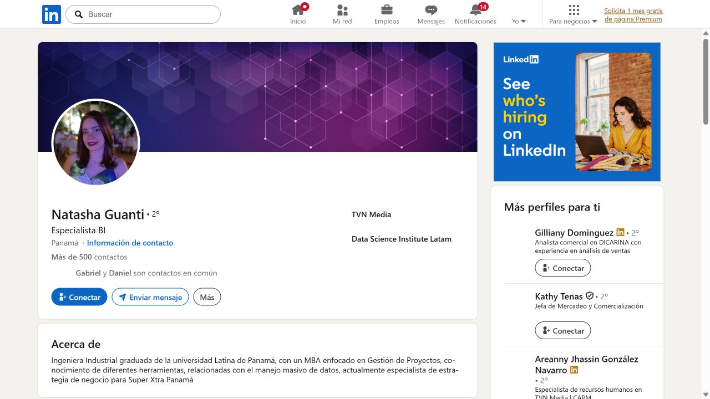

**Senal visible:** Natasha Guanti • 2º Especialista BI Panamá, Panamá, Panamá Actual: Especialista BI en TVN Media Daniel Wen Lay y Gabriel Caballero son contactos en común

**Por que encaja con Esteban:** perfil conectado con busquedas de datos, BI, automatizacion, IA o etapa junior/estudiantil. Es el tipo de contacto que puede generar conversaciones naturales sobre aprendizaje, proyectos, herramientas y oportunidades en analitica.

**Valor potencial para conseguir clientes B2B:** aunque no todos son decisores, pueden abrir puertas a equipos, profesores, comunidades, startups o empresas donde se usan datos y automatizacion. Para Esteban sirve como red puente: aprender, comentar, colaborar y detectar oportunidades tempranas.

**Mensaje sugerido para enviar manualmente:**

> Hola Natasha, vi tu perfil y me llamo la atencion tu enfoque en datos/tecnologia. Estoy conectando con personas de LATAM que tambien esten creciendo en analitica, automatizacion e IA. Me gustaria conectar y seguir aprendiendo de lo que compartes.

<strong>73. Roderik Acevedo • 2º</strong> - Business intelligence / Power BI

**Link de perfil:** [Abrir perfil de LinkedIn](https://www.linkedin.com/in/roderik-acevedo)

**Senal visible:** Roderik Acevedo • 2º Senior Data Engineer @ Yappy - Software Engineer Panamá, Panamá Anterior: Business Intelligence Consultant en H&CO, LLP Daniel Wen Lay, Fernando Cutire y 1 contacto más en común

**Por que encaja con Esteban:** perfil conectado con busquedas de datos, BI, automatizacion, IA o etapa junior/estudiantil. Es el tipo de contacto que puede generar conversaciones naturales sobre aprendizaje, proyectos, herramientas y oportunidades en analitica.

**Valor potencial para conseguir clientes B2B:** aunque no todos son decisores, pueden abrir puertas a equipos, profesores, comunidades, startups o empresas donde se usan datos y automatizacion. Para Esteban sirve como red puente: aprender, comentar, colaborar y detectar oportunidades tempranas.

**Mensaje sugerido para enviar manualmente:**

> Hola Roderik, vi tu perfil y me llamo la atencion tu enfoque en datos/tecnologia. Estoy conectando con personas de LATAM que tambien esten creciendo en analitica, automatizacion e IA. Me gustaria conectar y seguir aprendiendo de lo que compartes.

<strong>74. Nathalie Cedeño</strong> - IA y machine learning

**Link de perfil:** [Abrir perfil de LinkedIn](https://www.linkedin.com/in/cedenonathalie)

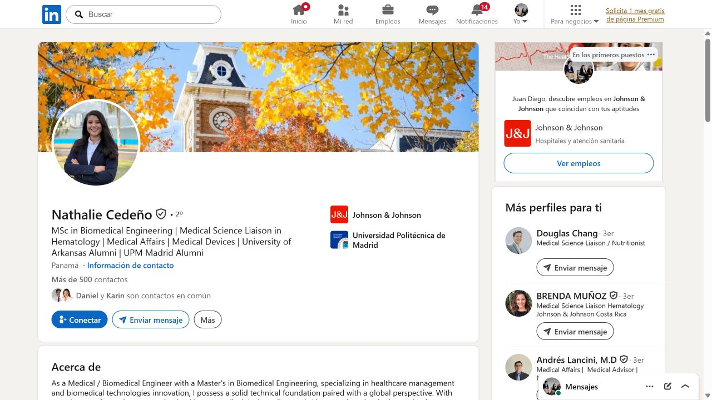

**Senal visible:** Nathalie Cedeño • 2º MSc in Biomedical Engineering | Medical Science Liaison in Hematology | Medical Affairs | Medical Devices | University of Arkansas Alumni | UPM Madrid Alumni Panamá, Panamá, Panamá Actual: Medical Science Liaison en Johnson & Johnson Ka...

**Por que encaja con Esteban:** perfil conectado con busquedas de datos, BI, automatizacion, IA o etapa junior/estudiantil. Es el tipo de contacto que puede generar conversaciones naturales sobre aprendizaje, proyectos, herramientas y oportunidades en analitica.

**Valor potencial para conseguir clientes B2B:** aunque no todos son decisores, pueden abrir puertas a equipos, profesores, comunidades, startups o empresas donde se usan datos y automatizacion. Para Esteban sirve como red puente: aprender, comentar, colaborar y detectar oportunidades tempranas.

**Mensaje sugerido para enviar manualmente:**

> Hola Nathalie, vi tu perfil y me llamo la atencion tu enfoque en datos/tecnologia. Estoy conectando con personas de LATAM que tambien esten creciendo en analitica, automatizacion e IA. Me gustaria conectar y seguir aprendiendo de lo que compartes.

<strong>75. Karolayn M. • 2º Senior Data Engineer at P&G Panamá, Panamá</strong> - Datos, analitica y tecnologia

**Link de perfil:** [Abrir perfil de LinkedIn](https://www.linkedin.com/in/kmoralescastillo)

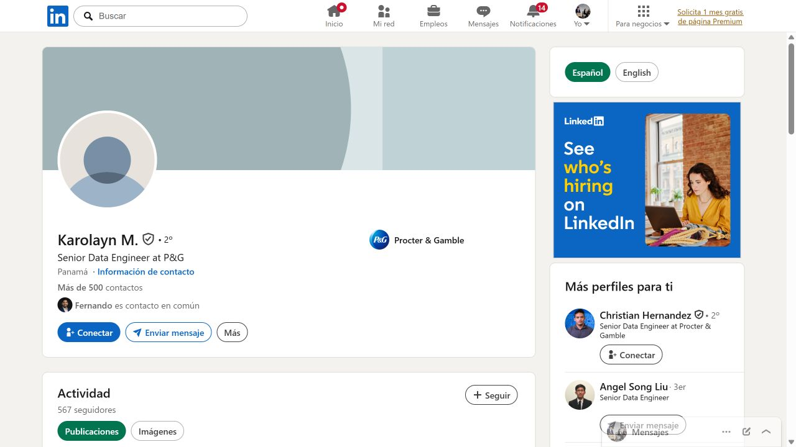

**Senal visible:** Karolayn M. • 2º Senior Data Engineer at P&G Panamá, Panamá Anterior: Analista de Analytics - Equipo de innovación en Accenture Fernando Cutire es contacto en común

**Por que encaja con Esteban:** perfil conectado con busquedas de datos, BI, automatizacion, IA o etapa junior/estudiantil. Es el tipo de contacto que puede generar conversaciones naturales sobre aprendizaje, proyectos, herramientas y oportunidades en analitica.

**Valor potencial para conseguir clientes B2B:** aunque no todos son decisores, pueden abrir puertas a equipos, profesores, comunidades, startups o empresas donde se usan datos y automatizacion. Para Esteban sirve como red puente: aprender, comentar, colaborar y detectar oportunidades tempranas.

**Mensaje sugerido para enviar manualmente:**

> Hola Karolayn, vi tu perfil y me llamo la atencion tu enfoque en datos/tecnologia. Estoy conectando con personas de LATAM que tambien esten creciendo en analitica, automatizacion e IA. Me gustaria conectar y seguir aprendiendo de lo que compartes.

<strong>76. Gabriel Gomez • 2º BI Data Analyst Consultant Panamá</strong> - Business intelligence / Power BI

**Link de perfil:** [Abrir perfil de LinkedIn](https://www.linkedin.com/in/gabriel-gomez-547182b7)

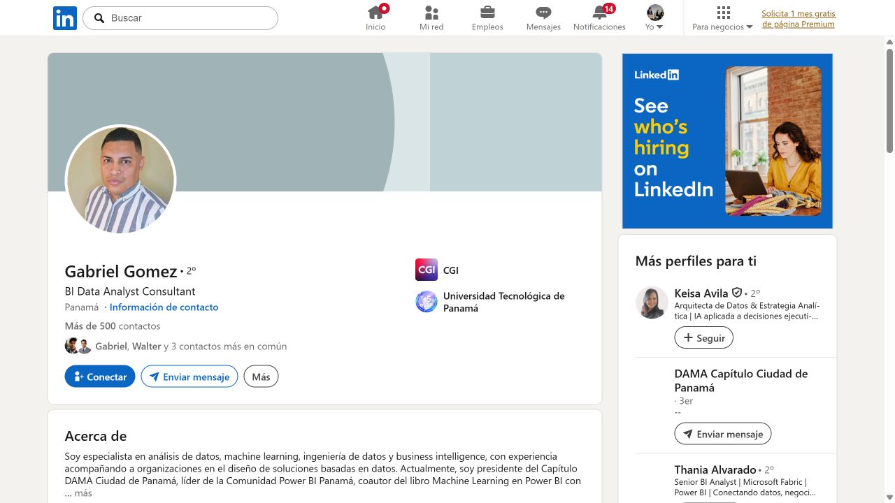

**Senal visible:** Gabriel Gomez • 2º BI Data Analyst Consultant Panamá Actual: Co-Lead Comunidad Power BI Panamá en Comunidad Power BI Panamá Antonio Sánchez De Boeck, Daniel Wen Lay y 3 contactos más en común

**Por que encaja con Esteban:** perfil conectado con busquedas de datos, BI, automatizacion, IA o etapa junior/estudiantil. Es el tipo de contacto que puede generar conversaciones naturales sobre aprendizaje, proyectos, herramientas y oportunidades en analitica.

**Valor potencial para conseguir clientes B2B:** aunque no todos son decisores, pueden abrir puertas a equipos, profesores, comunidades, startups o empresas donde se usan datos y automatizacion. Para Esteban sirve como red puente: aprender, comentar, colaborar y detectar oportunidades tempranas.

**Mensaje sugerido para enviar manualmente:**

> Hola Gabriel, vi tu perfil y me llamo la atencion tu enfoque en datos/tecnologia. Estoy conectando con personas de LATAM que tambien esten creciendo en analitica, automatizacion e IA. Me gustaria conectar y seguir aprendiendo de lo que compartes.

<strong>77. Alejandro Polo •</strong> - Automatizacion y procesos

**Link de perfil:** [Abrir perfil de LinkedIn](https://www.linkedin.com/in/alejandro-polo-44636b2b4)

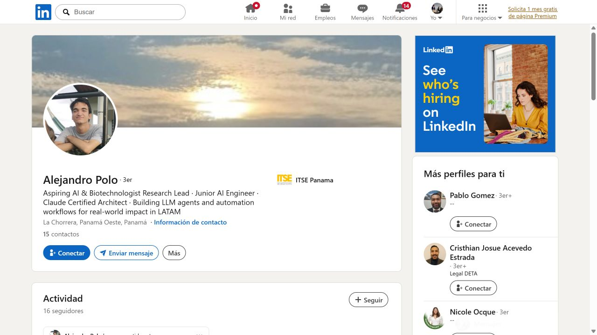

**Senal visible:** Alejandro Polo • 3er+ Aspiring AI & Biotechnologist Research Lead · Junior AI Engineer · Claude Certified Architect · Building LLM agents and automation workflows for real-world impact in LATAM La Chorrera, Panamá Oeste, Panamá Actual: Student en ITSE Panama

**Por que encaja con Esteban:** perfil conectado con busquedas de datos, BI, automatizacion, IA o etapa junior/estudiantil. Es el tipo de contacto que puede generar conversaciones naturales sobre aprendizaje, proyectos, herramientas y oportunidades en analitica.

**Valor potencial para conseguir clientes B2B:** aunque no todos son decisores, pueden abrir puertas a equipos, profesores, comunidades, startups o empresas donde se usan datos y automatizacion. Para Esteban sirve como red puente: aprender, comentar, colaborar y detectar oportunidades tempranas.

**Mensaje sugerido para enviar manualmente:**

> Hola Alejandro, vi tu perfil y me llamo la atencion tu enfoque en datos/tecnologia. Estoy conectando con personas de LATAM que tambien esten creciendo en analitica, automatizacion e IA. Me gustaria conectar y seguir aprendiendo de lo que compartes.

<strong>78. Valerie Martínez Pulido •</strong> - Estudiante / analitica de datos

**Link de perfil:** [Abrir perfil de LinkedIn](https://www.linkedin.com/in/valeriemtz)

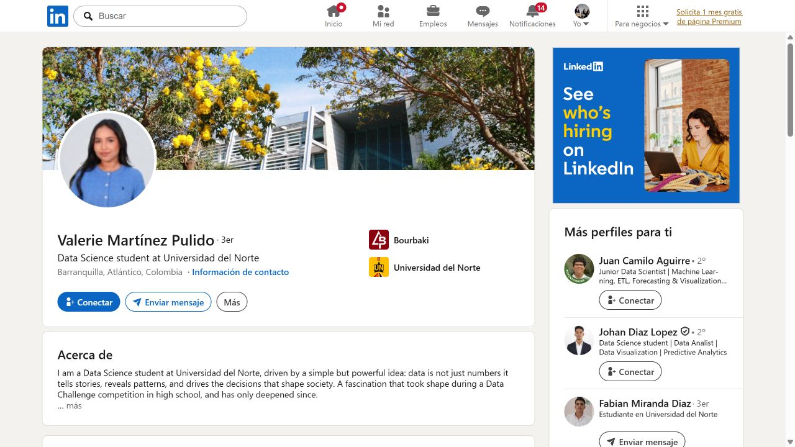

**Senal visible:** Valerie Martínez Pulido • 3er+ Data Science student at Universidad del Norte Barranquilla, Atlántico, Colombia Actual: Communications Team Member en Bourbaki - …Mathematics Student Group. Contributed to content strategy…

**Por que encaja con Esteban:** perfil conectado con busquedas de datos, BI, automatizacion, IA o etapa junior/estudiantil. Es el tipo de contacto que puede generar conversaciones naturales sobre aprendizaje, proyectos, herramientas y oportunidades en analitica.

**Valor potencial para conseguir clientes B2B:** aunque no todos son decisores, pueden abrir puertas a equipos, profesores, comunidades, startups o empresas donde se usan datos y automatizacion. Para Esteban sirve como red puente: aprender, comentar, colaborar y detectar oportunidades tempranas.

**Mensaje sugerido para enviar manualmente:**

> Hola Valerie, vi tu perfil y me llamo la atencion tu enfoque en datos/tecnologia. Estoy conectando con personas de LATAM que tambien esten creciendo en analitica, automatizacion e IA. Me gustaria conectar y seguir aprendiendo de lo que compartes.

<strong>79. Félix Antonio Lámbiz Núñez</strong> - Automatizacion y procesos

**Link de perfil:** [Abrir perfil de LinkedIn](https://www.linkedin.com/in/felixlambiz)

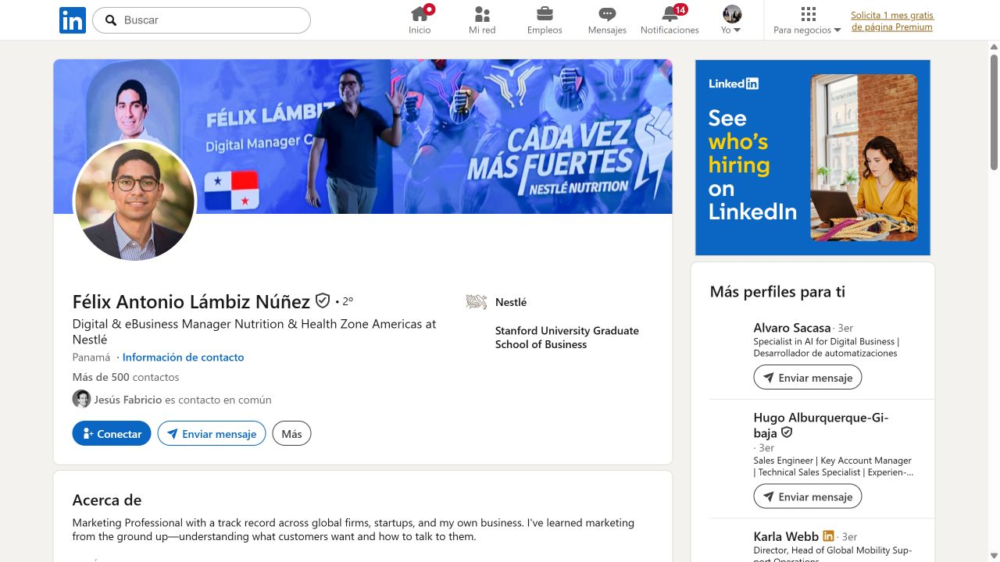

**Senal visible:** Félix Antonio Lámbiz Núñez • 2º Digital & eBusiness Manager Nutrition & Health Zone Americas at Nestlé Panamá, Panamá, Panamá Anterior: Sales and Marketing Manager en Gogetit - Bienes raices Panama Jesus Maradiaga es contacto en común

**Por que encaja con Esteban:** perfil conectado con busquedas de datos, BI, automatizacion, IA o etapa junior/estudiantil. Es el tipo de contacto que puede generar conversaciones naturales sobre aprendizaje, proyectos, herramientas y oportunidades en analitica.

**Valor potencial para conseguir clientes B2B:** aunque no todos son decisores, pueden abrir puertas a equipos, profesores, comunidades, startups o empresas donde se usan datos y automatizacion. Para Esteban sirve como red puente: aprender, comentar, colaborar y detectar oportunidades tempranas.

**Mensaje sugerido para enviar manualmente:**

> Hola Flix, vi tu perfil y me llamo la atencion tu enfoque en datos/tecnologia. Estoy conectando con personas de LATAM que tambien esten creciendo en analitica, automatizacion e IA. Me gustaria conectar y seguir aprendiendo de lo que compartes.

<strong>80. Jesus Maradiaga</strong> - Automatizacion y procesos

**Link de perfil:** [Abrir perfil de LinkedIn](https://www.linkedin.com/in/jesusmaradiaga/es)

**Senal visible:** Félix Antonio Lámbiz Núñez • 2º Digital & eBusiness Manager Nutrition & Health Zone Americas at Nestlé Panamá, Panamá, Panamá Anterior: Sales and Marketing Manager en Gogetit - Bienes raices Panama Jesus Maradiaga es contacto en común

**Por que encaja con Esteban:** perfil conectado con busquedas de datos, BI, automatizacion, IA o etapa junior/estudiantil. Es el tipo de contacto que puede generar conversaciones naturales sobre aprendizaje, proyectos, herramientas y oportunidades en analitica.

**Valor potencial para conseguir clientes B2B:** aunque no todos son decisores, pueden abrir puertas a equipos, profesores, comunidades, startups o empresas donde se usan datos y automatizacion. Para Esteban sirve como red puente: aprender, comentar, colaborar y detectar oportunidades tempranas.

**Mensaje sugerido para enviar manualmente:**

> Hola Jesus, vi tu perfil y me llamo la atencion tu enfoque en datos/tecnologia. Estoy conectando con personas de LATAM que tambien esten creciendo en analitica, automatizacion e IA. Me gustaria conectar y seguir aprendiendo de lo que compartes.

<strong>81. Ricardo Díaz Peñaloza</strong> - Business intelligence / Power BI

**Link de perfil:** [Abrir perfil de LinkedIn](https://www.linkedin.com/in/ricardodiazp)

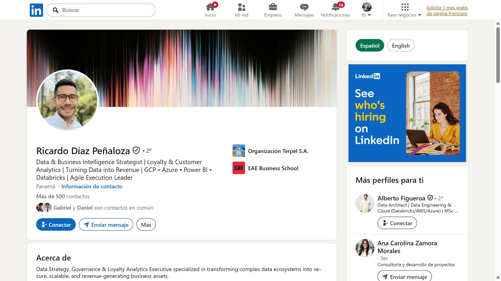

**Senal visible:** Ricardo Díaz Peñaloza • 2º Data & Business Intelligence Strategist | Loyalty & Customer Analytics | Turning Data into Revenue | GCP • Azure • Power BI • Databricks | Agile Execution Leader Panamá Actual: Chief Business Intelligence en Organización Terpel S....

**Por que encaja con Esteban:** perfil conectado con busquedas de datos, BI, automatizacion, IA o etapa junior/estudiantil. Es el tipo de contacto que puede generar conversaciones naturales sobre aprendizaje, proyectos, herramientas y oportunidades en analitica.

**Valor potencial para conseguir clientes B2B:** aunque no todos son decisores, pueden abrir puertas a equipos, profesores, comunidades, startups o empresas donde se usan datos y automatizacion. Para Esteban sirve como red puente: aprender, comentar, colaborar y detectar oportunidades tempranas.

**Mensaje sugerido para enviar manualmente:**

> Hola Ricardo, vi tu perfil y me llamo la atencion tu enfoque en datos/tecnologia. Estoy conectando con personas de LATAM que tambien esten creciendo en analitica, automatizacion e IA. Me gustaria conectar y seguir aprendiendo de lo que compartes.

<strong>82. Celso Araúz Batista</strong> - Business intelligence / Power BI

**Link de perfil:** [Abrir perfil de LinkedIn](https://www.linkedin.com/in/celso-ara%C3%BAz-batista-5148ab225)

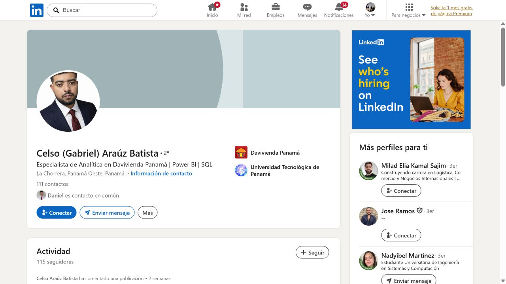

**Senal visible:** Celso Araúz Batista • 2º

**Por que encaja con Esteban:** perfil conectado con busquedas de datos, BI, automatizacion, IA o etapa junior/estudiantil. Es el tipo de contacto que puede generar conversaciones naturales sobre aprendizaje, proyectos, herramientas y oportunidades en analitica.

**Valor potencial para conseguir clientes B2B:** aunque no todos son decisores, pueden abrir puertas a equipos, profesores, comunidades, startups o empresas donde se usan datos y automatizacion. Para Esteban sirve como red puente: aprender, comentar, colaborar y detectar oportunidades tempranas.

**Mensaje sugerido para enviar manualmente:**

> Hola Celso, vi tu perfil y me llamo la atencion tu enfoque en datos/tecnologia. Estoy conectando con personas de LATAM que tambien esten creciendo en analitica, automatizacion e IA. Me gustaria conectar y seguir aprendiendo de lo que compartes.

<strong>83. Alvaro Zarak Tovar •</strong> - Estudiante / analitica de datos

**Link de perfil:** [Abrir perfil de LinkedIn](https://www.linkedin.com/in/alvarozaraktovar/es)

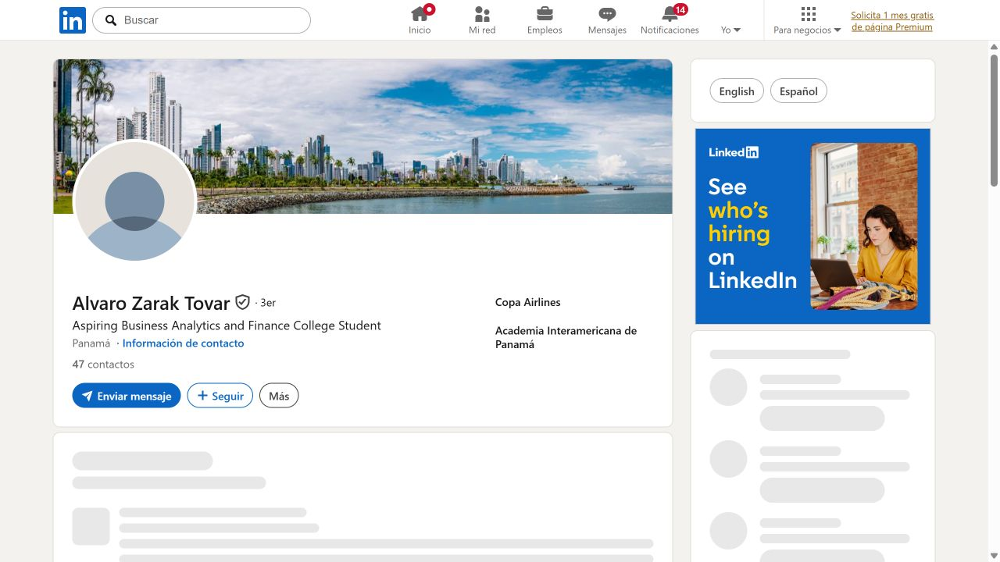

**Senal visible:** Alvaro Zarak Tovar • 3er+ Estudiante en la Academia Intermericana de Panamá Panamá, Panamá, Panamá Enviar mensaje Resumen: …in Business Analytics, Finance, and entrepreneurship…

**Por que encaja con Esteban:** perfil conectado con busquedas de datos, BI, automatizacion, IA o etapa junior/estudiantil. Es el tipo de contacto que puede generar conversaciones naturales sobre aprendizaje, proyectos, herramientas y oportunidades en analitica.

**Valor potencial para conseguir clientes B2B:** aunque no todos son decisores, pueden abrir puertas a equipos, profesores, comunidades, startups o empresas donde se usan datos y automatizacion. Para Esteban sirve como red puente: aprender, comentar, colaborar y detectar oportunidades tempranas.

**Mensaje sugerido para enviar manualmente:**

> Hola Alvaro, vi tu perfil y me llamo la atencion tu enfoque en datos/tecnologia. Estoy conectando con personas de LATAM que tambien esten creciendo en analitica, automatizacion e IA. Me gustaria conectar y seguir aprendiendo de lo que compartes.

<strong>84. Haneff Botello Franco •</strong> - Estudiante / analitica de datos

**Link de perfil:** [Abrir perfil de LinkedIn](https://www.linkedin.com/in/nessinhbf)

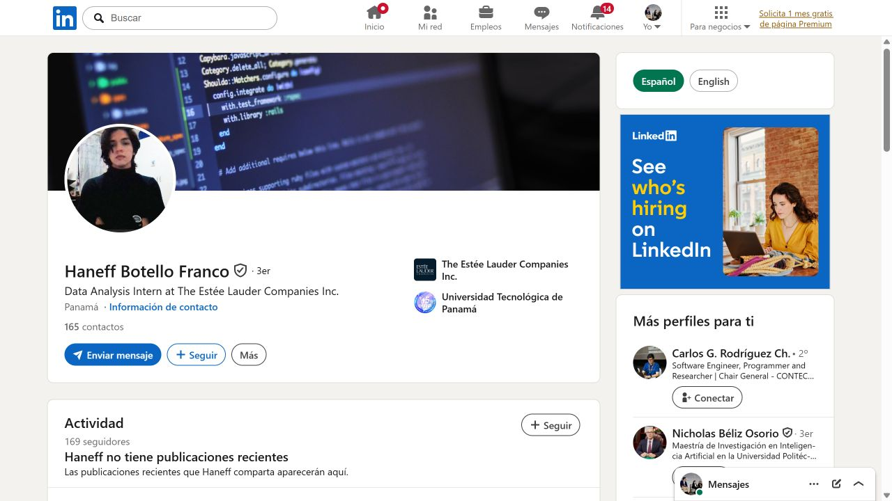

**Senal visible:** Haneff Botello Franco • 3er+ Data Analysis Intern at The Estée Lauder Companies Inc. Panamá, Panamá, Panamá Enviar mensaje Actual: Data Science Intern en The Estée Lauder Companies Inc.

**Por que encaja con Esteban:** perfil conectado con busquedas de datos, BI, automatizacion, IA o etapa junior/estudiantil. Es el tipo de contacto que puede generar conversaciones naturales sobre aprendizaje, proyectos, herramientas y oportunidades en analitica.

**Valor potencial para conseguir clientes B2B:** aunque no todos son decisores, pueden abrir puertas a equipos, profesores, comunidades, startups o empresas donde se usan datos y automatizacion. Para Esteban sirve como red puente: aprender, comentar, colaborar y detectar oportunidades tempranas.

**Mensaje sugerido para enviar manualmente:**

> Hola Haneff, vi tu perfil y me llamo la atencion tu enfoque en datos/tecnologia. Estoy conectando con personas de LATAM que tambien esten creciendo en analitica, automatizacion e IA. Me gustaria conectar y seguir aprendiendo de lo que compartes.

<strong>85. Angel L. Pinzon</strong> - Automatizacion y procesos

**Link de perfil:** [Abrir perfil de LinkedIn](https://www.linkedin.com/in/angel-pinzon-6715852a0/es)

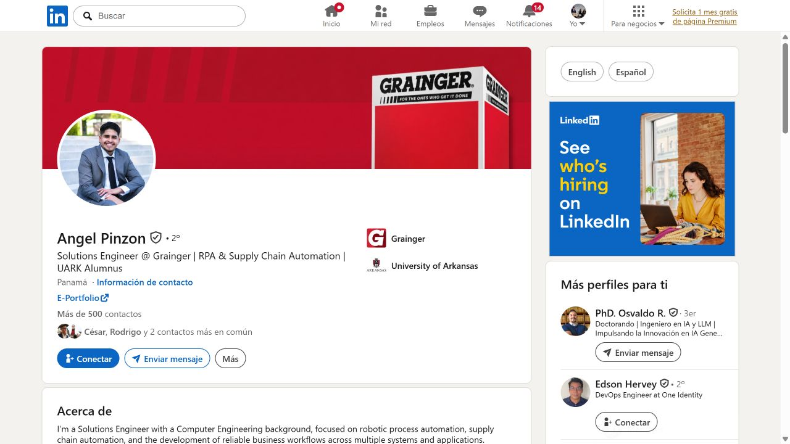

**Senal visible:** Angel L. Pinzon • 2º Systems Engineer @ Wallner Expac Inc. | Computer Engineer | UARK Alumnus Panamá, Panamá, Panamá Actual: Solutions Engineer en Grainger - Member of Grainger’s Supply Chain Automation team… César González Camargo, Fernando Cutire y 2 cont...

**Por que encaja con Esteban:** perfil conectado con busquedas de datos, BI, automatizacion, IA o etapa junior/estudiantil. Es el tipo de contacto que puede generar conversaciones naturales sobre aprendizaje, proyectos, herramientas y oportunidades en analitica.

**Valor potencial para conseguir clientes B2B:** aunque no todos son decisores, pueden abrir puertas a equipos, profesores, comunidades, startups o empresas donde se usan datos y automatizacion. Para Esteban sirve como red puente: aprender, comentar, colaborar y detectar oportunidades tempranas.

**Mensaje sugerido para enviar manualmente:**

> Hola Angel, vi tu perfil y me llamo la atencion tu enfoque en datos/tecnologia. Estoy conectando con personas de LATAM que tambien esten creciendo en analitica, automatizacion e IA. Me gustaria conectar y seguir aprendiendo de lo que compartes.

<strong>86. César González Camargo</strong> - Automatizacion y procesos

**Link de perfil:** [Abrir perfil de LinkedIn](https://www.linkedin.com/in/cg-0430-pa)

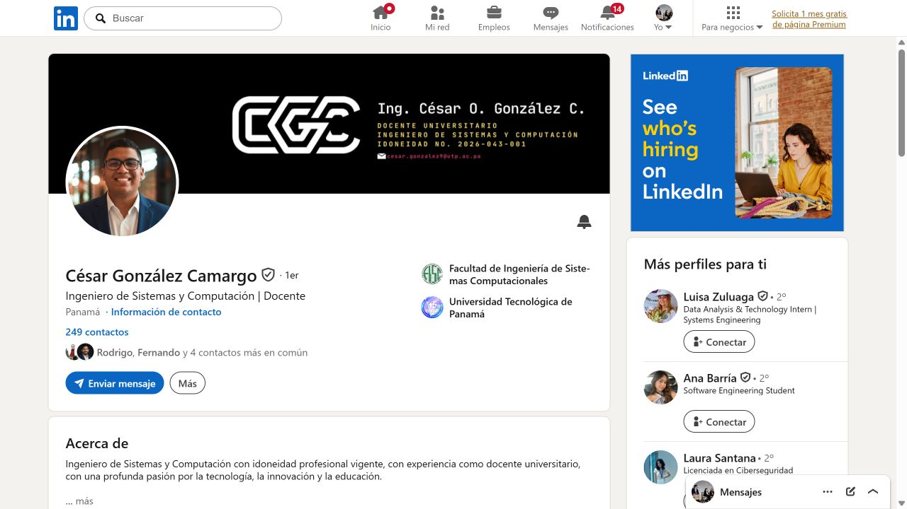

**Senal visible:** Angel L. Pinzon • 2º Systems Engineer @ Wallner Expac Inc. | Computer Engineer | UARK Alumnus Panamá, Panamá, Panamá Actual: Solutions Engineer en Grainger - Member of Grainger’s Supply Chain Automation team… César González Camargo, Fernando Cutire y 2 cont...

**Por que encaja con Esteban:** perfil conectado con busquedas de datos, BI, automatizacion, IA o etapa junior/estudiantil. Es el tipo de contacto que puede generar conversaciones naturales sobre aprendizaje, proyectos, herramientas y oportunidades en analitica.

**Valor potencial para conseguir clientes B2B:** aunque no todos son decisores, pueden abrir puertas a equipos, profesores, comunidades, startups o empresas donde se usan datos y automatizacion. Para Esteban sirve como red puente: aprender, comentar, colaborar y detectar oportunidades tempranas.

**Mensaje sugerido para enviar manualmente:**

> Hola Csar, vi tu perfil y me llamo la atencion tu enfoque en datos/tecnologia. Estoy conectando con personas de LATAM que tambien esten creciendo en analitica, automatizacion e IA. Me gustaria conectar y seguir aprendiendo de lo que compartes.

<strong>87. Michael Lopez</strong> - Business intelligence / Power BI

**Link de perfil:** [Abrir perfil de LinkedIn](https://www.linkedin.com/in/michael-lopez-b049a12a8)

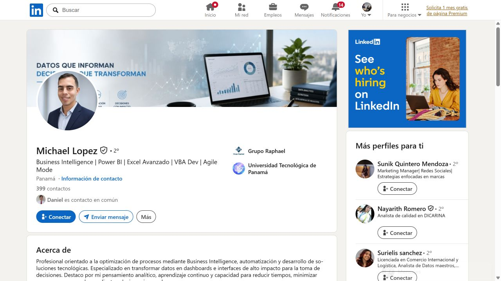

**Senal visible:** Michael Lopez • 2º Business Intelligence | Power BI | Excel Avanzado | VBA Dev | Agile Mode Panamá, Panamá, Panamá Actual: Business Intelligence en Grupo Raphael Daniel Wen Lay es contacto en común

**Por que encaja con Esteban:** perfil conectado con busquedas de datos, BI, automatizacion, IA o etapa junior/estudiantil. Es el tipo de contacto que puede generar conversaciones naturales sobre aprendizaje, proyectos, herramientas y oportunidades en analitica.

**Valor potencial para conseguir clientes B2B:** aunque no todos son decisores, pueden abrir puertas a equipos, profesores, comunidades, startups o empresas donde se usan datos y automatizacion. Para Esteban sirve como red puente: aprender, comentar, colaborar y detectar oportunidades tempranas.

**Mensaje sugerido para enviar manualmente:**

> Hola Michael, vi tu perfil y me llamo la atencion tu enfoque en datos/tecnologia. Estoy conectando con personas de LATAM que tambien esten creciendo en analitica, automatizacion e IA. Me gustaria conectar y seguir aprendiendo de lo que compartes.

<strong>88. Martha Alejandra Tarantino</strong> - IA y machine learning

**Link de perfil:** [Abrir perfil de LinkedIn](https://www.linkedin.com/in/martha-alejandra-tarantino/es)

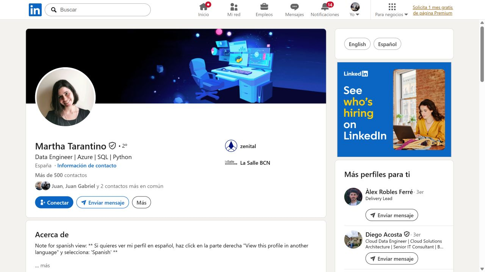

**Senal visible:** Martha Alejandra Tarantino • 2º Data Engineer | Azure | SQL | Python España Actual: Lead Data Engineer en zenital Juan Gabriel Gomila Salas, Bruno De Cruz y 2 contactos más en común

**Por que encaja con Esteban:** perfil conectado con busquedas de datos, BI, automatizacion, IA o etapa junior/estudiantil. Es el tipo de contacto que puede generar conversaciones naturales sobre aprendizaje, proyectos, herramientas y oportunidades en analitica.

**Valor potencial para conseguir clientes B2B:** aunque no todos son decisores, pueden abrir puertas a equipos, profesores, comunidades, startups o empresas donde se usan datos y automatizacion. Para Esteban sirve como red puente: aprender, comentar, colaborar y detectar oportunidades tempranas.

**Mensaje sugerido para enviar manualmente:**

> Hola Martha, vi tu perfil y me llamo la atencion tu enfoque en datos/tecnologia. Estoy conectando con personas de LATAM que tambien esten creciendo en analitica, automatizacion e IA. Me gustaria conectar y seguir aprendiendo de lo que compartes.

<strong>89. Juan Gabriel Gomila Salas</strong> - IA y machine learning

**Link de perfil:** [Abrir perfil de LinkedIn](https://www.linkedin.com/in/juan-gabriel-gomila-salas)

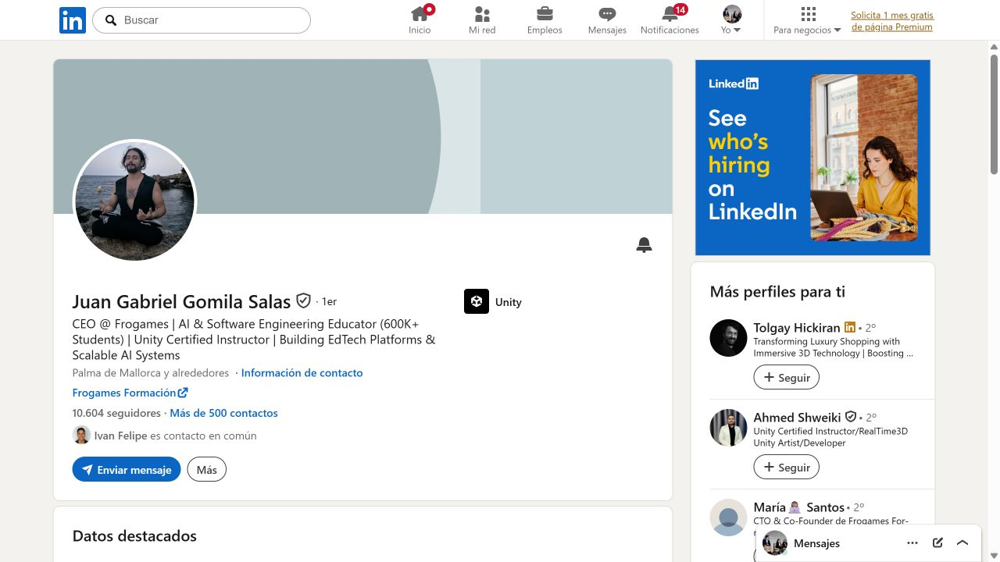

**Senal visible:** Martha Alejandra Tarantino • 2º Data Engineer | Azure | SQL | Python España Actual: Lead Data Engineer en zenital Juan Gabriel Gomila Salas, Bruno De Cruz y 2 contactos más en común

**Por que encaja con Esteban:** perfil conectado con busquedas de datos, BI, automatizacion, IA o etapa junior/estudiantil. Es el tipo de contacto que puede generar conversaciones naturales sobre aprendizaje, proyectos, herramientas y oportunidades en analitica.

**Valor potencial para conseguir clientes B2B:** aunque no todos son decisores, pueden abrir puertas a equipos, profesores, comunidades, startups o empresas donde se usan datos y automatizacion. Para Esteban sirve como red puente: aprender, comentar, colaborar y detectar oportunidades tempranas.

**Mensaje sugerido para enviar manualmente:**

> Hola Juan, vi tu perfil y me llamo la atencion tu enfoque en datos/tecnologia. Estoy conectando con personas de LATAM que tambien esten creciendo en analitica, automatizacion e IA. Me gustaria conectar y seguir aprendiendo de lo que compartes.

<strong>90. Bruno De Cruz</strong> - IA y machine learning

**Link de perfil:** [Abrir perfil de LinkedIn](https://www.linkedin.com/in/bruno-de-cruz/es)

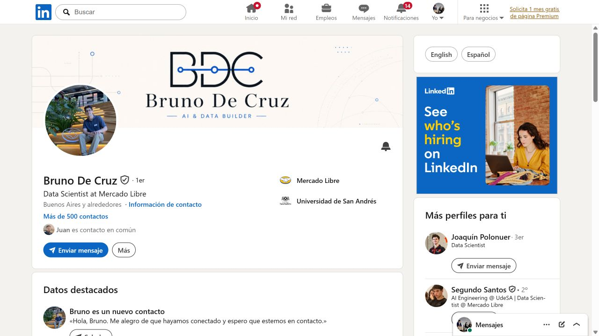

**Senal visible:** Martha Alejandra Tarantino • 2º Data Engineer | Azure | SQL | Python España Actual: Lead Data Engineer en zenital Juan Gabriel Gomila Salas, Bruno De Cruz y 2 contactos más en común

**Por que encaja con Esteban:** perfil conectado con busquedas de datos, BI, automatizacion, IA o etapa junior/estudiantil. Es el tipo de contacto que puede generar conversaciones naturales sobre aprendizaje, proyectos, herramientas y oportunidades en analitica.

**Valor potencial para conseguir clientes B2B:** aunque no todos son decisores, pueden abrir puertas a equipos, profesores, comunidades, startups o empresas donde se usan datos y automatizacion. Para Esteban sirve como red puente: aprender, comentar, colaborar y detectar oportunidades tempranas.

**Mensaje sugerido para enviar manualmente:**

> Hola Bruno, vi tu perfil y me llamo la atencion tu enfoque en datos/tecnologia. Estoy conectando con personas de LATAM que tambien esten creciendo en analitica, automatizacion e IA. Me gustaria conectar y seguir aprendiendo de lo que compartes.

<strong>91. Sheyla Díaz • 2º Data Discovery Lead @ Data Strategy Perú</strong> - Business intelligence / Power BI

**Link de perfil:** [Abrir perfil de LinkedIn](https://www.linkedin.com/in/sdiazmuguruza)

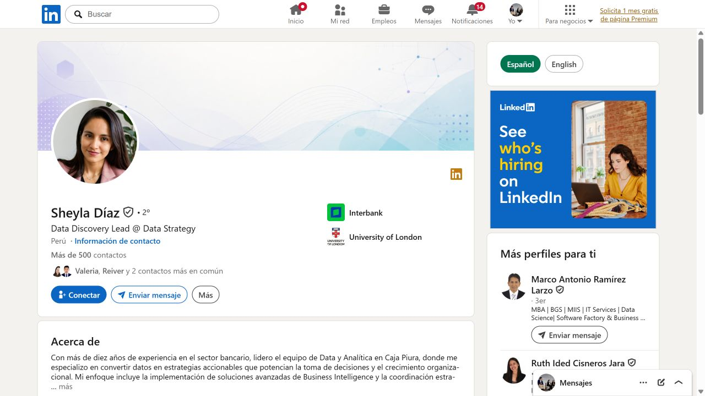

**Senal visible:** Sheyla Díaz • 2º Data Discovery Lead @ Data Strategy Perú Anterior: Business Intelligence Intern en Belcorp Reiver Lopez, Valeria Alzamora Caipane y 2 contactos más en común

**Por que encaja con Esteban:** perfil conectado con busquedas de datos, BI, automatizacion, IA o etapa junior/estudiantil. Es el tipo de contacto que puede generar conversaciones naturales sobre aprendizaje, proyectos, herramientas y oportunidades en analitica.

**Valor potencial para conseguir clientes B2B:** aunque no todos son decisores, pueden abrir puertas a equipos, profesores, comunidades, startups o empresas donde se usan datos y automatizacion. Para Esteban sirve como red puente: aprender, comentar, colaborar y detectar oportunidades tempranas.

**Mensaje sugerido para enviar manualmente:**

> Hola Sheyla, vi tu perfil y me llamo la atencion tu enfoque en datos/tecnologia. Estoy conectando con personas de LATAM que tambien esten creciendo en analitica, automatizacion e IA. Me gustaria conectar y seguir aprendiendo de lo que compartes.

<strong>92. Dayana Juárez • 2º Analista de Cumplimiento Panamá, Panamá, Panamá</strong> - Business intelligence / Power BI

**Link de perfil:** [Abrir perfil de LinkedIn](https://www.linkedin.com/in/dayana-ju%C3%A1rez-66007a186)

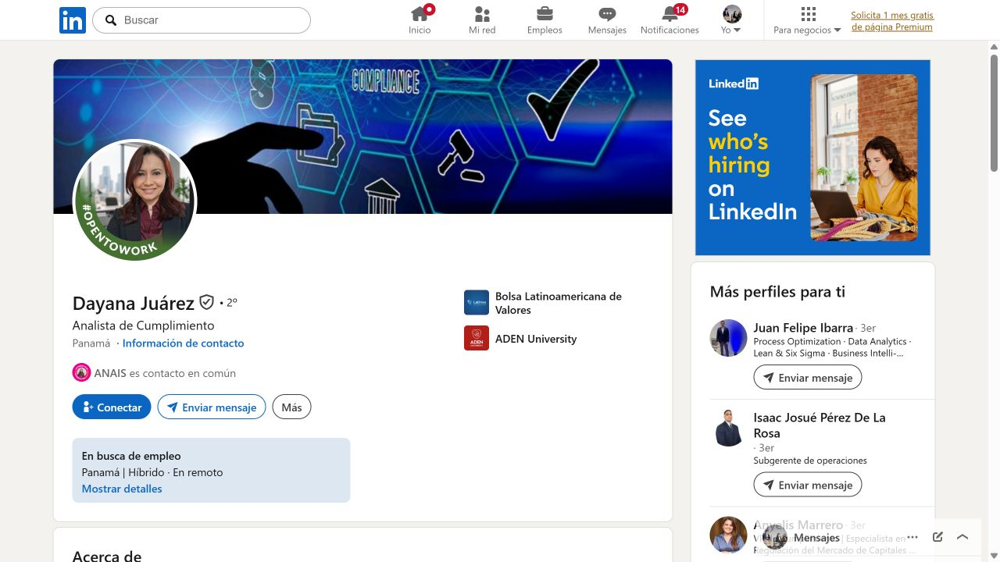

**Senal visible:** Dayana Juárez • 2º Analista de Cumplimiento Panamá, Panamá, Panamá Actual: Analista de Cumplimiento en Bolsa Latinoamericana de Valores ANAIS CASTILLO QUIROZ es contacto en común

**Por que encaja con Esteban:** perfil conectado con busquedas de datos, BI, automatizacion, IA o etapa junior/estudiantil. Es el tipo de contacto que puede generar conversaciones naturales sobre aprendizaje, proyectos, herramientas y oportunidades en analitica.

**Valor potencial para conseguir clientes B2B:** aunque no todos son decisores, pueden abrir puertas a equipos, profesores, comunidades, startups o empresas donde se usan datos y automatizacion. Para Esteban sirve como red puente: aprender, comentar, colaborar y detectar oportunidades tempranas.

**Mensaje sugerido para enviar manualmente:**

> Hola Dayana, vi tu perfil y me llamo la atencion tu enfoque en datos/tecnologia. Estoy conectando con personas de LATAM que tambien esten creciendo en analitica, automatizacion e IA. Me gustaria conectar y seguir aprendiendo de lo que compartes.

<strong>93. Mario Bustillo</strong> - Automatizacion y procesos

**Link de perfil:** [Abrir perfil de LinkedIn](https://www.linkedin.com/in/mario-bustillo)

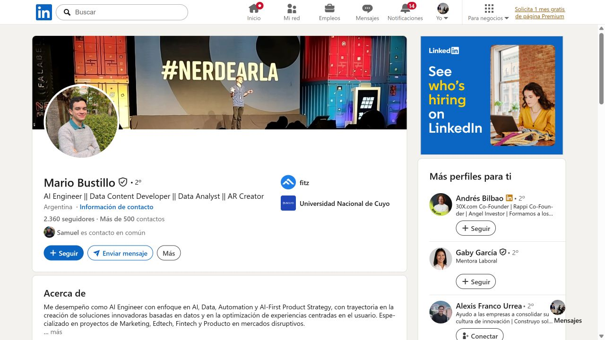

**Senal visible:** Mario Bustillo • 2º AI Engineer || Data Content Developer || Data Analyst || AR Creator Argentina Seguir Actual: AI Engineer & Data Analyst en fitz Samuel Santa es contacto en común · 2 mil seguidores

**Por que encaja con Esteban:** perfil conectado con busquedas de datos, BI, automatizacion, IA o etapa junior/estudiantil. Es el tipo de contacto que puede generar conversaciones naturales sobre aprendizaje, proyectos, herramientas y oportunidades en analitica.

**Valor potencial para conseguir clientes B2B:** aunque no todos son decisores, pueden abrir puertas a equipos, profesores, comunidades, startups o empresas donde se usan datos y automatizacion. Para Esteban sirve como red puente: aprender, comentar, colaborar y detectar oportunidades tempranas.

**Mensaje sugerido para enviar manualmente:**

> Hola Mario, vi tu perfil y me llamo la atencion tu enfoque en datos/tecnologia. Estoy conectando con personas de LATAM que tambien esten creciendo en analitica, automatizacion e IA. Me gustaria conectar y seguir aprendiendo de lo que compartes.

<strong>94. Samuel Santa</strong> - Automatizacion y procesos

**Link de perfil:** [Abrir perfil de LinkedIn](https://www.linkedin.com/in/devsanta)

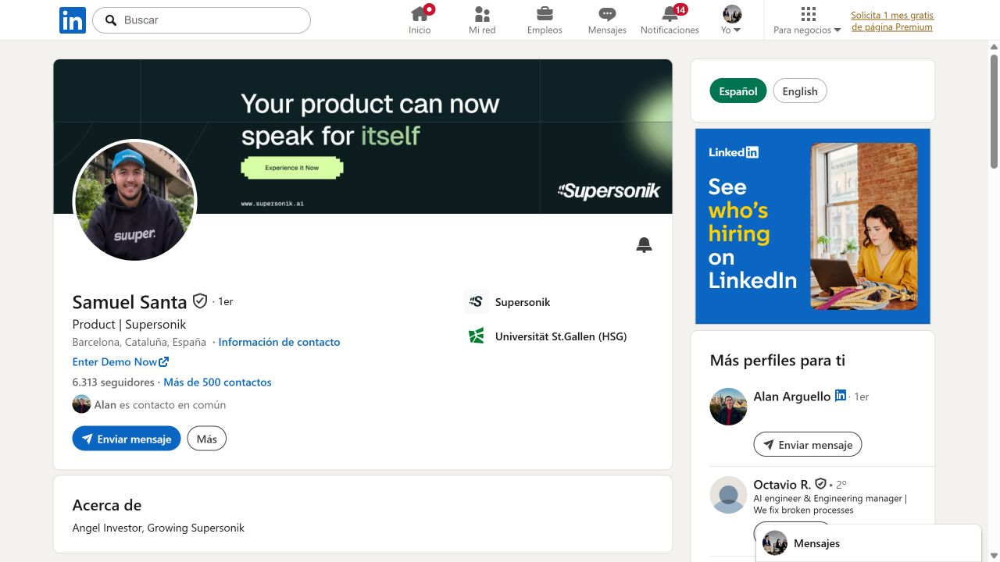

**Senal visible:** Mario Bustillo • 2º AI Engineer || Data Content Developer || Data Analyst || AR Creator Argentina Seguir Actual: AI Engineer & Data Analyst en fitz Samuel Santa es contacto en común · 2 mil seguidores

**Por que encaja con Esteban:** perfil conectado con busquedas de datos, BI, automatizacion, IA o etapa junior/estudiantil. Es el tipo de contacto que puede generar conversaciones naturales sobre aprendizaje, proyectos, herramientas y oportunidades en analitica.

**Valor potencial para conseguir clientes B2B:** aunque no todos son decisores, pueden abrir puertas a equipos, profesores, comunidades, startups o empresas donde se usan datos y automatizacion. Para Esteban sirve como red puente: aprender, comentar, colaborar y detectar oportunidades tempranas.

**Mensaje sugerido para enviar manualmente:**

> Hola Samuel, vi tu perfil y me llamo la atencion tu enfoque en datos/tecnologia. Estoy conectando con personas de LATAM que tambien esten creciendo en analitica, automatizacion e IA. Me gustaria conectar y seguir aprendiendo de lo que compartes.

<strong>95. Manuel Caro</strong> - Datos, analitica y tecnologia

**Link de perfil:** [Abrir perfil de LinkedIn](https://www.linkedin.com/in/caromanuel)

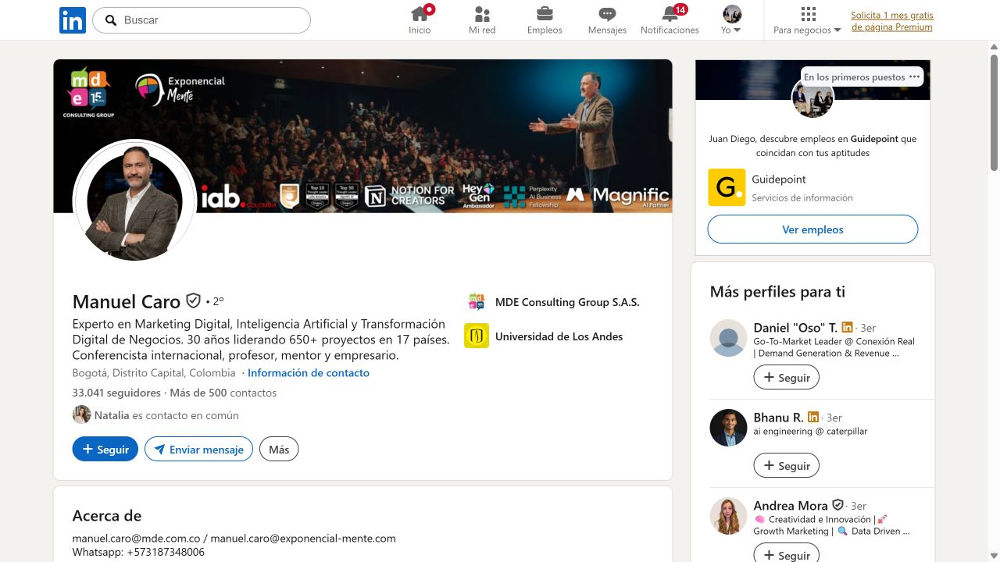

**Senal visible:** Manuel Caro • 2º Experto en Marketing Digital, Inteligencia Artificial y Transformación Digital de Negocios. 30 años liderando 650+ proyectos en 17 países. Conferencista internacional, profesor, mentor y empresario. Bogotá, Distrito Capital, Colombia Seguir...

**Por que encaja con Esteban:** perfil conectado con busquedas de datos, BI, automatizacion, IA o etapa junior/estudiantil. Es el tipo de contacto que puede generar conversaciones naturales sobre aprendizaje, proyectos, herramientas y oportunidades en analitica.

**Valor potencial para conseguir clientes B2B:** aunque no todos son decisores, pueden abrir puertas a equipos, profesores, comunidades, startups o empresas donde se usan datos y automatizacion. Para Esteban sirve como red puente: aprender, comentar, colaborar y detectar oportunidades tempranas.

**Mensaje sugerido para enviar manualmente:**

> Hola Manuel, vi tu perfil y me llamo la atencion tu enfoque en datos/tecnologia. Estoy conectando con personas de LATAM que tambien esten creciendo en analitica, automatizacion e IA. Me gustaria conectar y seguir aprendiendo de lo que compartes.

<strong>96. Natalia Ortiz</strong> - Datos, analitica y tecnologia

**Link de perfil:** [Abrir perfil de LinkedIn](https://www.linkedin.com/in/nataliaortizmarketing)

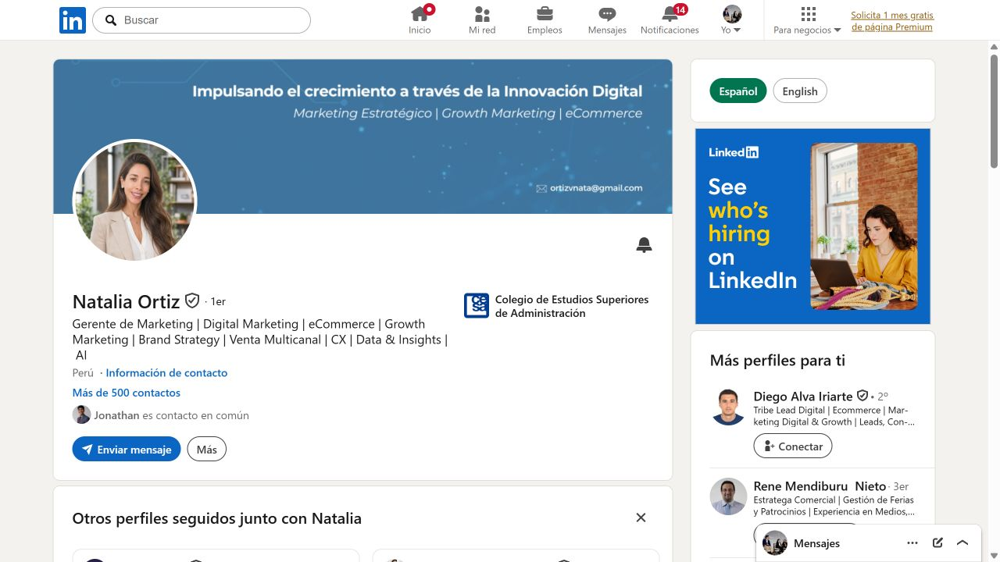

**Senal visible:** Manuel Caro • 2º Experto en Marketing Digital, Inteligencia Artificial y Transformación Digital de Negocios. 30 años liderando 650+ proyectos en 17 países. Conferencista internacional, profesor, mentor y empresario. Bogotá, Distrito Capital, Colombia Seguir...

**Por que encaja con Esteban:** perfil conectado con busquedas de datos, BI, automatizacion, IA o etapa junior/estudiantil. Es el tipo de contacto que puede generar conversaciones naturales sobre aprendizaje, proyectos, herramientas y oportunidades en analitica.

**Valor potencial para conseguir clientes B2B:** aunque no todos son decisores, pueden abrir puertas a equipos, profesores, comunidades, startups o empresas donde se usan datos y automatizacion. Para Esteban sirve como red puente: aprender, comentar, colaborar y detectar oportunidades tempranas.

**Mensaje sugerido para enviar manualmente:**

> Hola Natalia, vi tu perfil y me llamo la atencion tu enfoque en datos/tecnologia. Estoy conectando con personas de LATAM que tambien esten creciendo en analitica, automatizacion e IA. Me gustaria conectar y seguir aprendiendo de lo que compartes.

<strong>97. Francisco Bertel Romero •</strong> - IA y machine learning

**Link de perfil:** [Abrir perfil de LinkedIn](https://www.linkedin.com/in/fbertelr)

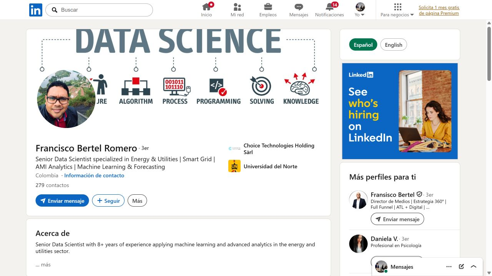

**Senal visible:** Francisco Bertel Romero • 3er+ Senior Data Scientist specialized in Energy & Utilities | Smart Grid | AMI Analytics | Machine Learning & Forecasting Colombia Enviar mensaje Actual: Senior Data Scientist - Project Engineer en Choice Technologies Holding Sàrl

**Por que encaja con Esteban:** perfil conectado con busquedas de datos, BI, automatizacion, IA o etapa junior/estudiantil. Es el tipo de contacto que puede generar conversaciones naturales sobre aprendizaje, proyectos, herramientas y oportunidades en analitica.

**Valor potencial para conseguir clientes B2B:** aunque no todos son decisores, pueden abrir puertas a equipos, profesores, comunidades, startups o empresas donde se usan datos y automatizacion. Para Esteban sirve como red puente: aprender, comentar, colaborar y detectar oportunidades tempranas.

**Mensaje sugerido para enviar manualmente:**

> Hola Francisco, vi tu perfil y me llamo la atencion tu enfoque en datos/tecnologia. Estoy conectando con personas de LATAM que tambien esten creciendo en analitica, automatizacion e IA. Me gustaria conectar y seguir aprendiendo de lo que compartes.

<strong>98. Juan Pablo Real Tsimogianis</strong> - Estudiante / analitica de datos

**Link de perfil:** [Abrir perfil de LinkedIn](https://www.linkedin.com/in/juan-pablo-real-tsimogianis-a76984250)

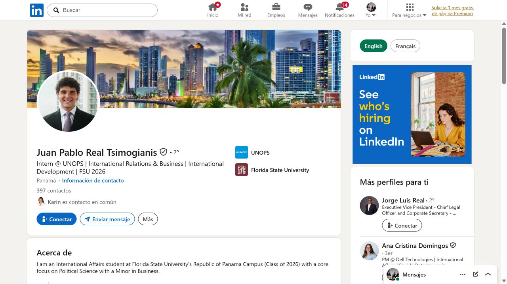

**Senal visible:** Juan Pablo Real Tsimogianis • 2º

**Por que encaja con Esteban:** perfil conectado con busquedas de datos, BI, automatizacion, IA o etapa junior/estudiantil. Es el tipo de contacto que puede generar conversaciones naturales sobre aprendizaje, proyectos, herramientas y oportunidades en analitica.

**Valor potencial para conseguir clientes B2B:** aunque no todos son decisores, pueden abrir puertas a equipos, profesores, comunidades, startups o empresas donde se usan datos y automatizacion. Para Esteban sirve como red puente: aprender, comentar, colaborar y detectar oportunidades tempranas.

**Mensaje sugerido para enviar manualmente:**

> Hola Juan, vi tu perfil y me llamo la atencion tu enfoque en datos/tecnologia. Estoy conectando con personas de LATAM que tambien esten creciendo en analitica, automatizacion e IA. Me gustaria conectar y seguir aprendiendo de lo que compartes.

<strong>99. Gustavo Alberto Diaz</strong> - Business intelligence / Power BI

**Link de perfil:** [Abrir perfil de LinkedIn](https://www.linkedin.com/in/gustavo-alberto-diaz-46087b70)

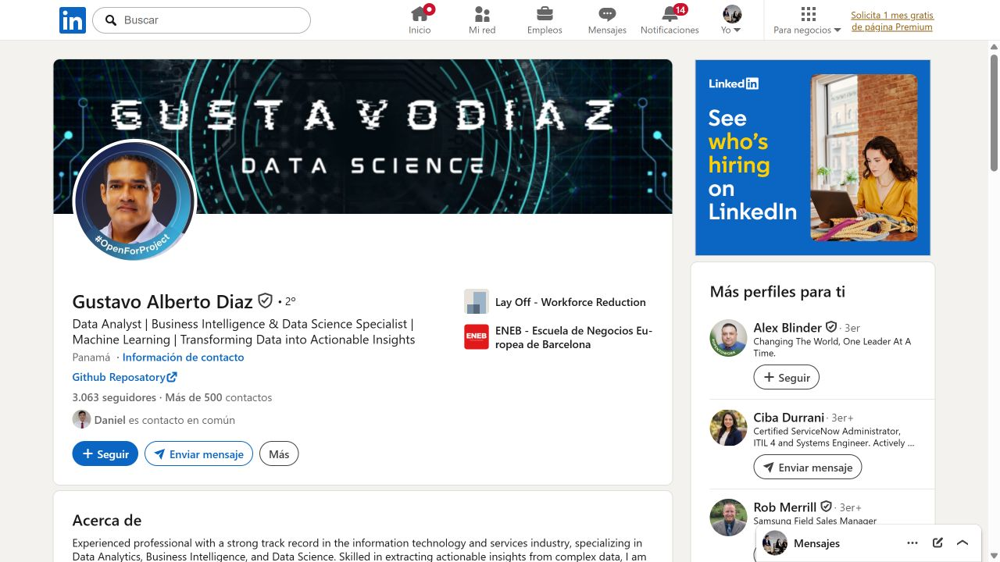

**Senal visible:** Gustavo Alberto Diaz • 2º

**Por que encaja con Esteban:** perfil conectado con busquedas de datos, BI, automatizacion, IA o etapa junior/estudiantil. Es el tipo de contacto que puede generar conversaciones naturales sobre aprendizaje, proyectos, herramientas y oportunidades en analitica.

**Valor potencial para conseguir clientes B2B:** aunque no todos son decisores, pueden abrir puertas a equipos, profesores, comunidades, startups o empresas donde se usan datos y automatizacion. Para Esteban sirve como red puente: aprender, comentar, colaborar y detectar oportunidades tempranas.

**Mensaje sugerido para enviar manualmente:**

> Hola Gustavo, vi tu perfil y me llamo la atencion tu enfoque en datos/tecnologia. Estoy conectando con personas de LATAM que tambien esten creciendo en analitica, automatizacion e IA. Me gustaria conectar y seguir aprendiendo de lo que compartes.

<strong>100. Paul William Tucker Alpírez</strong> - Business intelligence / Power BI

**Link de perfil:** [Abrir perfil de LinkedIn](https://www.linkedin.com/in/paultucker2001)

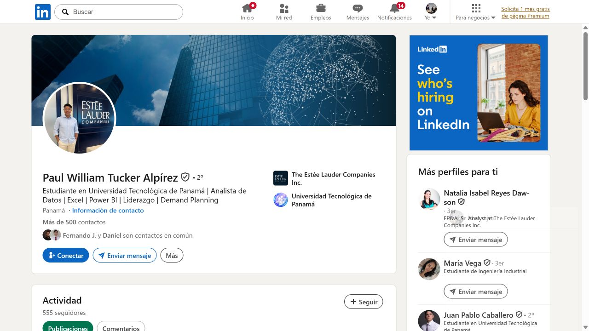

**Senal visible:** Paul William Tucker Alpírez • 2º

**Por que encaja con Esteban:** perfil conectado con busquedas de datos, BI, automatizacion, IA o etapa junior/estudiantil. Es el tipo de contacto que puede generar conversaciones naturales sobre aprendizaje, proyectos, herramientas y oportunidades en analitica.

**Valor potencial para conseguir clientes B2B:** aunque no todos son decisores, pueden abrir puertas a equipos, profesores, comunidades, startups o empresas donde se usan datos y automatizacion. Para Esteban sirve como red puente: aprender, comentar, colaborar y detectar oportunidades tempranas.

**Mensaje sugerido para enviar manualmente:**

> Hola Paul, vi tu perfil y me llamo la atencion tu enfoque en datos/tecnologia. Estoy conectando con personas de LATAM que tambien esten creciendo en analitica, automatizacion e IA. Me gustaria conectar y seguir aprendiendo de lo que compartes.

## Siguiente paso recomendado

La base ya queda en 100 perfiles documentados. El siguiente paso no es enviar invitaciones masivas: conviene priorizar 15-20 perfiles con mejor encaje, revisar su actividad reciente y enviar invitaciones manuales con contexto real.

**Orden sugerido:**

1. Priorizar perfiles con Panama, LATAM, Power BI, SQL, Python, automatizacion o IA aplicada.
2. Revisar si publican contenido o si tienen actividad reciente.
3. Mandar invitacion manual y breve, sin automatizar spam.
4. Registrar quien acepta y que tipo de conversacion abre.
