# Networking para Gabriel Alba - 100 contactos de datos, sistemas e IA

Documento nuevo para Gabriel Alba. No se enviaron invitaciones ni mensajes. Esta lista esta pensada para crear una red de personas cercanas a datos, sistemas, automatizacion, Power BI, SQL, Power Query, implementacion de IA y agentes.

## Perfil base de Gabriel

- AI Implementation Specialist | Data & Systems Analyst | AI Agents & Automation | SQL | Power BI | Power Query.
- Objetivo: conectar con perfiles que entiendan datos + sistemas + automatizacion, para crear red tecnica, colaboraciones, aprendizaje y oportunidades B2B.
- Criterio de busqueda: perfiles de Panama/LATAM con senales de analitica, BI, sistemas, automatizacion, IA, SQL, Python, Power Platform o talento joven tecnico.

## Como usar esta lista

1. Abrir el perfil.
2. Revisar si el perfil realmente encaja antes de contactar.
3. Personalizar el mensaje segun el resumen visible.
4. No enviar invitaciones masivas: usar la lista como CRM manual de networking.

## Contactos seleccionados

<strong>001. Gabriel Alba •</strong> - Business intelligence / Power BI

**Link de perfil:** [Abrir perfil de LinkedIn](https://www.linkedin.com/in/gabriel-alba-637827258)

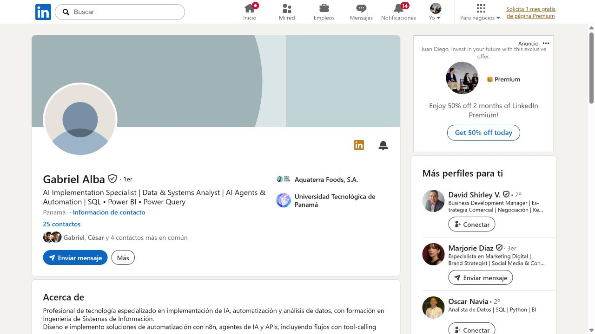

**Senal visible:** Gabriel Alba • 1er AI Implementation Specialist | Data & Systems Analyst | AI Agents & Automation | SQL • Power BI • Power Query Panamá, Panamá, Panamá Enviar mensaje Actual: Analista de Datos en Aquaterra Foods, S.A. William Rodríguez Grajales, César González Camargo y 4 contactos más en común

**Por que encaja con Gabriel:** Tiene senales visibles de Power BI, SQL, Power Query, automatizacion, IA/agentes, alineadas con el posicionamiento de Gabriel en datos, sistemas e IA.

**Valor potencial para networking/B2B:** puede servir como contacto para conversaciones sobre dashboards, automatizacion de procesos, analitica aplicada, implementaciones internas de IA o posibles referidos hacia empresas que necesitan ordenar datos y sistemas.

**Mensaje sugerido manual:**

> Hola Gabriel, vi que trabajas/estudias temas cercanos a datos, sistemas e IA. Estoy conectando con personas de la region que estan construyendo en analitica, automatizacion y herramientas empresariales. Me gustaria conectar y seguir aprendiendo de lo que compartes.

<strong>002. Jc Sierra Ojeda •</strong> - Business intelligence / Power BI

**Link de perfil:** [Abrir perfil de LinkedIn](https://www.linkedin.com/in/jcbiigvai/es)

**Senal visible:** Jc Sierra Ojeda • 3er+ Data Manager | Data Analyst | Business intelligence (BI) | Analista de Datos | Power BI | Python | SQL Panamá, Panamá, Panamá Enviar mensaje Actual: BI Manager en Samsung Electronics - …into analytical solutions, aligning data initiatives with strategic objectives and enabling data-driven…

**Por que encaja con Gabriel:** Tiene senales visibles de Power BI, SQL, Python, IA/agentes, Panama, alineadas con el posicionamiento de Gabriel en datos, sistemas e IA.

**Valor potencial para networking/B2B:** puede servir como contacto para conversaciones sobre dashboards, automatizacion de procesos, analitica aplicada, implementaciones internas de IA o posibles referidos hacia empresas que necesitan ordenar datos y sistemas.

**Mensaje sugerido manual:**

> Hola Jc, vi que trabajas/estudias temas cercanos a datos, sistemas e IA. Estoy conectando con personas de la region que estan construyendo en analitica, automatizacion y herramientas empresariales. Me gustaria conectar y seguir aprendiendo de lo que compartes.

<strong>003. Gabriel Caballero •</strong> - Business intelligence / Power BI

**Link de perfil:** [Abrir perfil de LinkedIn](https://www.linkedin.com/in/gabriel-caballero-1036b5301)

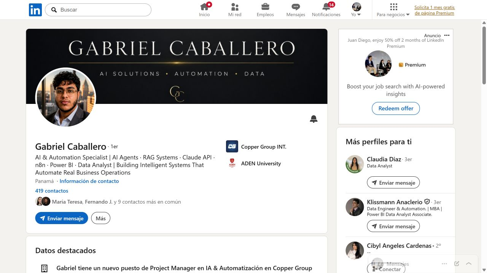

**Senal visible:** Gabriel Caballero • 1er AI & Automation Specialist | AI Agents · RAG Systems · Claude API · n8n · Power BI · Data Analyst | Building Intelligent Systems That Automate Real Business Operations Panamá, Panamá, Panamá Enviar mensaje Anterior: Business Intelligence Specialist en Puertomar Grupo Empresarial Daniel Wen Lay,...

**Por que encaja con Gabriel:** Tiene senales visibles de Power BI, automatizacion, IA/agentes, Panama, alineadas con el posicionamiento de Gabriel en datos, sistemas e IA.

**Valor potencial para networking/B2B:** puede servir como contacto para conversaciones sobre dashboards, automatizacion de procesos, analitica aplicada, implementaciones internas de IA o posibles referidos hacia empresas que necesitan ordenar datos y sistemas.

**Mensaje sugerido manual:**

> Hola Gabriel, vi que trabajas/estudias temas cercanos a datos, sistemas e IA. Estoy conectando con personas de la region que estan construyendo en analitica, automatizacion y herramientas empresariales. Me gustaria conectar y seguir aprendiendo de lo que compartes.

<strong>004. José Efraín Grisales Gómez •</strong> - Business intelligence / Power BI

**Link de perfil:** [Abrir perfil de LinkedIn](https://www.linkedin.com/in/jos%C3%A9-efra%C3%ADn-grisales-g%C3%B3mez-339353185)

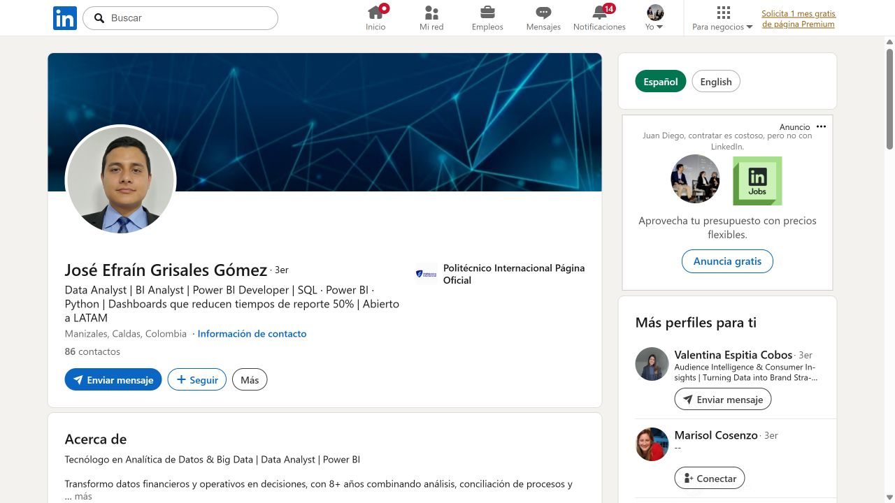

**Senal visible:** José Efraín Grisales Gómez • 3er+ Data Analyst | BI Analyst | Power BI Developer | SQL · Power BI · Python | Dashboards que reducen tiempos de reporte 50% | Abierto a LATAM Manizales, Caldas, Colombia Enviar mensaje Anterior: Analista de Business Intelligence (BI) - Proyecto Latam en Scala Learning Latam

**Por que encaja con Gabriel:** Tiene senales visibles de Power BI, SQL, Python, IA/agentes, alineadas con el posicionamiento de Gabriel en datos, sistemas e IA.

**Valor potencial para networking/B2B:** puede servir como contacto para conversaciones sobre dashboards, automatizacion de procesos, analitica aplicada, implementaciones internas de IA o posibles referidos hacia empresas que necesitan ordenar datos y sistemas.

**Mensaje sugerido manual:**

> Hola José, vi que trabajas/estudias temas cercanos a datos, sistemas e IA. Estoy conectando con personas de la region que estan construyendo en analitica, automatizacion y herramientas empresariales. Me gustaria conectar y seguir aprendiendo de lo que compartes.

<strong>005. Isabella Garcia Vargas</strong> - Datos, sistemas e IA

**Link de perfil:** [Abrir perfil de LinkedIn](https://www.linkedin.com/in/isabella-garcia-vargas-25b2901b6)

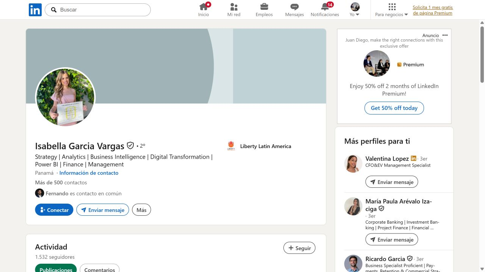

**Senal visible:** Isabella Garcia Vargas • 2º

**Por que encaja con Gabriel:** Tiene senales visibles de IA/agentes, alineadas con el posicionamiento de Gabriel en datos, sistemas e IA.

**Valor potencial para networking/B2B:** puede servir como contacto para conversaciones sobre dashboards, automatizacion de procesos, analitica aplicada, implementaciones internas de IA o posibles referidos hacia empresas que necesitan ordenar datos y sistemas.

**Mensaje sugerido manual:**

> Hola Isabella, vi que trabajas/estudias temas cercanos a datos, sistemas e IA. Estoy conectando con personas de la region que estan construyendo en analitica, automatizacion y herramientas empresariales. Me gustaria conectar y seguir aprendiendo de lo que compartes.

<strong>006. Fernando Cutire</strong> - Datos, sistemas e IA

**Link de perfil:** [Abrir perfil de LinkedIn](https://www.linkedin.com/in/fernandocutire)

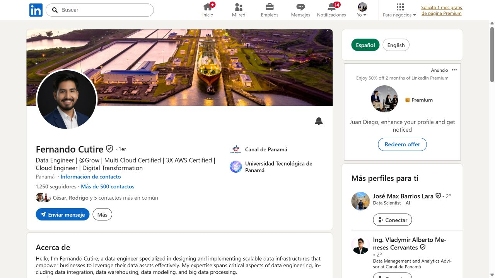

**Senal visible:** Fernando Cutire es contacto en común

**Por que encaja con Gabriel:** Tiene senales visibles relacionadas con datos, sistemas, automatizacion o tecnologia, utiles para ampliar una red profesional cercana al trabajo de Gabriel.

**Valor potencial para networking/B2B:** puede servir como contacto para conversaciones sobre dashboards, automatizacion de procesos, analitica aplicada, implementaciones internas de IA o posibles referidos hacia empresas que necesitan ordenar datos y sistemas.

**Mensaje sugerido manual:**

> Hola Fernando, vi que trabajas/estudias temas cercanos a datos, sistemas e IA. Estoy conectando con personas de la region que estan construyendo en analitica, automatizacion y herramientas empresariales. Me gustaria conectar y seguir aprendiendo de lo que compartes.

<strong>007. Nefyasser Antonio Tapia</strong> - Datos, sistemas e IA

**Link de perfil:** [Abrir perfil de LinkedIn](https://www.linkedin.com/in/nefyasser-antonio-tapia-b707384)

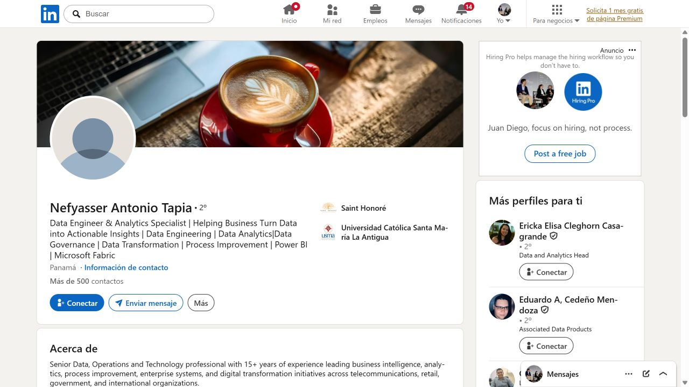

**Senal visible:** Nefyasser Antonio Tapia • 2º

**Por que encaja con Gabriel:** Tiene senales visibles de IA/agentes, alineadas con el posicionamiento de Gabriel en datos, sistemas e IA.

**Valor potencial para networking/B2B:** puede servir como contacto para conversaciones sobre dashboards, automatizacion de procesos, analitica aplicada, implementaciones internas de IA o posibles referidos hacia empresas que necesitan ordenar datos y sistemas.

**Mensaje sugerido manual:**

> Hola Nefyasser, vi que trabajas/estudias temas cercanos a datos, sistemas e IA. Estoy conectando con personas de la region que estan construyendo en analitica, automatizacion y herramientas empresariales. Me gustaria conectar y seguir aprendiendo de lo que compartes.

<strong>008. Marta Maleyka Magallon Escobar</strong> - Datos, sistemas e IA

**Link de perfil:** [Abrir perfil de LinkedIn](https://www.linkedin.com/in/marta-maleyka-magallon-escobar)

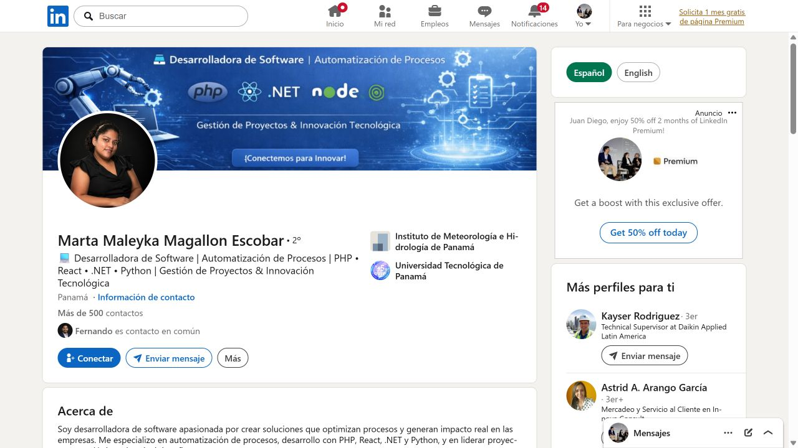

**Senal visible:** Marta Maleyka Magallon Escobar • 2º

**Por que encaja con Gabriel:** Tiene senales visibles relacionadas con datos, sistemas, automatizacion o tecnologia, utiles para ampliar una red profesional cercana al trabajo de Gabriel.

**Valor potencial para networking/B2B:** puede servir como contacto para conversaciones sobre dashboards, automatizacion de procesos, analitica aplicada, implementaciones internas de IA o posibles referidos hacia empresas que necesitan ordenar datos y sistemas.

**Mensaje sugerido manual:**

> Hola Marta, vi que trabajas/estudias temas cercanos a datos, sistemas e IA. Estoy conectando con personas de la region que estan construyendo en analitica, automatizacion y herramientas empresariales. Me gustaria conectar y seguir aprendiendo de lo que compartes.

<strong>009. Julian Camilo Rojas Ruiz</strong> - Datos, sistemas e IA

**Link de perfil:** [Abrir perfil de LinkedIn](https://www.linkedin.com/in/camilorojas0913)

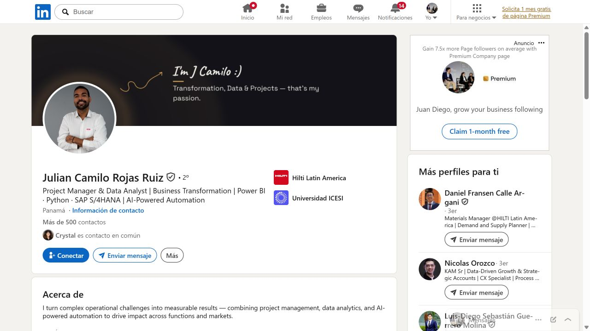

**Senal visible:** Julian Camilo Rojas Ruiz • 2º

**Por que encaja con Gabriel:** Tiene senales visibles de IA/agentes, alineadas con el posicionamiento de Gabriel en datos, sistemas e IA.

**Valor potencial para networking/B2B:** puede servir como contacto para conversaciones sobre dashboards, automatizacion de procesos, analitica aplicada, implementaciones internas de IA o posibles referidos hacia empresas que necesitan ordenar datos y sistemas.

**Mensaje sugerido manual:**

> Hola Julian, vi que trabajas/estudias temas cercanos a datos, sistemas e IA. Estoy conectando con personas de la region que estan construyendo en analitica, automatizacion y herramientas empresariales. Me gustaria conectar y seguir aprendiendo de lo que compartes.

<strong>010. Crystal Cabrera Armada</strong> - Datos, sistemas e IA

**Link de perfil:** [Abrir perfil de LinkedIn](https://www.linkedin.com/in/crystal-c-381452a5)

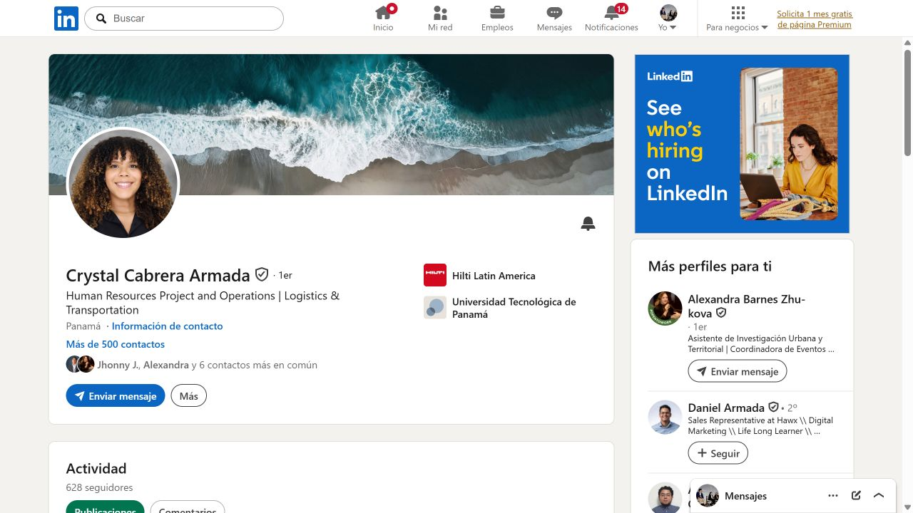

**Senal visible:** Crystal Cabrera Armada es contacto en común

**Por que encaja con Gabriel:** Tiene senales visibles relacionadas con datos, sistemas, automatizacion o tecnologia, utiles para ampliar una red profesional cercana al trabajo de Gabriel.

**Valor potencial para networking/B2B:** puede servir como contacto para conversaciones sobre dashboards, automatizacion de procesos, analitica aplicada, implementaciones internas de IA o posibles referidos hacia empresas que necesitan ordenar datos y sistemas.

**Mensaje sugerido manual:**

> Hola Crystal, vi que trabajas/estudias temas cercanos a datos, sistemas e IA. Estoy conectando con personas de la region que estan construyendo en analitica, automatizacion y herramientas empresariales. Me gustaria conectar y seguir aprendiendo de lo que compartes.

<strong>011. Ricardo Díaz Peñaloza</strong> - Datos, sistemas e IA

**Link de perfil:** [Abrir perfil de LinkedIn](https://www.linkedin.com/in/ricardodiazp)

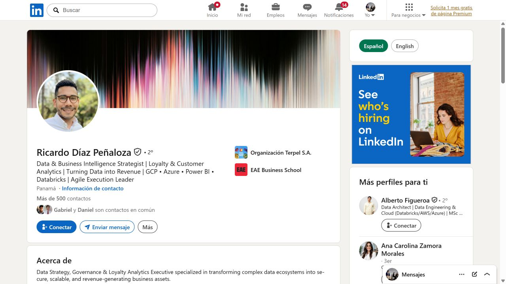

**Senal visible:** Ricardo Díaz Peñaloza • 2º

**Por que encaja con Gabriel:** Tiene senales visibles relacionadas con datos, sistemas, automatizacion o tecnologia, utiles para ampliar una red profesional cercana al trabajo de Gabriel.

**Valor potencial para networking/B2B:** puede servir como contacto para conversaciones sobre dashboards, automatizacion de procesos, analitica aplicada, implementaciones internas de IA o posibles referidos hacia empresas que necesitan ordenar datos y sistemas.

**Mensaje sugerido manual:**

> Hola Ricardo, vi que trabajas/estudias temas cercanos a datos, sistemas e IA. Estoy conectando con personas de la region que estan construyendo en analitica, automatizacion y herramientas empresariales. Me gustaria conectar y seguir aprendiendo de lo que compartes.

<strong>012. Daniel Wen Lay</strong> - Datos, sistemas e IA

**Link de perfil:** [Abrir perfil de LinkedIn](https://www.linkedin.com/in/daniel-wen-lay)

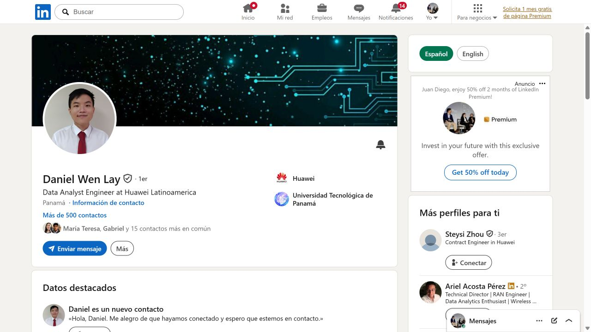

**Senal visible:** Daniel Wen Lay y Gabriel Caballero son contactos en común

**Por que encaja con Gabriel:** Tiene senales visibles relacionadas con datos, sistemas, automatizacion o tecnologia, utiles para ampliar una red profesional cercana al trabajo de Gabriel.

**Valor potencial para networking/B2B:** puede servir como contacto para conversaciones sobre dashboards, automatizacion de procesos, analitica aplicada, implementaciones internas de IA o posibles referidos hacia empresas que necesitan ordenar datos y sistemas.

**Mensaje sugerido manual:**

> Hola Daniel, vi que trabajas/estudias temas cercanos a datos, sistemas e IA. Estoy conectando con personas de la region que estan construyendo en analitica, automatizacion y herramientas empresariales. Me gustaria conectar y seguir aprendiendo de lo que compartes.

<strong>013. César González Camargo</strong> - Datos, sistemas e IA

**Link de perfil:** [Abrir perfil de LinkedIn](https://www.linkedin.com/in/cg-0430-pa)

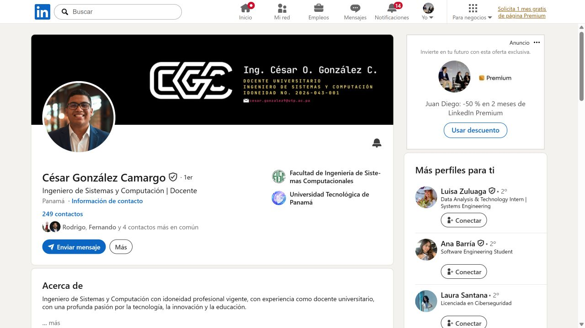

**Senal visible:** César González Camargo, Fernando Cutire y 2 contactos más en común

**Por que encaja con Gabriel:** Tiene senales visibles relacionadas con datos, sistemas, automatizacion o tecnologia, utiles para ampliar una red profesional cercana al trabajo de Gabriel.

**Valor potencial para networking/B2B:** puede servir como contacto para conversaciones sobre dashboards, automatizacion de procesos, analitica aplicada, implementaciones internas de IA o posibles referidos hacia empresas que necesitan ordenar datos y sistemas.

**Mensaje sugerido manual:**

> Hola César, vi que trabajas/estudias temas cercanos a datos, sistemas e IA. Estoy conectando con personas de la region que estan construyendo en analitica, automatizacion y herramientas empresariales. Me gustaria conectar y seguir aprendiendo de lo que compartes.

<strong>014. Fernando J. Robinson Biendicho</strong> - Datos, sistemas e IA

**Link de perfil:** [Abrir perfil de LinkedIn](https://www.linkedin.com/in/fernandojrobinsonbiendicho)

**Senal visible:** Daniel Wen Lay, Fernando J. Robinson Biendicho y 2 contactos más en común

**Por que encaja con Gabriel:** Tiene senales visibles relacionadas con datos, sistemas, automatizacion o tecnologia, utiles para ampliar una red profesional cercana al trabajo de Gabriel.

**Valor potencial para networking/B2B:** puede servir como contacto para conversaciones sobre dashboards, automatizacion de procesos, analitica aplicada, implementaciones internas de IA o posibles referidos hacia empresas que necesitan ordenar datos y sistemas.

**Mensaje sugerido manual:**

> Hola Fernando, vi que trabajas/estudias temas cercanos a datos, sistemas e IA. Estoy conectando con personas de la region que estan construyendo en analitica, automatizacion y herramientas empresariales. Me gustaria conectar y seguir aprendiendo de lo que compartes.

<strong>015. Alejandro José Martínez Úbeda •</strong> - Business intelligence / Power BI

**Link de perfil:** [Abrir perfil de LinkedIn](https://www.linkedin.com/in/alemartinezu)

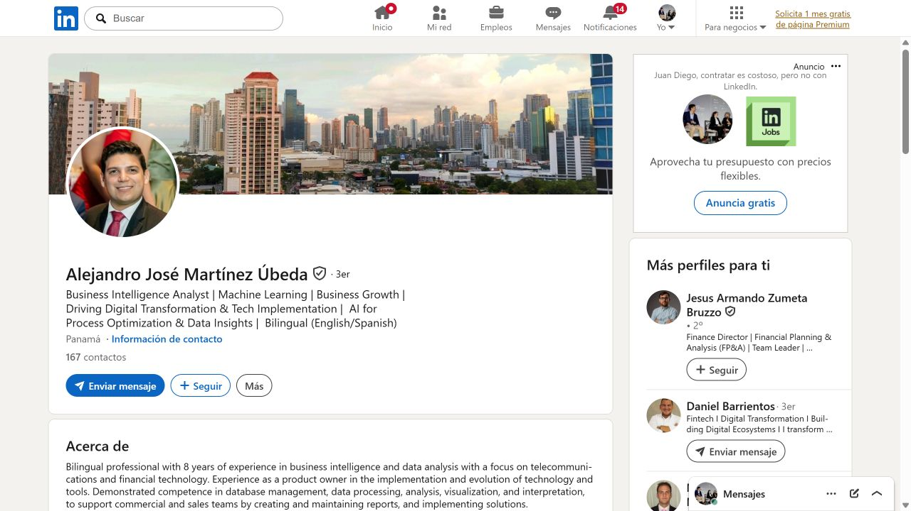

**Senal visible:** Alejandro José Martínez Úbeda • 3er+ Business Intelligence Analyst | Machine Learning | Business Growth | Driving Digital Transformation & Tech Implementation | AI for Process Optimization & Data Insights | Bilingual (English/Spanish) Panamá, Panamá, Panamá Enviar mensaje Anterior: Regional Digital Channel Owner en Mi...

**Por que encaja con Gabriel:** Tiene senales visibles de IA/agentes, Panama, alineadas con el posicionamiento de Gabriel en datos, sistemas e IA.

**Valor potencial para networking/B2B:** puede servir como contacto para conversaciones sobre dashboards, automatizacion de procesos, analitica aplicada, implementaciones internas de IA o posibles referidos hacia empresas que necesitan ordenar datos y sistemas.

**Mensaje sugerido manual:**

> Hola Alejandro, vi que trabajas/estudias temas cercanos a datos, sistemas e IA. Estoy conectando con personas de la region que estan construyendo en analitica, automatizacion y herramientas empresariales. Me gustaria conectar y seguir aprendiendo de lo que compartes.

<strong>016. Ricardo Arturo Espinoza •</strong> - Business intelligence / Power BI

**Link de perfil:** [Abrir perfil de LinkedIn](https://www.linkedin.com/in/ricardoaespinozac)

**Senal visible:** Ricardo Arturo Espinoza • 1er Logístico enfocado al análisis de datos|Investigación|Data Science|Business Intelligence|Project Management|Cadena de suministro|Seguros|Analista de Procesos|Machine Learning|AI Models|Cloud Management Panamá, Panamá, Panamá Enviar mensaje Actual: Analista de Datos en MEDIPAN,S.A Daniel W...

**Por que encaja con Gabriel:** Tiene senales visibles de IA/agentes, Panama, alineadas con el posicionamiento de Gabriel en datos, sistemas e IA.

**Valor potencial para networking/B2B:** puede servir como contacto para conversaciones sobre dashboards, automatizacion de procesos, analitica aplicada, implementaciones internas de IA o posibles referidos hacia empresas que necesitan ordenar datos y sistemas.

**Mensaje sugerido manual:**

> Hola Ricardo, vi que trabajas/estudias temas cercanos a datos, sistemas e IA. Estoy conectando con personas de la region que estan construyendo en analitica, automatizacion y herramientas empresariales. Me gustaria conectar y seguir aprendiendo de lo que compartes.

<strong>017. Maria Laura Fernandez</strong> - Datos, sistemas e IA

**Link de perfil:** [Abrir perfil de LinkedIn](https://www.linkedin.com/in/maria-laura-fernandez-000877197)

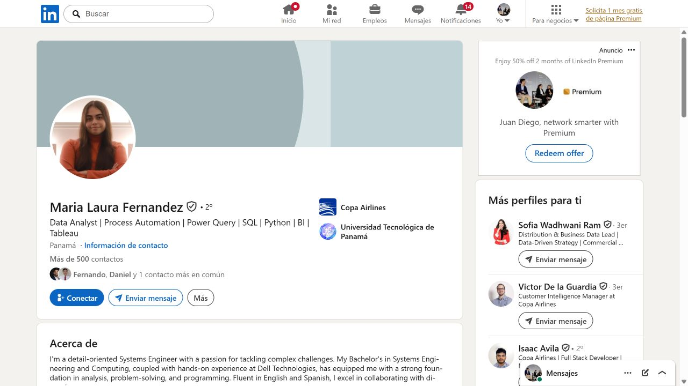

**Senal visible:** Maria Laura Fernandez • 2º

**Por que encaja con Gabriel:** Tiene senales visibles de IA/agentes, alineadas con el posicionamiento de Gabriel en datos, sistemas e IA.

**Valor potencial para networking/B2B:** puede servir como contacto para conversaciones sobre dashboards, automatizacion de procesos, analitica aplicada, implementaciones internas de IA o posibles referidos hacia empresas que necesitan ordenar datos y sistemas.

**Mensaje sugerido manual:**

> Hola Maria, vi que trabajas/estudias temas cercanos a datos, sistemas e IA. Estoy conectando con personas de la region que estan construyendo en analitica, automatizacion y herramientas empresariales. Me gustaria conectar y seguir aprendiendo de lo que compartes.

<strong>018. William Rodríguez Grajales</strong> - Datos, sistemas e IA

**Link de perfil:** [Abrir perfil de LinkedIn](https://www.linkedin.com/in/william-rodr%C3%ADguez-grajales-67354a135)

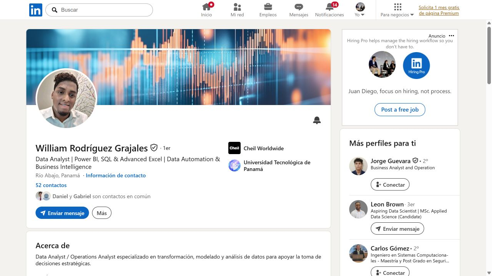

**Senal visible:** William Rodríguez Grajales, César González Camargo y 4 contactos más en común

**Por que encaja con Gabriel:** Tiene senales visibles de IA/agentes, alineadas con el posicionamiento de Gabriel en datos, sistemas e IA.

**Valor potencial para networking/B2B:** puede servir como contacto para conversaciones sobre dashboards, automatizacion de procesos, analitica aplicada, implementaciones internas de IA o posibles referidos hacia empresas que necesitan ordenar datos y sistemas.

**Mensaje sugerido manual:**

> Hola William, vi que trabajas/estudias temas cercanos a datos, sistemas e IA. Estoy conectando con personas de la region que estan construyendo en analitica, automatizacion y herramientas empresariales. Me gustaria conectar y seguir aprendiendo de lo que compartes.

<strong>019. Patrick Marin (CLTD) •</strong> - Automatizacion e implementacion de IA

**Link de perfil:** [Abrir perfil de LinkedIn](https://www.linkedin.com/in/patrickmarin09)

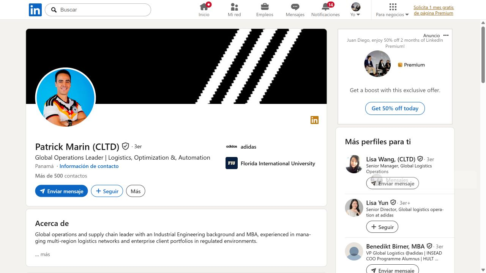

**Senal visible:** Patrick Marin (CLTD) • 3er+ Global Operations Leader | Logistics, Optimization &, Automation Panamá, Panamá, Panamá Enviar mensaje Actual: Senior Manager Transport & Logistics - Global Logistics en adidas - …, and ground modes, delivering data-driven insights…

**Por que encaja con Gabriel:** Tiene senales visibles de automatizacion, IA/agentes, Panama, alineadas con el posicionamiento de Gabriel en datos, sistemas e IA.

**Valor potencial para networking/B2B:** puede servir como contacto para conversaciones sobre dashboards, automatizacion de procesos, analitica aplicada, implementaciones internas de IA o posibles referidos hacia empresas que necesitan ordenar datos y sistemas.

**Mensaje sugerido manual:**

> Hola Patrick, vi que trabajas/estudias temas cercanos a datos, sistemas e IA. Estoy conectando con personas de la region que estan construyendo en analitica, automatizacion y herramientas empresariales. Me gustaria conectar y seguir aprendiendo de lo que compartes.

<strong>020. Juan Luis Alva Retana</strong> - Datos, sistemas e IA

**Link de perfil:** [Abrir perfil de LinkedIn](https://www.linkedin.com/in/juanalvaretana)

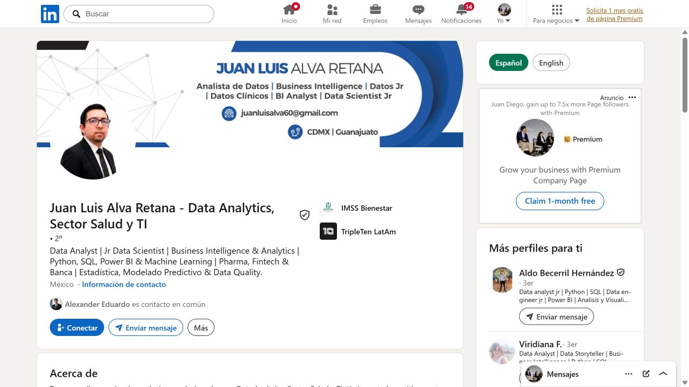

**Senal visible:** Juan Luis Alva Retana - Data Analytics, Sector Salud y TI • 2º

**Por que encaja con Gabriel:** Tiene senales visibles relacionadas con datos, sistemas, automatizacion o tecnologia, utiles para ampliar una red profesional cercana al trabajo de Gabriel.

**Valor potencial para networking/B2B:** puede servir como contacto para conversaciones sobre dashboards, automatizacion de procesos, analitica aplicada, implementaciones internas de IA o posibles referidos hacia empresas que necesitan ordenar datos y sistemas.

**Mensaje sugerido manual:**

> Hola Juan, vi que trabajas/estudias temas cercanos a datos, sistemas e IA. Estoy conectando con personas de la region que estan construyendo en analitica, automatizacion y herramientas empresariales. Me gustaria conectar y seguir aprendiendo de lo que compartes.

<strong>021. Brian Alexander Daza Cáceres •</strong> - Datos, SQL y analitica

**Link de perfil:** [Abrir perfil de LinkedIn](https://www.linkedin.com/in/brian-alexander-daza-c%C3%A1ceres-25166a161)

**Senal visible:** Brian Alexander Daza Cáceres • 3er+ Automation Specialist at Zurich | Robotic Process Automation (RPA) | Automation Anywhere | UiPath | RPA Architect | Python | Power Platform | SQL Bogotá, Distrito Capital, Colombia Enviar mensaje Actual: Automation Specialist en Zurich Insurance

**Por que encaja con Gabriel:** Tiene senales visibles de SQL, Python, automatizacion, IA/agentes, alineadas con el posicionamiento de Gabriel en datos, sistemas e IA.

**Valor potencial para networking/B2B:** puede servir como contacto para conversaciones sobre dashboards, automatizacion de procesos, analitica aplicada, implementaciones internas de IA o posibles referidos hacia empresas que necesitan ordenar datos y sistemas.

**Mensaje sugerido manual:**

> Hola Brian, vi que trabajas/estudias temas cercanos a datos, sistemas e IA. Estoy conectando con personas de la region que estan construyendo en analitica, automatizacion y herramientas empresariales. Me gustaria conectar y seguir aprendiendo de lo que compartes.

<strong>022. Juan Pablo Gordillo Rojas •</strong> - Datos, sistemas e IA

**Link de perfil:** [Abrir perfil de LinkedIn](https://www.linkedin.com/in/juan-pablo-gordillo/es)

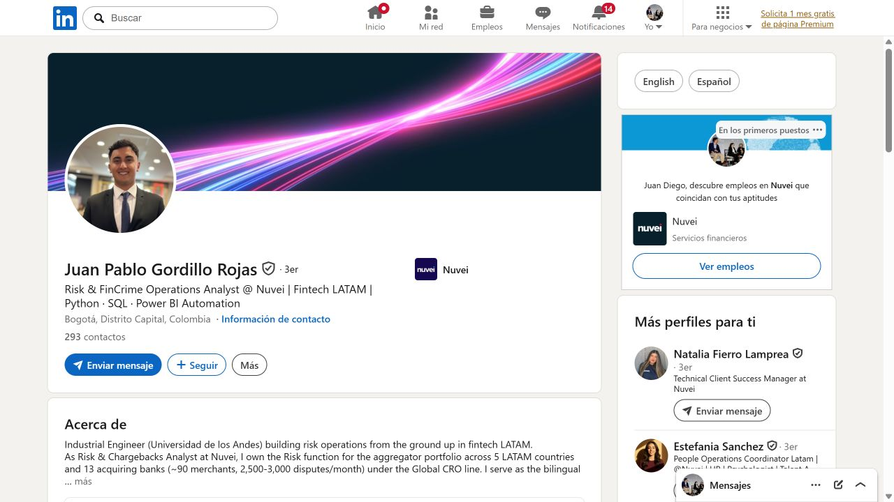

**Senal visible:** Juan Pablo Gordillo Rojas • 3er+ Risk and Chargebacks Analyst @ Nuvei | Financial Risk Management Bogotá, Distrito Capital, Colombia Enviar mensaje Actual: Risk and Chargebacks Analyst en Nuvei - …portfolio in LATAM (~90 merchants, 5 countries…

**Por que encaja con Gabriel:** Tiene senales visibles de IA/agentes, alineadas con el posicionamiento de Gabriel en datos, sistemas e IA.

**Valor potencial para networking/B2B:** puede servir como contacto para conversaciones sobre dashboards, automatizacion de procesos, analitica aplicada, implementaciones internas de IA o posibles referidos hacia empresas que necesitan ordenar datos y sistemas.

**Mensaje sugerido manual:**

> Hola Juan, vi que trabajas/estudias temas cercanos a datos, sistemas e IA. Estoy conectando con personas de la region que estan construyendo en analitica, automatizacion y herramientas empresariales. Me gustaria conectar y seguir aprendiendo de lo que compartes.

<strong>023. Martin Coronado • 2º IT enthusiast Panamá Seguir</strong> - Estudiante / talento joven tech

**Link de perfil:** [Abrir perfil de LinkedIn](https://www.linkedin.com/in/martincoronadojr)

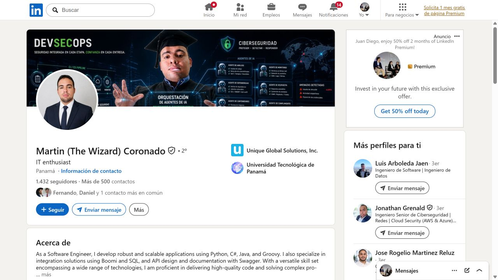

**Senal visible:** Martin Coronado • 2º IT enthusiast Panamá Seguir Actual: University Instructor en Universidad del Istmo, Panama Daniel Wen Lay, ANAIS CASTILLO QUIROZ y 1 contacto más en común · 1 mil seguidores

**Por que encaja con Gabriel:** Tiene senales visibles de IA/agentes, perfil joven o universitario, Panama, alineadas con el posicionamiento de Gabriel en datos, sistemas e IA.

**Valor potencial para networking/B2B:** puede servir como contacto para conversaciones sobre dashboards, automatizacion de procesos, analitica aplicada, implementaciones internas de IA o posibles referidos hacia empresas que necesitan ordenar datos y sistemas.

**Mensaje sugerido manual:**

> Hola Martin, vi que trabajas/estudias temas cercanos a datos, sistemas e IA. Estoy conectando con personas de la region que estan construyendo en analitica, automatizacion y herramientas empresariales. Me gustaria conectar y seguir aprendiendo de lo que compartes.

<strong>024. German Garcia •</strong> - Automatizacion e implementacion de IA

**Link de perfil:** [Abrir perfil de LinkedIn](https://www.linkedin.com/in/german-garcia-seniorqa)

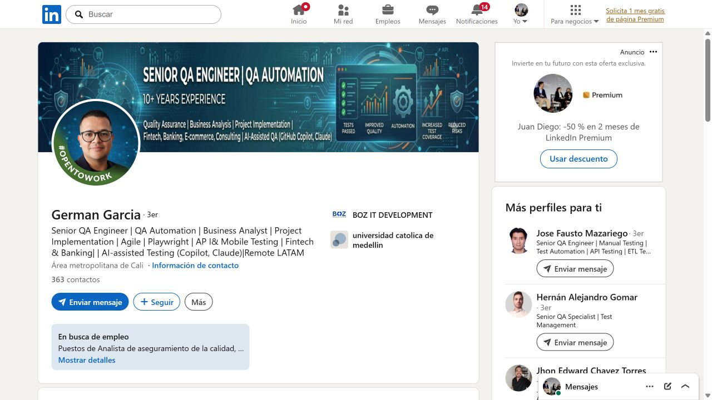

**Senal visible:** German Garcia • 3er+ Senior QA Engineer | QA Automation | Business Analyst | Project Implementation | Agile | Playwright | AP I& Mobile Testing | Fintech & Banking| | AI-assisted Testing (Copilot, Claude)|Remote LATAM Área metropolitana de Cali Enviar mensaje Actual: QA Funcional Senior en BOZ IT DEVELOPMENT - …• Leve...

**Por que encaja con Gabriel:** Tiene senales visibles de automatizacion, IA/agentes, alineadas con el posicionamiento de Gabriel en datos, sistemas e IA.

**Valor potencial para networking/B2B:** puede servir como contacto para conversaciones sobre dashboards, automatizacion de procesos, analitica aplicada, implementaciones internas de IA o posibles referidos hacia empresas que necesitan ordenar datos y sistemas.

**Mensaje sugerido manual:**

> Hola German, vi que trabajas/estudias temas cercanos a datos, sistemas e IA. Estoy conectando con personas de la region que estan construyendo en analitica, automatizacion y herramientas empresariales. Me gustaria conectar y seguir aprendiendo de lo que compartes.

<strong>025. Joana Cristina Gonzalez Coronell</strong> - Datos, sistemas e IA

**Link de perfil:** [Abrir perfil de LinkedIn](https://www.linkedin.com/in/joana-cristina-gonzalez-coronell-55a509287)

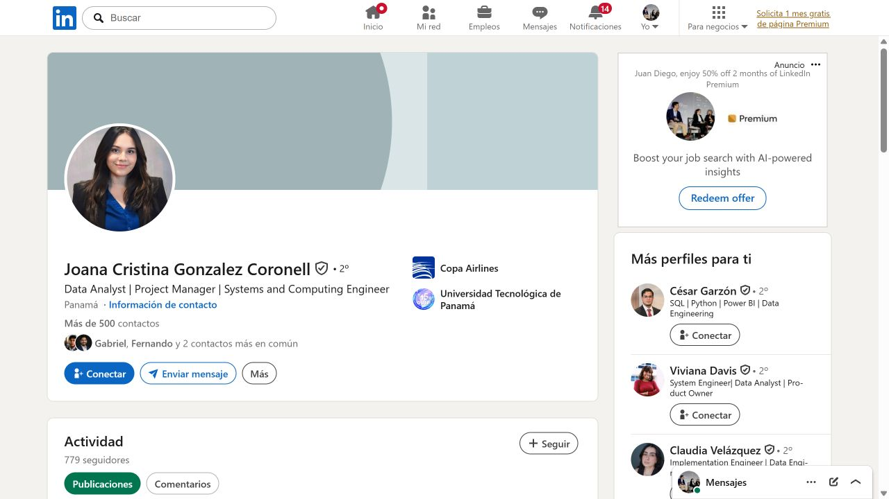

**Senal visible:** Joana Cristina Gonzalez Coronell • 2º

**Por que encaja con Gabriel:** Tiene senales visibles relacionadas con datos, sistemas, automatizacion o tecnologia, utiles para ampliar una red profesional cercana al trabajo de Gabriel.

**Valor potencial para networking/B2B:** puede servir como contacto para conversaciones sobre dashboards, automatizacion de procesos, analitica aplicada, implementaciones internas de IA o posibles referidos hacia empresas que necesitan ordenar datos y sistemas.

**Mensaje sugerido manual:**

> Hola Joana, vi que trabajas/estudias temas cercanos a datos, sistemas e IA. Estoy conectando con personas de la region que estan construyendo en analitica, automatizacion y herramientas empresariales. Me gustaria conectar y seguir aprendiendo de lo que compartes.

<strong>026. Reynaldo Rojas Hidalgo</strong> - Datos, sistemas e IA

**Link de perfil:** [Abrir perfil de LinkedIn](https://www.linkedin.com/in/reynaldo-rojas-hidalgo-a28a171a7)

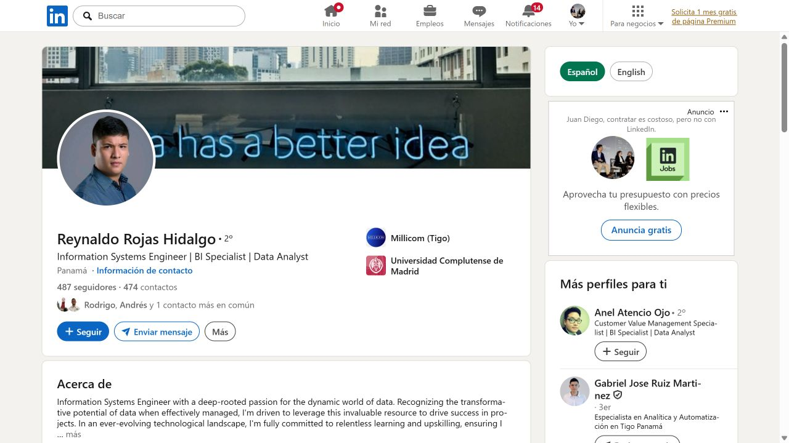

**Senal visible:** Reynaldo Rojas Hidalgo • 2º

**Por que encaja con Gabriel:** Tiene senales visibles relacionadas con datos, sistemas, automatizacion o tecnologia, utiles para ampliar una red profesional cercana al trabajo de Gabriel.

**Valor potencial para networking/B2B:** puede servir como contacto para conversaciones sobre dashboards, automatizacion de procesos, analitica aplicada, implementaciones internas de IA o posibles referidos hacia empresas que necesitan ordenar datos y sistemas.

**Mensaje sugerido manual:**

> Hola Reynaldo, vi que trabajas/estudias temas cercanos a datos, sistemas e IA. Estoy conectando con personas de la region que estan construyendo en analitica, automatizacion y herramientas empresariales. Me gustaria conectar y seguir aprendiendo de lo que compartes.

<strong>027. Rodrigo Yángüez</strong> - Datos, sistemas e IA

**Link de perfil:** [Abrir perfil de LinkedIn](https://www.linkedin.com/in/rodrigoiyg)

**Senal visible:** Daniel Wen Lay, Rodrigo Yángüez y 1 contacto más en común

**Por que encaja con Gabriel:** Tiene senales visibles relacionadas con datos, sistemas, automatizacion o tecnologia, utiles para ampliar una red profesional cercana al trabajo de Gabriel.

**Valor potencial para networking/B2B:** puede servir como contacto para conversaciones sobre dashboards, automatizacion de procesos, analitica aplicada, implementaciones internas de IA o posibles referidos hacia empresas que necesitan ordenar datos y sistemas.

**Mensaje sugerido manual:**

> Hola Rodrigo, vi que trabajas/estudias temas cercanos a datos, sistemas e IA. Estoy conectando con personas de la region que estan construyendo en analitica, automatizacion y herramientas empresariales. Me gustaria conectar y seguir aprendiendo de lo que compartes.

<strong>028. José Luis Alba Guerra</strong> - Datos, sistemas e IA

**Link de perfil:** [Abrir perfil de LinkedIn](https://www.linkedin.com/in/joseluisalba)

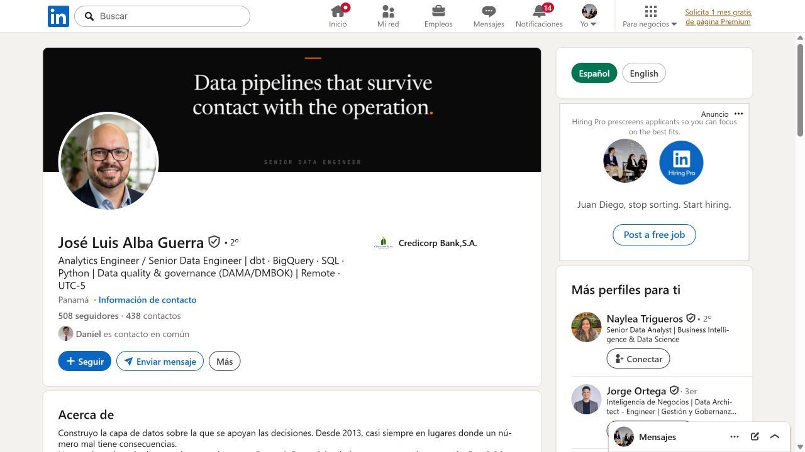

**Senal visible:** José Luis Alba Guerra • 2º

**Por que encaja con Gabriel:** Tiene senales visibles relacionadas con datos, sistemas, automatizacion o tecnologia, utiles para ampliar una red profesional cercana al trabajo de Gabriel.

**Valor potencial para networking/B2B:** puede servir como contacto para conversaciones sobre dashboards, automatizacion de procesos, analitica aplicada, implementaciones internas de IA o posibles referidos hacia empresas que necesitan ordenar datos y sistemas.

**Mensaje sugerido manual:**

> Hola José, vi que trabajas/estudias temas cercanos a datos, sistemas e IA. Estoy conectando con personas de la region que estan construyendo en analitica, automatizacion y herramientas empresariales. Me gustaria conectar y seguir aprendiendo de lo que compartes.

<strong>029. Johann Zimmermann, CCSK</strong> - Datos, sistemas e IA

**Link de perfil:** [Abrir perfil de LinkedIn](https://www.linkedin.com/in/johann-zimmermann)

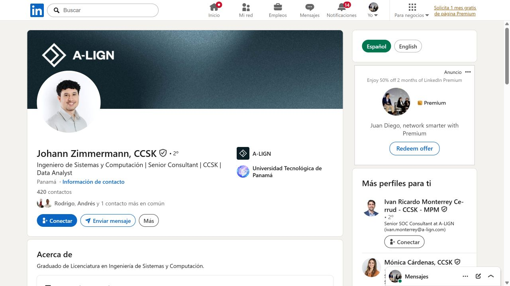

**Senal visible:** Johann Zimmermann, CCSK • 2º

**Por que encaja con Gabriel:** Tiene senales visibles relacionadas con datos, sistemas, automatizacion o tecnologia, utiles para ampliar una red profesional cercana al trabajo de Gabriel.

**Valor potencial para networking/B2B:** puede servir como contacto para conversaciones sobre dashboards, automatizacion de procesos, analitica aplicada, implementaciones internas de IA o posibles referidos hacia empresas que necesitan ordenar datos y sistemas.

**Mensaje sugerido manual:**

> Hola Johann, vi que trabajas/estudias temas cercanos a datos, sistemas e IA. Estoy conectando con personas de la region que estan construyendo en analitica, automatizacion y herramientas empresariales. Me gustaria conectar y seguir aprendiendo de lo que compartes.

<strong>030. Henry J. Rodriguez Dorta</strong> - Datos, sistemas e IA

**Link de perfil:** [Abrir perfil de LinkedIn](https://www.linkedin.com/in/henryrodriguezdorta/es)

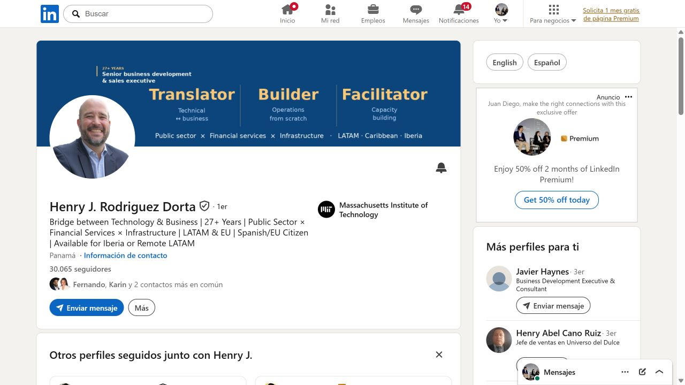

**Senal visible:** Henry J. Rodriguez Dorta, César González Camargo y 5 contactos más en común

**Por que encaja con Gabriel:** Tiene senales visibles relacionadas con datos, sistemas, automatizacion o tecnologia, utiles para ampliar una red profesional cercana al trabajo de Gabriel.

**Valor potencial para networking/B2B:** puede servir como contacto para conversaciones sobre dashboards, automatizacion de procesos, analitica aplicada, implementaciones internas de IA o posibles referidos hacia empresas que necesitan ordenar datos y sistemas.

**Mensaje sugerido manual:**

> Hola Henry, vi que trabajas/estudias temas cercanos a datos, sistemas e IA. Estoy conectando con personas de la region que estan construyendo en analitica, automatizacion y herramientas empresariales. Me gustaria conectar y seguir aprendiendo de lo que compartes.

<strong>031. Carlos Abraham Lambraño Ayala</strong> - Datos, sistemas e IA

**Link de perfil:** [Abrir perfil de LinkedIn](https://www.linkedin.com/in/carlos-abraham-lambra%C3%B1o-ayala-noicamrofni-ed-sametsis-ne-oreinegni-ocilotac)

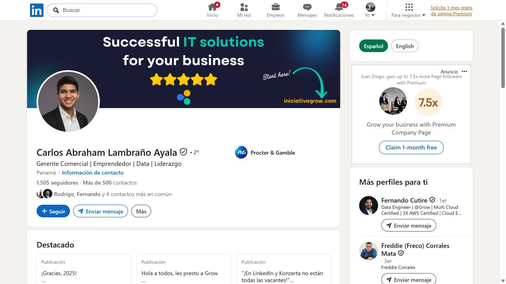

**Senal visible:** Carlos Abraham Lambraño Ayala • 2º

**Por que encaja con Gabriel:** Tiene senales visibles relacionadas con datos, sistemas, automatizacion o tecnologia, utiles para ampliar una red profesional cercana al trabajo de Gabriel.

**Valor potencial para networking/B2B:** puede servir como contacto para conversaciones sobre dashboards, automatizacion de procesos, analitica aplicada, implementaciones internas de IA o posibles referidos hacia empresas que necesitan ordenar datos y sistemas.

**Mensaje sugerido manual:**

> Hola Carlos, vi que trabajas/estudias temas cercanos a datos, sistemas e IA. Estoy conectando con personas de la region que estan construyendo en analitica, automatizacion y herramientas empresariales. Me gustaria conectar y seguir aprendiendo de lo que compartes.

<strong>032. Julio A Monasterio H</strong> - Datos, sistemas e IA

**Link de perfil:** [Abrir perfil de LinkedIn](https://www.linkedin.com/in/juliomonasterio)

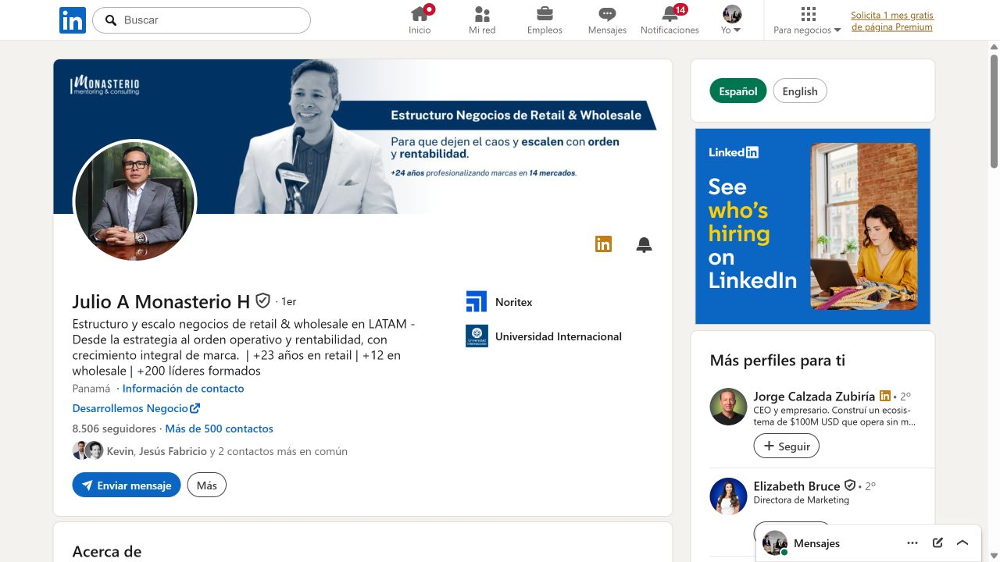

**Senal visible:** Julio A Monasterio H, Daniel Wen Lay y 4 contactos más en común

**Por que encaja con Gabriel:** Tiene senales visibles relacionadas con datos, sistemas, automatizacion o tecnologia, utiles para ampliar una red profesional cercana al trabajo de Gabriel.

**Valor potencial para networking/B2B:** puede servir como contacto para conversaciones sobre dashboards, automatizacion de procesos, analitica aplicada, implementaciones internas de IA o posibles referidos hacia empresas que necesitan ordenar datos y sistemas.

**Mensaje sugerido manual:**

> Hola Julio, vi que trabajas/estudias temas cercanos a datos, sistemas e IA. Estoy conectando con personas de la region que estan construyendo en analitica, automatizacion y herramientas empresariales. Me gustaria conectar y seguir aprendiendo de lo que compartes.

<strong>033. Kevin González</strong> - Datos, sistemas e IA

**Link de perfil:** [Abrir perfil de LinkedIn](https://www.linkedin.com/in/bussines-intelligence-finanzas-planner-controller-dataanalyst-kevingonzalez)

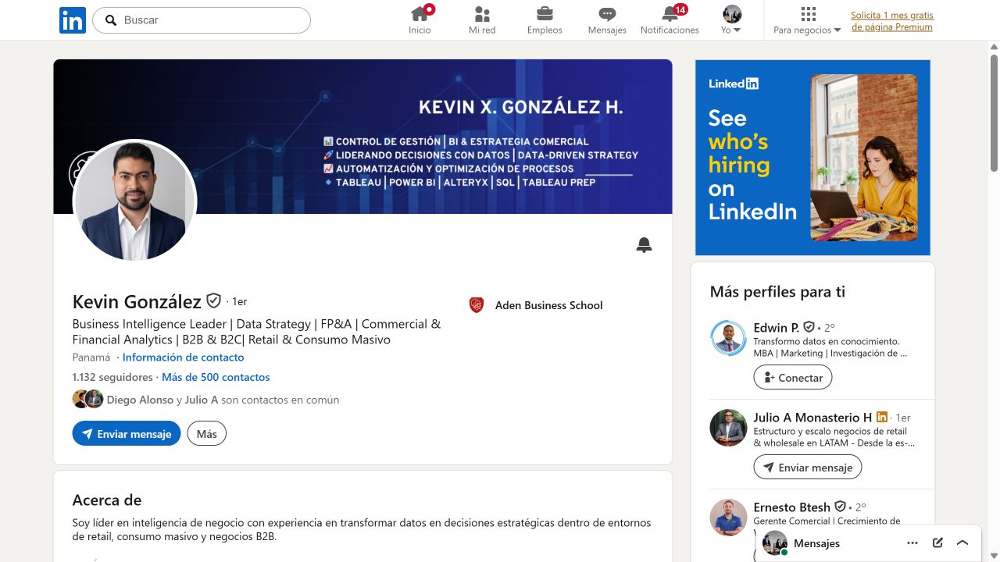

**Senal visible:** Kevin González, Daniel Wen Lay y 2 contactos más en común

**Por que encaja con Gabriel:** Tiene senales visibles relacionadas con datos, sistemas, automatizacion o tecnologia, utiles para ampliar una red profesional cercana al trabajo de Gabriel.

**Valor potencial para networking/B2B:** puede servir como contacto para conversaciones sobre dashboards, automatizacion de procesos, analitica aplicada, implementaciones internas de IA o posibles referidos hacia empresas que necesitan ordenar datos y sistemas.

**Mensaje sugerido manual:**

> Hola Kevin, vi que trabajas/estudias temas cercanos a datos, sistemas e IA. Estoy conectando con personas de la region que estan construyendo en analitica, automatizacion y herramientas empresariales. Me gustaria conectar y seguir aprendiendo de lo que compartes.

<strong>034. Arimaveth Quintero</strong> - Datos, sistemas e IA

**Link de perfil:** [Abrir perfil de LinkedIn](https://www.linkedin.com/in/arimaveth-q-66100b176)

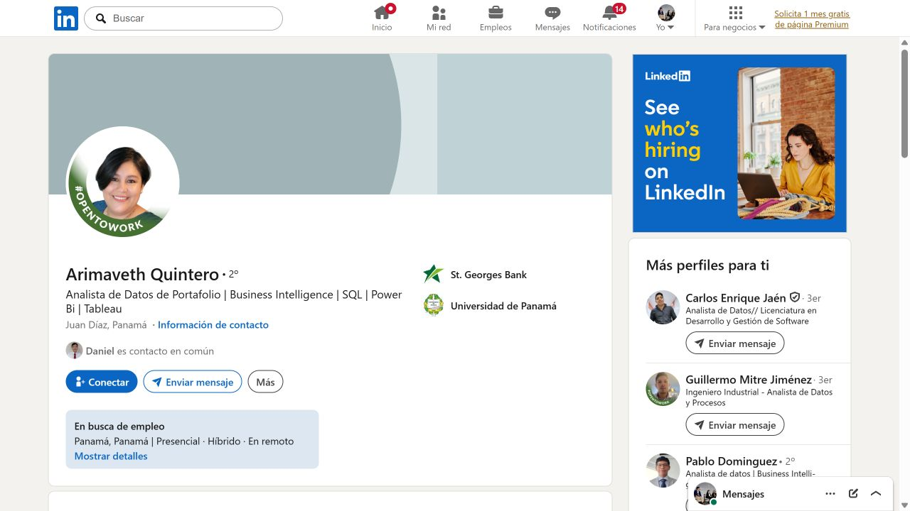

**Senal visible:** Arimaveth Quintero • 2º

**Por que encaja con Gabriel:** Tiene senales visibles relacionadas con datos, sistemas, automatizacion o tecnologia, utiles para ampliar una red profesional cercana al trabajo de Gabriel.

**Valor potencial para networking/B2B:** puede servir como contacto para conversaciones sobre dashboards, automatizacion de procesos, analitica aplicada, implementaciones internas de IA o posibles referidos hacia empresas que necesitan ordenar datos y sistemas.

**Mensaje sugerido manual:**

> Hola Arimaveth, vi que trabajas/estudias temas cercanos a datos, sistemas e IA. Estoy conectando con personas de la region que estan construyendo en analitica, automatizacion y herramientas empresariales. Me gustaria conectar y seguir aprendiendo de lo que compartes.

<strong>035. Juan Pérez</strong> - Datos, sistemas e IA

**Link de perfil:** [Abrir perfil de LinkedIn](https://www.linkedin.com/in/juan-p%C3%A9rez-4512a7269)

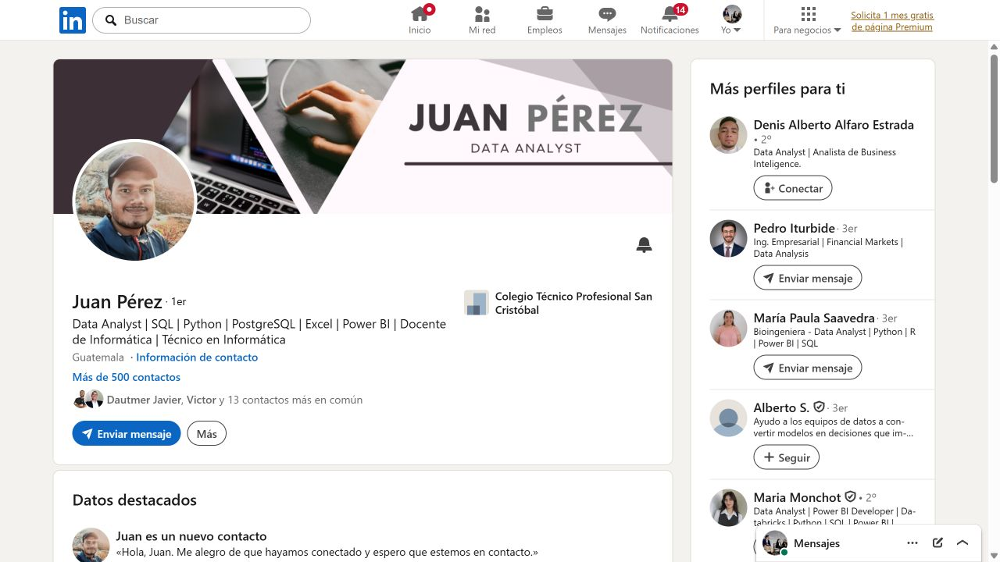

**Senal visible:** Juan Pérez es contacto en común

**Por que encaja con Gabriel:** Tiene senales visibles relacionadas con datos, sistemas, automatizacion o tecnologia, utiles para ampliar una red profesional cercana al trabajo de Gabriel.

**Valor potencial para networking/B2B:** puede servir como contacto para conversaciones sobre dashboards, automatizacion de procesos, analitica aplicada, implementaciones internas de IA o posibles referidos hacia empresas que necesitan ordenar datos y sistemas.

**Mensaje sugerido manual:**

> Hola Juan, vi que trabajas/estudias temas cercanos a datos, sistemas e IA. Estoy conectando con personas de la region que estan construyendo en analitica, automatizacion y herramientas empresariales. Me gustaria conectar y seguir aprendiendo de lo que compartes.

<strong>036. Richard Enrique Hurtado Ruiz</strong> - Datos, sistemas e IA

**Link de perfil:** [Abrir perfil de LinkedIn](https://www.linkedin.com/in/richard-enrique-hurtado-ruiz-814a392a9)

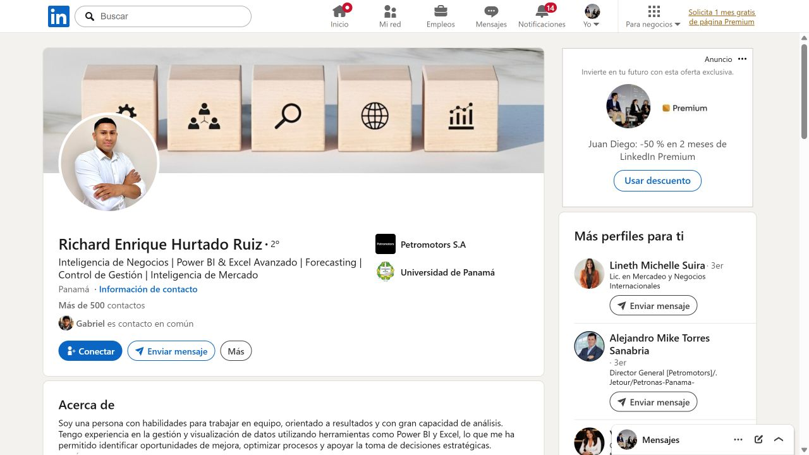

**Senal visible:** Richard Enrique Hurtado Ruiz • 2º

**Por que encaja con Gabriel:** Tiene senales visibles relacionadas con datos, sistemas, automatizacion o tecnologia, utiles para ampliar una red profesional cercana al trabajo de Gabriel.

**Valor potencial para networking/B2B:** puede servir como contacto para conversaciones sobre dashboards, automatizacion de procesos, analitica aplicada, implementaciones internas de IA o posibles referidos hacia empresas que necesitan ordenar datos y sistemas.

**Mensaje sugerido manual:**

> Hola Richard, vi que trabajas/estudias temas cercanos a datos, sistemas e IA. Estoy conectando con personas de la region que estan construyendo en analitica, automatizacion y herramientas empresariales. Me gustaria conectar y seguir aprendiendo de lo que compartes.

<strong>037. José Ramón López</strong> - Datos, sistemas e IA

**Link de perfil:** [Abrir perfil de LinkedIn](https://www.linkedin.com/in/jrl123/es)

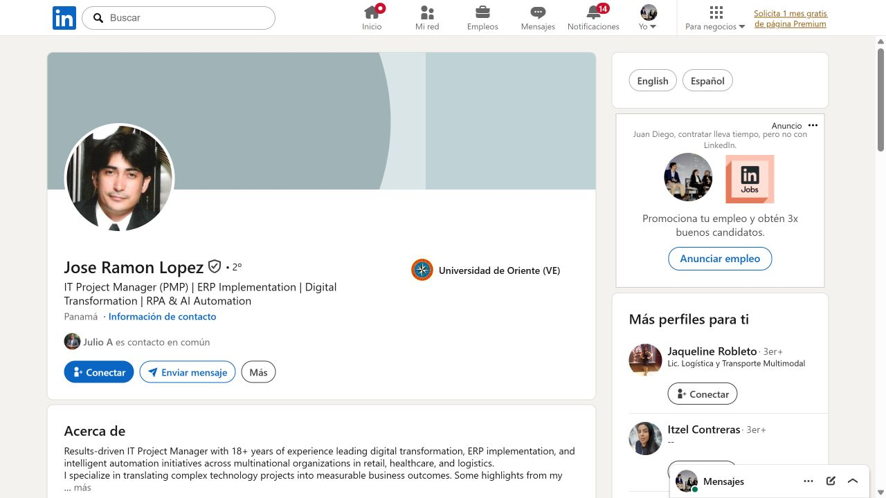

**Senal visible:** José Ramón López • 2º

**Por que encaja con Gabriel:** Tiene senales visibles relacionadas con datos, sistemas, automatizacion o tecnologia, utiles para ampliar una red profesional cercana al trabajo de Gabriel.

**Valor potencial para networking/B2B:** puede servir como contacto para conversaciones sobre dashboards, automatizacion de procesos, analitica aplicada, implementaciones internas de IA o posibles referidos hacia empresas que necesitan ordenar datos y sistemas.

**Mensaje sugerido manual:**

> Hola José, vi que trabajas/estudias temas cercanos a datos, sistemas e IA. Estoy conectando con personas de la region que estan construyendo en analitica, automatizacion y herramientas empresariales. Me gustaria conectar y seguir aprendiendo de lo que compartes.

<strong>038. Alan Emanuel Hasman</strong> - Datos, sistemas e IA

**Link de perfil:** [Abrir perfil de LinkedIn](https://www.linkedin.com/in/alanhasman)

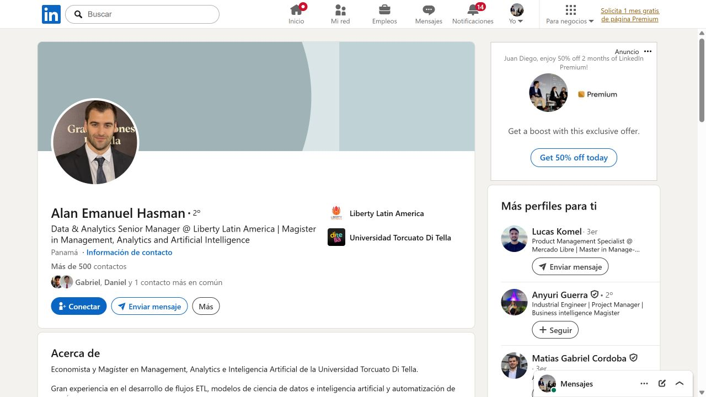

**Senal visible:** Alan Emanuel Hasman • 2º

**Por que encaja con Gabriel:** Tiene senales visibles relacionadas con datos, sistemas, automatizacion o tecnologia, utiles para ampliar una red profesional cercana al trabajo de Gabriel.

**Valor potencial para networking/B2B:** puede servir como contacto para conversaciones sobre dashboards, automatizacion de procesos, analitica aplicada, implementaciones internas de IA o posibles referidos hacia empresas que necesitan ordenar datos y sistemas.

**Mensaje sugerido manual:**

> Hola Alan, vi que trabajas/estudias temas cercanos a datos, sistemas e IA. Estoy conectando con personas de la region que estan construyendo en analitica, automatizacion y herramientas empresariales. Me gustaria conectar y seguir aprendiendo de lo que compartes.

<strong>039. Ignacio Ezequiel Muesa Aguirre</strong> - Datos, sistemas e IA

**Link de perfil:** [Abrir perfil de LinkedIn](https://www.linkedin.com/in/ignacio-muesa)

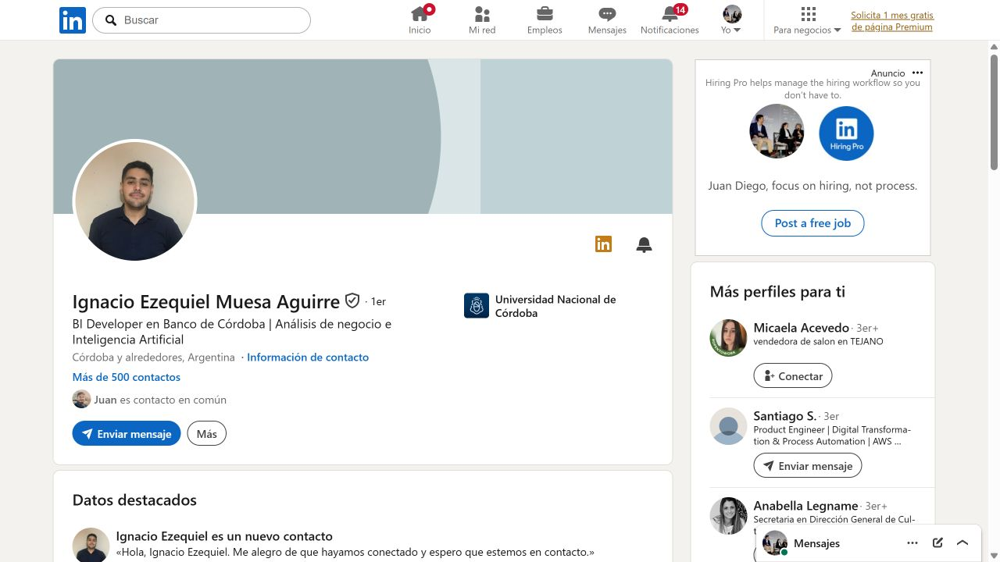

**Senal visible:** Daniel Wen Lay, Ignacio Ezequiel Muesa Aguirre y 1 contacto más en común

**Por que encaja con Gabriel:** Tiene senales visibles relacionadas con datos, sistemas, automatizacion o tecnologia, utiles para ampliar una red profesional cercana al trabajo de Gabriel.

**Valor potencial para networking/B2B:** puede servir como contacto para conversaciones sobre dashboards, automatizacion de procesos, analitica aplicada, implementaciones internas de IA o posibles referidos hacia empresas que necesitan ordenar datos y sistemas.

**Mensaje sugerido manual:**

> Hola Ignacio, vi que trabajas/estudias temas cercanos a datos, sistemas e IA. Estoy conectando con personas de la region que estan construyendo en analitica, automatizacion y herramientas empresariales. Me gustaria conectar y seguir aprendiendo de lo que compartes.

<strong>040. Reiver Lopez</strong> - Datos, sistemas e IA

**Link de perfil:** [Abrir perfil de LinkedIn](https://www.linkedin.com/in/reiverlopez)

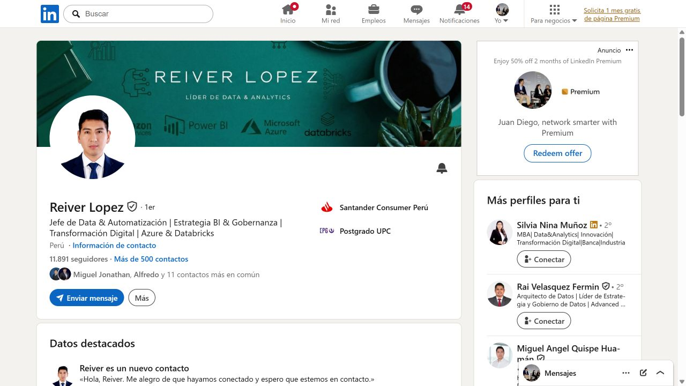

**Senal visible:** Reiver Lopez y Miguel Jonathan Mogrovejo Cardenas son contactos en común

**Por que encaja con Gabriel:** Tiene senales visibles relacionadas con datos, sistemas, automatizacion o tecnologia, utiles para ampliar una red profesional cercana al trabajo de Gabriel.

**Valor potencial para networking/B2B:** puede servir como contacto para conversaciones sobre dashboards, automatizacion de procesos, analitica aplicada, implementaciones internas de IA o posibles referidos hacia empresas que necesitan ordenar datos y sistemas.

**Mensaje sugerido manual:**

> Hola Reiver, vi que trabajas/estudias temas cercanos a datos, sistemas e IA. Estoy conectando con personas de la region que estan construyendo en analitica, automatizacion y herramientas empresariales. Me gustaria conectar y seguir aprendiendo de lo que compartes.

<strong>041. Miguel Jonathan Mogrovejo Cardenas</strong> - Datos, sistemas e IA

**Link de perfil:** [Abrir perfil de LinkedIn](https://www.linkedin.com/in/mjmc4498)

**Senal visible:** Reiver Lopez y Miguel Jonathan Mogrovejo Cardenas son contactos en común

**Por que encaja con Gabriel:** Tiene senales visibles relacionadas con datos, sistemas, automatizacion o tecnologia, utiles para ampliar una red profesional cercana al trabajo de Gabriel.

**Valor potencial para networking/B2B:** puede servir como contacto para conversaciones sobre dashboards, automatizacion de procesos, analitica aplicada, implementaciones internas de IA o posibles referidos hacia empresas que necesitan ordenar datos y sistemas.

**Mensaje sugerido manual:**

> Hola Miguel, vi que trabajas/estudias temas cercanos a datos, sistemas e IA. Estoy conectando con personas de la region que estan construyendo en analitica, automatizacion y herramientas empresariales. Me gustaria conectar y seguir aprendiendo de lo que compartes.

<strong>042. Rodrigo Contreras, CFA, FPAP</strong> - Datos, sistemas e IA

**Link de perfil:** [Abrir perfil de LinkedIn](https://www.linkedin.com/in/rodrigo-arturo-contreras-candido)

**Senal visible:** Rodrigo Contreras, CFA, FPAP • 2º

**Por que encaja con Gabriel:** Tiene senales visibles relacionadas con datos, sistemas, automatizacion o tecnologia, utiles para ampliar una red profesional cercana al trabajo de Gabriel.

**Valor potencial para networking/B2B:** puede servir como contacto para conversaciones sobre dashboards, automatizacion de procesos, analitica aplicada, implementaciones internas de IA o posibles referidos hacia empresas que necesitan ordenar datos y sistemas.

**Mensaje sugerido manual:**

> Hola Rodrigo, vi que trabajas/estudias temas cercanos a datos, sistemas e IA. Estoy conectando con personas de la region que estan construyendo en analitica, automatizacion y herramientas empresariales. Me gustaria conectar y seguir aprendiendo de lo que compartes.

<strong>043. Antonio Sánchez De Boeck</strong> - Datos, sistemas e IA

**Link de perfil:** [Abrir perfil de LinkedIn](https://www.linkedin.com/in/sanchezdeboeck)

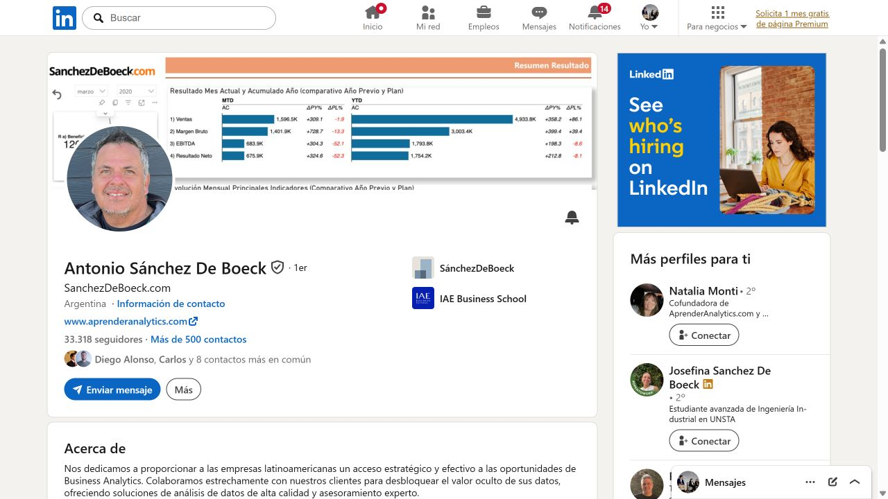

**Senal visible:** Antonio Sánchez De Boeck es contacto en común

**Por que encaja con Gabriel:** Tiene senales visibles relacionadas con datos, sistemas, automatizacion o tecnologia, utiles para ampliar una red profesional cercana al trabajo de Gabriel.

**Valor potencial para networking/B2B:** puede servir como contacto para conversaciones sobre dashboards, automatizacion de procesos, analitica aplicada, implementaciones internas de IA o posibles referidos hacia empresas que necesitan ordenar datos y sistemas.

**Mensaje sugerido manual:**

> Hola Antonio, vi que trabajas/estudias temas cercanos a datos, sistemas e IA. Estoy conectando con personas de la region que estan construyendo en analitica, automatizacion y herramientas empresariales. Me gustaria conectar y seguir aprendiendo de lo que compartes.

<strong>044. Alexander Herrera Samaniego</strong> - Datos, sistemas e IA

**Link de perfil:** [Abrir perfil de LinkedIn](https://www.linkedin.com/in/alexander-herrera-samaniego)

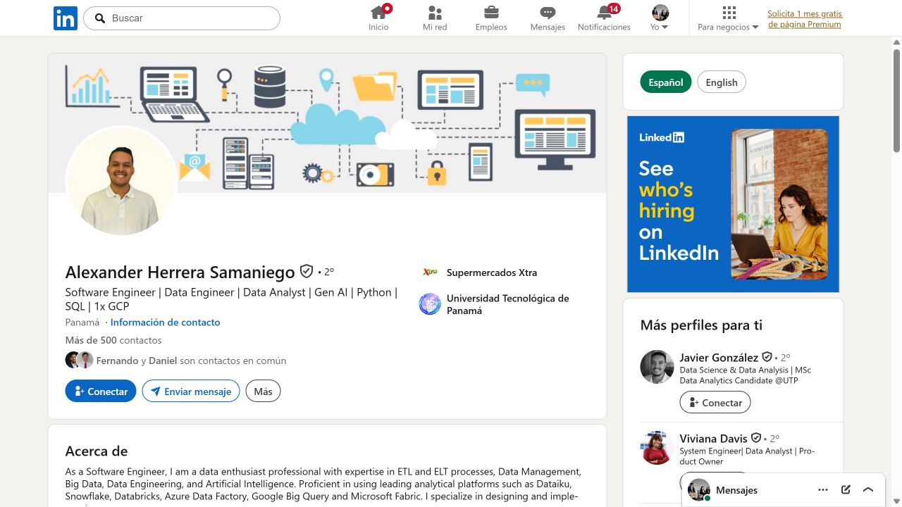

**Senal visible:** Alexander Herrera Samaniego • 2º

**Por que encaja con Gabriel:** Tiene senales visibles relacionadas con datos, sistemas, automatizacion o tecnologia, utiles para ampliar una red profesional cercana al trabajo de Gabriel.

**Valor potencial para networking/B2B:** puede servir como contacto para conversaciones sobre dashboards, automatizacion de procesos, analitica aplicada, implementaciones internas de IA o posibles referidos hacia empresas que necesitan ordenar datos y sistemas.

**Mensaje sugerido manual:**

> Hola Alexander, vi que trabajas/estudias temas cercanos a datos, sistemas e IA. Estoy conectando con personas de la region que estan construyendo en analitica, automatizacion y herramientas empresariales. Me gustaria conectar y seguir aprendiendo de lo que compartes.

<strong>045. Jose Gustavo Cuervo Aguilar</strong> - Datos, sistemas e IA

**Link de perfil:** [Abrir perfil de LinkedIn](https://www.linkedin.com/in/gustavo-cuervo)

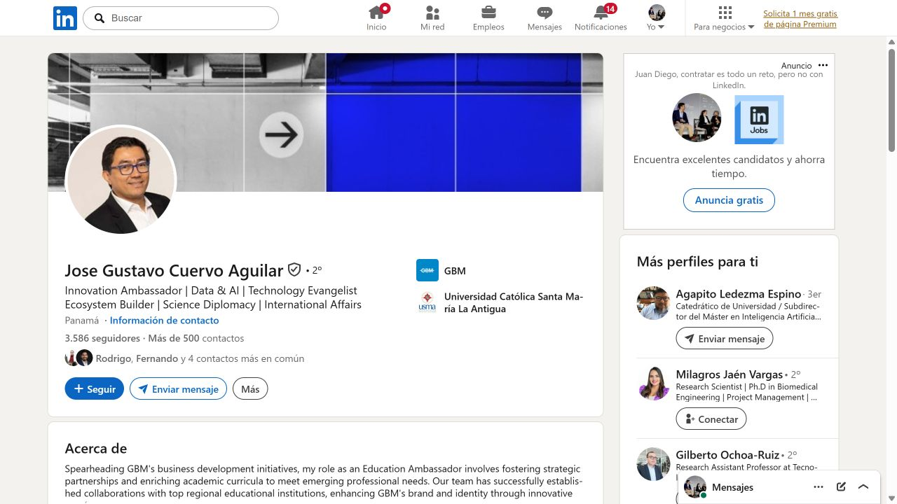

**Senal visible:** Jose Gustavo Cuervo Aguilar • 2º

**Por que encaja con Gabriel:** Tiene senales visibles relacionadas con datos, sistemas, automatizacion o tecnologia, utiles para ampliar una red profesional cercana al trabajo de Gabriel.

**Valor potencial para networking/B2B:** puede servir como contacto para conversaciones sobre dashboards, automatizacion de procesos, analitica aplicada, implementaciones internas de IA o posibles referidos hacia empresas que necesitan ordenar datos y sistemas.

**Mensaje sugerido manual:**

> Hola Jose, vi que trabajas/estudias temas cercanos a datos, sistemas e IA. Estoy conectando con personas de la region que estan construyendo en analitica, automatizacion y herramientas empresariales. Me gustaria conectar y seguir aprendiendo de lo que compartes.

<strong>046. Karin Sempf</strong> - Datos, sistemas e IA

**Link de perfil:** [Abrir perfil de LinkedIn](https://www.linkedin.com/in/karinsempf)

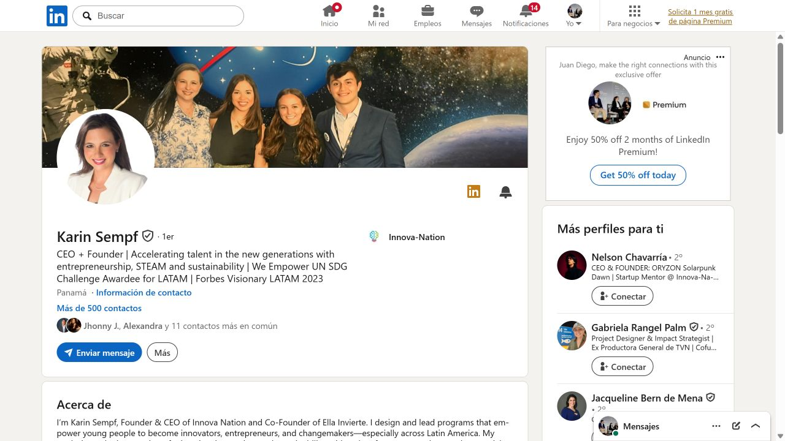

**Senal visible:** Karin Sempf, Daniel Wen Lay y 4 contactos más en común

**Por que encaja con Gabriel:** Tiene senales visibles relacionadas con datos, sistemas, automatizacion o tecnologia, utiles para ampliar una red profesional cercana al trabajo de Gabriel.

**Valor potencial para networking/B2B:** puede servir como contacto para conversaciones sobre dashboards, automatizacion de procesos, analitica aplicada, implementaciones internas de IA o posibles referidos hacia empresas que necesitan ordenar datos y sistemas.

**Mensaje sugerido manual:**

> Hola Karin, vi que trabajas/estudias temas cercanos a datos, sistemas e IA. Estoy conectando con personas de la region que estan construyendo en analitica, automatizacion y herramientas empresariales. Me gustaria conectar y seguir aprendiendo de lo que compartes.

<strong>047. Stephanie Quezada</strong> - Datos, sistemas e IA

**Link de perfil:** [Abrir perfil de LinkedIn](https://www.linkedin.com/in/stephanie-quezada-5a4394178)

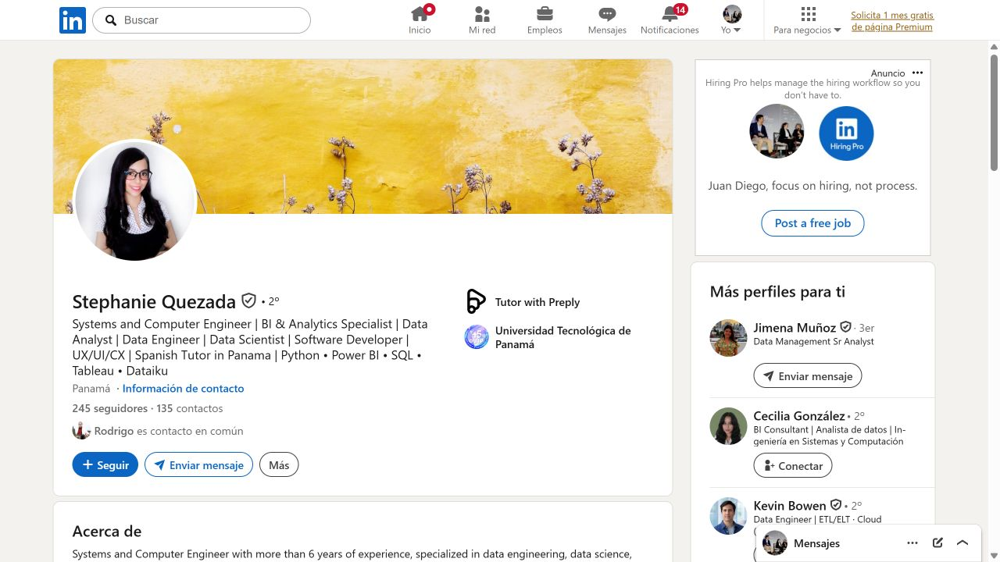

**Senal visible:** Stephanie Quezada • 2º

**Por que encaja con Gabriel:** Tiene senales visibles relacionadas con datos, sistemas, automatizacion o tecnologia, utiles para ampliar una red profesional cercana al trabajo de Gabriel.

**Valor potencial para networking/B2B:** puede servir como contacto para conversaciones sobre dashboards, automatizacion de procesos, analitica aplicada, implementaciones internas de IA o posibles referidos hacia empresas que necesitan ordenar datos y sistemas.

**Mensaje sugerido manual:**

> Hola Stephanie, vi que trabajas/estudias temas cercanos a datos, sistemas e IA. Estoy conectando con personas de la region que estan construyendo en analitica, automatizacion y herramientas empresariales. Me gustaria conectar y seguir aprendiendo de lo que compartes.

<strong>048. Manuel Mauricio Serna</strong> - Datos, sistemas e IA

**Link de perfil:** [Abrir perfil de LinkedIn](https://www.linkedin.com/in/manuel-mauricio-serna-aba408157)

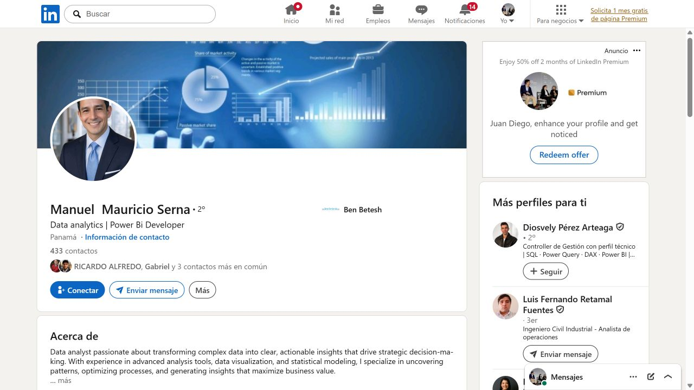

**Senal visible:** Manuel Mauricio Serna • 2º

**Por que encaja con Gabriel:** Tiene senales visibles relacionadas con datos, sistemas, automatizacion o tecnologia, utiles para ampliar una red profesional cercana al trabajo de Gabriel.

**Valor potencial para networking/B2B:** puede servir como contacto para conversaciones sobre dashboards, automatizacion de procesos, analitica aplicada, implementaciones internas de IA o posibles referidos hacia empresas que necesitan ordenar datos y sistemas.

**Mensaje sugerido manual:**

> Hola Manuel, vi que trabajas/estudias temas cercanos a datos, sistemas e IA. Estoy conectando con personas de la region que estan construyendo en analitica, automatizacion y herramientas empresariales. Me gustaria conectar y seguir aprendiendo de lo que compartes.

<strong>049. RICARDO ALFREDO HUAMAN SUAREZ</strong> - Datos, sistemas e IA

**Link de perfil:** [Abrir perfil de LinkedIn](https://www.linkedin.com/in/ricardo-alfredo-huaman-suarez-65319483)

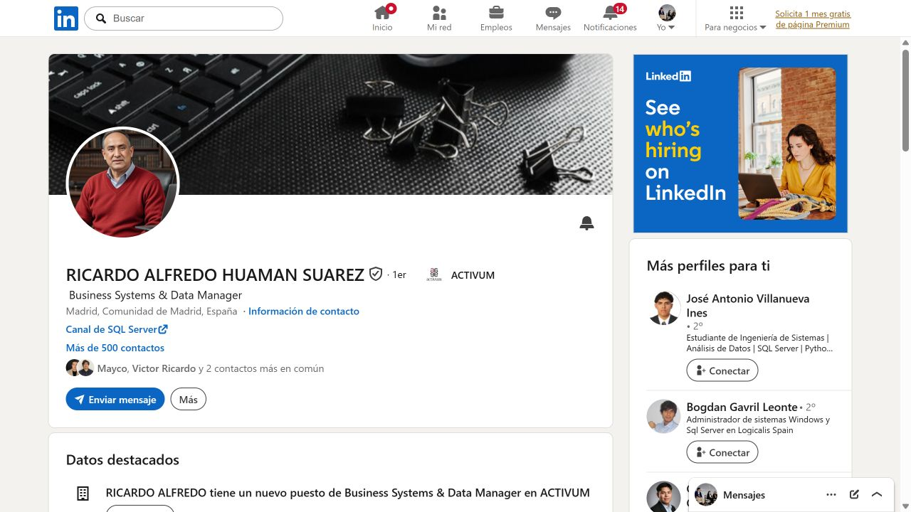

**Senal visible:** RICARDO ALFREDO HUAMAN SUAREZ, Antonio Sánchez De Boeck y 3 contactos más en común

**Por que encaja con Gabriel:** Tiene senales visibles relacionadas con datos, sistemas, automatizacion o tecnologia, utiles para ampliar una red profesional cercana al trabajo de Gabriel.

**Valor potencial para networking/B2B:** puede servir como contacto para conversaciones sobre dashboards, automatizacion de procesos, analitica aplicada, implementaciones internas de IA o posibles referidos hacia empresas que necesitan ordenar datos y sistemas.

**Mensaje sugerido manual:**

> Hola RICARDO, vi que trabajas/estudias temas cercanos a datos, sistemas e IA. Estoy conectando con personas de la region que estan construyendo en analitica, automatizacion y herramientas empresariales. Me gustaria conectar y seguir aprendiendo de lo que compartes.

<strong>050. Isaacs Eliecer Hurtado Cerceño</strong> - Datos, sistemas e IA

**Link de perfil:** [Abrir perfil de LinkedIn](https://www.linkedin.com/in/isaacs-hurtado)

**Senal visible:** Isaacs Eliecer Hurtado Cerceño • 2º

**Por que encaja con Gabriel:** Tiene senales visibles relacionadas con datos, sistemas, automatizacion o tecnologia, utiles para ampliar una red profesional cercana al trabajo de Gabriel.

**Valor potencial para networking/B2B:** puede servir como contacto para conversaciones sobre dashboards, automatizacion de procesos, analitica aplicada, implementaciones internas de IA o posibles referidos hacia empresas que necesitan ordenar datos y sistemas.

**Mensaje sugerido manual:**

> Hola Isaacs, vi que trabajas/estudias temas cercanos a datos, sistemas e IA. Estoy conectando con personas de la region que estan construyendo en analitica, automatizacion y herramientas empresariales. Me gustaria conectar y seguir aprendiendo de lo que compartes.

<strong>051. Juan Carlos Figueroa Figueroa</strong> - Datos, sistemas e IA

**Link de perfil:** [Abrir perfil de LinkedIn](https://www.linkedin.com/in/jcffsv)

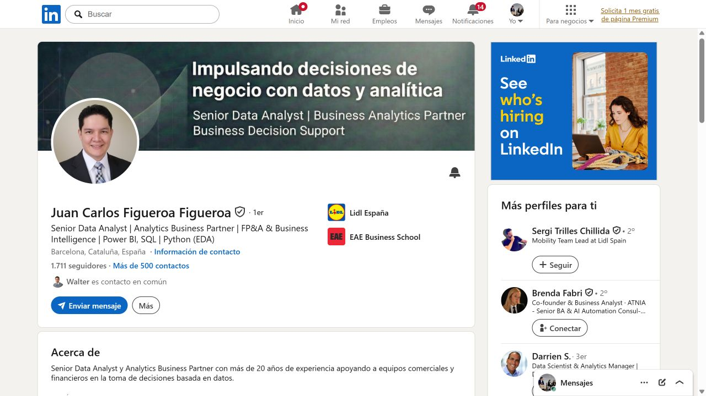

**Senal visible:** Juan Carlos Figueroa Figueroa, RICARDO ALFREDO HUAMAN SUAREZ y 5 contactos más en común

**Por que encaja con Gabriel:** Tiene senales visibles relacionadas con datos, sistemas, automatizacion o tecnologia, utiles para ampliar una red profesional cercana al trabajo de Gabriel.

**Valor potencial para networking/B2B:** puede servir como contacto para conversaciones sobre dashboards, automatizacion de procesos, analitica aplicada, implementaciones internas de IA o posibles referidos hacia empresas que necesitan ordenar datos y sistemas.

**Mensaje sugerido manual:**

> Hola Juan, vi que trabajas/estudias temas cercanos a datos, sistemas e IA. Estoy conectando con personas de la region que estan construyendo en analitica, automatizacion y herramientas empresariales. Me gustaria conectar y seguir aprendiendo de lo que compartes.

<strong>052. Mariano Bertoldo</strong> - Datos, sistemas e IA

**Link de perfil:** [Abrir perfil de LinkedIn](https://www.linkedin.com/in/mariano-bertoldo)

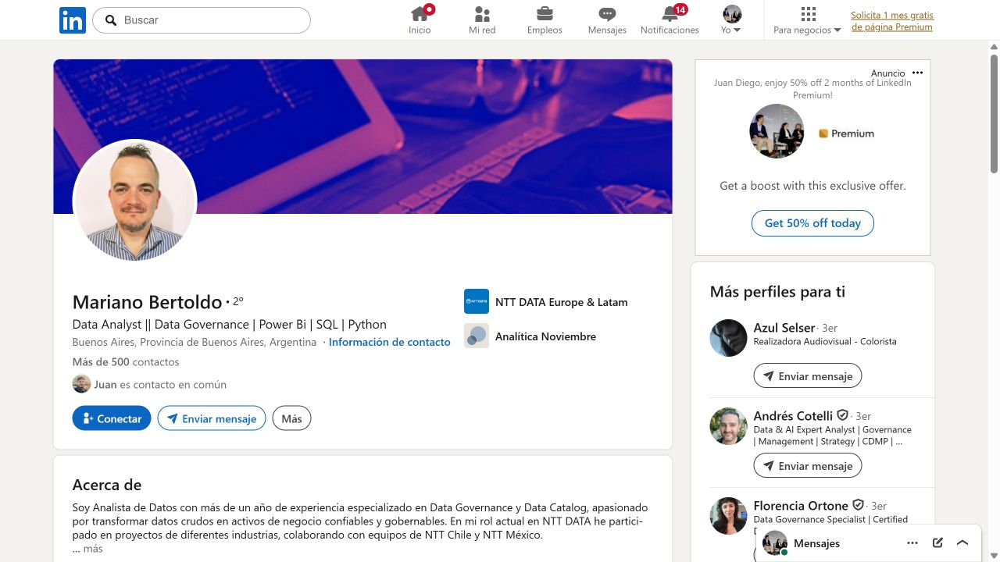

**Senal visible:** Mariano Bertoldo • 2º

**Por que encaja con Gabriel:** Tiene senales visibles de IA/agentes, alineadas con el posicionamiento de Gabriel en datos, sistemas e IA.

**Valor potencial para networking/B2B:** puede servir como contacto para conversaciones sobre dashboards, automatizacion de procesos, analitica aplicada, implementaciones internas de IA o posibles referidos hacia empresas que necesitan ordenar datos y sistemas.

**Mensaje sugerido manual:**

> Hola Mariano, vi que trabajas/estudias temas cercanos a datos, sistemas e IA. Estoy conectando con personas de la region que estan construyendo en analitica, automatizacion y herramientas empresariales. Me gustaria conectar y seguir aprendiendo de lo que compartes.

<strong>053. Hesus Garcia</strong> - Datos, sistemas e IA

**Link de perfil:** [Abrir perfil de LinkedIn](https://www.linkedin.com/in/hgcobos)

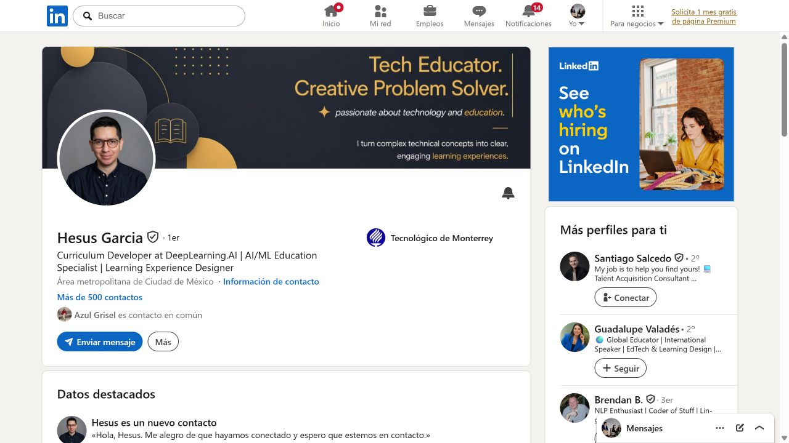

**Senal visible:** Hesus Garcia es contacto en común

**Por que encaja con Gabriel:** Tiene senales visibles de IA/agentes, alineadas con el posicionamiento de Gabriel en datos, sistemas e IA.

**Valor potencial para networking/B2B:** puede servir como contacto para conversaciones sobre dashboards, automatizacion de procesos, analitica aplicada, implementaciones internas de IA o posibles referidos hacia empresas que necesitan ordenar datos y sistemas.

**Mensaje sugerido manual:**

> Hola Hesus, vi que trabajas/estudias temas cercanos a datos, sistemas e IA. Estoy conectando con personas de la region que estan construyendo en analitica, automatizacion y herramientas empresariales. Me gustaria conectar y seguir aprendiendo de lo que compartes.

<strong>054. Pamela Viana Mendieta</strong> - Datos, sistemas e IA

**Link de perfil:** [Abrir perfil de LinkedIn](https://www.linkedin.com/in/pvmenta/es)

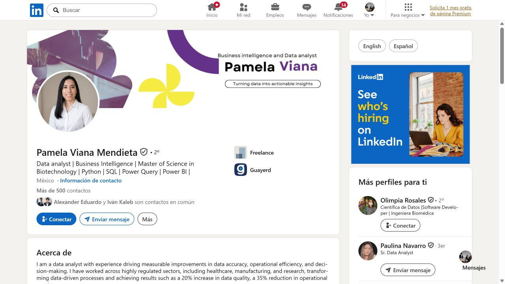

**Senal visible:** Pamela Viana Mendieta • 2º

**Por que encaja con Gabriel:** Tiene senales visibles de IA/agentes, alineadas con el posicionamiento de Gabriel en datos, sistemas e IA.

**Valor potencial para networking/B2B:** puede servir como contacto para conversaciones sobre dashboards, automatizacion de procesos, analitica aplicada, implementaciones internas de IA o posibles referidos hacia empresas que necesitan ordenar datos y sistemas.

**Mensaje sugerido manual:**

> Hola Pamela, vi que trabajas/estudias temas cercanos a datos, sistemas e IA. Estoy conectando con personas de la region que estan construyendo en analitica, automatizacion y herramientas empresariales. Me gustaria conectar y seguir aprendiendo de lo que compartes.

<strong>055. Mariana Unía</strong> - Datos, sistemas e IA

**Link de perfil:** [Abrir perfil de LinkedIn](https://www.linkedin.com/in/mariana-un%C3%ADa)

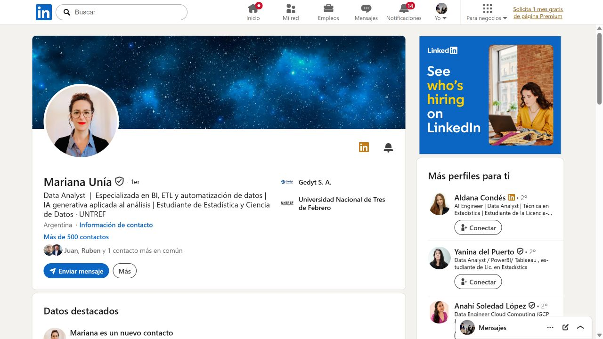

**Senal visible:** Mariana Unía es contacto en común

**Por que encaja con Gabriel:** Tiene senales visibles de IA/agentes, alineadas con el posicionamiento de Gabriel en datos, sistemas e IA.

**Valor potencial para networking/B2B:** puede servir como contacto para conversaciones sobre dashboards, automatizacion de procesos, analitica aplicada, implementaciones internas de IA o posibles referidos hacia empresas que necesitan ordenar datos y sistemas.

**Mensaje sugerido manual:**

> Hola Mariana, vi que trabajas/estudias temas cercanos a datos, sistemas e IA. Estoy conectando con personas de la region que estan construyendo en analitica, automatizacion y herramientas empresariales. Me gustaria conectar y seguir aprendiendo de lo que compartes.

<strong>056. ANAIS CASTILLO QUIROZ</strong> - Datos, sistemas e IA

**Link de perfil:** [Abrir perfil de LinkedIn](https://www.linkedin.com/in/anais-c-76824217a)

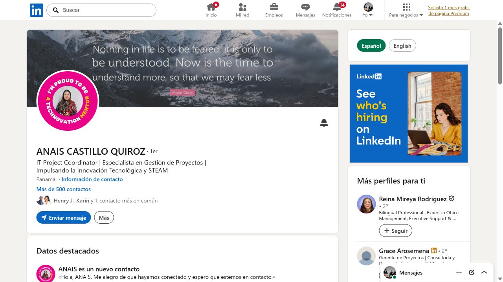

**Senal visible:** Daniel Wen Lay, ANAIS CASTILLO QUIROZ y 2 contactos más en común

**Por que encaja con Gabriel:** Tiene senales visibles de IA/agentes, alineadas con el posicionamiento de Gabriel en datos, sistemas e IA.

**Valor potencial para networking/B2B:** puede servir como contacto para conversaciones sobre dashboards, automatizacion de procesos, analitica aplicada, implementaciones internas de IA o posibles referidos hacia empresas que necesitan ordenar datos y sistemas.

**Mensaje sugerido manual:**

> Hola ANAIS, vi que trabajas/estudias temas cercanos a datos, sistemas e IA. Estoy conectando con personas de la region que estan construyendo en analitica, automatizacion y herramientas empresariales. Me gustaria conectar y seguir aprendiendo de lo que compartes.

<strong>057. Jonathán Bargas Fasciolo •</strong> - Datos, SQL y analitica

**Link de perfil:** [Abrir perfil de LinkedIn](https://www.linkedin.com/in/jonath%C3%A1n-bargas-fasciolo-a3320424b)

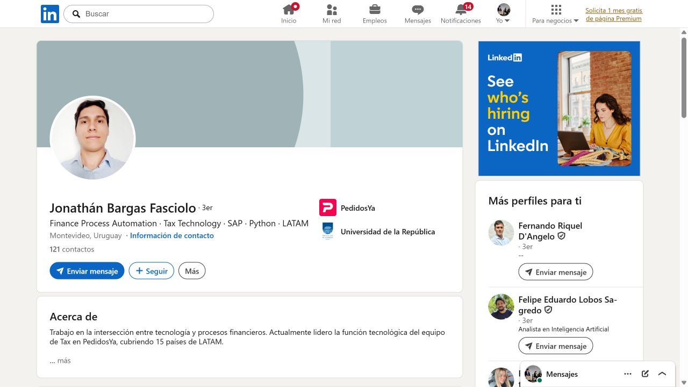

**Senal visible:** Jonathán Bargas Fasciolo • 3er+ Finance Process Automation · Tax Technology · SAP · Python · LATAM Montevideo, Montevideo, Uruguay Enviar mensaje Actual: Tax Data Specialist en PedidosYa

**Por que encaja con Gabriel:** Tiene senales visibles de Python, automatizacion, IA/agentes, alineadas con el posicionamiento de Gabriel en datos, sistemas e IA.

**Valor potencial para networking/B2B:** puede servir como contacto para conversaciones sobre dashboards, automatizacion de procesos, analitica aplicada, implementaciones internas de IA o posibles referidos hacia empresas que necesitan ordenar datos y sistemas.

**Mensaje sugerido manual:**

> Hola Jonathán, vi que trabajas/estudias temas cercanos a datos, sistemas e IA. Estoy conectando con personas de la region que estan construyendo en analitica, automatizacion y herramientas empresariales. Me gustaria conectar y seguir aprendiendo de lo que compartes.

<strong>058. Lucas Angeloni</strong> - Datos, sistemas e IA

**Link de perfil:** [Abrir perfil de LinkedIn](https://www.linkedin.com/in/lucas-angeloni)

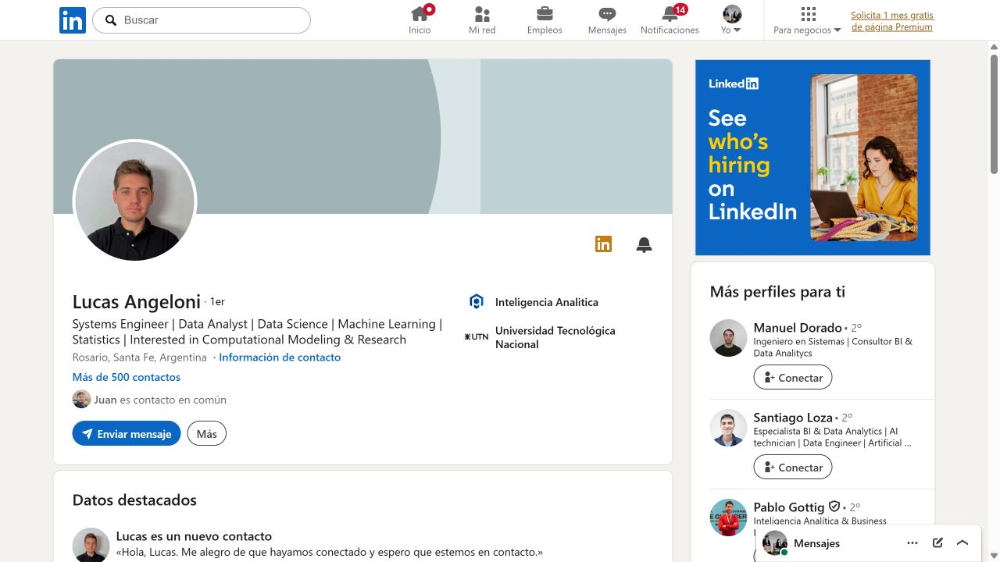

**Senal visible:** Antonio Sánchez De Boeck, Lucas Angeloni y 1 contacto más en común

**Por que encaja con Gabriel:** Tiene senales visibles relacionadas con datos, sistemas, automatizacion o tecnologia, utiles para ampliar una red profesional cercana al trabajo de Gabriel.

**Valor potencial para networking/B2B:** puede servir como contacto para conversaciones sobre dashboards, automatizacion de procesos, analitica aplicada, implementaciones internas de IA o posibles referidos hacia empresas que necesitan ordenar datos y sistemas.

**Mensaje sugerido manual:**

> Hola Lucas, vi que trabajas/estudias temas cercanos a datos, sistemas e IA. Estoy conectando con personas de la region que estan construyendo en analitica, automatizacion y herramientas empresariales. Me gustaria conectar y seguir aprendiendo de lo que compartes.

<strong>059. Isaias Capistrano</strong> - Datos, sistemas e IA

**Link de perfil:** [Abrir perfil de LinkedIn](https://www.linkedin.com/in/isaias-capistrano-63387121a)

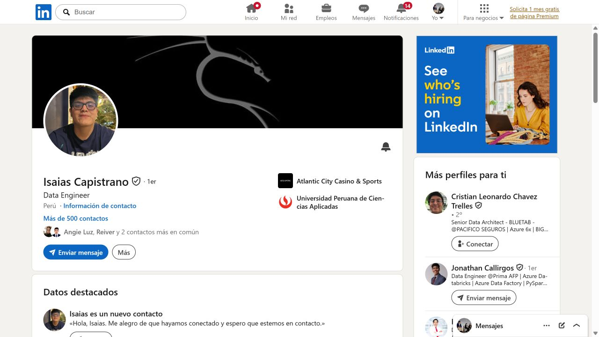

**Senal visible:** Isaias Capistrano es contacto en común

**Por que encaja con Gabriel:** Tiene senales visibles de IA/agentes, alineadas con el posicionamiento de Gabriel en datos, sistemas e IA.

**Valor potencial para networking/B2B:** puede servir como contacto para conversaciones sobre dashboards, automatizacion de procesos, analitica aplicada, implementaciones internas de IA o posibles referidos hacia empresas que necesitan ordenar datos y sistemas.

**Mensaje sugerido manual:**

> Hola Isaias, vi que trabajas/estudias temas cercanos a datos, sistemas e IA. Estoy conectando con personas de la region que estan construyendo en analitica, automatizacion y herramientas empresariales. Me gustaria conectar y seguir aprendiendo de lo que compartes.

<strong>060. Stephanie Gonzalez</strong> - Datos, sistemas e IA

**Link de perfil:** [Abrir perfil de LinkedIn](https://www.linkedin.com/in/stephanie-gonzalez-m/es)

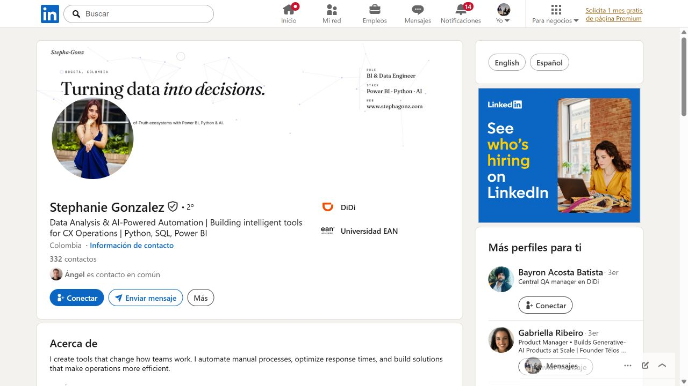

**Senal visible:** Stephanie Gonzalez • 2º

**Por que encaja con Gabriel:** Tiene senales visibles relacionadas con datos, sistemas, automatizacion o tecnologia, utiles para ampliar una red profesional cercana al trabajo de Gabriel.

**Valor potencial para networking/B2B:** puede servir como contacto para conversaciones sobre dashboards, automatizacion de procesos, analitica aplicada, implementaciones internas de IA o posibles referidos hacia empresas que necesitan ordenar datos y sistemas.

**Mensaje sugerido manual:**

> Hola Stephanie, vi que trabajas/estudias temas cercanos a datos, sistemas e IA. Estoy conectando con personas de la region que estan construyendo en analitica, automatizacion y herramientas empresariales. Me gustaria conectar y seguir aprendiendo de lo que compartes.

<strong>061. Ángel Cruz</strong> - Datos, sistemas e IA

**Link de perfil:** [Abrir perfil de LinkedIn](https://www.linkedin.com/in/angelcruzl)

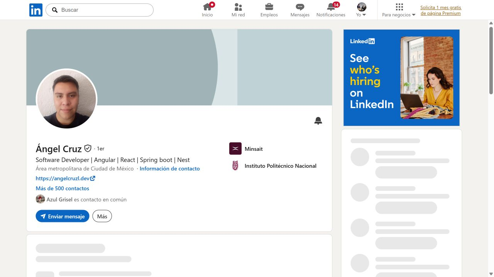

**Senal visible:** Ángel Cruz es contacto en común

**Por que encaja con Gabriel:** Tiene senales visibles relacionadas con datos, sistemas, automatizacion o tecnologia, utiles para ampliar una red profesional cercana al trabajo de Gabriel.

**Valor potencial para networking/B2B:** puede servir como contacto para conversaciones sobre dashboards, automatizacion de procesos, analitica aplicada, implementaciones internas de IA o posibles referidos hacia empresas que necesitan ordenar datos y sistemas.

**Mensaje sugerido manual:**

> Hola Ángel, vi que trabajas/estudias temas cercanos a datos, sistemas e IA. Estoy conectando con personas de la region que estan construyendo en analitica, automatizacion y herramientas empresariales. Me gustaria conectar y seguir aprendiendo de lo que compartes.

<strong>062. Luis Hernan Molina Reinoso</strong> - Datos, sistemas e IA

**Link de perfil:** [Abrir perfil de LinkedIn](https://www.linkedin.com/in/luis-molina-171190)

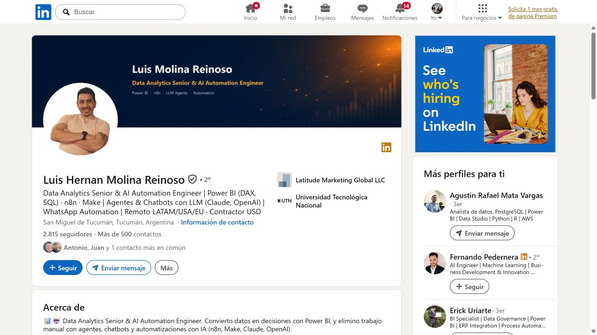

**Senal visible:** Luis Hernan Molina Reinoso • 2º

**Por que encaja con Gabriel:** Tiene senales visibles relacionadas con datos, sistemas, automatizacion o tecnologia, utiles para ampliar una red profesional cercana al trabajo de Gabriel.

**Valor potencial para networking/B2B:** puede servir como contacto para conversaciones sobre dashboards, automatizacion de procesos, analitica aplicada, implementaciones internas de IA o posibles referidos hacia empresas que necesitan ordenar datos y sistemas.

**Mensaje sugerido manual:**

> Hola Luis, vi que trabajas/estudias temas cercanos a datos, sistemas e IA. Estoy conectando con personas de la region que estan construyendo en analitica, automatizacion y herramientas empresariales. Me gustaria conectar y seguir aprendiendo de lo que compartes.

<strong>063. Clifford Justiniani</strong> - Datos, sistemas e IA

**Link de perfil:** [Abrir perfil de LinkedIn](https://www.linkedin.com/in/clifford-justiniani)

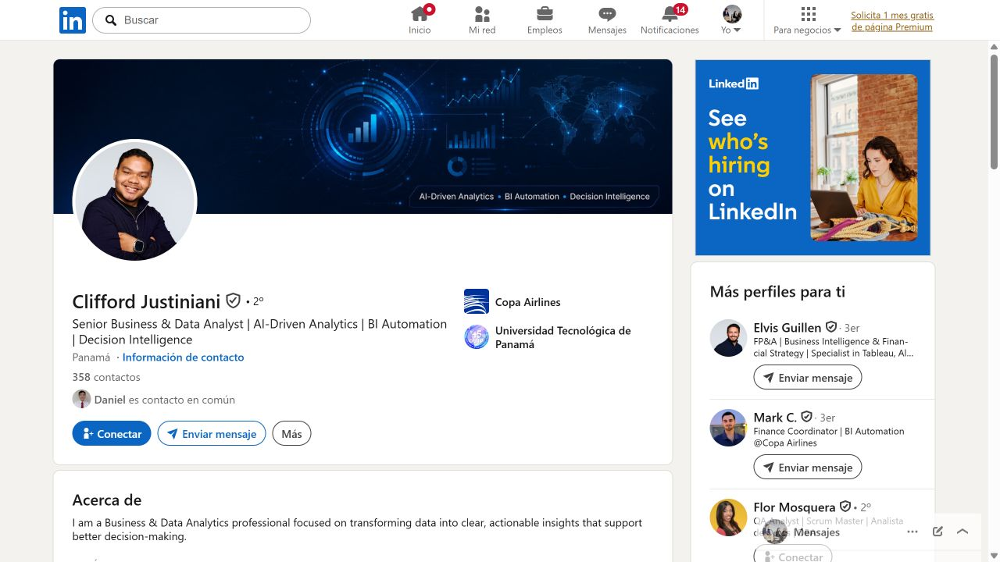

**Senal visible:** Clifford Justiniani • 2º

**Por que encaja con Gabriel:** Tiene senales visibles de IA/agentes, alineadas con el posicionamiento de Gabriel en datos, sistemas e IA.

**Valor potencial para networking/B2B:** puede servir como contacto para conversaciones sobre dashboards, automatizacion de procesos, analitica aplicada, implementaciones internas de IA o posibles referidos hacia empresas que necesitan ordenar datos y sistemas.

**Mensaje sugerido manual:**

> Hola Clifford, vi que trabajas/estudias temas cercanos a datos, sistemas e IA. Estoy conectando con personas de la region que estan construyendo en analitica, automatizacion y herramientas empresariales. Me gustaria conectar y seguir aprendiendo de lo que compartes.

<strong>064. Daniel Olmos</strong> - Datos, sistemas e IA

**Link de perfil:** [Abrir perfil de LinkedIn](https://www.linkedin.com/in/daniel-olmos-5071572a7)

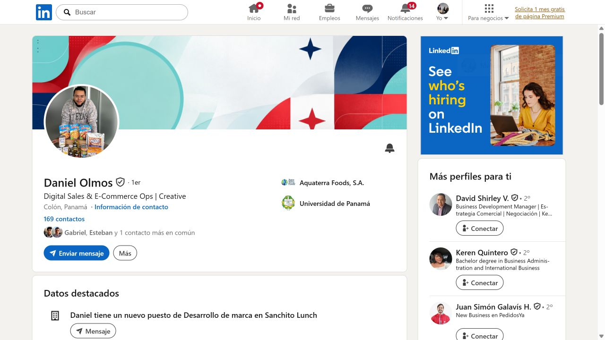

**Senal visible:** Daniel Olmos es contacto en común

**Por que encaja con Gabriel:** Tiene senales visibles relacionadas con datos, sistemas, automatizacion o tecnologia, utiles para ampliar una red profesional cercana al trabajo de Gabriel.

**Valor potencial para networking/B2B:** puede servir como contacto para conversaciones sobre dashboards, automatizacion de procesos, analitica aplicada, implementaciones internas de IA o posibles referidos hacia empresas que necesitan ordenar datos y sistemas.

**Mensaje sugerido manual:**

> Hola Daniel, vi que trabajas/estudias temas cercanos a datos, sistemas e IA. Estoy conectando con personas de la region que estan construyendo en analitica, automatizacion y herramientas empresariales. Me gustaria conectar y seguir aprendiendo de lo que compartes.

<strong>065. Samuel Santa</strong> - Datos, sistemas e IA

**Link de perfil:** [Abrir perfil de LinkedIn](https://www.linkedin.com/in/devsanta)

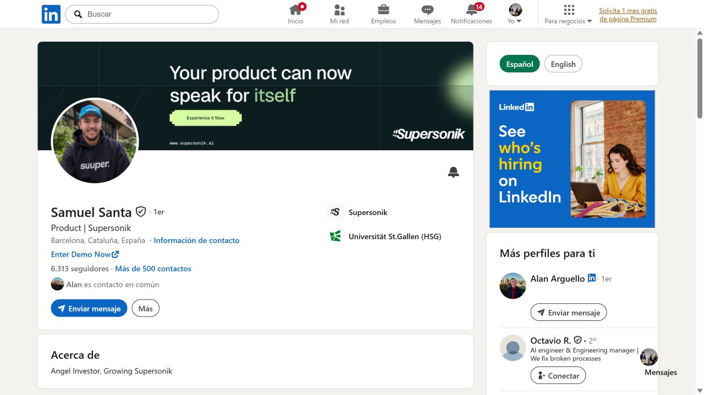

**Senal visible:** Antonio Sánchez De Boeck y Samuel Santa son contactos en común

**Por que encaja con Gabriel:** Tiene senales visibles relacionadas con datos, sistemas, automatizacion o tecnologia, utiles para ampliar una red profesional cercana al trabajo de Gabriel.

**Valor potencial para networking/B2B:** puede servir como contacto para conversaciones sobre dashboards, automatizacion de procesos, analitica aplicada, implementaciones internas de IA o posibles referidos hacia empresas que necesitan ordenar datos y sistemas.

**Mensaje sugerido manual:**

> Hola Samuel, vi que trabajas/estudias temas cercanos a datos, sistemas e IA. Estoy conectando con personas de la region que estan construyendo en analitica, automatizacion y herramientas empresariales. Me gustaria conectar y seguir aprendiendo de lo que compartes.

<strong>066. Sonia Arelis Santos •</strong> - Datos, SQL y analitica

**Link de perfil:** [Abrir perfil de LinkedIn](https://www.linkedin.com/in/sonia-arelis-santos-56818532a)

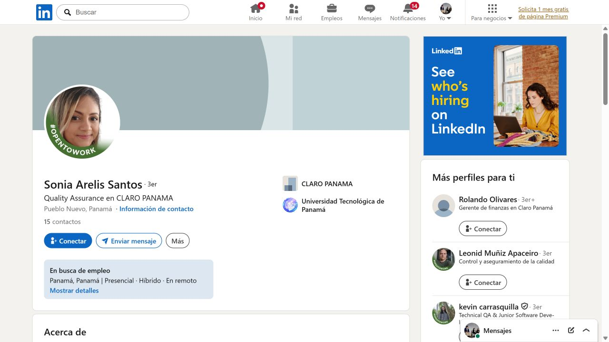

**Senal visible:** Sonia Arelis Santos • 3er+ Quality Assurance en CLARO PANAMA Pueblo Nuevo, Panamá, Panamá Conectar Actual: Data Analyst en CLARO PANAMA

**Por que encaja con Gabriel:** Tiene senales visibles de IA/agentes, Panama, alineadas con el posicionamiento de Gabriel en datos, sistemas e IA.

**Valor potencial para networking/B2B:** puede servir como contacto para conversaciones sobre dashboards, automatizacion de procesos, analitica aplicada, implementaciones internas de IA o posibles referidos hacia empresas que necesitan ordenar datos y sistemas.

**Mensaje sugerido manual:**

> Hola Sonia, vi que trabajas/estudias temas cercanos a datos, sistemas e IA. Estoy conectando con personas de la region que estan construyendo en analitica, automatizacion y herramientas empresariales. Me gustaria conectar y seguir aprendiendo de lo que compartes.

<strong>067. Alexander Eduardo Rojas Garay</strong> - Datos, sistemas e IA

**Link de perfil:** [Abrir perfil de LinkedIn](https://www.linkedin.com/in/alexander-eduardo-rojas-garay-b17471235)

**Senal visible:** Alexander Eduardo Rojas Garay es contacto en común

**Por que encaja con Gabriel:** Tiene senales visibles relacionadas con datos, sistemas, automatizacion o tecnologia, utiles para ampliar una red profesional cercana al trabajo de Gabriel.

**Valor potencial para networking/B2B:** puede servir como contacto para conversaciones sobre dashboards, automatizacion de procesos, analitica aplicada, implementaciones internas de IA o posibles referidos hacia empresas que necesitan ordenar datos y sistemas.

**Mensaje sugerido manual:**

> Hola Alexander, vi que trabajas/estudias temas cercanos a datos, sistemas e IA. Estoy conectando con personas de la region que estan construyendo en analitica, automatizacion y herramientas empresariales. Me gustaria conectar y seguir aprendiendo de lo que compartes.

<strong>068. Huber Leonardo Aybar Santos</strong> - Datos, sistemas e IA

**Link de perfil:** [Abrir perfil de LinkedIn](https://www.linkedin.com/in/huber-leonardo-aybar-santos)

**Senal visible:** Huber Leonardo Aybar Santos • 2º

**Por que encaja con Gabriel:** Tiene senales visibles relacionadas con datos, sistemas, automatizacion o tecnologia, utiles para ampliar una red profesional cercana al trabajo de Gabriel.

**Valor potencial para networking/B2B:** puede servir como contacto para conversaciones sobre dashboards, automatizacion de procesos, analitica aplicada, implementaciones internas de IA o posibles referidos hacia empresas que necesitan ordenar datos y sistemas.

**Mensaje sugerido manual:**

> Hola Huber, vi que trabajas/estudias temas cercanos a datos, sistemas e IA. Estoy conectando con personas de la region que estan construyendo en analitica, automatizacion y herramientas empresariales. Me gustaria conectar y seguir aprendiendo de lo que compartes.

<strong>069. Alfredo Delgado Moya</strong> - Datos, sistemas e IA

**Link de perfil:** [Abrir perfil de LinkedIn](https://www.linkedin.com/in/alfredodelgadoo)

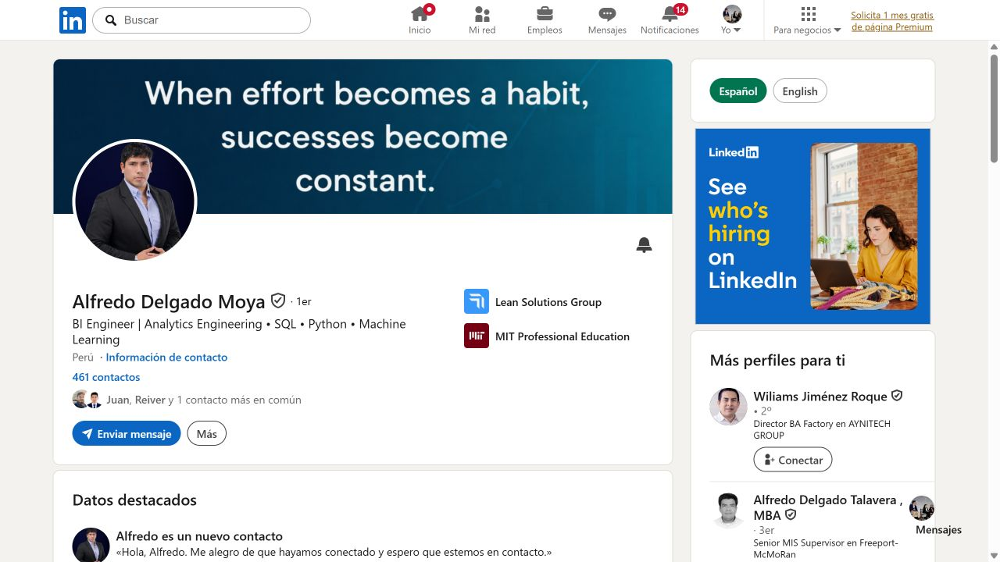

**Senal visible:** Alfredo Delgado Moya, Diego Alonso Velarde Aguero y 2 contactos más en común

**Por que encaja con Gabriel:** Tiene senales visibles relacionadas con datos, sistemas, automatizacion o tecnologia, utiles para ampliar una red profesional cercana al trabajo de Gabriel.

**Valor potencial para networking/B2B:** puede servir como contacto para conversaciones sobre dashboards, automatizacion de procesos, analitica aplicada, implementaciones internas de IA o posibles referidos hacia empresas que necesitan ordenar datos y sistemas.

**Mensaje sugerido manual:**

> Hola Alfredo, vi que trabajas/estudias temas cercanos a datos, sistemas e IA. Estoy conectando con personas de la region que estan construyendo en analitica, automatizacion y herramientas empresariales. Me gustaria conectar y seguir aprendiendo de lo que compartes.

<strong>070. Diego Alonso Velarde Aguero</strong> - Datos, sistemas e IA

**Link de perfil:** [Abrir perfil de LinkedIn](https://www.linkedin.com/in/diegoalonsovela)

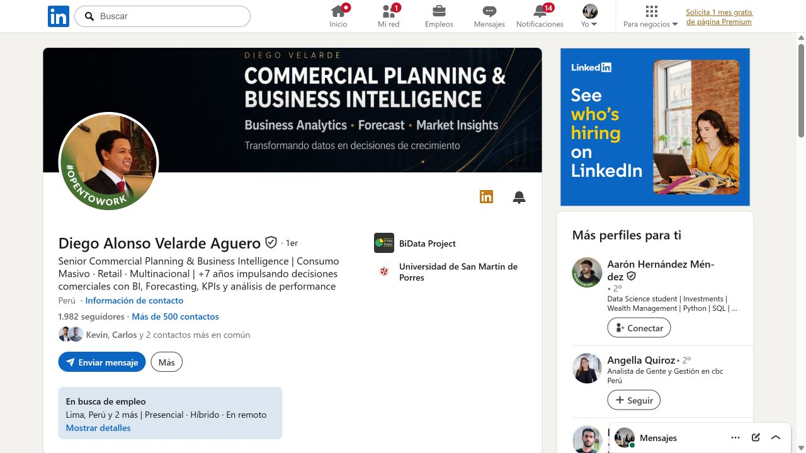

**Senal visible:** Alfredo Delgado Moya, Diego Alonso Velarde Aguero y 2 contactos más en común

**Por que encaja con Gabriel:** Tiene senales visibles relacionadas con datos, sistemas, automatizacion o tecnologia, utiles para ampliar una red profesional cercana al trabajo de Gabriel.

**Valor potencial para networking/B2B:** puede servir como contacto para conversaciones sobre dashboards, automatizacion de procesos, analitica aplicada, implementaciones internas de IA o posibles referidos hacia empresas que necesitan ordenar datos y sistemas.

**Mensaje sugerido manual:**

> Hola Diego, vi que trabajas/estudias temas cercanos a datos, sistemas e IA. Estoy conectando con personas de la region que estan construyendo en analitica, automatizacion y herramientas empresariales. Me gustaria conectar y seguir aprendiendo de lo que compartes.

<strong>071. Alexis Calderon Bardales</strong> - Datos, sistemas e IA

**Link de perfil:** [Abrir perfil de LinkedIn](https://www.linkedin.com/in/alexis-calderon-bardales)

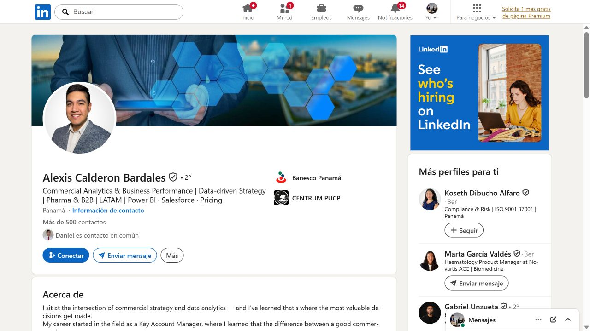

**Senal visible:** Alexis Calderon Bardales • 2º

**Por que encaja con Gabriel:** Tiene senales visibles relacionadas con datos, sistemas, automatizacion o tecnologia, utiles para ampliar una red profesional cercana al trabajo de Gabriel.

**Valor potencial para networking/B2B:** puede servir como contacto para conversaciones sobre dashboards, automatizacion de procesos, analitica aplicada, implementaciones internas de IA o posibles referidos hacia empresas que necesitan ordenar datos y sistemas.

**Mensaje sugerido manual:**

> Hola Alexis, vi que trabajas/estudias temas cercanos a datos, sistemas e IA. Estoy conectando con personas de la region que estan construyendo en analitica, automatizacion y herramientas empresariales. Me gustaria conectar y seguir aprendiendo de lo que compartes.

<strong>072. Iván Kaleb Ramírez Torres</strong> - Datos, sistemas e IA

**Link de perfil:** [Abrir perfil de LinkedIn](https://www.linkedin.com/in/kaleb-torres)

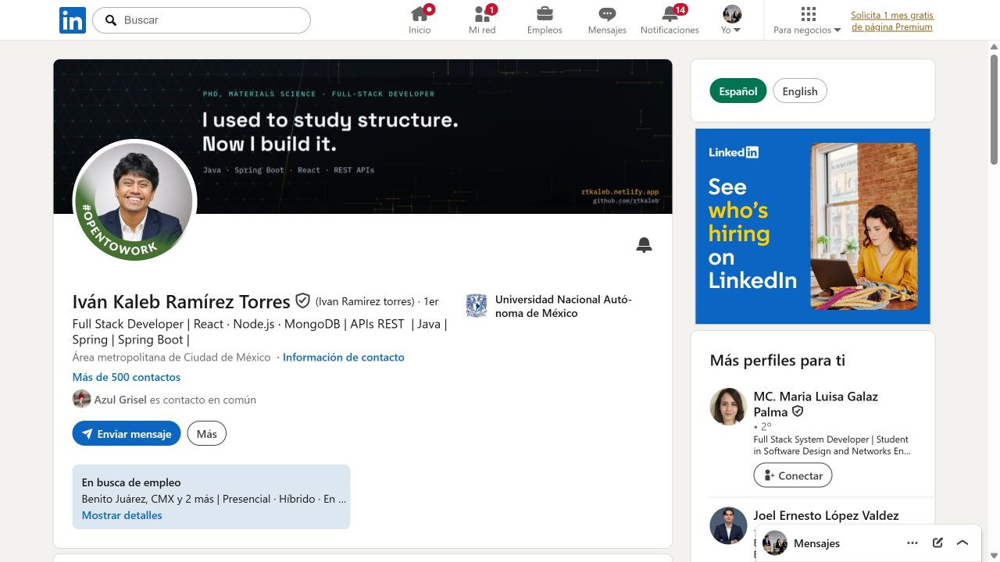

**Senal visible:** Iván Kaleb Ramírez Torres y Alexander Eduardo Rojas Garay son contactos en común

**Por que encaja con Gabriel:** Tiene senales visibles relacionadas con datos, sistemas, automatizacion o tecnologia, utiles para ampliar una red profesional cercana al trabajo de Gabriel.

**Valor potencial para networking/B2B:** puede servir como contacto para conversaciones sobre dashboards, automatizacion de procesos, analitica aplicada, implementaciones internas de IA o posibles referidos hacia empresas que necesitan ordenar datos y sistemas.

**Mensaje sugerido manual:**

> Hola Iván, vi que trabajas/estudias temas cercanos a datos, sistemas e IA. Estoy conectando con personas de la region que estan construyendo en analitica, automatizacion y herramientas empresariales. Me gustaria conectar y seguir aprendiendo de lo que compartes.

<strong>073. Lautaro Leguizamón</strong> - Datos, sistemas e IA

**Link de perfil:** [Abrir perfil de LinkedIn](https://www.linkedin.com/in/lautaleguizamon)

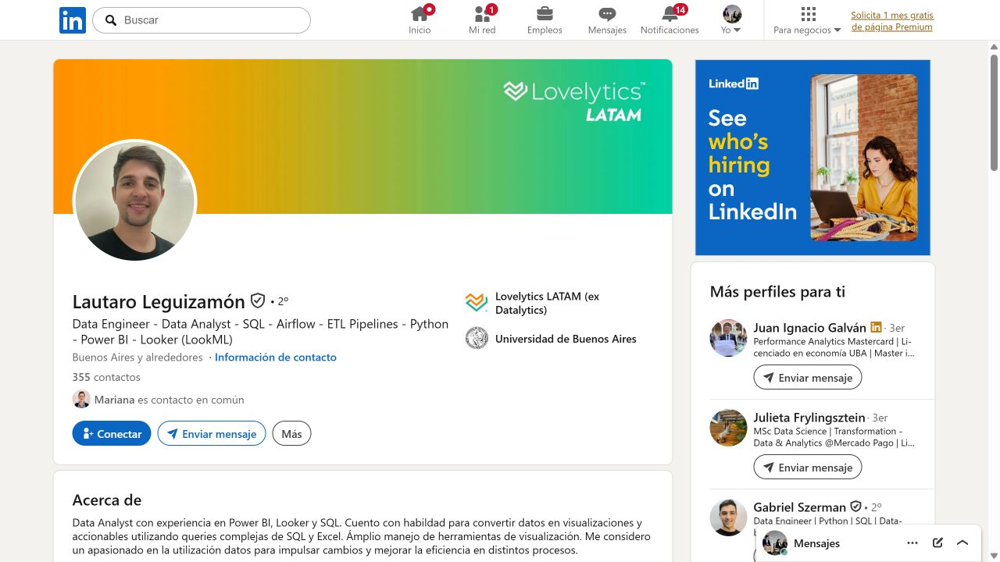

**Senal visible:** Lautaro Leguizamón • 2º

**Por que encaja con Gabriel:** Tiene senales visibles relacionadas con datos, sistemas, automatizacion o tecnologia, utiles para ampliar una red profesional cercana al trabajo de Gabriel.

**Valor potencial para networking/B2B:** puede servir como contacto para conversaciones sobre dashboards, automatizacion de procesos, analitica aplicada, implementaciones internas de IA o posibles referidos hacia empresas que necesitan ordenar datos y sistemas.

**Mensaje sugerido manual:**

> Hola Lautaro, vi que trabajas/estudias temas cercanos a datos, sistemas e IA. Estoy conectando con personas de la region que estan construyendo en analitica, automatizacion y herramientas empresariales. Me gustaria conectar y seguir aprendiendo de lo que compartes.

<strong>074. Francisco González</strong> - Datos, sistemas e IA

**Link de perfil:** [Abrir perfil de LinkedIn](https://www.linkedin.com/in/fgbuitrago)

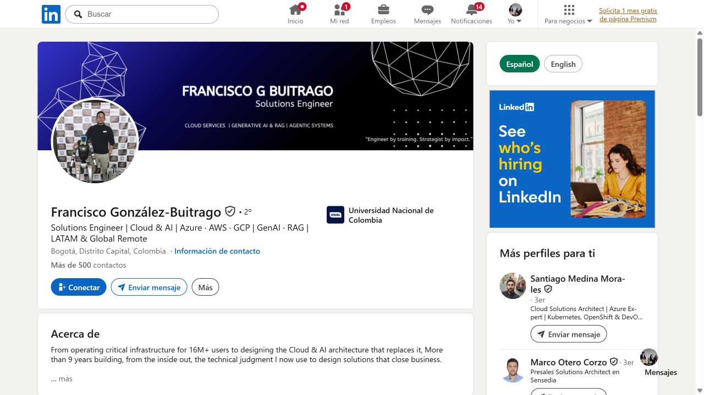

**Senal visible:** Francisco González-Buitrago • 2º

**Por que encaja con Gabriel:** Tiene senales visibles relacionadas con datos, sistemas, automatizacion o tecnologia, utiles para ampliar una red profesional cercana al trabajo de Gabriel.

**Valor potencial para networking/B2B:** puede servir como contacto para conversaciones sobre dashboards, automatizacion de procesos, analitica aplicada, implementaciones internas de IA o posibles referidos hacia empresas que necesitan ordenar datos y sistemas.

**Mensaje sugerido manual:**

> Hola Francisco, vi que trabajas/estudias temas cercanos a datos, sistemas e IA. Estoy conectando con personas de la region que estan construyendo en analitica, automatizacion y herramientas empresariales. Me gustaria conectar y seguir aprendiendo de lo que compartes.

<strong>075. Iván Arturo Galván González •</strong> - Datos, SQL y analitica

**Link de perfil:** [Abrir perfil de LinkedIn](https://www.linkedin.com/in/iv%C3%A1n-arturo-galv%C3%A1n-gonz%C3%A1lez-3b818716a)

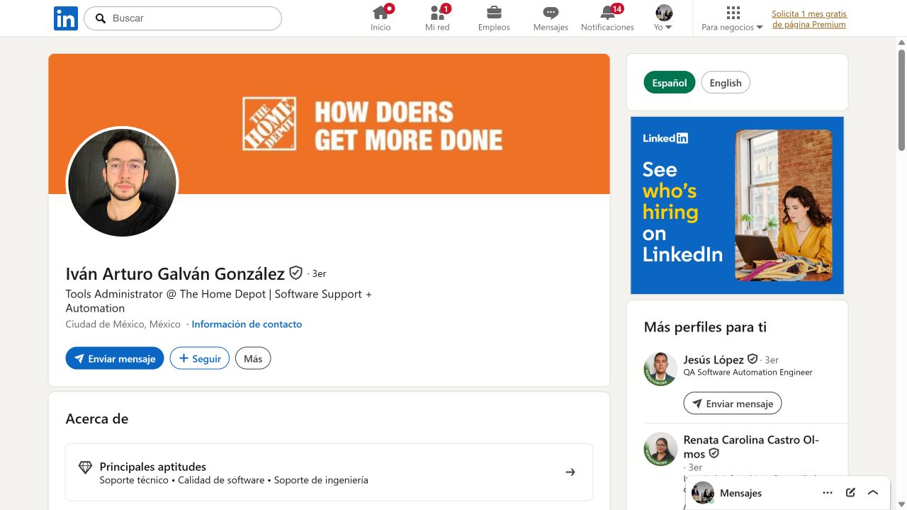

**Senal visible:** Iván Arturo Galván González • 3er+ Tools Administrator @ The Home Depot | Software Support + Automation Ciudad de México, México Enviar mensaje Actual: Tools Administrator en The Home Depot - …across the team. • Tech stack: Python, JavaScript, SQL, Playwright, and scripting integrations…

**Por que encaja con Gabriel:** Tiene senales visibles de SQL, Python, automatizacion, IA/agentes, alineadas con el posicionamiento de Gabriel en datos, sistemas e IA.

**Valor potencial para networking/B2B:** puede servir como contacto para conversaciones sobre dashboards, automatizacion de procesos, analitica aplicada, implementaciones internas de IA o posibles referidos hacia empresas que necesitan ordenar datos y sistemas.

**Mensaje sugerido manual:**

> Hola Iván, vi que trabajas/estudias temas cercanos a datos, sistemas e IA. Estoy conectando con personas de la region que estan construyendo en analitica, automatizacion y herramientas empresariales. Me gustaria conectar y seguir aprendiendo de lo que compartes.

<strong>076. Ricardo Fernández</strong> - Datos, sistemas e IA

**Link de perfil:** [Abrir perfil de LinkedIn](https://www.linkedin.com/in/ricardo-fern%C3%A1ndez00)

**Senal visible:** Ricardo Fernández • 2º

**Por que encaja con Gabriel:** Tiene senales visibles relacionadas con datos, sistemas, automatizacion o tecnologia, utiles para ampliar una red profesional cercana al trabajo de Gabriel.

**Valor potencial para networking/B2B:** puede servir como contacto para conversaciones sobre dashboards, automatizacion de procesos, analitica aplicada, implementaciones internas de IA o posibles referidos hacia empresas que necesitan ordenar datos y sistemas.

**Mensaje sugerido manual:**

> Hola Ricardo, vi que trabajas/estudias temas cercanos a datos, sistemas e IA. Estoy conectando con personas de la region que estan construyendo en analitica, automatizacion y herramientas empresariales. Me gustaria conectar y seguir aprendiendo de lo que compartes.

<strong>077. Alejandro N. Herrera Soria</strong> - Datos, sistemas e IA

**Link de perfil:** [Abrir perfil de LinkedIn](https://www.linkedin.com/in/alejandro-nelson-herrera-soria)

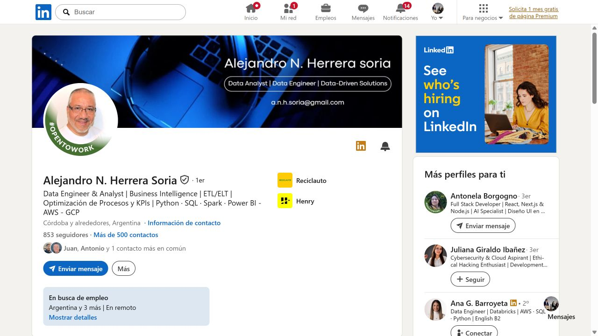

**Senal visible:** Alejandro N. Herrera Soria, Mariana Unía y 14 contactos más en común

**Por que encaja con Gabriel:** Tiene senales visibles de IA/agentes, alineadas con el posicionamiento de Gabriel en datos, sistemas e IA.

**Valor potencial para networking/B2B:** puede servir como contacto para conversaciones sobre dashboards, automatizacion de procesos, analitica aplicada, implementaciones internas de IA o posibles referidos hacia empresas que necesitan ordenar datos y sistemas.

**Mensaje sugerido manual:**

> Hola Alejandro, vi que trabajas/estudias temas cercanos a datos, sistemas e IA. Estoy conectando con personas de la region que estan construyendo en analitica, automatizacion y herramientas empresariales. Me gustaria conectar y seguir aprendiendo de lo que compartes.

<strong>078. Gustavo Alberto Diaz</strong> - Datos, sistemas e IA

**Link de perfil:** [Abrir perfil de LinkedIn](https://www.linkedin.com/in/gustavo-alberto-diaz-46087b70)

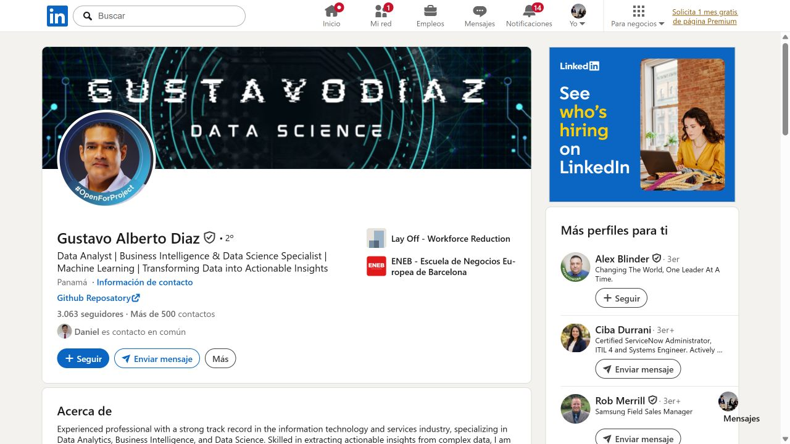

**Senal visible:** Gustavo Alberto Diaz • 2º

**Por que encaja con Gabriel:** Tiene senales visibles de IA/agentes, alineadas con el posicionamiento de Gabriel en datos, sistemas e IA.

**Valor potencial para networking/B2B:** puede servir como contacto para conversaciones sobre dashboards, automatizacion de procesos, analitica aplicada, implementaciones internas de IA o posibles referidos hacia empresas que necesitan ordenar datos y sistemas.

**Mensaje sugerido manual:**

> Hola Gustavo, vi que trabajas/estudias temas cercanos a datos, sistemas e IA. Estoy conectando con personas de la region que estan construyendo en analitica, automatizacion y herramientas empresariales. Me gustaria conectar y seguir aprendiendo de lo que compartes.

<strong>079. Jefferson Angel Areche Rojas</strong> - Datos, sistemas e IA

**Link de perfil:** [Abrir perfil de LinkedIn](https://www.linkedin.com/in/jeffersonangel/es)

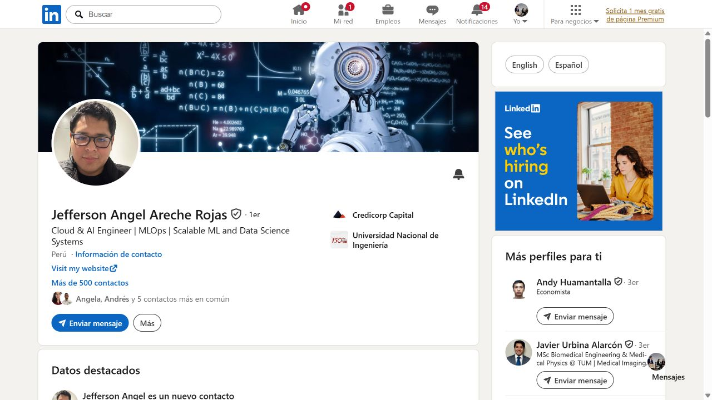

**Senal visible:** Jefferson Angel Areche Rojas, William Rodríguez Grajales y 15 contactos más en común

**Por que encaja con Gabriel:** Tiene senales visibles de IA/agentes, alineadas con el posicionamiento de Gabriel en datos, sistemas e IA.

**Valor potencial para networking/B2B:** puede servir como contacto para conversaciones sobre dashboards, automatizacion de procesos, analitica aplicada, implementaciones internas de IA o posibles referidos hacia empresas que necesitan ordenar datos y sistemas.

**Mensaje sugerido manual:**

> Hola Jefferson, vi que trabajas/estudias temas cercanos a datos, sistemas e IA. Estoy conectando con personas de la region que estan construyendo en analitica, automatizacion y herramientas empresariales. Me gustaria conectar y seguir aprendiendo de lo que compartes.

<strong>080. Benjamín Tala Zacarías •</strong> - Datos, SQL y analitica

**Link de perfil:** [Abrir perfil de LinkedIn](https://www.linkedin.com/in/benjam%C3%ADn-tala-zacar%C3%ADas-53213b25b)

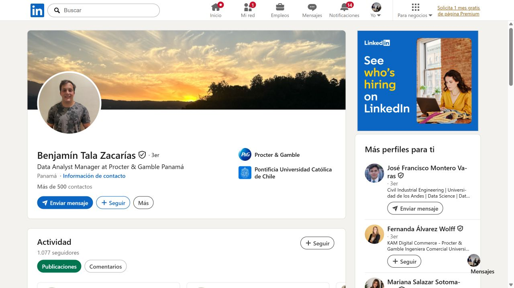

**Senal visible:** Benjamín Tala Zacarías • 3er+ Data Analyst Manager at Procter & Gamble Panamá Panamá, Panamá Enviar mensaje Actual: Data Analyst Manager for Brand Operations Pacifico & Ladmar en Procter & Gamble

**Por que encaja con Gabriel:** Tiene senales visibles de IA/agentes, Panama, alineadas con el posicionamiento de Gabriel en datos, sistemas e IA.

**Valor potencial para networking/B2B:** puede servir como contacto para conversaciones sobre dashboards, automatizacion de procesos, analitica aplicada, implementaciones internas de IA o posibles referidos hacia empresas que necesitan ordenar datos y sistemas.

**Mensaje sugerido manual:**

> Hola Benjamín, vi que trabajas/estudias temas cercanos a datos, sistemas e IA. Estoy conectando con personas de la region que estan construyendo en analitica, automatizacion y herramientas empresariales. Me gustaria conectar y seguir aprendiendo de lo que compartes.

<strong>081. Facundo Adaro •</strong> - Automatizacion e implementacion de IA

**Link de perfil:** [Abrir perfil de LinkedIn](https://www.linkedin.com/in/adarofacundo)

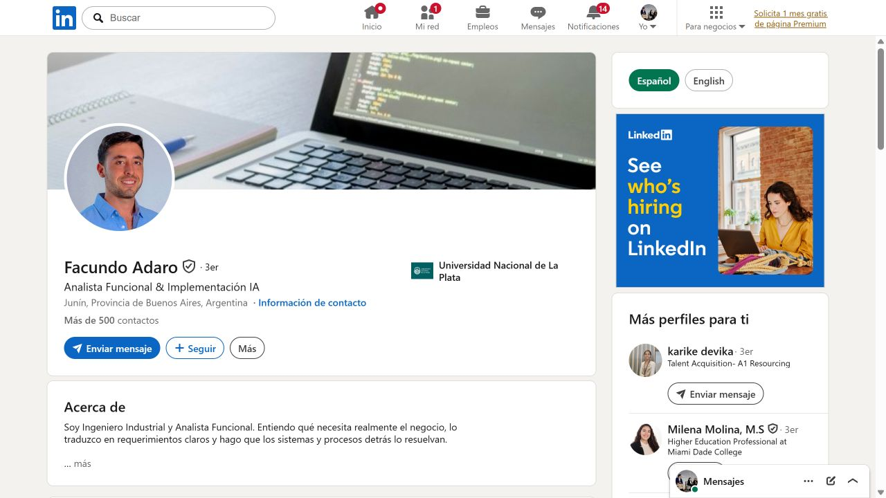

**Senal visible:** Facundo Adaro • 3er+ Analista Funcional & Implementación IA Junín, Provincia de Buenos Aires, Argentina Enviar mensaje Anterior: Ejecutivo de Soporte al Cliente en ZENVIA Latam

**Por que encaja con Gabriel:** Tiene senales visibles de IA/agentes, alineadas con el posicionamiento de Gabriel en datos, sistemas e IA.

**Valor potencial para networking/B2B:** puede servir como contacto para conversaciones sobre dashboards, automatizacion de procesos, analitica aplicada, implementaciones internas de IA o posibles referidos hacia empresas que necesitan ordenar datos y sistemas.

**Mensaje sugerido manual:**

> Hola Facundo, vi que trabajas/estudias temas cercanos a datos, sistemas e IA. Estoy conectando con personas de la region que estan construyendo en analitica, automatizacion y herramientas empresariales. Me gustaria conectar y seguir aprendiendo de lo que compartes.

<strong>082. Tatiana Medalith Paucar De La Cruz</strong> - Datos, sistemas e IA

**Link de perfil:** [Abrir perfil de LinkedIn](https://www.linkedin.com/in/tatiana-paucar-de-la-cruz/es)

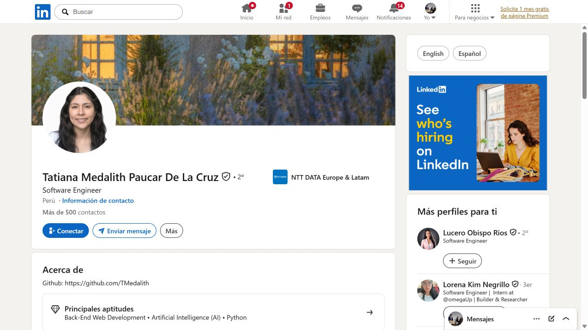

**Senal visible:** Tatiana Medalith Paucar De La Cruz • 2º

**Por que encaja con Gabriel:** Tiene senales visibles de IA/agentes, alineadas con el posicionamiento de Gabriel en datos, sistemas e IA.

**Valor potencial para networking/B2B:** puede servir como contacto para conversaciones sobre dashboards, automatizacion de procesos, analitica aplicada, implementaciones internas de IA o posibles referidos hacia empresas que necesitan ordenar datos y sistemas.

**Mensaje sugerido manual:**

> Hola Tatiana, vi que trabajas/estudias temas cercanos a datos, sistemas e IA. Estoy conectando con personas de la region que estan construyendo en analitica, automatizacion y herramientas empresariales. Me gustaria conectar y seguir aprendiendo de lo que compartes.

<strong>083. Renzo Richle Gianotti</strong> - Datos, sistemas e IA

**Link de perfil:** [Abrir perfil de LinkedIn](https://www.linkedin.com/in/renzorichle23)

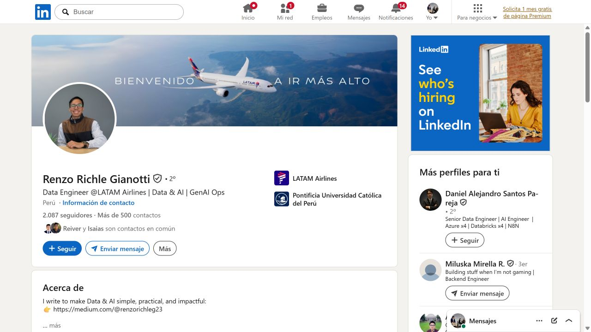

**Senal visible:** Renzo Richle Gianotti • 2º

**Por que encaja con Gabriel:** Tiene senales visibles de IA/agentes, alineadas con el posicionamiento de Gabriel en datos, sistemas e IA.

**Valor potencial para networking/B2B:** puede servir como contacto para conversaciones sobre dashboards, automatizacion de procesos, analitica aplicada, implementaciones internas de IA o posibles referidos hacia empresas que necesitan ordenar datos y sistemas.

**Mensaje sugerido manual:**

> Hola Renzo, vi que trabajas/estudias temas cercanos a datos, sistemas e IA. Estoy conectando con personas de la region que estan construyendo en analitica, automatizacion y herramientas empresariales. Me gustaria conectar y seguir aprendiendo de lo que compartes.

<strong>084. Arnau Urbina Lopez</strong> - Datos, sistemas e IA

**Link de perfil:** [Abrir perfil de LinkedIn](https://www.linkedin.com/in/arnau-urbina-lopez)

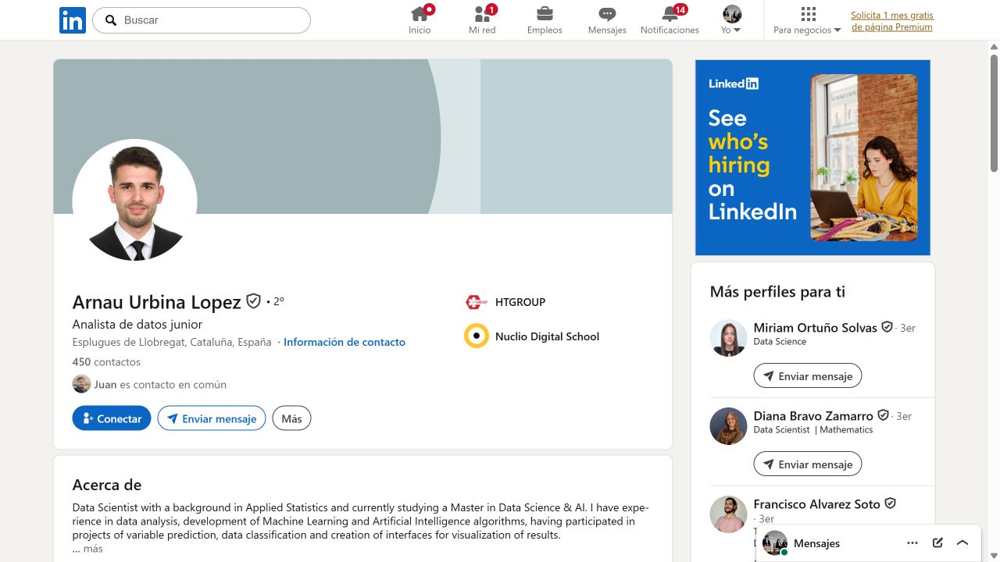

**Senal visible:** Arnau Urbina Lopez • 2º

**Por que encaja con Gabriel:** Tiene senales visibles relacionadas con datos, sistemas, automatizacion o tecnologia, utiles para ampliar una red profesional cercana al trabajo de Gabriel.

**Valor potencial para networking/B2B:** puede servir como contacto para conversaciones sobre dashboards, automatizacion de procesos, analitica aplicada, implementaciones internas de IA o posibles referidos hacia empresas que necesitan ordenar datos y sistemas.

**Mensaje sugerido manual:**

> Hola Arnau, vi que trabajas/estudias temas cercanos a datos, sistemas e IA. Estoy conectando con personas de la region que estan construyendo en analitica, automatizacion y herramientas empresariales. Me gustaria conectar y seguir aprendiendo de lo que compartes.

<strong>085. Paul William Tucker Alpírez</strong> - Datos, sistemas e IA

**Link de perfil:** [Abrir perfil de LinkedIn](https://www.linkedin.com/in/paultucker2001)

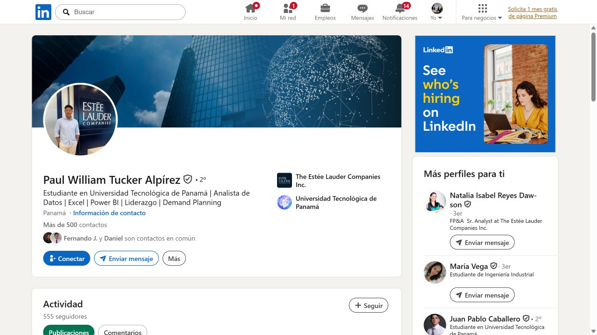

**Senal visible:** Paul William Tucker Alpírez • 2º

**Por que encaja con Gabriel:** Tiene senales visibles de IA/agentes, alineadas con el posicionamiento de Gabriel en datos, sistemas e IA.

**Valor potencial para networking/B2B:** puede servir como contacto para conversaciones sobre dashboards, automatizacion de procesos, analitica aplicada, implementaciones internas de IA o posibles referidos hacia empresas que necesitan ordenar datos y sistemas.

**Mensaje sugerido manual:**

> Hola Paul, vi que trabajas/estudias temas cercanos a datos, sistemas e IA. Estoy conectando con personas de la region que estan construyendo en analitica, automatizacion y herramientas empresariales. Me gustaria conectar y seguir aprendiendo de lo que compartes.

<strong>086. Elisabeth Castro • 2º Data Engineer | Databricks | SQL | Python | Perú</strong> - Datos, SQL y analitica

**Link de perfil:** [Abrir perfil de LinkedIn](https://www.linkedin.com/in/elisabeth-castro-9131a999)

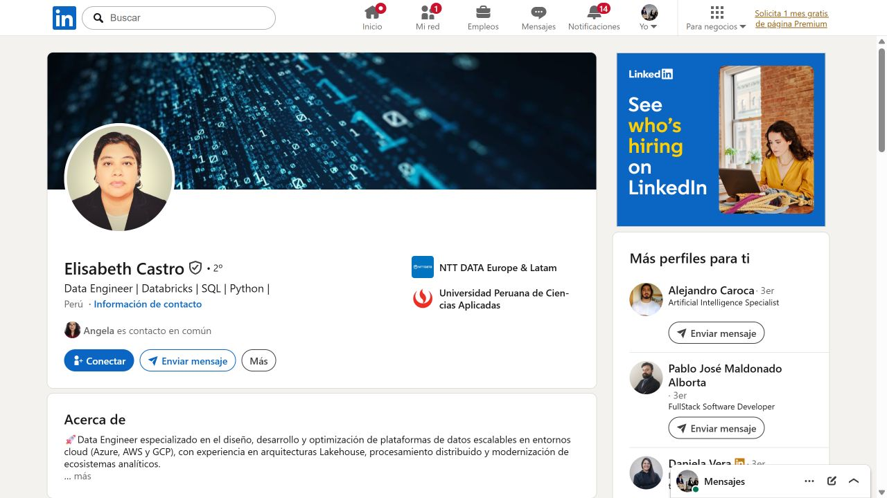

**Senal visible:** Elisabeth Castro • 2º Data Engineer | Databricks | SQL | Python | Perú Conectar Actual: Data Engineer en NTT DATA Europe & Latam Angela Sanchez Cutipa es contacto en común

**Por que encaja con Gabriel:** Tiene senales visibles de SQL, Python, alineadas con el posicionamiento de Gabriel en datos, sistemas e IA.

**Valor potencial para networking/B2B:** puede servir como contacto para conversaciones sobre dashboards, automatizacion de procesos, analitica aplicada, implementaciones internas de IA o posibles referidos hacia empresas que necesitan ordenar datos y sistemas.

**Mensaje sugerido manual:**

> Hola Elisabeth, vi que trabajas/estudias temas cercanos a datos, sistemas e IA. Estoy conectando con personas de la region que estan construyendo en analitica, automatizacion y herramientas empresariales. Me gustaria conectar y seguir aprendiendo de lo que compartes.

<strong>087. Nerea García Barranco • 2º Analista de Datos Zaragoza, Aragón, España</strong> - Datos, SQL y analitica

**Link de perfil:** [Abrir perfil de LinkedIn](https://www.linkedin.com/in/nereagarciabarranco)

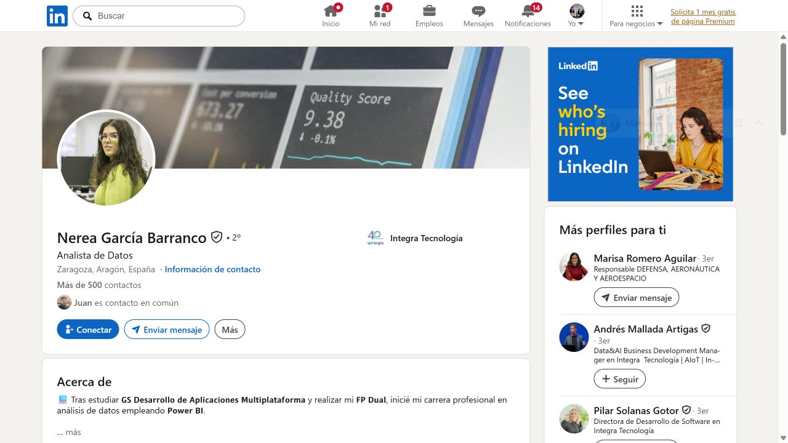

**Senal visible:** Nerea García Barranco • 2º Analista de Datos Zaragoza, Aragón, España Conectar Actual: Analista de datos en Integra Tecnología Juan Pérez es contacto en común

**Por que encaja con Gabriel:** Tiene senales visibles relacionadas con datos, sistemas, automatizacion o tecnologia, utiles para ampliar una red profesional cercana al trabajo de Gabriel.

**Valor potencial para networking/B2B:** puede servir como contacto para conversaciones sobre dashboards, automatizacion de procesos, analitica aplicada, implementaciones internas de IA o posibles referidos hacia empresas que necesitan ordenar datos y sistemas.

**Mensaje sugerido manual:**

> Hola Nerea, vi que trabajas/estudias temas cercanos a datos, sistemas e IA. Estoy conectando con personas de la region que estan construyendo en analitica, automatizacion y herramientas empresariales. Me gustaria conectar y seguir aprendiendo de lo que compartes.

<strong>088. Anel Morales Medina • 2º Product Owner Panamá, Panamá, Panamá</strong> - Automatizacion e implementacion de IA

**Link de perfil:** [Abrir perfil de LinkedIn](https://www.linkedin.com/in/anel-morales-medina)

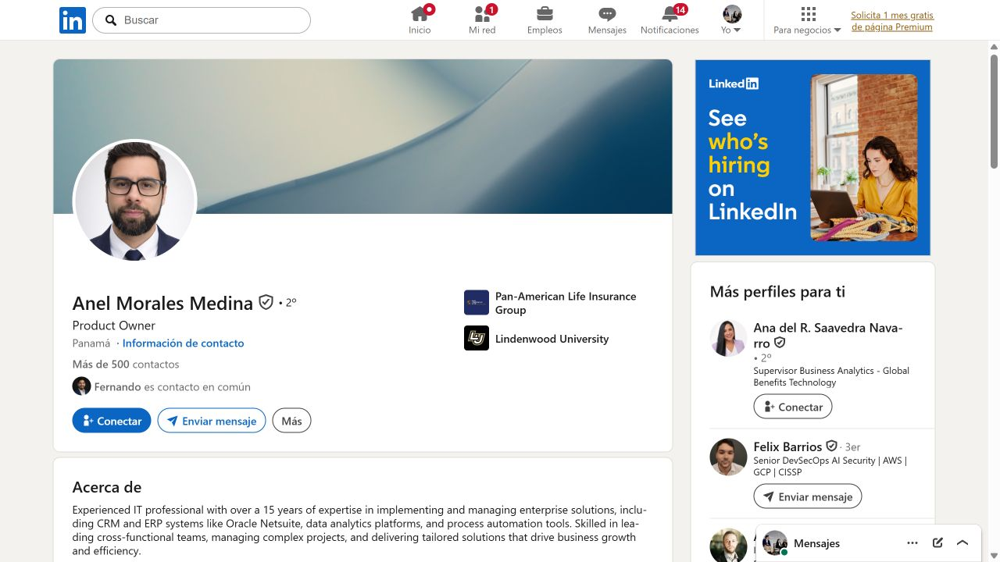

**Senal visible:** Anel Morales Medina • 2º Product Owner Panamá, Panamá, Panamá Conectar Anterior: Information Technology Business Analyst en The Janssen Pharmaceutical Companies of Johnson & Johnson - …analytics, process automation, and business… Fernando Cutire es contacto en común

**Por que encaja con Gabriel:** Tiene senales visibles de automatizacion, Panama, alineadas con el posicionamiento de Gabriel en datos, sistemas e IA.

**Valor potencial para networking/B2B:** puede servir como contacto para conversaciones sobre dashboards, automatizacion de procesos, analitica aplicada, implementaciones internas de IA o posibles referidos hacia empresas que necesitan ordenar datos y sistemas.

**Mensaje sugerido manual:**

> Hola Anel, vi que trabajas/estudias temas cercanos a datos, sistemas e IA. Estoy conectando con personas de la region que estan construyendo en analitica, automatizacion y herramientas empresariales. Me gustaria conectar y seguir aprendiendo de lo que compartes.

<strong>089. Gabriel Gomez • 2º BI Data Analyst Consultant Panamá</strong> - Business intelligence / Power BI

**Link de perfil:** [Abrir perfil de LinkedIn](https://www.linkedin.com/in/gabriel-gomez-547182b7)

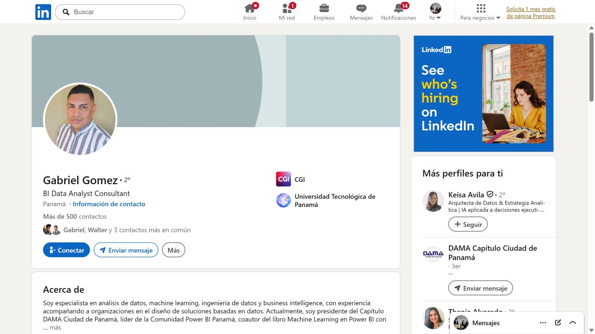

**Senal visible:** Gabriel Gomez • 2º BI Data Analyst Consultant Panamá Conectar Actual: Co-Lead Comunidad Power BI Panamá en Comunidad Power BI Panamá Antonio Sánchez De Boeck, Daniel Wen Lay y 3 contactos más en común

**Por que encaja con Gabriel:** Tiene senales visibles de Power BI, Panama, alineadas con el posicionamiento de Gabriel en datos, sistemas e IA.

**Valor potencial para networking/B2B:** puede servir como contacto para conversaciones sobre dashboards, automatizacion de procesos, analitica aplicada, implementaciones internas de IA o posibles referidos hacia empresas que necesitan ordenar datos y sistemas.

**Mensaje sugerido manual:**

> Hola Gabriel, vi que trabajas/estudias temas cercanos a datos, sistemas e IA. Estoy conectando con personas de la region que estan construyendo en analitica, automatizacion y herramientas empresariales. Me gustaria conectar y seguir aprendiendo de lo que compartes.

<strong>090. Jesus Maradiaga</strong> - Datos, sistemas e IA

**Link de perfil:** [Abrir perfil de LinkedIn](https://www.linkedin.com/in/jesusmaradiaga/es)

**Senal visible:** Jesus Maradiaga y Julio A Monasterio H son contactos en común

**Por que encaja con Gabriel:** Tiene senales visibles de IA/agentes, alineadas con el posicionamiento de Gabriel en datos, sistemas e IA.

**Valor potencial para networking/B2B:** puede servir como contacto para conversaciones sobre dashboards, automatizacion de procesos, analitica aplicada, implementaciones internas de IA o posibles referidos hacia empresas que necesitan ordenar datos y sistemas.

**Mensaje sugerido manual:**

> Hola Jesus, vi que trabajas/estudias temas cercanos a datos, sistemas e IA. Estoy conectando con personas de la region que estan construyendo en analitica, automatizacion y herramientas empresariales. Me gustaria conectar y seguir aprendiendo de lo que compartes.

<strong>091. Jorge Plasencia C.</strong> - Datos, sistemas e IA

**Link de perfil:** [Abrir perfil de LinkedIn](https://www.linkedin.com/in/jplasenciac)

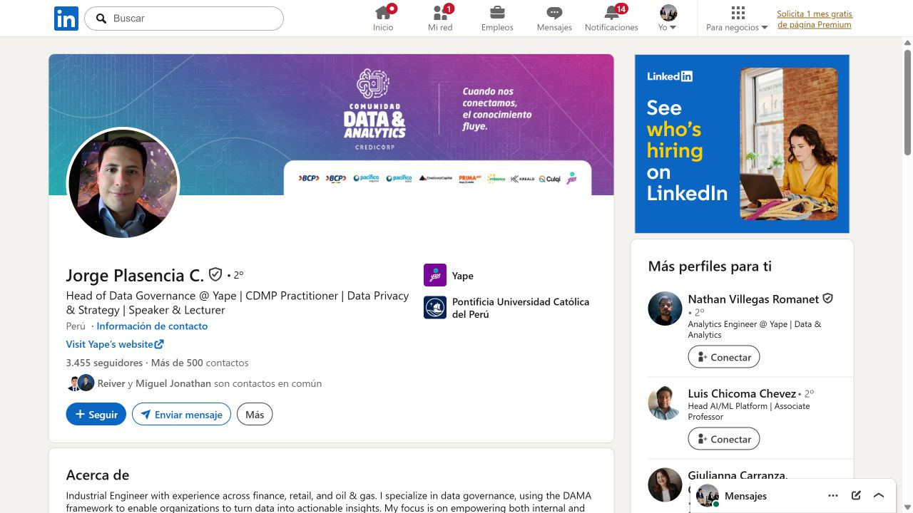

**Senal visible:** Jorge Plasencia C. • 2º

**Por que encaja con Gabriel:** Tiene senales visibles de IA/agentes, alineadas con el posicionamiento de Gabriel en datos, sistemas e IA.

**Valor potencial para networking/B2B:** puede servir como contacto para conversaciones sobre dashboards, automatizacion de procesos, analitica aplicada, implementaciones internas de IA o posibles referidos hacia empresas que necesitan ordenar datos y sistemas.

**Mensaje sugerido manual:**

> Hola Jorge, vi que trabajas/estudias temas cercanos a datos, sistemas e IA. Estoy conectando con personas de la region que estan construyendo en analitica, automatizacion y herramientas empresariales. Me gustaria conectar y seguir aprendiendo de lo que compartes.

<strong>092. Emiliano Ramos, CSCP</strong> - Datos, sistemas e IA

**Link de perfil:** [Abrir perfil de LinkedIn](https://www.linkedin.com/in/ramose)

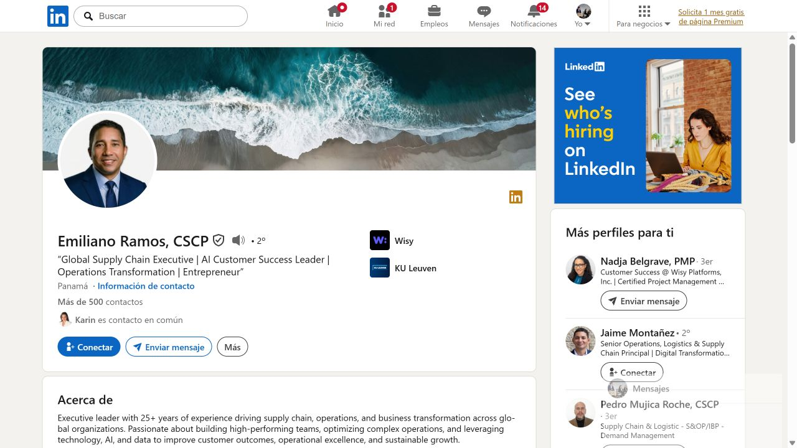

**Senal visible:** Emiliano Ramos, CSCP • 2º

**Por que encaja con Gabriel:** Tiene senales visibles de IA/agentes, alineadas con el posicionamiento de Gabriel en datos, sistemas e IA.

**Valor potencial para networking/B2B:** puede servir como contacto para conversaciones sobre dashboards, automatizacion de procesos, analitica aplicada, implementaciones internas de IA o posibles referidos hacia empresas que necesitan ordenar datos y sistemas.

**Mensaje sugerido manual:**

> Hola Emiliano, vi que trabajas/estudias temas cercanos a datos, sistemas e IA. Estoy conectando con personas de la region que estan construyendo en analitica, automatizacion y herramientas empresariales. Me gustaria conectar y seguir aprendiendo de lo que compartes.

<strong>093. Britney Valoy Becker</strong> - Datos, sistemas e IA

**Link de perfil:** [Abrir perfil de LinkedIn](https://www.linkedin.com/in/britneyintech)

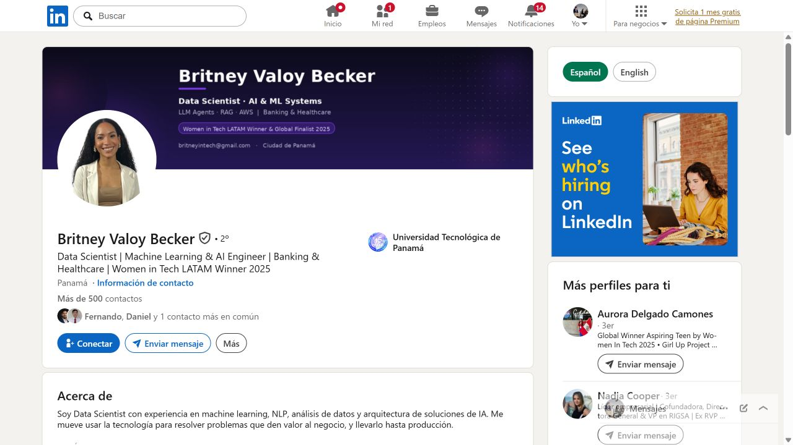

**Senal visible:** Britney Valoy Becker • 2º

**Por que encaja con Gabriel:** Tiene senales visibles relacionadas con datos, sistemas, automatizacion o tecnologia, utiles para ampliar una red profesional cercana al trabajo de Gabriel.

**Valor potencial para networking/B2B:** puede servir como contacto para conversaciones sobre dashboards, automatizacion de procesos, analitica aplicada, implementaciones internas de IA o posibles referidos hacia empresas que necesitan ordenar datos y sistemas.

**Mensaje sugerido manual:**

> Hola Britney, vi que trabajas/estudias temas cercanos a datos, sistemas e IA. Estoy conectando con personas de la region que estan construyendo en analitica, automatizacion y herramientas empresariales. Me gustaria conectar y seguir aprendiendo de lo que compartes.

<strong>094. Camilo Andres Acevedo Gomez</strong> - Datos, sistemas e IA

**Link de perfil:** [Abrir perfil de LinkedIn](https://www.linkedin.com/in/ing-camilo-acevedo)

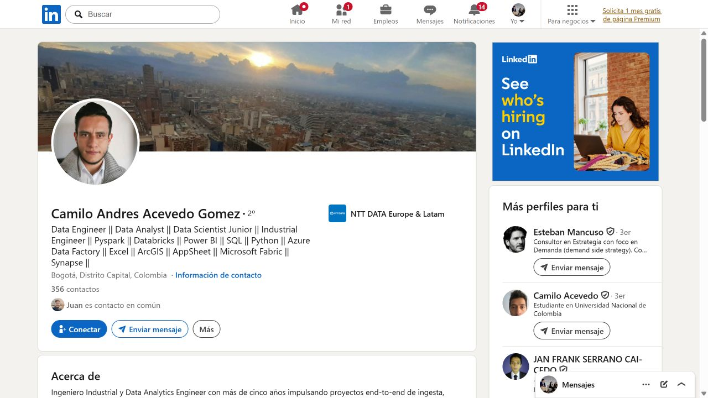

**Senal visible:** Camilo Andres Acevedo Gomez • 2º

**Por que encaja con Gabriel:** Tiene senales visibles relacionadas con datos, sistemas, automatizacion o tecnologia, utiles para ampliar una red profesional cercana al trabajo de Gabriel.

**Valor potencial para networking/B2B:** puede servir como contacto para conversaciones sobre dashboards, automatizacion de procesos, analitica aplicada, implementaciones internas de IA o posibles referidos hacia empresas que necesitan ordenar datos y sistemas.

**Mensaje sugerido manual:**

> Hola Camilo, vi que trabajas/estudias temas cercanos a datos, sistemas e IA. Estoy conectando con personas de la region que estan construyendo en analitica, automatizacion y herramientas empresariales. Me gustaria conectar y seguir aprendiendo de lo que compartes.

<strong>095. Alejandro Soult Toscano</strong> - Datos, sistemas e IA

**Link de perfil:** [Abrir perfil de LinkedIn](https://www.linkedin.com/in/alejandro-soult-toscano)

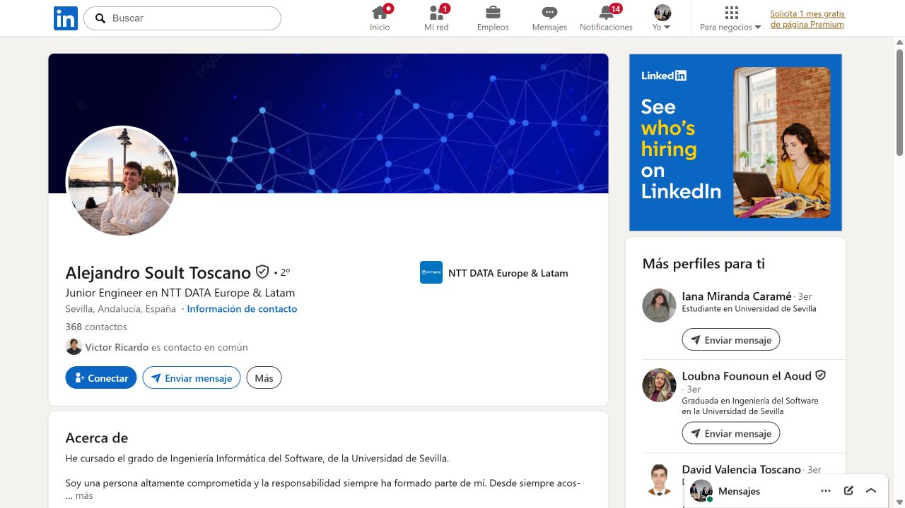

**Senal visible:** Alejandro Soult Toscano • 2º

**Por que encaja con Gabriel:** Tiene senales visibles relacionadas con datos, sistemas, automatizacion o tecnologia, utiles para ampliar una red profesional cercana al trabajo de Gabriel.

**Valor potencial para networking/B2B:** puede servir como contacto para conversaciones sobre dashboards, automatizacion de procesos, analitica aplicada, implementaciones internas de IA o posibles referidos hacia empresas que necesitan ordenar datos y sistemas.

**Mensaje sugerido manual:**

> Hola Alejandro, vi que trabajas/estudias temas cercanos a datos, sistemas e IA. Estoy conectando con personas de la region que estan construyendo en analitica, automatizacion y herramientas empresariales. Me gustaria conectar y seguir aprendiendo de lo que compartes.

<strong>096. Victor Ricardo Huaman Aquino</strong> - Datos, sistemas e IA

**Link de perfil:** [Abrir perfil de LinkedIn](https://www.linkedin.com/in/victor-ricardo-huaman-aquino-b18027244)

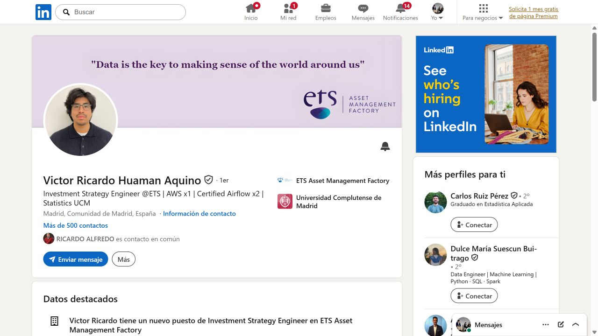

**Senal visible:** Victor Ricardo Huaman Aquino es contacto en común

**Por que encaja con Gabriel:** Tiene senales visibles relacionadas con datos, sistemas, automatizacion o tecnologia, utiles para ampliar una red profesional cercana al trabajo de Gabriel.

**Valor potencial para networking/B2B:** puede servir como contacto para conversaciones sobre dashboards, automatizacion de procesos, analitica aplicada, implementaciones internas de IA o posibles referidos hacia empresas que necesitan ordenar datos y sistemas.

**Mensaje sugerido manual:**

> Hola Victor, vi que trabajas/estudias temas cercanos a datos, sistemas e IA. Estoy conectando con personas de la region que estan construyendo en analitica, automatizacion y herramientas empresariales. Me gustaria conectar y seguir aprendiendo de lo que compartes.

<strong>097. Angela Sanchez Cutipa</strong> - Datos, sistemas e IA

**Link de perfil:** [Abrir perfil de LinkedIn](https://www.linkedin.com/in/angelasz)

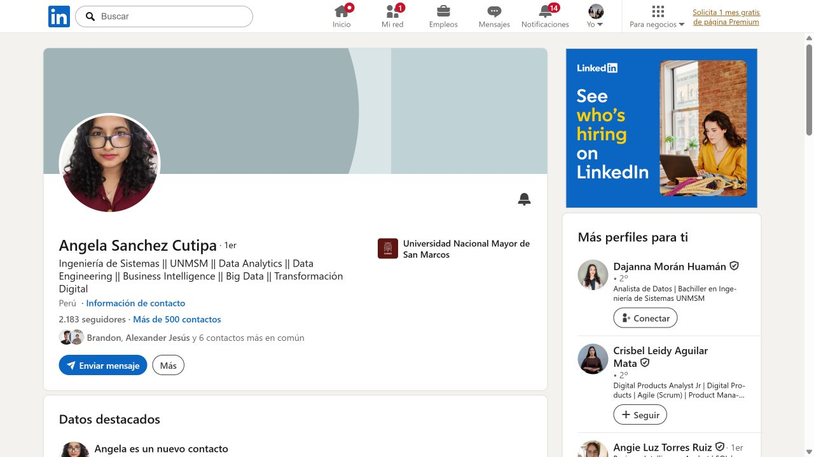

**Senal visible:** Angela Sanchez Cutipa es contacto en común

**Por que encaja con Gabriel:** Tiene senales visibles relacionadas con datos, sistemas, automatizacion o tecnologia, utiles para ampliar una red profesional cercana al trabajo de Gabriel.

**Valor potencial para networking/B2B:** puede servir como contacto para conversaciones sobre dashboards, automatizacion de procesos, analitica aplicada, implementaciones internas de IA o posibles referidos hacia empresas que necesitan ordenar datos y sistemas.

**Mensaje sugerido manual:**

> Hola Angela, vi que trabajas/estudias temas cercanos a datos, sistemas e IA. Estoy conectando con personas de la region que estan construyendo en analitica, automatizacion y herramientas empresariales. Me gustaria conectar y seguir aprendiendo de lo que compartes.

<strong>098. Luis Alejandro Luna Garcia</strong> - Datos, sistemas e IA

**Link de perfil:** [Abrir perfil de LinkedIn](https://www.linkedin.com/in/luisalejandrolunagarcia)

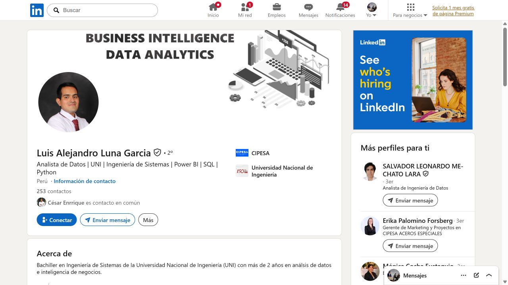

**Senal visible:** Luis Alejandro Luna Garcia • 2º

**Por que encaja con Gabriel:** Tiene senales visibles de IA/agentes, alineadas con el posicionamiento de Gabriel en datos, sistemas e IA.

**Valor potencial para networking/B2B:** puede servir como contacto para conversaciones sobre dashboards, automatizacion de procesos, analitica aplicada, implementaciones internas de IA o posibles referidos hacia empresas que necesitan ordenar datos y sistemas.

**Mensaje sugerido manual:**

> Hola Luis, vi que trabajas/estudias temas cercanos a datos, sistemas e IA. Estoy conectando con personas de la region que estan construyendo en analitica, automatizacion y herramientas empresariales. Me gustaria conectar y seguir aprendiendo de lo que compartes.

<strong>099. César Enrrique Romero Sánchez</strong> - Datos, sistemas e IA

**Link de perfil:** [Abrir perfil de LinkedIn](https://www.linkedin.com/in/cesar-romero-s)

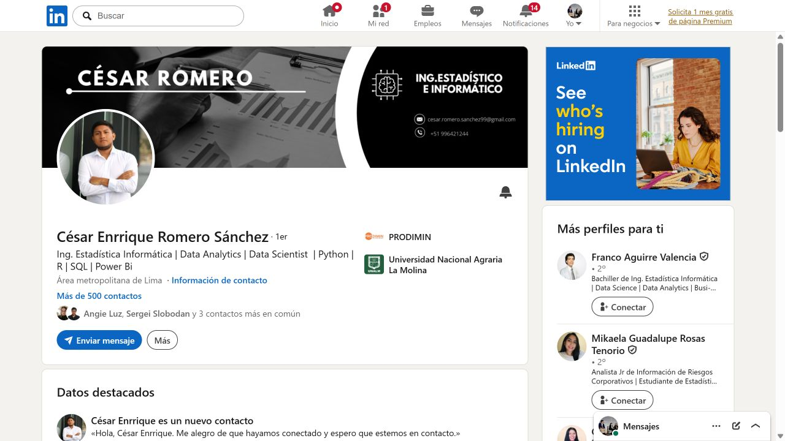

**Senal visible:** César Enrrique Romero Sánchez es contacto en común

**Por que encaja con Gabriel:** Tiene senales visibles relacionadas con datos, sistemas, automatizacion o tecnologia, utiles para ampliar una red profesional cercana al trabajo de Gabriel.

**Valor potencial para networking/B2B:** puede servir como contacto para conversaciones sobre dashboards, automatizacion de procesos, analitica aplicada, implementaciones internas de IA o posibles referidos hacia empresas que necesitan ordenar datos y sistemas.

**Mensaje sugerido manual:**

> Hola César, vi que trabajas/estudias temas cercanos a datos, sistemas e IA. Estoy conectando con personas de la region que estan construyendo en analitica, automatizacion y herramientas empresariales. Me gustaria conectar y seguir aprendiendo de lo que compartes.

<strong>100. José Rodriguez</strong> - Datos, sistemas e IA

**Link de perfil:** [Abrir perfil de LinkedIn](https://www.linkedin.com/in/josegab)

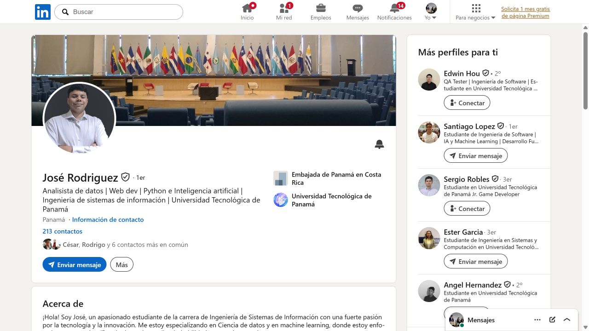

**Senal visible:** Daniel Wen Lay y José Rodriguez son contactos en común

**Por que encaja con Gabriel:** Tiene senales visibles relacionadas con datos, sistemas, automatizacion o tecnologia, utiles para ampliar una red profesional cercana al trabajo de Gabriel.

**Valor potencial para networking/B2B:** puede servir como contacto para conversaciones sobre dashboards, automatizacion de procesos, analitica aplicada, implementaciones internas de IA o posibles referidos hacia empresas que necesitan ordenar datos y sistemas.

**Mensaje sugerido manual:**

> Hola José, vi que trabajas/estudias temas cercanos a datos, sistemas e IA. Estoy conectando con personas de la region que estan construyendo en analitica, automatizacion y herramientas empresariales. Me gustaria conectar y seguir aprendiendo de lo que compartes.

## Evidencia de busqueda

Estas capturas muestran las busquedas usadas para construir la lista. Las capturas individuales de cada perfil estan dentro de cada desplegable.

Busqueda 01

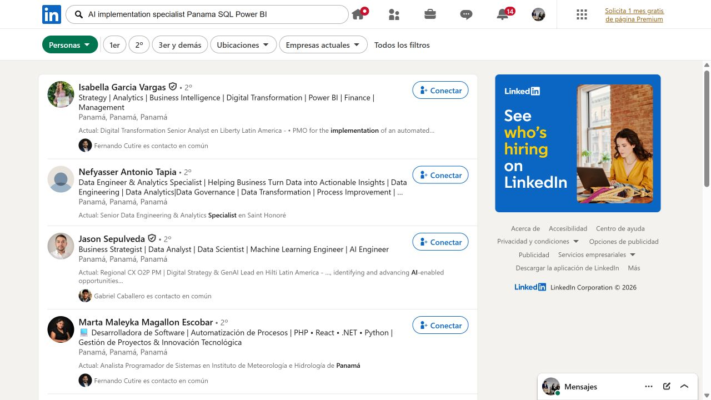

Busqueda 02

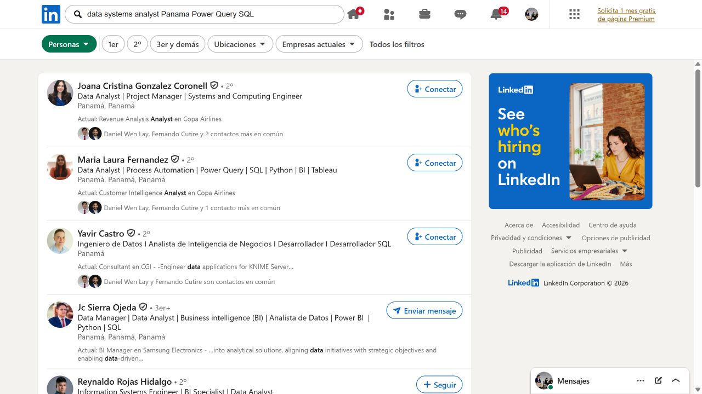

Busqueda 03

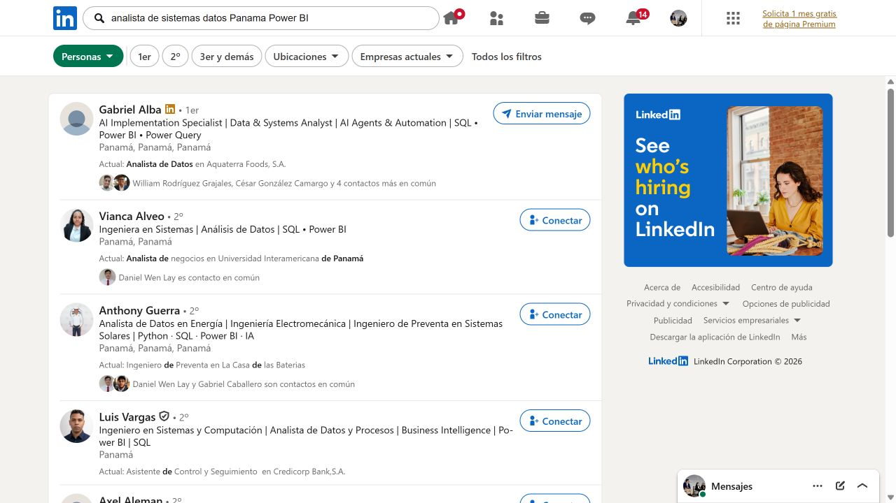

Busqueda 04

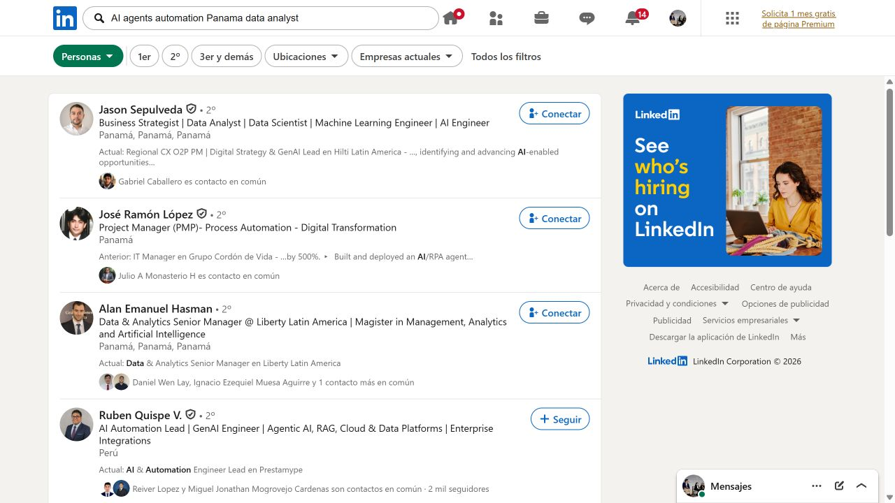

Busqueda 05

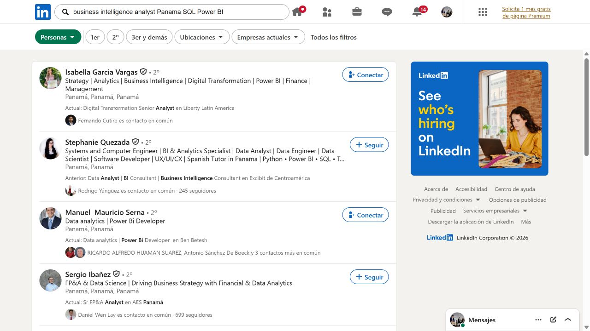

Busqueda 06

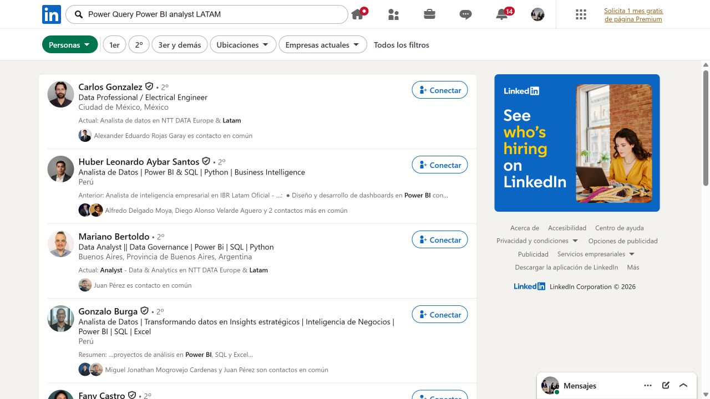

Busqueda 07

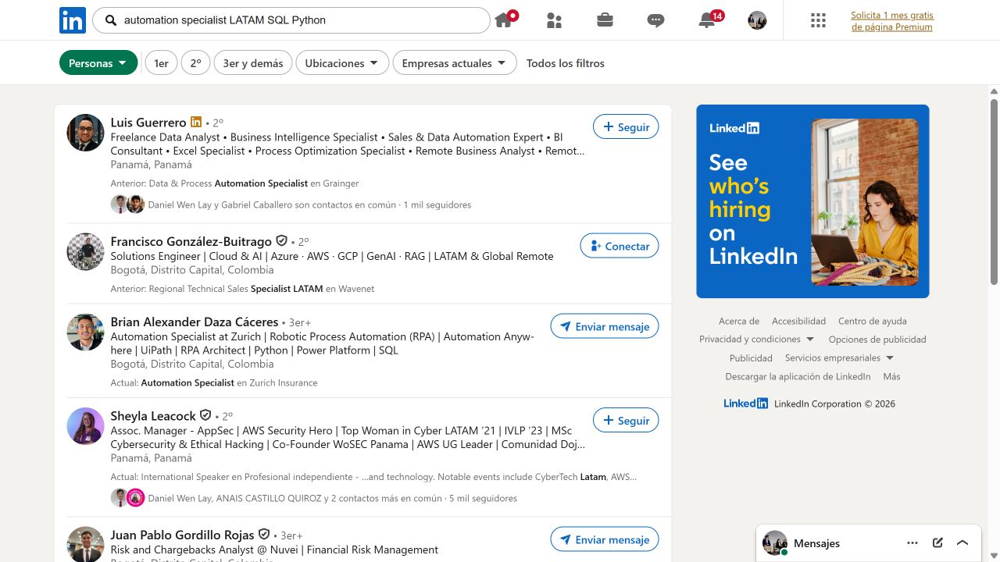

Busqueda 08

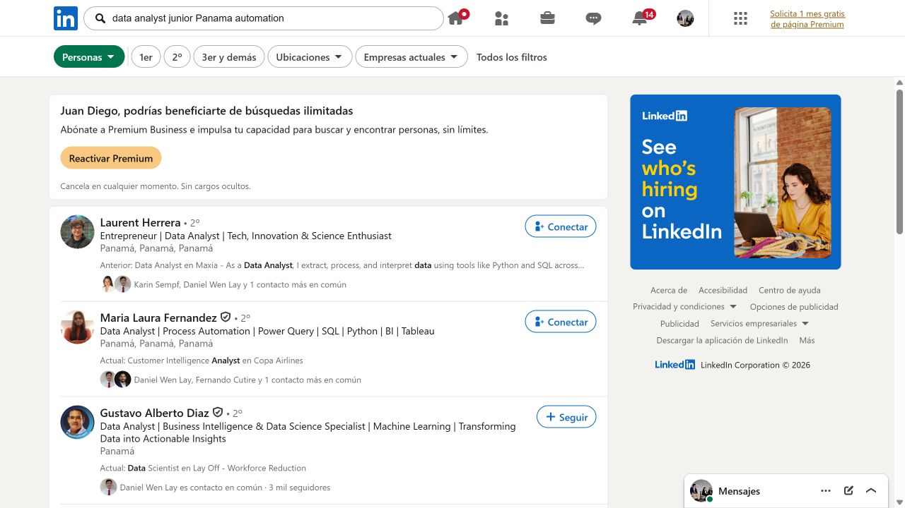

Busqueda 09

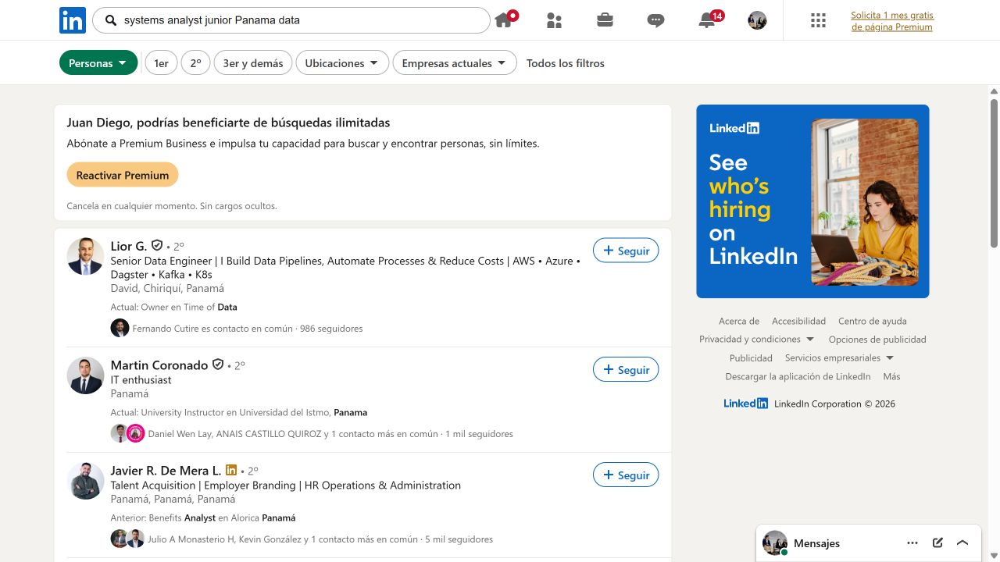

Busqueda 10

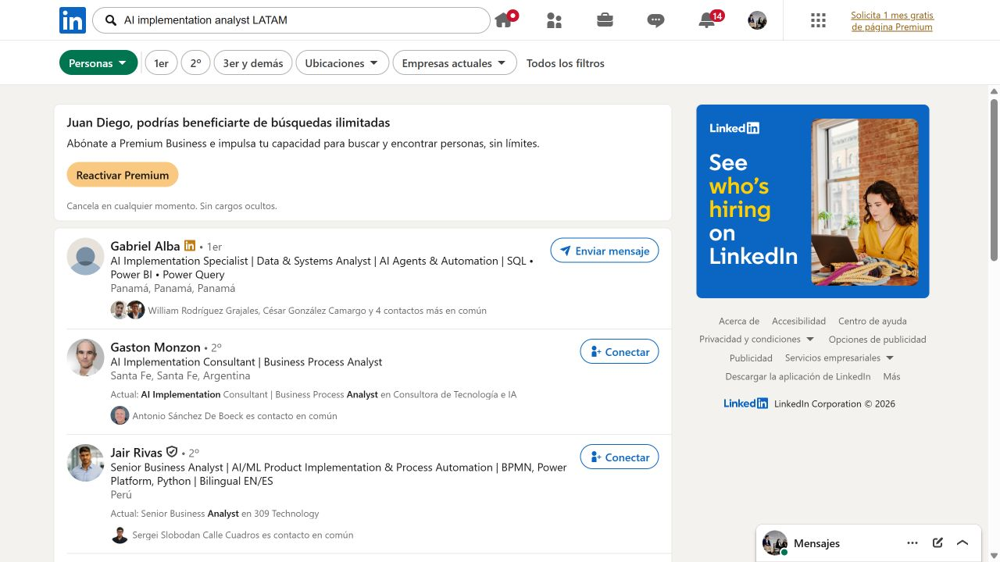

Busqueda 11

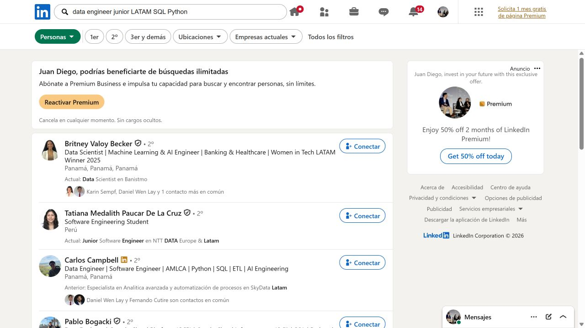

Busqueda 12

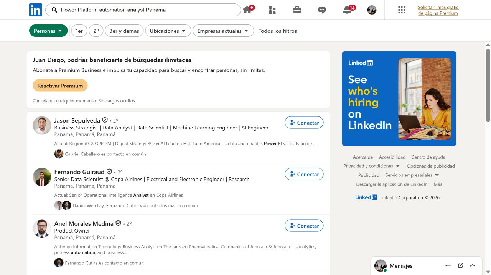

Busqueda 13

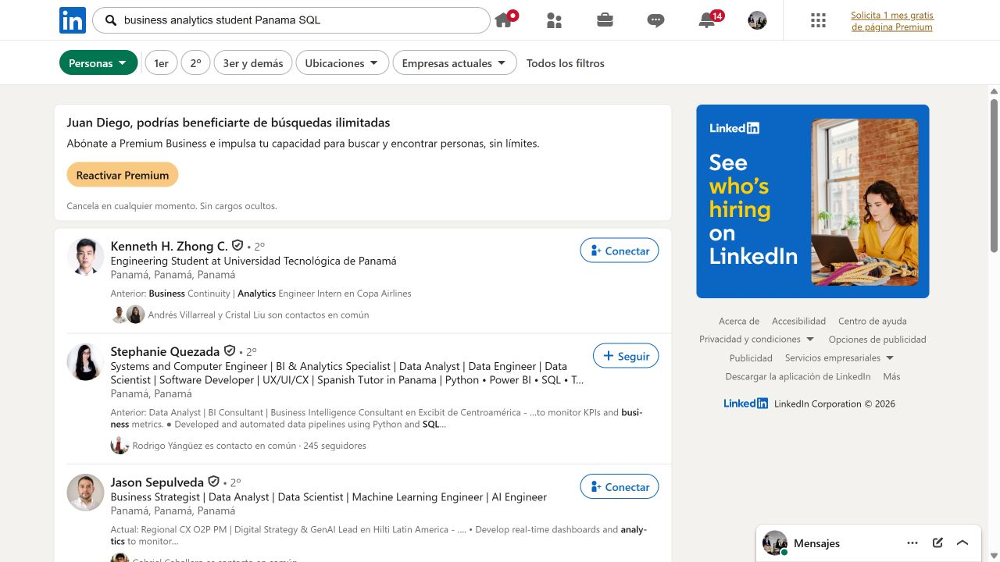

Busqueda 14

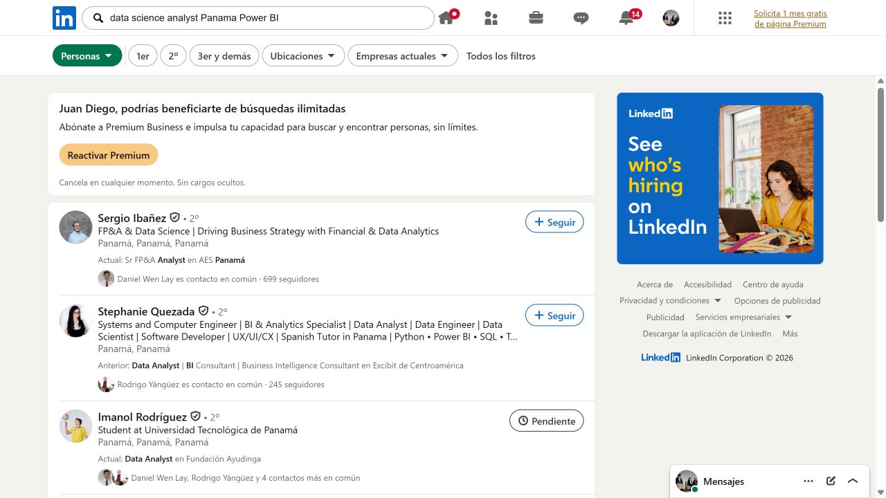

Busqueda 15

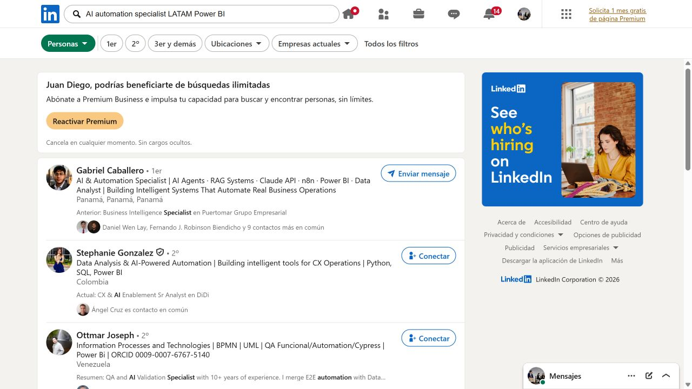

## Nota operativa

Este archivo es una base de investigacion. Antes de enviar cualquier invitacion, conviene abrir cada perfil, confirmar que sigue siendo relevante y ajustar el mensaje a la actividad reciente de la persona.
