# 50 contactos LinkedIn para Juan Diego

Investigacion de perfiles para ampliar la red de Juan Diego Rodriguez Alonso desde LinkedIn. Se revisaron tus conexiones recientes y se busco gente parecida o complementaria en IA, BI, data, automatizacion, marketing analytics, crecimiento y tecnologia en Panama/LATAM.

No se enviaron solicitudes, comentarios ni mensajes. Esto es solo investigacion y preparacion.

## Diagnostico de tus conexiones actuales

Tu red reciente ya muestra un patron bastante bueno para CodeFlow: personas de BI, data analytics, IA generativa, automatizacion, estudiantes/profesionales jovenes y algunos perfiles de estrategia/negocio. Eso indica que LinkedIn te esta acercando a un nicho donde tu posicionamiento tiene sentido: IA aplicada a resultados empresariales, no IA generica.

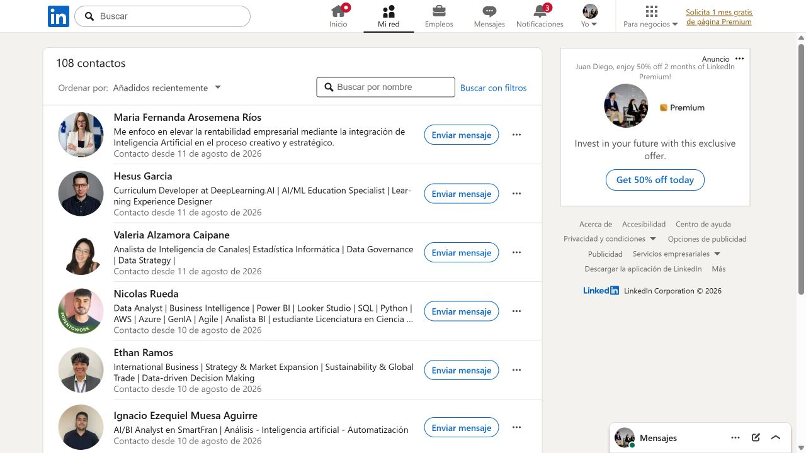

## Tipos de perfiles que conviene seguir buscando

- Data analysts, BI analysts y perfiles Power BI/SQL/Python en LATAM.
- Estudiantes avanzados de ingenieria, ciencia de datos, sistemas o marketing analytics.
- Perfiles de marketing con interes en IA, automatizacion, growth o contenido B2B.
- Founders o consultores pequenos de automatizacion, CRM, ventas y operaciones.
- Personas de Panama o LATAM que ya tengan senales de publicar, comentar o aprender en publico.

## Evidencia de busquedas

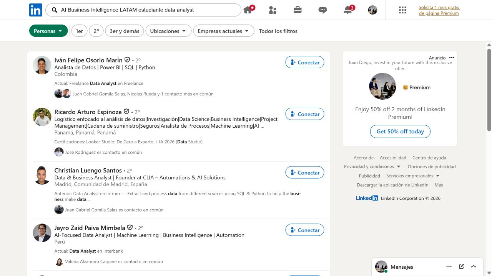

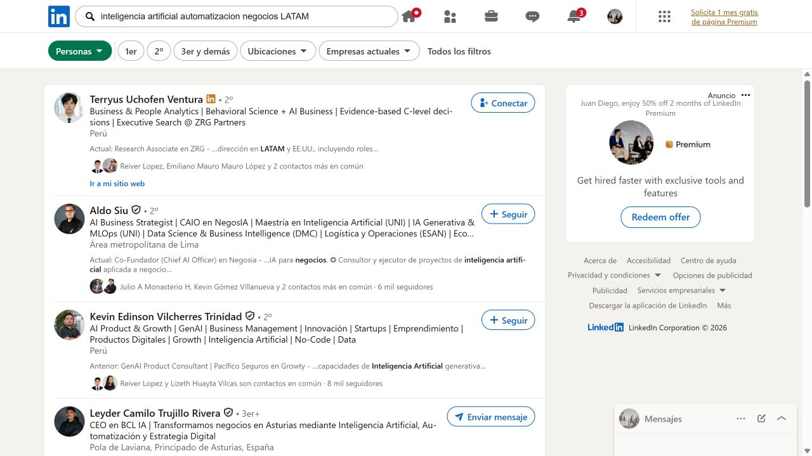

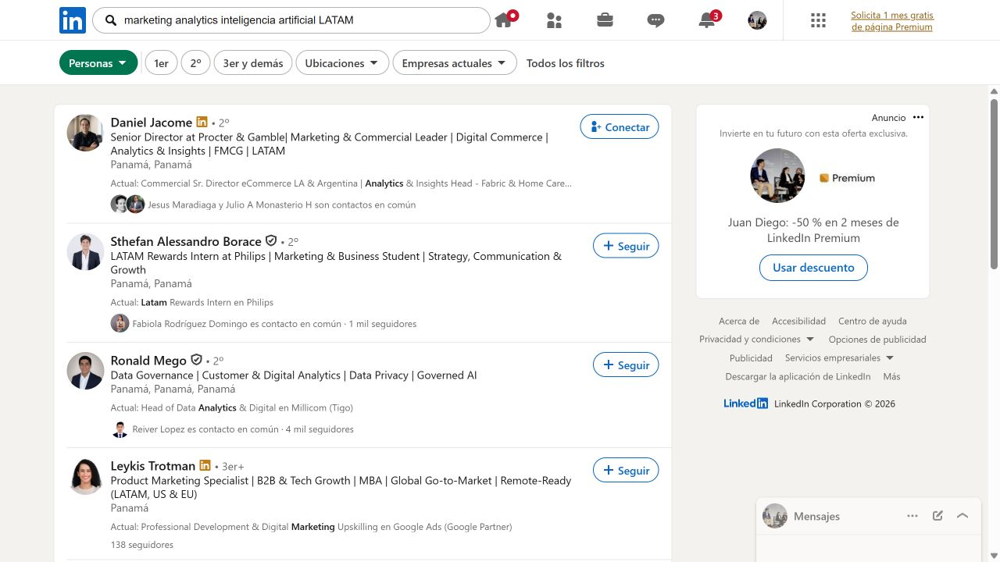

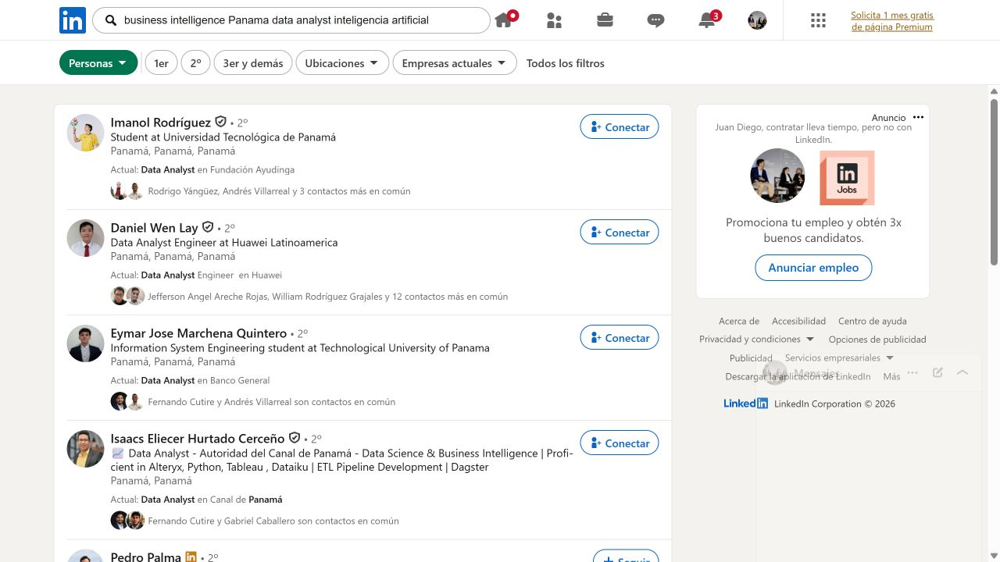

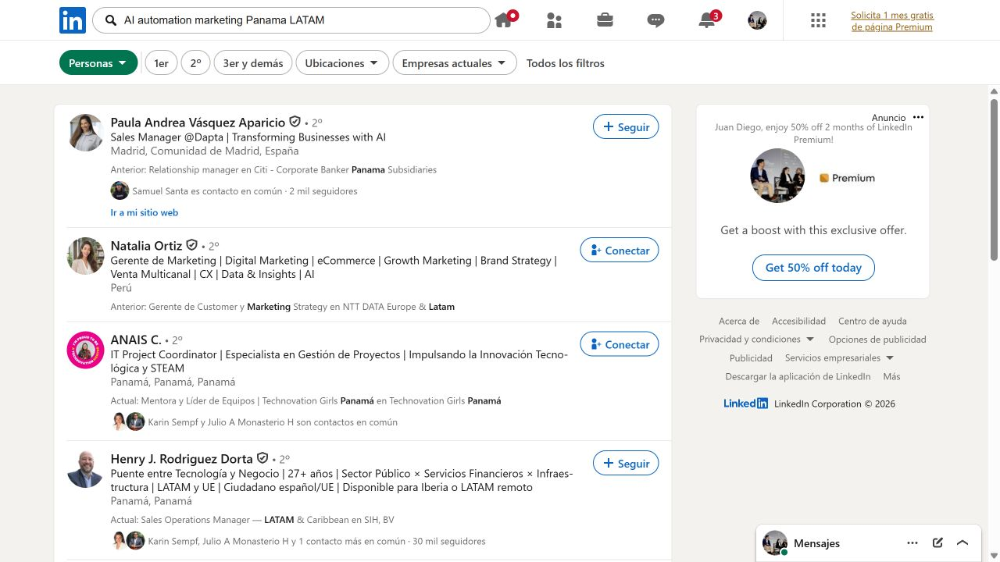

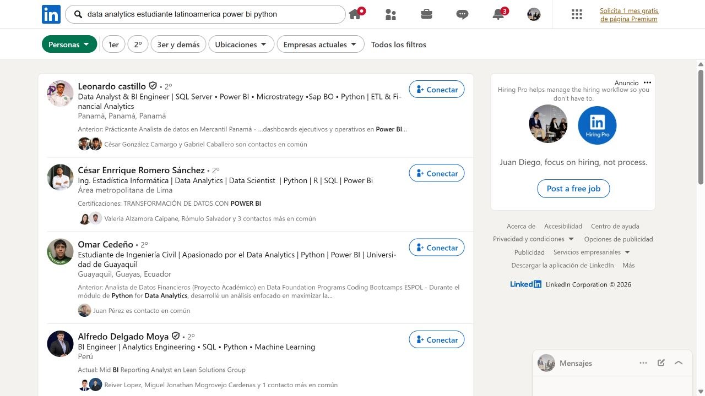

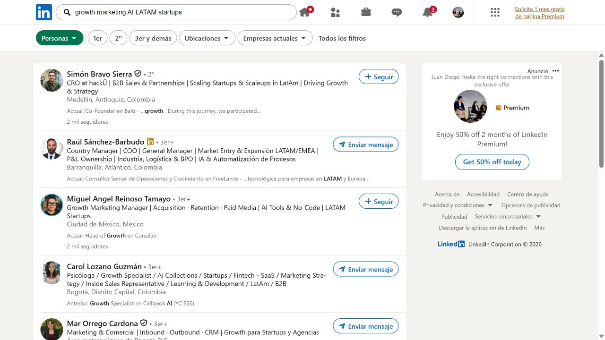

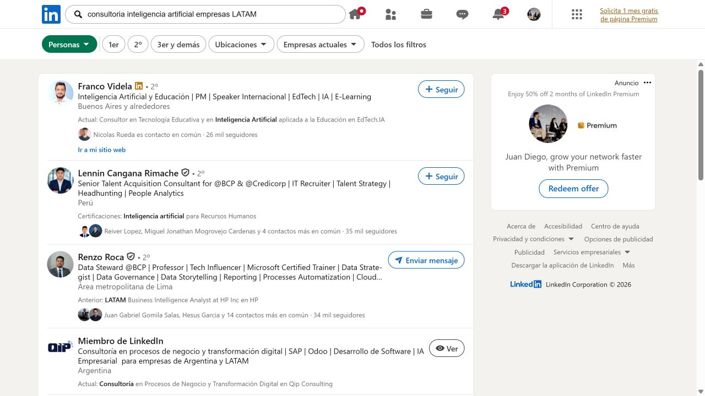

---

## Shortlist de 50 perfiles

<strong>1. Ivan Felipe Osorio Marin</strong>

- Link: [Abrir perfil de LinkedIn](https://www.linkedin.com/in/ivan-osorio-data-scientist/)
- Categoria sugerida: BI, data y analitica
- Prioridad: Media
- Por que puede servir: Encaja con tu angulo fuerte de BI, dashboards, datos, eficiencia y automatizacion empresarial.
- Senal visible: Ivan Felipe Osorio Marin 2 Analista de Datos | Power BI | SQL | Python Colombia Conectar Actual: Freelance Data Analyst en Freelance Juan Gabriel Gomila Salas, Nicolas Rueda y 1 contacto mas en comun

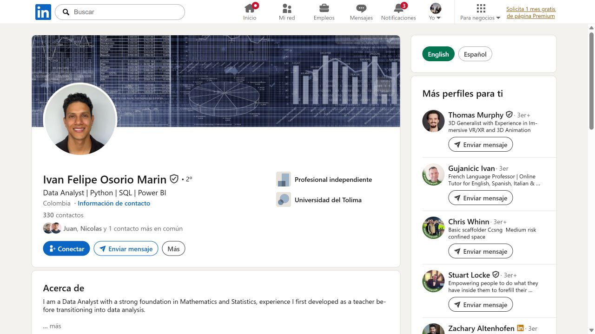

<strong>2. Juan Gabriel Gomila Salas</strong>

- Link: [Abrir perfil de LinkedIn](https://www.linkedin.com/in/juan-gabriel-gomila-salas/)
- Categoria sugerida: Negocio, estrategia o tecnologia
- Prioridad: Media
- Por que puede servir: Puede aportar perspectiva de negocio, estrategia o tecnologia para ampliar tu red fuera del circulo puramente tecnico.
- Senal visible: Juan Gabriel Gomila Salas

<strong>3. Nicolas Rueda</strong>

- Link: [Abrir perfil de LinkedIn](https://www.linkedin.com/in/nicolas-rueda-/)
- Categoria sugerida: Negocio, estrategia o tecnologia
- Prioridad: Media
- Por que puede servir: Puede aportar perspectiva de negocio, estrategia o tecnologia para ampliar tu red fuera del circulo puramente tecnico.
- Senal visible: Nicolas Rueda

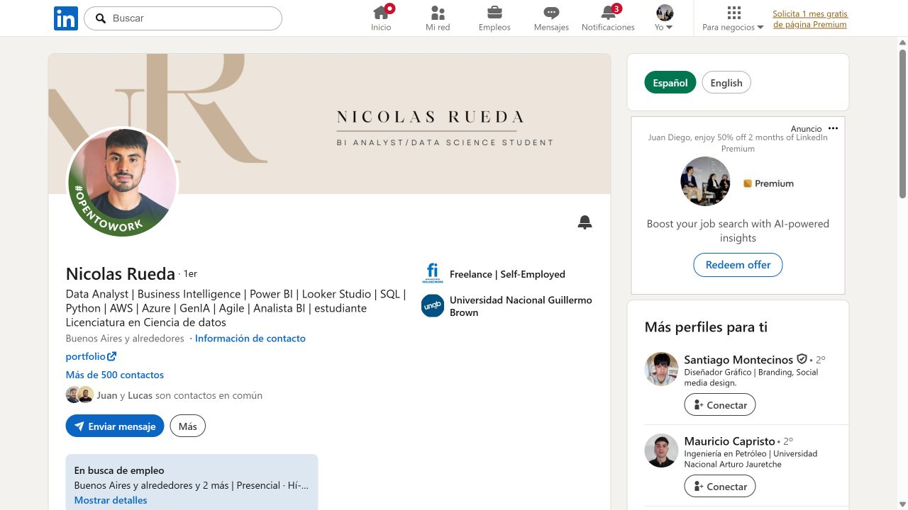

<strong>4. Ricardo Arturo Espinoza</strong>

- Link: [Abrir perfil de LinkedIn](https://www.linkedin.com/in/ricardoaespinozac/)
- Categoria sugerida: BI, data y analitica
- Prioridad: Alta
- Por que puede servir: Encaja con tu angulo fuerte de BI, dashboards, datos, eficiencia y automatizacion empresarial.
- Senal visible: Ricardo Arturo Espinoza 2 Logistico enfocado al analisis de datos|Investigacion|Data Science|Business Intelligence|Project Management|Cadena de suministro|Seguros|Analista de Procesos|Machine Learning|AI Models|Cloud Management Panama, Panama, Panama Conectar Certificaciones: Looker Studio: De Cero a Experto + IA 2026 (Data Studio) Jose Rodriguez es contacto en comun

<strong>5. Jose Rodriguez</strong>

- Link: [Abrir perfil de LinkedIn](https://www.linkedin.com/in/josegab/)
- Categoria sugerida: Negocio, estrategia o tecnologia
- Prioridad: Media
- Por que puede servir: Puede aportar perspectiva de negocio, estrategia o tecnologia para ampliar tu red fuera del circulo puramente tecnico.
- Senal visible: Jose Rodriguez

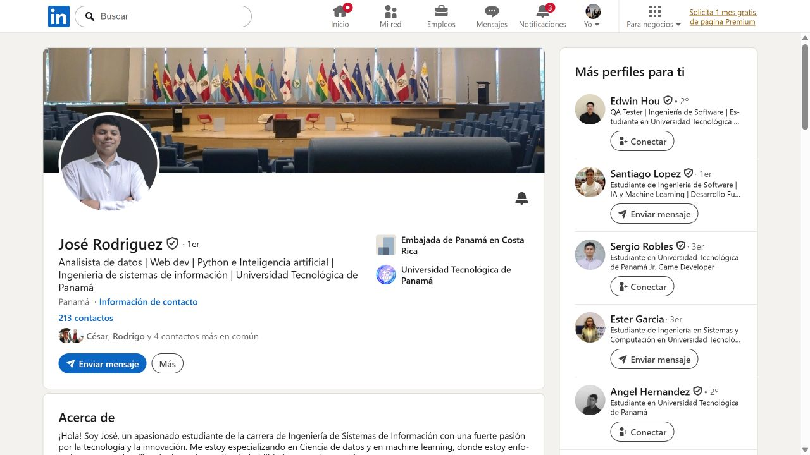

<strong>6. Christian Luengo Santos</strong>

- Link: [Abrir perfil de LinkedIn](https://www.linkedin.com/in/christian-luengo/)
- Categoria sugerida: BI, data y analitica
- Prioridad: Media-alta
- Por que puede servir: Encaja con tu angulo fuerte de BI, dashboards, datos, eficiencia y automatizacion empresarial.
- Senal visible: Christian Luengo Santos 2 Data & Business Analyst | Founder at CLIA Automations & AI Solutions Madrid, Comunidad de Madrid, Espana Conectar Anterior: Data Analyst en Intrum - - Extract and process data from different sources using SQL & Python to help the business make data Juan Gabriel Gomila Salas es contacto en comun

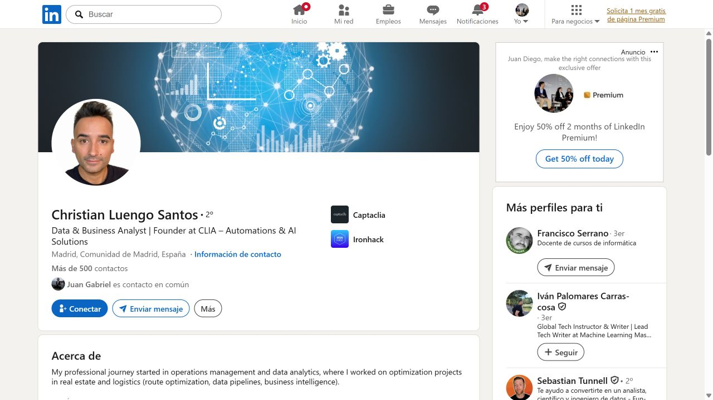

<strong>7. Jayro Zaid Paiva Mimbela</strong>

- Link: [Abrir perfil de LinkedIn](https://www.linkedin.com/in/jpaivamimbela/)
- Categoria sugerida: BI, data y analitica
- Prioridad: Media-alta
- Por que puede servir: Encaja con tu angulo fuerte de BI, dashboards, datos, eficiencia y automatizacion empresarial.
- Senal visible: Jayro Zaid Paiva Mimbela 2 AI-Focused Data Analyst | Machine Learning | Business Intelligence | Automation Peru Conectar Actual: Data Analyst en Interbank Valeria Alzamora Caipane es contacto en comun

<strong>8. Terryus Uchofen Ventura</strong>

- Link: [Abrir perfil de LinkedIn](https://www.linkedin.com/in/terryusuchofen/)
- Categoria sugerida: BI, data y analitica
- Prioridad: Media
- Por que puede servir: Encaja con tu angulo fuerte de BI, dashboards, datos, eficiencia y automatizacion empresarial.
- Senal visible: Terryus Uchofen Ventura 2 Business & People Analytics | Behavioral Science + AI Business | Evidence-based C-level decisions | Executive Search @ ZRG Partners Peru Conectar Actual: Research Associate en ZRG - direccion en LATAM y EE.UU., incluyendo roles Reiver Lopez, Emiliano Mauro Mauro Lopez y 2 contactos mas en comun Ir a mi sitio web

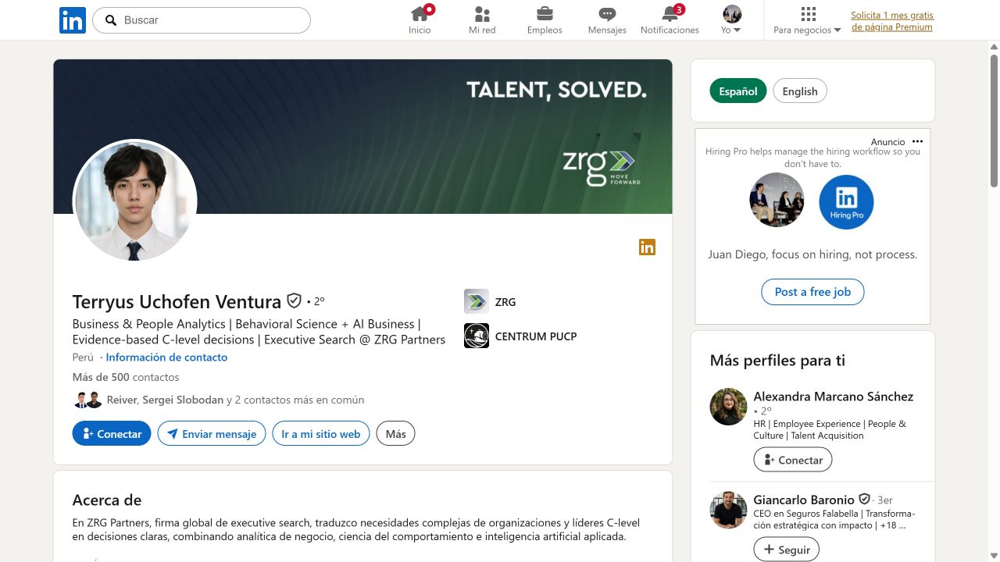

<strong>9. Reiver Lopez</strong>

- Link: [Abrir perfil de LinkedIn](https://www.linkedin.com/in/reiverlopez/)
- Categoria sugerida: Negocio, estrategia o tecnologia
- Prioridad: Media
- Por que puede servir: Puede aportar perspectiva de negocio, estrategia o tecnologia para ampliar tu red fuera del circulo puramente tecnico.
- Senal visible: Reiver Lopez

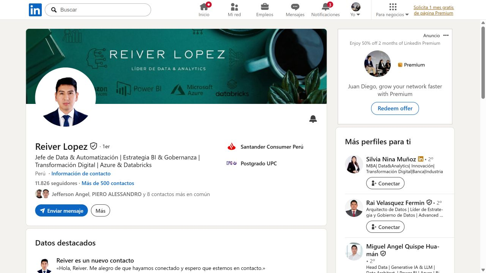

<strong>10. Emiliano Mauro Mauro Lopez</strong>

- Link: [Abrir perfil de LinkedIn](https://www.linkedin.com/in/emiliano-mauro-mauro-l%C3%B3pez-/)
- Categoria sugerida: Negocio, estrategia o tecnologia
- Prioridad: Media
- Por que puede servir: Puede aportar perspectiva de negocio, estrategia o tecnologia para ampliar tu red fuera del circulo puramente tecnico.
- Senal visible: Emiliano Mauro Mauro Lopez

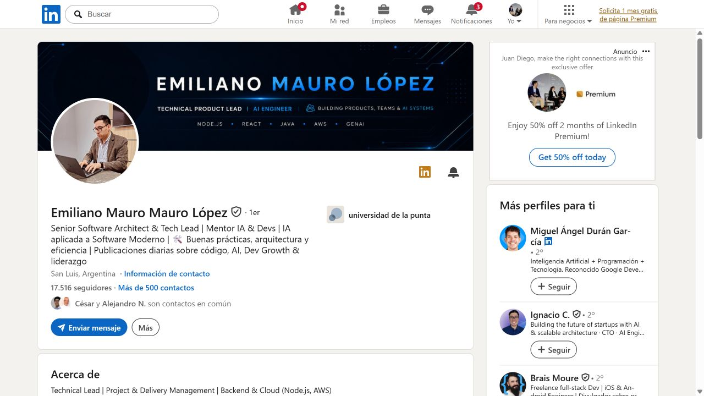

<strong>11. Aldo Siu</strong>

- Link: [Abrir perfil de LinkedIn](https://www.linkedin.com/in/aldosiu/)
- Categoria sugerida: BI, data y analitica
- Prioridad: Media-alta
- Por que puede servir: Encaja con tu angulo fuerte de BI, dashboards, datos, eficiencia y automatizacion empresarial.
- Senal visible: Aldo Siu 2 AI Business Strategist | CAIO en NegosIA | Maestria en Inteligencia Artificial (UNI) | IA Generativa & MLOps (UNI) | Data Science & Business Intelligence (DMC) | Logistica y Operaciones (ESAN) | Economista (ULima) Area metropolitana de Lima Seguir Actual: Co-Fundador (Chief AI Officer) en Negosia - IA para negocios. Consultor y ejecutor de proyectos de inteligencia artificial aplicada a negocio Julio A Mon

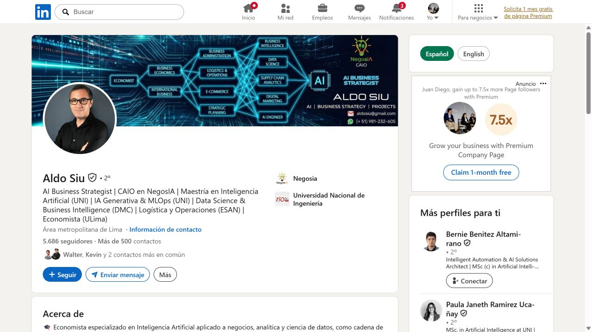

<strong>12. Julio A Monasterio H</strong>

- Link: [Abrir perfil de LinkedIn](https://www.linkedin.com/in/juliomonasterio/)
- Categoria sugerida: Negocio, estrategia o tecnologia
- Prioridad: Media
- Por que puede servir: Puede aportar perspectiva de negocio, estrategia o tecnologia para ampliar tu red fuera del circulo puramente tecnico.
- Senal visible: Julio A Monasterio H

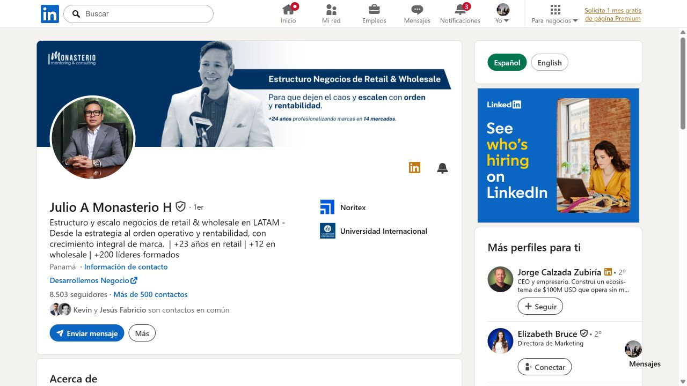

<strong>13. Kevin Gomez Villanueva</strong>

- Link: [Abrir perfil de LinkedIn](https://www.linkedin.com/in/kevin-gomez-iot/)
- Categoria sugerida: Negocio, estrategia o tecnologia
- Prioridad: Media
- Por que puede servir: Puede aportar perspectiva de negocio, estrategia o tecnologia para ampliar tu red fuera del circulo puramente tecnico.
- Senal visible: Kevin Gomez Villanueva

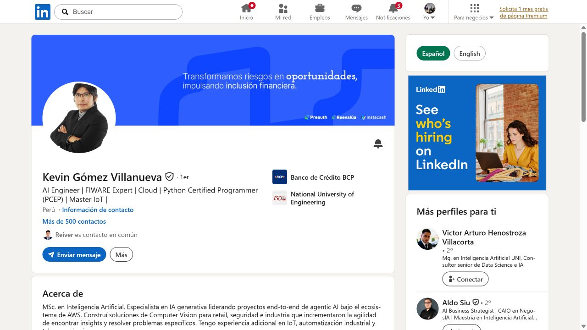

<strong>14. Kevin Edinson Vilcherres Trinidad</strong>

- Link: [Abrir perfil de LinkedIn](https://www.linkedin.com/in/kevinedinson/)
- Categoria sugerida: Marketing, crecimiento y contenido
- Prioridad: Media-alta
- Por que puede servir: Sirve para abrir conversaciones sobre IA aplicada a contenido, posicionamiento, adquisicion de clientes y crecimiento B2B.
- Senal visible: Kevin Edinson Vilcherres Trinidad 2 AI Product & Growth | GenAI | Business Management | Innovacion | Startups | Emprendimiento | Productos Digitales | Growth | Inteligencia Artificial | No-Code | Data Peru Seguir Anterior: GenAI Product Consultant | Pacifico Seguros en Growty - capacidades de Inteligencia Artificial generativa Reiver Lopez y Lizeth Huayta Vilcas son contactos en comun 8 mil seguidores

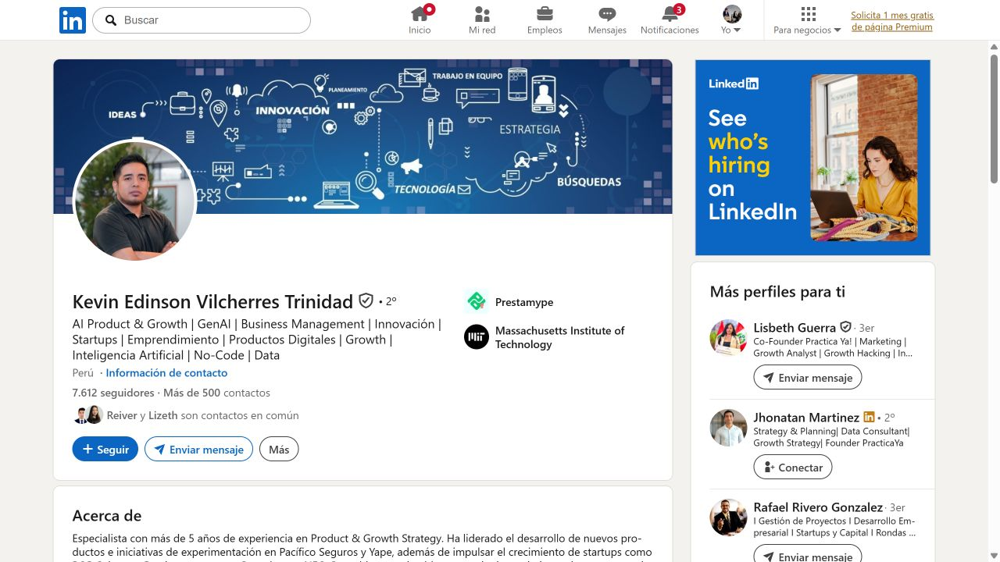

<strong>15. Lizeth Huayta Vilcas</strong>

- Link: [Abrir perfil de LinkedIn](https://www.linkedin.com/in/lizeth-huayta-vilcas-454474211/)
- Categoria sugerida: Negocio, estrategia o tecnologia
- Prioridad: Media
- Por que puede servir: Puede aportar perspectiva de negocio, estrategia o tecnologia para ampliar tu red fuera del circulo puramente tecnico.
- Senal visible: Lizeth Huayta Vilcas

<strong>16. Daniel Jacome</strong>

- Link: [Abrir perfil de LinkedIn](https://www.linkedin.com/in/danieljacomeportillo/)
- Categoria sugerida: Marketing, crecimiento y contenido
- Prioridad: Media-alta
- Por que puede servir: Sirve para abrir conversaciones sobre IA aplicada a contenido, posicionamiento, adquisicion de clientes y crecimiento B2B.
- Senal visible: Daniel Jacome 2 Senior Director at Procter & Gamble| Marketing & Commercial Leader | Digital Commerce | Analytics & Insights | FMCG | LATAM Panama, Panama Conectar Actual: Commercial Sr. Director eCommerce LA & Argentina | Analytics & Insights Head - Fabric & Home Care Jesus Maradiaga y Julio A Monasterio H son contactos en comun

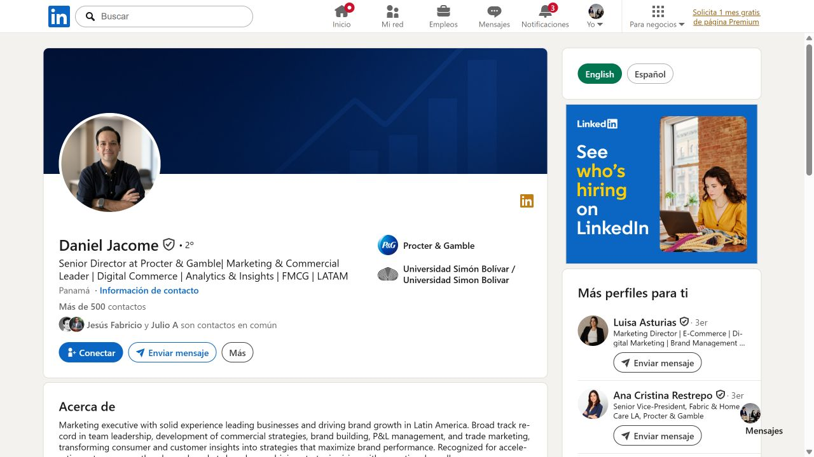

<strong>17. Jesus Maradiaga</strong>

- Link: [Abrir perfil de LinkedIn](https://www.linkedin.com/in/jesusmaradiaga/es/)
- Categoria sugerida: Negocio, estrategia o tecnologia
- Prioridad: Media
- Por que puede servir: Puede aportar perspectiva de negocio, estrategia o tecnologia para ampliar tu red fuera del circulo puramente tecnico.
- Senal visible: Jesus Maradiaga

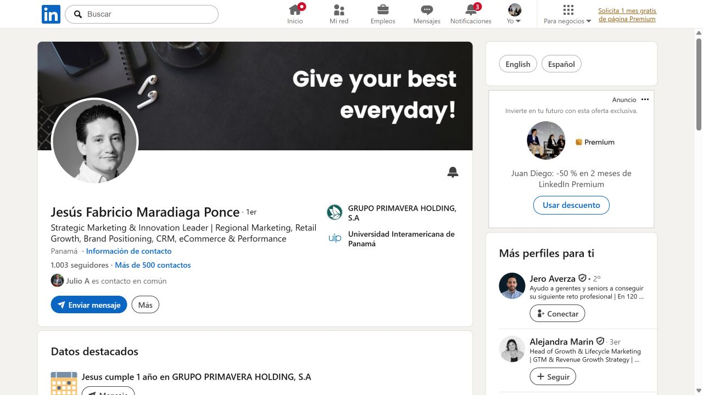

<strong>18. Sthefan Alessandro Borace</strong>

- Link: [Abrir perfil de LinkedIn](https://www.linkedin.com/in/sthefanborace/)
- Categoria sugerida: Marketing, crecimiento y contenido
- Prioridad: Media-alta
- Por que puede servir: Sirve para abrir conversaciones sobre IA aplicada a contenido, posicionamiento, adquisicion de clientes y crecimiento B2B.
- Senal visible: Sthefan Alessandro Borace 2 LATAM Rewards Intern at Philips | Marketing & Business Student | Strategy, Communication & Growth Panama, Panama Seguir Actual: Latam Rewards Intern en Philips Fabiola Rodriguez Domingo es contacto en comun 1 mil seguidores

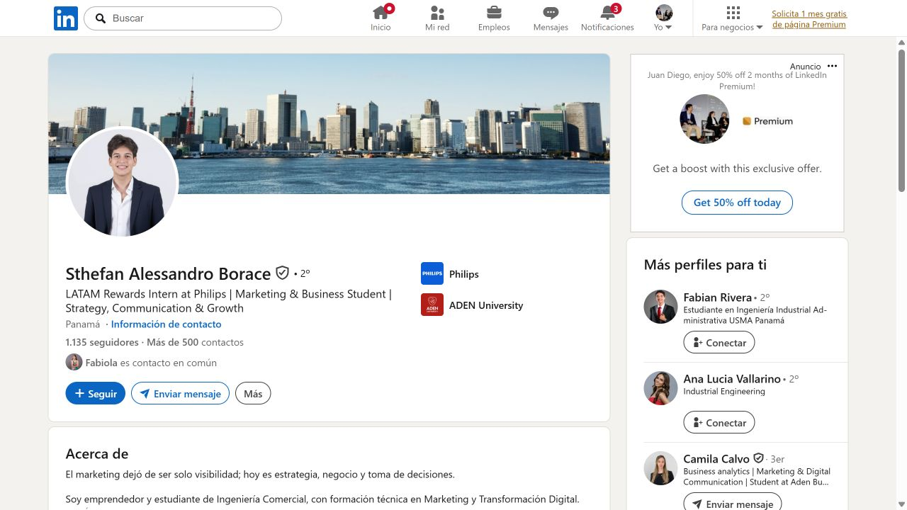

<strong>19. Fabiola Rodriguez Domingo</strong>

- Link: [Abrir perfil de LinkedIn](https://www.linkedin.com/in/fabiola-rodr%C3%ADguez-domingo-4790ab359/)
- Categoria sugerida: Negocio, estrategia o tecnologia
- Prioridad: Media
- Por que puede servir: Puede aportar perspectiva de negocio, estrategia o tecnologia para ampliar tu red fuera del circulo puramente tecnico.
- Senal visible: Fabiola Rodriguez Domingo

<strong>20. Ronald Mego</strong>

- Link: [Abrir perfil de LinkedIn](https://www.linkedin.com/in/ronaldmego/)
- Categoria sugerida: BI, data y analitica
- Prioridad: Alta
- Por que puede servir: Encaja con tu angulo fuerte de BI, dashboards, datos, eficiencia y automatizacion empresarial.
- Senal visible: Ronald Mego 2 Data Governance | Customer & Digital Analytics | Data Privacy | Governed AI Panama, Panama, Panama Seguir Actual: Head of Data Analytics & Digital en Millicom (Tigo) Reiver Lopez es contacto en comun 4 mil seguidores

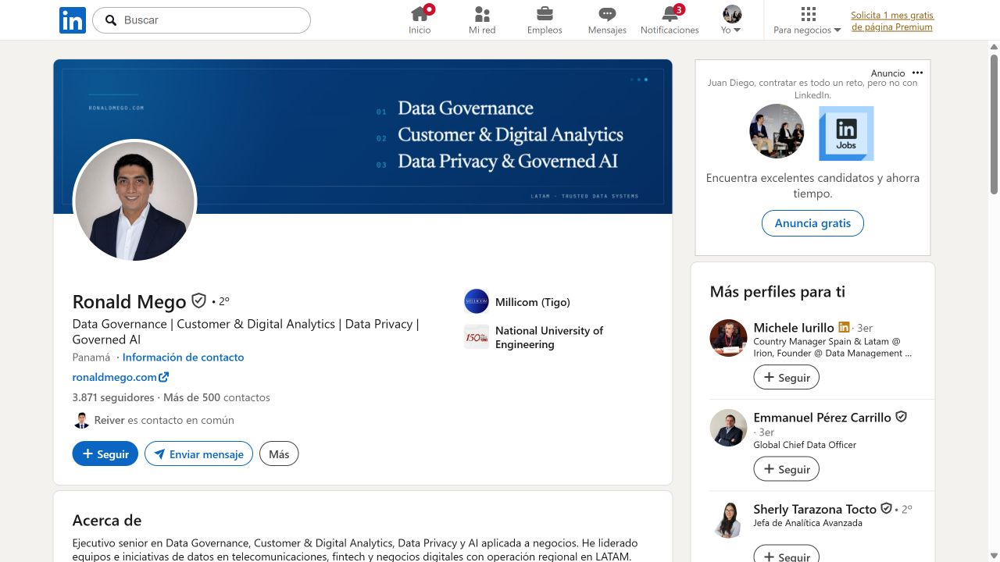

<strong>21. Leykis Trotman</strong>

- Link: [Abrir perfil de LinkedIn](https://www.linkedin.com/in/leykis-trotman-8493b616a/)
- Categoria sugerida: Marketing, crecimiento y contenido
- Prioridad: Media-alta
- Por que puede servir: Sirve para abrir conversaciones sobre IA aplicada a contenido, posicionamiento, adquisicion de clientes y crecimiento B2B.
- Senal visible: Leykis Trotman 3er+ Product Marketing Specialist | B2B & Tech Growth | MBA | Global Go-to-Market | Remote-Ready (LATAM, US & EU) Panama Seguir Actual: Professional Development & Digital Marketing Upskilling en Google Ads (Google Partner) 138 seguidores

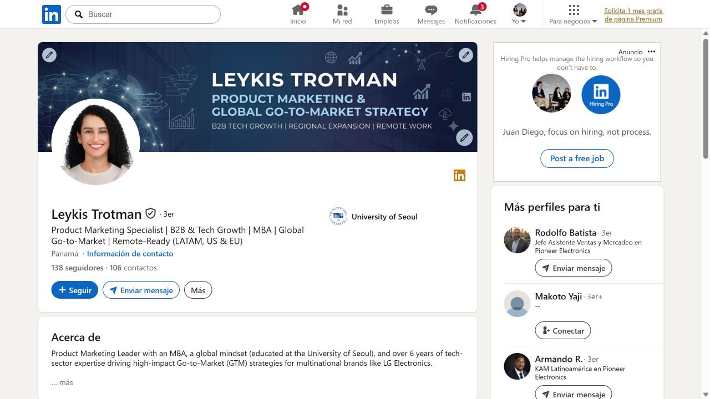

<strong>22. Imanol Rodriguez</strong>

- Link: [Abrir perfil de LinkedIn](https://www.linkedin.com/in/imanolralvarez/)
- Categoria sugerida: BI, data y analitica
- Prioridad: Media-alta
- Por que puede servir: Encaja con tu angulo fuerte de BI, dashboards, datos, eficiencia y automatizacion empresarial.
- Senal visible: Imanol Rodriguez 2 Student at Universidad Tecnologica de Panama Panama, Panama, Panama Conectar Actual: Data Analyst en Fundacion Ayudinga Rodrigo Yanguez, Andres Villarreal y 3 contactos mas en comun

<strong>23. Rodrigo Yanguez</strong>

- Link: [Abrir perfil de LinkedIn](https://www.linkedin.com/in/rodrigoiyg/)
- Categoria sugerida: Negocio, estrategia o tecnologia
- Prioridad: Media
- Por que puede servir: Puede aportar perspectiva de negocio, estrategia o tecnologia para ampliar tu red fuera del circulo puramente tecnico.
- Senal visible: Rodrigo Yanguez

<strong>24. Andres Villarreal</strong>

- Link: [Abrir perfil de LinkedIn](https://www.linkedin.com/in/andr%C3%A9s-villarreal-7205b2263/)
- Categoria sugerida: Negocio, estrategia o tecnologia
- Prioridad: Media
- Por que puede servir: Puede aportar perspectiva de negocio, estrategia o tecnologia para ampliar tu red fuera del circulo puramente tecnico.
- Senal visible: Andres Villarreal

<strong>25. Daniel Wen Lay</strong>

- Link: [Abrir perfil de LinkedIn](https://www.linkedin.com/in/daniel-wen-lay/)
- Categoria sugerida: BI, data y analitica
- Prioridad: Media-alta
- Por que puede servir: Encaja con tu angulo fuerte de BI, dashboards, datos, eficiencia y automatizacion empresarial.
- Senal visible: Daniel Wen Lay 2 Data Analyst Engineer at Huawei Latinoamerica Panama, Panama, Panama Conectar Actual: Data Analyst Engineer en Huawei Jefferson Angel Areche Rojas, William Rodriguez Grajales y 12 contactos mas en comun

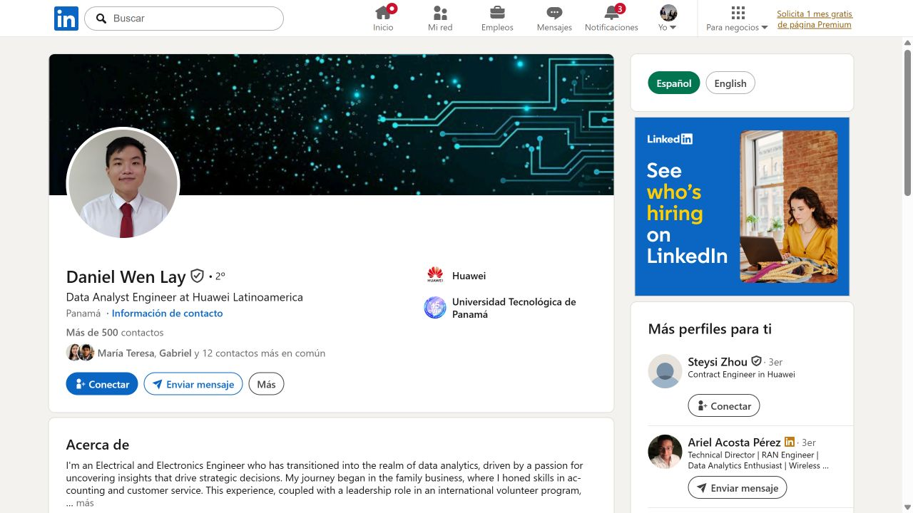

<strong>26. Jefferson Angel Areche Rojas</strong>

- Link: [Abrir perfil de LinkedIn](https://www.linkedin.com/in/jeffersonangel/es/)
- Categoria sugerida: Negocio, estrategia o tecnologia
- Prioridad: Media
- Por que puede servir: Puede aportar perspectiva de negocio, estrategia o tecnologia para ampliar tu red fuera del circulo puramente tecnico.
- Senal visible: Jefferson Angel Areche Rojas

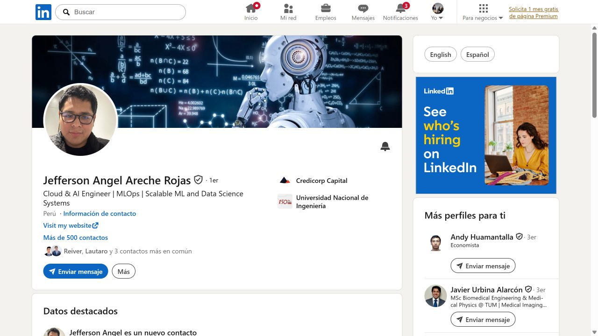

<strong>27. William Rodriguez Grajales</strong>

- Link: [Abrir perfil de LinkedIn](https://www.linkedin.com/in/william-rodr%C3%ADguez-grajales-67354a135/)
- Categoria sugerida: Negocio, estrategia o tecnologia
- Prioridad: Media
- Por que puede servir: Puede aportar perspectiva de negocio, estrategia o tecnologia para ampliar tu red fuera del circulo puramente tecnico.
- Senal visible: William Rodriguez Grajales

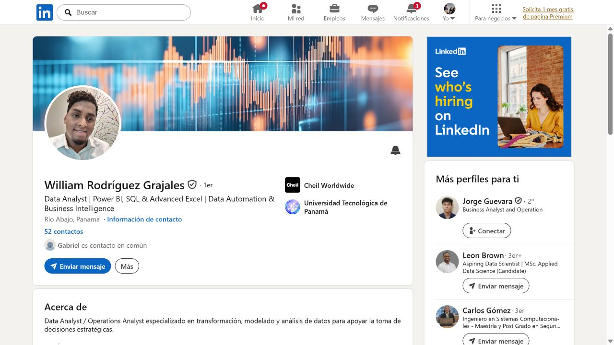

<strong>28. Eymar Jose Marchena Quintero</strong>

- Link: [Abrir perfil de LinkedIn](https://www.linkedin.com/in/eymarjo/)
- Categoria sugerida: BI, data y analitica
- Prioridad: Media-alta
- Por que puede servir: Encaja con tu angulo fuerte de BI, dashboards, datos, eficiencia y automatizacion empresarial.
- Senal visible: Eymar Jose Marchena Quintero 2 Information System Engineering student at Technological University of Panama Panama, Panama, Panama Conectar Actual: Data Analyst en Banco General Fernando Cutire y Andres Villarreal son contactos en comun

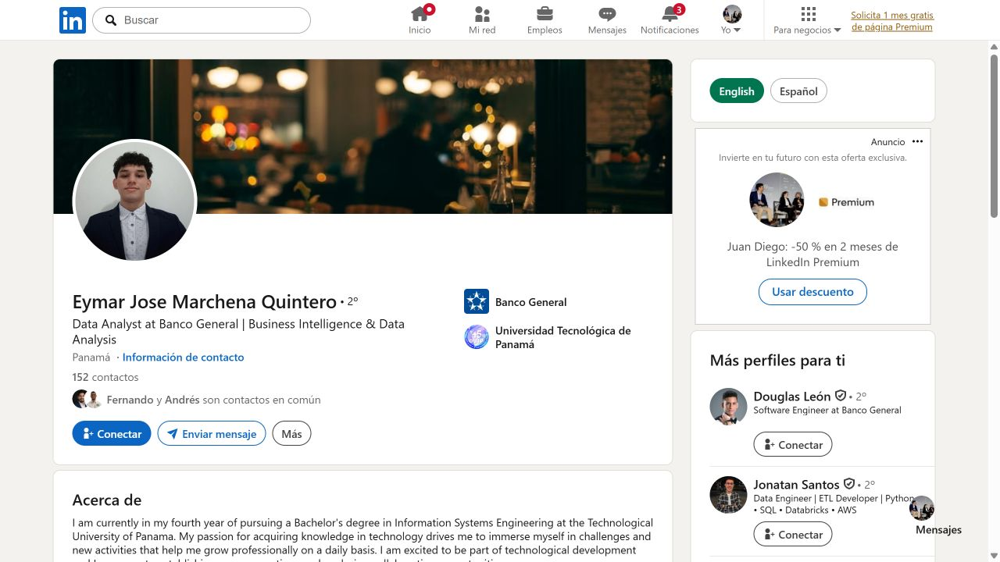

<strong>29. Fernando Cutire</strong>

- Link: [Abrir perfil de LinkedIn](https://www.linkedin.com/in/fernandocutire/)
- Categoria sugerida: Negocio, estrategia o tecnologia
- Prioridad: Media
- Por que puede servir: Puede aportar perspectiva de negocio, estrategia o tecnologia para ampliar tu red fuera del circulo puramente tecnico.
- Senal visible: Fernando Cutire

<strong>30. Paula Andrea Vasquez Aparicio</strong>

- Link: [Abrir perfil de LinkedIn](https://www.linkedin.com/in/paula-andrea-vasquez-aparicio/)
- Categoria sugerida: IA, automatizacion y procesos
- Prioridad: Media-alta
- Por que puede servir: Puede entender rapido la propuesta de CodeFlow porque ya aparece cerca de IA, automatizacion o transformacion digital.
- Senal visible: Paula Andrea Vasquez Aparicio 2 Sales Manager @Dapta | Transforming Businesses with AI Madrid, Comunidad de Madrid, Espana Seguir Anterior: Relationship manager en Citi - Corporate Banker Panama Subsidiaries Samuel Santa es contacto en comun 2 mil seguidores Ir a mi sitio web

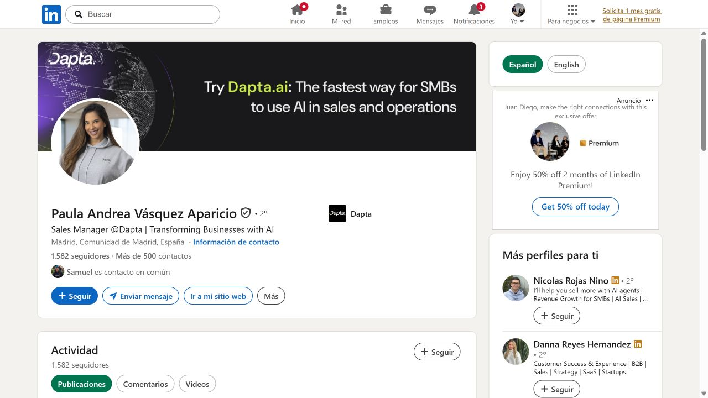

<strong>31. Samuel Santa</strong>

- Link: [Abrir perfil de LinkedIn](https://www.linkedin.com/in/devsanta/)
- Categoria sugerida: Negocio, estrategia o tecnologia
- Prioridad: Media
- Por que puede servir: Puede aportar perspectiva de negocio, estrategia o tecnologia para ampliar tu red fuera del circulo puramente tecnico.
- Senal visible: Samuel Santa

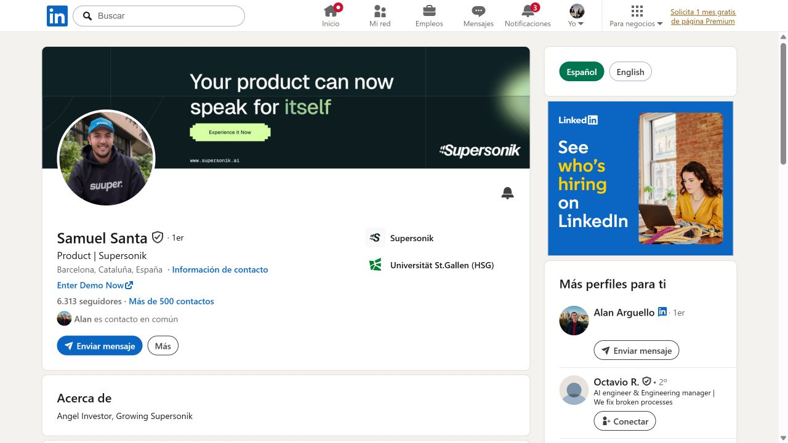

<strong>32. Natalia Ortiz</strong>

- Link: [Abrir perfil de LinkedIn](https://www.linkedin.com/in/nataliaortizmarketing/)
- Categoria sugerida: Marketing, crecimiento y contenido
- Prioridad: Media-alta
- Por que puede servir: Sirve para abrir conversaciones sobre IA aplicada a contenido, posicionamiento, adquisicion de clientes y crecimiento B2B.
- Senal visible: Natalia Ortiz 2 Gerente de Marketing | Digital Marketing | eCommerce | Growth Marketing | Brand Strategy | Venta Multicanal | CX | Data & Insights | AI Peru Conectar Anterior: Gerente de Customer y Marketing Strategy en NTT DATA Europe & Latam

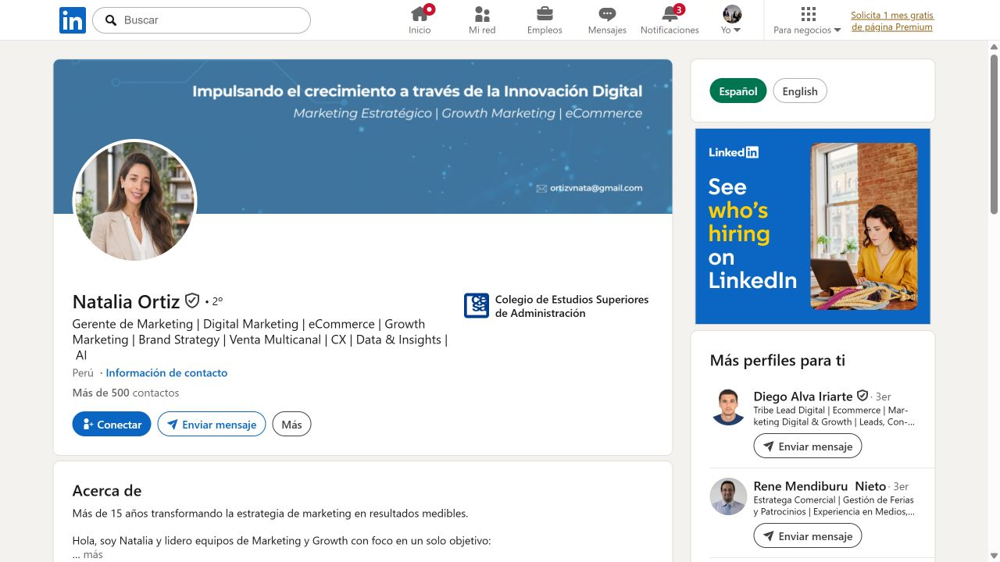

<strong>33. ANAIS C.</strong>

- Link: [Abrir perfil de LinkedIn](https://www.linkedin.com/in/anais-c-76824217a/)
- Categoria sugerida: Negocio, estrategia o tecnologia
- Prioridad: Media-alta
- Por que puede servir: Puede aportar perspectiva de negocio, estrategia o tecnologia para ampliar tu red fuera del circulo puramente tecnico.
- Senal visible: ANAIS C. 2 IT Project Coordinator | Especialista en Gestion de Proyectos | Impulsando la Innovacion Tecnologica y STEAM Panama, Panama, Panama Conectar Actual: Mentora y Lider de Equipos | Technovation Girls Panama en Technovation Girls Panama Karin Sempf y Julio A Monasterio H son contactos en comun

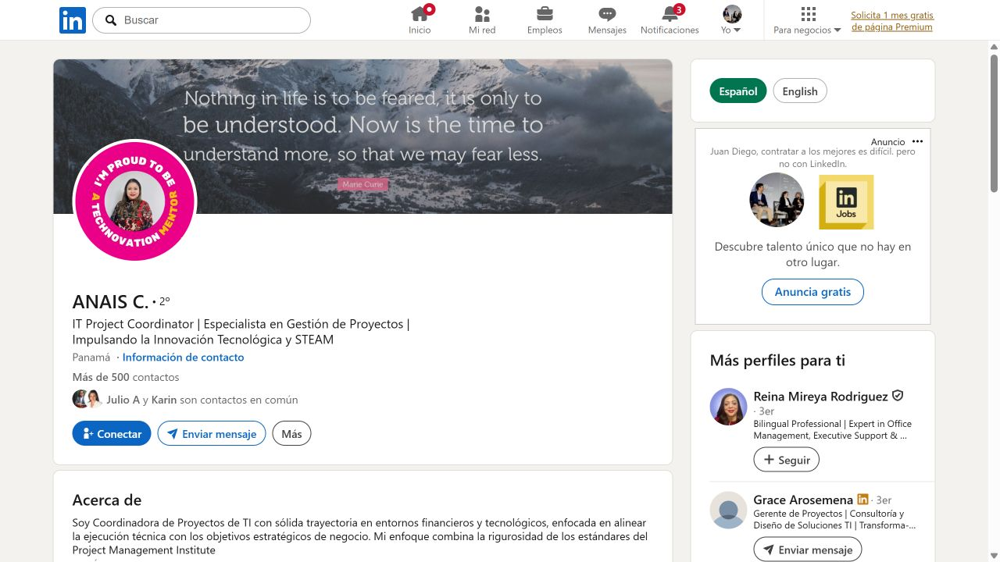

<strong>34. Karin Sempf</strong>

- Link: [Abrir perfil de LinkedIn](https://www.linkedin.com/in/karinsempf/)
- Categoria sugerida: Negocio, estrategia o tecnologia
- Prioridad: Media
- Por que puede servir: Puede aportar perspectiva de negocio, estrategia o tecnologia para ampliar tu red fuera del circulo puramente tecnico.
- Senal visible: Karin Sempf

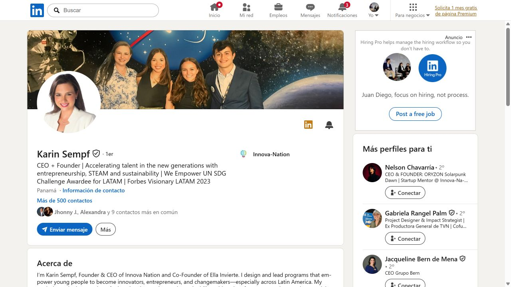

<strong>35. Henry J. Rodriguez Dorta</strong>

- Link: [Abrir perfil de LinkedIn](https://www.linkedin.com/in/henryrodriguezdorta/)
- Categoria sugerida: Negocio, estrategia o tecnologia
- Prioridad: Media
- Por que puede servir: Puede aportar perspectiva de negocio, estrategia o tecnologia para ampliar tu red fuera del circulo puramente tecnico.
- Senal visible: Henry J. Rodriguez Dorta 2 Puente entre Tecnologia y Negocio | 27+ anos | Sector Publico Servicios Financieros Infraestructura | LATAM y UE | Ciudadano espanol/UE | Disponible para Iberia o LATAM remoto Panama, Panama Seguir Actual: Sales Operations Manager LATAM & Caribbean en SIH, BV Karin Sempf, Julio A Monasterio H y 1 contacto mas en comun 30 mil seguidores

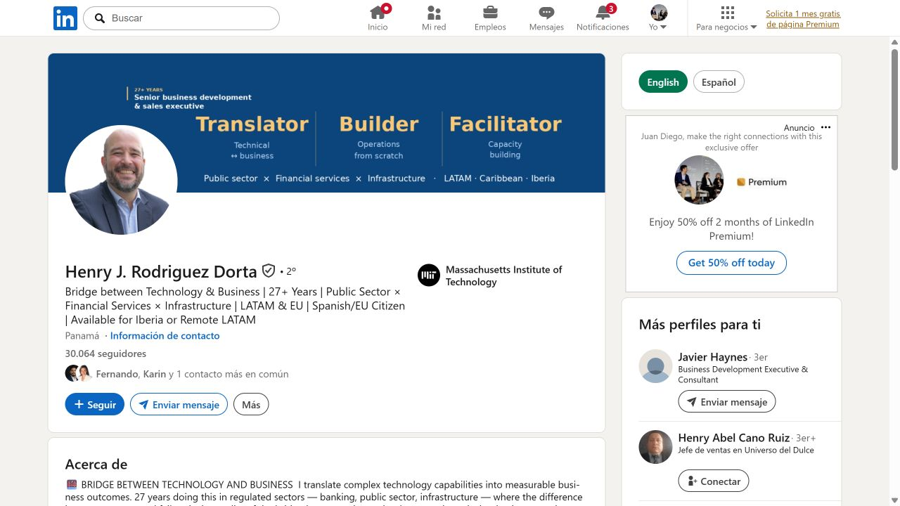

<strong>36. Leonardo castillo</strong>

- Link: [Abrir perfil de LinkedIn](https://www.linkedin.com/in/leonardo-castillo-075a35329/)
- Categoria sugerida: BI, data y analitica
- Prioridad: Media-alta
- Por que puede servir: Encaja con tu angulo fuerte de BI, dashboards, datos, eficiencia y automatizacion empresarial.
- Senal visible: Leonardo castillo 2 Data Analyst & BI Engineer | SQL Server Power BI Microstrategy Sap BO Python | ETL & Financial Analytics Panama, Panama, Panama Conectar Anterior: Practicante Analista de datos en Mercantil Panama - dashboards ejecutivos y operativos en Power BI Cesar Gonzalez Camargo y Gabriel Caballero son contactos en comun

<strong>37. Cesar Gonzalez Camargo</strong>

- Link: [Abrir perfil de LinkedIn](https://www.linkedin.com/in/cg-0430-pa/)
- Categoria sugerida: Negocio, estrategia o tecnologia
- Prioridad: Media
- Por que puede servir: Puede aportar perspectiva de negocio, estrategia o tecnologia para ampliar tu red fuera del circulo puramente tecnico.
- Senal visible: Cesar Gonzalez Camargo

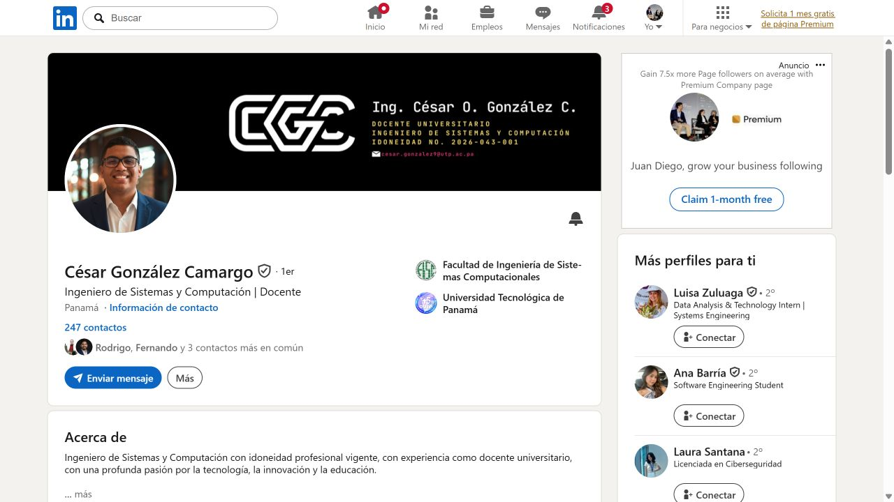

<strong>38. Gabriel Caballero</strong>

- Link: [Abrir perfil de LinkedIn](https://www.linkedin.com/in/gabriel-caballero-1036b5301/)
- Categoria sugerida: Negocio, estrategia o tecnologia
- Prioridad: Media
- Por que puede servir: Puede aportar perspectiva de negocio, estrategia o tecnologia para ampliar tu red fuera del circulo puramente tecnico.
- Senal visible: Gabriel Caballero

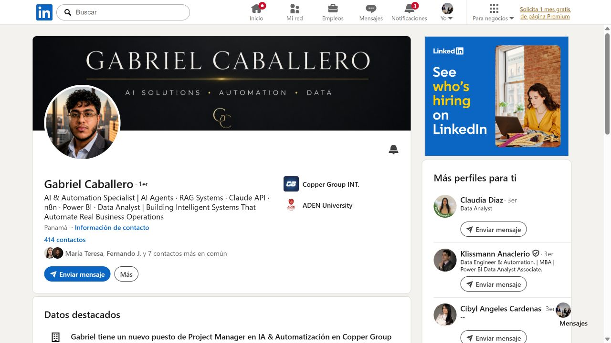

<strong>39. Cesar Enrrique Romero Sanchez</strong>

- Link: [Abrir perfil de LinkedIn](https://www.linkedin.com/in/cesar-romero-s/)
- Categoria sugerida: BI, data y analitica
- Prioridad: Media-alta
- Por que puede servir: Encaja con tu angulo fuerte de BI, dashboards, datos, eficiencia y automatizacion empresarial.
- Senal visible: Cesar Enrrique Romero Sanchez 2 Ing. Estadistica Informatica | Data Analytics | Data Scientist | Python | R | SQL | Power Bi Area metropolitana de Lima Conectar Certificaciones: TRANSFORMACION DE DATOS CON POWER BI Valeria Alzamora Caipane, Romulo Salvador y 3 contactos mas en comun

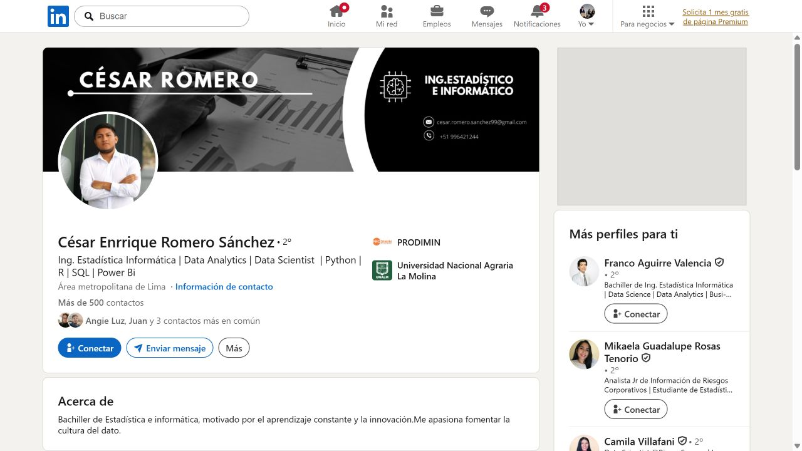

<strong>40. Valeria Alzamora Caipane</strong>

- Link: [Abrir perfil de LinkedIn](https://www.linkedin.com/in/valeriaalzamoracaipane250199/)
- Categoria sugerida: Negocio, estrategia o tecnologia
- Prioridad: Media
- Por que puede servir: Puede aportar perspectiva de negocio, estrategia o tecnologia para ampliar tu red fuera del circulo puramente tecnico.
- Senal visible: Valeria Alzamora Caipane

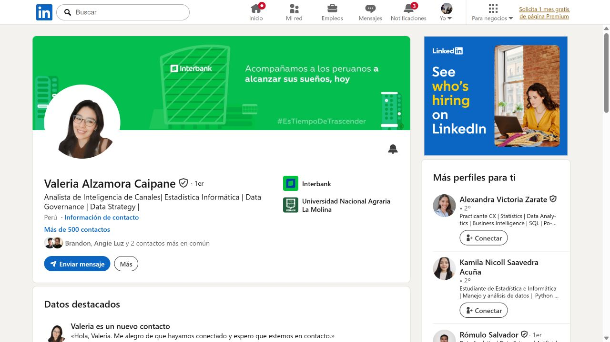

<strong>41. Romulo Salvador</strong>

- Link: [Abrir perfil de LinkedIn](https://www.linkedin.com/in/romulo-salvador/)
- Categoria sugerida: Negocio, estrategia o tecnologia
- Prioridad: Media
- Por que puede servir: Puede aportar perspectiva de negocio, estrategia o tecnologia para ampliar tu red fuera del circulo puramente tecnico.
- Senal visible: Romulo Salvador

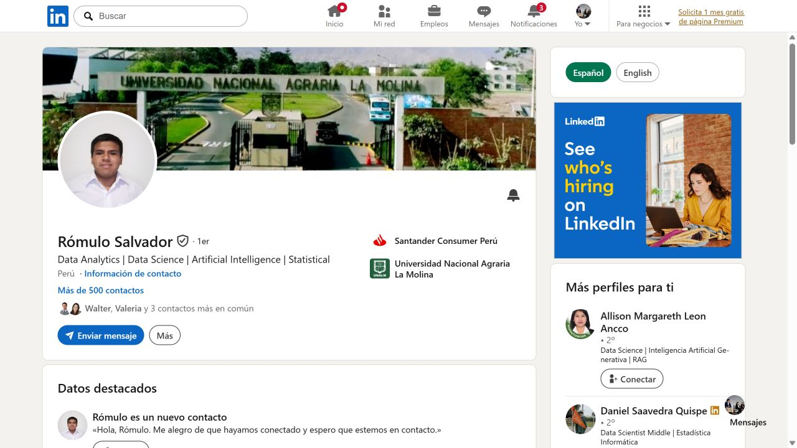

<strong>42. Omar Cedeno</strong>

- Link: [Abrir perfil de LinkedIn](https://www.linkedin.com/in/omar-cede%C3%B1o-0a2350374/)
- Categoria sugerida: BI, data y analitica
- Prioridad: Media
- Por que puede servir: Encaja con tu angulo fuerte de BI, dashboards, datos, eficiencia y automatizacion empresarial.
- Senal visible: Omar Cedeno 2 Estudiante de Ingenieria Civil | Apasionado por el Data Analytics | Python | Power BI | Universidad de Guayaquil Guayaquil, Guayas, Ecuador Conectar Anterior: Analista de Datos Financieros (Proyecto Academico) en Data Foundation Programs Coding Bootcamps ESPOL - Durante el modulo de Python for Data Analytics, desarrolle un analisis enfocado en maximizar la Juan Perez es contacto en comun

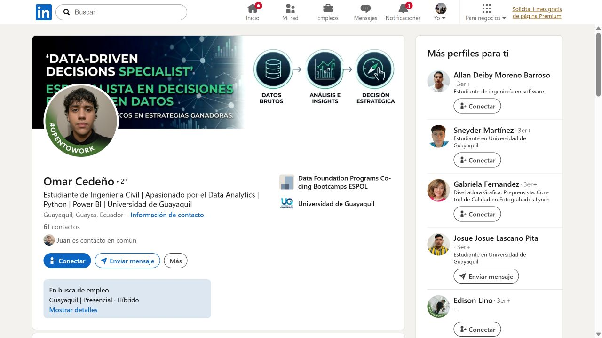

<strong>43. Juan Perez</strong>

- Link: [Abrir perfil de LinkedIn](https://www.linkedin.com/in/juan-p%C3%A9rez-4512a7269/)
- Categoria sugerida: Negocio, estrategia o tecnologia
- Prioridad: Media
- Por que puede servir: Puede aportar perspectiva de negocio, estrategia o tecnologia para ampliar tu red fuera del circulo puramente tecnico.
- Senal visible: Juan Perez

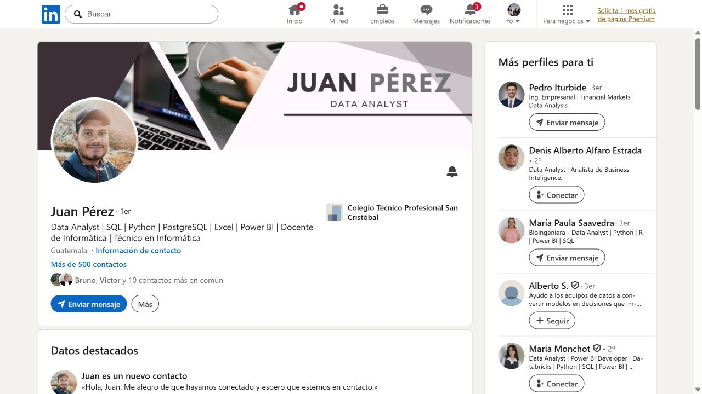

<strong>44. Alfredo Delgado Moya</strong>

- Link: [Abrir perfil de LinkedIn](https://www.linkedin.com/in/alfredodelgadoo/)
- Categoria sugerida: BI, data y analitica
- Prioridad: Media
- Por que puede servir: Encaja con tu angulo fuerte de BI, dashboards, datos, eficiencia y automatizacion empresarial.
- Senal visible: Alfredo Delgado Moya 2 BI Engineer | Analytics Engineering SQL Python Machine Learning Peru Conectar Actual: Mid BI Reporting Analyst en Lean Solutions Group Reiver Lopez, Miguel Jonathan Mogrovejo Cardenas y 1 contacto mas en comun

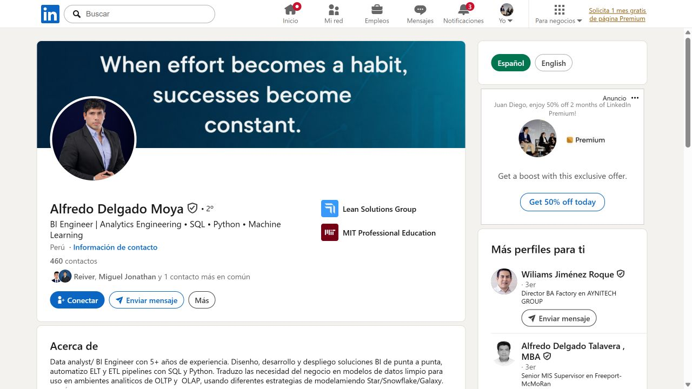

<strong>45. Simon Bravo Sierra</strong>

- Link: [Abrir perfil de LinkedIn](https://www.linkedin.com/in/sim%C3%B3n-bravo-sierra-5723a2260/)
- Categoria sugerida: Marketing, crecimiento y contenido
- Prioridad: Media
- Por que puede servir: Sirve para abrir conversaciones sobre IA aplicada a contenido, posicionamiento, adquisicion de clientes y crecimiento B2B.
- Senal visible: Simon Bravo Sierra 2 CRO at hackU | B2B Sales & Partnerships | Scaling Startups & Scaleups in LatAm | Driving Growth & Strategy Medellin, Antioquia, Colombia Seguir Actual: Co-Founder en Balu - growth. During this journey, we participated 2 mil seguidores

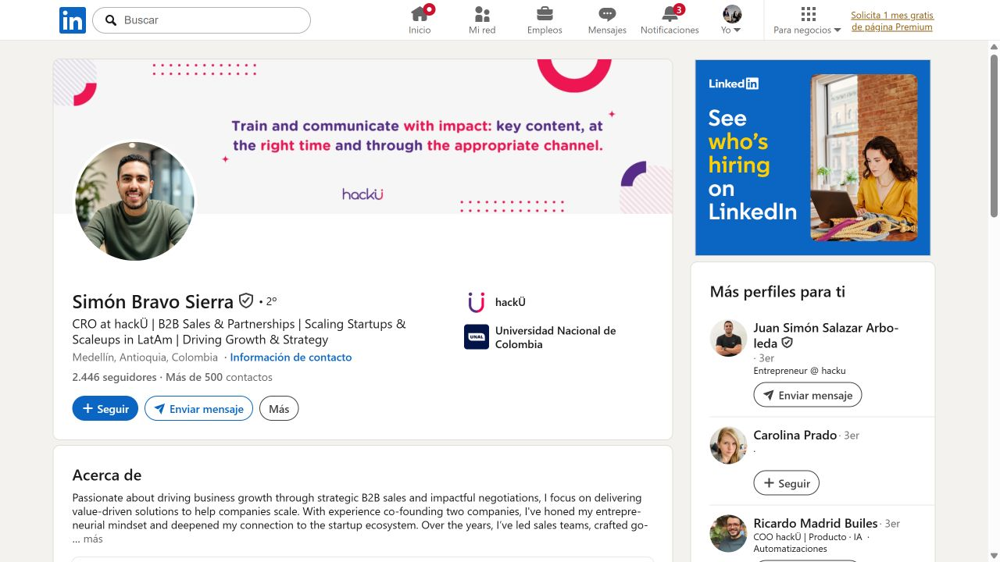

<strong>46. Raul Sanchez-Barbudo</strong>

- Link: [Abrir perfil de LinkedIn](https://www.linkedin.com/in/raulsanchezbarbudo/)
- Categoria sugerida: IA, automatizacion y procesos
- Prioridad: Media
- Por que puede servir: Puede entender rapido la propuesta de CodeFlow porque ya aparece cerca de IA, automatizacion o transformacion digital.
- Senal visible: Raul Sanchez-Barbudo 3er+ Country Manager | COO | General Manager | Market Entry & Expansion LATAM/EMEA | P&L Ownership | Industria, Logistica & BPO | IA & Automatizacion de Procesos Barranquilla, Atlantico, Colombia Enviar mensaje Actual: Consultor Senior de Operaciones y Crecimiento en FreeLance - tecnologica para empresas en LATAM y Europa

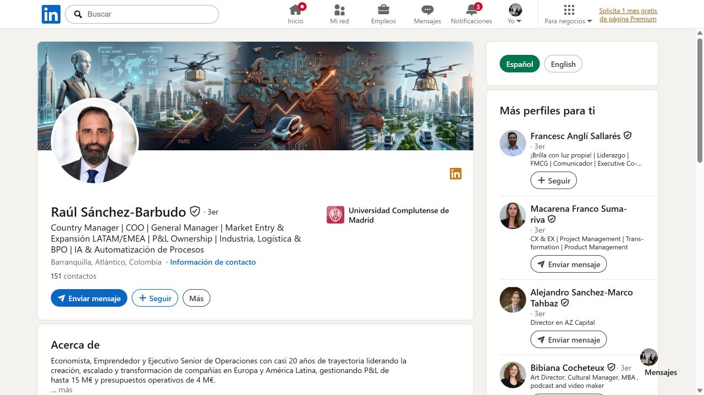

<strong>47. Miguel Angel Reinoso Tamayo</strong>

- Link: [Abrir perfil de LinkedIn](https://www.linkedin.com/in/miguel-angel-reinoso/)
- Categoria sugerida: Marketing, crecimiento y contenido
- Prioridad: Media-alta
- Por que puede servir: Sirve para abrir conversaciones sobre IA aplicada a contenido, posicionamiento, adquisicion de clientes y crecimiento B2B.
- Senal visible: Miguel Angel Reinoso Tamayo 3er+ Growth Marketing Manager | Acquisition Retention Paid Media | AI Tools & No-Code | LATAM Startups Ciudad de Mexico, Mexico Seguir Actual: Head of Growth en Cursalab 2 mil seguidores

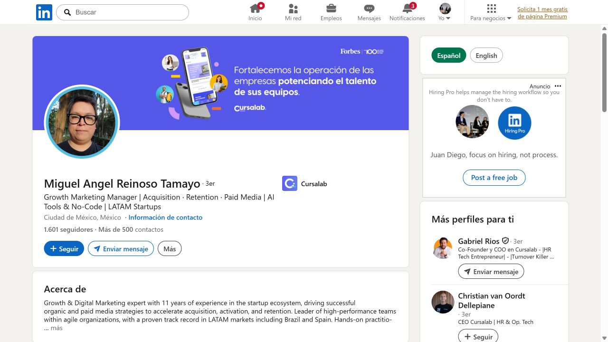

<strong>48. Carol Lozano Guzman</strong>

- Link: [Abrir perfil de LinkedIn](https://www.linkedin.com/in/carol-lozano-guzm%C3%A1n-b34131205/)
- Categoria sugerida: Marketing, crecimiento y contenido
- Prioridad: Media-alta
- Por que puede servir: Sirve para abrir conversaciones sobre IA aplicada a contenido, posicionamiento, adquisicion de clientes y crecimiento B2B.
- Senal visible: Carol Lozano Guzman 3er+ Psicologa / Growth Specialist / Ai Collections / Startups / Fintech - SaaS / Marketing Strategy / Inside Sales Representative / Learning & Development / LatAm / B2B Bogota, Distrito Capital, Colombia Enviar mensaje Anterior: Growth Specialist en Callbook AI (YC S26)

<strong>49. Mar Orrego Cardona</strong>

- Link: [Abrir perfil de LinkedIn](https://www.linkedin.com/in/marcardona/)
- Categoria sugerida: Marketing, crecimiento y contenido
- Prioridad: Media
- Por que puede servir: Sirve para abrir conversaciones sobre IA aplicada a contenido, posicionamiento, adquisicion de clientes y crecimiento B2B.
- Senal visible: Mar Orrego Cardona 3er+ Marketing & Comercial | Inbound Outbound CRM | Growth para Startups y Agencias Area metropolitana de Bogota D.C. Enviar mensaje Actual: Ejecutivo comercial en Psicologos Latam

<strong>50. Brian Sifria</strong>

- Link: [Abrir perfil de LinkedIn](https://www.linkedin.com/in/brian-sifria-/)
- Categoria sugerida: Marketing, crecimiento y contenido
- Prioridad: Media
- Por que puede servir: Sirve para abrir conversaciones sobre IA aplicada a contenido, posicionamiento, adquisicion de clientes y crecimiento B2B.
- Senal visible: Brian Sifria 2 B2B SaaS Sales | Go-To-Market | Growth & Startups Rosario y alrededores Conectar Actual: Sales & Partnerships Manager LATAM en Scalefusion Samuel Santa es contacto en comun Concertar una cita

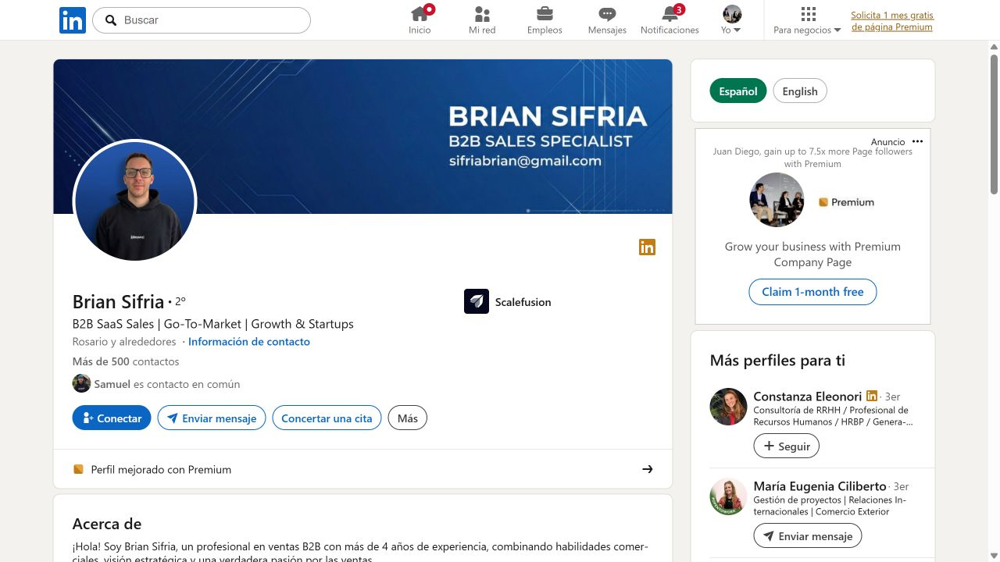

## Lectura estrategica

La ruta mas inteligente no es conectar con cualquier persona de IA. El mejor patron para ti es cruzar tres mundos: datos/BI, automatizacion/IA y marketing/crecimiento. Esa mezcla te ayuda a sostener una marca personal distinta: alguien que no solo habla de herramientas, sino de sistemas que mejoran ventas, operaciones, contenido y decisiones.

Para los proximos mensajes, conviene dividir los contactos en tres bandejas: perfiles jovenes para networking organico, perfiles tecnicos para aprendizaje/colaboracion, y perfiles de negocio para oportunidades B2B.
