# Networking para Maria Fernanda: 50 mujeres en marketing + IA

Este documento evalua el perfil de Maria Fernanda y propone 50 perfiles femeninos para networking en la interseccion de marketing, inteligencia artificial aplicada, analisis de datos, automatizacion, growth, estrategia creativa y creacion de contenido.

> Nota operativa: no se enviaron invitaciones ni mensajes. Las capturas son evidencia visual de perfiles visibles en LinkedIn desde la sesion abierta. No se infiere edad exacta; se prioriza etapa profesional/academica visible o afinidad de intereses.

## Perfil base de Maria Fernanda

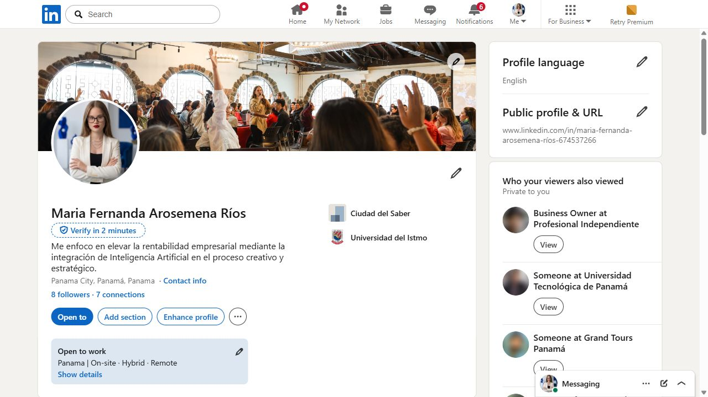

Maria Fernanda puede posicionarse como un perfil puente entre creatividad, estrategia empresarial e IA aplicada. La frase visible de su perfil apunta a elevar rentabilidad empresarial mediante integracion de inteligencia artificial en procesos creativos y estrategicos. Esa idea se puede convertir en una narrativa profesional fuerte si se ordena en cuatro frentes:

1. **Analisis de datos para marketing:** leer audiencias, campanas, comportamiento del consumidor, engagement, conversion y retencion.
2. **Automatizacion y growth:** usar IA, CRM, no-code y sistemas para escalar adquisicion, seguimiento y conversion.
3. **Estrategia creativa:** convertir insights en campanas, mensajes, identidad, storytelling y experiencia de marca.
4. **Creacion de contenido:** producir contenido mas claro, constante y medible usando IA como apoyo, no como sustituto de criterio humano.

## Criterios de busqueda

Se buscaron mujeres preferiblemente en Panama, Espana o Estados Unidos, con senales publicas de marketing, IA, datos, automatizacion, contenido, branding, growth, comunicacion o tecnologia. Los mejores perfiles son aquellos con los que Maria Fernanda puede iniciar una conversacion especifica, no generica.

## Capturas de busquedas usadas

Busqueda 01

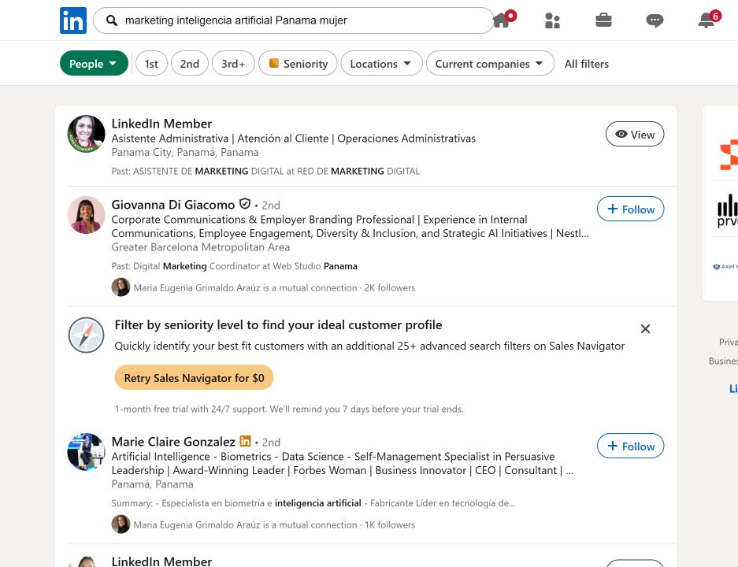

Busqueda 02

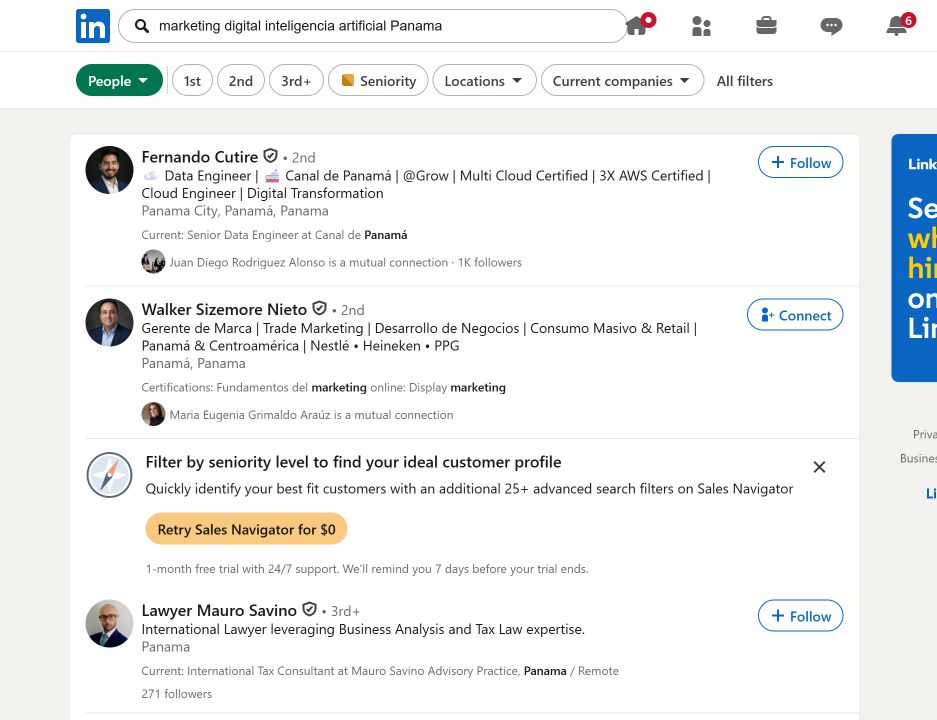

Busqueda 03

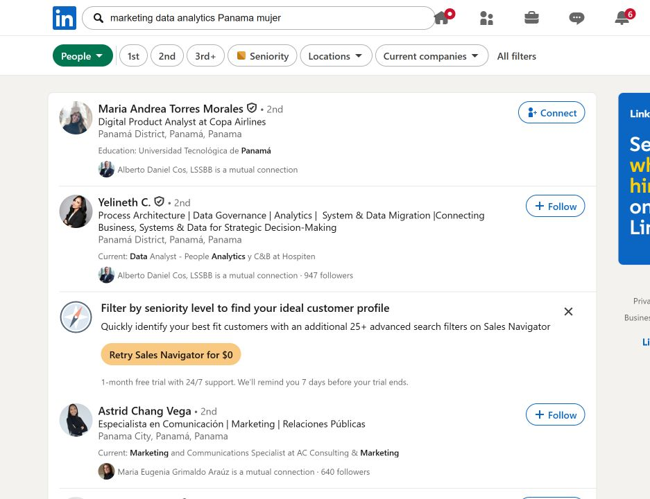

Busqueda 04

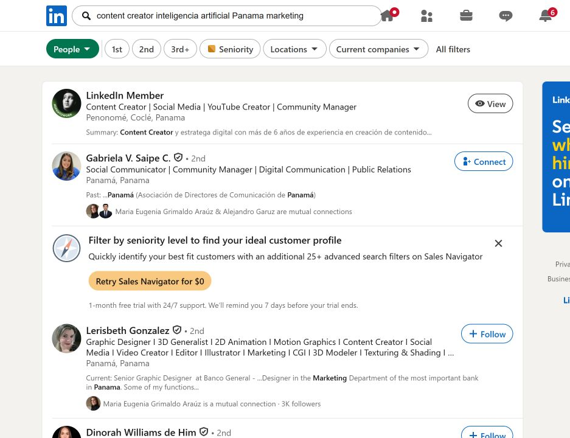

Busqueda 05

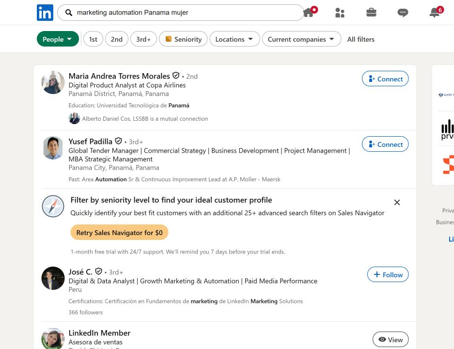

Busqueda 06

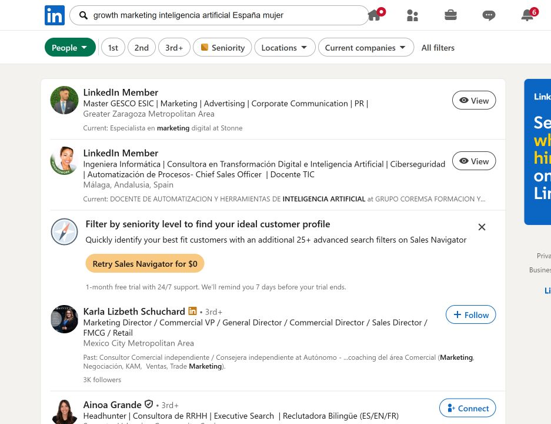

Busqueda 07

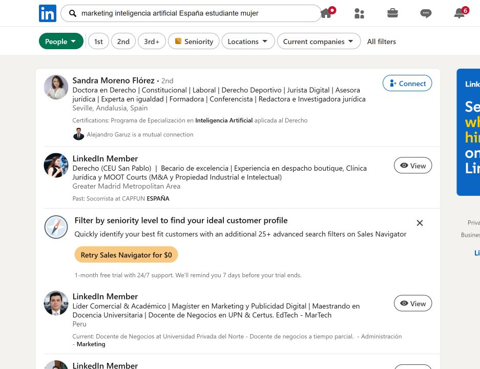

Busqueda 08

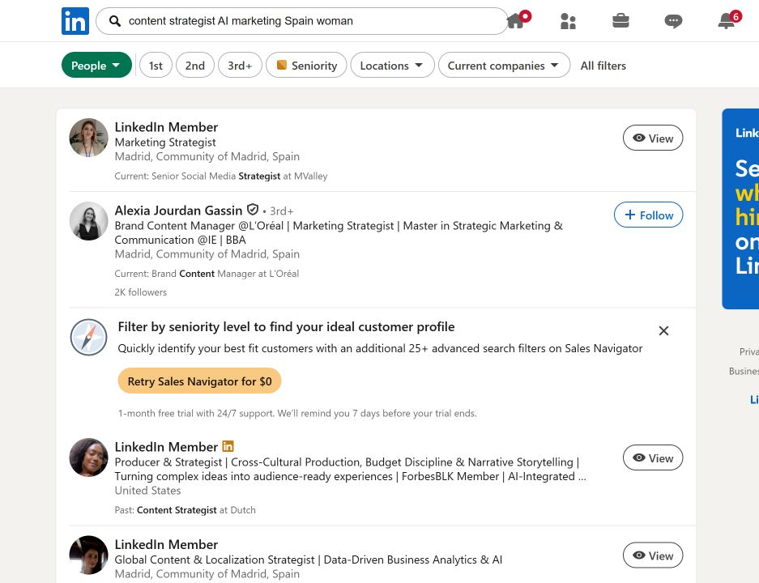

Busqueda 09

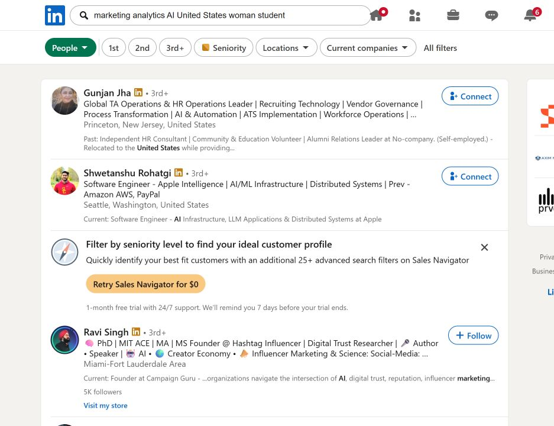

Busqueda 10

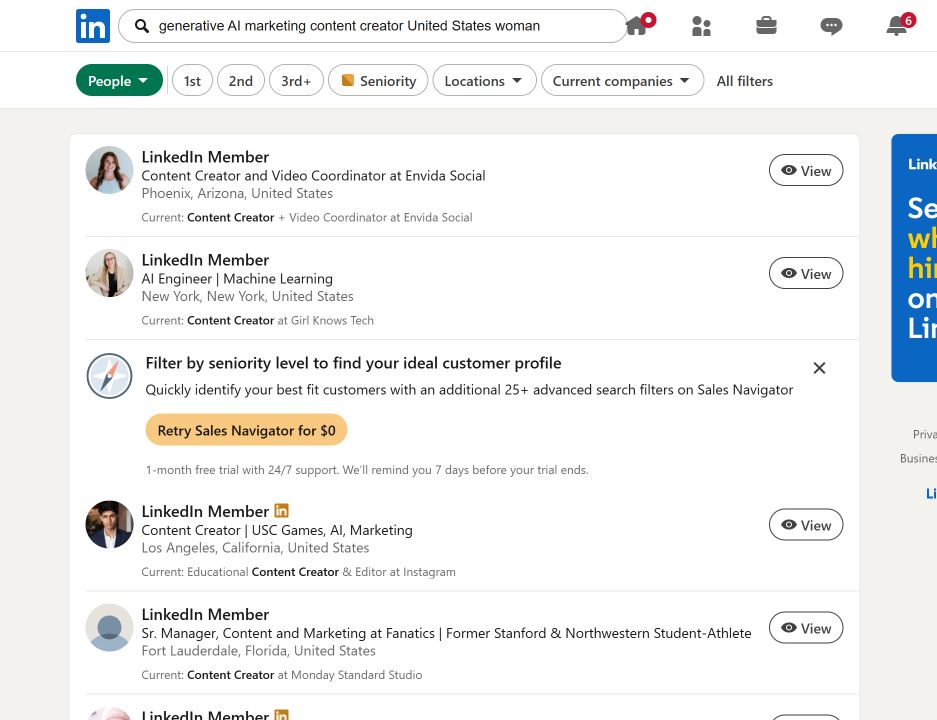

Busqueda 11

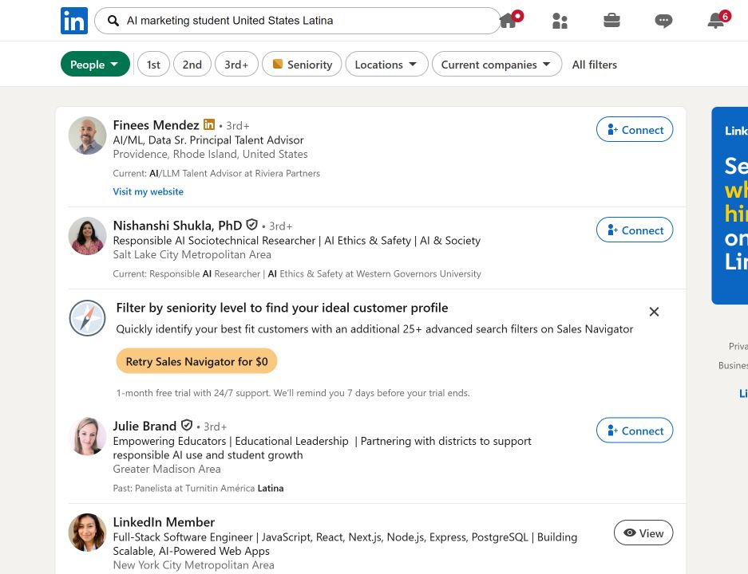

Busqueda 12

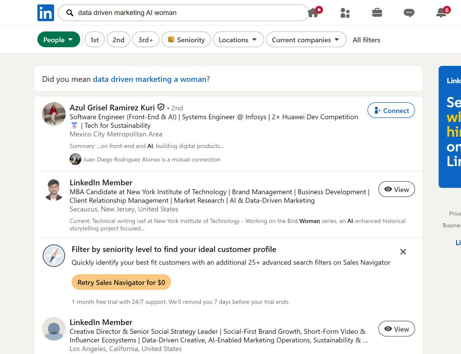

## Lista curada de 50 perfiles

<strong>1. Giovanna Di Giacomo</strong> - Prioridad Alta

- Link: [Abrir perfil de LinkedIn](https://www.linkedin.com/in/giovannadigiacomocomunicaciondigital/)
- Pais / zona visible: Panama
- Senal visible: Senal visible de inteligencia artificial, tecnologia, datos o innovacion aplicada.
- Por que encaja: Encaja con Maria Fernanda porque permite conversar sobre IA aplicada a marketing y procesos creativos, conectando creatividad, estrategia y resultados de negocio.
- Mensaje sugerido: Hola Giovanna, vi tu perfil y me llamo la atencion tu enfoque en IA aplicada a marketing y procesos creativos. Estoy construyendo una red de mujeres interesadas en marketing e inteligencia artificial aplicada, y me encantaria conectar para seguir aprendiendo de tu trabajo.

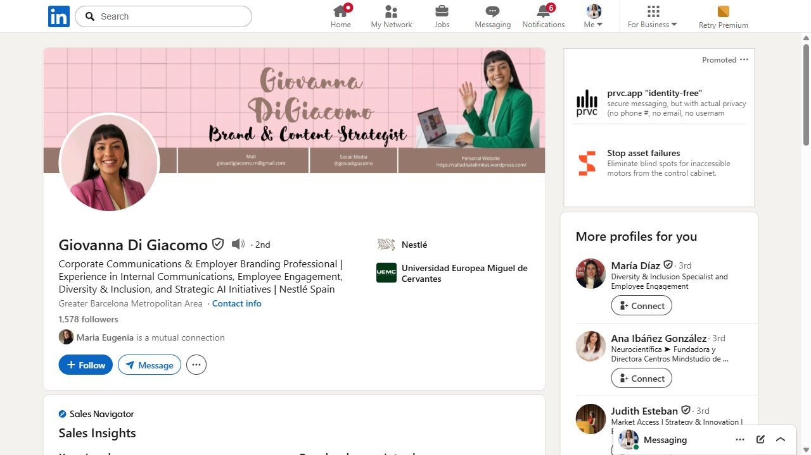

<strong>2. Marie Claire Gonzalez</strong> - Prioridad Alta

- Link: [Abrir perfil de LinkedIn](https://www.linkedin.com/in/marie-claire-gonzalez-649b4963/)
- Pais / zona visible: Panama
- Senal visible: Senal visible de inteligencia artificial, tecnologia, datos o innovacion aplicada.
- Por que encaja: Encaja con Maria Fernanda porque permite conversar sobre IA aplicada a marketing y procesos creativos, conectando creatividad, estrategia y resultados de negocio.
- Mensaje sugerido: Hola Marie, vi tu perfil y me llamo la atencion tu enfoque en IA aplicada a marketing y procesos creativos. Estoy construyendo una red de mujeres interesadas en marketing e inteligencia artificial aplicada, y me encantaria conectar para seguir aprendiendo de tu trabajo.

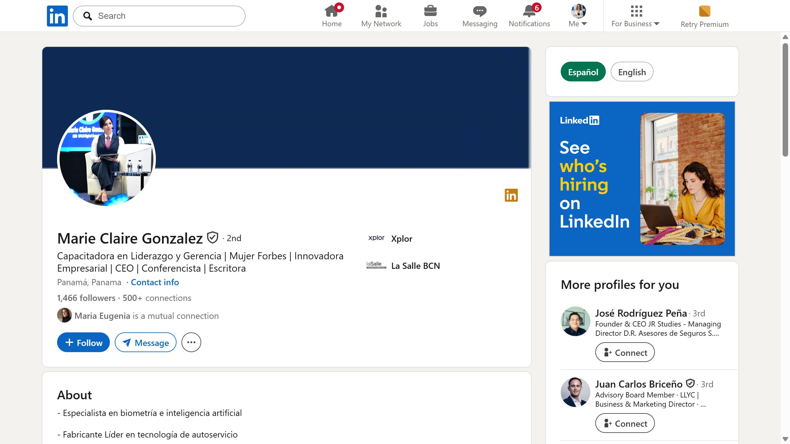

<strong>3. Yamilet Gonzalez</strong> - Prioridad Media

- Link: [Abrir perfil de LinkedIn](https://www.linkedin.com/in/yamilet-gonzalez/)
- Pais / zona visible: Panama
- Senal visible: Senal visible de contenido, comunicacion, storytelling o creacion digital.
- Por que encaja: Encaja con Maria Fernanda porque permite conversar sobre contenido, storytelling y creacion con IA, conectando creatividad, estrategia y resultados de negocio.
- Mensaje sugerido: Hola Yamilet, vi tu perfil y me llamo la atencion tu enfoque en contenido, storytelling y creacion con IA. Estoy construyendo una red de mujeres interesadas en marketing e inteligencia artificial aplicada, y me encantaria conectar para seguir aprendiendo de tu trabajo.

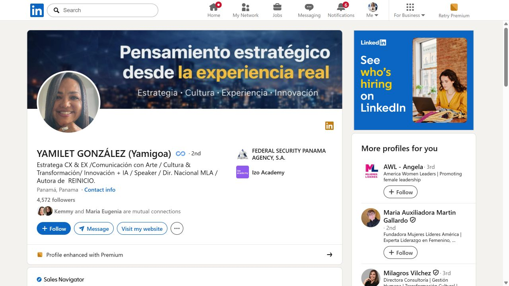

<strong>4. Ines Medina</strong> - Prioridad Alta

- Link: [Abrir perfil de LinkedIn](https://www.linkedin.com/in/in%C3%A9s-medina-linares/)
- Pais / zona visible: Panama
- Senal visible: Senal visible de contenido, comunicacion, storytelling o creacion digital.
- Por que encaja: Encaja con Maria Fernanda porque permite conversar sobre contenido, storytelling y creacion con IA, conectando creatividad, estrategia y resultados de negocio.
- Mensaje sugerido: Hola Ines, vi tu perfil y me llamo la atencion tu enfoque en contenido, storytelling y creacion con IA. Estoy construyendo una red de mujeres interesadas en marketing e inteligencia artificial aplicada, y me encantaria conectar para seguir aprendiendo de tu trabajo.

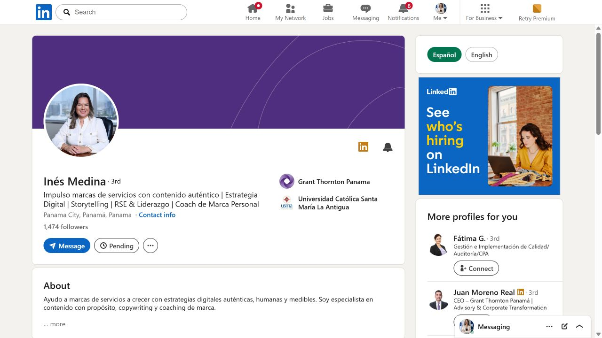

<strong>5. Yuleisi Castillo Pitti</strong> - Prioridad Alta

- Link: [Abrir perfil de LinkedIn](https://www.linkedin.com/in/yuleisi-castillo/)
- Pais / zona visible: Panama
- Senal visible: Senal visible de inteligencia artificial, tecnologia, datos o innovacion aplicada.
- Por que encaja: Encaja con Maria Fernanda porque permite conversar sobre IA aplicada a marketing y procesos creativos, conectando creatividad, estrategia y resultados de negocio.
- Mensaje sugerido: Hola Yuleisi, vi tu perfil y me llamo la atencion tu enfoque en IA aplicada a marketing y procesos creativos. Estoy construyendo una red de mujeres interesadas en marketing e inteligencia artificial aplicada, y me encantaria conectar para seguir aprendiendo de tu trabajo.

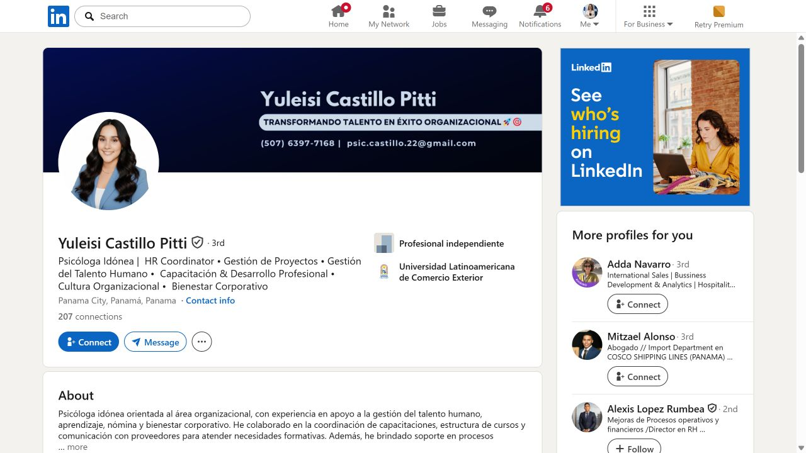

<strong>6. Vanessa Lopez</strong> - Prioridad Alta

- Link: [Abrir perfil de LinkedIn](https://www.linkedin.com/in/vanessa-lopez-93287420/)
- Pais / zona visible: Panama
- Senal visible: Senal visible de inteligencia artificial, tecnologia, datos o innovacion aplicada.
- Por que encaja: Encaja con Maria Fernanda porque permite conversar sobre IA aplicada a marketing y procesos creativos, conectando creatividad, estrategia y resultados de negocio.
- Mensaje sugerido: Hola Vanessa, vi tu perfil y me llamo la atencion tu enfoque en IA aplicada a marketing y procesos creativos. Estoy construyendo una red de mujeres interesadas en marketing e inteligencia artificial aplicada, y me encantaria conectar para seguir aprendiendo de tu trabajo.

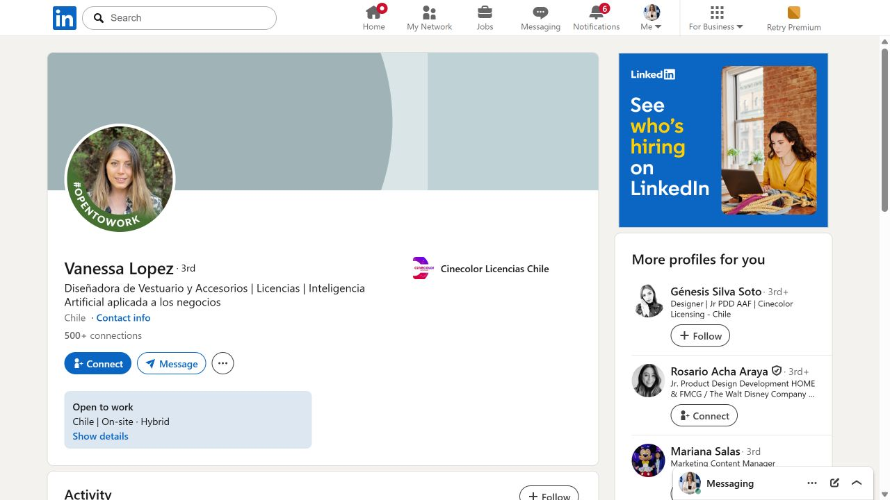

<strong>7. Edanela Cruz</strong> - Prioridad Alta

- Link: [Abrir perfil de LinkedIn](https://www.linkedin.com/in/edanela-cruz-comunicaci%C3%B3n-social/)
- Pais / zona visible: Panama
- Senal visible: Senal visible de contenido, comunicacion, storytelling o creacion digital.
- Por que encaja: Encaja con Maria Fernanda porque permite conversar sobre contenido, storytelling y creacion con IA, conectando creatividad, estrategia y resultados de negocio.
- Mensaje sugerido: Hola Edanela, vi tu perfil y me llamo la atencion tu enfoque en contenido, storytelling y creacion con IA. Estoy construyendo una red de mujeres interesadas en marketing e inteligencia artificial aplicada, y me encantaria conectar para seguir aprendiendo de tu trabajo.

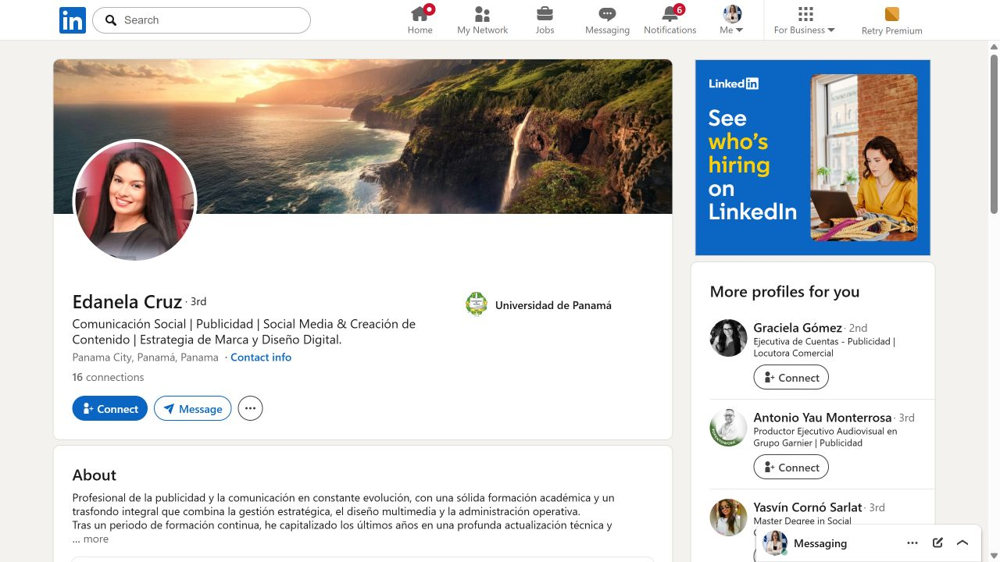

<strong>8. Maya Tmenova</strong> - Prioridad Alta

- Link: [Abrir perfil de LinkedIn](https://www.linkedin.com/in/maya-tmenova/)
- Pais / zona visible: Panama
- Senal visible: Senal visible de inteligencia artificial, tecnologia, datos o innovacion aplicada.
- Por que encaja: Encaja con Maria Fernanda porque permite conversar sobre IA aplicada a marketing y procesos creativos, conectando creatividad, estrategia y resultados de negocio.
- Mensaje sugerido: Hola Maya, vi tu perfil y me llamo la atencion tu enfoque en IA aplicada a marketing y procesos creativos. Estoy construyendo una red de mujeres interesadas en marketing e inteligencia artificial aplicada, y me encantaria conectar para seguir aprendiendo de tu trabajo.

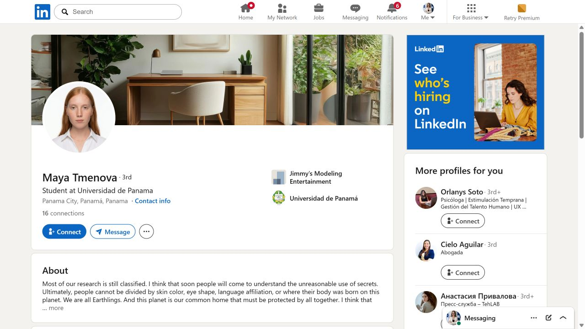

<strong>9. Maria Andrea Torres Morales</strong> - Prioridad Alta

- Link: [Abrir perfil de LinkedIn](https://www.linkedin.com/in/mariaandreatorres/)
- Pais / zona visible: Panama
- Senal visible: Senal visible de contenido, comunicacion, storytelling o creacion digital.
- Por que encaja: Encaja con Maria Fernanda porque permite conversar sobre contenido, storytelling y creacion con IA, conectando creatividad, estrategia y resultados de negocio.
- Mensaje sugerido: Hola Maria, vi tu perfil y me llamo la atencion tu enfoque en contenido, storytelling y creacion con IA. Estoy construyendo una red de mujeres interesadas en marketing e inteligencia artificial aplicada, y me encantaria conectar para seguir aprendiendo de tu trabajo.

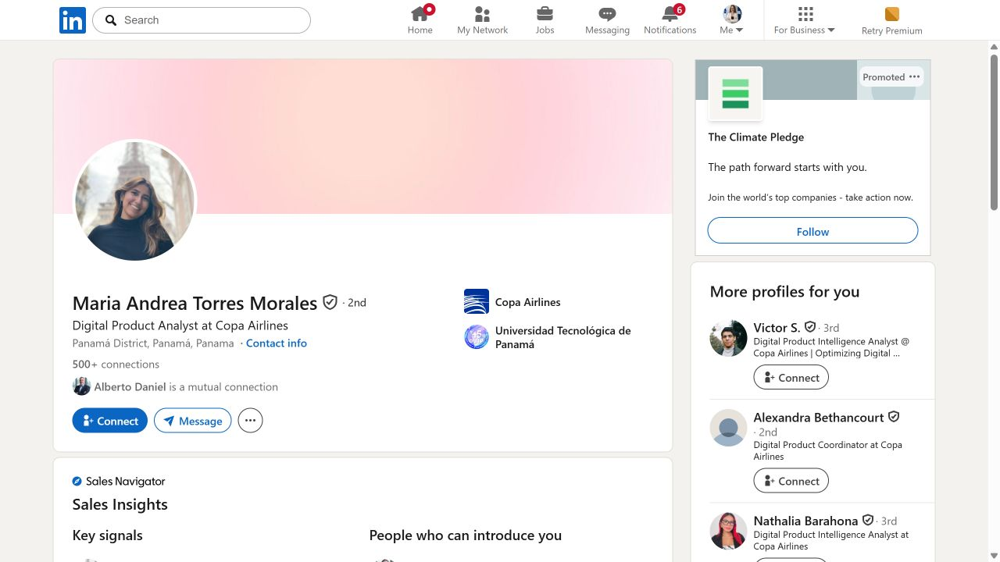

<strong>10. Yelineth C.</strong> - Prioridad Alta

- Link: [Abrir perfil de LinkedIn](https://www.linkedin.com/in/ingyelinethcontreras/)
- Pais / zona visible: Panama
- Senal visible: Senal visible de inteligencia artificial, tecnologia, datos o innovacion aplicada.
- Por que encaja: Encaja con Maria Fernanda porque permite conversar sobre IA aplicada a marketing y procesos creativos, conectando creatividad, estrategia y resultados de negocio.
- Mensaje sugerido: Hola Yelineth, vi tu perfil y me llamo la atencion tu enfoque en IA aplicada a marketing y procesos creativos. Estoy construyendo una red de mujeres interesadas en marketing e inteligencia artificial aplicada, y me encantaria conectar para seguir aprendiendo de tu trabajo.

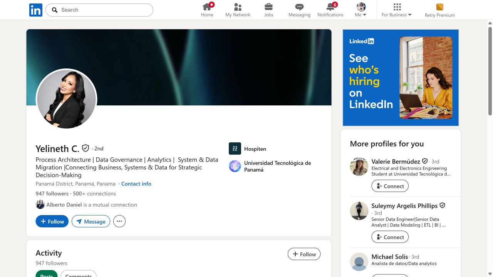

<strong>11. Astrid Chang Vega</strong> - Prioridad Alta

- Link: [Abrir perfil de LinkedIn](https://www.linkedin.com/in/astrid-chang-vega-749321195/)
- Pais / zona visible: Panama
- Senal visible: Senal visible de contenido, comunicacion, storytelling o creacion digital.
- Por que encaja: Encaja con Maria Fernanda porque permite conversar sobre contenido, storytelling y creacion con IA, conectando creatividad, estrategia y resultados de negocio.
- Mensaje sugerido: Hola Astrid, vi tu perfil y me llamo la atencion tu enfoque en contenido, storytelling y creacion con IA. Estoy construyendo una red de mujeres interesadas en marketing e inteligencia artificial aplicada, y me encantaria conectar para seguir aprendiendo de tu trabajo.

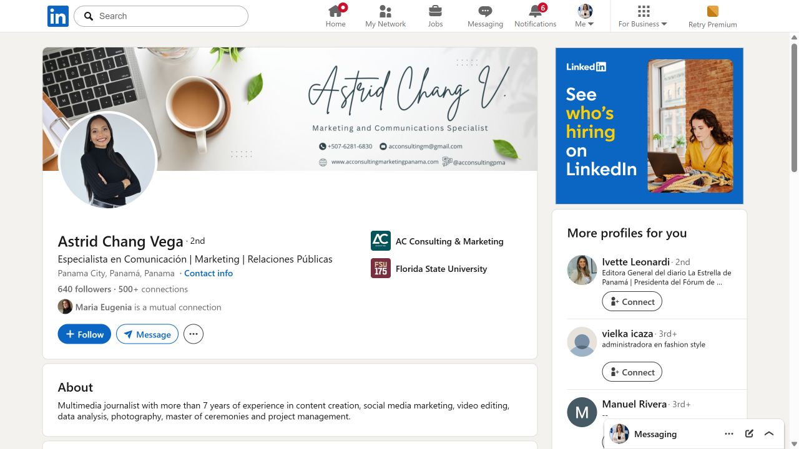

<strong>12. Irma Zambrano</strong> - Prioridad Alta

- Link: [Abrir perfil de LinkedIn](https://www.linkedin.com/in/irmazambrano/)
- Pais / zona visible: Panama
- Senal visible: Senal visible de contenido, comunicacion, storytelling o creacion digital.
- Por que encaja: Encaja con Maria Fernanda porque permite conversar sobre contenido, storytelling y creacion con IA, conectando creatividad, estrategia y resultados de negocio.
- Mensaje sugerido: Hola Irma, vi tu perfil y me llamo la atencion tu enfoque en contenido, storytelling y creacion con IA. Estoy construyendo una red de mujeres interesadas en marketing e inteligencia artificial aplicada, y me encantaria conectar para seguir aprendiendo de tu trabajo.

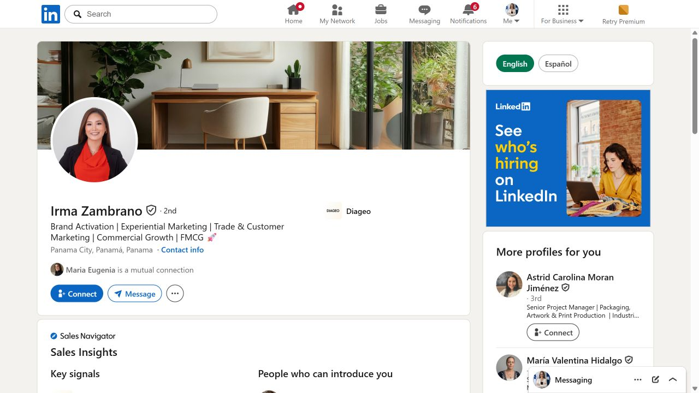

<strong>13. Jenny Pinto</strong> - Prioridad Alta

- Link: [Abrir perfil de LinkedIn](https://www.linkedin.com/in/jenny-pinto/)
- Pais / zona visible: Panama
- Senal visible: Senal visible de contenido, comunicacion, storytelling o creacion digital.
- Por que encaja: Encaja con Maria Fernanda porque permite conversar sobre contenido, storytelling y creacion con IA, conectando creatividad, estrategia y resultados de negocio.
- Mensaje sugerido: Hola Jenny, vi tu perfil y me llamo la atencion tu enfoque en contenido, storytelling y creacion con IA. Estoy construyendo una red de mujeres interesadas en marketing e inteligencia artificial aplicada, y me encantaria conectar para seguir aprendiendo de tu trabajo.

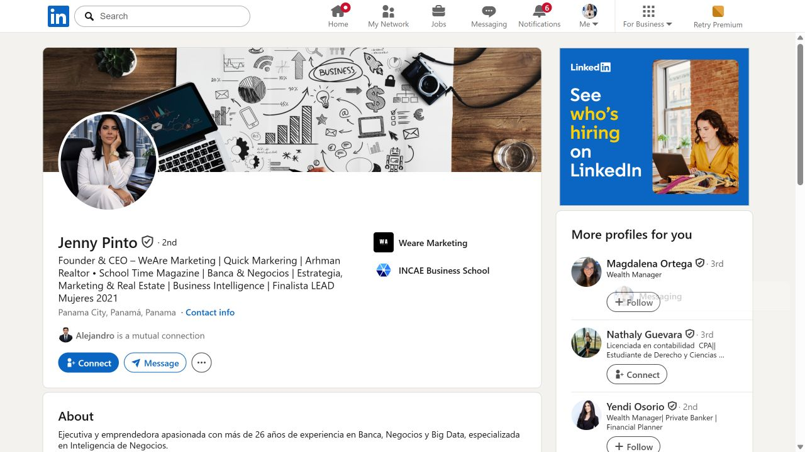

<strong>14. Andrea Castrellon Arjona</strong> - Prioridad Alta

- Link: [Abrir perfil de LinkedIn](https://www.linkedin.com/in/andrea-castrellon/)
- Pais / zona visible: Panama
- Senal visible: Senal visible de contenido, comunicacion, storytelling o creacion digital.
- Por que encaja: Encaja con Maria Fernanda porque permite conversar sobre contenido, storytelling y creacion con IA, conectando creatividad, estrategia y resultados de negocio.
- Mensaje sugerido: Hola Andrea, vi tu perfil y me llamo la atencion tu enfoque en contenido, storytelling y creacion con IA. Estoy construyendo una red de mujeres interesadas en marketing e inteligencia artificial aplicada, y me encantaria conectar para seguir aprendiendo de tu trabajo.

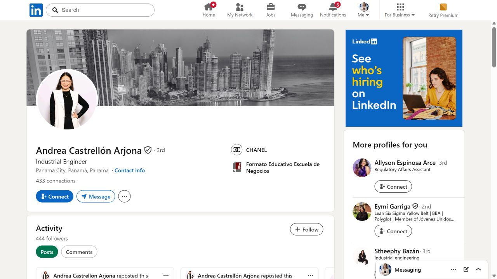

<strong>15. Angelica Del Castillo</strong> - Prioridad Alta

- Link: [Abrir perfil de LinkedIn](https://www.linkedin.com/in/angelica-del-castillo/)
- Pais / zona visible: Espana
- Senal visible: Senal visible de contenido, comunicacion, storytelling o creacion digital.
- Por que encaja: Encaja con Maria Fernanda porque permite conversar sobre contenido, storytelling y creacion con IA, conectando creatividad, estrategia y resultados de negocio.
- Mensaje sugerido: Hola Angelica, vi tu perfil y me llamo la atencion tu enfoque en contenido, storytelling y creacion con IA. Estoy construyendo una red de mujeres interesadas en marketing e inteligencia artificial aplicada, y me encantaria conectar para seguir aprendiendo de tu trabajo.

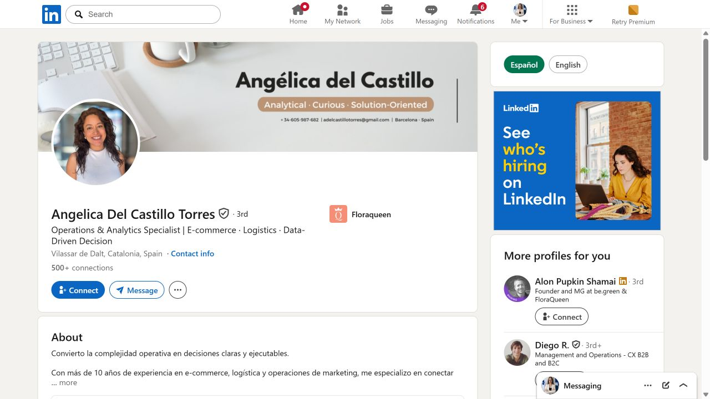

<strong>16. Gabriela V. Saipe C.</strong> - Prioridad Alta

- Link: [Abrir perfil de LinkedIn](https://www.linkedin.com/in/gabrielasaipe/)
- Pais / zona visible: Panama
- Senal visible: Senal visible de contenido, comunicacion, storytelling o creacion digital.
- Por que encaja: Encaja con Maria Fernanda porque permite conversar sobre contenido, storytelling y creacion con IA, conectando creatividad, estrategia y resultados de negocio.
- Mensaje sugerido: Hola Gabriela, vi tu perfil y me llamo la atencion tu enfoque en contenido, storytelling y creacion con IA. Estoy construyendo una red de mujeres interesadas en marketing e inteligencia artificial aplicada, y me encantaria conectar para seguir aprendiendo de tu trabajo.

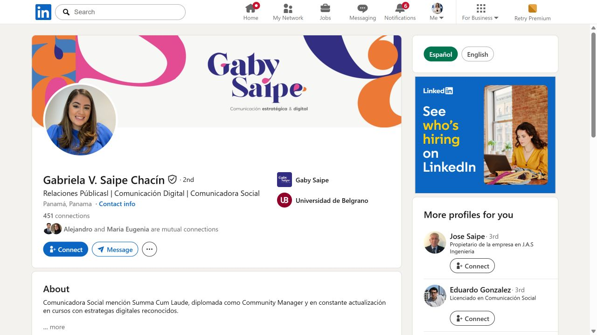

<strong>17. Lerisbeth Gonzalez</strong> - Prioridad Alta

- Link: [Abrir perfil de LinkedIn](https://www.linkedin.com/in/lerisbethgonzalez/)
- Pais / zona visible: Panama
- Senal visible: Senal visible de inteligencia artificial, tecnologia, datos o innovacion aplicada.
- Por que encaja: Encaja con Maria Fernanda porque permite conversar sobre IA aplicada a marketing y procesos creativos, conectando creatividad, estrategia y resultados de negocio.
- Mensaje sugerido: Hola Lerisbeth, vi tu perfil y me llamo la atencion tu enfoque en IA aplicada a marketing y procesos creativos. Estoy construyendo una red de mujeres interesadas en marketing e inteligencia artificial aplicada, y me encantaria conectar para seguir aprendiendo de tu trabajo.

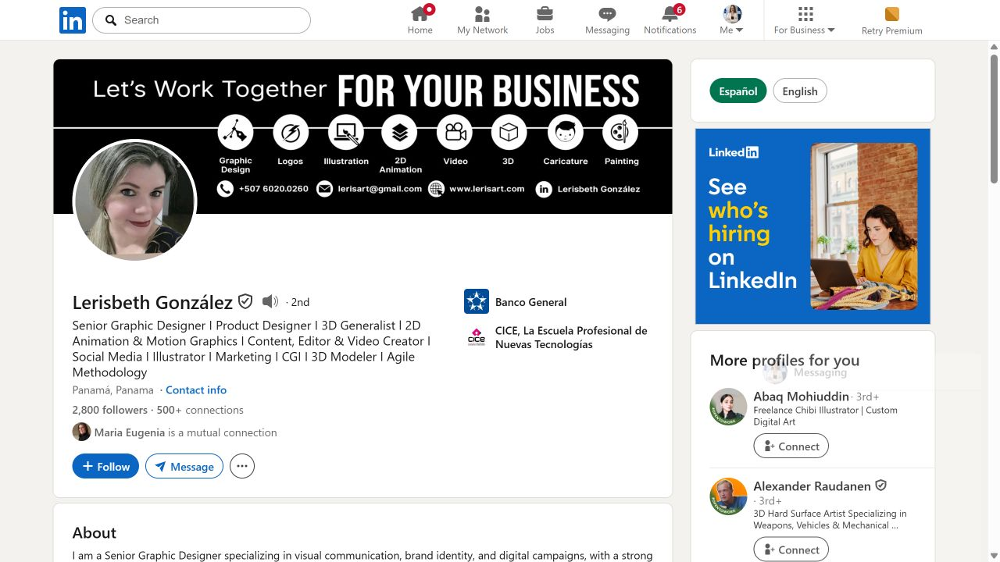

<strong>18. Dinorah Williams de Him</strong> - Prioridad Alta

- Link: [Abrir perfil de LinkedIn](https://www.linkedin.com/in/dinorah-williams-de-him-71868620/)
- Pais / zona visible: Panama
- Senal visible: Senal visible de contenido, comunicacion, storytelling o creacion digital.
- Por que encaja: Encaja con Maria Fernanda porque permite conversar sobre contenido, storytelling y creacion con IA, conectando creatividad, estrategia y resultados de negocio.
- Mensaje sugerido: Hola Dinorah, vi tu perfil y me llamo la atencion tu enfoque en contenido, storytelling y creacion con IA. Estoy construyendo una red de mujeres interesadas en marketing e inteligencia artificial aplicada, y me encantaria conectar para seguir aprendiendo de tu trabajo.

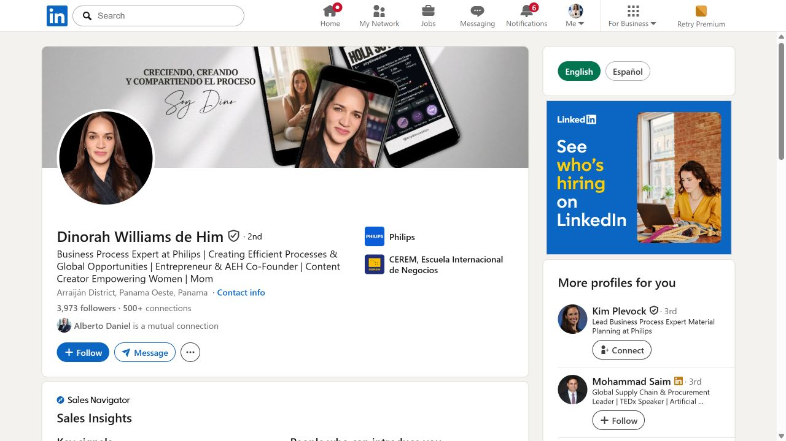

<strong>19. Mery Jane Munoz</strong> - Prioridad Alta

- Link: [Abrir perfil de LinkedIn](https://www.linkedin.com/in/mery-jane-mu%C3%B1oz-1bb4bb293/)
- Pais / zona visible: Panama
- Senal visible: Senal visible de contenido, comunicacion, storytelling o creacion digital.
- Por que encaja: Encaja con Maria Fernanda porque permite conversar sobre contenido, storytelling y creacion con IA, conectando creatividad, estrategia y resultados de negocio.
- Mensaje sugerido: Hola Mery, vi tu perfil y me llamo la atencion tu enfoque en contenido, storytelling y creacion con IA. Estoy construyendo una red de mujeres interesadas en marketing e inteligencia artificial aplicada, y me encantaria conectar para seguir aprendiendo de tu trabajo.

<strong>20. Abigail Castro</strong> - Prioridad Alta

- Link: [Abrir perfil de LinkedIn](https://www.linkedin.com/in/abigailcastroo/)
- Pais / zona visible: Panama
- Senal visible: Senal visible de contenido, comunicacion, storytelling o creacion digital.
- Por que encaja: Encaja con Maria Fernanda porque permite conversar sobre contenido, storytelling y creacion con IA, conectando creatividad, estrategia y resultados de negocio.
- Mensaje sugerido: Hola Abigail, vi tu perfil y me llamo la atencion tu enfoque en contenido, storytelling y creacion con IA. Estoy construyendo una red de mujeres interesadas en marketing e inteligencia artificial aplicada, y me encantaria conectar para seguir aprendiendo de tu trabajo.

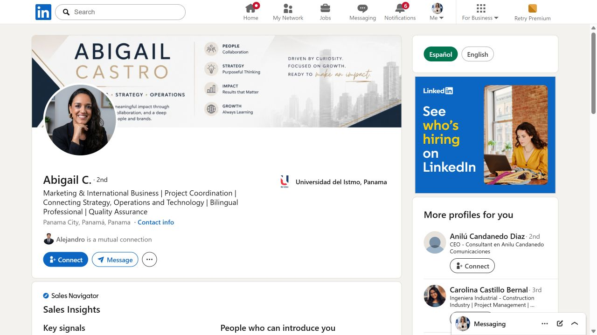

<strong>21. Carolina Arango Madrigal</strong> - Prioridad Alta

- Link: [Abrir perfil de LinkedIn](https://www.linkedin.com/in/carolina-arango-madrigal-103177b7/)
- Pais / zona visible: Panama
- Senal visible: Senal visible de inteligencia artificial, tecnologia, datos o innovacion aplicada.
- Por que encaja: Encaja con Maria Fernanda porque permite conversar sobre IA aplicada a marketing y procesos creativos, conectando creatividad, estrategia y resultados de negocio.
- Mensaje sugerido: Hola Carolina, vi tu perfil y me llamo la atencion tu enfoque en IA aplicada a marketing y procesos creativos. Estoy construyendo una red de mujeres interesadas en marketing e inteligencia artificial aplicada, y me encantaria conectar para seguir aprendiendo de tu trabajo.

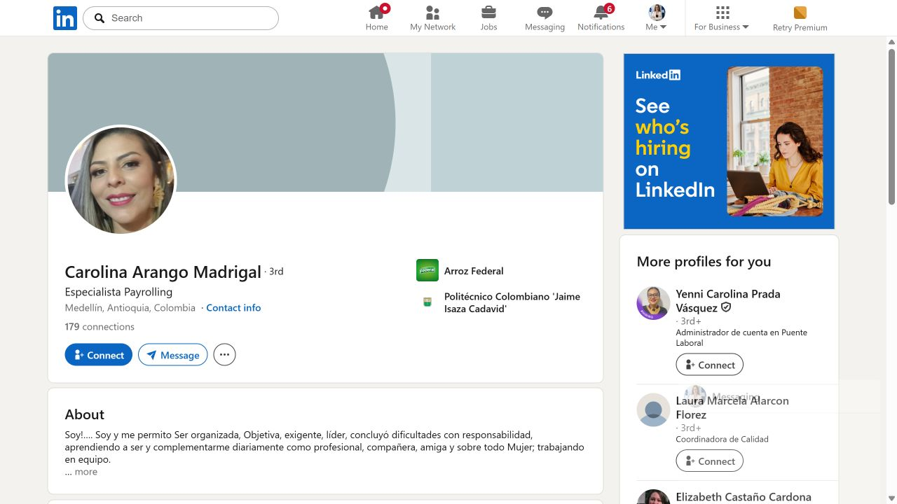

<strong>22. Edimar A. Hermoso Castillo</strong> - Prioridad Media

- Link: [Abrir perfil de LinkedIn](https://www.linkedin.com/in/edimar-a-hermoso-castillo-252b1b24/)
- Pais / zona visible: Panama
- Senal visible: Senal visible de contenido, comunicacion, storytelling o creacion digital.
- Por que encaja: Encaja con Maria Fernanda porque permite conversar sobre contenido, storytelling y creacion con IA, conectando creatividad, estrategia y resultados de negocio.
- Mensaje sugerido: Hola Edimar, vi tu perfil y me llamo la atencion tu enfoque en contenido, storytelling y creacion con IA. Estoy construyendo una red de mujeres interesadas en marketing e inteligencia artificial aplicada, y me encantaria conectar para seguir aprendiendo de tu trabajo.

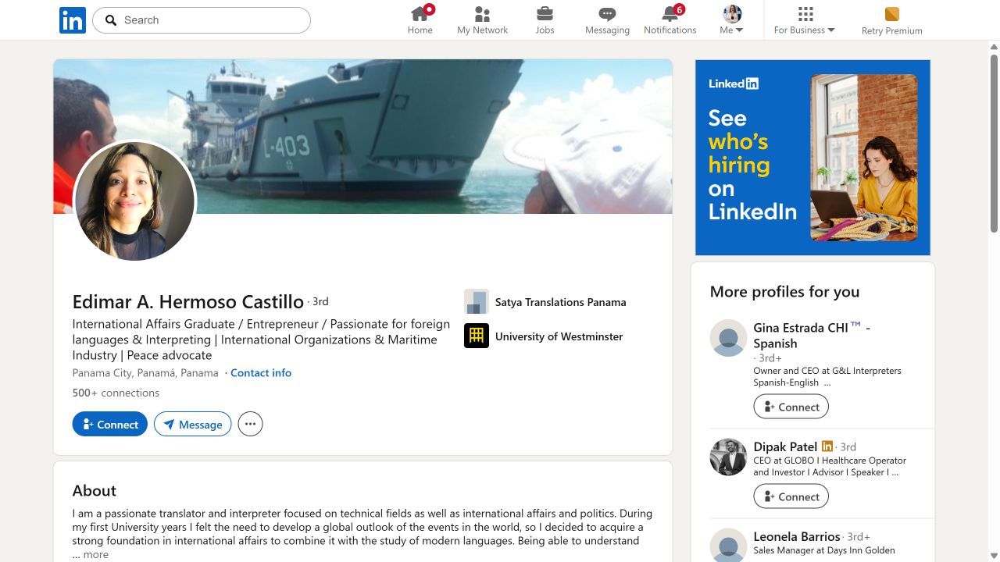

<strong>23. Julieth Soler</strong> - Prioridad Alta

- Link: [Abrir perfil de LinkedIn](https://www.linkedin.com/in/julieth-soler-marketing-digital/)
- Pais / zona visible: No visible / revisar en perfil
- Senal visible: Senal visible de contenido, comunicacion, storytelling o creacion digital.
- Por que encaja: Encaja con Maria Fernanda porque permite conversar sobre contenido, storytelling y creacion con IA, conectando creatividad, estrategia y resultados de negocio.
- Mensaje sugerido: Hola Julieth, vi tu perfil y me llamo la atencion tu enfoque en contenido, storytelling y creacion con IA. Estoy construyendo una red de mujeres interesadas en marketing e inteligencia artificial aplicada, y me encantaria conectar para seguir aprendiendo de tu trabajo.

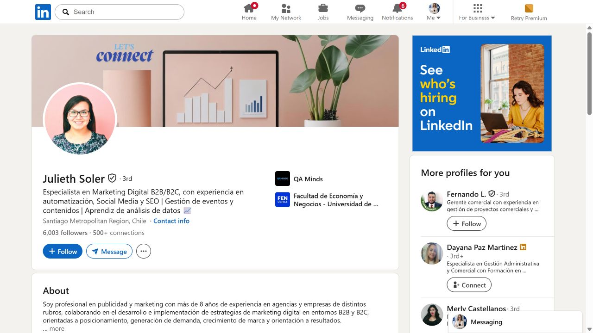

<strong>24. Karla Lizbeth Schuchard</strong> - Prioridad Alta

- Link: [Abrir perfil de LinkedIn](https://www.linkedin.com/in/karlaschucharddirectorcomercialygeneral/)
- Pais / zona visible: Espana
- Senal visible: Senal visible de contenido, comunicacion, storytelling o creacion digital.
- Por que encaja: Encaja con Maria Fernanda porque permite conversar sobre contenido, storytelling y creacion con IA, conectando creatividad, estrategia y resultados de negocio.
- Mensaje sugerido: Hola Karla, vi tu perfil y me llamo la atencion tu enfoque en contenido, storytelling y creacion con IA. Estoy construyendo una red de mujeres interesadas en marketing e inteligencia artificial aplicada, y me encantaria conectar para seguir aprendiendo de tu trabajo.

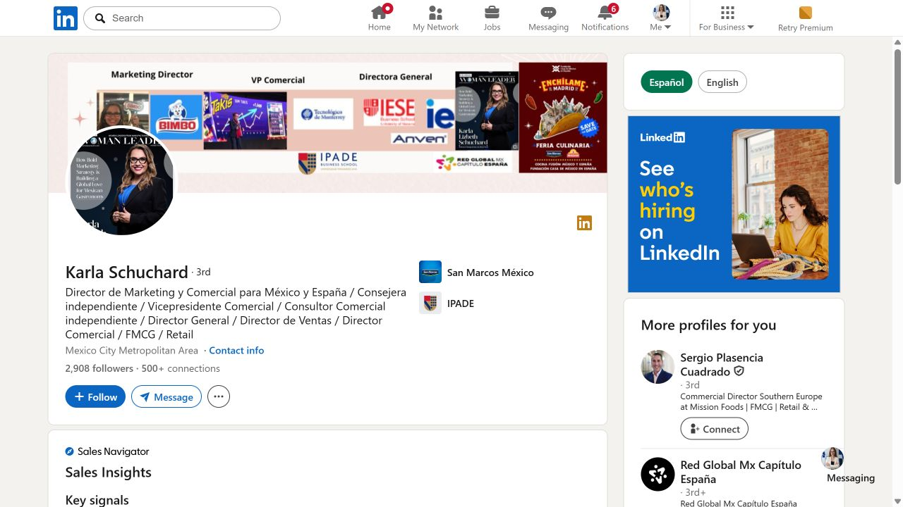

<strong>25. Ainoa Grande</strong> - Prioridad Alta

- Link: [Abrir perfil de LinkedIn](https://www.linkedin.com/in/ainoagrande/)
- Pais / zona visible: Espana
- Senal visible: Senal visible de contenido, comunicacion, storytelling o creacion digital.
- Por que encaja: Encaja con Maria Fernanda porque permite conversar sobre contenido, storytelling y creacion con IA, conectando creatividad, estrategia y resultados de negocio.
- Mensaje sugerido: Hola Ainoa, vi tu perfil y me llamo la atencion tu enfoque en contenido, storytelling y creacion con IA. Estoy construyendo una red de mujeres interesadas en marketing e inteligencia artificial aplicada, y me encantaria conectar para seguir aprendiendo de tu trabajo.

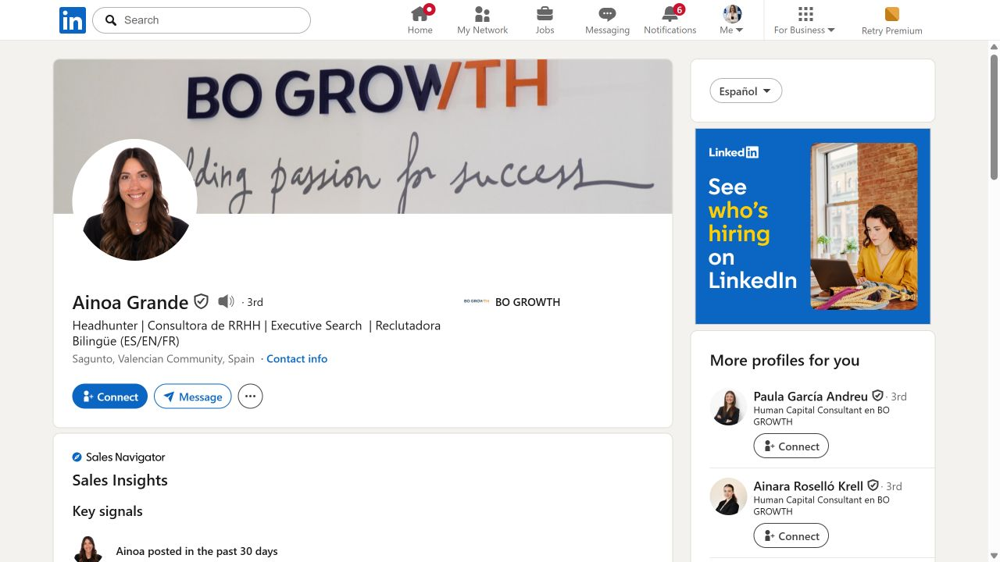

<strong>26. Mariam C. Fernandez Barreiro</strong> - Prioridad Alta

- Link: [Abrir perfil de LinkedIn](https://www.linkedin.com/in/mariamfernandezbarreiro/)
- Pais / zona visible: Espana
- Senal visible: Senal visible de contenido, comunicacion, storytelling o creacion digital.
- Por que encaja: Encaja con Maria Fernanda porque permite conversar sobre contenido, storytelling y creacion con IA, conectando creatividad, estrategia y resultados de negocio.
- Mensaje sugerido: Hola Mariam, vi tu perfil y me llamo la atencion tu enfoque en contenido, storytelling y creacion con IA. Estoy construyendo una red de mujeres interesadas en marketing e inteligencia artificial aplicada, y me encantaria conectar para seguir aprendiendo de tu trabajo.

<strong>27. Martina Riganti</strong> - Prioridad Alta

- Link: [Abrir perfil de LinkedIn](https://www.linkedin.com/in/martinariganti/)
- Pais / zona visible: No visible / revisar en perfil
- Senal visible: Senal visible de contenido, comunicacion, storytelling o creacion digital.
- Por que encaja: Encaja con Maria Fernanda porque permite conversar sobre contenido, storytelling y creacion con IA, conectando creatividad, estrategia y resultados de negocio.
- Mensaje sugerido: Hola Martina, vi tu perfil y me llamo la atencion tu enfoque en contenido, storytelling y creacion con IA. Estoy construyendo una red de mujeres interesadas en marketing e inteligencia artificial aplicada, y me encantaria conectar para seguir aprendiendo de tu trabajo.

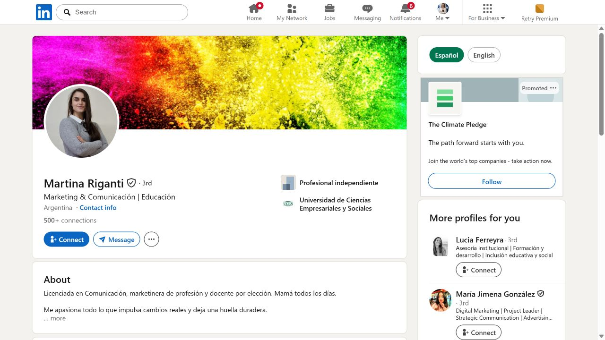

<strong>28. Patricia Lozada</strong> - Prioridad Alta

- Link: [Abrir perfil de LinkedIn](https://www.linkedin.com/in/patricialozadafernandez/)
- Pais / zona visible: No visible / revisar en perfil
- Senal visible: Senal visible de contenido, comunicacion, storytelling o creacion digital.
- Por que encaja: Encaja con Maria Fernanda porque permite conversar sobre contenido, storytelling y creacion con IA, conectando creatividad, estrategia y resultados de negocio.
- Mensaje sugerido: Hola Patricia, vi tu perfil y me llamo la atencion tu enfoque en contenido, storytelling y creacion con IA. Estoy construyendo una red de mujeres interesadas en marketing e inteligencia artificial aplicada, y me encantaria conectar para seguir aprendiendo de tu trabajo.

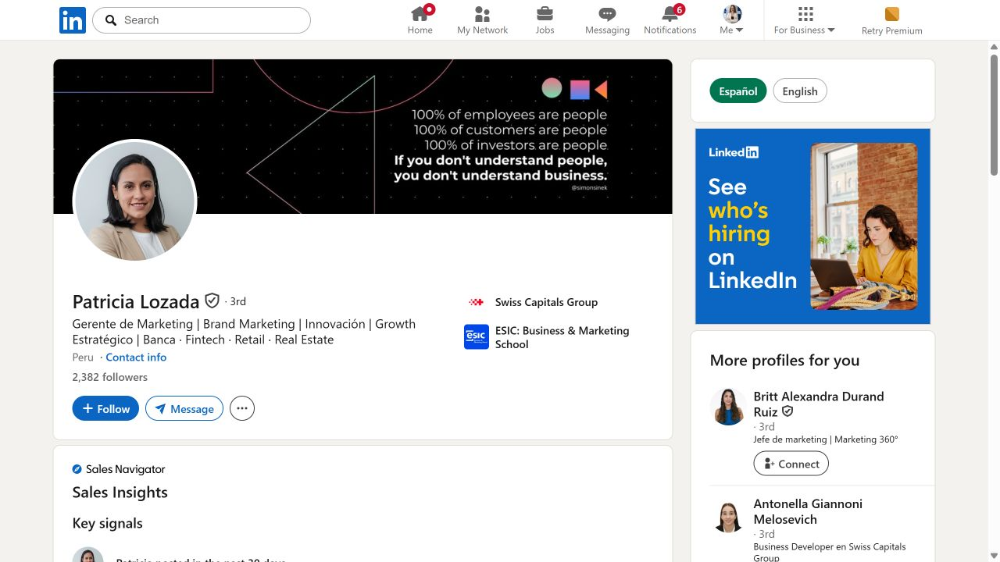

<strong>29. Andrea Marino</strong> - Prioridad Alta

- Link: [Abrir perfil de LinkedIn](https://www.linkedin.com/in/soyandreamarino/)
- Pais / zona visible: No visible / revisar en perfil
- Senal visible: Senal visible de contenido, comunicacion, storytelling o creacion digital.
- Por que encaja: Encaja con Maria Fernanda porque permite conversar sobre contenido, storytelling y creacion con IA, conectando creatividad, estrategia y resultados de negocio.
- Mensaje sugerido: Hola Andrea, vi tu perfil y me llamo la atencion tu enfoque en contenido, storytelling y creacion con IA. Estoy construyendo una red de mujeres interesadas en marketing e inteligencia artificial aplicada, y me encantaria conectar para seguir aprendiendo de tu trabajo.

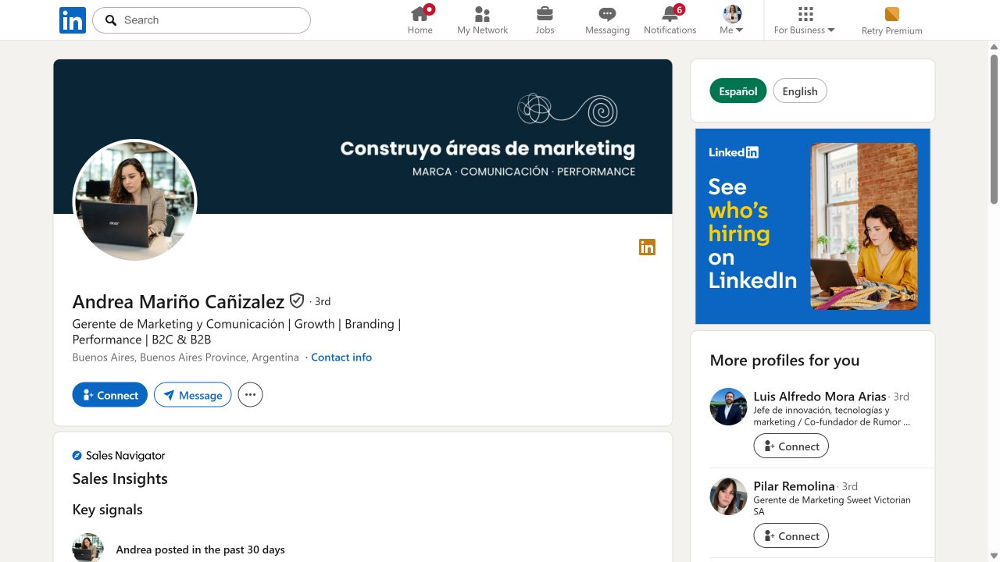

<strong>30. Sandra Moreno Florez</strong> - Prioridad Alta

- Link: [Abrir perfil de LinkedIn](https://www.linkedin.com/in/sandra-moreno-fl%C3%B3rez/)
- Pais / zona visible: Espana
- Senal visible: Senal visible de inteligencia artificial, tecnologia, datos o innovacion aplicada.
- Por que encaja: Encaja con Maria Fernanda porque permite conversar sobre IA aplicada a marketing y procesos creativos, conectando creatividad, estrategia y resultados de negocio.
- Mensaje sugerido: Hola Sandra, vi tu perfil y me llamo la atencion tu enfoque en IA aplicada a marketing y procesos creativos. Estoy construyendo una red de mujeres interesadas en marketing e inteligencia artificial aplicada, y me encantaria conectar para seguir aprendiendo de tu trabajo.

<strong>31. Julia Munoz</strong> - Prioridad Alta

- Link: [Abrir perfil de LinkedIn](https://www.linkedin.com/in/julia-mu%C3%B1oz-carrillo-b164852b5/)
- Pais / zona visible: Espana
- Senal visible: Senal visible de inteligencia artificial, tecnologia, datos o innovacion aplicada.
- Por que encaja: Encaja con Maria Fernanda porque permite conversar sobre IA aplicada a marketing y procesos creativos, conectando creatividad, estrategia y resultados de negocio.
- Mensaje sugerido: Hola Julia, vi tu perfil y me llamo la atencion tu enfoque en IA aplicada a marketing y procesos creativos. Estoy construyendo una red de mujeres interesadas en marketing e inteligencia artificial aplicada, y me encantaria conectar para seguir aprendiendo de tu trabajo.

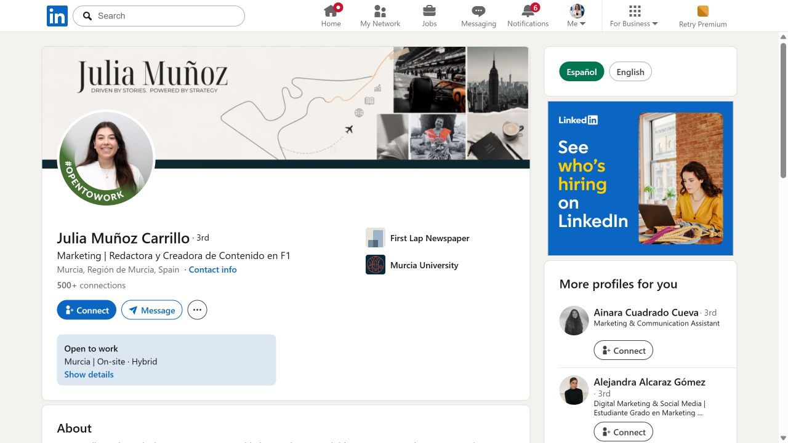

<strong>32. Alexia Jourdan Gassin</strong> - Prioridad Alta

- Link: [Abrir perfil de LinkedIn](https://www.linkedin.com/in/alexiajourdangassin/)
- Pais / zona visible: Panama
- Senal visible: Senal visible de contenido, comunicacion, storytelling o creacion digital.
- Por que encaja: Encaja con Maria Fernanda porque permite conversar sobre contenido, storytelling y creacion con IA, conectando creatividad, estrategia y resultados de negocio.
- Mensaje sugerido: Hola Alexia, vi tu perfil y me llamo la atencion tu enfoque en contenido, storytelling y creacion con IA. Estoy construyendo una red de mujeres interesadas en marketing e inteligencia artificial aplicada, y me encantaria conectar para seguir aprendiendo de tu trabajo.

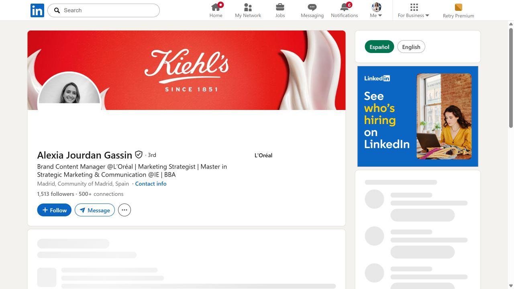

<strong>33. Patricia ChinAFo</strong> - Prioridad Alta

- Link: [Abrir perfil de LinkedIn](https://www.linkedin.com/in/patricia-chinafo-982b56388/)
- Pais / zona visible: Espana
- Senal visible: Senal visible de contenido, comunicacion, storytelling o creacion digital.
- Por que encaja: Encaja con Maria Fernanda porque permite conversar sobre contenido, storytelling y creacion con IA, conectando creatividad, estrategia y resultados de negocio.
- Mensaje sugerido: Hola Patricia, vi tu perfil y me llamo la atencion tu enfoque en contenido, storytelling y creacion con IA. Estoy construyendo una red de mujeres interesadas en marketing e inteligencia artificial aplicada, y me encantaria conectar para seguir aprendiendo de tu trabajo.

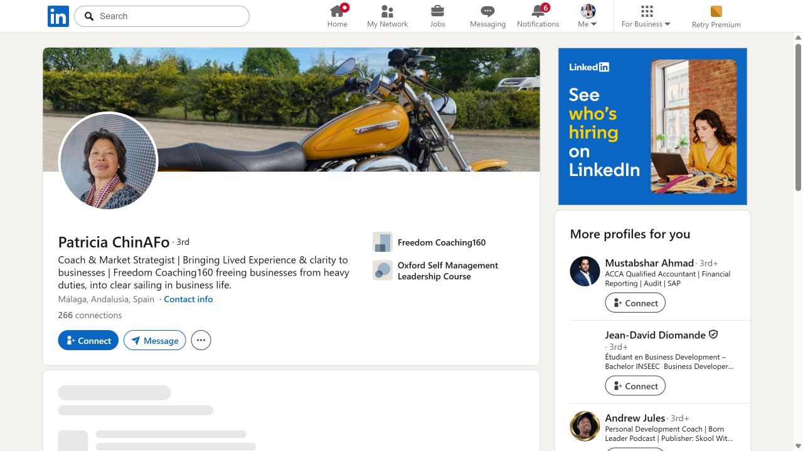

<strong>34. Gunjan Jha</strong> - Prioridad Alta

- Link: [Abrir perfil de LinkedIn](https://www.linkedin.com/in/gunjan-jha-8715713/)
- Pais / zona visible: Estados Unidos
- Senal visible: Senal visible de inteligencia artificial, tecnologia, datos o innovacion aplicada.
- Por que encaja: Encaja con Maria Fernanda porque permite conversar sobre IA aplicada a marketing y procesos creativos, conectando creatividad, estrategia y resultados de negocio.
- Mensaje sugerido: Hola Gunjan, vi tu perfil y me llamo la atencion tu enfoque en IA aplicada a marketing y procesos creativos. Estoy construyendo una red de mujeres interesadas en marketing e inteligencia artificial aplicada, y me encantaria conectar para seguir aprendiendo de tu trabajo.

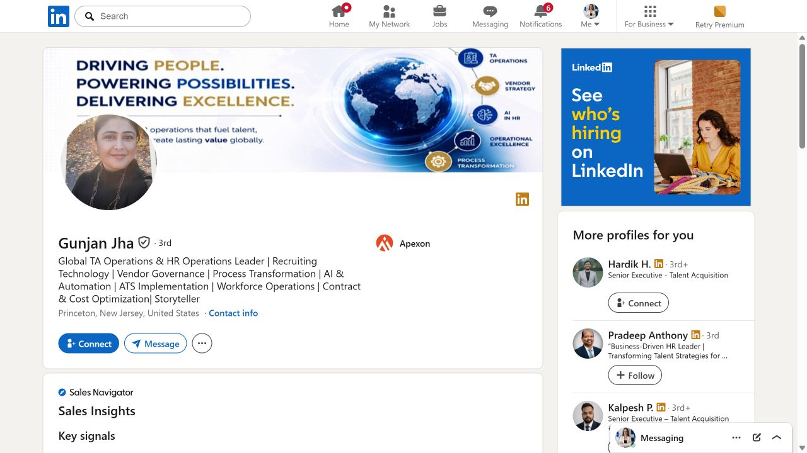

<strong>35. Ayesha Sareen</strong> - Prioridad Alta

- Link: [Abrir perfil de LinkedIn](https://www.linkedin.com/in/ayeshasareen/)
- Pais / zona visible: Estados Unidos
- Senal visible: Senal visible de contenido, comunicacion, storytelling o creacion digital.
- Por que encaja: Encaja con Maria Fernanda porque permite conversar sobre contenido, storytelling y creacion con IA, conectando creatividad, estrategia y resultados de negocio.
- Mensaje sugerido: Hola Ayesha, vi tu perfil y me llamo la atencion tu enfoque en contenido, storytelling y creacion con IA. Estoy construyendo una red de mujeres interesadas en marketing e inteligencia artificial aplicada, y me encantaria conectar para seguir aprendiendo de tu trabajo.

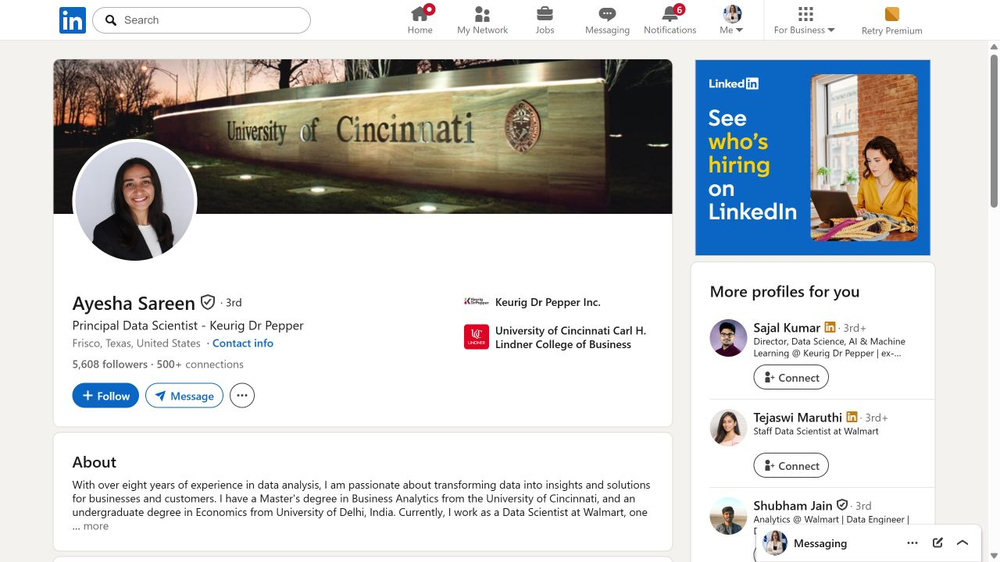

<strong>36. Esther Klang CPACC</strong> - Prioridad Alta

- Link: [Abrir perfil de LinkedIn](https://www.linkedin.com/in/estherklang/)
- Pais / zona visible: Estados Unidos
- Senal visible: Senal visible de contenido, comunicacion, storytelling o creacion digital.
- Por que encaja: Encaja con Maria Fernanda porque permite conversar sobre contenido, storytelling y creacion con IA, conectando creatividad, estrategia y resultados de negocio.
- Mensaje sugerido: Hola Esther, vi tu perfil y me llamo la atencion tu enfoque en contenido, storytelling y creacion con IA. Estoy construyendo una red de mujeres interesadas en marketing e inteligencia artificial aplicada, y me encantaria conectar para seguir aprendiendo de tu trabajo.

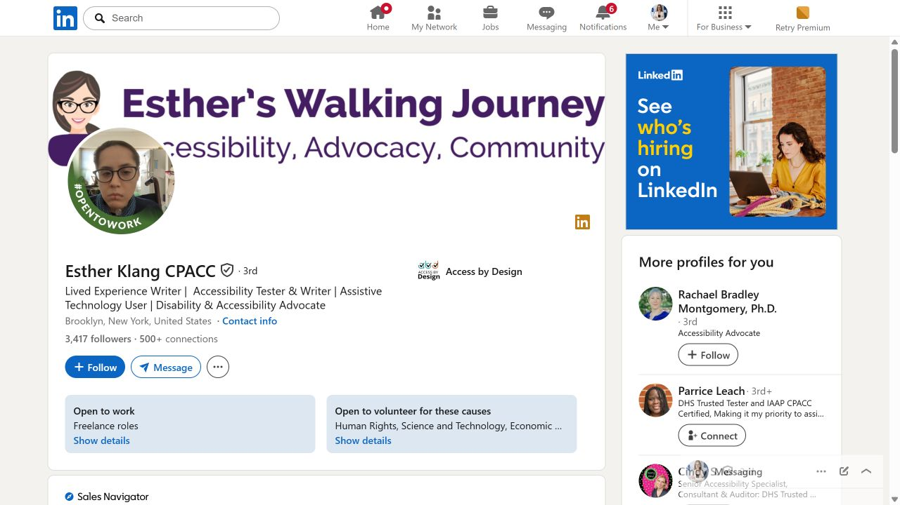

<strong>37. Eliet R.</strong> - Prioridad Media

- Link: [Abrir perfil de LinkedIn](https://www.linkedin.com/in/elietrojas/)
- Pais / zona visible: Estados Unidos
- Senal visible: Senal visible de contenido, comunicacion, storytelling o creacion digital.
- Por que encaja: Encaja con Maria Fernanda porque permite conversar sobre contenido, storytelling y creacion con IA, conectando creatividad, estrategia y resultados de negocio.
- Mensaje sugerido: Hola Eliet, vi tu perfil y me llamo la atencion tu enfoque en contenido, storytelling y creacion con IA. Estoy construyendo una red de mujeres interesadas en marketing e inteligencia artificial aplicada, y me encantaria conectar para seguir aprendiendo de tu trabajo.

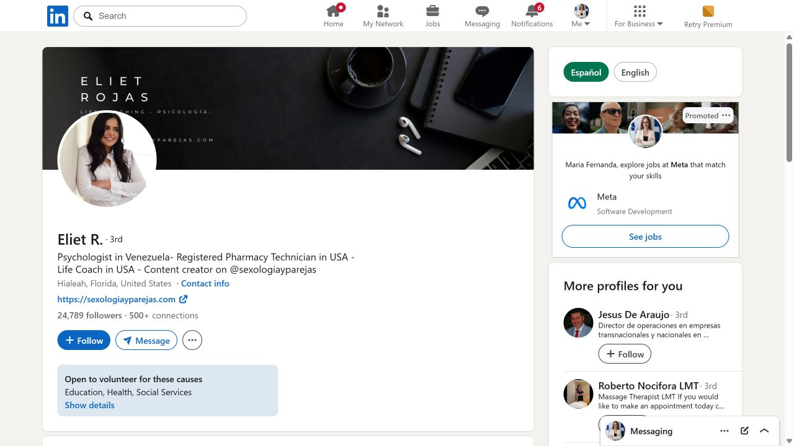

<strong>38. Finees Mendez</strong> - Prioridad Alta

- Link: [Abrir perfil de LinkedIn](https://www.linkedin.com/in/finees/)
- Pais / zona visible: Estados Unidos
- Senal visible: Senal visible de inteligencia artificial, tecnologia, datos o innovacion aplicada.
- Por que encaja: Encaja con Maria Fernanda porque permite conversar sobre IA aplicada a marketing y procesos creativos, conectando creatividad, estrategia y resultados de negocio.
- Mensaje sugerido: Hola Finees, vi tu perfil y me llamo la atencion tu enfoque en IA aplicada a marketing y procesos creativos. Estoy construyendo una red de mujeres interesadas en marketing e inteligencia artificial aplicada, y me encantaria conectar para seguir aprendiendo de tu trabajo.

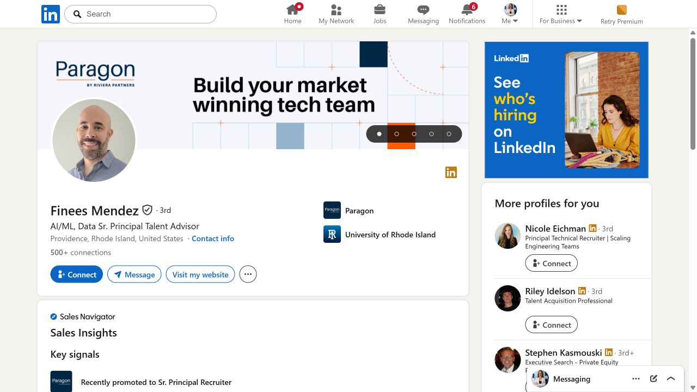

<strong>39. Nishanshi Shukla, PhD</strong> - Prioridad Alta

- Link: [Abrir perfil de LinkedIn](https://www.linkedin.com/in/nishanshi-shukla/)
- Pais / zona visible: No visible / revisar en perfil
- Senal visible: Senal visible de inteligencia artificial, tecnologia, datos o innovacion aplicada.
- Por que encaja: Encaja con Maria Fernanda porque permite conversar sobre IA aplicada a marketing y procesos creativos, conectando creatividad, estrategia y resultados de negocio.
- Mensaje sugerido: Hola Nishanshi, vi tu perfil y me llamo la atencion tu enfoque en IA aplicada a marketing y procesos creativos. Estoy construyendo una red de mujeres interesadas en marketing e inteligencia artificial aplicada, y me encantaria conectar para seguir aprendiendo de tu trabajo.

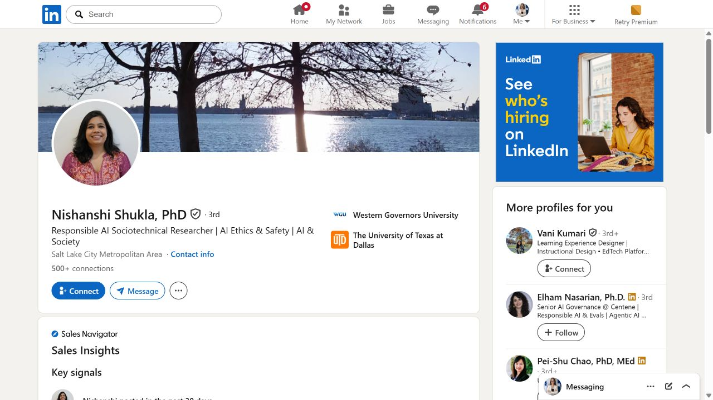

<strong>40. Julie Brand</strong> - Prioridad Alta

- Link: [Abrir perfil de LinkedIn](https://www.linkedin.com/in/juliembrand/)
- Pais / zona visible: No visible / revisar en perfil
- Senal visible: Senal visible de inteligencia artificial, tecnologia, datos o innovacion aplicada.
- Por que encaja: Encaja con Maria Fernanda porque permite conversar sobre IA aplicada a marketing y procesos creativos, conectando creatividad, estrategia y resultados de negocio.
- Mensaje sugerido: Hola Julie, vi tu perfil y me llamo la atencion tu enfoque en IA aplicada a marketing y procesos creativos. Estoy construyendo una red de mujeres interesadas en marketing e inteligencia artificial aplicada, y me encantaria conectar para seguir aprendiendo de tu trabajo.

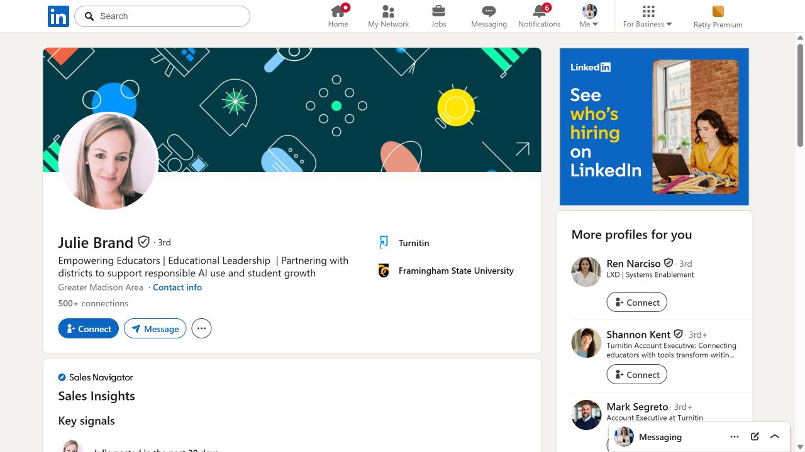

<strong>41. Claudia Freed - CEO</strong> - Prioridad Alta

- Link: [Abrir perfil de LinkedIn](https://www.linkedin.com/in/claudiafreed/)
- Pais / zona visible: No visible / revisar en perfil
- Senal visible: Senal visible de inteligencia artificial, tecnologia, datos o innovacion aplicada.
- Por que encaja: Encaja con Maria Fernanda porque permite conversar sobre IA aplicada a marketing y procesos creativos, conectando creatividad, estrategia y resultados de negocio.
- Mensaje sugerido: Hola Claudia, vi tu perfil y me llamo la atencion tu enfoque en IA aplicada a marketing y procesos creativos. Estoy construyendo una red de mujeres interesadas en marketing e inteligencia artificial aplicada, y me encantaria conectar para seguir aprendiendo de tu trabajo.

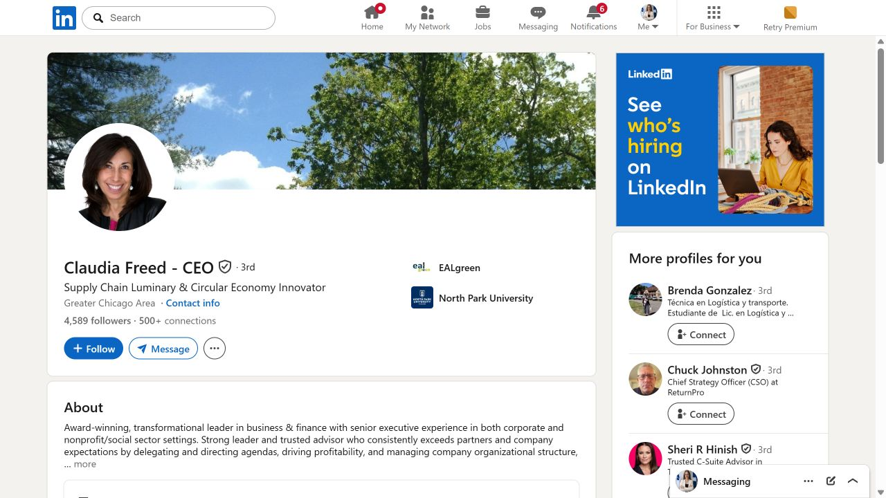

<strong>42. Frances Coronel</strong> - Prioridad Media

- Link: [Abrir perfil de LinkedIn](https://www.linkedin.com/in/francescoronel/)
- Pais / zona visible: Estados Unidos
- Senal visible: Senal visible de inteligencia artificial, tecnologia, datos o innovacion aplicada.
- Por que encaja: Encaja con Maria Fernanda porque permite conversar sobre IA aplicada a marketing y procesos creativos, conectando creatividad, estrategia y resultados de negocio.
- Mensaje sugerido: Hola Frances, vi tu perfil y me llamo la atencion tu enfoque en IA aplicada a marketing y procesos creativos. Estoy construyendo una red de mujeres interesadas en marketing e inteligencia artificial aplicada, y me encantaria conectar para seguir aprendiendo de tu trabajo.

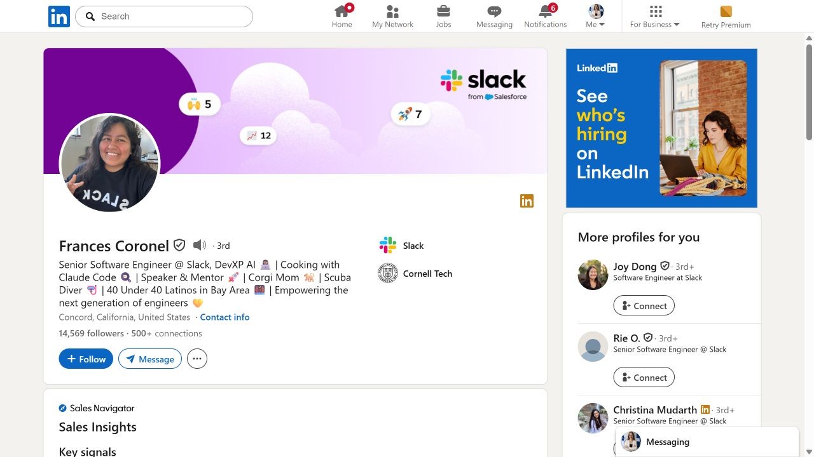

<strong>43. Stephanie Aceves</strong> - Prioridad Media

- Link: [Abrir perfil de LinkedIn](https://www.linkedin.com/in/itsstephaceves/)
- Pais / zona visible: Estados Unidos
- Senal visible: Senal visible de inteligencia artificial, tecnologia, datos o innovacion aplicada.
- Por que encaja: Encaja con Maria Fernanda porque permite conversar sobre IA aplicada a marketing y procesos creativos, conectando creatividad, estrategia y resultados de negocio.
- Mensaje sugerido: Hola Stephanie, vi tu perfil y me llamo la atencion tu enfoque en IA aplicada a marketing y procesos creativos. Estoy construyendo una red de mujeres interesadas en marketing e inteligencia artificial aplicada, y me encantaria conectar para seguir aprendiendo de tu trabajo.

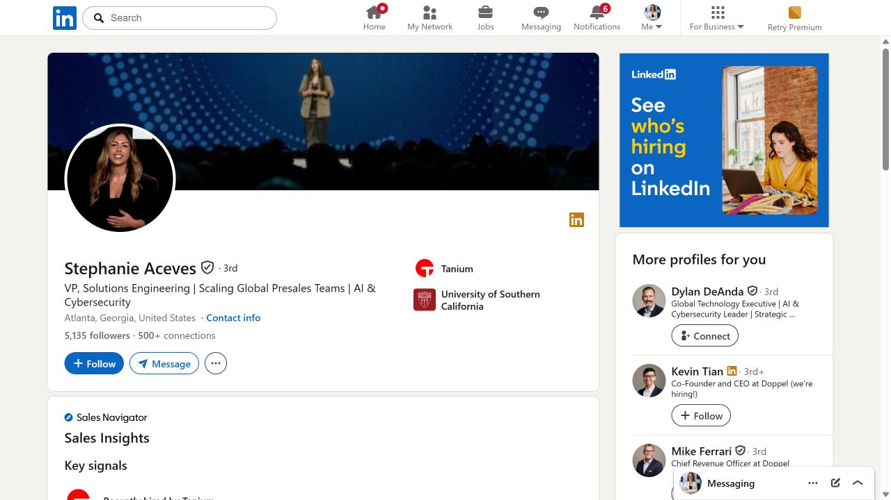

<strong>44. Azul Grisel Ramirez Kuri</strong> - Prioridad Media

- Link: [Abrir perfil de LinkedIn](https://www.linkedin.com/in/azulrk/)
- Pais / zona visible: Estados Unidos
- Senal visible: Senal visible de inteligencia artificial, tecnologia, datos o innovacion aplicada.
- Por que encaja: Encaja con Maria Fernanda porque permite conversar sobre IA aplicada a marketing y procesos creativos, conectando creatividad, estrategia y resultados de negocio.
- Mensaje sugerido: Hola Azul, vi tu perfil y me llamo la atencion tu enfoque en IA aplicada a marketing y procesos creativos. Estoy construyendo una red de mujeres interesadas en marketing e inteligencia artificial aplicada, y me encantaria conectar para seguir aprendiendo de tu trabajo.

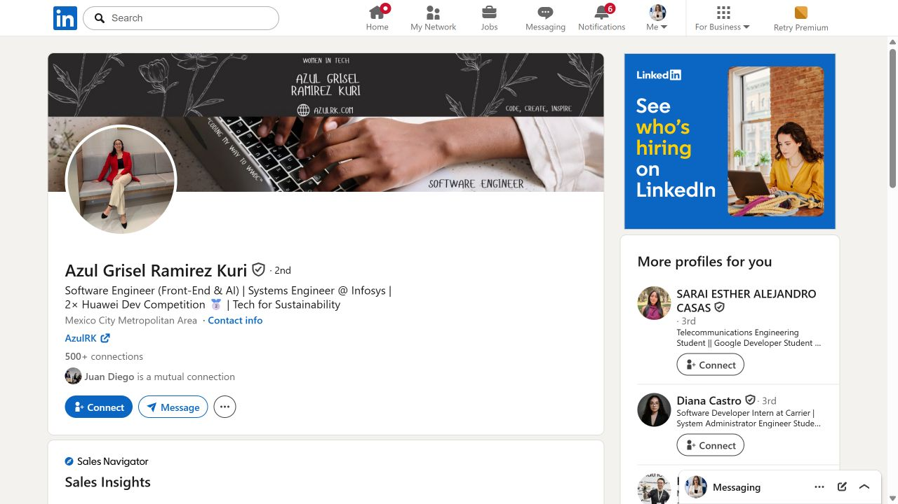

<strong>45. Ana Laura Boyd Sanjur</strong> - Prioridad Alta

- Link: [Abrir perfil de LinkedIn](https://www.linkedin.com/in/ana-laura-boyd-sanjur-452b95330/)
- Pais / zona visible: Panama
- Senal visible: Senal visible de contenido, comunicacion, storytelling o creacion digital.
- Por que encaja: Encaja con Maria Fernanda porque permite conversar sobre contenido, storytelling y creacion con IA, conectando creatividad, estrategia y resultados de negocio.
- Mensaje sugerido: Hola Ana, vi tu perfil y me llamo la atencion tu enfoque en contenido, storytelling y creacion con IA. Estoy construyendo una red de mujeres interesadas en marketing e inteligencia artificial aplicada, y me encantaria conectar para seguir aprendiendo de tu trabajo.

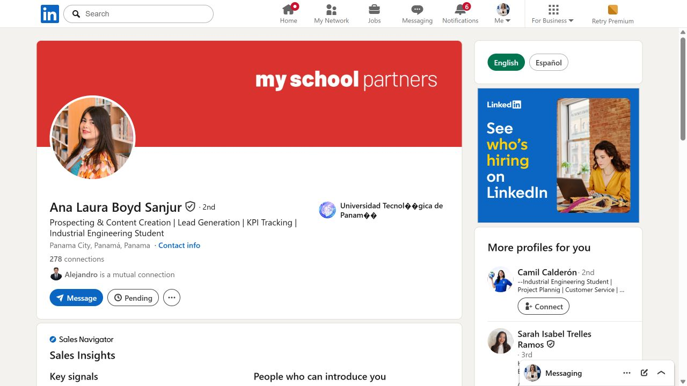

<strong>46. Dianna Najera</strong> - Prioridad Alta

- Link: [Abrir perfil de LinkedIn](https://www.linkedin.com/in/dianna-najera/)
- Pais / zona visible: Panama
- Senal visible: Senal visible de inteligencia artificial, tecnologia, datos o innovacion aplicada.
- Por que encaja: Encaja con Maria Fernanda porque permite conversar sobre IA aplicada a marketing y procesos creativos, conectando creatividad, estrategia y resultados de negocio.
- Mensaje sugerido: Hola Dianna, vi tu perfil y me llamo la atencion tu enfoque en IA aplicada a marketing y procesos creativos. Estoy construyendo una red de mujeres interesadas en marketing e inteligencia artificial aplicada, y me encantaria conectar para seguir aprendiendo de tu trabajo.

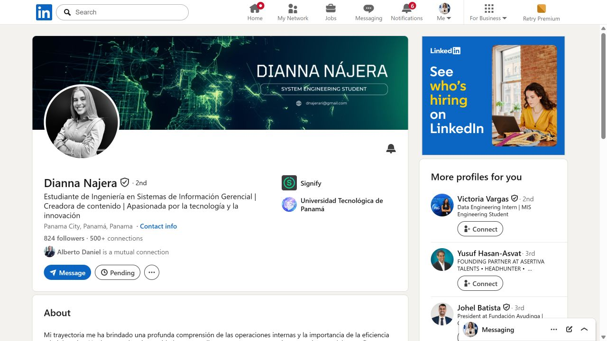

<strong>47. Gabriela Takata</strong> - Prioridad Alta

- Link: [Abrir perfil de LinkedIn](https://www.linkedin.com/in/gabriela-takata/)
- Pais / zona visible: Panama
- Senal visible: Senal visible de contenido, comunicacion, storytelling o creacion digital.
- Por que encaja: Encaja con Maria Fernanda porque permite conversar sobre contenido, storytelling y creacion con IA, conectando creatividad, estrategia y resultados de negocio.
- Mensaje sugerido: Hola Gabriela, vi tu perfil y me llamo la atencion tu enfoque en contenido, storytelling y creacion con IA. Estoy construyendo una red de mujeres interesadas en marketing e inteligencia artificial aplicada, y me encantaria conectar para seguir aprendiendo de tu trabajo.

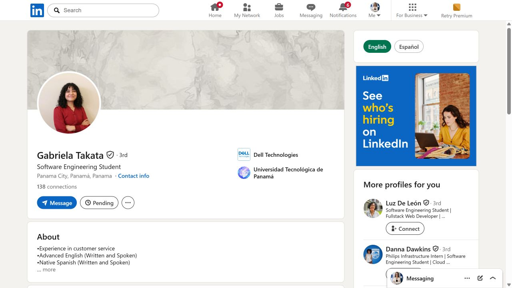

<strong>48. Oriana Gonzalez</strong> - Prioridad Alta

- Link: [Abrir perfil de LinkedIn](https://www.linkedin.com/in/oriana-gonzalez-000064323/)
- Pais / zona visible: Panama
- Senal visible: Senal visible de contenido, comunicacion, storytelling o creacion digital.
- Por que encaja: Encaja con Maria Fernanda porque permite conversar sobre contenido, storytelling y creacion con IA, conectando creatividad, estrategia y resultados de negocio.
- Mensaje sugerido: Hola Oriana, vi tu perfil y me llamo la atencion tu enfoque en contenido, storytelling y creacion con IA. Estoy construyendo una red de mujeres interesadas en marketing e inteligencia artificial aplicada, y me encantaria conectar para seguir aprendiendo de tu trabajo.

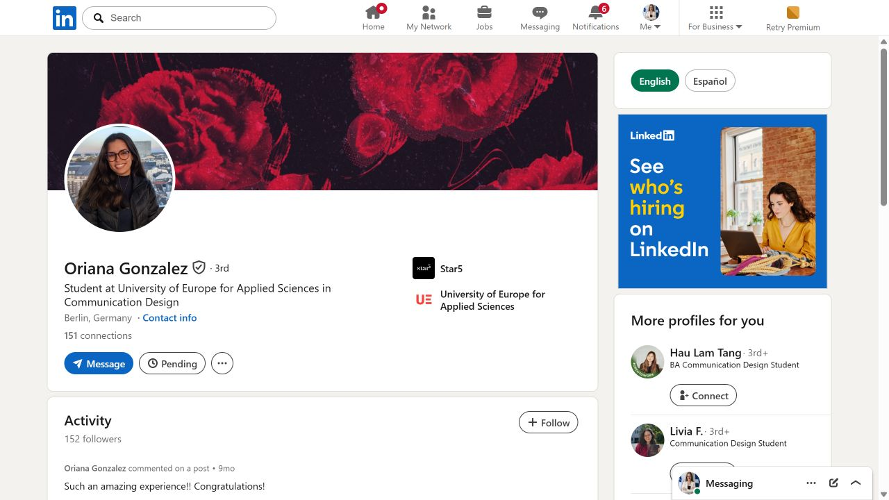

<strong>49. Jennyfer Hernandez</strong> - Prioridad Alta

- Link: [Abrir perfil de LinkedIn](https://www.linkedin.com/in/jennyferhernandezacosta/)
- Pais / zona visible: Panama
- Senal visible: Senal visible de inteligencia artificial, tecnologia, datos o innovacion aplicada.
- Por que encaja: Encaja con Maria Fernanda porque permite conversar sobre IA aplicada a marketing y procesos creativos, conectando creatividad, estrategia y resultados de negocio.
- Mensaje sugerido: Hola Jennyfer, vi tu perfil y me llamo la atencion tu enfoque en IA aplicada a marketing y procesos creativos. Estoy construyendo una red de mujeres interesadas en marketing e inteligencia artificial aplicada, y me encantaria conectar para seguir aprendiendo de tu trabajo.

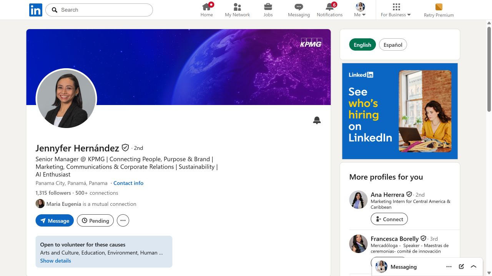

<strong>50. Alice Joanne Gonzalez</strong> - Prioridad Alta

- Link: [Abrir perfil de LinkedIn](https://www.linkedin.com/in/alice-joanne-gonzalez/)
- Pais / zona visible: Panama
- Senal visible: Senal visible de contenido, comunicacion, storytelling o creacion digital.
- Por que encaja: Encaja con Maria Fernanda porque permite conversar sobre contenido, storytelling y creacion con IA, conectando creatividad, estrategia y resultados de negocio.
- Mensaje sugerido: Hola Alice, vi tu perfil y me llamo la atencion tu enfoque en contenido, storytelling y creacion con IA. Estoy construyendo una red de mujeres interesadas en marketing e inteligencia artificial aplicada, y me encantaria conectar para seguir aprendiendo de tu trabajo.

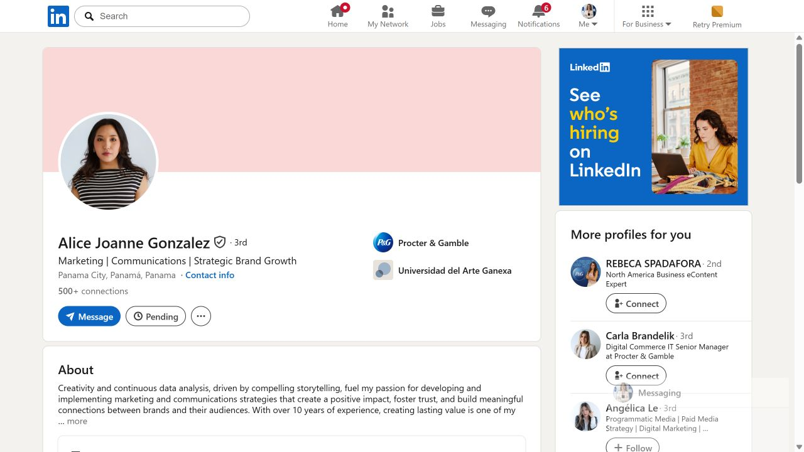

## Recomendacion de uso

Empezaria por los perfiles de prioridad alta que tengan senales claras de contenido, marketing, growth, datos o IA. La estrategia debe ser gradual: revisar el perfil, identificar una senal especifica, conectar con un mensaje corto y luego comentar contenido real si la persona publica.

La meta no es acumular contactos; es construir una red de mujeres cercanas al territorio profesional de Maria Fernanda para aprender, colaborar y abrir conversaciones futuras alrededor de marketing con IA.
