# Shortlist LinkedIn para Maria Fernanda

Investigacion inicial de 10 perfiles relacionados con marketing, comunicacion, contenido, tecnologia e inteligencia artificial aplicada a crecimiento. Se priorizaron mujeres y perfiles de Panama/LATAM. No se enviaron invitaciones ni mensajes.

## Criterio usado

- Encaje con marketing, contenido, marca, comunicaciones, ventas o inteligencia artificial.
- Cercania a Panama o LATAM.
- Potencial para networking organico con Maria Fernanda.
- Valor posible para aprender, colaborar o abrir conversaciones B2B.

## Busquedas usadas como evidencia

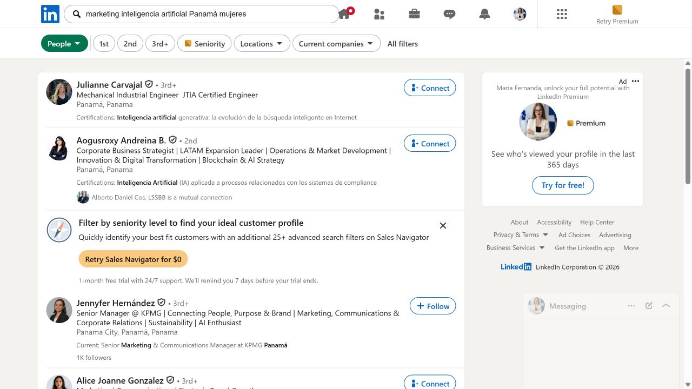

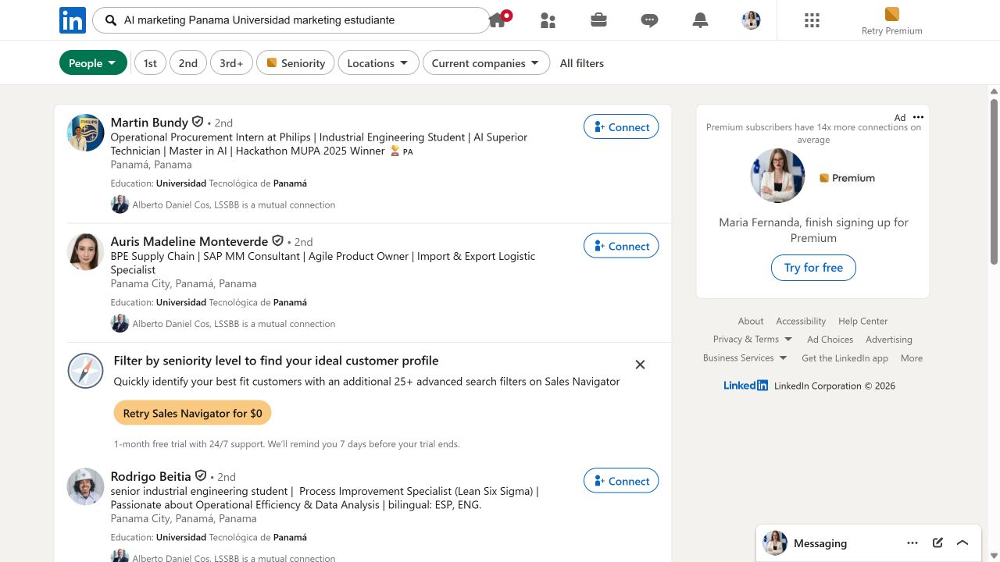

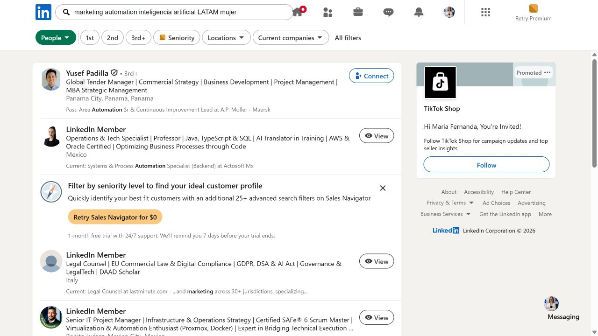

---

<strong>1. Ana Laura Boyd Sanjur</strong>

- Link: [Perfil de LinkedIn](https://www.linkedin.com/in/ana-laura-boyd-sanjur-452b95330/)
- Senal principal: prospecting, content creation, lead generation, KPI tracking e Industrial Engineering Student.
- Por que encaja: es cercana al perfil de Maria Fernanda porque combina contenido, prospeccion y datos. Puede servir para networking joven/profesional en crecimiento B2B.
- Valor para clientes: podria abrir conversaciones sobre generacion de leads, investigacion de mercado y contenido comercial.
- Prioridad: Alta.

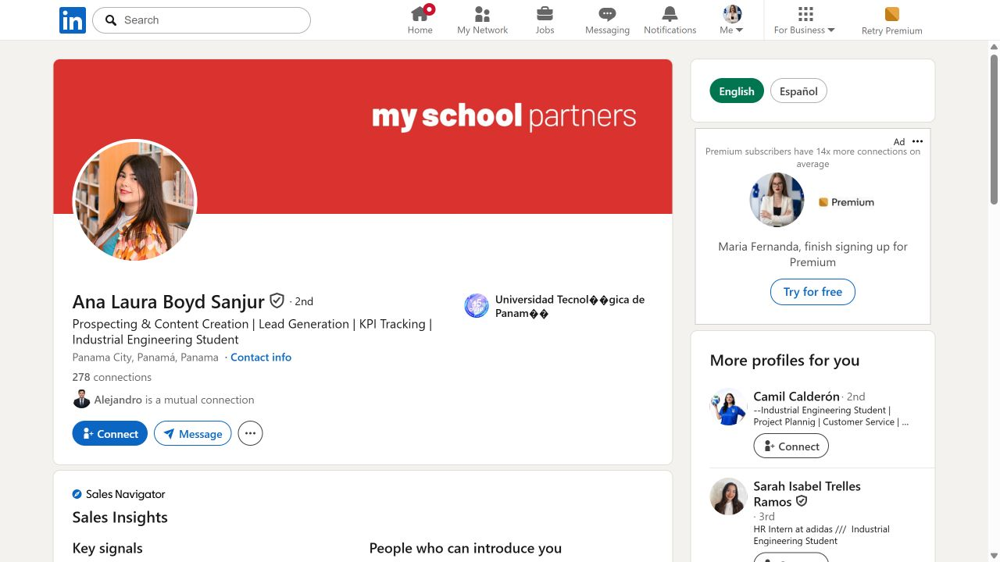

<strong>2. Dianna Najera</strong>

- Link: [Perfil de LinkedIn](https://www.linkedin.com/in/dianna-najera/)
- Senal principal: estudiante de sistemas de informacion gerencial, creadora de contenido, tecnologia e innovacion.
- Por que encaja: une tecnologia, contenido y mentalidad de innovacion. Para Maria Fernanda puede ser una conexion natural porque no suena demasiado ejecutiva ni distante.
- Valor para clientes: puede ayudar a entender como comunicar tecnologia e IA de forma sencilla para audiencias jovenes y empresas.
- Prioridad: Alta.

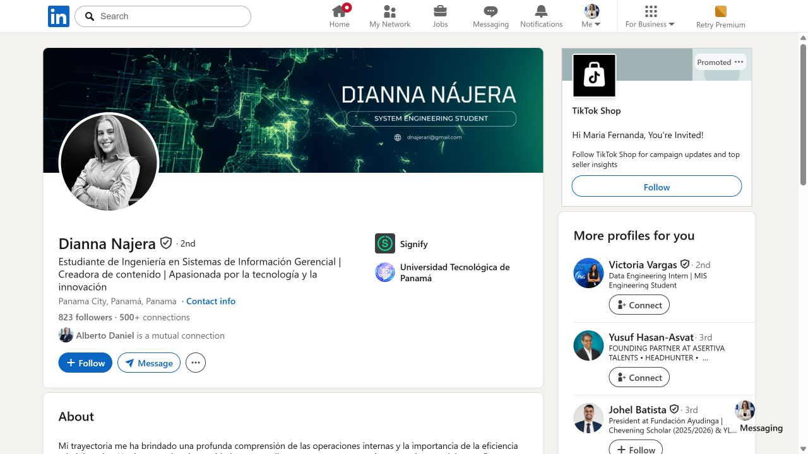

<strong>3. Gabriela Takata</strong>

- Link: [Perfil de LinkedIn](https://www.linkedin.com/in/gabriela-takata/)
- Senal principal: Software Engineering Student, Power BI, SQL, Python, Azure y OCR/Mistral AI.
- Por que encaja: es mas tecnica, pero puede complementar a Maria Fernanda en proyectos de IA aplicada a marketing, datos y automatizacion.
- Valor para clientes: buena candidata para conversaciones sobre dashboards, analitica, IA aplicada y soluciones con datos.
- Prioridad: Media-alta.

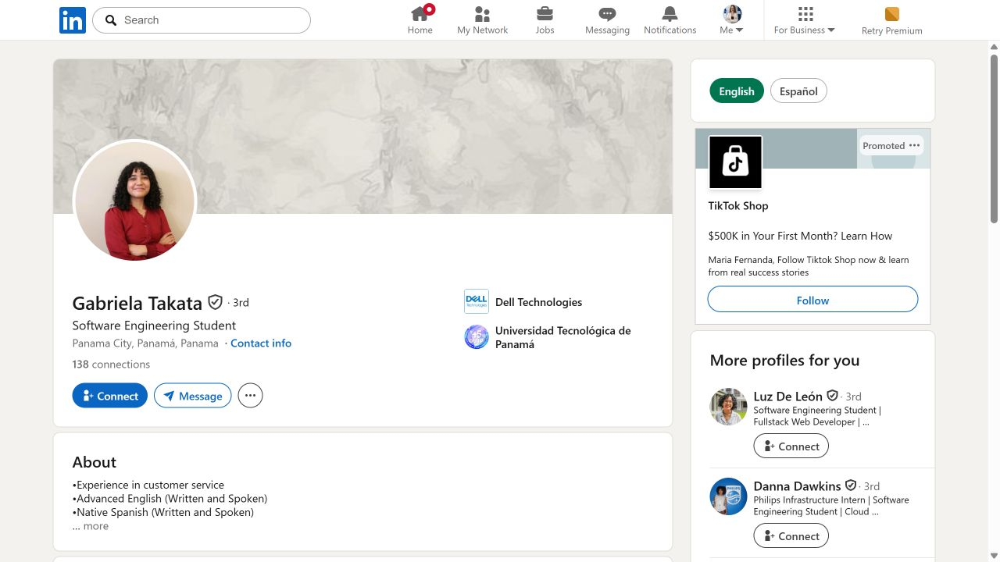

<strong>4. Oriana Gonzalez</strong>

- Link: [Perfil de LinkedIn](https://www.linkedin.com/in/oriana-gonzalez-000064323/)
- Senal principal: estudiante de Communication Design.
- Por que encaja: aporta una linea visual/creativa que puede alimentar la parte de marca, contenido y diseno aplicado a IA.
- Valor para clientes: posible conexion para ideas de branding, piezas visuales y comunicacion de proyectos digitales.
- Prioridad: Media.

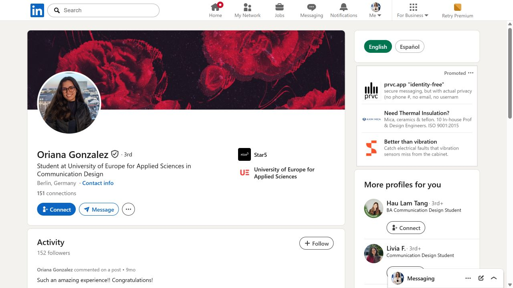

<strong>5. Jennyfer Hernandez</strong>

- Link: [Perfil de LinkedIn](https://www.linkedin.com/in/jennyferhernandezacosta/)
- Senal principal: marketing, comunicaciones, relaciones corporativas, sostenibilidad y AI enthusiast.
- Por que encaja: perfil senior con interes explicito en IA. Puede ser valioso como referente, aunque requiere un mensaje mas cuidado.
- Valor para clientes: abre una mirada corporativa sobre como posicionar IA dentro de marca, reputacion y comunicaciones.
- Prioridad: Alta.

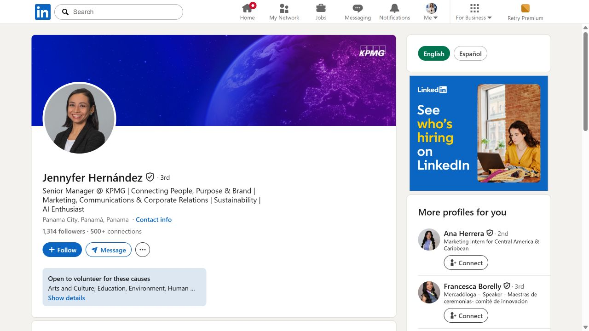

<strong>6. Alice Joanne Gonzalez</strong>

- Link: [Perfil de LinkedIn](https://www.linkedin.com/in/alice-joanne-gonzalez/)
- Senal principal: marketing, communications, strategic brand growth, storytelling y analisis de datos.
- Por que encaja: conecta muy bien con el enfoque de Maria Fernanda: creatividad + analisis + crecimiento de marca.
- Valor para clientes: puede aportar perspectiva sobre estrategia de contenido, campanas y posicionamiento de marcas.
- Prioridad: Alta.

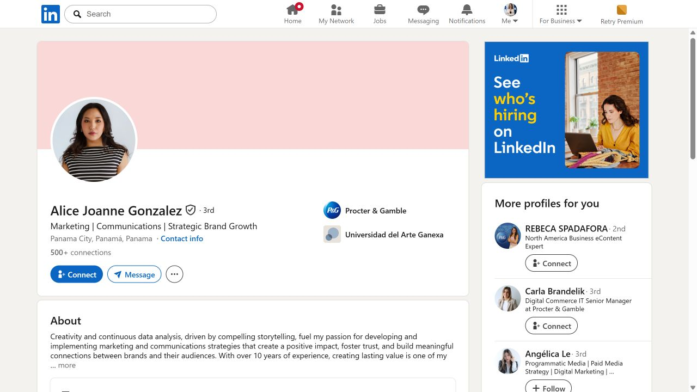

<strong>7. Ines Medina</strong>

- Link: [Perfil de LinkedIn](https://www.linkedin.com/in/in%C3%A9s-medina-linares/)
- Senal principal: estrategia digital, storytelling, marca personal, contenido autentico y servicios.
- Por que encaja: es una referencia directa para construir contenido con autoridad y narrativa humana, muy alineado con Mafe.
- Valor para clientes: buena fuente de ideas para vender servicios de IA sin sonar frio o generico.
- Prioridad: Alta.

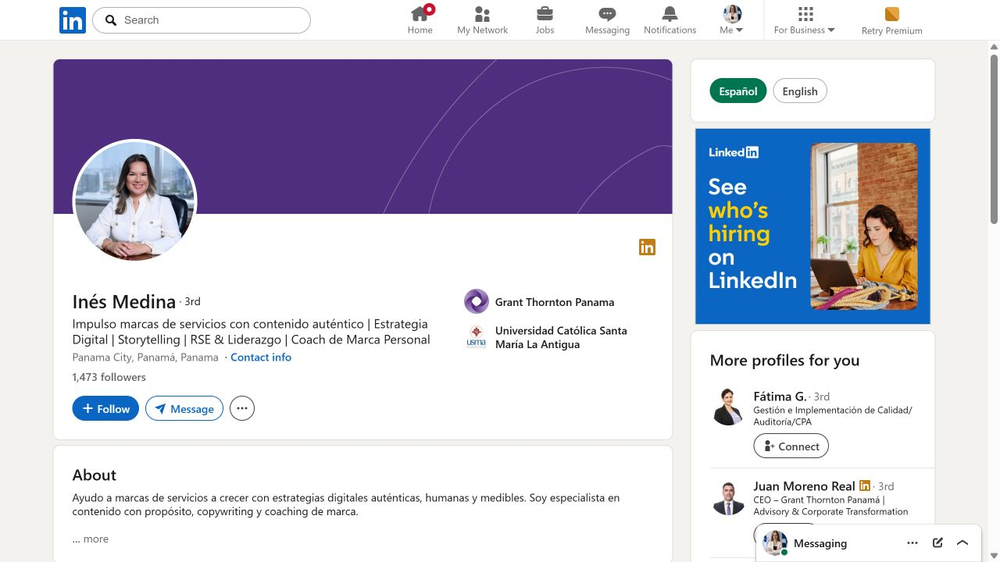

<strong>8. Maria Eugenia Grimaldo Arauz</strong>

- Link: [Perfil de LinkedIn](https://www.linkedin.com/in/maria-eugenia-grimaldo-ara%C3%BAz-908a061/)
- Senal principal: comunicacion institucional, mercadeo, posicionamiento pais y direccion de comunicaciones.
- Por que encaja: perfil de alto valor para entender comunicacion institucional y oportunidades B2B en Panama.
- Valor para clientes: puede abrir perspectiva sobre camaras, empresas, eventos y mensajes de confianza para CodeFlow.
- Prioridad: Media-alta.

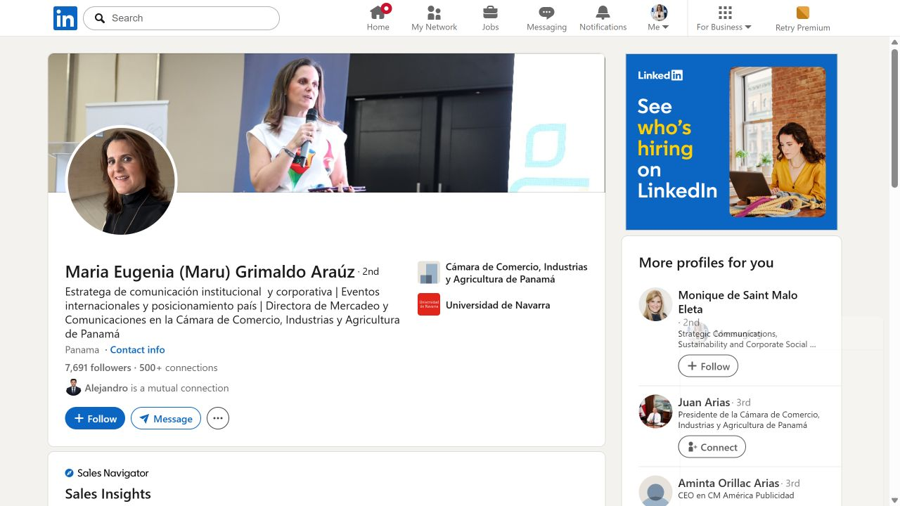

<strong>9. Grace Nip</strong>

- Link: [Perfil de LinkedIn](https://www.linkedin.com/in/grace-nip-b9b261156/)
- Senal principal: proyectos y excelencia operacional; experiencia previa en marketing.
- Por que encaja: aunque no es marketing puro, conecta con procesos, operaciones y mejora continua, que son temas utiles para IA aplicada.
- Valor para clientes: ideal para conversaciones sobre eficiencia operativa, automatizacion y comunicacion de mejoras internas.
- Prioridad: Media.

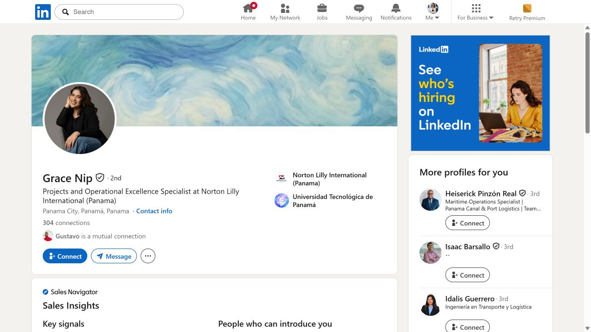

<strong>10. Kemmy Almengor</strong>

- Link: [Perfil de LinkedIn](https://www.linkedin.com/in/kemmy-almengor-a1909bb5/)
- Senal principal: estrategia comercial, marketing, marca, comunicaciones y optimizacion de procesos.
- Por que encaja: perfil ejecutivo, pero extremadamente relevante para CodeFlow y para que Mafe entienda como se habla de marketing con foco en negocio.
- Valor para clientes: referencia fuerte para mensajes B2B sobre crecimiento, reputacion, marca y procesos.
- Prioridad: Alta, pero contacto mas delicado.

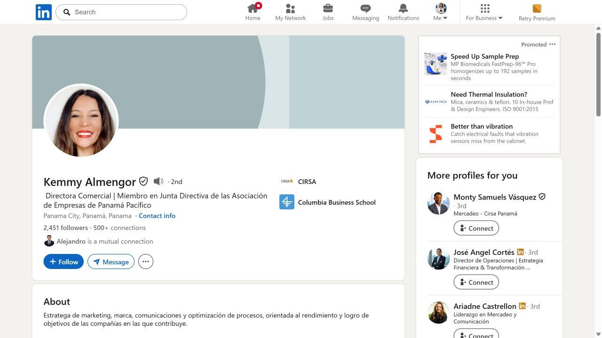

## Lectura rapida

Los perfiles mas naturales para que Maria Fernanda conecte primero son Ana Laura Boyd, Dianna Najera, Alice Joanne Gonzalez e Ines Medina. Tienen una mezcla cercana entre contenido, marketing, tecnologia y marca. Jennyfer Hernandez, Maria Eugenia Grimaldo y Kemmy Almengor son mas senior: convienen como referentes o contactos de alto valor, pero el mensaje debe ser mas especifico y profesional.

## Mensaje base sugerido

Hola, [Nombre]. Estoy construyendo una linea de contenido sobre inteligencia artificial aplicada a marketing, creatividad y crecimiento empresarial. Me llamo mucho la atencion tu experiencia en [tema especifico del perfil]. Me encantaria conectar y seguir aprendiendo de lo que compartes por aqui.

