# Networking LATAM — 10 estudiantes

Esta página reúne las dos tandas de perfiles estudiantiles investigados. Cada persona tiene capturas reales de su perfil y dos publicaciones separadas. No se enviaron comentarios ni invitaciones.

# Networking LATAM — 5 estudiantes de IA y tecnología

Esta shortlist reemplaza la versión anterior. El filtro aplicado fue: etapa universitaria o transición inmediata a la vida profesional, interés visible en IA/automatización/datos/robótica y presencia en Latinoamérica.

Las imágenes de esta página son capturas reales tomadas de LinkedIn. Cada persona tiene una captura de perfil y una captura independiente para cada publicación. La edad no se infiere: se usa únicamente la etapa académica que aparece públicamente.

> Estado: investigación y preparación. No se enviaron comentarios ni invitaciones de conexión.

## Persona 1 — Lautaro Marquez

Perfil y por qué encaja

- Perfil: [Lautaro Marquez en LinkedIn](https://www.linkedin.com/in/marquez-lautaro/en/)
- Ubicación visible: Concordia, Entre Ríos, Argentina.
- Etapa: estudiante de Ingeniería Mecatrónica en la Universidad Nacional de Entre Ríos.
- Señales relevantes: IA, LLMs, IoT, plataformas de datos, educación tecnológica y hackathons regionales.

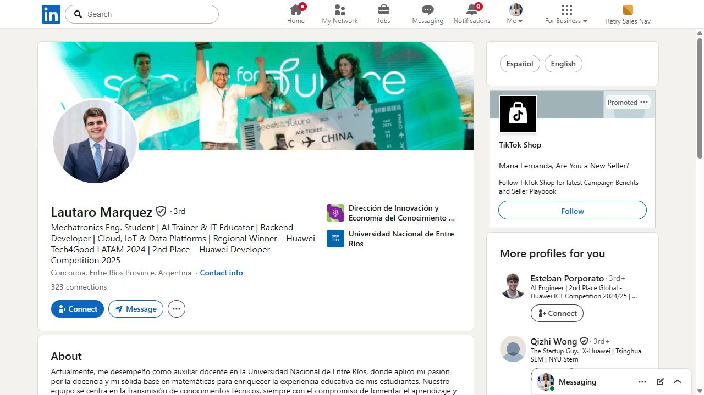

Publicación 1 — Hackathon de agentes de IA y energía

- [Abrir publicación](https://www.linkedin.com/feed/update/urn:li:activity:7399883903756304385/)
- Tema visible: participación en el UK AI Agent Hackathon, reto de energía y llegada al Top 15.

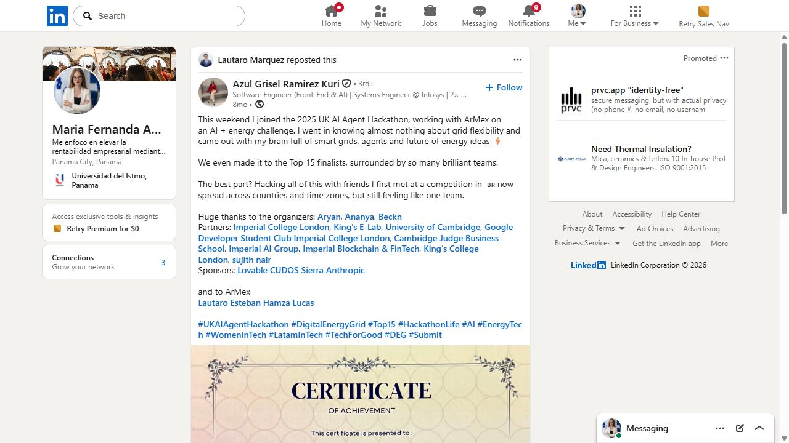

Comentario borrador: “Me gustó mucho cómo conectaste un reto técnico —agentes y energía— con el aprendizaje rápido de un dominio nuevo. Estoy explorando cómo pasar de herramientas aisladas a sistemas que resuelvan procesos completos, y este tipo de proyectos me parece una referencia muy buena.”

Publicación 2 — Proyecto FLUXEON y colaboración transfronteriza

- [Abrir publicación](https://www.linkedin.com/feed/update/urn:li:activity:7399517046755024897/)
- Tema visible: hackathon online, colaboración entre Londres y participantes latinoamericanos, y llegada a la final con FLUXEON.

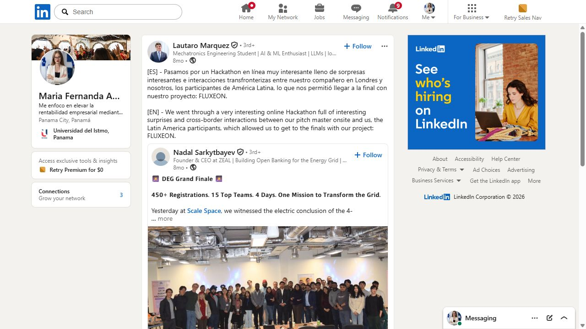

Comentario borrador: “Qué interesante ver cómo un equipo distribuido puede convertir una competencia en una experiencia de aprendizaje real. Me llamó la atención la combinación entre colaboración internacional y construcción de un proyecto concreto.”

## Persona 2 — Jaime F. Escamilla Galindo

Perfil y por qué encaja

- Perfil: [Jaime F. Escamilla Galindo en LinkedIn](https://mx.linkedin.com/in/jaime-escamilla)
- Ubicación visible: México.
- Etapa: estudiante de Ingeniería Industrial y de Sistemas en el Tecnológico de Monterrey, en transición a graduación.
- Señales relevantes: analítica de datos, herramientas de IA, proyectos de impacto, emprendimiento EdTech y supply chain.

Publicación 1 — Reconocimiento MIT en Supply Chain

- [Abrir publicación](https://www.linkedin.com/feed/update/urn:li:activity:7465949957829738497/)
- Tema visible: MIT Supply Chain Management Excellence Award y reconocimiento a estudiantes con liderazgo, innovación e impacto.

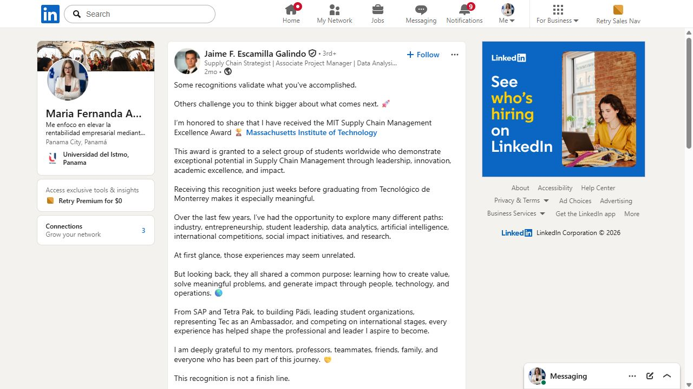

Comentario borrador: “Felicidades por el reconocimiento. Me gustó que el premio conecte liderazgo, innovación e impacto, porque para mí la IA también tiene sentido cuando termina mejorando una operación real y no solo cuando se demuestra la tecnología.”

Publicación 2 — Cierre de etapa universitaria

- [Abrir publicación](https://www.linkedin.com/feed/update/urn:li:activity:7458666619335131136/)
- Tema visible: cierre de la etapa en el Tecnológico de Monterrey, liderazgo estudiantil, proyectos de impacto y aprendizaje mediante el trabajo y el error.

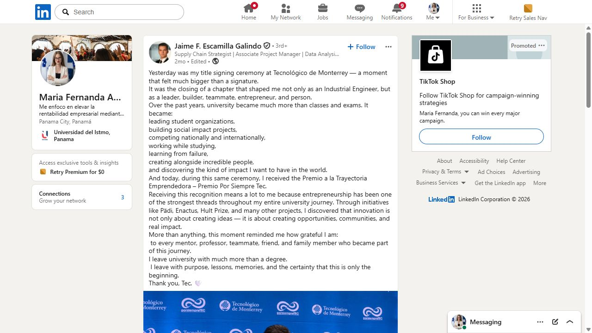

Comentario borrador: “Me pareció muy honesto cómo describes la universidad como algo más que clases y exámenes. También creo que los proyectos reales —incluidos los que no salen perfectos— son los que terminan formando criterio para construir soluciones útiles.”

## Persona 3 — Miguel Alejandro Garzón Parra

Perfil y por qué encaja

- Perfil: [Miguel Alejandro Garzón Parra en LinkedIn](https://mx.linkedin.com/in/miguelgarzonparra)
- Ubicación visible: México.
- Etapa: estudiante de ingeniería en el Tecnológico de Monterrey.
- Señales relevantes: ciencia de datos, machine learning, robótica, gemelos digitales, Industry 5.0 y proyectos académicos aplicados.

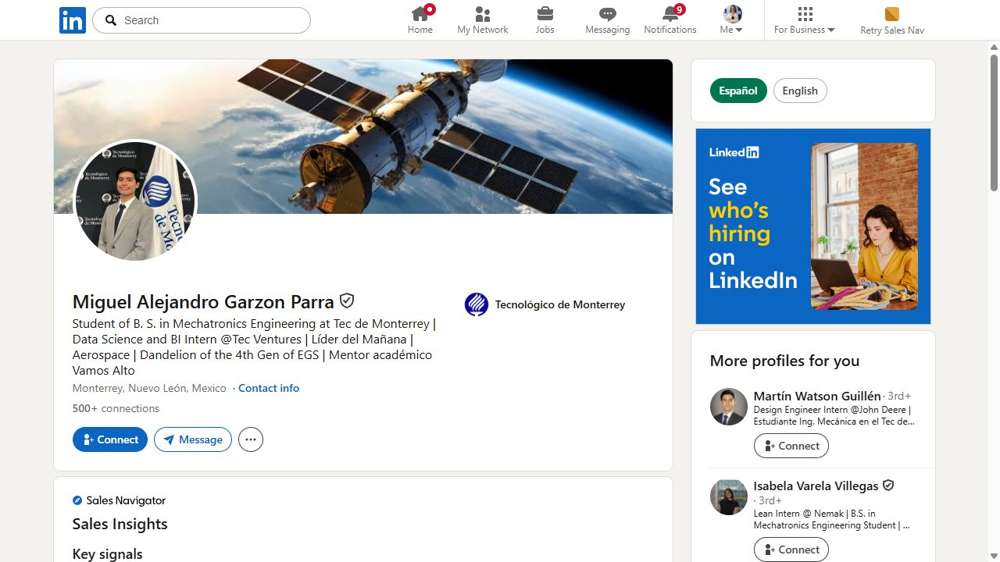

Publicación 1 — Comunidad y conferencia de ingeniería

- [Abrir publicación](https://www.linkedin.com/feed/update/urn:li:activity:7378569991329173504/)
- Tema visible: conferencia de ingeniería, mentoría, aprendizaje y valor de una comunidad técnica auténtica.

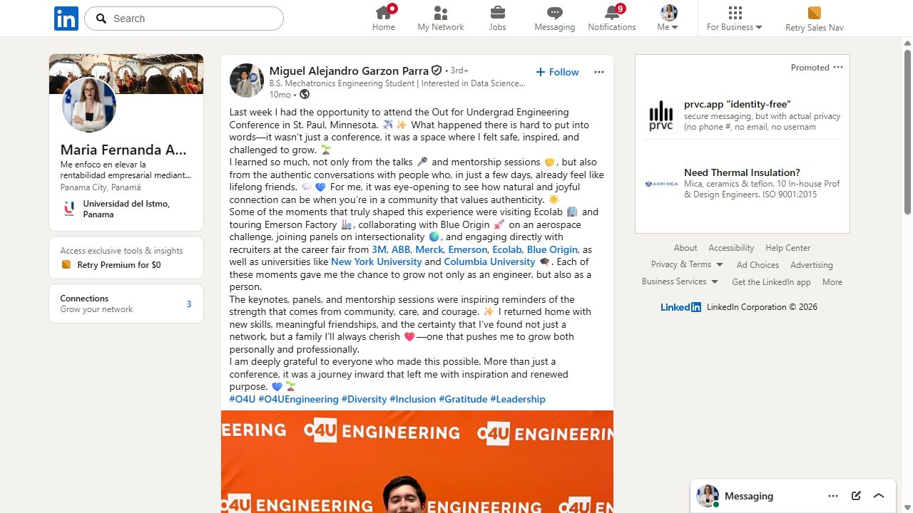

Comentario borrador: “Me gustó que destaques la comunidad y las conversaciones, no solo las charlas. En tecnología uno puede aprender una herramienta rápido, pero encontrar personas con las que construir y recibir feedback cambia mucho el resultado.”

Publicación 2 — PINN aplicada a dinámica robótica

- [Abrir publicación](https://www.linkedin.com/feed/update/urn:li:activity:7488089763485474816/)
- Tema visible: Physics-Informed Neural Networks aplicadas a un robot xArm; compara resultados con un MLP base usando datos experimentales.

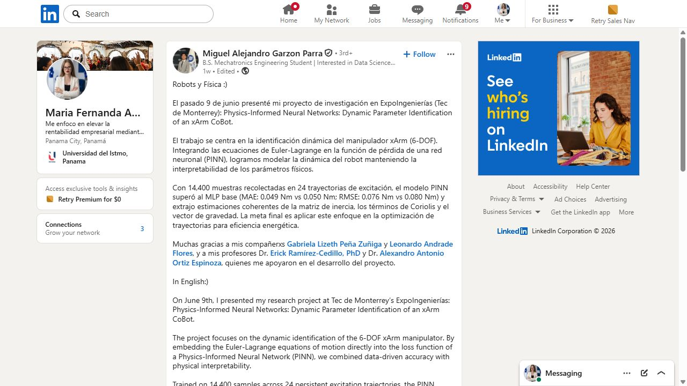

Comentario borrador: “Muy interesante la forma de combinar conocimiento físico con redes neuronales. Me parece un buen ejemplo de que el valor no está solo en usar IA, sino en integrarla con el contexto del problema para obtener resultados más interpretables.”

## Persona 4 — Valentina Heguerte Maynard

Perfil y por qué encaja

- Perfil: [Valentina Heguerte Maynard en LinkedIn](https://mx.linkedin.com/in/valentina-heguerte-maynard)
- Ubicación visible: México.
- Etapa: estudiante de Ingeniería en Innovación y Desarrollo en el Tecnológico de Monterrey.
- Señales relevantes: innovación, emprendimiento, AI Coach, proyectos para microempresas y diseño de soluciones con aliados corporativos.

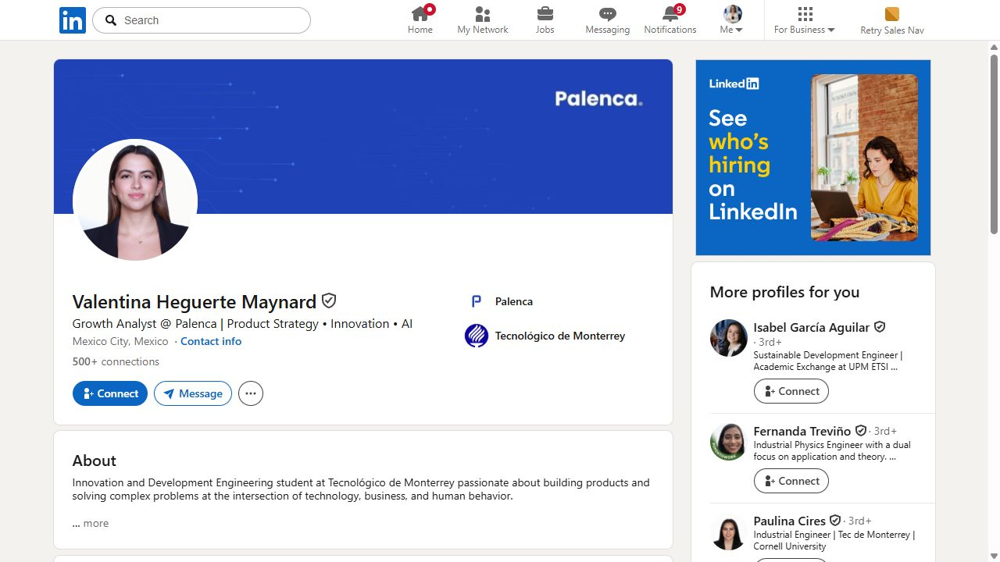

Publicación 1 — Hack The Field con John Deere

- [Abrir publicación](https://www.linkedin.com/feed/update/urn:li:activity:7475348367934521344/)
- Tema visible: experiencia de innovación realizada con John Deere, el Tecnológico de Monterrey y su ecosistema de emprendimiento.

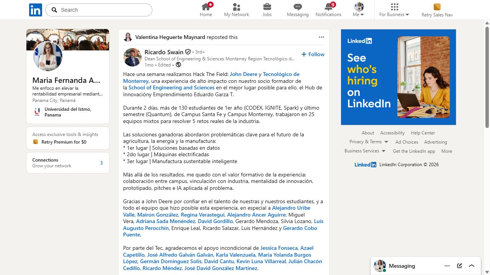

Comentario borrador: “Me parece muy valioso que una experiencia de innovación conecte estudiantes, universidad y empresa. Ese puente es justo donde los problemas concretos ayudan a que la tecnología deje de ser una demostración y se convierta en una solución.”

Publicación 2 — Innovación aplicada y aprendizaje

- [Abrir publicación](https://www.linkedin.com/feed/update/urn:li:activity:7467281527261937666/)
- Tema visible: proyecto y aprendizaje aplicado dentro del ecosistema de innovación estudiantil.

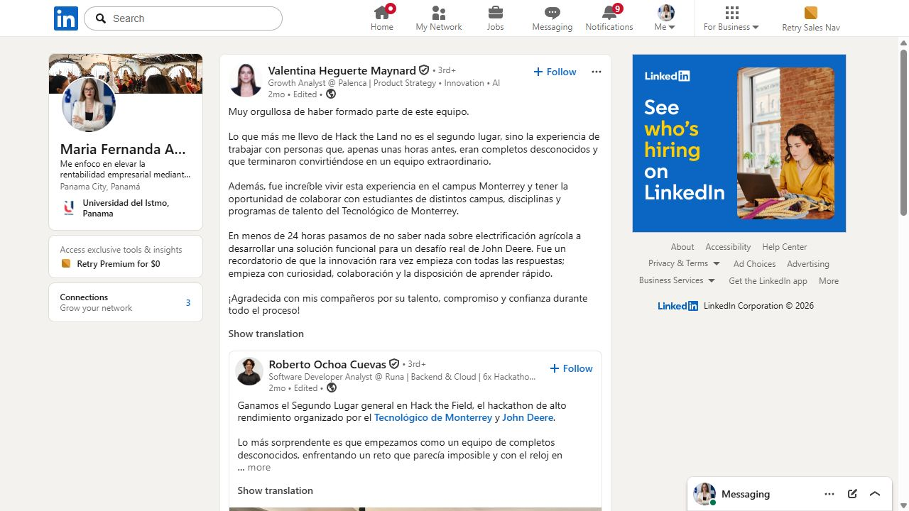

Comentario borrador: “Me gustó ver el enfoque práctico del proyecto. Estoy aprendiendo que diseñar una solución también implica entender el contexto, los usuarios y las restricciones, no solo escoger la herramienta tecnológica.”

## Persona 5 — Biniza Vazquez

Perfil y por qué encaja

- Perfil: [Biniza Vazquez en LinkedIn](https://mx.linkedin.com/in/biniza-vazquez)
- Ubicación visible: Puebla, México.
- Etapa: estudiante de Ingeniería en Sistemas Digitales y Robótica.
- Señales relevantes: IA/ML, Edge AI, interfaces cerebro-computadora, neurotecnología y proyectos estudiantiles de investigación.

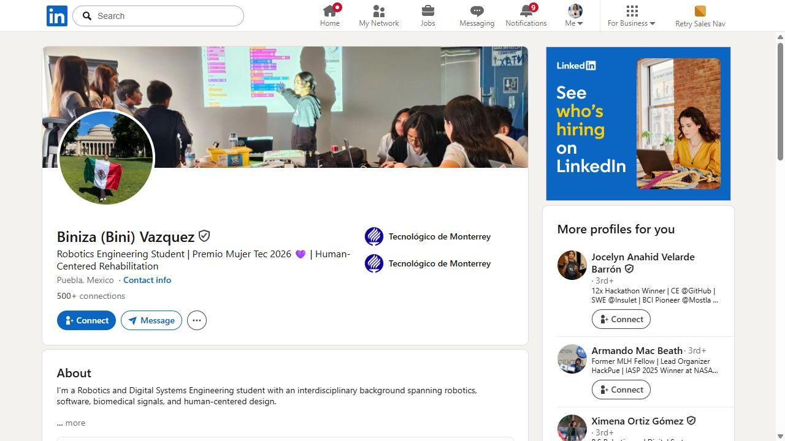

Publicación 1 — Conferencia BCI y aprendizaje internacional

- [Abrir publicación](https://www.linkedin.com/feed/update/urn:li:activity:7453679233677103104/)
- Tema visible: participación remota en una conferencia de interfaces cerebro-computadora y colaboración internacional.

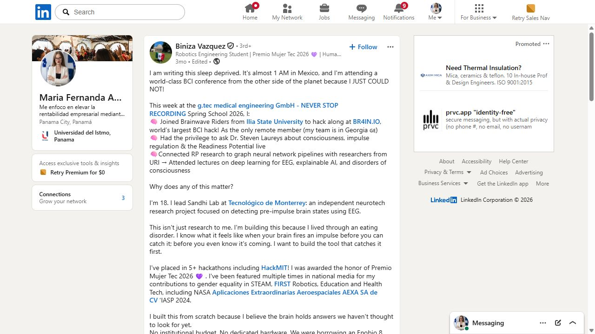

Comentario borrador: “Me inspiró mucho ver esa iniciativa para conectarte con una conferencia internacional desde México. A veces uno piensa que necesita esperar a tener más experiencia, pero buscar esos espacios también forma parte de construirla.”

Publicación 2 — Aprender construyendo en IA

- [Abrir publicación](https://www.linkedin.com/feed/update/urn:li:activity:7482974276233363456/)
- Tema visible: reflexión sobre aprendizaje, tecnología y construcción de proyectos desde la etapa estudiantil.

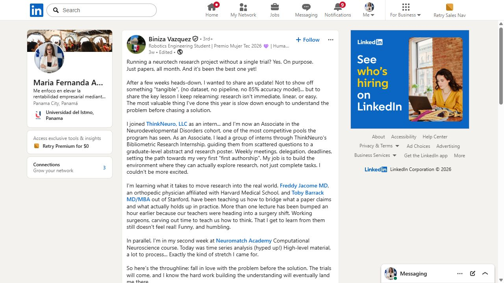

Comentario borrador: “Me gustó la idea de acercarse al problema con curiosidad y no solo perseguir la herramienta de moda. Estoy intentando aplicar esa misma mentalidad a proyectos de IA y automatización con problemas reales.”

## Mensaje de conexión — borrador común

> Hola, [nombre]. Soy Juan Diego y estoy estudiando/construyendo proyectos alrededor de IA, automatización y sistemas aplicados a problemas reales. Vi tu trabajo en [tema específico] y me pareció muy interesante. Estoy buscando conectar con estudiantes y personas de LATAM que estén experimentando en áreas parecidas para aprender y compartir ideas. ¡Un gusto conectar!

## Regla de uso

Primero revisarías manualmente el perfil y el contexto del post. Después, si apruebas el texto, puedes publicar un comentario y enviar la invitación. Esta página solo deja preparados los enlaces, capturas y borradores; no automatiza ni ejecuta esas acciones.

---

# Networking LATAM — 5 estudiantes adicionales

Segunda tanda con el mismo criterio: etapa universitaria o de posgrado visible, interés en IA, datos, automatización, robótica o innovación aplicada, y ubicación en Latinoamérica. Las capturas son reales y están separadas por perfil y publicación.

> Estado: preparado para revisión. No se enviaron comentarios ni invitaciones.

## Persona 1 — Constanza Miranda Heufemann

Perfil y encaje

- [Perfil en LinkedIn](https://cl.linkedin.com/in/constanzamh)
- Estudiante de Ingeniería en Automatización y Robótica en INACAP, Chile.
- Señales: educación en IA, robótica, ciencia para jóvenes y proyectos de innovación climática.

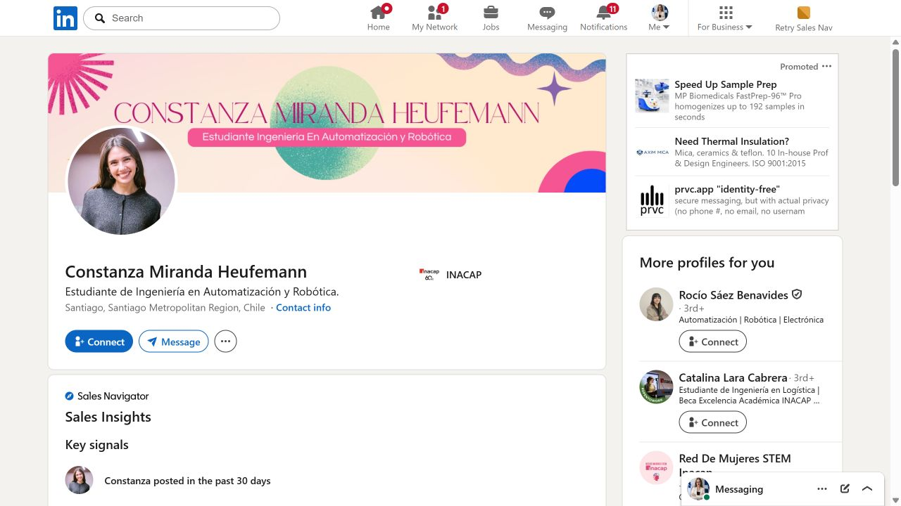

Publicación 1 — Mujeres que Todo lo Pueden

- [Abrir publicación](https://www.linkedin.com/feed/update/urn:li:activity:7488773568105865216/)

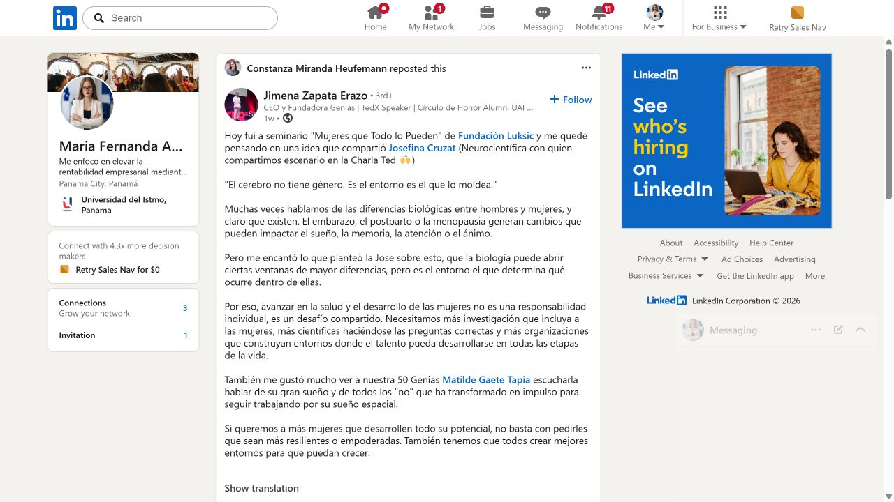

Comentario borrador: “Me gustó mucho que conectaras la conversación sobre liderazgo con tu propia experiencia en tecnología. Creo que compartir ese proceso puede abrirle camino a más estudiantes que todavía no se sienten representados en IA y robótica.”

Publicación 2 — Educación digital e IA para jóvenes

- [Abrir publicación](https://www.linkedin.com/feed/update/urn:li:activity:7481377805524557824/)

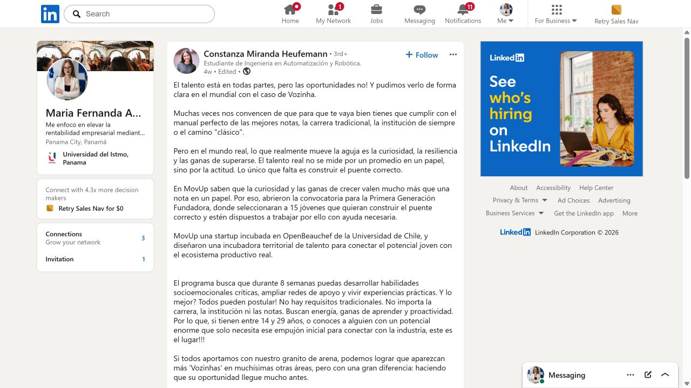

Comentario borrador: “Me parece muy valioso acercar la IA a jóvenes desde una perspectiva crítica y práctica. No se trata solo de usar herramientas, sino de entender cómo cambian la forma en que aprendemos y tomamos decisiones.”

## Persona 2 — Cristóbal Díaz

Perfil y encaje

- [Perfil en LinkedIn](https://cl.linkedin.com/in/crist%C3%B3bald%C3%ADaz)
- Estudiante de Ingeniería Comercial en la Universidad de Valparaíso, Chile.
- Señales: estrategia, finanzas, consultoría, IA aplicada a negocios y análisis crediticio.

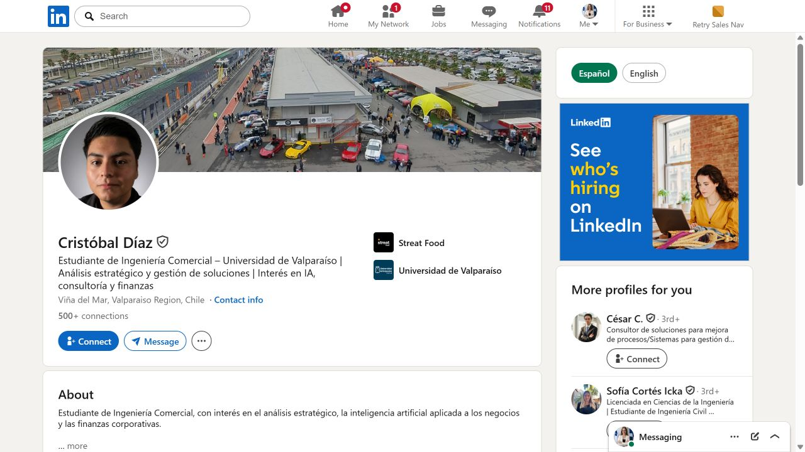

Publicación 1 — Gestión y organización de eventos

- [Abrir publicación](https://www.linkedin.com/feed/update/urn:li:activity:7413091894441791488/)

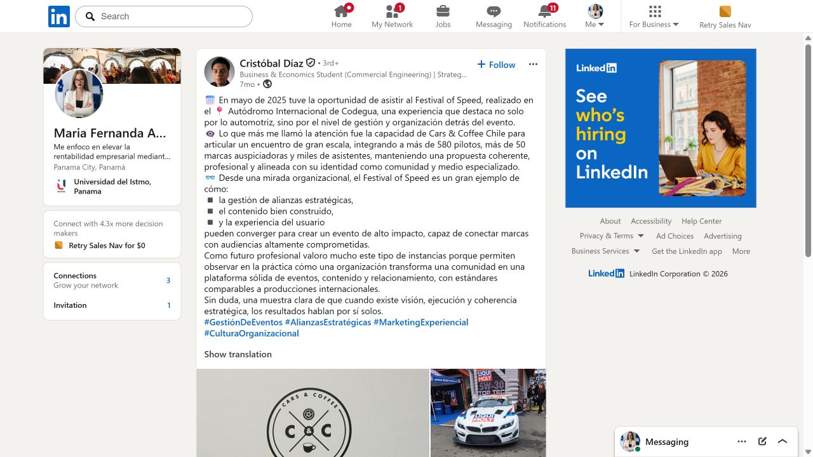

Comentario borrador: “Me llamó la atención que analizaras el evento desde la gestión y no solo desde la experiencia visible. Esa mirada de procesos, coordinación y escala es justamente la que permite identificar dónde la tecnología puede generar valor real.”

Publicación 2 — IA aplicada al análisis de negocios

- [Abrir publicación](https://www.linkedin.com/feed/update/urn:li:activity:7413078816039895040/)

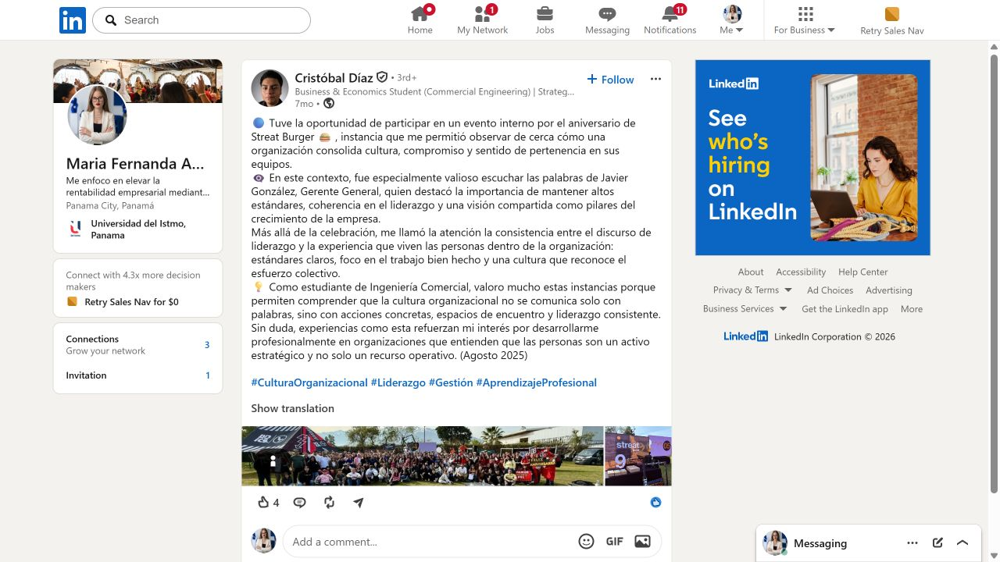

Comentario borrador: “Me interesa mucho esa intersección entre estrategia, finanzas e inteligencia artificial. Estoy explorando cómo pasar de usar IA para tareas aisladas a diseñar sistemas que ayuden a tomar mejores decisiones.”

## Persona 3 — Valentin Castro Pizarro

Perfil y encaje

- [Perfil en LinkedIn](https://cl.linkedin.com/in/valentin-castro-pizarro)
- Estudiante de cuarto año de Ingeniería Civil en Informática e Innovación Tecnológica en la Universidad del Desarrollo, Chile.
- Señales: software, LLMs, arquitecturas de agentes, Supabase, innovación aplicada y proyectos con Mistral.

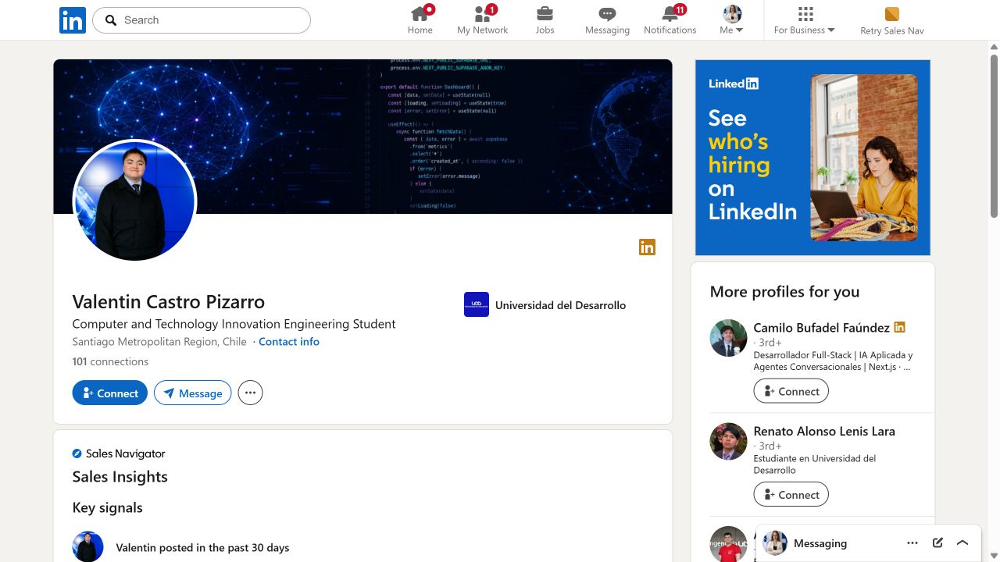

Publicación 1 — AWS Cloud Security Foundations

- [Abrir publicación](https://www.linkedin.com/feed/update/urn:li:activity:7490049656513814529/)

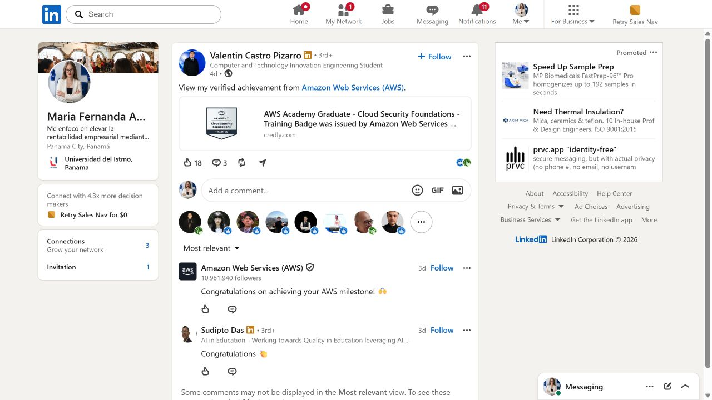

Comentario borrador: “Felicidades por la certificación. Me parece especialmente importante complementar el desarrollo de IA y agentes con fundamentos de seguridad, porque un sistema útil también tiene que ser confiable para una empresa.”

Publicación 2 — Proyecto de IA aplicada

- [Abrir publicación](https://www.linkedin.com/feed/update/urn:li:activity:7481116990280122368/)

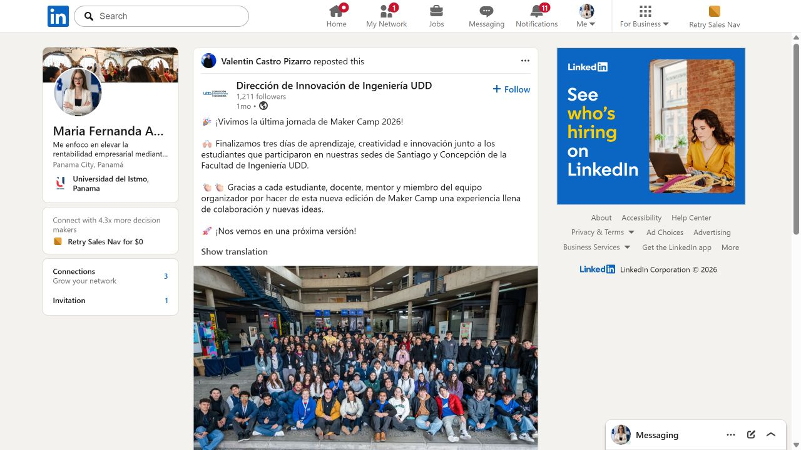

Comentario borrador: “Me gustó ver cómo llevaste LLMs y agentes hacia un producto concreto. Estoy trabajando una idea parecida: conectar varias capacidades dentro de un sistema que resuelva un proceso completo, no solo una tarea.”

## Persona 4 — Vicente Opazo Schuster

Perfil y encaje

- [Perfil en LinkedIn](https://cl.linkedin.com/in/visho33/es)
- Estudiante de Matemáticas Aplicadas en Chile y vinculado al Centro Nacional de Inteligencia Artificial.
- Señales: algoritmos, optimización, machine learning, programación competitiva y resolución de problemas reales.

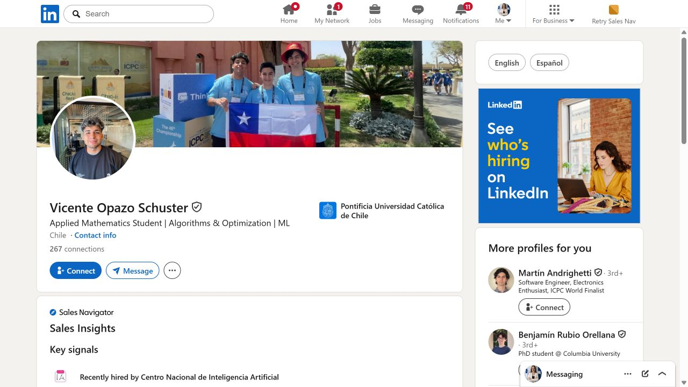

Publicación 1 — Competencia internacional de programación

- [Abrir publicación](https://www.linkedin.com/feed/update/urn:li:activity:7435052815259115520/)

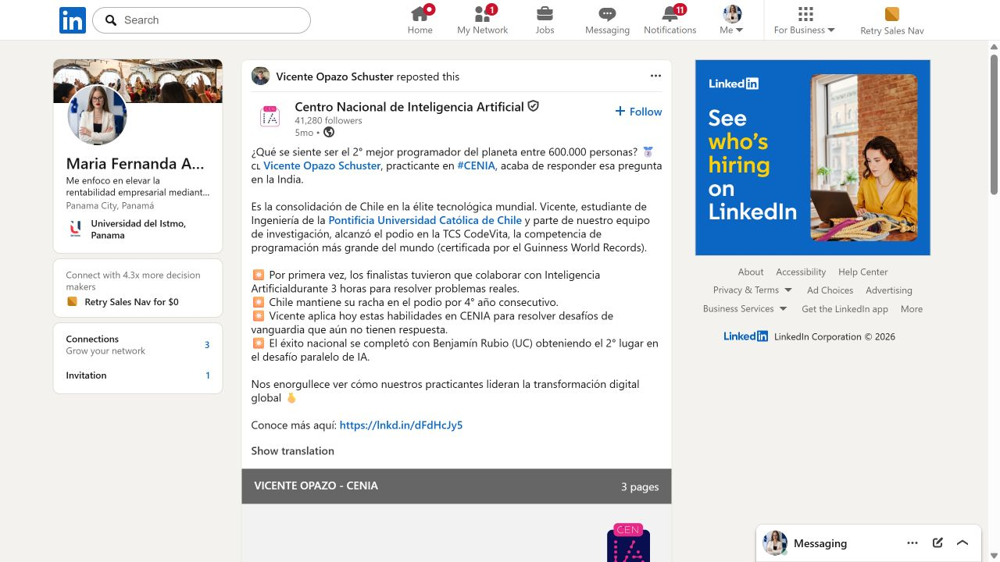

Comentario borrador: “Impresionante resultado. Me gusta porque muestra que detrás de una solución de IA también hay una base fuerte de razonamiento, algoritmos y optimización. Esa combinación es muy necesaria para construir sistemas confiables.”

Publicación 2 — Modelos probabilísticos y aprendizaje

- [Abrir publicación](https://www.linkedin.com/feed/update/urn:li:activity:7414795230266261504/)

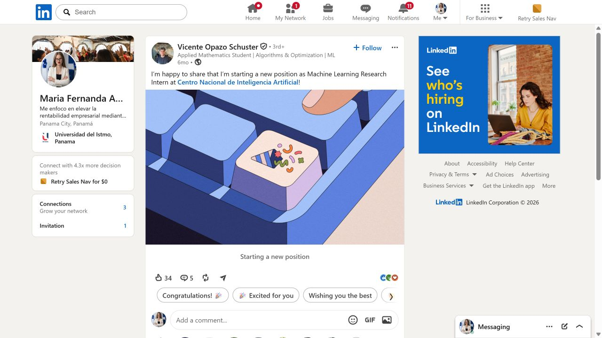

Comentario borrador: “Me parece muy interesante usar un problema cotidiano como el fútbol para explorar modelos probabilísticos. Es una buena forma de convertir curiosidad técnica en un proyecto que se puede explicar y discutir.”

## Persona 5 — Vittorio Cherubini Grandón

Perfil y encaje

- [Perfil en LinkedIn](https://cl.linkedin.com/in/vittorio-cherubini-grand%C3%B3n-9491282a6)
- Estudiante de Ingeniería Robótica en la Pontificia Universidad Católica de Chile.
- Señales: robótica, IA, liderazgo estudiantil, enseñanza y comunidad técnica.

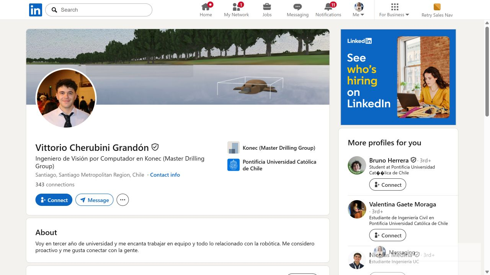

Publicación 1 — Cumbre de Líderes

- [Abrir publicación](https://www.linkedin.com/feed/update/urn:li:activity:7377101314855575552/)

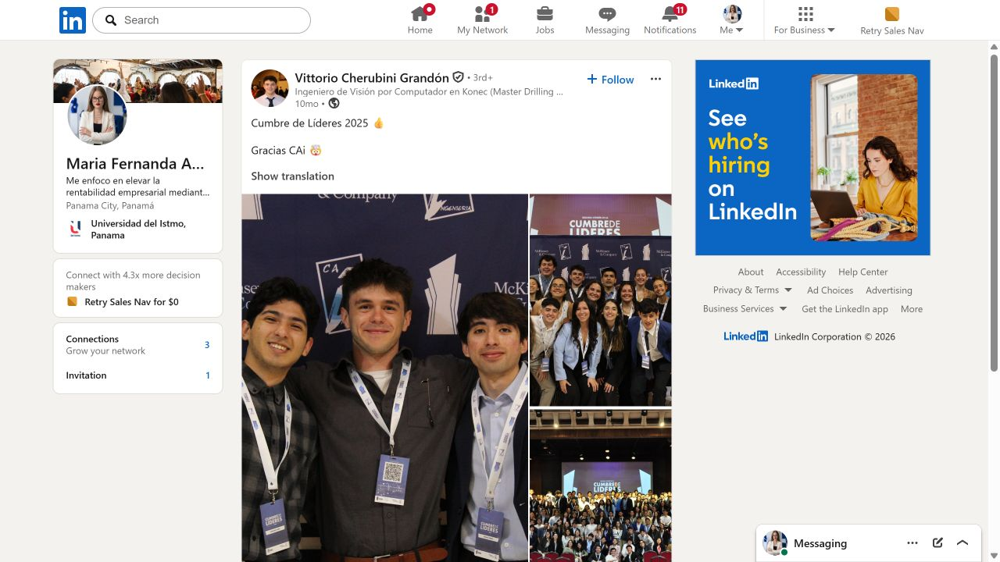

Comentario borrador: “Qué bueno ver cómo los espacios de liderazgo estudiantil también terminan impulsando proyectos técnicos. Me interesa conectar con personas que estén construyendo comunidad alrededor de IA y robótica desde la universidad.”

Publicación 2 — Comunidad robótica universitaria

- [Abrir publicación](https://www.linkedin.com/feed/update/urn:li:activity:7305986685593407489/)

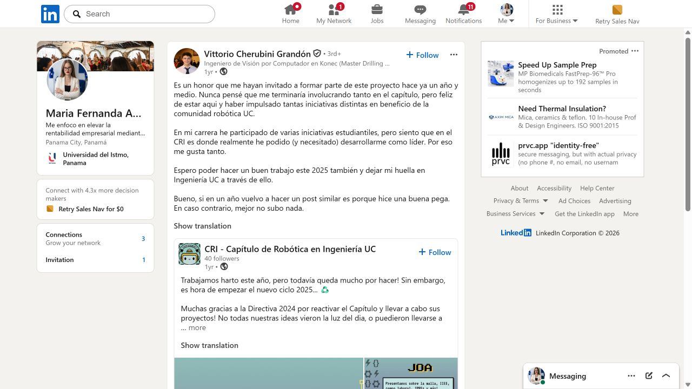

Comentario borrador: “Me gustó leer cómo describes el impacto de las iniciativas estudiantiles en la comunidad robótica. Muchas veces el valor no está solo en el proyecto, sino en dejar una estructura que permita que otros continúen construyendo.”

## Mensaje de conexión — borrador

> Hola, [nombre]. Soy Juan Diego y estoy construyendo proyectos alrededor de IA, automatización y sistemas aplicados. Vi tu publicación sobre [tema] y me pareció muy interesante. Estoy buscando conectar con estudiantes de LATAM que estén explorando áreas parecidas para aprender y compartir ideas. ¡Un gusto conectar!

Las publicaciones y conexiones quedan únicamente preparadas para que las revises y apruebes antes de usarlas.

