# Networking LATAM — 20 estudiantes

Esta página reúne los 20 perfiles estudiantiles investigados, con capturas, enlaces y comentarios preparados. No se enviaron comentarios ni invitaciones.

# Networking LATAM — 10 estudiantes

Esta página reúne las dos tandas de perfiles estudiantiles investigados. Cada persona tiene capturas reales de su perfil y dos publicaciones separadas. No se enviaron comentarios ni invitaciones.

# Networking LATAM — 5 estudiantes de IA y tecnología

Esta shortlist reemplaza la versión anterior. El filtro aplicado fue: etapa universitaria o transición inmediata a la vida profesional, interés visible en IA/automatización/datos/robótica y presencia en Latinoamérica.

Las imágenes de esta página son capturas reales tomadas de LinkedIn. Cada persona tiene una captura de perfil y una captura independiente para cada publicación. La edad no se infiere: se usa únicamente la etapa académica que aparece públicamente.

> Estado: investigación y preparación. No se enviaron comentarios ni invitaciones de conexión.

## Persona 1 — Lautaro Marquez

Perfil y por qué encaja

- Perfil: [Lautaro Marquez en LinkedIn](https://www.linkedin.com/in/marquez-lautaro/en/)
- Ubicación visible: Concordia, Entre Ríos, Argentina.
- Etapa: estudiante de Ingeniería Mecatrónica en la Universidad Nacional de Entre Ríos.
- Señales relevantes: IA, LLMs, IoT, plataformas de datos, educación tecnológica y hackathons regionales.

Publicación 1 — Hackathon de agentes de IA y energía

- [Abrir publicación](https://www.linkedin.com/feed/update/urn:li:activity:7399883903756304385/)
- Tema visible: participación en el UK AI Agent Hackathon, reto de energía y llegada al Top 15.

Comentario borrador: “Me gustó mucho cómo conectaste un reto técnico —agentes y energía— con el aprendizaje rápido de un dominio nuevo. Estoy explorando cómo pasar de herramientas aisladas a sistemas que resuelvan procesos completos, y este tipo de proyectos me parece una referencia muy buena.”

Publicación 2 — Proyecto FLUXEON y colaboración transfronteriza

- [Abrir publicación](https://www.linkedin.com/feed/update/urn:li:activity:7399517046755024897/)
- Tema visible: hackathon online, colaboración entre Londres y participantes latinoamericanos, y llegada a la final con FLUXEON.

Comentario borrador: “Qué interesante ver cómo un equipo distribuido puede convertir una competencia en una experiencia de aprendizaje real. Me llamó la atención la combinación entre colaboración internacional y construcción de un proyecto concreto.”

## Persona 2 — Jaime F. Escamilla Galindo

Perfil y por qué encaja

- Perfil: [Jaime F. Escamilla Galindo en LinkedIn](https://mx.linkedin.com/in/jaime-escamilla)
- Ubicación visible: México.
- Etapa: estudiante de Ingeniería Industrial y de Sistemas en el Tecnológico de Monterrey, en transición a graduación.
- Señales relevantes: analítica de datos, herramientas de IA, proyectos de impacto, emprendimiento EdTech y supply chain.

Publicación 1 — Reconocimiento MIT en Supply Chain

- [Abrir publicación](https://www.linkedin.com/feed/update/urn:li:activity:7465949957829738497/)
- Tema visible: MIT Supply Chain Management Excellence Award y reconocimiento a estudiantes con liderazgo, innovación e impacto.

Comentario borrador: “Felicidades por el reconocimiento. Me gustó que el premio conecte liderazgo, innovación e impacto, porque para mí la IA también tiene sentido cuando termina mejorando una operación real y no solo cuando se demuestra la tecnología.”

Publicación 2 — Cierre de etapa universitaria

- [Abrir publicación](https://www.linkedin.com/feed/update/urn:li:activity:7458666619335131136/)
- Tema visible: cierre de la etapa en el Tecnológico de Monterrey, liderazgo estudiantil, proyectos de impacto y aprendizaje mediante el trabajo y el error.

Comentario borrador: “Me pareció muy honesto cómo describes la universidad como algo más que clases y exámenes. También creo que los proyectos reales —incluidos los que no salen perfectos— son los que terminan formando criterio para construir soluciones útiles.”

## Persona 3 — Miguel Alejandro Garzón Parra

Perfil y por qué encaja

- Perfil: [Miguel Alejandro Garzón Parra en LinkedIn](https://mx.linkedin.com/in/miguelgarzonparra)
- Ubicación visible: México.
- Etapa: estudiante de ingeniería en el Tecnológico de Monterrey.
- Señales relevantes: ciencia de datos, machine learning, robótica, gemelos digitales, Industry 5.0 y proyectos académicos aplicados.

Publicación 1 — Comunidad y conferencia de ingeniería

- [Abrir publicación](https://www.linkedin.com/feed/update/urn:li:activity:7378569991329173504/)
- Tema visible: conferencia de ingeniería, mentoría, aprendizaje y valor de una comunidad técnica auténtica.

Comentario borrador: “Me gustó que destaques la comunidad y las conversaciones, no solo las charlas. En tecnología uno puede aprender una herramienta rápido, pero encontrar personas con las que construir y recibir feedback cambia mucho el resultado.”

Publicación 2 — PINN aplicada a dinámica robótica

- [Abrir publicación](https://www.linkedin.com/feed/update/urn:li:activity:7488089763485474816/)
- Tema visible: Physics-Informed Neural Networks aplicadas a un robot xArm; compara resultados con un MLP base usando datos experimentales.

Comentario borrador: “Muy interesante la forma de combinar conocimiento físico con redes neuronales. Me parece un buen ejemplo de que el valor no está solo en usar IA, sino en integrarla con el contexto del problema para obtener resultados más interpretables.”

## Persona 4 — Valentina Heguerte Maynard

Perfil y por qué encaja

- Perfil: [Valentina Heguerte Maynard en LinkedIn](https://mx.linkedin.com/in/valentina-heguerte-maynard)
- Ubicación visible: México.
- Etapa: estudiante de Ingeniería en Innovación y Desarrollo en el Tecnológico de Monterrey.
- Señales relevantes: innovación, emprendimiento, AI Coach, proyectos para microempresas y diseño de soluciones con aliados corporativos.

Publicación 1 — Hack The Field con John Deere

- [Abrir publicación](https://www.linkedin.com/feed/update/urn:li:activity:7475348367934521344/)
- Tema visible: experiencia de innovación realizada con John Deere, el Tecnológico de Monterrey y su ecosistema de emprendimiento.

Comentario borrador: “Me parece muy valioso que una experiencia de innovación conecte estudiantes, universidad y empresa. Ese puente es justo donde los problemas concretos ayudan a que la tecnología deje de ser una demostración y se convierta en una solución.”

Publicación 2 — Innovación aplicada y aprendizaje

- [Abrir publicación](https://www.linkedin.com/feed/update/urn:li:activity:7467281527261937666/)
- Tema visible: proyecto y aprendizaje aplicado dentro del ecosistema de innovación estudiantil.

Comentario borrador: “Me gustó ver el enfoque práctico del proyecto. Estoy aprendiendo que diseñar una solución también implica entender el contexto, los usuarios y las restricciones, no solo escoger la herramienta tecnológica.”

## Persona 5 — Biniza Vazquez

Perfil y por qué encaja

- Perfil: [Biniza Vazquez en LinkedIn](https://mx.linkedin.com/in/biniza-vazquez)
- Ubicación visible: Puebla, México.
- Etapa: estudiante de Ingeniería en Sistemas Digitales y Robótica.
- Señales relevantes: IA/ML, Edge AI, interfaces cerebro-computadora, neurotecnología y proyectos estudiantiles de investigación.

Publicación 1 — Conferencia BCI y aprendizaje internacional

- [Abrir publicación](https://www.linkedin.com/feed/update/urn:li:activity:7453679233677103104/)
- Tema visible: participación remota en una conferencia de interfaces cerebro-computadora y colaboración internacional.

Comentario borrador: “Me inspiró mucho ver esa iniciativa para conectarte con una conferencia internacional desde México. A veces uno piensa que necesita esperar a tener más experiencia, pero buscar esos espacios también forma parte de construirla.”

Publicación 2 — Aprender construyendo en IA

- [Abrir publicación](https://www.linkedin.com/feed/update/urn:li:activity:7482974276233363456/)
- Tema visible: reflexión sobre aprendizaje, tecnología y construcción de proyectos desde la etapa estudiantil.

Comentario borrador: “Me gustó la idea de acercarse al problema con curiosidad y no solo perseguir la herramienta de moda. Estoy intentando aplicar esa misma mentalidad a proyectos de IA y automatización con problemas reales.”

## Mensaje de conexión — borrador común

> Hola, [nombre]. Soy Juan Diego y estoy estudiando/construyendo proyectos alrededor de IA, automatización y sistemas aplicados a problemas reales. Vi tu trabajo en [tema específico] y me pareció muy interesante. Estoy buscando conectar con estudiantes y personas de LATAM que estén experimentando en áreas parecidas para aprender y compartir ideas. ¡Un gusto conectar!

## Regla de uso

Primero revisarías manualmente el perfil y el contexto del post. Después, si apruebas el texto, puedes publicar un comentario y enviar la invitación. Esta página solo deja preparados los enlaces, capturas y borradores; no automatiza ni ejecuta esas acciones.

---

# Networking LATAM — 5 estudiantes adicionales

Segunda tanda con el mismo criterio: etapa universitaria o de posgrado visible, interés en IA, datos, automatización, robótica o innovación aplicada, y ubicación en Latinoamérica. Las capturas son reales y están separadas por perfil y publicación.

> Estado: preparado para revisión. No se enviaron comentarios ni invitaciones.

## Persona 1 — Constanza Miranda Heufemann

Perfil y encaje

- [Perfil en LinkedIn](https://cl.linkedin.com/in/constanzamh)
- Estudiante de Ingeniería en Automatización y Robótica en INACAP, Chile.
- Señales: educación en IA, robótica, ciencia para jóvenes y proyectos de innovación climática.

Publicación 1 — Mujeres que Todo lo Pueden

- [Abrir publicación](https://www.linkedin.com/feed/update/urn:li:activity:7488773568105865216/)

Comentario borrador: “Me gustó mucho que conectaras la conversación sobre liderazgo con tu propia experiencia en tecnología. Creo que compartir ese proceso puede abrirle camino a más estudiantes que todavía no se sienten representados en IA y robótica.”

Publicación 2 — Educación digital e IA para jóvenes

- [Abrir publicación](https://www.linkedin.com/feed/update/urn:li:activity:7481377805524557824/)

Comentario borrador: “Me parece muy valioso acercar la IA a jóvenes desde una perspectiva crítica y práctica. No se trata solo de usar herramientas, sino de entender cómo cambian la forma en que aprendemos y tomamos decisiones.”

## Persona 2 — Cristóbal Díaz

Perfil y encaje

- [Perfil en LinkedIn](https://cl.linkedin.com/in/crist%C3%B3bald%C3%ADaz)
- Estudiante de Ingeniería Comercial en la Universidad de Valparaíso, Chile.
- Señales: estrategia, finanzas, consultoría, IA aplicada a negocios y análisis crediticio.

Publicación 1 — Gestión y organización de eventos

- [Abrir publicación](https://www.linkedin.com/feed/update/urn:li:activity:7413091894441791488/)

Comentario borrador: “Me llamó la atención que analizaras el evento desde la gestión y no solo desde la experiencia visible. Esa mirada de procesos, coordinación y escala es justamente la que permite identificar dónde la tecnología puede generar valor real.”

Publicación 2 — IA aplicada al análisis de negocios

- [Abrir publicación](https://www.linkedin.com/feed/update/urn:li:activity:7413078816039895040/)

Comentario borrador: “Me interesa mucho esa intersección entre estrategia, finanzas e inteligencia artificial. Estoy explorando cómo pasar de usar IA para tareas aisladas a diseñar sistemas que ayuden a tomar mejores decisiones.”

## Persona 3 — Valentin Castro Pizarro

Perfil y encaje

- [Perfil en LinkedIn](https://cl.linkedin.com/in/valentin-castro-pizarro)
- Estudiante de cuarto año de Ingeniería Civil en Informática e Innovación Tecnológica en la Universidad del Desarrollo, Chile.
- Señales: software, LLMs, arquitecturas de agentes, Supabase, innovación aplicada y proyectos con Mistral.

Publicación 1 — AWS Cloud Security Foundations

- [Abrir publicación](https://www.linkedin.com/feed/update/urn:li:activity:7490049656513814529/)

Comentario borrador: “Felicidades por la certificación. Me parece especialmente importante complementar el desarrollo de IA y agentes con fundamentos de seguridad, porque un sistema útil también tiene que ser confiable para una empresa.”

Publicación 2 — Proyecto de IA aplicada

- [Abrir publicación](https://www.linkedin.com/feed/update/urn:li:activity:7481116990280122368/)

Comentario borrador: “Impresionante resultado. Me gusta porque muestra que detrás de una solución de IA también hay una base fuerte de razonamiento, algoritmos y optimización. Esa combinación es muy necesaria para construir sistemas confiables.”

Publicación 2 — Modelos probabilísticos y aprendizaje

- [Abrir publicación](https://www.linkedin.com/feed/update/urn:li:activity:7414795230266261504/)

Comentario borrador: “Me parece muy interesante usar un problema cotidiano como el fútbol para explorar modelos probabilísticos. Es una buena forma de convertir curiosidad técnica en un proyecto que se puede explicar y discutir.”

## Persona 5 — Vittorio Cherubini Grandón

Perfil y encaje

- [Perfil en LinkedIn](https://cl.linkedin.com/in/vittorio-cherubini-grand%C3%B3n-9491282a6)
- Estudiante de Ingeniería Robótica en la Pontificia Universidad Católica de Chile.
- Señales: robótica, IA, liderazgo estudiantil, enseñanza y comunidad técnica.

Publicación 1 — Cumbre de Líderes

- [Abrir publicación](https://www.linkedin.com/feed/update/urn:li:activity:7377101314855575552/)

Comentario borrador: “Qué bueno ver cómo los espacios de liderazgo estudiantil también terminan impulsando proyectos técnicos. Me interesa conectar con personas que estén construyendo comunidad alrededor de IA y robótica desde la universidad.”

Publicación 2 — Comunidad robótica universitaria

- [Abrir publicación](https://www.linkedin.com/feed/update/urn:li:activity:7305986685593407489/)

Comentario borrador: “Me gustó leer cómo describes el impacto de las iniciativas estudiantiles en la comunidad robótica. Muchas veces el valor no está solo en el proyecto, sino en dejar una estructura que permita que otros continúen construyendo.”

## Mensaje de conexión — borrador

> Hola, [nombre]. Soy Juan Diego y estoy construyendo proyectos alrededor de IA, automatización y sistemas aplicados. Vi tu publicación sobre [tema] y me pareció muy interesante. Estoy buscando conectar con estudiantes de LATAM que estén explorando áreas parecidas para aprender y compartir ideas. ¡Un gusto conectar!

Las publicaciones y conexiones quedan únicamente preparadas para que las revises y apruebes antes de usarlas.

---

# Networking LATAM — 10 estudiantes adicionales

Esta tercera tanda reúne diez perfiles nuevos. Ocho tienen dos publicaciones públicas verificables con capturas independientes. Dos quedan como candidatos en revisión porque LinkedIn no expuso publicaciones directas en su perfil público; no se fabricaron capturas.

> No se enviaron comentarios ni invitaciones.

## 1. Brayan Roberto Ccarita Cruz — Perú

Perfil

[Perfil en LinkedIn](https://pe.linkedin.com/in/natzull) — estudiante de Ingeniería de Software en la UPC, con foco en IA y participación en hackathons internacionales.

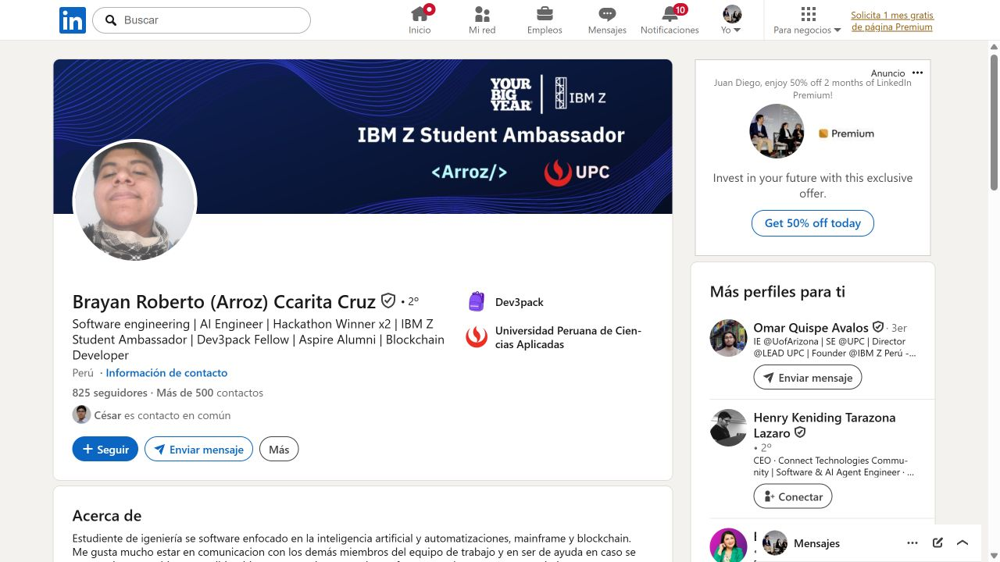

Publicación 1 — RAISE Hackathon

[Abrir publicación](https://www.linkedin.com/feed/update/urn:li:activity:7399208230914064384/)

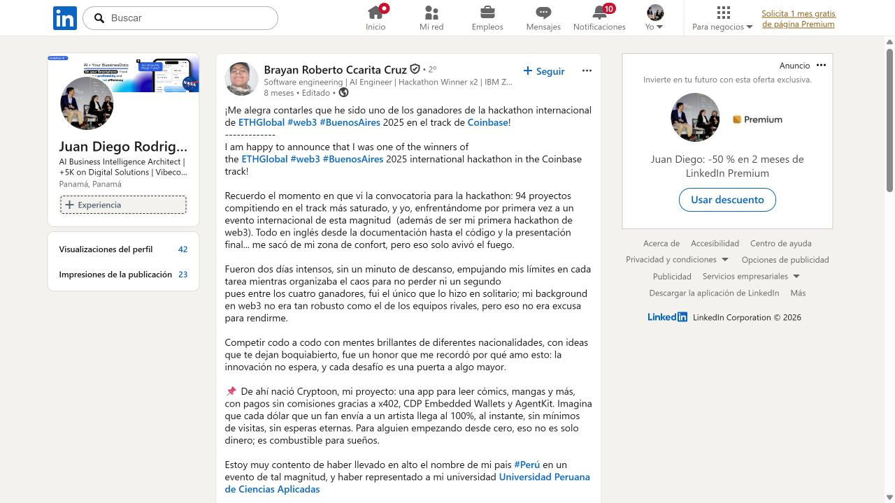

Comentario borrador: “Me parece increíble que estés llevando talento peruano a un hackathon internacional. También creo que construir durante la universidad es una de las mejores formas de convertir lo aprendido en experiencia real.”

Publicación 2 — Agentes de IA y metodología

[Abrir publicación](https://www.linkedin.com/feed/update/urn:li:activity:7490918167179952129/)

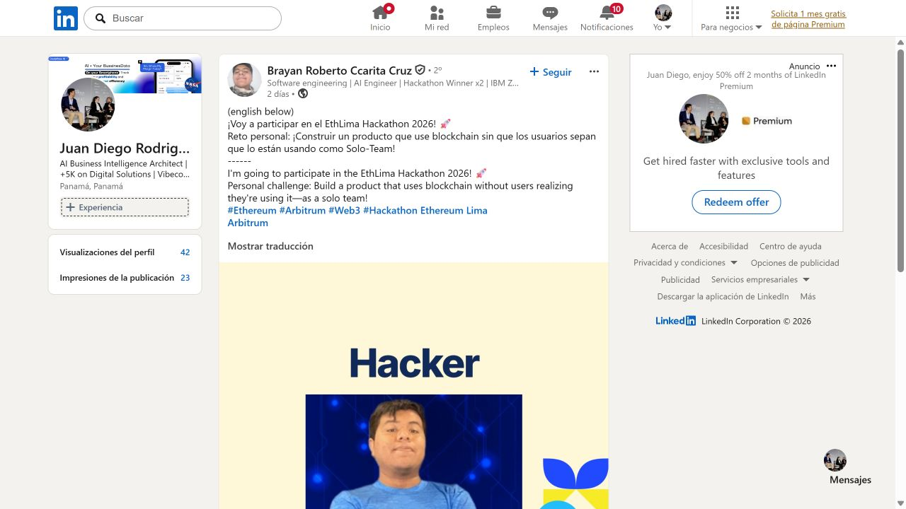

Comentario borrador: “Me llamó la atención cómo conectas agentes de IA con la metodología de trabajo. Estoy explorando justamente cómo pasar de usar herramientas aisladas a diseñar procesos completos.”

## 2. Danitza Bermejo — Perú

Perfil

[Perfil en LinkedIn](https://pe.linkedin.com/in/danitza-bermejo) — vinculada a la PUCP y a espacios regionales de aprendizaje en deep learning.

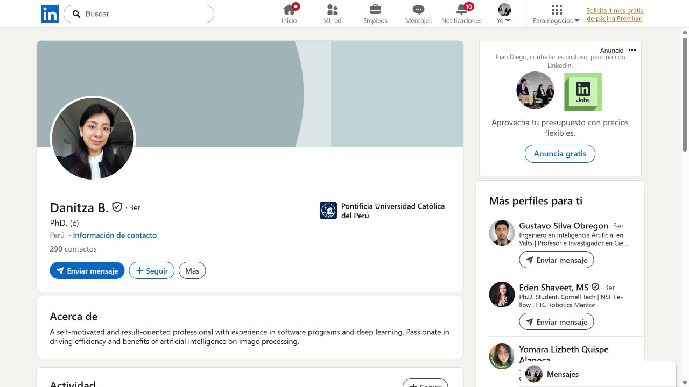

Publicación 1 — Escuela latinoamericana de Deep Learning

[Abrir publicación](https://www.linkedin.com/feed/update/urn:li:activity:7482848627292385280/)

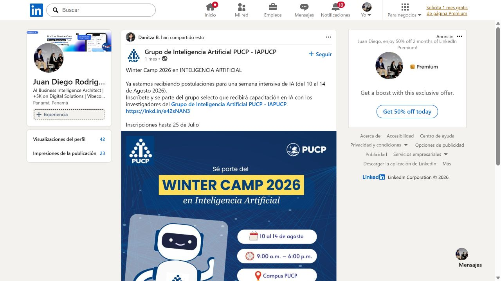

Comentario borrador: “Qué valioso que compartas espacios de formación que conectan estudiantes de tantos países de LATAM. Ese tipo de comunidad hace que aprender IA sea mucho más accesible.”

Publicación 2 — Formación en IA para estudiantes

[Abrir publicación](https://www.linkedin.com/feed/update/urn:li:activity:7478288861001887744/)

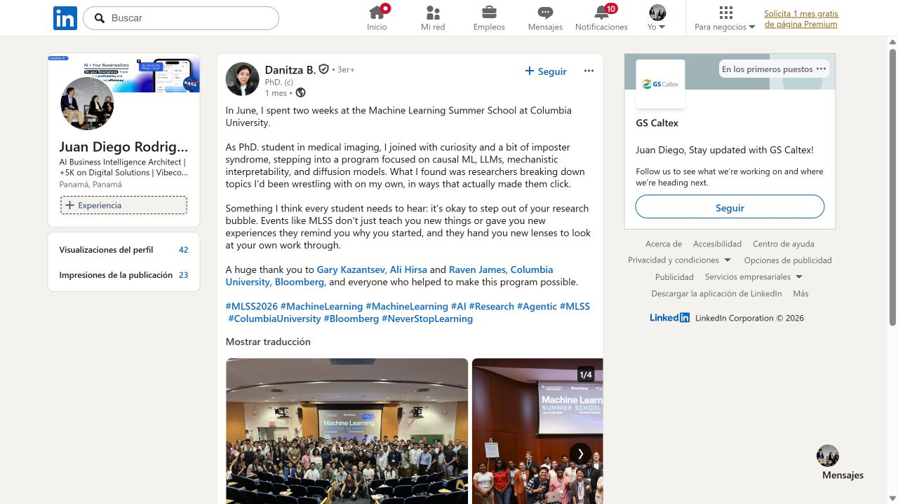

Comentario borrador: “Me gusta el enfoque de aprender con expertos, pero también de crear redes entre estudiantes. Estoy buscando conectar con personas que estén construyendo ese tipo de ecosistema.”

## 3. Astrid Jimenez — Perú

Perfil

[Perfil en LinkedIn](https://pe.linkedin.com/in/astridjimenezz) — estudiante de Comunicación y Marketing en la UPC y parte de Women in AI Perú.

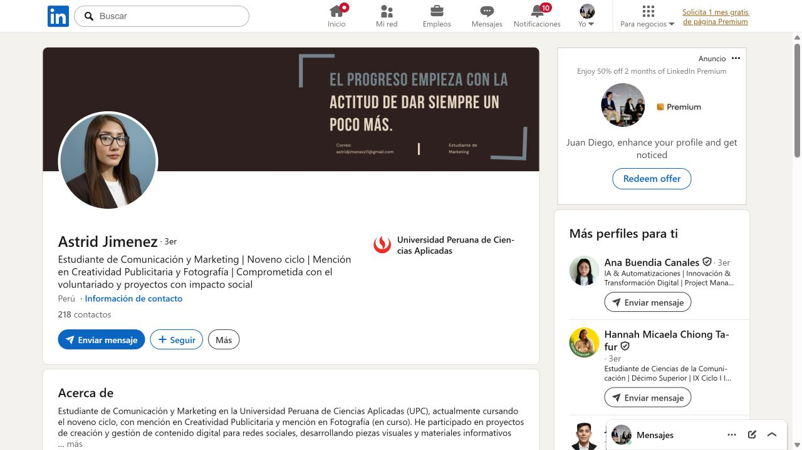

Publicación 1 — Comunidad Women in AI Perú

[Abrir publicación](https://www.linkedin.com/feed/update/urn:li:activity:7409335944153075712/)

Comentario borrador: “Me parece muy importante que existan espacios de IA donde también se construya comunidad y networking. La tecnología crece mucho más cuando las personas tienen un lugar para aprender juntas.”

Publicación 2 — IA aplicada y empleabilidad

[Abrir publicación](https://www.linkedin.com/feed/update/urn:li:activity:7444142360948596736/)

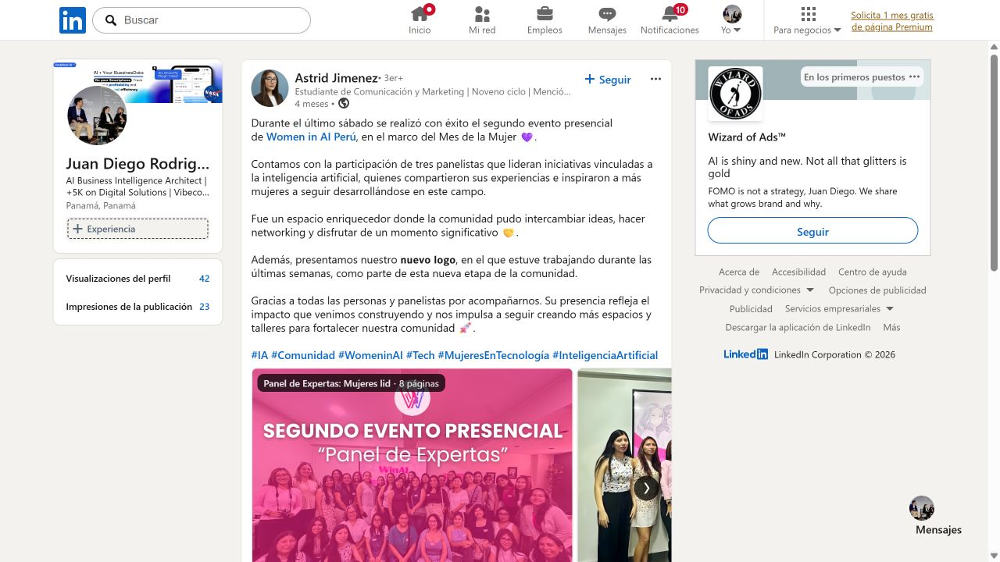

Comentario borrador: “Me gustó que lo plantearas desde la aplicación práctica. No es solo conocer IA, sino aprender a usarla para desarrollar habilidades que tengan valor en el trabajo.”

## 4. Melissa Iman Noriega — Perú

Perfil

[Perfil en LinkedIn](https://pe.linkedin.com/in/melissa-iman) — estudiante de Ciencia de la Computación en la UNI, con proyectos de software, IA y hackathons.

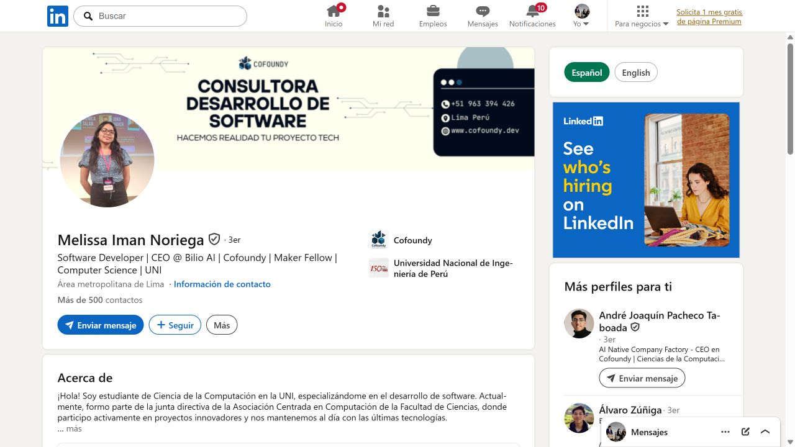

Publicación 1 — START Hack

[Abrir publicación](https://www.linkedin.com/feed/update/urn:li:activity:7261497467857203200/)

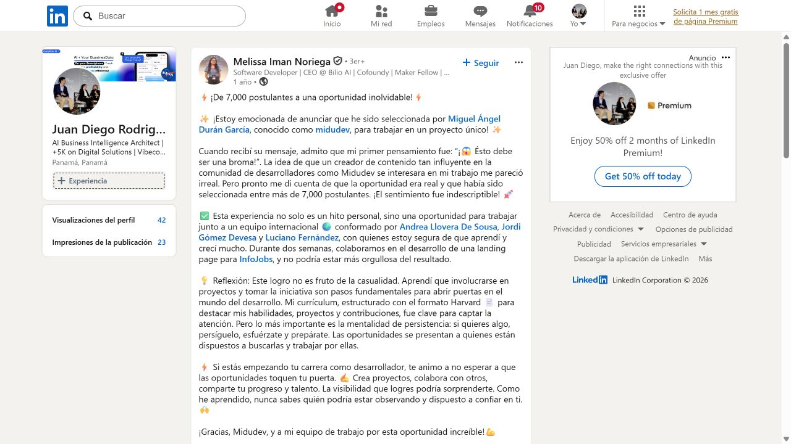

Comentario borrador: “Qué buena experiencia para salir del aula y competir en un entorno internacional. Me interesa mucho cómo esos proyectos ayudan a descubrir qué problemas vale la pena resolver.”

Publicación 2 — Aprendizaje y construcción

[Abrir publicación](https://www.linkedin.com/feed/update/urn:li:activity:7465550650828001280/)

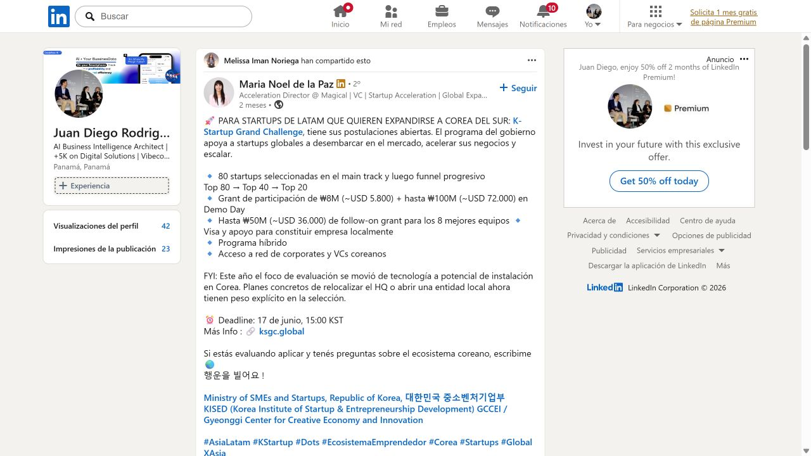

Comentario borrador: “Me identifico con esa idea de aprender construyendo. Muchas veces el conocimiento se vuelve más claro cuando uno intenta convertirlo en un producto o solución concreta.”

## 5. Cristhian Torres — Perú

Perfil

[Perfil en LinkedIn](https://es.linkedin.com/in/cristhiantorresdwbr/en) — perfil académico relacionado con IA, ciencia de datos y proyectos para preservar lenguas indígenas.

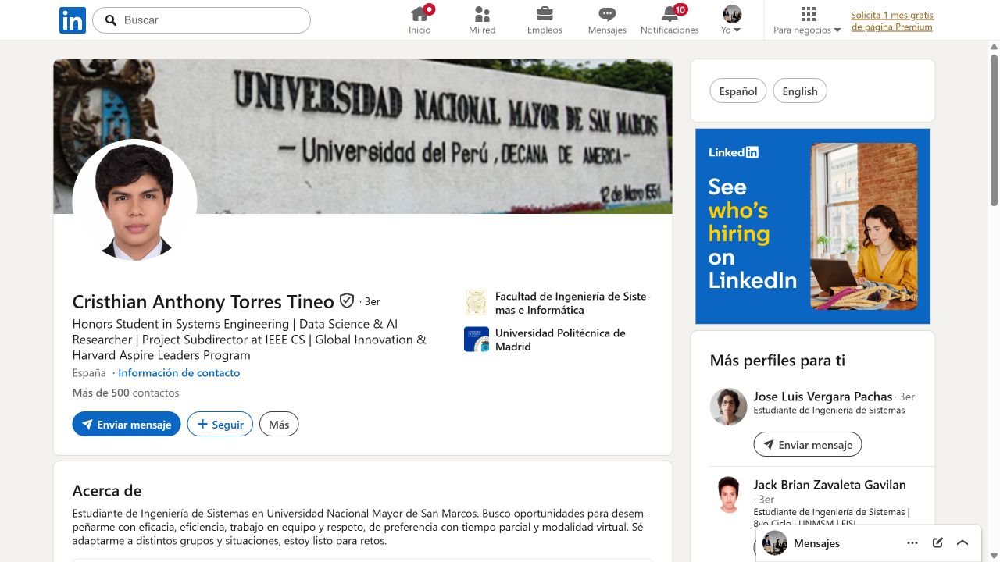

Publicación 1 — Investigación aplicada

[Abrir publicación](https://www.linkedin.com/feed/update/urn:li:activity:7474484836901134336/)

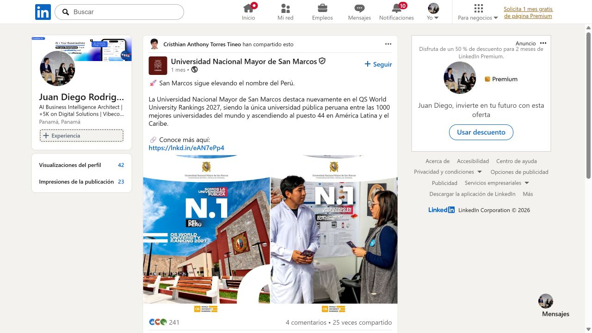

Comentario borrador: “Me parece muy potente aplicar IA a un problema cultural y social concreto. Es un buen recordatorio de que la innovación también puede servir para preservar conocimiento.”

Publicación 2 — IA y lenguas indígenas

[Abrir publicación](https://www.linkedin.com/feed/update/urn:li:activity:7471908553176518656/)

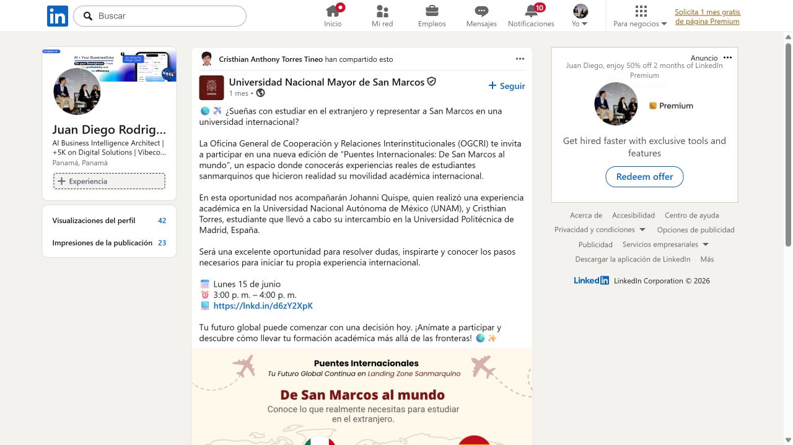

Comentario borrador: “Me gustó que el proyecto tenga una utilidad concreta y una dimensión de inclusión. Ese tipo de aplicación hace que la conversación sobre IA sea mucho más humana.”

## 6. Ana Deng — Panamá

Perfil

[Perfil en LinkedIn](https://pa.linkedin.com/in/ana-deng/es/) — estudiante/profesional en formación vinculada a proyectos de machine learning y análisis de consumo de agua en Panamá.

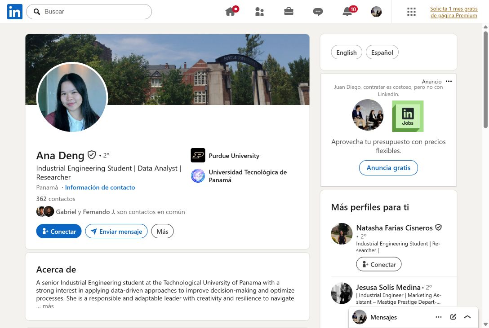

Publicación 1 — Datos y consumo de agua

[Abrir publicación](https://www.linkedin.com/feed/update/urn:li:activity:7489030450141667328/)

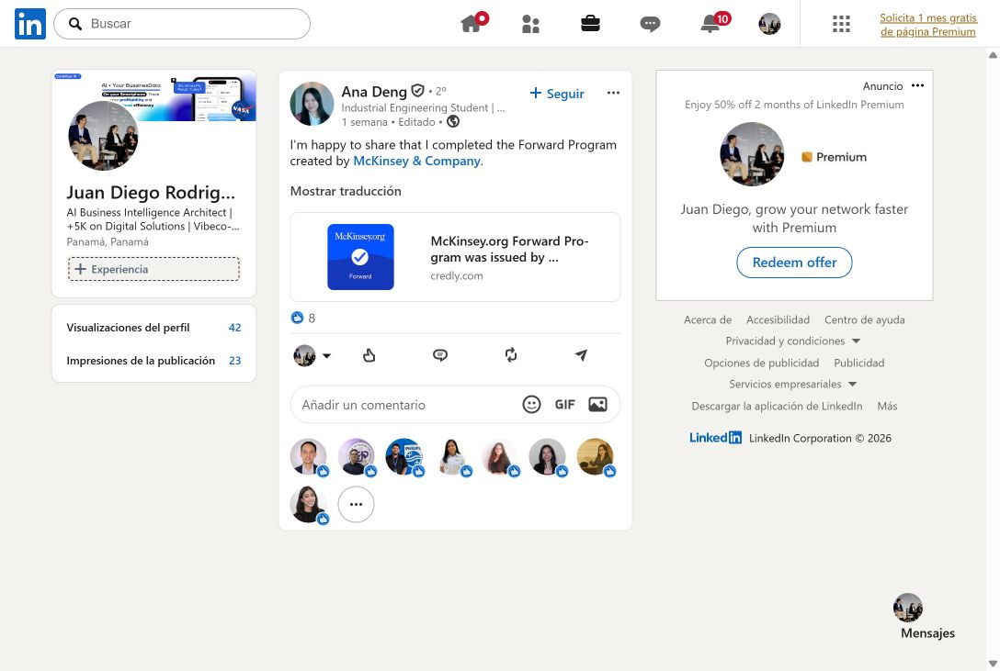

Comentario borrador: “Me interesa mucho ver IA aplicada a un problema local de Panamá. Ese tipo de proyecto demuestra que los datos pueden convertirse en decisiones útiles para el contexto donde vivimos.”

Publicación 2 — Recomendación y machine learning

[Abrir publicación](https://www.linkedin.com/feed/update/urn:li:activity:7489028072491589632/)

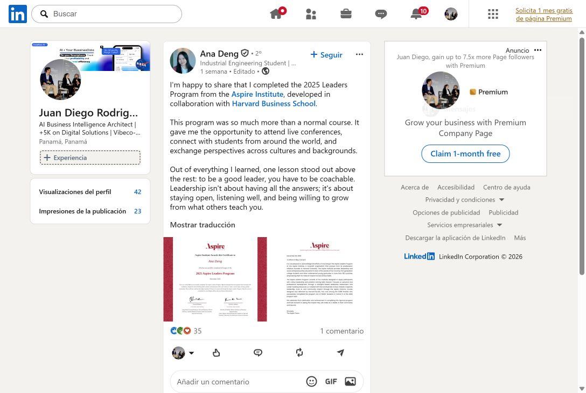

Comentario borrador: “Me parece interesante cómo llevas el machine learning a un caso de uso entendible. Estoy explorando proyectos donde la tecnología se integre al proceso completo y no se quede solo como modelo.”

## 7. Andrés Sarellano — México

Perfil

[Perfil en LinkedIn](https://mx.linkedin.com/in/andres-sarellano) — estudiante de Ingeniería en Sistemas Digitales y Robótica, con foco en robótica, LLMs y agentes.

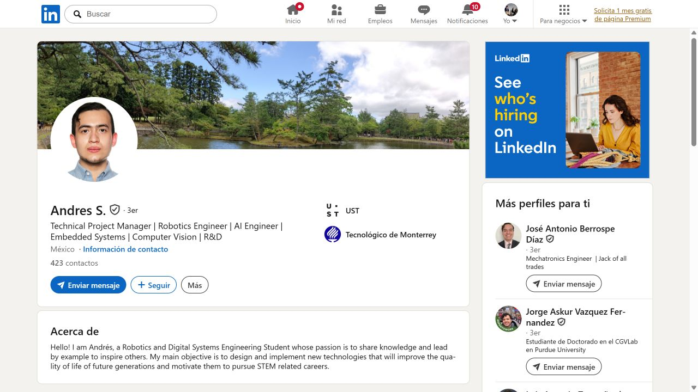

Publicación 1 — Robótica y agentes

[Abrir publicación](https://www.linkedin.com/feed/update/urn:li:activity:7469203668781875201/)

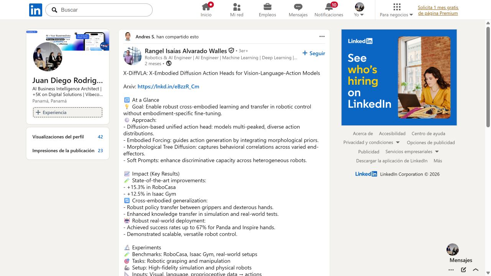

Comentario borrador: “Me interesa mucho la conexión entre robótica y agentes. Es justamente el tipo de integración que puede llevar una capacidad de IA desde una demostración hasta un flujo de trabajo.”

Publicación 2 — Construcción técnica

[Abrir publicación](https://www.linkedin.com/feed/update/urn:li:activity:7371614005770997760/)

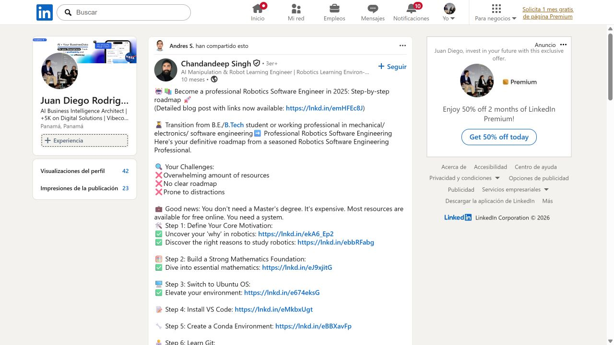

Comentario borrador: “Me gustó ver el enfoque de construir y experimentar. Creo que en IA se aprende mucho cuando se conecta el modelo con un sistema y un problema real.”

## 8. Alexandra Arriagada Pinto — Chile

Perfil

[Perfil en LinkedIn](https://cl.linkedin.com/in/alexandra-arriagada-pinto) — estudiante de magíster en ciencias de la ingeniería en la UC y ML Engineer en CENIA.

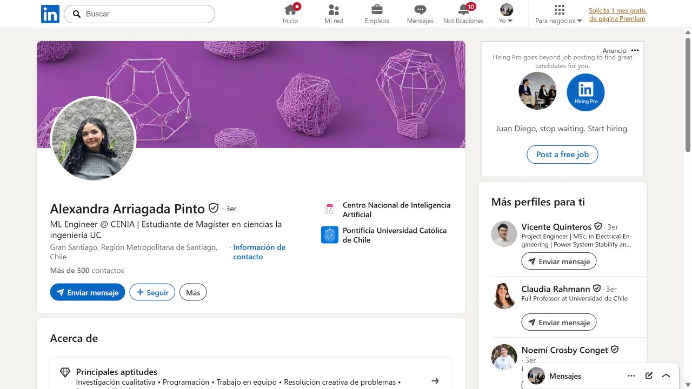

Publicación 1 — LatamGPT y datos regionales

[Abrir publicación](https://www.linkedin.com/feed/update/urn:li:activity:7475302122490736640/)

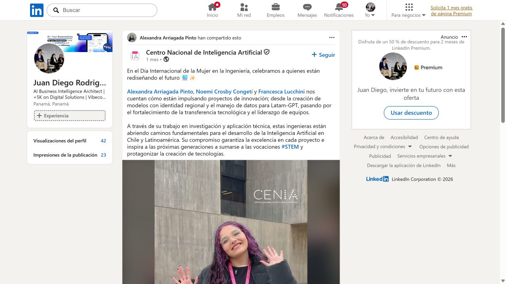

Comentario borrador: “Me parece muy importante trabajar modelos y datos con identidad regional. La IA no debería construirse desconectada de las realidades y lenguajes de Latinoamérica.”

Publicación 2 — Investigación y transferencia

[Abrir publicación](https://www.linkedin.com/feed/update/urn:li:activity:7470599234199707648/)

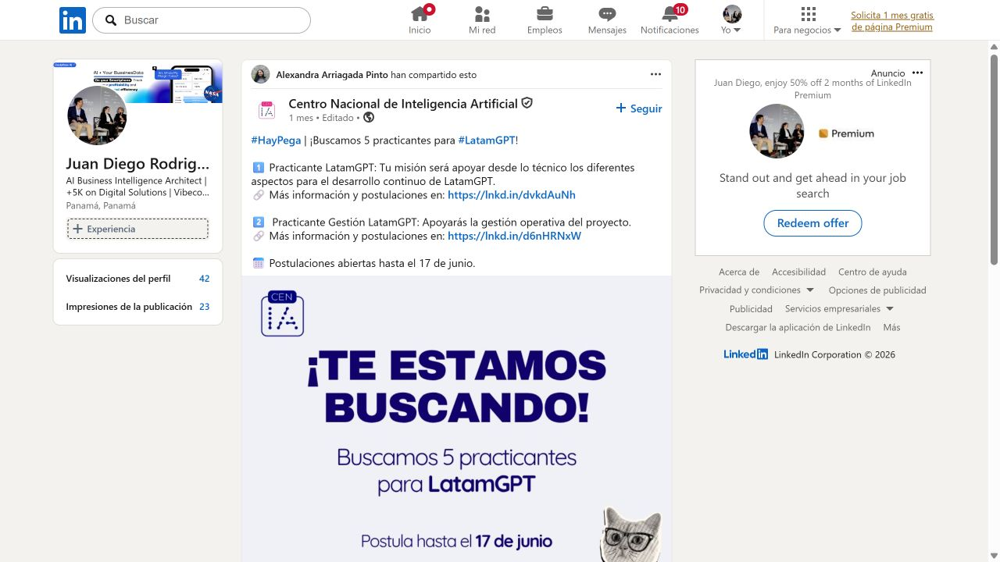

Comentario borrador: “Me interesa mucho cómo conectas investigación con aplicaciones reales. Estoy buscando entender mejor cómo pasar del trabajo técnico a sistemas que otras personas puedan usar.”

## 9. María Valentina González Benavides — Colombia

Candidata en revisión

[Perfil en LinkedIn](https://co.linkedin.com/in/valentinagonzalezb)

Estudiante de maestría en Gestión de la Transformación Digital y Analítica de Negocios. LinkedIn no expuso dos publicaciones directas accesibles durante la revisión, por lo que solo se guardó la captura del perfil.

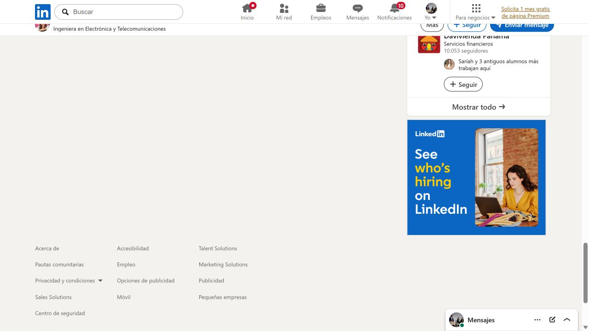

## 10. Isaías Vallejos — Chile

Candidato en revisión

[Perfil en LinkedIn](https://cl.linkedin.com/in/isa%C3%ADas-vallejos)

Estudiante de Ingeniería Civil Industrial en la Universidad de O’Higgins, con intereses en gestión de proyectos, automatización, optimización e IA. LinkedIn no expuso dos publicaciones directas accesibles durante la revisión, por lo que solo se guardó la captura del perfil.

## Mensaje de conexión — borrador

> Hola, [nombre]. Soy Juan Diego y estoy construyendo proyectos alrededor de IA, automatización y sistemas aplicados a problemas reales. Vi tu publicación sobre [tema específico] y me pareció muy interesante. Estoy buscando conectar con estudiantes de LATAM que estén explorando áreas parecidas para aprender y compartir ideas. ¡Un gusto conectar!

Las conexiones y comentarios quedan preparados para revisión; no se ejecutó ninguna acción en LinkedIn.

