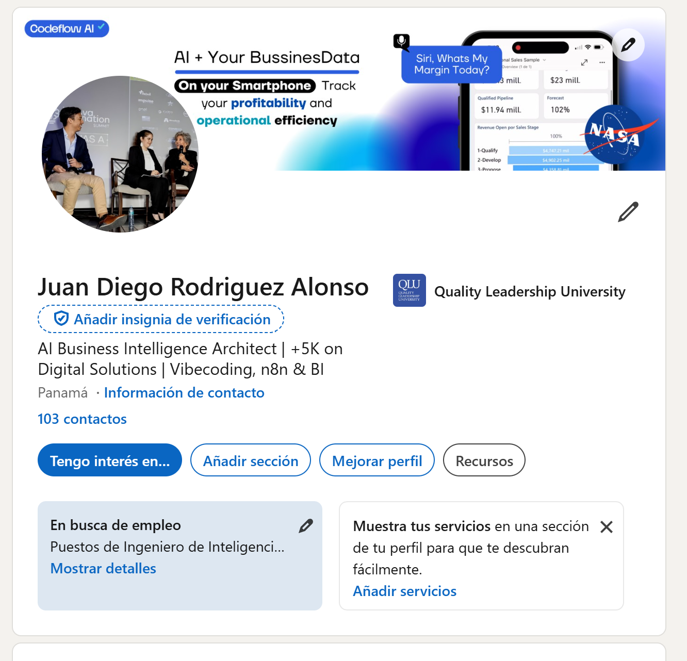

# Perfiles de LinkedIn: María Fernanda y Juan Diego

Documento nuevo para comparar dos perfiles de CodeFlow y organizar cómo se presentan dentro del sistema de networking. Cada página conserva la misma estructura: evidencia visual, identidad profesional, señales relevantes y aplicación para networking B2B.

María Fernanda Arosemena Ríos

### Identidad profesional

- **Nombre:** María Fernanda Arosemena Ríos.
- **Ubicación:** Panamá.
- **Formación visible:** Universidad del Istmo.
- **Entorno profesional visible:** Ciudad del Saber.
- **Descripción visible:** se enfoca en elevar la rentabilidad empresarial mediante la integración de inteligencia artificial en el proceso creativo y estratégico.
- **Red visible:** 5 seguidores y 4 contactos.

### Señales relevantes

Su perfil conecta inteligencia artificial, creatividad, estrategia y rentabilidad. Esa combinación puede ser especialmente útil para CodeFlow porque une la parte técnica de la implementación con la parte de adopción, comunicación y generación de valor para la empresa.

### Valor para networking B2B

Puede ser una conexión relevante para conversar sobre cómo traducir soluciones de IA en resultados de negocio, cómo presentar casos de uso a empresas y cómo integrar creatividad con estrategia. El acercamiento debe ser colaborativo y basado en aprendizaje, no una venta inmediata.

### Enlace

[Abrir perfil de María Fernanda en LinkedIn](https://www.linkedin.com/in/maria-fernanda-arosemena-r%C3%ADos-674537266/)

Juan Diego Rodríguez Alonso

### Identidad profesional

- **Nombre:** Juan Diego Rodríguez Alonso.
- **Ubicación:** Panamá.
- **Formación visible:** Quality Leadership University.
- **Titular visible:** AI Business Intelligence Architect | +5K on Digital Solutions | Vibecoding, n8n & BI.
- **Red visible:** 103 contactos.
- **Estado visible:** en búsqueda de empleo, con interés en puestos de ingeniería de inteligencia artificial.

### Señales relevantes

El perfil combina arquitectura de inteligencia artificial, business intelligence, soluciones digitales, n8n y automatización. También muestra una orientación práctica hacia sistemas y resultados empresariales, que sirve como base para presentar CodeFlow como un ecosistema conectado y no como una automatización aislada.

### Valor para networking B2B

Este perfil funciona como la referencia personal del fundador: comunica capacidad técnica, experiencia construyendo soluciones y una dirección clara hacia sistemas de IA aplicados al negocio. La página puede usarse para revisar coherencia entre la marca personal, CodeFlow y la propuesta de consultoría.

### Enlace

[Abrir perfil de Juan Diego en LinkedIn](https://www.linkedin.com/in/juan-diego-rodriguez-alonso-568b35380/)

## Lectura conjunta

María Fernanda representa el eje creativo-estratégico orientado a rentabilidad y adopción de IA. Juan Diego representa el eje técnico-operativo orientado a BI, automatización e integración. Juntos permiten explicar una propuesta más completa: diseñar soluciones que no solo funcionan técnicamente, sino que también se entienden, se adoptan y se conectan con objetivos de negocio.
