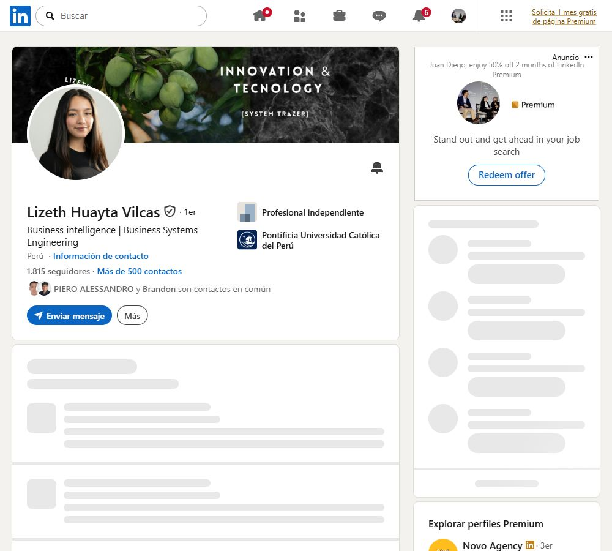
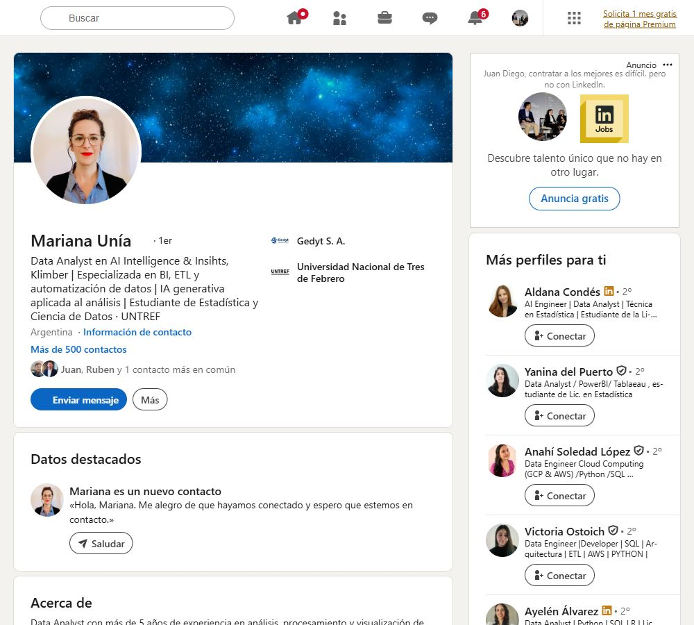

# Primeros 5 contactos de LinkedIn — networking B2B

Capturas tomadas de los primeros cinco contactos visibles en la lista de conexiones de Juan Diego. Este documento solo agrega información nueva; no reemplaza ni modifica los documentos anteriores.

## 1. Darvis Paz Miranda

Perfil y valor B2B

- Perfil: fundador, agentes de IA, deep learning, transformers y liderazgo técnico.
- Enlace: [Abrir perfil en LinkedIn](https://www.linkedin.com/in/darvpm/)
- Valor potencial: contacto técnico y fundador que puede aportar casos de uso, referencias o alianzas para implementar agentes y sistemas de IA en empresas.
- Enfoque de networking: conversar sobre cómo pasar de agentes aislados a soluciones conectadas y repetibles para clientes B2B.

## 2. Lizeth Huayta Vilcas

Perfil y valor B2B

- Perfil: business intelligence y business systems engineering.
- Enlace: [Abrir perfil en LinkedIn](https://www.linkedin.com/in/lizeth-huayta-vilcas-454474211/)
- Valor potencial: posible conexión para proyectos de BI, automatización, integración de sistemas y diseño de soluciones orientadas a procesos empresariales.
- Enfoque de networking: intercambiar aprendizajes sobre cómo conectar datos, operaciones y herramientas de IA dentro de una empresa.

## 3. Angela Sanchez Cutipa

Perfil y valor B2B

- Perfil: ingeniería de sistemas, data analytics, data engineering, business intelligence, big data y transformación digital.
- Enlace: [Abrir perfil en LinkedIn](https://www.linkedin.com/in/angelasz/)
- Valor potencial: perfil alineado con proyectos de datos, dashboards, automatización y transformación digital para clientes empresariales.
- Enfoque de networking: conversar sobre gobernanza de datos y cómo convertir análisis en sistemas operativos útiles para equipos de negocio.

## 4. Mariana Unía

Perfil y valor B2B

- Perfil: data analyst en IA y analytics; BI, ETL, automatización de datos e IA generativa aplicada al análisis; estudiante de Estadística y Ciencia de Datos.
- Enlace: [Abrir perfil en LinkedIn](https://www.linkedin.com/in/mariana-un%C3%ADa/)
- Valor potencial: posible colaboradora para análisis, preparación de datos, automatizaciones y validación de métricas para proyectos B2B.
- Enfoque de networking: compartir cómo estructurar datos y contexto para que la IA produzca decisiones accionables, no solo respuestas aisladas.

## 5. Alvaro Capaceta

Perfil y valor B2B

- Perfil: software developer especializado en estrategias de e-commerce, automatización e IA para crecimiento de startups.
- Enlace: [Abrir perfil en LinkedIn](https://www.linkedin.com/in/ingcapadev/es/)
- Valor potencial: posible aliado para automatizaciones comerciales, sistemas de crecimiento e integraciones para empresas pequeñas y medianas.
- Enfoque de networking: conversar sobre cómo unir adquisición, operaciones y automatización en un sistema que pueda crecer con el cliente.

## Criterio común de selección

Los cinco perfiles tienen una relación directa con IA, datos, automatización, software o sistemas empresariales. Son contactos con potencial para conversaciones de aprendizaje, colaboración, referencias o futuras oportunidades B2B; no se enviaron mensajes ni invitaciones desde este documento.
