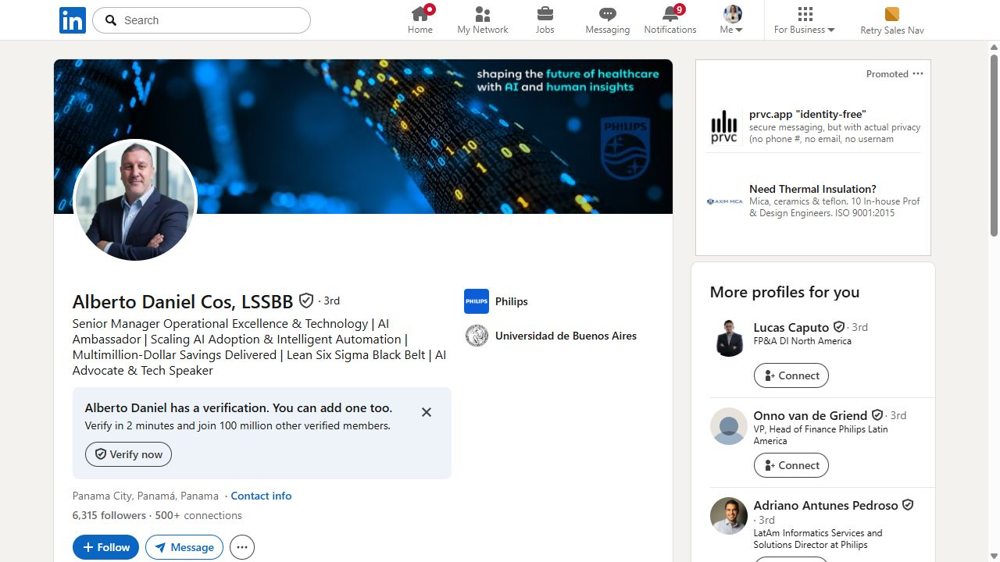
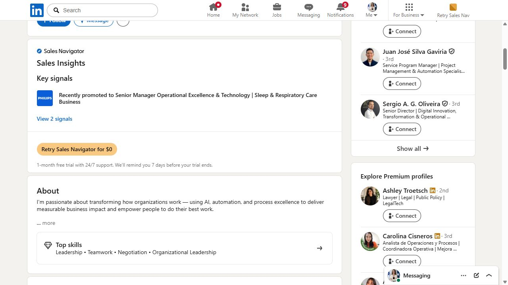
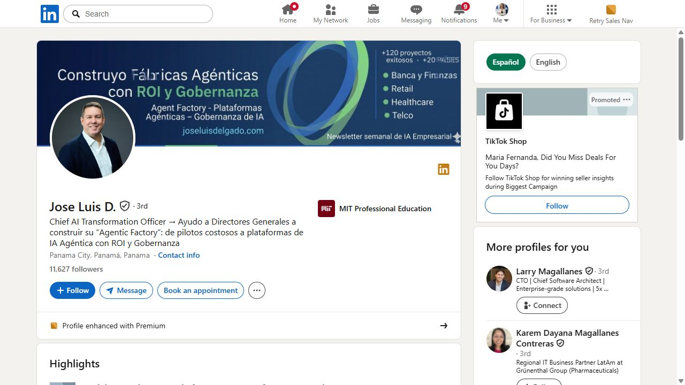
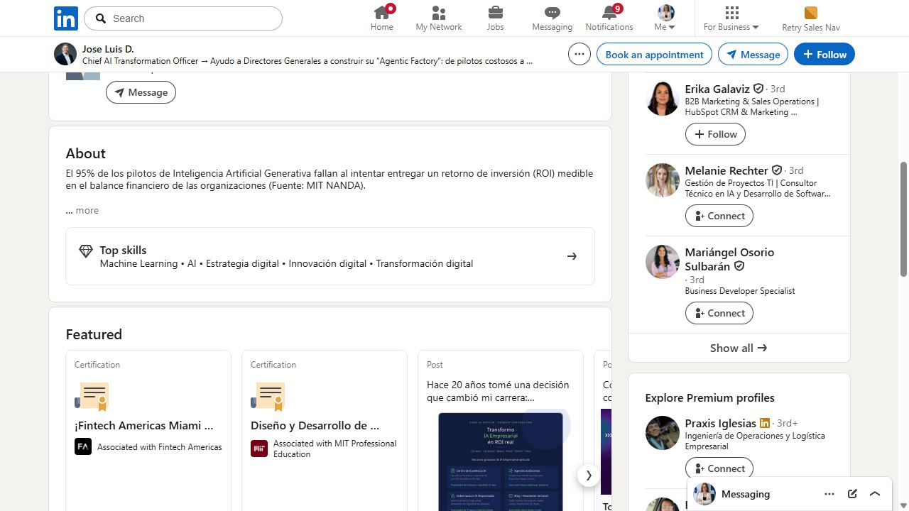
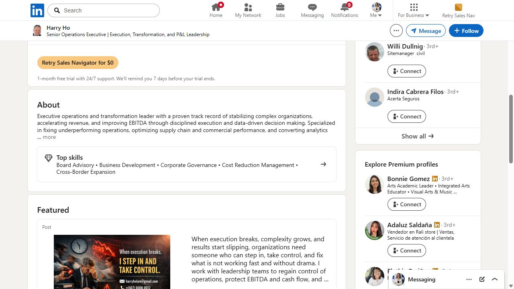
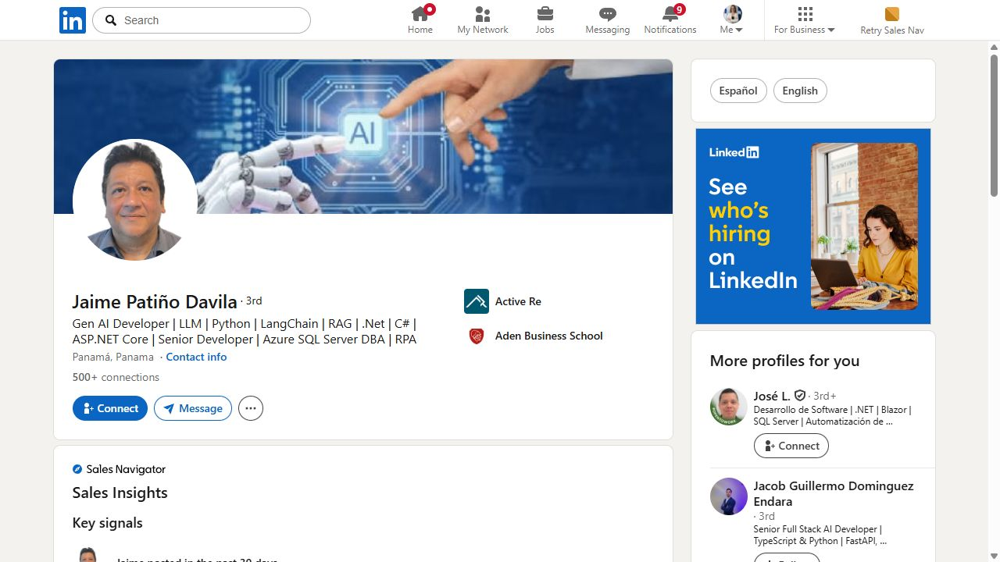
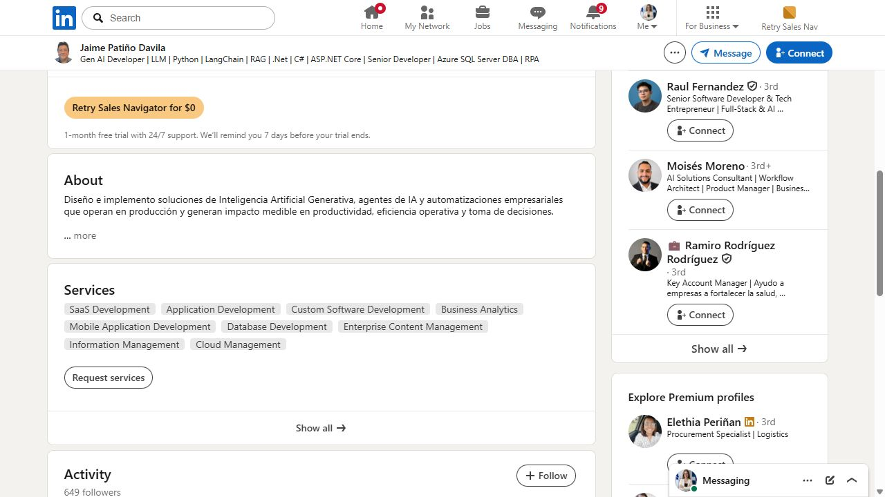
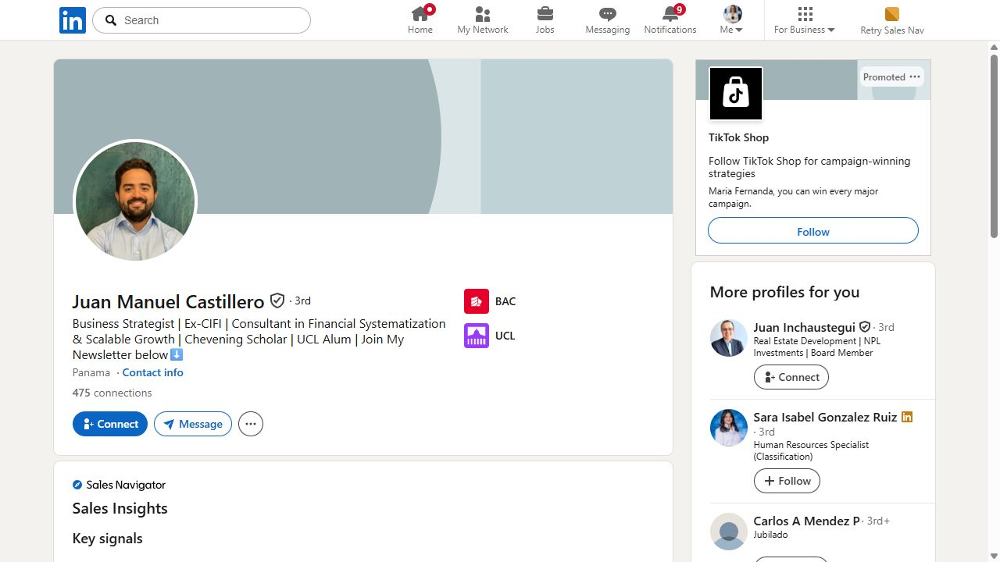
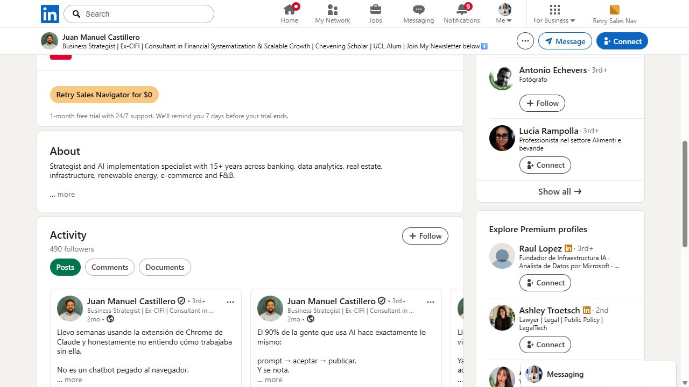

# Shortlist inicial de networking en LinkedIn — IA y automatización en LATAM

> Esta es una primera lista de 5 perfiles. Se seleccionaron por ubicación, temas publicados y cercanía profesional con IA aplicada, automatización, procesos o productos digitales. No se infiere la edad de ninguna persona; la compatibilidad se estima por trayectoria visible, educación y temas de trabajo. Las capturas y textos son para revisión. No se han enviado conexiones ni comentarios.

## Cómo usar esta hoja

1. Abre cada perfil.
2. Revisa que el contenido siga siendo relevante y que no exista una relación previa.
3. Escoge solo **un comentario** por persona para empezar.
4. Comenta primero; después espera interacción antes de enviar la conexión.
5. Personaliza cualquier frase antes de publicarla.

## Persona 1 — Alberto Daniel Cos

<strong>Perfil y por qué puede encajar</strong>

**Perfil:** [Alberto Daniel Cos en LinkedIn](https://pa.linkedin.com/in/albertodanielcos)

**Ubicación visible:** Panamá.

**Tema visible:** transformación organizacional mediante IA y automatización; también publica sobre Lean Six Sigma y habilidades de prompting.

**Por qué encaja:** conecta mejora de procesos con IA, una combinación muy próxima a tu interés por sistemas integrales y no solo herramientas.

<strong>Publicación 1 — IA como conjunto de herramientas</strong>

**Enlace:** [AI is not a tool. It’s a toolkit](https://pa.linkedin.com/in/albertodanielcos)

**Idea visible:** cuestiona tratar la IA como una sola herramienta y la presenta como un conjunto de capacidades.

**Comentario sugerido:**

> Me gustó mucho esta forma de plantearlo. También he estado pensando que el reto no es aprender una herramienta aislada, sino entender cómo combinar varias capacidades dentro de un proceso real de negocio. Muy interesante la conexión con transformación organizacional.

<strong>Publicación 2 — Lean Six Sigma + automatización</strong>

**Enlace:** [Lean Six Sigma + Automation](https://pa.linkedin.com/in/albertodanielcos)

**Comentario sugerido:**

> Me parece muy potente unir Lean Six Sigma con automatización. Muchas veces se intenta automatizar un proceso sin haber entendido bien dónde está el desperdicio o el cuello de botella. Esa combinación puede hacer que la IA tenga un impacto mucho más concreto.

## Persona 2 — José Luis Delgado

<strong>Perfil y por qué puede encajar</strong>

**Perfil:** [José Luis Delgado en LinkedIn](https://pa.linkedin.com/in/jose-luis-delgado-sulbaran)

**Ubicación visible:** Panamá; experiencia regional y trabajo en BeSmart Corp.

**Tema visible:** agentes, RAG, datos empresariales, human-in-the-loop y precisión de sistemas de IA.

**Por qué encaja:** está trabajando en el problema que tú quieres estudiar: pasar de demos y agentes aislados a sistemas empresariales confiables.

<strong>Publicación 1 — Skills y precisión de agentes</strong>

**Enlace:** [Cómo mejorar la precisión de agentes de IA](https://pa.linkedin.com/in/jose-luis-delgado-sulbaran)

**Comentario sugerido:**

> Me llamó mucho la atención este punto porque estoy tratando de entender cómo pasar de tener prompts o agentes separados a construir sistemas que mantengan contexto y funcionen de forma más confiable. La precisión parece depender tanto de la arquitectura como del modelo.

<strong>Publicación 2 — Datos y ROI de agentes</strong>

**Enlace:** [Datos empresariales y ROI de agentes](https://pa.linkedin.com/in/jose-luis-delgado-sulbaran)

**Comentario sugerido:**

> Esta observación sobre los datos me parece clave. A veces se habla de agentes como si el modelo fuera la solución completa, pero si la información de la empresa está desordenada, el resultado difícilmente puede ser confiable. Es un tema que quiero aprender a analizar mejor.

## Persona 3 — Harry Ho

<strong>Perfil y por qué puede encajar</strong>

**Perfil:** [Harry Ho en LinkedIn](https://pa.linkedin.com/in/harryho)

**Ubicación visible:** Panamá.

**Tema visible:** transformación empresarial, datos confiables, reglas de negocio, gobernanza, automatización e IA aplicada.

**Por qué encaja:** su marco de datos + reglas + automatización + IA se parece mucho al tipo de sistema operativo empresarial que quieres conceptualizar.

<strong>Publicación 1 — IA como acelerador</strong>

**Enlace:** [La IA como acelerador de la transformación](https://pa.linkedin.com/in/harryho)

**Comentario sugerido:**

> Me gustó mucho la distinción entre la IA como acelerador y la base real de la transformación. Estoy explorando justamente cómo conectar datos, reglas, automatización y modelos para que una empresa no dependa solo de chats aislados.

<strong>Publicación 2 — edad y oportunidades profesionales</strong>

**Enlace:** [Age is not a barrier to opportunity](https://pa.linkedin.com/in/harryho)

**Comentario sugerido:**

> Me pareció un mensaje muy valioso. Como alguien que está construyendo experiencia temprano en IA, a veces uno siente que primero tiene que saberlo todo antes de empezar. Me quedo con la idea de que también se aprende creando, compartiendo y resolviendo problemas reales.

## Persona 4 — Jaime Patiño Davila

<strong>Perfil y por qué puede encajar</strong>

**Perfil:** [Jaime Patiño Davila en LinkedIn](https://pa.linkedin.com/in/jaime-patino-ai/en)

**Ubicación visible:** Panamá.

**Tema visible:** cobranza, WhatsApp Business, automatización de procesos, analítica empresarial, agentes y transformación digital.

**Por qué encaja:** tiene un caso concreto de IA aplicada a un proceso empresarial y orientado a PYMES, un segmento muy alineado con la hipótesis de CodeFlow.

<strong>Publicación 1 — automatización de cobranza</strong>

**Enlace:** [COLLECT-IA para cobranza](https://pa.linkedin.com/in/jaime-patino-ai/en)

**Comentario sugerido:**

> Me parece un caso muy concreto de cómo la IA puede reducir trabajo repetitivo sin quedarse en una demo. Me gustó especialmente que el sistema no solo envíe mensajes, sino que clasifique la cartera y registre el resultado del proceso.

<strong>Publicación 2 — Advanced RAG</strong>

**Enlace:** [Certificación en Advanced RAG](https://pa.linkedin.com/in/jaime-patino-ai/en)

**Comentario sugerido:**

> Felicidades por la certificación. Estoy aprendiendo cómo RAG y las bases vectoriales pueden ayudar a que un agente trabaje con información específica de una empresa en vez de responder de forma genérica. ¿Qué tipo de casos te parecen más útiles para empezar?

## Persona 5 — Juan Manuel Castillero

<strong>Perfil y por qué puede encajar</strong>

**Perfil:** [Juan Manuel Castillero en LinkedIn](https://pa.linkedin.com/in/juan-manuel-castillero)

**Ubicación visible:** Panamá.

**Tema visible:** estrategia empresarial, productividad, Claude, automatización de navegador, herramientas y modelos de trabajo con IA.

**Por qué encaja:** combina negocio, estrategia y uso práctico de herramientas, y puede ser un contacto cercano por etapa profesional e interés en construir sistemas de trabajo.

<strong>Publicación 1 — Claude y automatización de navegador</strong>

**Enlace:** [Automatización de tareas en el navegador](https://pa.linkedin.com/in/juan-manuel-castillero)

**Comentario sugerido:**

> Me parece interesante que la automatización no se limite a generar texto, sino que también pueda actuar sobre tareas repetitivas del navegador. Estoy explorando cómo conectar este tipo de capacidades dentro de un sistema de trabajo más amplio para una empresa.

<strong>Publicación 2 — modelo humano + IA</strong>

**Enlace:** [Diseñar un modelo de trabajo con humano + IA](https://pa.linkedin.com/in/juan-manuel-castillero)

**Comentario sugerido:**

> Me gustó mucho la idea de diseñar un modelo de trabajo en vez de simplemente intentar trabajar más horas. Es justo la diferencia que estoy tratando de entender: usar IA para construir procesos repetibles, no solo para resolver una tarea puntual cada vez.

## Comparación rápida

| Persona | País | Tema principal | Tipo de conexión | Prioridad |
|---|---|---|---|---|
| Alberto Cos | Panamá | Lean Six Sigma + IA | Mejora de procesos | Alta |
| José Luis Delgado | Panamá/LATAM | Agentes, RAG y datos | Arquitectura y confiabilidad | Alta |
| Harry Ho | Panamá | Datos, reglas y gobernanza | Estrategia operativa | Alta |
| Jaime Patiño | Panamá | IA aplicada a PYMES | Casos de uso y automatización | Muy alta |
| Juan Manuel Castillero | Panamá | Estrategia y productividad con IA | Networking cercano | Muy alta |

## Reglas antes de publicar

<strong>Mensaje de conexión sugerido, solo después de comentar</strong>

> Hola, [nombre]. He estado leyendo tus publicaciones sobre [tema específico]. Estoy construyendo mi experiencia en IA aplicada, automatización y sistemas de trabajo para empresas, y me pareció muy interesante tu enfoque. Me gustaría conectar para aprender y hacer networking profesional en Panamá/LATAM.

<strong>Qué no hacer</strong>

- No copiar el mismo comentario a las cinco personas.
- No mencionar CodeFlow como venta en el primer contacto.
- No enviar conexión inmediatamente después de dos comentarios si no hubo interacción.
- No afirmar que conoces su trayectoria completa.
- No comentar sobre edad; solo sobre trabajo, publicaciones y aprendizaje.

## Estado

Esta hoja contiene 5 perfiles para revisión. Las capturas son evidencia del perfil y del feed visible en el momento de la búsqueda. Los enlaces de publicación apuntan al perfil porque LinkedIn puede cambiar las URLs internas de cada post; antes de comentar, hay que abrir el perfil y confirmar la publicación exacta.

