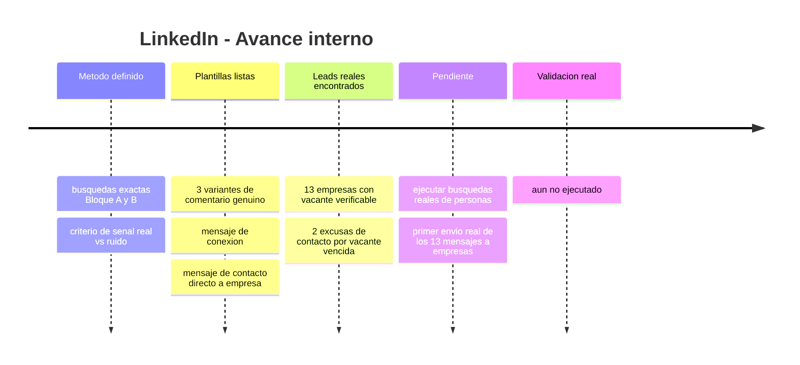
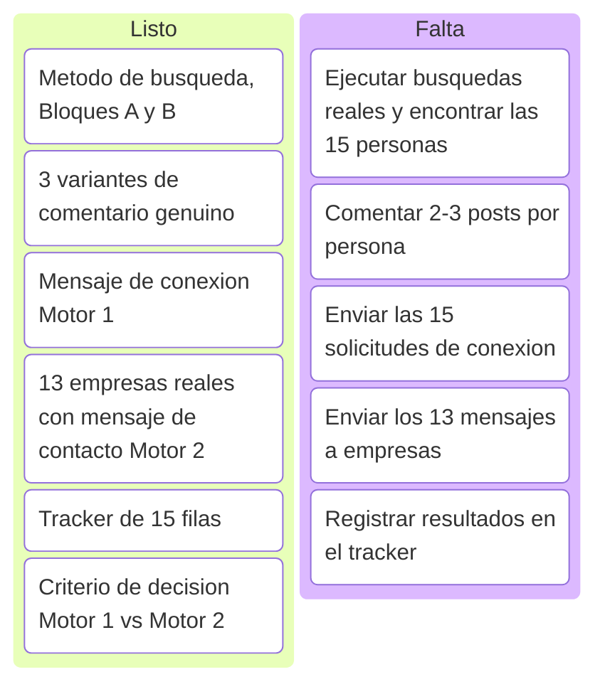
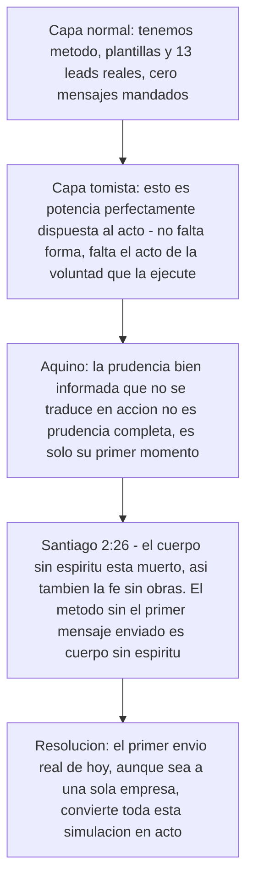
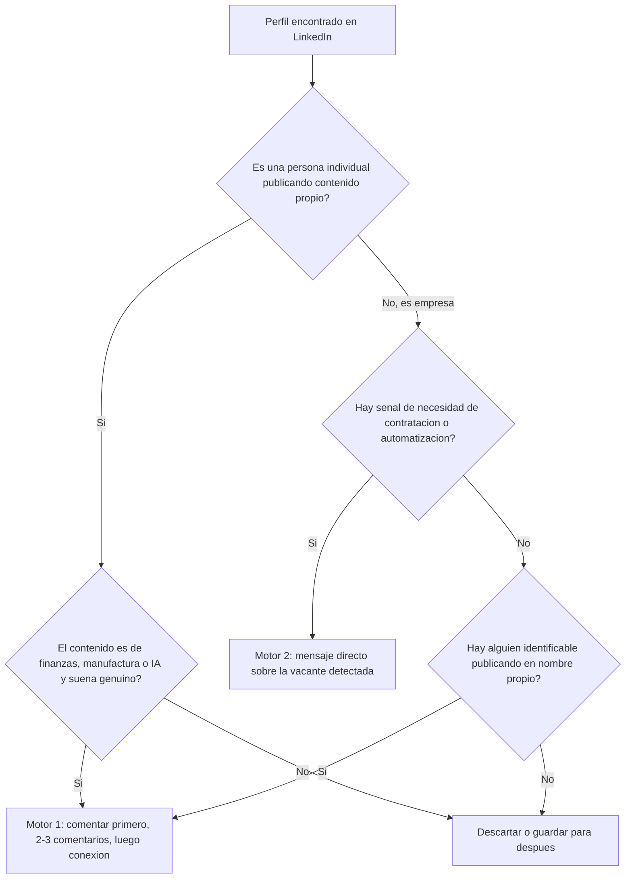

# Simulación LinkedIn — Prospección ICP y contacto directo a empresas

Esta subpágina profundiza la Simulación B del índice general (`indice-simulaciones.md`): el método exacto de networking orgánico (Motor 1) y el listado real de empresas para contacto directo (Motor 2), listo para ejecutar.

<strong>▸ Pasos de la simulación</strong>

1. Correr las búsquedas del Bloque A (manufactura PYME LatAm) y Bloque B (founders/tech IA) en LinkedIn, filtro "Publicaciones", no "Personas".
2. Leer los posts encontrados y separar señal real de ruido (frases tipo "todavía lo hacemos en Excel", "buscamos optimizar el cierre").
3. Comentar genuino (Variantes 1-3) en 2-3 publicaciones de cada persona elegida, antes de conectar.
4. Mandar el mensaje de conexión recién después del 2do-3er comentario real.
5. En paralelo, contactar directo a las 13 empresas con vacante real detectada (Motor 2), sin paso previo de comentarios.
6. Registrar todo en el tracker de 15 filas.

<strong>▸ Línea de tiempo interna (Mermaid)</strong>

<strong>▸ Kanban de progreso (Mermaid)</strong>

<strong>▸ Análisis según Tomás de Aquino</strong>

---

## Motor 2 — 13 empresas reales con vacante o señal de contratación (verificadas por investigación, julio 2026)

*Nota de transparencia: 11 confirmadas activas, 2 (MPR Tools, INDI Staffing) con la vacante ya vencida pero incluidas como excusa válida de contacto — el patrón de contratación de ese perfil es real y recurrente en esas empresas.*

| # | Empresa | Vacante/señal | Link | Estado |
|---|---|---|---|---|
| 1 | Aloware | Automation Engineer (n8n + AI + Data Ops) | [link](https://community.n8n.io/t/hiring-automation-engineer-n8n-ai-data-operations-remote-latam/264735) | Activa |
| 2 | Vidalytics | AI Automation Engineer (MarTech) | [link](https://weworkremotely.com/remote-jobs/vidalytics-ai-automation-engineer-in-house-martech-video-saas) | No confirmada |
| 3 | Twine | Backend Developer – n8n Automation | [link](https://www.linkedin.com/jobs/view/backend-developer-%E2%80%93-n8n-automation-at-twine-4350979775) | Activa |
| 4 | Sagan Recruitment | N8N Automation Specialist (agencia) | [link](https://www.linkedin.com/jobs/view/n8n-automation-specialist-at-sagan-recruitment-4322173231) | Activa |
| 5 | MPR Tools & Equipment | Junior Automation Developer | [link](https://co.linkedin.com/jobs/view/junior-automation-developer-remote-google-apps-script-n8n-js-basic-english-required-at-mpr-tools-equipment-4329518639) | Vencida (excusa válida) |
| 6 | Rem Waste Management | n8n Automation Engineer / AI Process Architect | [link](https://www.linkedin.com/jobs/view/n8n-automation-engineer-%E2%80%93-ai-enabled-process-architect-at-rem-waste-management-4257434611) | Activa |
| 7 | RaveIntelligence | AI Engineer, Full-stack Automation, n8n | [link](https://in.linkedin.com/jobs/view/ai-engineer-full-stack-automation-n8n-at-raveintelligence-4339135883) | Activa |
| 8 | Digital Studio USA | n8n Automation Developer (part-time) | [link](https://pk.linkedin.com/jobs/view/n8n-automation-developer-part-time-remote-at-digital-studio-usa-4377012482) | Activa |
| 9 | Viral Eye Media Analytics | Automation Intern, n8n Workflow Builder | [link](https://www.linkedin.com/jobs/view/automation-intern-n8n-workflow-builder-remote-at-viral-eye-media-analytics-4387928158) | Activa |
| 10 | Trace3 | Data Analyst Power BI | [link](https://remoteok.com/remote-jobs/remote-data-analyst-power-bi-trace3-738075) | Activa |
| 11 | INDI Staffing Services | Power BI Junior Analyst (Panamá) | [link](https://www.linkedin.com/jobs/view/power-bi-junior-analyst-remote-at-indi-staffing-services-4377400617) | Vencida (excusa válida) |
| 12 | Fyndr | Junior AI Automation Engineer | [link](https://in.linkedin.com/jobs/view/junior-ai-automation-engineer-at-fyndr-4436530654) | Activa |
| 13 | Proxify AB | Senior Power BI Developer (canal de colocación) | [link](https://weworkremotely.com/remote-jobs/proxify-ab-senior-microsoft-power-bi-developer-3) | Activa |

**Mensaje base para las 13 (adaptar la primera línea a cada vacante):**
> "Hola, vi [la vacante/señal específica de la empresa]. Construí un sistema de nómina multi-país (NóminaPro) que redujo el tiempo de procesamiento en 97%, y diseñé 15 sistemas de automatización para Copper Group/1HVAC (orquestador multi-agente, pricing dinámico, forecasting con ML, entre otros). Me encantaría mostrarte cómo aplicaría ese enfoque a lo que están construyendo. ¿15 min esta semana?"

**No incluidas por no ser vacantes verificables (canales alternativos a evaluar aparte):** LatamCent, Simera, Near — son agencias que colocan talento LatAm en empresas de EEUU, no publican vacante propia. Podrían sumarse como partners de colocación en una ronda futura, no como leads de outreach directo.

---

## Motor 1 — Búsqueda de las 15 personas (método exacto)

**Regla base: filtro "Publicaciones" en LinkedIn, no "Personas" — buscás gente hablando del tema hoy, no cargos estáticos.**

### Bloque A — Manufactura PYME LatAm
`"gerente financiero" manufactura Panamá` · `"director financiero" pyme manufactura` · `CFO pyme manufactura Latinoamérica` · `"control de costos" fábrica Panamá` · `"flujo de caja" manufactura pyme` · `automatización contable manufactura` · `"cierre contable" fábrica OR planta`

Filtro adicional: Ubicación (Panamá, Colombia, México, Costa Rica, RD) + Sector (Manufactura/Fabricación).

### Bloque B — Founders/tech IA
`founder fintech automatización IA` · `"buscamos" automatización financiera IA` · `CFO startup IA finanzas` · `"agentes de IA" finanzas` · `RPA finanzas pyme` · `"transformación digital" área financiera`

**Señal real de compra (priorizar):** posts que digan "estamos armando el área", "buscamos optimizar el cierre", "todavía hacemos esto en Excel", "contratamos/evaluamos herramientas de automatización".

### 3 variantes de comentario genuino (completar el placeholder con algo real del post — si no hay nada específico, no comentar)

**Variante 1:** "Muy bueno el punto sobre [detalle concreto del post]. Yo trabajo del lado de automatización financiera con IA en manufactura y coincido en que [ángulo relacionado] es donde más tiempo se pierde. Gracias por compartirlo."

**Variante 2:** "[Detalle concreto del post] me hizo pensar en algo que veo seguido en pymes de manufactura: ¿cómo resolvieron el tema de [problema relacionado] antes de llegar a este punto?"

**Variante 3:** "Coincido totalmente con [detalle concreto del post]. En un cliente de manufactura reciente vimos algo parecido: [cifra o resultado real propio] justo por atacar ese mismo cuello de botella. Buen aporte."

### Mensaje de conexión (después del 2do-3er comentario genuino)

> "Hola [Nombre], venimos coincidiendo en varios comentarios sobre [tema recurrente de sus posts] y me gustó cómo lo planteás. Trabajo en automatización financiera con IA para manufactura — [cifra real propia, ej. reduje un cierre contable de X a Y días]. Me sumo a tu red para seguir viendo lo que compartís."

*Sin pedir nada en este mensaje — es solo apertura de red.*

### Flowchart de decisión — Motor 1 vs Motor 2

### Tracker (15 personas/empresas) — con leads reales encontrados por búsqueda

Encontrados vía búsqueda web (no LinkedIn logueado) — 4 verificados con el contenido completo leído, 11 solo con snippet del buscador (título/fragmento, hay que abrir el link y confirmar antes de comentar). Cada uno tiene 1 link real; el segundo campo de link queda para que completes vos con una 2da publicación de esa misma persona una vez entres a su perfil.

**Persona 1 — Fernando Herrera**
- **Tema:** agentes de IA con n8n y MCP · **Estado:** solo snippet, verificar antes de comentar
- **Publicación 1 — Link:** https://es.linkedin.com/posts/fernando-herrera-b6b204200_n8n-mcp-agentesia-activity-7455624990852452352-gG4m
  **Comentario (editar tras leer el post real):** "Muy bueno el punto sobre [detalle concreto de esta publicación]. Yo trabajo del lado de automatización financiera con IA en manufactura y coincido en que [ángulo relacionado] es donde más tiempo se pierde. Gracias por compartirlo."
- **Publicación 2 — Link:** _____________ (buscar 2da publicación reciente en su perfil)
- **Fecha conexión enviada:** _____________  **¿Aceptó?:** _____________

**Persona 2 — Manolo Quispe Campos (Colombia)**
- **Tema:** matriz de seguimiento de tareas de proyectos en Power BI · **Estado:** solo snippet
- **Publicación 1 — Link:** https://co.linkedin.com/posts/manoloquispecampos_matriz-de-seguimiento-de-tareas-para-proyectos-activity-7028031394316439553-tPEf
  **Comentario (editar tras leer el post real):** "Muy bueno el enfoque de la matriz para seguimiento de proyectos. Yo vengo del lado de automatización financiera con Power BI — coincido en que el drill-down por área es donde más valor se pierde si no está bien armado. Gracias por compartirlo."
- **Publicación 2 — Link:** _____________
- **Fecha conexión enviada:** _____________  **¿Aceptó?:** _____________

**Persona 3 — Grant Thornton Costa Rica**
- **Tema:** IA en auditoría financiera (abril 2026) · **Estado:** solo snippet
- **Publicación 1 — Link:** https://es.linkedin.com/posts/grant-thornton-costa-rica_la-inteligencia-artificial-en-la-auditor%C3%ADa-activity-7447750135662395392-MXqY
  **Comentario (editar tras leer el post real):** "Coincido con el enfoque sobre IA en auditoría financiera. Armé sistemas similares de automatización financiera con IA (97% de ahorro de tiempo en un proceso de nómina) — el punto de [detalle concreto] aplica directo a lo que veo en manufactura."
- **Publicación 2 — Link:** _____________
- **Fecha conexión enviada:** _____________  **¿Aceptó?:** _____________

**Persona 4 — Drivepoint**
- **Tema:** por qué los equipos de finanzas no son anti-IA, necesitan otro enfoque de adopción · **Estado:** solo snippet
- **Publicación 1 — Link:** https://www.linkedin.com/posts/drivepoint-io_most-finance-teams-arent-anti-ai-they-activity-7470152252817842176-0SgP
  **Comentario (editar tras leer el post real):** "Totalmente de acuerdo — el problema no es resistencia a la IA, es que la adopción se hace mal. Vi lo mismo automatizando cuentas por cobrar: el cambio real vino de rediseñar el proceso, no de agregar IA encima."
- **Publicación 2 — Link:** _____________
- **Fecha conexión enviada:** _____________  **¿Aceptó?:** _____________

**Persona 5 — Wisy AI (Panamá)**
- **Tema:** hiring en IA, oficinas Silicon Valley–Panamá · **Estado:** solo snippet
- **Publicación 1 — Link:** https://www.linkedin.com/posts/wisyai_hiring-aijobs-techstartups-activity-7449848957293264896-9IAL
  **Comentario (editar tras leer el post real):** "Buenísimo ver una empresa con presencia en Panamá construyendo en IA. Vengo del lado de automatización financiera con IA (97% de ahorro de tiempo en un proceso real) — si en algún momento buscan este perfil, encantado de conversar."
- **Publicación 2 — Link:** _____________
- **Fecha conexión enviada:** _____________  **¿Aceptó?:** _____________

**Persona 6 — Ben Murray (Fractional CFO SaaS, SoftwareMetrics.ai)**
- **Tema:** "AI doesn't fix a messy process, AI exposes it" — framework de qué automatizar y qué dejar en juicio humano · **Estado:** verificado, leído completo
- **Publicación 1 — Link:** https://www.linkedin.com/posts/benrmurray_saas-activity-7431812194629230592-ZOg1
  **Comentario (listo):** "Totalmente de acuerdo con que la IA expone el proceso desordenado en vez de arreglarlo — lo vi de primera mano automatizando nómina multi-país: el 97% de ahorro de tiempo solo llegó después de rediseñar el proceso, no antes de meter IA. Buen framework para separar juicio humano de lo automatizable."
- **Publicación 2 — Link:** _____________
- **Fecha conexión enviada:** _____________  **¿Aceptó?:** _____________

**Persona 7 — Paul Lynch (CEO Centage.com / Venture Partner Scaleworks)**
- **Tema:** "CFOs: Don't Fall for AI Vaporware" — caso real de $400K gastados en un AI analyst inútil, "AI models are probabilistic, finance is deterministic" · **Estado:** verificado, leído completo
- **Publicación 1 — Link:** https://www.linkedin.com/posts/paulglynch_cfo-fpanda-ai-activity-7414318019495141376-Lg5L
  **Comentario (listo):** "La distinción entre modelos probabilísticos y finanzas deterministas es exactamente donde más veo fallar implementaciones de automatización financiera. Construí sistemas reales (nómina, cuentas por cobrar) midiendo siempre el resultado en dólares antes de llamarlo éxito — coincido en no caer en vaporware sin números."
- **Publicación 2 — Link:** _____________
- **Fecha conexión enviada:** _____________  **¿Aceptó?:** _____________

**Persona 8 — Andrew Dimitruk (Co-fundador Ironflow AI, ex-COO Shield AI)**
- **Tema:** lanzamiento de Ironflow, ERP nativo de IA para manufactura, "AI fails when bolted onto architectures never designed for it" · **Estado:** verificado, leído completo
- **Publicación 1 — Link:** https://www.linkedin.com/posts/andrewdimitruk_ironflow-ai-activity-7391540149551026176-hWlM
  **Comentario (listo):** "Coincido totalmente con que la IA falla cuando se pega sobre arquitecturas que no fueron diseñadas para eso. Construyendo automatización para un grupo multi-país (15 sistemas entregados, desde forecasting hasta pricing dinámico) el mayor riesgo siempre fue forzar IA sobre procesos legacy en vez de rediseñar la base primero."
- **Publicación 2 — Link:** _____________
- **Fecha conexión enviada:** _____________  **¿Aceptó?:** _____________

**Persona 9 — Bahaa Dawoud (finanzas, UAE)**
- **Tema:** "Cash-flow forecasting requires a human touch" — forecasting con IA útil pero requiere data limpia y supervisión humana por sesgos · **Estado:** verificado, leído completo
- **Publicación 1 — Link:** https://www.linkedin.com/posts/bahaa-dawoud_cash-flow-forecasting-requires-a-human-touch-activity-7115554724338163712-3JSM
  **Comentario (listo):** "De acuerdo en que el forecasting de flujo de caja necesita supervisión humana. En un sistema de cobranza que armé (cartera de 6 cifras en 3 países, 20% optimizada en un mes) la predicción automática solo funcionó bien después de limpiar bien la data de entrada, tal como decís."
- **Publicación 2 — Link:** _____________
- **Fecha conexión enviada:** _____________  **¿Aceptó?:** _____________

**Persona 10 — StratiqAI**
- **Tema:** "Financial Memory Diagnostic for Founders" — herramienta de AI CFO, memoria financiera en tiempo real · **Estado:** solo snippet
- **Publicación 1 — Link:** https://www.linkedin.com/posts/stratiqai_stratiqai-aicfo-founderfinance-activity-7462218528813850624-iRFC
  **Comentario (editar tras leer el post real):** "Interesante el enfoque de memoria financiera para founders. Vengo construyendo sistemas similares de analítica financiera con IA — coincido en que [detalle concreto] es el punto donde más se pierde visibilidad."
- **Publicación 2 — Link:** _____________
- **Fecha conexión enviada:** _____________  **¿Aceptó?:** _____________

**Persona 11 — Christian Wattig (FP&A Corporate Trainer)**
- **Tema:** rol de la IA en formación/evaluación de habilidades de FP&A · **Estado:** solo snippet
- **Publicación 1 — Link:** https://www.linkedin.com/posts/christian-wattig_ai-voted-me-the-1-fpa-corporate-trainer-activity-7445477688015912960-9rIN
  **Comentario (editar tras leer el post real):** "Buen punto sobre el rol de la IA en FP&A. Desde el lado de automatización financiera veo algo parecido: [detalle concreto de esta publicación]. Gracias por compartirlo."
- **Publicación 2 — Link:** _____________
- **Fecha conexión enviada:** _____________  **¿Aceptó?:** _____________

**Persona 12 — Emre Kazdagli (Founder, Arc Intelligence)**
- **Tema:** lanzamiento de plataforma de IA para deal teams de crédito privado · **Estado:** solo snippet
- **Publicación 1 — Link:** https://www.linkedin.com/posts/ekazdagli_today-is-a-huge-milestone-for-arc-and-our-activity-7264693532588687360-KxWb
  **Comentario (editar tras leer el post real):** "Felicitaciones por el lanzamiento. Vengo del lado de automatización financiera con IA aplicada a manufactura/distribución — coincido en que [detalle concreto] es el punto donde más valor hay para capturar."
- **Publicación 2 — Link:** _____________
- **Fecha conexión enviada:** _____________  **¿Aceptó?:** _____________

**Persona 13 — Vivek Goel (WonderBotz, RPA-as-a-Service)**
- **Tema:** caso de estudio real — cómo Equinix usó RPA de WonderBotz para automatizar infraestructura · **Estado:** solo snippet
- **Publicación 1 — Link:** https://www.linkedin.com/posts/vivek-goel-2271a516_wonderbotz-case-study-how-equinix-used-rpa-activity-7046647148339212288-X_fI
  **Comentario (editar tras leer el post real):** "Muy bueno el caso de Equinix. Yo construí automatizaciones similares para un grupo multi-país (15 sistemas entregados) — coincido en que [detalle concreto del caso] es donde más se nota el ROI real de RPA."
- **Publicación 2 — Link:** _____________
- **Fecha conexión enviada:** _____________  **¿Aceptó?:** _____________

**Persona 14 — Embat (fintech española, tesorería con agentes de IA)**
- **Tema:** "Agentes de IA para finanzas: qué son y casos de uso" · **Estado:** solo snippet
- **Publicación 1 — Link:** https://es.linkedin.com/posts/embat-io_agentes-de-ia-para-finanzas-qu%C3%A9-son-y-casos-activity-7480244527149125633-Qyzx
  **Comentario (editar tras leer el post real):** "Buen resumen de casos de uso de agentes de IA en finanzas. Coincido en que [detalle concreto de esta publicación] — lo vi de primera mano automatizando tesorería y cobranza para un cliente multi-país."
- **Publicación 2 — Link:** _____________
- **Fecha conexión enviada:** _____________  **¿Aceptó?:** _____________

**Persona 15 — Ionix Latam**
- **Tema:** "La inteligencia artificial es mi asesor financiero" — caso de uso de IA como asesor financiero · **Estado:** solo snippet
- **Publicación 1 — Link:** https://es.linkedin.com/posts/ionix_la-inteligencia-artificial-es-mi-asesor-financiero-activity-7475648755317530624-HDGJ
  **Comentario (editar tras leer el post real):** "Me identifico con el enfoque de IA como asesor financiero. Construí sistemas parecidos de analítica y automatización financiera — coincido en que [detalle concreto] es clave para que esto funcione bien."
- **Publicación 2 — Link:** _____________
- **Fecha conexión enviada:** _____________  **¿Aceptó?:** _____________
