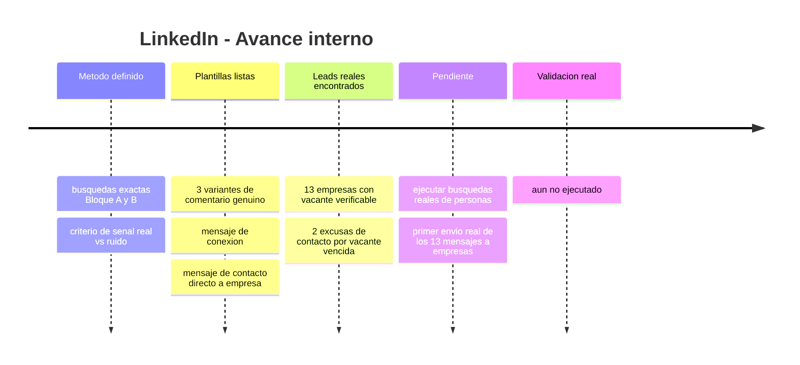
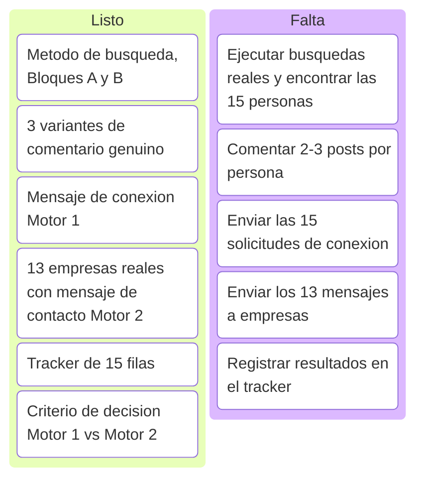
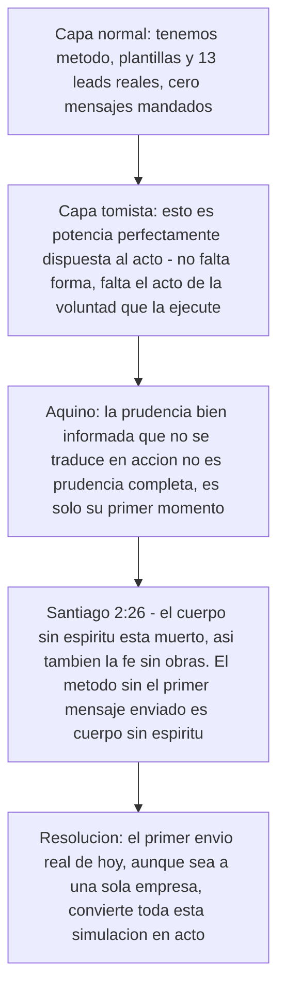
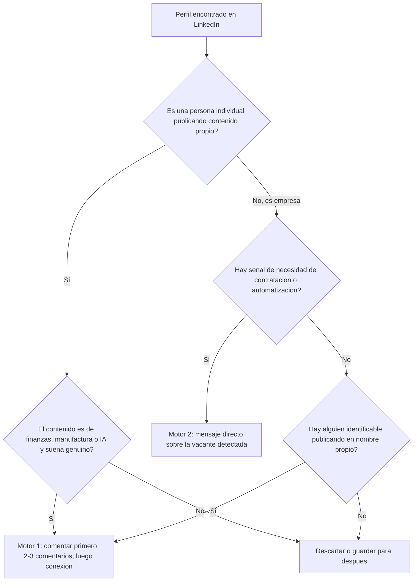

# Simulación LinkedIn — Prospección ICP y contacto directo a empresas

Esta subpágina profundiza la Simulación B del índice general (`indice-simulaciones.md`): el método exacto de networking orgánico (Motor 1) y el listado real de empresas para contacto directo (Motor 2), listo para ejecutar.

<strong>▸ Pasos de la simulación</strong>

1. Correr las búsquedas del Bloque A (manufactura PYME LatAm) y Bloque B (founders/tech IA) en LinkedIn, filtro "Publicaciones", no "Personas".
2. Leer los posts encontrados y separar señal real de ruido (frases tipo "todavía lo hacemos en Excel", "buscamos optimizar el cierre").
3. Comentar genuino (Variantes 1-3) en 2-3 publicaciones de cada persona elegida, antes de conectar.
4. Mandar el mensaje de conexión recién después del 2do-3er comentario real.
5. En paralelo, contactar directo a las 13 empresas con vacante real detectada (Motor 2), sin paso previo de comentarios.
6. Registrar todo en el tracker de 15 filas.

<strong>▸ Línea de tiempo interna (Mermaid)</strong>

<strong>▸ Kanban de progreso (Mermaid)</strong>

<strong>▸ Análisis según Tomás de Aquino</strong>

---

## Motor 2 — 13 empresas reales con vacante o señal de contratación (verificadas por investigación, julio 2026)

*Nota de transparencia: 11 confirmadas activas, 2 (MPR Tools, INDI Staffing) con la vacante ya vencida pero incluidas como excusa válida de contacto — el patrón de contratación de ese perfil es real y recurrente en esas empresas.*

| # | Empresa | Vacante/señal | Link | Estado |
|---|---|---|---|---|
| 1 | Aloware | Automation Engineer (n8n + AI + Data Ops) | [link](https://community.n8n.io/t/hiring-automation-engineer-n8n-ai-data-operations-remote-latam/264735) | Activa |
| 2 | Vidalytics | AI Automation Engineer (MarTech) | [link](https://weworkremotely.com/remote-jobs/vidalytics-ai-automation-engineer-in-house-martech-video-saas) | No confirmada |
| 3 | Twine | Backend Developer – n8n Automation | [link](https://www.linkedin.com/jobs/view/backend-developer-%E2%80%93-n8n-automation-at-twine-4350979775) | Activa |
| 4 | Sagan Recruitment | N8N Automation Specialist (agencia) | [link](https://www.linkedin.com/jobs/view/n8n-automation-specialist-at-sagan-recruitment-4322173231) | Activa |
| 5 | MPR Tools & Equipment | Junior Automation Developer | [link](https://co.linkedin.com/jobs/view/junior-automation-developer-remote-google-apps-script-n8n-js-basic-english-required-at-mpr-tools-equipment-4329518639) | Vencida (excusa válida) |
| 6 | Rem Waste Management | n8n Automation Engineer / AI Process Architect | [link](https://www.linkedin.com/jobs/view/n8n-automation-engineer-%E2%80%93-ai-enabled-process-architect-at-rem-waste-management-4257434611) | Activa |
| 7 | RaveIntelligence | AI Engineer, Full-stack Automation, n8n | [link](https://in.linkedin.com/jobs/view/ai-engineer-full-stack-automation-n8n-at-raveintelligence-4339135883) | Activa |
| 8 | Digital Studio USA | n8n Automation Developer (part-time) | [link](https://pk.linkedin.com/jobs/view/n8n-automation-developer-part-time-remote-at-digital-studio-usa-4377012482) | Activa |
| 9 | Viral Eye Media Analytics | Automation Intern, n8n Workflow Builder | [link](https://www.linkedin.com/jobs/view/automation-intern-n8n-workflow-builder-remote-at-viral-eye-media-analytics-4387928158) | Activa |
| 10 | Trace3 | Data Analyst Power BI | [link](https://remoteok.com/remote-jobs/remote-data-analyst-power-bi-trace3-738075) | Activa |
| 11 | INDI Staffing Services | Power BI Junior Analyst (Panamá) | [link](https://www.linkedin.com/jobs/view/power-bi-junior-analyst-remote-at-indi-staffing-services-4377400617) | Vencida (excusa válida) |
| 12 | Fyndr | Junior AI Automation Engineer | [link](https://in.linkedin.com/jobs/view/junior-ai-automation-engineer-at-fyndr-4436530654) | Activa |
| 13 | Proxify AB | Senior Power BI Developer (canal de colocación) | [link](https://weworkremotely.com/remote-jobs/proxify-ab-senior-microsoft-power-bi-developer-3) | Activa |

**Mensaje base para las 13 (adaptar la primera línea a cada vacante):**
> "Hola, vi [la vacante/señal específica de la empresa]. Construí un sistema de nómina multi-país (NóminaPro) que redujo el tiempo de procesamiento en 97%, y diseñé 15 sistemas de automatización para Copper Group/1HVAC (orquestador multi-agente, pricing dinámico, forecasting con ML, entre otros). Me encantaría mostrarte cómo aplicaría ese enfoque a lo que están construyendo. ¿15 min esta semana?"

**No incluidas por no ser vacantes verificables (canales alternativos a evaluar aparte):** LatamCent, Simera, Near — son agencias que colocan talento LatAm en empresas de EEUU, no publican vacante propia. Podrían sumarse como partners de colocación en una ronda futura, no como leads de outreach directo.

---

## Motor 1 — Búsqueda de las 15 personas (método exacto)

**Regla base: filtro "Publicaciones" en LinkedIn, no "Personas" — buscás gente hablando del tema hoy, no cargos estáticos.**

### Bloque A — Manufactura PYME LatAm
`"gerente financiero" manufactura Panamá` · `"director financiero" pyme manufactura` · `CFO pyme manufactura Latinoamérica` · `"control de costos" fábrica Panamá` · `"flujo de caja" manufactura pyme` · `automatización contable manufactura` · `"cierre contable" fábrica OR planta`

Filtro adicional: Ubicación (Panamá, Colombia, México, Costa Rica, RD) + Sector (Manufactura/Fabricación).

### Bloque B — Founders/tech IA
`founder fintech automatización IA` · `"buscamos" automatización financiera IA` · `CFO startup IA finanzas` · `"agentes de IA" finanzas` · `RPA finanzas pyme` · `"transformación digital" área financiera`

**Señal real de compra (priorizar):** posts que digan "estamos armando el área", "buscamos optimizar el cierre", "todavía hacemos esto en Excel", "contratamos/evaluamos herramientas de automatización".

### 3 variantes de comentario genuino (completar el placeholder con algo real del post — si no hay nada específico, no comentar)

**Variante 1:** "Muy bueno el punto sobre [detalle concreto del post]. Yo trabajo del lado de automatización financiera con IA en manufactura y coincido en que [ángulo relacionado] es donde más tiempo se pierde. Gracias por compartirlo."

**Variante 2:** "[Detalle concreto del post] me hizo pensar en algo que veo seguido en pymes de manufactura: ¿cómo resolvieron el tema de [problema relacionado] antes de llegar a este punto?"

**Variante 3:** "Coincido totalmente con [detalle concreto del post]. En un cliente de manufactura reciente vimos algo parecido: [cifra o resultado real propio] justo por atacar ese mismo cuello de botella. Buen aporte."

### Mensaje de conexión (después del 2do-3er comentario genuino)

> "Hola [Nombre], venimos coincidiendo en varios comentarios sobre [tema recurrente de sus posts] y me gustó cómo lo planteás. Trabajo en automatización financiera con IA para manufactura — [cifra real propia, ej. reduje un cierre contable de X a Y días]. Me sumo a tu red para seguir viendo lo que compartís."

*Sin pedir nada en este mensaje — es solo apertura de red.*

### Flowchart de decisión — Motor 1 vs Motor 2

### Tracker (15 personas) — con comentario y link listos para cada publicación

Cada bloque es una persona. Completá Nombre, Empresa/rol y los 2 links de publicación cuando la encuentres con el método de arriba — el comentario ya viene redactado, solo ajustá el `[detalle concreto]` con algo real de esa publicación específica antes de pegarlo.

**Persona 1**
- **Nombre:** _____________  **Empresa/rol:** _____________
- **Publicación 1 — Link:** _____________
  **Comentario 1 (listo, editar [detalle concreto]):** "Muy bueno el punto sobre [detalle concreto de esta publicación]. Yo trabajo del lado de automatización financiera con IA en manufactura y coincido en que [ángulo relacionado] es donde más tiempo se pierde. Gracias por compartirlo."
- **Publicación 2 — Link:** _____________
  **Comentario 2 (listo, editar [detalle concreto]):** "Coincido totalmente con [detalle concreto de esta publicación]. En un cliente de manufactura reciente vimos algo parecido: [cifra o resultado real propio] justo por atacar ese mismo cuello de botella. Buen aporte."
- **Fecha conexión enviada:** _____________  **¿Aceptó?:** _____________

**Persona 2**
- **Nombre:** _____________  **Empresa/rol:** _____________
- **Publicación 1 — Link:** _____________
  **Comentario 1 (listo, editar [detalle concreto]):** "Muy bueno el punto sobre [detalle concreto de esta publicación]. Yo trabajo del lado de automatización financiera con IA en manufactura y coincido en que [ángulo relacionado] es donde más tiempo se pierde. Gracias por compartirlo."
- **Publicación 2 — Link:** _____________
  **Comentario 2 (listo, editar [detalle concreto]):** "Coincido totalmente con [detalle concreto de esta publicación]. En un cliente de manufactura reciente vimos algo parecido: [cifra o resultado real propio] justo por atacar ese mismo cuello de botella. Buen aporte."
- **Fecha conexión enviada:** _____________  **¿Aceptó?:** _____________

**Persona 3**
- **Nombre:** _____________  **Empresa/rol:** _____________
- **Publicación 1 — Link:** _____________
  **Comentario 1 (listo, editar [detalle concreto]):** "Muy bueno el punto sobre [detalle concreto de esta publicación]. Yo trabajo del lado de automatización financiera con IA en manufactura y coincido en que [ángulo relacionado] es donde más tiempo se pierde. Gracias por compartirlo."
- **Publicación 2 — Link:** _____________
  **Comentario 2 (listo, editar [detalle concreto]):** "Coincido totalmente con [detalle concreto de esta publicación]. En un cliente de manufactura reciente vimos algo parecido: [cifra o resultado real propio] justo por atacar ese mismo cuello de botella. Buen aporte."
- **Fecha conexión enviada:** _____________  **¿Aceptó?:** _____________

**Persona 4**
- **Nombre:** _____________  **Empresa/rol:** _____________
- **Publicación 1 — Link:** _____________
  **Comentario 1 (listo, editar [detalle concreto]):** "Muy bueno el punto sobre [detalle concreto de esta publicación]. Yo trabajo del lado de automatización financiera con IA en manufactura y coincido en que [ángulo relacionado] es donde más tiempo se pierde. Gracias por compartirlo."
- **Publicación 2 — Link:** _____________
  **Comentario 2 (listo, editar [detalle concreto]):** "Coincido totalmente con [detalle concreto de esta publicación]. En un cliente de manufactura reciente vimos algo parecido: [cifra o resultado real propio] justo por atacar ese mismo cuello de botella. Buen aporte."
- **Fecha conexión enviada:** _____________  **¿Aceptó?:** _____________

**Persona 5**
- **Nombre:** _____________  **Empresa/rol:** _____________
- **Publicación 1 — Link:** _____________
  **Comentario 1 (listo, editar [detalle concreto]):** "Muy bueno el punto sobre [detalle concreto de esta publicación]. Yo trabajo del lado de automatización financiera con IA en manufactura y coincido en que [ángulo relacionado] es donde más tiempo se pierde. Gracias por compartirlo."
- **Publicación 2 — Link:** _____________
  **Comentario 2 (listo, editar [detalle concreto]):** "Coincido totalmente con [detalle concreto de esta publicación]. En un cliente de manufactura reciente vimos algo parecido: [cifra o resultado real propio] justo por atacar ese mismo cuello de botella. Buen aporte."
- **Fecha conexión enviada:** _____________  **¿Aceptó?:** _____________

**Persona 6**
- **Nombre:** _____________  **Empresa/rol:** _____________
- **Publicación 1 — Link:** _____________
  **Comentario 1 (listo, editar [detalle concreto]):** "Muy bueno el punto sobre [detalle concreto de esta publicación]. Yo trabajo del lado de automatización financiera con IA en manufactura y coincido en que [ángulo relacionado] es donde más tiempo se pierde. Gracias por compartirlo."
- **Publicación 2 — Link:** _____________
  **Comentario 2 (listo, editar [detalle concreto]):** "Coincido totalmente con [detalle concreto de esta publicación]. En un cliente de manufactura reciente vimos algo parecido: [cifra o resultado real propio] justo por atacar ese mismo cuello de botella. Buen aporte."
- **Fecha conexión enviada:** _____________  **¿Aceptó?:** _____________

**Persona 7**
- **Nombre:** _____________  **Empresa/rol:** _____________
- **Publicación 1 — Link:** _____________
  **Comentario 1 (listo, editar [detalle concreto]):** "Muy bueno el punto sobre [detalle concreto de esta publicación]. Yo trabajo del lado de automatización financiera con IA en manufactura y coincido en que [ángulo relacionado] es donde más tiempo se pierde. Gracias por compartirlo."
- **Publicación 2 — Link:** _____________
  **Comentario 2 (listo, editar [detalle concreto]):** "Coincido totalmente con [detalle concreto de esta publicación]. En un cliente de manufactura reciente vimos algo parecido: [cifra o resultado real propio] justo por atacar ese mismo cuello de botella. Buen aporte."
- **Fecha conexión enviada:** _____________  **¿Aceptó?:** _____________

**Persona 8**
- **Nombre:** _____________  **Empresa/rol:** _____________
- **Publicación 1 — Link:** _____________
  **Comentario 1 (listo, editar [detalle concreto]):** "Muy bueno el punto sobre [detalle concreto de esta publicación]. Yo trabajo del lado de automatización financiera con IA en manufactura y coincido en que [ángulo relacionado] es donde más tiempo se pierde. Gracias por compartirlo."
- **Publicación 2 — Link:** _____________
  **Comentario 2 (listo, editar [detalle concreto]):** "Coincido totalmente con [detalle concreto de esta publicación]. En un cliente de manufactura reciente vimos algo parecido: [cifra o resultado real propio] justo por atacar ese mismo cuello de botella. Buen aporte."
- **Fecha conexión enviada:** _____________  **¿Aceptó?:** _____________

**Persona 9**
- **Nombre:** _____________  **Empresa/rol:** _____________
- **Publicación 1 — Link:** _____________
  **Comentario 1 (listo, editar [detalle concreto]):** "Muy bueno el punto sobre [detalle concreto de esta publicación]. Yo trabajo del lado de automatización financiera con IA en manufactura y coincido en que [ángulo relacionado] es donde más tiempo se pierde. Gracias por compartirlo."
- **Publicación 2 — Link:** _____________
  **Comentario 2 (listo, editar [detalle concreto]):** "Coincido totalmente con [detalle concreto de esta publicación]. En un cliente de manufactura reciente vimos algo parecido: [cifra o resultado real propio] justo por atacar ese mismo cuello de botella. Buen aporte."
- **Fecha conexión enviada:** _____________  **¿Aceptó?:** _____________

**Persona 10**
- **Nombre:** _____________  **Empresa/rol:** _____________
- **Publicación 1 — Link:** _____________
  **Comentario 1 (listo, editar [detalle concreto]):** "Muy bueno el punto sobre [detalle concreto de esta publicación]. Yo trabajo del lado de automatización financiera con IA en manufactura y coincido en que [ángulo relacionado] es donde más tiempo se pierde. Gracias por compartirlo."
- **Publicación 2 — Link:** _____________
  **Comentario 2 (listo, editar [detalle concreto]):** "Coincido totalmente con [detalle concreto de esta publicación]. En un cliente de manufactura reciente vimos algo parecido: [cifra o resultado real propio] justo por atacar ese mismo cuello de botella. Buen aporte."
- **Fecha conexión enviada:** _____________  **¿Aceptó?:** _____________

**Persona 11**
- **Nombre:** _____________  **Empresa/rol:** _____________
- **Publicación 1 — Link:** _____________
  **Comentario 1 (listo, editar [detalle concreto]):** "Muy bueno el punto sobre [detalle concreto de esta publicación]. Yo trabajo del lado de automatización financiera con IA en manufactura y coincido en que [ángulo relacionado] es donde más tiempo se pierde. Gracias por compartirlo."
- **Publicación 2 — Link:** _____________
  **Comentario 2 (listo, editar [detalle concreto]):** "Coincido totalmente con [detalle concreto de esta publicación]. En un cliente de manufactura reciente vimos algo parecido: [cifra o resultado real propio] justo por atacar ese mismo cuello de botella. Buen aporte."
- **Fecha conexión enviada:** _____________  **¿Aceptó?:** _____________

**Persona 12**
- **Nombre:** _____________  **Empresa/rol:** _____________
- **Publicación 1 — Link:** _____________
  **Comentario 1 (listo, editar [detalle concreto]):** "Muy bueno el punto sobre [detalle concreto de esta publicación]. Yo trabajo del lado de automatización financiera con IA en manufactura y coincido en que [ángulo relacionado] es donde más tiempo se pierde. Gracias por compartirlo."
- **Publicación 2 — Link:** _____________
  **Comentario 2 (listo, editar [detalle concreto]):** "Coincido totalmente con [detalle concreto de esta publicación]. En un cliente de manufactura reciente vimos algo parecido: [cifra o resultado real propio] justo por atacar ese mismo cuello de botella. Buen aporte."
- **Fecha conexión enviada:** _____________  **¿Aceptó?:** _____________

**Persona 13**
- **Nombre:** _____________  **Empresa/rol:** _____________
- **Publicación 1 — Link:** _____________
  **Comentario 1 (listo, editar [detalle concreto]):** "Muy bueno el punto sobre [detalle concreto de esta publicación]. Yo trabajo del lado de automatización financiera con IA en manufactura y coincido en que [ángulo relacionado] es donde más tiempo se pierde. Gracias por compartirlo."
- **Publicación 2 — Link:** _____________
  **Comentario 2 (listo, editar [detalle concreto]):** "Coincido totalmente con [detalle concreto de esta publicación]. En un cliente de manufactura reciente vimos algo parecido: [cifra o resultado real propio] justo por atacar ese mismo cuello de botella. Buen aporte."
- **Fecha conexión enviada:** _____________  **¿Aceptó?:** _____________

**Persona 14**
- **Nombre:** _____________  **Empresa/rol:** _____________
- **Publicación 1 — Link:** _____________
  **Comentario 1 (listo, editar [detalle concreto]):** "Muy bueno el punto sobre [detalle concreto de esta publicación]. Yo trabajo del lado de automatización financiera con IA en manufactura y coincido en que [ángulo relacionado] es donde más tiempo se pierde. Gracias por compartirlo."
- **Publicación 2 — Link:** _____________
  **Comentario 2 (listo, editar [detalle concreto]):** "Coincido totalmente con [detalle concreto de esta publicación]. En un cliente de manufactura reciente vimos algo parecido: [cifra o resultado real propio] justo por atacar ese mismo cuello de botella. Buen aporte."
- **Fecha conexión enviada:** _____________  **¿Aceptó?:** _____________

**Persona 15**
- **Nombre:** _____________  **Empresa/rol:** _____________
- **Publicación 1 — Link:** _____________
  **Comentario 1 (listo, editar [detalle concreto]):** "Muy bueno el punto sobre [detalle concreto de esta publicación]. Yo trabajo del lado de automatización financiera con IA en manufactura y coincido en que [ángulo relacionado] es donde más tiempo se pierde. Gracias por compartirlo."
- **Publicación 2 — Link:** _____________
  **Comentario 2 (listo, editar [detalle concreto]):** "Coincido totalmente con [detalle concreto de esta publicación]. En un cliente de manufactura reciente vimos algo parecido: [cifra o resultado real propio] justo por atacar ese mismo cuello de botella. Buen aporte."
- **Fecha conexión enviada:** _____________  **¿Aceptó?:** _____________

