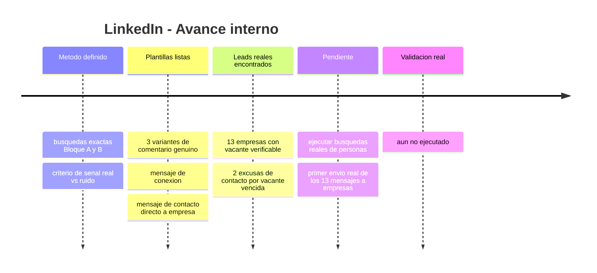
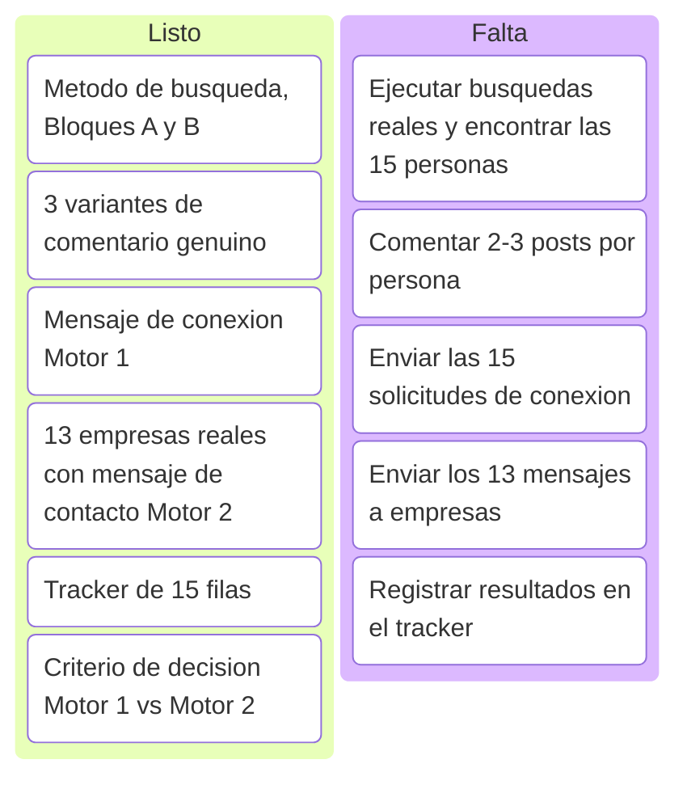
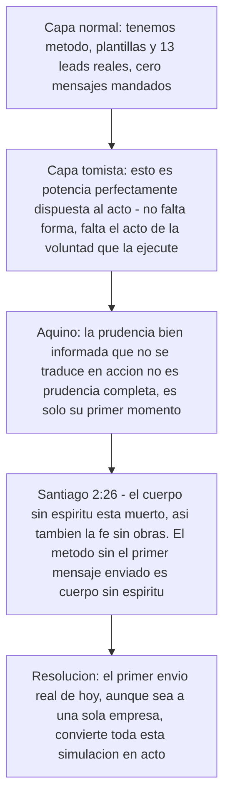
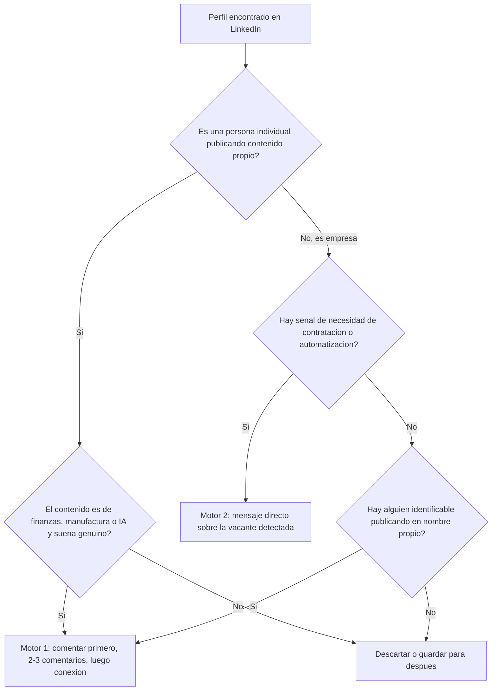

# Simulación LinkedIn — Prospección ICP y contacto directo a empresas

Esta subpágina profundiza la Simulación B del índice general (`indice-simulaciones.md`): el método exacto de networking orgánico (Motor 1) y el listado real de empresas para contacto directo (Motor 2), listo para ejecutar.

<strong>▸ Pasos de la simulación</strong>

1. Correr las búsquedas del Bloque A (manufactura PYME LatAm) y Bloque B (founders/tech IA) en LinkedIn, filtro "Publicaciones", no "Personas".
2. Leer los posts encontrados y separar señal real de ruido (frases tipo "todavía lo hacemos en Excel", "buscamos optimizar el cierre").
3. Comentar genuino (Variantes 1-3) en 2-3 publicaciones de cada persona elegida, antes de conectar.
4. Mandar el mensaje de conexión recién después del 2do-3er comentario real.
5. En paralelo, contactar directo a las 13 empresas con vacante real detectada (Motor 2), sin paso previo de comentarios.
6. Registrar todo en el tracker de 15 filas.

<strong>▸ Línea de tiempo interna (Mermaid)</strong>

<strong>▸ Kanban de progreso (Mermaid)</strong>

<strong>▸ Análisis según Tomás de Aquino</strong>

---

## Motor 2 — 13 empresas reales con vacante o señal de contratación (verificadas por investigación, julio 2026)

*Nota de transparencia: 11 confirmadas activas, 2 (MPR Tools, INDI Staffing) con la vacante ya vencida pero incluidas como excusa válida de contacto — el patrón de contratación de ese perfil es real y recurrente en esas empresas.*

| # | Empresa | Vacante/señal | Link | Estado |
|---|---|---|---|---|
| 1 | Aloware | Automation Engineer (n8n + AI + Data Ops) | [link](https://community.n8n.io/t/hiring-automation-engineer-n8n-ai-data-operations-remote-latam/264735) | Activa |
| 2 | Vidalytics | AI Automation Engineer (MarTech) | [link](https://weworkremotely.com/remote-jobs/vidalytics-ai-automation-engineer-in-house-martech-video-saas) | No confirmada |
| 3 | Twine | Backend Developer – n8n Automation | [link](https://www.linkedin.com/jobs/view/backend-developer-%E2%80%93-n8n-automation-at-twine-4350979775) | Activa |
| 4 | Sagan Recruitment | N8N Automation Specialist (agencia) | [link](https://www.linkedin.com/jobs/view/n8n-automation-specialist-at-sagan-recruitment-4322173231) | Activa |
| 5 | MPR Tools & Equipment | Junior Automation Developer | [link](https://co.linkedin.com/jobs/view/junior-automation-developer-remote-google-apps-script-n8n-js-basic-english-required-at-mpr-tools-equipment-4329518639) | Vencida (excusa válida) |
| 6 | Rem Waste Management | n8n Automation Engineer / AI Process Architect | [link](https://www.linkedin.com/jobs/view/n8n-automation-engineer-%E2%80%93-ai-enabled-process-architect-at-rem-waste-management-4257434611) | Activa |
| 7 | RaveIntelligence | AI Engineer, Full-stack Automation, n8n | [link](https://in.linkedin.com/jobs/view/ai-engineer-full-stack-automation-n8n-at-raveintelligence-4339135883) | Activa |
| 8 | Digital Studio USA | n8n Automation Developer (part-time) | [link](https://pk.linkedin.com/jobs/view/n8n-automation-developer-part-time-remote-at-digital-studio-usa-4377012482) | Activa |
| 9 | Viral Eye Media Analytics | Automation Intern, n8n Workflow Builder | [link](https://www.linkedin.com/jobs/view/automation-intern-n8n-workflow-builder-remote-at-viral-eye-media-analytics-4387928158) | Activa |
| 10 | Trace3 | Data Analyst Power BI | [link](https://remoteok.com/remote-jobs/remote-data-analyst-power-bi-trace3-738075) | Activa |
| 11 | INDI Staffing Services | Power BI Junior Analyst (Panamá) | [link](https://www.linkedin.com/jobs/view/power-bi-junior-analyst-remote-at-indi-staffing-services-4377400617) | Vencida (excusa válida) |
| 12 | Fyndr | Junior AI Automation Engineer | [link](https://in.linkedin.com/jobs/view/junior-ai-automation-engineer-at-fyndr-4436530654) | Activa |
| 13 | Proxify AB | Senior Power BI Developer (canal de colocación) | [link](https://weworkremotely.com/remote-jobs/proxify-ab-senior-microsoft-power-bi-developer-3) | Activa |

**Mensaje base para las 13 (adaptar la primera línea a cada vacante):**
> "Hola, vi [la vacante/señal específica de la empresa]. Construí un sistema de nómina multi-país (NóminaPro) que redujo el tiempo de procesamiento en 97%, y diseñé 15 sistemas de automatización para Copper Group/1HVAC (orquestador multi-agente, pricing dinámico, forecasting con ML, entre otros). Me encantaría mostrarte cómo aplicaría ese enfoque a lo que están construyendo. ¿15 min esta semana?"

**No incluidas por no ser vacantes verificables (canales alternativos a evaluar aparte):** LatamCent, Simera, Near — son agencias que colocan talento LatAm en empresas de EEUU, no publican vacante propia. Podrían sumarse como partners de colocación en una ronda futura, no como leads de outreach directo.

---

## Motor 1 — Búsqueda de las 15 personas (método exacto)

**Regla base: filtro "Publicaciones" en LinkedIn, no "Personas" — buscás gente hablando del tema hoy, no cargos estáticos.**

### Bloque A — Manufactura PYME LatAm
`"gerente financiero" manufactura Panamá` · `"director financiero" pyme manufactura` · `CFO pyme manufactura Latinoamérica` · `"control de costos" fábrica Panamá` · `"flujo de caja" manufactura pyme` · `automatización contable manufactura` · `"cierre contable" fábrica OR planta`

Filtro adicional: Ubicación (Panamá, Colombia, México, Costa Rica, RD) + Sector (Manufactura/Fabricación).

### Bloque B — Founders/tech IA
`founder fintech automatización IA` · `"buscamos" automatización financiera IA` · `CFO startup IA finanzas` · `"agentes de IA" finanzas` · `RPA finanzas pyme` · `"transformación digital" área financiera`

**Señal real de compra (priorizar):** posts que digan "estamos armando el área", "buscamos optimizar el cierre", "todavía hacemos esto en Excel", "contratamos/evaluamos herramientas de automatización".

### 3 variantes de comentario genuino (completar el placeholder con algo real del post — si no hay nada específico, no comentar)

**Variante 1:** "Muy bueno el punto sobre [detalle concreto del post]. Yo trabajo del lado de automatización financiera con IA en manufactura y coincido en que [ángulo relacionado] es donde más tiempo se pierde. Gracias por compartirlo."

**Variante 2:** "[Detalle concreto del post] me hizo pensar en algo que veo seguido en pymes de manufactura: ¿cómo resolvieron el tema de [problema relacionado] antes de llegar a este punto?"

**Variante 3:** "Coincido totalmente con [detalle concreto del post]. En un cliente de manufactura reciente vimos algo parecido: [cifra o resultado real propio] justo por atacar ese mismo cuello de botella. Buen aporte."

### Mensaje de conexión (después del 2do-3er comentario genuino)

> "Hola [Nombre], venimos coincidiendo en varios comentarios sobre [tema recurrente de sus posts] y me gustó cómo lo planteás. Trabajo en automatización financiera con IA para manufactura — [cifra real propia, ej. reduje un cierre contable de X a Y días]. Me sumo a tu red para seguir viendo lo que compartís."

*Sin pedir nada en este mensaje — es solo apertura de red.*

### Flowchart de decisión — Motor 1 vs Motor 2

### Tracker (15 personas/empresas) — con leads reales

**Criterio revisado (20 jul 2026):** el comentario es solo para enganchar con lo que la persona plantea — nada de hablar de tus logros/cifras ahí. El DM de conexión es breve, sin pitch. El pitch de servicios se manda recién en un TERCER mensaje, después de que la conexión ya fue aceptada (plantilla al final de esta sección).

**Persona 1 — Fernando Herrera** ✅ **EJECUTADO — comentario real publicado el 20/07/2026**
- **Tema:** agentes de IA con n8n y MCP
- **Publicación 1 — Link:** https://es.linkedin.com/posts/fernando-herrera-b6b204200_n8n-mcp-agentesia-activity-7455624990852452352-gG4m
- **Comentario publicado (versión real usada):** "Fernando, me parece super interesante como propones la combinación n8n + MCP. Es más, me parece que es justo el patrón que hoy en día más que ser una opción debe ser un estándar para la industria. Yo personalmente lo he utilizado para conectar agentes con sistemas de análisis financiero y proyecciones económicas reales, y es bueno saber cómo se pueden usar como plantilla, para no tener que reescribir y diseñar integraciones cada vez. El salto real no es que el agente 'ejecute', sino que pueda organizarse y gestionar sistemas, como bien lo planteás acá."
- **Publicación 2 — Link:** _____________
- **Fecha conexión enviada:** _____________  **¿Aceptó?:** _____________

**Persona 2 — Manolo Quispe Campos (Colombia)**
- **Tema:** matriz de seguimiento de tareas de proyectos en Power BI
- **Publicación 1 — Link:** https://co.linkedin.com/posts/manoloquispecampos_matriz-de-seguimiento-de-tareas-para-proyectos-activity-7028031394316439553-tPEf
  **Comentario (listo, enfocado en su solución):** "Manolo, muy bueno el enfoque de la matriz — me gusta que resuelva primero el seguimiento de tareas y recién después piense en el dashboard, la mayoría arma esto al revés. ¿La pensaste para un tipo de proyecto específico o funciona igual de bien para cualquier equipo?"
- **Publicación 2 — Link:** _____________
- **Fecha conexión enviada:** _____________  **¿Aceptó?:** _____________

**Persona 3 — Grant Thornton Costa Rica (Ivannia Sandí)**
- **Tema:** IA en auditoría financiera, desafíos éticos y normativos
- **Publicación 1 — Link:** https://es.linkedin.com/posts/grant-thornton-costa-rica_la-inteligencia-artificial-en-la-auditor%C3%ADa-activity-7447750135662395392-MXqY
  **Comentario (listo, enfocado en su solución):** "Muy de acuerdo con el planteo de Ivannia Sandí — el tema ético y normativo de meter IA en auditoría se habla mucho menos que la parte de eficiencia, y es justo el que más debería preocupar a un cliente. Buen enfoque llevar la discusión hacia ahí en vez de quedarse solo en la promesa de velocidad."
- **Publicación 2 — Link:** _____________
- **Fecha conexión enviada:** _____________  **¿Aceptó?:** _____________

**Persona 4 — Drivepoint**
- **Tema:** AI Transition Playbook, por qué finanzas no es anti-IA
- **Publicación 1 — Link:** https://www.linkedin.com/posts/drivepoint-io_most-finance-teams-arent-anti-ai-they-activity-7470152252817842176-0SgP
  **Comentario (listo, enfocado en su solución):** "Buen diagnóstico — no es que los equipos de finanzas sean anti-IA, es que nadie les mostró qué automatizar primero. Me quedo pensando en cómo eligen ustedes cuál es el primer proceso a automatizar con un cliente nuevo, ¿tienen un criterio fijo o depende de cada caso?"
- **Publicación 2 — Link:** _____________
- **Fecha conexión enviada:** _____________  **¿Aceptó?:** _____________

**Persona 5 — Wisy AI (Panamá)**
- **Tema:** hiring, cultura "Velocity + Tranquilo", filosofía Dario Amodei
- **Publicación 1 — Link:** https://www.linkedin.com/posts/wisyai_hiring-aijobs-techstartups-activity-7449848957293264896-9IAL
  **Comentario (listo, enfocado en su solución):** "Me quedo con eso de 'Velocity + Tranquilo' — ir rápido sin perder lo humano es más difícil de lo que parece cuando estás metiendo IA en procesos críticos. Buena forma de plantear la cultura antes de escalar el equipo, en vez de arreglarlo después."
- **Publicación 2 — Link:** _____________
- **Fecha conexión enviada:** _____________  **¿Aceptó?:** _____________

**Persona 6 — Ben Murray (Fractional CFO SaaS, SoftwareMetrics.ai)**
- **Tema:** "AI doesn't fix a messy process, AI exposes it"
- **Publicación 1 — Link:** https://www.linkedin.com/posts/benrmurray_saas-activity-7431812194629230592-ZOg1
  **Comentario (listo, enfocado en su solución):** "Totalmente de acuerdo con que la IA expone el proceso desordenado en vez de arreglarlo. Buen framework para separar juicio humano de lo automatizable — ¿cómo decidís vos ese límite cuando el proceso es ambiguo y no hay una regla clara?"
- **Publicación 2 — Link:** _____________
- **Fecha conexión enviada:** _____________  **¿Aceptó?:** _____________

**Persona 7 — Paul Lynch (CEO Centage.com / Venture Partner Scaleworks)**
- **Tema:** "CFOs: Don't Fall for AI Vaporware"
- **Publicación 1 — Link:** https://www.linkedin.com/posts/paulglynch_cfo-fpanda-ai-activity-7414318019495141376-Lg5L
  **Comentario (listo, enfocado en su solución):** "La distinción entre modelos probabilísticos y finanzas deterministas es clave, y pocas veces se explica tan claro. El caso del CFO que gastó $400K en vaporware debería ser lectura obligatoria antes de comprar cualquier herramienta de IA financiera."
- **Publicación 2 — Link:** _____________
- **Fecha conexión enviada:** _____________  **¿Aceptó?:** _____________

**Persona 8 — Andrew Dimitruk (Co-fundador Ironflow AI, ex-COO Shield AI)**
- **Tema:** lanzamiento de Ironflow, ERP nativo de IA para manufactura
- **Publicación 1 — Link:** https://www.linkedin.com/posts/andrewdimitruk_ironflow-ai-activity-7391540149551026176-hWlM
  **Comentario (listo, enfocado en su solución):** "Coincido con que la IA falla cuando se pega sobre arquitecturas que no fueron diseñadas para eso. Buen approach construir el ERP nativo de IA desde cero en vez de parchar uno viejo, aunque seguro fue más lento salir al mercado así."
- **Publicación 2 — Link:** _____________
- **Fecha conexión enviada:** _____________  **¿Aceptó?:** _____________

**Persona 9 — Bahaa Dawoud (finanzas, UAE)**
- **Tema:** "Cash-flow forecasting requires a human touch"
- **Publicación 1 — Link:** https://www.linkedin.com/posts/bahaa-dawoud_cash-flow-forecasting-requires-a-human-touch-activity-7115554724338163712-3JSM
  **Comentario (listo, enfocado en su solución):** "De acuerdo en que el forecasting de flujo de caja necesita supervisión humana — la limpieza de la data de entrada es justo donde más se rompe este tipo de modelos, y poca gente lo menciona."
- **Publicación 2 — Link:** _____________
- **Fecha conexión enviada:** _____________  **¿Aceptó?:** _____________

**Persona 10 — StratiqAI**
- **Tema:** memoria financiera para founders, diagnóstico sin carga de datos
- **Publicación 1 — Link:** https://www.linkedin.com/posts/stratiqai_stratiqai-aicfo-founderfinance-activity-7462218528813850624-iRFC
  **Comentario (listo, enfocado en su solución):** "Esa distinción entre respuestas puntuales de IA y memoria financiera real es el problema de fondo de la mayoría de herramientas. Buena propuesta la del diagnóstico sin carga de datos, baja mucho la fricción para probarlo."
- **Publicación 2 — Link:** _____________
- **Fecha conexión enviada:** _____________  **¿Aceptó?:** _____________

**Persona 11 — Christian Wattig (FP&A Corporate Trainer)**
- **Tema:** votado #1 FP&A trainer por IA (ChatGPT, Gemini, Claude, en incógnito)
- **Publicación 1 — Link:** https://www.linkedin.com/posts/christian-wattig_ai-voted-me-the-1-fpa-corporate-trainer-activity-7445477688015912960-9rIN
  **Comentario (listo, enfocado en su solución):** "Buenísimo el experimento de probar en incógnito qué recomiendan ChatGPT, Gemini y Claude, y salir #1 en las tres. El salto de reportar números a poder automatizar el proceso completo es justo el que más cuesta en cualquier equipo de FP&A."
- **Publicación 2 — Link:** _____________
- **Fecha conexión enviada:** _____________  **¿Aceptó?:** _____________

**Persona 12 — Emre Kazdagli (Founder, Arc Intelligence)**
- **Tema:** plataforma de IA para crédito privado, 99% de precisión
- **Publicación 1 — Link:** https://www.linkedin.com/posts/ekazdagli_today-is-a-huge-milestone-for-arc-and-our-activity-7264693532588687360-KxWb
  **Comentario (listo, enfocado en su solución):** "Dos años de desarrollo y ya procesando miles de millones en volumen es una validación fuerte, sobre todo en un sector tan intolerante al error como crédito privado. Felicitaciones por el lanzamiento."
- **Publicación 2 — Link:** _____________
- **Fecha conexión enviada:** _____________  **¿Aceptó?:** _____________

**Persona 13 — Vivek Goel (WonderBotz, RPA-as-a-Service)**
- **Tema:** caso de estudio Equinix, RPA en cuentas por pagar
- **Publicación 1 — Link:** https://www.linkedin.com/posts/vivek-goel-2271a516_wonderbotz-case-study-how-equinix-used-rpa-activity-7046647148339212288-X_fI
  **Comentario (listo, enfocado en su solución):** "Cuentas por pagar es el punto de entrada perfecto para RPA — reglas claras, mucho volumen, poca ambigüedad. Buen caso de estudio con Equinix, ¿cuánto tardó la implementación de punta a punta?"
- **Publicación 2 — Link:** _____________
- **Fecha conexión enviada:** _____________  **¿Aceptó?:** _____________

**Persona 14 — Embat (fintech española, tesorería con agentes de IA)**
- **Tema:** RPA vs IA generativa vs agentes de IA en tesorería
- **Publicación 1 — Link:** https://es.linkedin.com/posts/embat-io_agentes-de-ia-para-finanzas-qu%C3%A9-son-y-casos-activity-7480244527149125633-Qyzx
  **Comentario (listo, enfocado en su solución):** "Esa distinción entre RPA, IA generativa y agentes de IA es la más clara que vi explicada en español. Buen marco para explicarle esto a un CFO que todavía desconfía de meter IA en tesorería."
- **Publicación 2 — Link:** _____________
- **Fecha conexión enviada:** _____________  **¿Aceptó?:** _____________

**Persona 15 — Ionix Latam (Franco Mena)**
- **Tema:** IA como asesor financiero, riesgo de fuga de datos y deepfakes financieros
- **Publicación 1 — Link:** https://es.linkedin.com/posts/ionix_la-inteligencia-artificial-es-mi-asesor-financiero-activity-7475648755317530624-HDGJ
  **Comentario (listo, enfocado en su solución):** "Muy acertado el punto de Franco Mena sobre el riesgo de fuga de datos y deepfakes financieros — es la cara menos hablada de meter IA en finanzas, casi todo el discurso es solo sobre lo que gana el usuario."
- **Publicación 2 — Link:** _____________
- **Fecha conexión enviada:** _____________  **¿Aceptó?:** _____________

---

## Etapa 3 — Pitch de servicios (solo después de que aceptaron la conexión)

Nunca en el comentario ni en el DM de conexión. Recién acá, en un mensaje nuevo días después de aceptada la conexión, mencionás lo que hacés vos.

> "Hola [Nombre], gracias por conectar. Aprovecho para contarte un poco de mi lado: trabajo en automatización financiera y de operaciones con IA — armé sistemas reales como un flujo de nómina multi-país (97% de ahorro de tiempo) y un ecosistema de 15 sistemas de automatización para un grupo empresarial multi-país (orquestador multi-agente, forecasting, pricing dinámico, entre otros). Si en algún momento te sirve una segunda mirada sobre algo así, con gusto conversamos."
