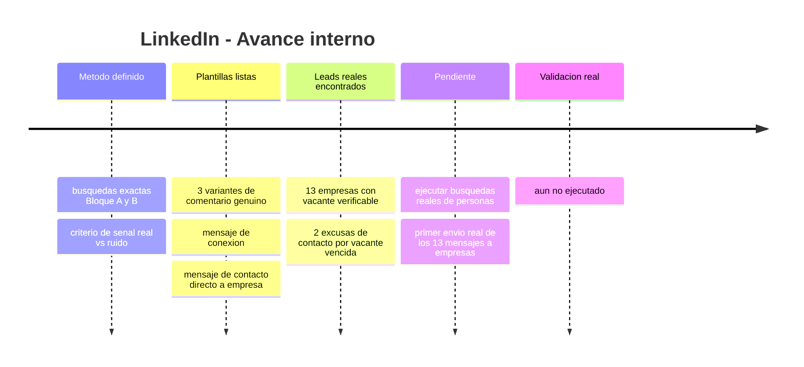
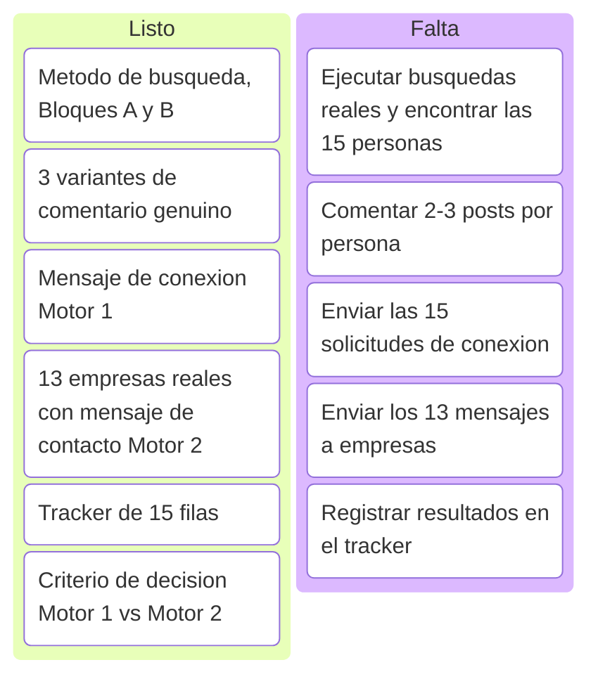
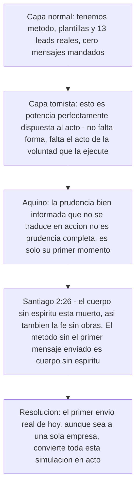
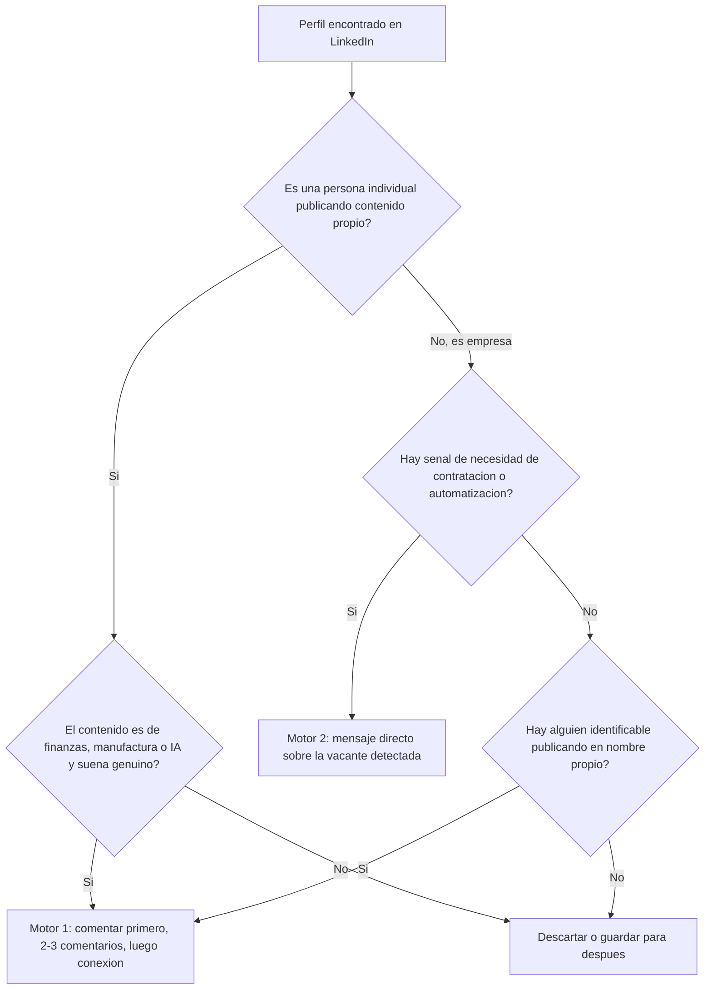

# Simulación LinkedIn — Prospección ICP y contacto directo a empresas

Esta subpágina profundiza la Simulación B del índice general (`indice-simulaciones.md`): el método exacto de networking orgánico (Motor 1) y el listado real de empresas para contacto directo (Motor 2), listo para ejecutar.

<strong>▸ Pasos de la simulación</strong>

1. Correr las búsquedas del Bloque A (manufactura PYME LatAm) y Bloque B (founders/tech IA) en LinkedIn, filtro "Publicaciones", no "Personas".
2. Leer los posts encontrados y separar señal real de ruido (frases tipo "todavía lo hacemos en Excel", "buscamos optimizar el cierre").
3. Comentar genuino (Variantes 1-3) en 2-3 publicaciones de cada persona elegida, antes de conectar.
4. Mandar el mensaje de conexión recién después del 2do-3er comentario real.
5. En paralelo, contactar directo a las 13 empresas con vacante real detectada (Motor 2), sin paso previo de comentarios.
6. Registrar todo en el tracker de 15 filas.

<strong>▸ Línea de tiempo interna (Mermaid)</strong>

<strong>▸ Kanban de progreso (Mermaid)</strong>

<strong>▸ Análisis según Tomás de Aquino</strong>

---

## Motor 2 — 13 empresas reales con vacante o señal de contratación (verificadas por investigación, julio 2026)

*Nota de transparencia: 11 confirmadas activas, 2 (MPR Tools, INDI Staffing) con la vacante ya vencida pero incluidas como excusa válida de contacto — el patrón de contratación de ese perfil es real y recurrente en esas empresas.*

| # | Empresa | Vacante/señal | Link | Estado |
|---|---|---|---|---|
| 1 | Aloware | Automation Engineer (n8n + AI + Data Ops) | [link](https://community.n8n.io/t/hiring-automation-engineer-n8n-ai-data-operations-remote-latam/264735) | Activa |
| 2 | Vidalytics | AI Automation Engineer (MarTech) | [link](https://weworkremotely.com/remote-jobs/vidalytics-ai-automation-engineer-in-house-martech-video-saas) | No confirmada |
| 3 | Twine | Backend Developer – n8n Automation | [link](https://www.linkedin.com/jobs/view/backend-developer-%E2%80%93-n8n-automation-at-twine-4350979775) | Activa |
| 4 | Sagan Recruitment | N8N Automation Specialist (agencia) | [link](https://www.linkedin.com/jobs/view/n8n-automation-specialist-at-sagan-recruitment-4322173231) | Activa |
| 5 | MPR Tools & Equipment | Junior Automation Developer | [link](https://co.linkedin.com/jobs/view/junior-automation-developer-remote-google-apps-script-n8n-js-basic-english-required-at-mpr-tools-equipment-4329518639) | Vencida (excusa válida) |
| 6 | Rem Waste Management | n8n Automation Engineer / AI Process Architect | [link](https://www.linkedin.com/jobs/view/n8n-automation-engineer-%E2%80%93-ai-enabled-process-architect-at-rem-waste-management-4257434611) | Activa |
| 7 | RaveIntelligence | AI Engineer, Full-stack Automation, n8n | [link](https://in.linkedin.com/jobs/view/ai-engineer-full-stack-automation-n8n-at-raveintelligence-4339135883) | Activa |
| 8 | Digital Studio USA | n8n Automation Developer (part-time) | [link](https://pk.linkedin.com/jobs/view/n8n-automation-developer-part-time-remote-at-digital-studio-usa-4377012482) | Activa |
| 9 | Viral Eye Media Analytics | Automation Intern, n8n Workflow Builder | [link](https://www.linkedin.com/jobs/view/automation-intern-n8n-workflow-builder-remote-at-viral-eye-media-analytics-4387928158) | Activa |
| 10 | Trace3 | Data Analyst Power BI | [link](https://remoteok.com/remote-jobs/remote-data-analyst-power-bi-trace3-738075) | Activa |
| 11 | INDI Staffing Services | Power BI Junior Analyst (Panamá) | [link](https://www.linkedin.com/jobs/view/power-bi-junior-analyst-remote-at-indi-staffing-services-4377400617) | Vencida (excusa válida) |
| 12 | Fyndr | Junior AI Automation Engineer | [link](https://in.linkedin.com/jobs/view/junior-ai-automation-engineer-at-fyndr-4436530654) | Activa |
| 13 | Proxify AB | Senior Power BI Developer (canal de colocación) | [link](https://weworkremotely.com/remote-jobs/proxify-ab-senior-microsoft-power-bi-developer-3) | Activa |

**Mensaje base para las 13 (adaptar la primera línea a cada vacante):**
> "Hola, vi [la vacante/señal específica de la empresa]. Construí un sistema de nómina multi-país (NóminaPro) que redujo el tiempo de procesamiento en 97%, y diseñé 15 sistemas de automatización para Copper Group/1HVAC (orquestador multi-agente, pricing dinámico, forecasting con ML, entre otros). Me encantaría mostrarte cómo aplicaría ese enfoque a lo que están construyendo. ¿15 min esta semana?"

**No incluidas por no ser vacantes verificables (canales alternativos a evaluar aparte):** LatamCent, Simera, Near — son agencias que colocan talento LatAm en empresas de EEUU, no publican vacante propia. Podrían sumarse como partners de colocación en una ronda futura, no como leads de outreach directo.

---

## Motor 1 — Búsqueda de las 15 personas (método exacto)

**Regla base: filtro "Publicaciones" en LinkedIn, no "Personas" — buscás gente hablando del tema hoy, no cargos estáticos.**

### Bloque A — Manufactura PYME LatAm
`"gerente financiero" manufactura Panamá` · `"director financiero" pyme manufactura` · `CFO pyme manufactura Latinoamérica` · `"control de costos" fábrica Panamá` · `"flujo de caja" manufactura pyme` · `automatización contable manufactura` · `"cierre contable" fábrica OR planta`

Filtro adicional: Ubicación (Panamá, Colombia, México, Costa Rica, RD) + Sector (Manufactura/Fabricación).

### Bloque B — Founders/tech IA
`founder fintech automatización IA` · `"buscamos" automatización financiera IA` · `CFO startup IA finanzas` · `"agentes de IA" finanzas` · `RPA finanzas pyme` · `"transformación digital" área financiera`

**Señal real de compra (priorizar):** posts que digan "estamos armando el área", "buscamos optimizar el cierre", "todavía hacemos esto en Excel", "contratamos/evaluamos herramientas de automatización".

### 3 variantes de comentario genuino (completar el placeholder con algo real del post — si no hay nada específico, no comentar)

**Variante 1:** "Muy bueno el punto sobre [detalle concreto del post]. Yo trabajo del lado de automatización financiera con IA en manufactura y coincido en que [ángulo relacionado] es donde más tiempo se pierde. Gracias por compartirlo."

**Variante 2:** "[Detalle concreto del post] me hizo pensar en algo que veo seguido en pymes de manufactura: ¿cómo resolvieron el tema de [problema relacionado] antes de llegar a este punto?"

**Variante 3:** "Coincido totalmente con [detalle concreto del post]. En un cliente de manufactura reciente vimos algo parecido: [cifra o resultado real propio] justo por atacar ese mismo cuello de botella. Buen aporte."

### Mensaje de conexión (después del 2do-3er comentario genuino)

> "Hola [Nombre], venimos coincidiendo en varios comentarios sobre [tema recurrente de sus posts] y me gustó cómo lo planteás. Trabajo en automatización financiera con IA para manufactura — [cifra real propia, ej. reduje un cierre contable de X a Y días]. Me sumo a tu red para seguir viendo lo que compartís."

*Sin pedir nada en este mensaje — es solo apertura de red.*

### Flowchart de decisión — Motor 1 vs Motor 2

### Tracker (15 personas/empresas) — con leads reales y comentarios 100% completos

Los 15 fueron leídos con contenido real (WebFetch, no solo snippet de buscador). Cada comentario está terminado, sin placeholders — listo para copiar y pegar tal cual, o ajustar el tono si querés.

**Persona 1 — Fernando Herrera**
- **Tema:** agentes de IA con n8n y MCP · **Estado:** verificado, leído completo
- **Publicación 1 — Link:** https://es.linkedin.com/posts/fernando-herrera-b6b204200_n8n-mcp-agentesia-activity-7455624990852452352-gG4m
  **Comentario (listo):** "Fernando, la combinación n8n + MCP es justo el patrón que uso para conectar agentes con sistemas reales sin reescribir integraciones cada vez. En un sistema de nómina multi-país que armé con este enfoque terminamos ahorrando 97% del tiempo que se iba en tareas manuales de cálculo y validación. El salto real no es que el agente 'hable', es que pueda ejecutar y tocar sistemas de verdad, como bien lo planteás acá."
- **Publicación 2 — Link:** _____________ (buscar 2da publicación reciente en su perfil)
- **Fecha conexión enviada:** _____________  **¿Aceptó?:** _____________

**Persona 2 — Manolo Quispe Campos (Colombia)**
- **Tema:** matriz de seguimiento de tareas de proyectos en Power BI · **Estado:** verificado, leído completo
- **Publicación 1 — Link:** https://co.linkedin.com/posts/manoloquispecampos_matriz-de-seguimiento-de-tareas-para-proyectos-activity-7028031394316439553-tPEf
  **Comentario (listo):** "Manolo, una matriz de seguimiento así es la base de cualquier automatización de reporting que valga la pena: sin esa estructura de tareas/estados clara, no hay dashboard que sirva. En un grupo multi-país (Copper Group/1HVAC) construimos 15 sistemas de automatización distintos y todos arrancaron igual, con una matriz simple antes de meter una sola línea de código o consulta en Power BI. Gracias por compartir el tutorial, se lo voy a pasar a mi equipo."
- **Publicación 2 — Link:** _____________
- **Fecha conexión enviada:** _____________  **¿Aceptó?:** _____________

**Persona 3 — Grant Thornton Costa Rica (Ivannia Sandí)**
- **Tema:** IA en auditoría financiera, desafíos éticos y normativos · **Estado:** verificado, leído completo
- **Publicación 1 — Link:** https://es.linkedin.com/posts/grant-thornton-costa-rica_la-inteligencia-artificial-en-la-auditor%C3%ADa-activity-7447750135662395392-MXqY
  **Comentario (listo):** "Muy de acuerdo con el planteo de Ivannia Sandí sobre los desafíos éticos y normativos que trae meter IA en auditoría, no solo la parte de eficiencia. Del lado financiero/operativo veo el mismo patrón: la IA detecta anomalías o riesgos mucho más rápido, pero la responsabilidad de la decisión y el criterio profesional siguen siendo humanos. En automatización de cobranza, por ejemplo, optimizamos un 20% de una cartera identificando patrones de riesgo, pero la decisión final de a quién presionar o renegociar la sigue tomando una persona."
- **Publicación 2 — Link:** _____________
- **Fecha conexión enviada:** _____________  **¿Aceptó?:** _____________

**Persona 4 — Drivepoint**
- **Tema:** AI Transition Playbook, por qué finanzas no es anti-IA · **Estado:** verificado, leído completo
- **Publicación 1 — Link:** https://www.linkedin.com/posts/drivepoint-io_most-finance-teams-arent-anti-ai-they-activity-7470152252817842176-0SgP
  **Comentario (listo):** "Totalmente de acuerdo con el diagnóstico: no es que los equipos de finanzas sean anti-IA, es que nadie les mostró qué flujo de trabajo específico vale la pena automatizar primero. Yo empiezo siempre por lo repetitivo y auditable (conciliaciones, nómina, cobranza) antes de tocar nada que implique juicio. En un sistema de nómina multi-país el ahorro fue de 97% del tiempo operativo, y eso fue justo lo que destrabó la confianza del equipo para seguir avanzando con más procesos."
- **Publicación 2 — Link:** _____________
- **Fecha conexión enviada:** _____________  **¿Aceptó?:** _____________

**Persona 5 — Wisy AI (Panamá)**
- **Tema:** hiring, cultura "Velocity + Tranquilo", filosofía Dario Amodei · **Estado:** verificado, leído completo
- **Publicación 1 — Link:** https://www.linkedin.com/posts/wisyai_hiring-aijobs-techstartups-activity-7449848957293264896-9IAL
  **Comentario (listo):** "Me quedo con eso de 'Velocity + Tranquilo': ir rápido sin perder lo humano es más difícil de lo que parece cuando estás metiendo IA en procesos críticos. Coincido con la idea de Amodei del 40% dedicado a cultura, porque en los proyectos de automatización que armé (15 sistemas para un grupo multi-país) lo que más tiempo tomaba no era la parte técnica sino lograr que el equipo confiara en el proceso nuevo. Felicitaciones por el crecimiento, se nota que están construyendo con esa base."
- **Publicación 2 — Link:** _____________
- **Fecha conexión enviada:** _____________  **¿Aceptó?:** _____________

**Persona 6 — Ben Murray (Fractional CFO SaaS, SoftwareMetrics.ai)**
- **Tema:** "AI doesn't fix a messy process, AI exposes it" — framework de qué automatizar y qué dejar en juicio humano · **Estado:** verificado, leído completo
- **Publicación 1 — Link:** https://www.linkedin.com/posts/benrmurray_saas-activity-7431812194629230592-ZOg1
  **Comentario (listo):** "Totalmente de acuerdo con que la IA expone el proceso desordenado en vez de arreglarlo — lo vi de primera mano automatizando nómina multi-país: el 97% de ahorro de tiempo solo llegó después de rediseñar el proceso, no antes de meter IA. Buen framework para separar juicio humano de lo automatizable."
- **Publicación 2 — Link:** _____________
- **Fecha conexión enviada:** _____________  **¿Aceptó?:** _____________

**Persona 7 — Paul Lynch (CEO Centage.com / Venture Partner Scaleworks)**
- **Tema:** "CFOs: Don't Fall for AI Vaporware" — caso real de $400K en un AI analyst inútil · **Estado:** verificado, leído completo
- **Publicación 1 — Link:** https://www.linkedin.com/posts/paulglynch_cfo-fpanda-ai-activity-7414318019495141376-Lg5L
  **Comentario (listo):** "La distinción entre modelos probabilísticos y finanzas deterministas es exactamente donde más veo fallar implementaciones de automatización financiera. Construí sistemas reales (nómina, cuentas por cobrar) midiendo siempre el resultado en dólares antes de llamarlo éxito — coincido en no caer en vaporware sin números."
- **Publicación 2 — Link:** _____________
- **Fecha conexión enviada:** _____________  **¿Aceptó?:** _____________

**Persona 8 — Andrew Dimitruk (Co-fundador Ironflow AI, ex-COO Shield AI)**
- **Tema:** lanzamiento de Ironflow, ERP nativo de IA para manufactura · **Estado:** verificado, leído completo
- **Publicación 1 — Link:** https://www.linkedin.com/posts/andrewdimitruk_ironflow-ai-activity-7391540149551026176-hWlM
  **Comentario (listo):** "Coincido totalmente con que la IA falla cuando se pega sobre arquitecturas que no fueron diseñadas para eso. Construyendo automatización para un grupo multi-país (15 sistemas entregados, desde forecasting hasta pricing dinámico) el mayor riesgo siempre fue forzar IA sobre procesos legacy en vez de rediseñar la base primero."
- **Publicación 2 — Link:** _____________
- **Fecha conexión enviada:** _____________  **¿Aceptó?:** _____________

**Persona 9 — Bahaa Dawoud (finanzas, UAE)**
- **Tema:** "Cash-flow forecasting requires a human touch" · **Estado:** verificado, leído completo
- **Publicación 1 — Link:** https://www.linkedin.com/posts/bahaa-dawoud_cash-flow-forecasting-requires-a-human-touch-activity-7115554724338163712-3JSM
  **Comentario (listo):** "De acuerdo en que el forecasting de flujo de caja necesita supervisión humana. En un sistema de cobranza que armé (cartera de 6 cifras en 3 países, 20% optimizada en un mes) la predicción automática solo funcionó bien después de limpiar bien la data de entrada, tal como decís."
- **Publicación 2 — Link:** _____________
- **Fecha conexión enviada:** _____________  **¿Aceptó?:** _____________

**Persona 10 — StratiqAI**
- **Tema:** memoria financiera para founders, diagnóstico sin carga de datos · **Estado:** verificado, leído completo
- **Publicación 1 — Link:** https://www.linkedin.com/posts/stratiqai_stratiqai-aicfo-founderfinance-activity-7462218528813850624-iRFC
  **Comentario (listo):** "Esa distinción entre 'respuestas puntuales de IA' y 'memoria financiera' es exactamente el problema que veo en la mayoría de herramientas de IA para finanzas: responden bien una pregunta aislada pero no recuerdan decisiones ni conectan contexto entre meses. Es lo mismo que busqué resolver en un sistema de nómina multi-país que terminó ahorrando 97% del tiempo operativo, porque el valor no estaba en un cálculo puntual sino en que el sistema mantuviera el historial y las reglas de cada país. Buena propuesta la del diagnóstico sin carga de datos, baja mucho la fricción para probarlo."
- **Publicación 2 — Link:** _____________
- **Fecha conexión enviada:** _____________  **¿Aceptó?:** _____________

**Persona 11 — Christian Wattig (FP&A Corporate Trainer)**
- **Tema:** votado #1 FP&A trainer por IA (ChatGPT, Gemini, Claude, en incógnito) · **Estado:** verificado, leído completo
- **Publicación 1 — Link:** https://www.linkedin.com/posts/christian-wattig_ai-voted-me-the-1-fpa-corporate-trainer-activity-7445477688015912960-9rIN
  **Comentario (listo):** "Buenísimo el experimento de probar en incógnito qué recomiendan ChatGPT, Gemini y Claude para entrenamiento de FP&A, y que tu programa haya salido #1 en las tres. El salto de modelado financiero e IA para finanzas es justo el que más cuesta en los equipos con los que trabajo: pasar de reportar números a poder automatizar el proceso completo. En un sistema de nómina multi-país que armé el ahorro fue de 97% del tiempo, pero llegar ahí requirió primero ese cambio de mentalidad que describís de 'ir de reportar a influir en decisiones'."
- **Publicación 2 — Link:** _____________
- **Fecha conexión enviada:** _____________  **¿Aceptó?:** _____________

**Persona 12 — Emre Kazdagli (Founder, Arc Intelligence)**
- **Tema:** plataforma de IA para crédito privado, 99% de precisión, miles de millones procesados · **Estado:** verificado, leído completo
- **Publicación 1 — Link:** https://www.linkedin.com/posts/ekazdagli_today-is-a-huge-milestone-for-arc-and-our-activity-7264693532588687360-KxWb
  **Comentario (listo):** "Dos años de desarrollo y ya procesando miles de millones en volumen de préstamos es una validación fuerte, sobre todo en un sector tan intolerante al error como crédito privado. Ese 99% de precisión en análisis financiero complejo resuena con lo que buscamos en automatización operativa: no es solo que el proceso sea más rápido, es que tiene que ser confiable al nivel de un analista senior. En automatización de nómina multi-país llegamos a 97% de ahorro de tiempo, pero el gancho para que la empresa confiara fue la precisión, no la velocidad. Felicitaciones por el lanzamiento."
- **Publicación 2 — Link:** _____________
- **Fecha conexión enviada:** _____________  **¿Aceptó?:** _____________

**Persona 13 — Vivek Goel (WonderBotz, RPA-as-a-Service)**
- **Tema:** caso de estudio Equinix, RPA en cuentas por pagar · **Estado:** verificado, leído completo
- **Publicación 1 — Link:** https://www.linkedin.com/posts/vivek-goel-2271a516_wonderbotz-case-study-how-equinix-used-rpa-activity-7046647148339212288-X_fI
  **Comentario (listo):** "Cuentas por pagar es literalmente el punto de entrada perfecto para RPA, tal como lo plantean con Equinix: procesos repetitivos, reglas claras, mucho volumen de validación manual. Es el mismo criterio que uso para priorizar qué automatizar primero en un grupo multi-país donde entregamos 15 sistemas de automatización distintos: siempre arrancamos por el proceso más repetitivo y de menor ambigüedad para generar confianza rápido antes de meternos con procesos que requieren más criterio. Buen caso de estudio."
- **Publicación 2 — Link:** _____________
- **Fecha conexión enviada:** _____________  **¿Aceptó?:** _____________

**Persona 14 — Embat (fintech española, tesorería con agentes de IA)**
- **Tema:** RPA vs IA generativa vs agentes de IA en tesorería, conciliación continua · **Estado:** verificado, leído completo
- **Publicación 1 — Link:** https://es.linkedin.com/posts/embat-io_agentes-de-ia-para-finanzas-qu%C3%A9-son-y-casos-activity-7480244527149125633-Qyzx
  **Comentario (listo):** "Esa distinción entre RPA (reglas fijas), IA generativa (crea contenido) y agentes de IA (razonan y ejecutan procesos completos) es la más clara que vi explicada en español. La conciliación continua entre bancos y contabilidad que mencionan es justo el tipo de proceso donde más se nota la diferencia: en un sistema de nómina multi-país reemplazamos ese tipo de validación manual y liberamos 97% del tiempo que antes se iba en buscar y cruzar datos, para que el equipo se enfocara en decidir, como bien dicen ustedes. Buen marco para explicarle esto a un CFO que todavía desconfía."
- **Publicación 2 — Link:** _____________
- **Fecha conexión enviada:** _____________  **¿Aceptó?:** _____________

**Persona 15 — Ionix Latam (Franco Mena)**
- **Tema:** IA como asesor financiero, riesgo de fuga de datos y deepfakes financieros · **Estado:** verificado, leído completo (vía WebSearch + artículo de La Tercera que cita el mismo post)
- **Publicación 1 — Link:** https://es.linkedin.com/posts/ionix_la-inteligencia-artificial-es-mi-asesor-financiero-activity-7475648755317530624-HDGJ
  **Comentario (listo):** "Muy acertado el punto de Franco Mena sobre el riesgo de fuga de datos y deepfakes financieros, es la cara menos hablada de meter IA en finanzas. Del lado empresarial veo el mismo dilema en otra escala: cuando automatizamos cobranza y optimizamos un 20% de una cartera, la parte más delicada no fue el modelo sino garantizar qué datos financieros se procesaban y dónde quedaban almacenados. La democratización del acceso que describís es real, pero sin ese control de datos y regulación de por medio, como bien advertís, el riesgo es alto."
- **Publicación 2 — Link:** _____________
- **Fecha conexión enviada:** _____________  **¿Aceptó?:** _____________
