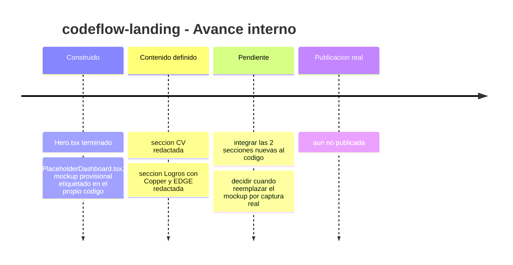
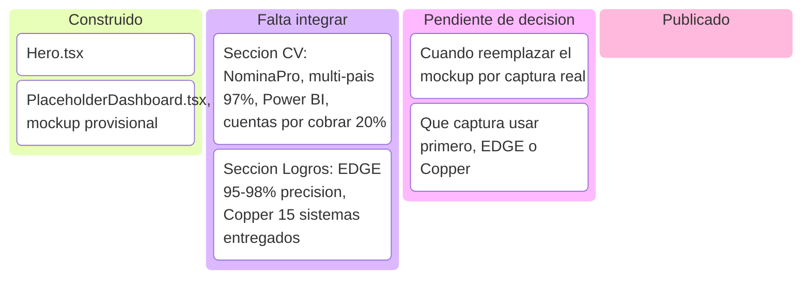
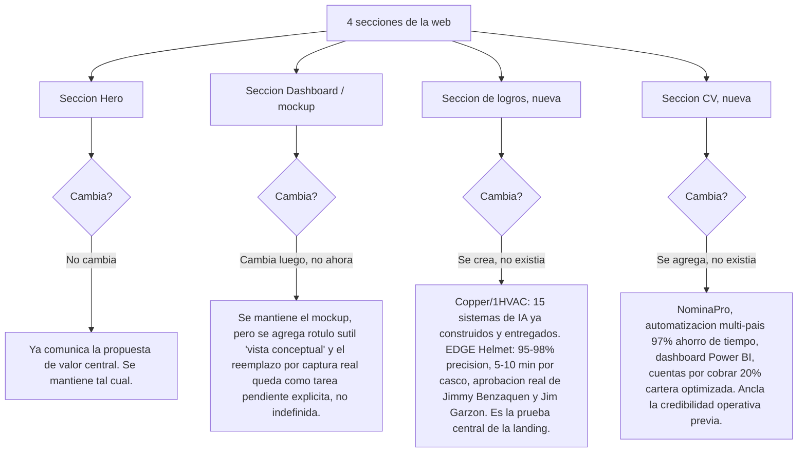
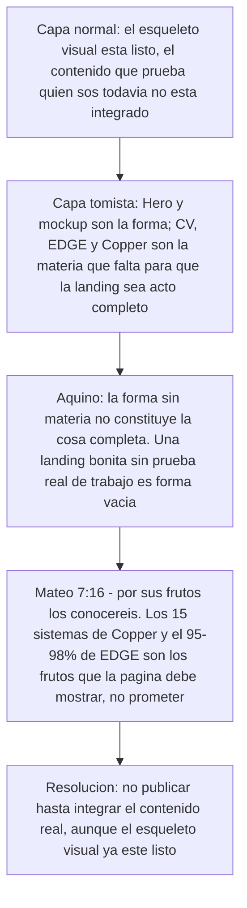

# Estado y plan de contenido — codeflow-landing

Esta subpágina profundiza la Simulación A del índice general (`indice-simulaciones.md`): el estado exacto de la landing y los 4 cambios concretos que aplicarían a sus secciones con la información ya disponible (CV, evidencia EDGE, portfolio Copper).

<strong>▸ Pasos de la simulación</strong>

1. Confirmar qué está construido hoy: `Hero.tsx` y `PlaceholderDashboard.tsx`.
2. Decidir, sección por sección, si cambia o no con la información ya disponible.
3. Crear la sección de Logros (Copper + EDGE) como prueba, no como promesa.
4. Crear la sección de CV con el track record ya verificado.
5. Mantener el mockup del dashboard etiquetado honestamente como vista conceptual, con el reemplazo por captura real marcado como pendiente explícito.
6. Publicar solo cuando las 4 secciones estén cerradas — no antes.

<strong>▸ Línea de tiempo interna (Mermaid)</strong>

<strong>▸ Kanban de progreso (Mermaid)</strong>

<strong>▸ Flowchart de decisión por sección (Mermaid)</strong>

<strong>▸ Análisis según Tomás de Aquino</strong>

---

## Nueva estructura de la página (resultado profesional)

Con los 4 cambios aplicados, la landing deja de ser un portfolio genérico y se estructura como un caso de venta: **Hero** (propuesta de valor, sin cambios) → **Dashboard** (se mantiene como vista conceptual, etiquetada honestamente, con el reemplazo por captura real marcado como pendiente concreto) → **Logros** (sección nueva y central: 15 sistemas de IA ya construidos y entregados en Copper/1HVAC, más evidencia verificable de EDGE Helmet con precisión medida y aprobación real de clientes) → **CV** (sección nueva que ancla la credibilidad operativa previa: NóminaPro, automatización multi-país, 97% de ahorro de tiempo, Power BI, optimización de cartera).

El resultado es una narrativa de **prueba antes que de promesa**: primero quién sos, luego qué construiste, y recién después la animación conceptual como complemento visual — no como sustituto de evidencia.
