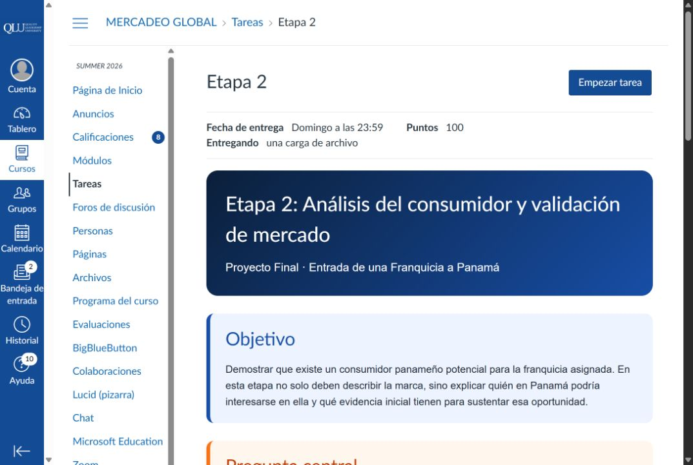
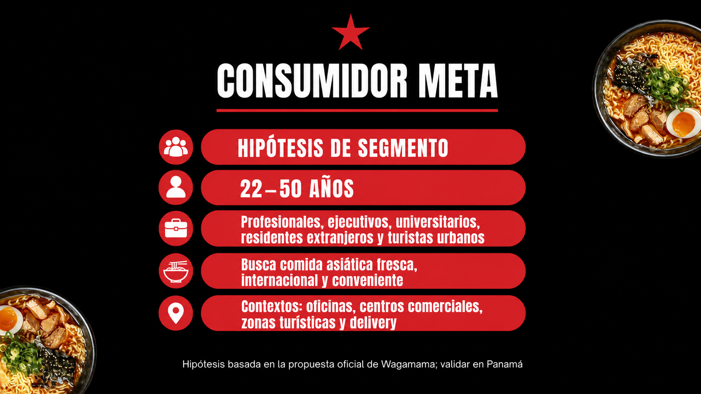
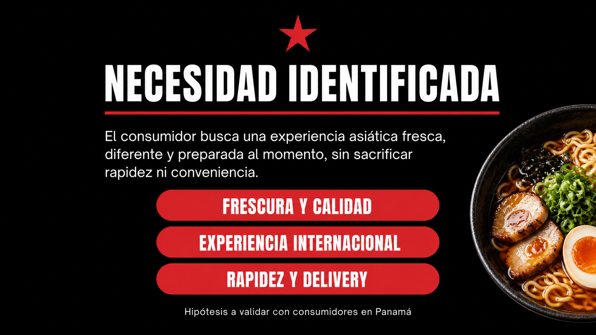
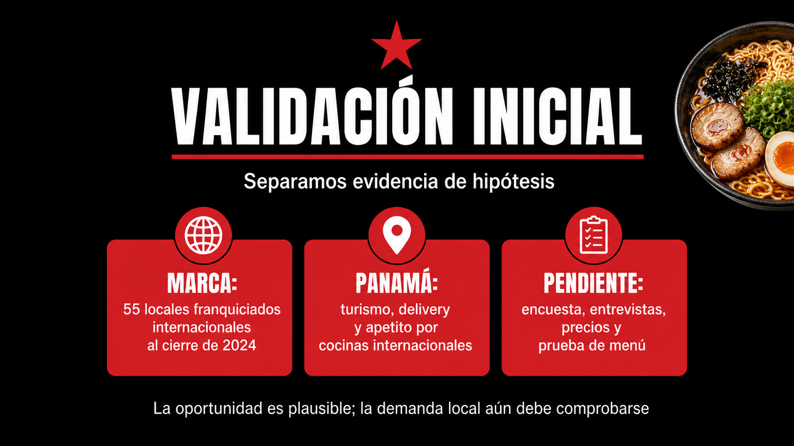
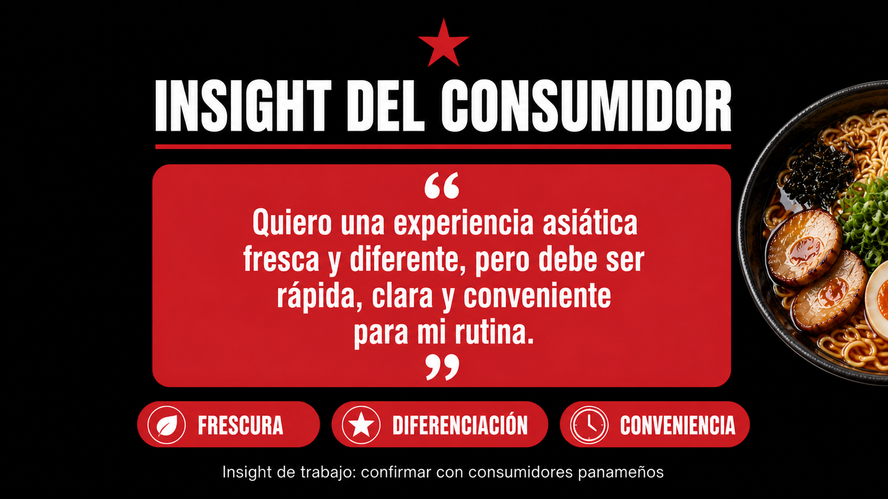
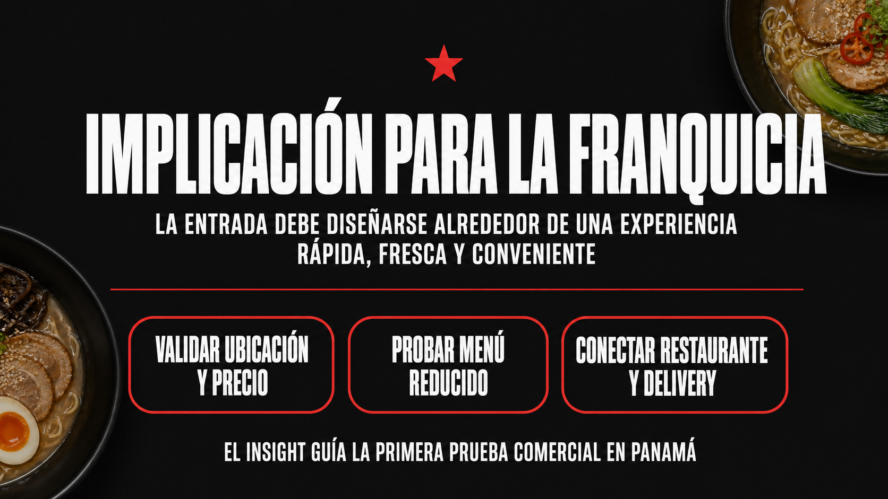

# Análisis de cumplimiento — Etapa 2 Wagamama

## Comparación con la consigna universitaria

<strong>Captura de la consigna oficial</strong>

La consigna exige demostrar un consumidor panameño potencial, explicar la necesidad que resuelve, describir el comportamiento de consumo, incluir evidencia básica de validación y cerrar con un insight. También indica una presentación de 4 a 5 slides y asigna 15 puntos: consumidor meta (4), necesidad (3), validación (4), insight (2) y claridad (2).

<strong>Slide 1 — Consumidor meta: cumplimiento y justificación</strong>

### Criterios de la consigna relacionados

- Edad y segmento principal.
- Estilo de vida.
- Zona donde vive, estudia o trabaja.
- Hábitos y motivaciones.

### Qué sí cumple

La slide define una hipótesis de 22 a 50 años e incluye profesionales, ejecutivos, universitarios, residentes extranjeros y turistas urbanos. También relaciona el segmento con oficinas, centros comerciales, zonas turísticas y delivery. Las motivaciones están conectadas con comida asiática fresca, experiencia internacional y conveniencia.

### Justificación del cambio

Antes el segmento era más genérico. Se añadió el contexto de consumo y se vinculó con la propuesta oficial de Wagamama: comida fresca, preparada al momento, experiencia informal y cocina abierta. Esto mejora la respuesta al criterio porque no solo dice quién es el consumidor, sino dónde y por qué podría comprar.

### Qué todavía falta

La edad, ubicación y disposición a pagar siguen siendo hipótesis. Para obtener el puntaje máximo se debe levantar evidencia directa en Panamá.

<strong>Slide 2 — Necesidad o deseo: cumplimiento y justificación</strong>

### Criterio de la consigna

Explicar qué busca el consumidor y qué necesidad no está completamente satisfecha.

### Qué sí cumple

La slide identifica una combinación concreta: frescura y calidad, experiencia internacional y rapidez/delivery. La necesidad no se presenta como “comer ramen”, sino como acceder a una experiencia asiática diferente sin perder conveniencia.

### Justificación del cambio

Se reemplazó una afirmación amplia como “saludable y diferente” por atributos medibles. Esto permite preguntar al consumidor qué valora más y comparar la propuesta con Ajisen, Oh-Toro, Hikaru y otras opciones.

### Qué todavía falta

Hay que comprobar si esa combinación es realmente una necesidad relevante y cuánto estaría dispuesto a pagar el consumidor.

<strong>Slide 3 — Evidencia de validación: cumplimiento y justificación</strong>

### Criterio de la consigna

Incluir una encuesta, entrevistas, observación, tendencias visibles, redes sociales o comparación con oferta existente.

### Qué sí cumple parcialmente

La slide distingue evidencia de marca, comparación internacional y señales del mercado panameño. Incluye fuentes oficiales, datos de franquicia, sector gastronómico, turismo, delivery y competidores.

### Justificación del cambio

Se separó lo que las fuentes sí demuestran de lo que todavía no demuestran. El informe anual prueba la trayectoria internacional de Wagamama; el análisis del mercado panameño señala condiciones favorables; los competidores prueban que existe una categoría activa. Ninguna de esas fuentes confirma por sí sola la intención de compra local.

### Qué falta para cumplir completamente

Realizar encuesta corta, entrevistas, observación en ubicaciones y comparación de precios. Esta es la parte más importante para alcanzar los 4 puntos de validación.

<strong>Slide 4 — Insight: cumplimiento y justificación</strong>

### Criterio de la consigna

Redactar una frase clara que resuma el descubrimiento sobre el consumidor.

### Qué sí cumple

La frase conecta deseo y condición de compra: el consumidor quiere una experiencia asiática fresca y diferente, pero necesita rapidez, claridad y conveniencia.

### Justificación del cambio

El insight ya no es solo una descripción emocional. Resume una tensión que puede validarse con preguntas concretas y que puede orientar menú, ubicación, precio y delivery.

### Qué todavía falta

Debe confirmarse con respuestas reales de consumidores panameños para que pase de insight de trabajo a insight validado.

<strong>Slide 5 — Implicación para la franquicia</strong>

### Criterio relacionado

La consigna sugiere una quinta slide de implicación para la franquicia y exige cerrar explicando en qué debe enfocarse la marca.

### Análisis de cumplimiento

**Cumple.** La slide convierte el insight en tres decisiones verificables: validar ubicación y precio, probar un menú reducido y conectar restaurante con delivery.

### Justificación del cambio

Esta slide faltaba en la entrega anterior. Ahora completa el recorrido lógico: consumidor → necesidad → evidencia → insight → decisión para la franquicia. También evita presentar la entrada a Panamá como una decisión tomada antes de probar el mercado.

<strong>Evaluación general frente a los 15 puntos</strong>

| Criterio | Estado actual | Lectura |
|---|---|---|
| Consumidor meta — 4 puntos | Cumple como hipótesis | Bien definido, falta evidencia local |
| Necesidad — 3 puntos | Cumple | Está formulada de manera concreta y medible |
| Validación — 4 puntos | Cumple parcialmente | Hay fuentes secundarias y comparables; faltan datos primarios |
| Insight — 2 puntos | Cumple como insight de trabajo | Debe confirmarse con entrevistas o encuesta |
| Claridad — 2 puntos | Cumple | La secuencia y los desplegables organizan la explicación |

### Conclusión

La presentación responde correctamente a la estructura de la Etapa 2 y está mejor fundamentada que la versión inicial. El principal pendiente no es de diseño ni de redacción: es conseguir evidencia primaria de consumidores panameños.

