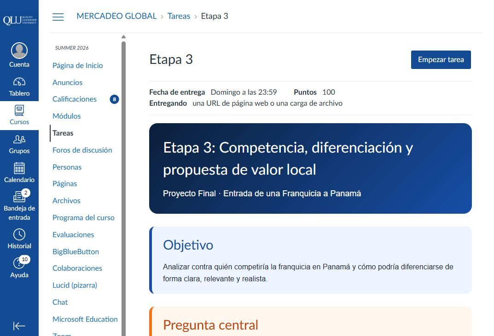
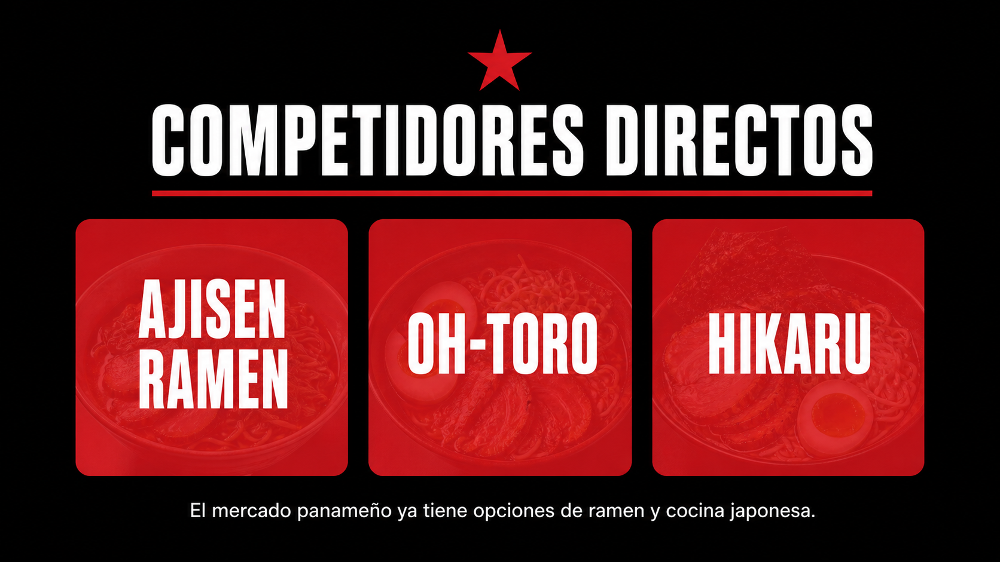
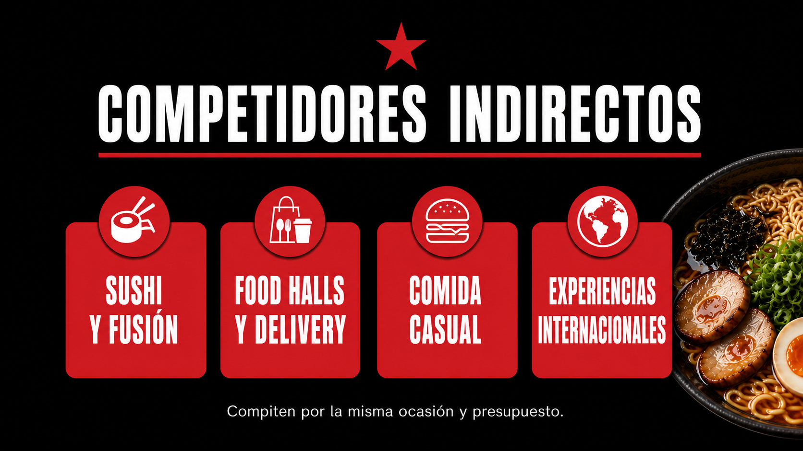
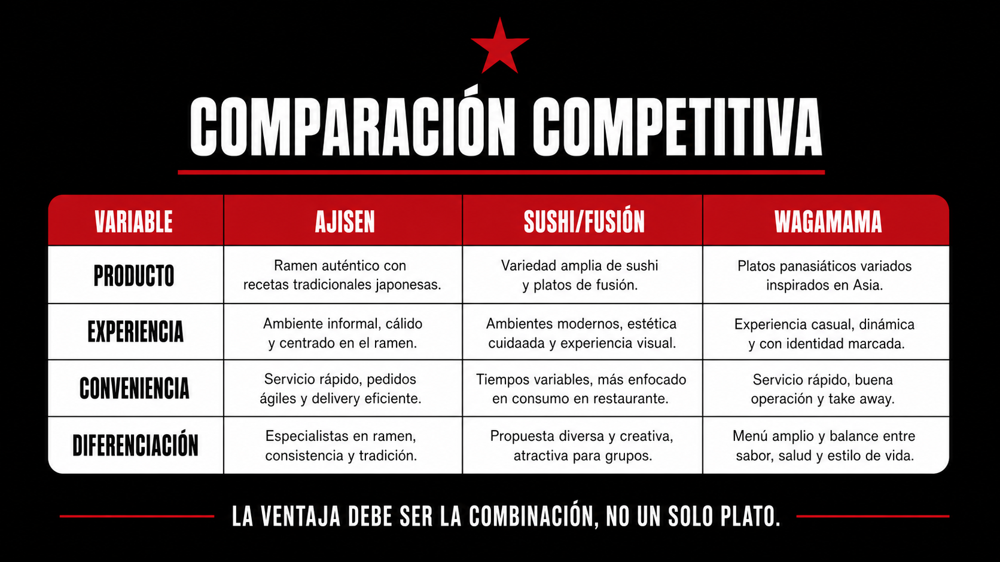
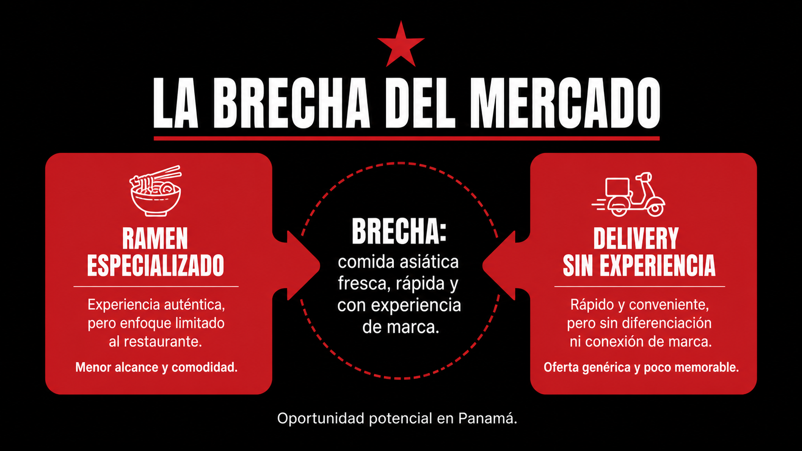
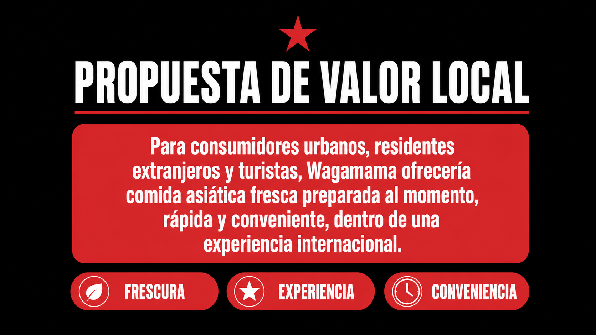
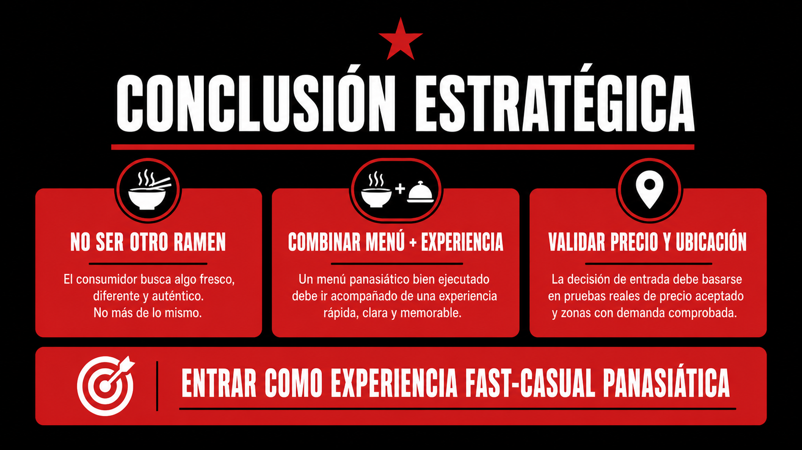

# Análisis de cumplimiento — Etapa 3 Wagamama

## Comparación con la consigna universitaria

<strong>Captura de la consigna oficial</strong>

La consigna exige identificar competidores directos e indirectos, comparar al menos cuatro variables, detectar una brecha de mercado, redactar una propuesta de valor local y cerrar con una conclusión estratégica. El formato recomendado es de 5 a 6 slides y la evaluación suma 15 puntos.

<strong>Slide 1 — Competidores directos</strong>

### Instrucción relacionada

Identificar marcas que ofrecen algo muy parecido a la franquicia asignada.

### Análisis de cumplimiento

**Cumple.** Se identifican Ajisen Ramen, Oh-Toro y Hikaru como referencias directas porque compiten por ramen, cocina japonesa y una ocasión de consumo similar.

### Justificación

Ajisen es especialmente relevante porque tiene presencia local, seis sucursales declaradas y una trayectoria internacional. La slide evita afirmar que Wagamama ganaría automáticamente y establece el reto real: no entrar como “otro restaurante de ramen”.

### Pendiente

Completar una visita de campo con precios, ubicaciones, tiempos de servicio y observación de tráfico.

<strong>Slide 2 — Competidores indirectos</strong>

### Instrucción relacionada

Identificar marcas que compiten por el mismo consumidor, ocasión o presupuesto aunque no vendan exactamente lo mismo.

### Análisis de cumplimiento

**Cumple.** Incluye sushi, restaurantes de fusión, food halls, delivery y comida casual internacional.

### Justificación

La competencia no se limita al ramen. Un consumidor puede elegir sushi, un bowl, una hamburguesa, un food hall o pedir varias marcas en una sola orden. Esta lectura responde mejor a la pregunta central porque analiza la decisión real del consumidor.

### Pendiente

Comparar precios y ticket promedio de las alternativas indirectas en una misma zona.

<strong>Slide 3 — Tabla comparativa</strong>

### Instrucción relacionada

Comparar mínimo cuatro variables competitivas.

### Análisis de cumplimiento

**Cumple.** La comparación utiliza producto, experiencia, escala, conveniencia y diferenciación.

### Justificación

La tabla no se queda en una lista de marcas. Muestra dónde competiría Wagamama y qué tendría que demostrar. La escala internacional es una fortaleza potencial, pero la conveniencia y el precio aparecen como variables todavía pendientes de validación local.

### Pendiente

Agregar precio, ubicación exacta, redes sociales y tiempos de delivery cuando se realice el levantamiento de campo.

<strong>Slide 4 — Brecha u oportunidad</strong>

### Instrucción relacionada

Identificar qué espacio u oportunidad podría aprovechar la franquicia en Panamá.

### Análisis de cumplimiento

**Cumple como hipótesis estratégica.** La brecha propuesta está entre el ramen especializado y las opciones de delivery que no ofrecen una experiencia de marca integrada.

### Justificación

La oportunidad se formula como una combinación —comida asiática fresca, rápida y con experiencia— y no como una afirmación de que no existe competencia. Esto es más realista porque reconoce que ya hay oferta local.

### Pendiente

Validar si el consumidor percibe realmente esa diferencia y si está dispuesto a pagar por ella.

<strong>Slide 5 — Propuesta de valor local</strong>

### Instrucción relacionada

Redactar una frase clara que explique qué ofrecería la franquicia, a quién le hablaría y por qué sería relevante.

### Análisis de cumplimiento

**Cumple.** La frase identifica al público —consumidores urbanos, residentes extranjeros y turistas—, la oferta —comida asiática fresca preparada al momento— y la relevancia —rapidez, conveniencia y experiencia internacional—.

### Justificación

La propuesta no promete ser la más barata ni la más auténtica sin evidencia. Se apoya en atributos que Wagamama ya comunica y los traduce al contexto de Panamá.

### Pendiente

Definir precio objetivo, menú inicial y ubicación para convertir la propuesta en un modelo operativo.

<strong>Slide 6 — Conclusión estratégica</strong>

### Instrucción relacionada

Cerrar con una conclusión estratégica y completar la frase obligatoria de diferenciación, oportunidad y propuesta de valor.

### Análisis de cumplimiento

**Cumple.** La conclusión establece que Wagamama no debe posicionarse como otro restaurante de ramen, sino como una experiencia fast-casual panasiática.

### Justificación

La recomendación es prudente: avanzar a validación comercial, no confirmar todavía la inversión. Esto conecta la competencia con una acción concreta: probar ubicaciones, precios, menú y repetición de compra.

<strong>Evaluación general sobre 15 puntos</strong>

| Criterio | Estado | Puntos potenciales |
|---|---|---:|
| Competidores directos e indirectos | Cumple | 4 |
| Comparación competitiva clara | Cumple | 4 |
| Brecha u oportunidad | Cumple como hipótesis | 3 |
| Propuesta de valor local | Cumple | 3 |
| Claridad y organización | Cumple | 1 |
| **Total potencial** |  | **15** |

### Principal pendiente

La presentación cumple la estructura y la lógica solicitada. Para hacerla más sólida, faltan datos primarios de campo: precios, ubicaciones, tráfico, tiempos de delivery y entrevistas a consumidores panameños.

