# ElevenLabs — pitch deck página por página

Fuente: [ElevenLabs — Best Pitch Deck](https://bestpitchdeck.com/eleven-labs)

Cada bloque contiene la captura de la página correspondiente y una lectura breve de cómo contribuye a comunicar valor. Las interpretaciones son estratégicas y no una transcripción literal completa.

+

<strong>Página 1</strong>

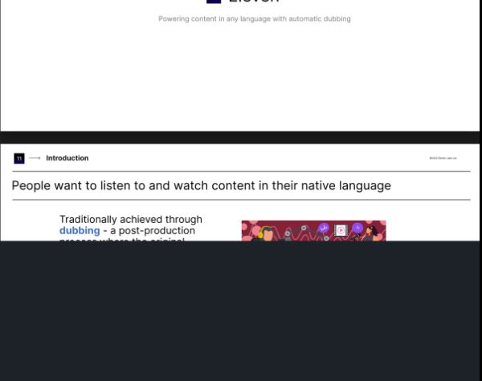

**Cómo comunica valor:** esta página aporta evidencia visual a la narrativa del deck. Su función es ayudar al lector a entender el problema, producto, mercado, tracción o ventaja competitiva que la empresa está construyendo. El valor se comunica al convertir una afirmación abstracta en una señal concreta que un cliente, socio o inversionista puede evaluar.

<strong>Página 2</strong>

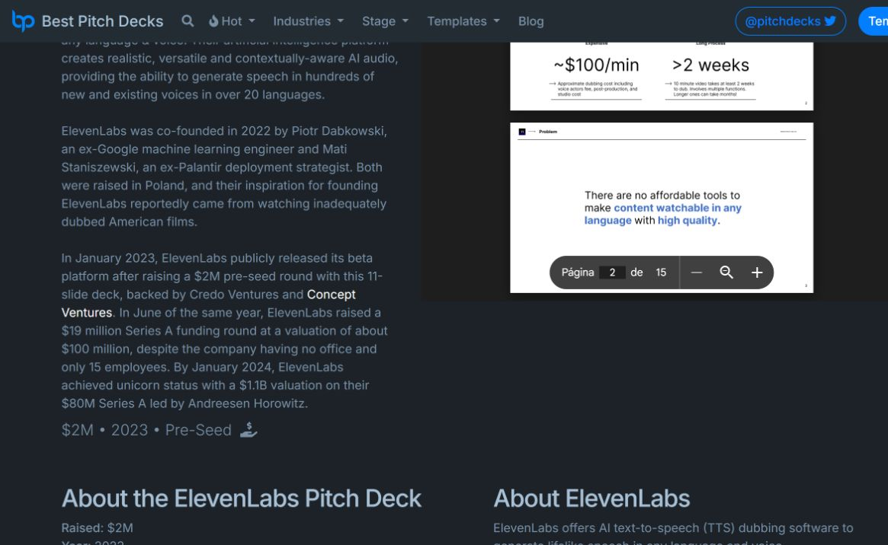

**Cómo comunica valor:** esta página aporta evidencia visual a la narrativa del deck. Su función es ayudar al lector a entender el problema, producto, mercado, tracción o ventaja competitiva que la empresa está construyendo. El valor se comunica al convertir una afirmación abstracta en una señal concreta que un cliente, socio o inversionista puede evaluar.

<strong>Página 3</strong>

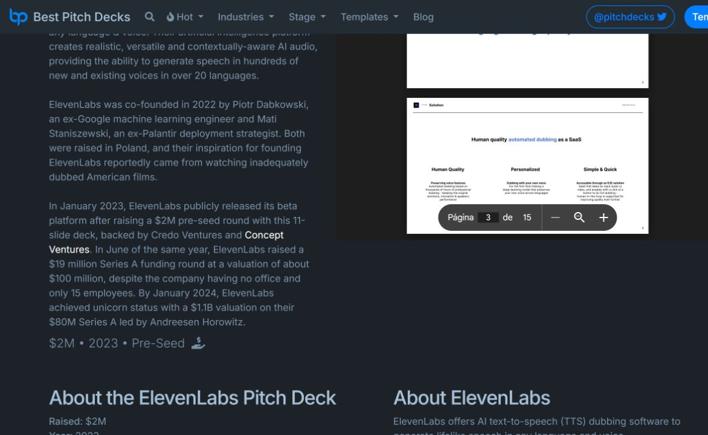

**Cómo comunica valor:** esta página aporta evidencia visual a la narrativa del deck. Su función es ayudar al lector a entender el problema, producto, mercado, tracción o ventaja competitiva que la empresa está construyendo. El valor se comunica al convertir una afirmación abstracta en una señal concreta que un cliente, socio o inversionista puede evaluar.

<strong>Página 4</strong>

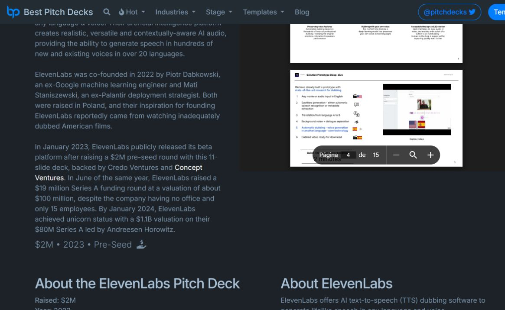

**Cómo comunica valor:** esta página aporta evidencia visual a la narrativa del deck. Su función es ayudar al lector a entender el problema, producto, mercado, tracción o ventaja competitiva que la empresa está construyendo. El valor se comunica al convertir una afirmación abstracta en una señal concreta que un cliente, socio o inversionista puede evaluar.

<strong>Página 5</strong>

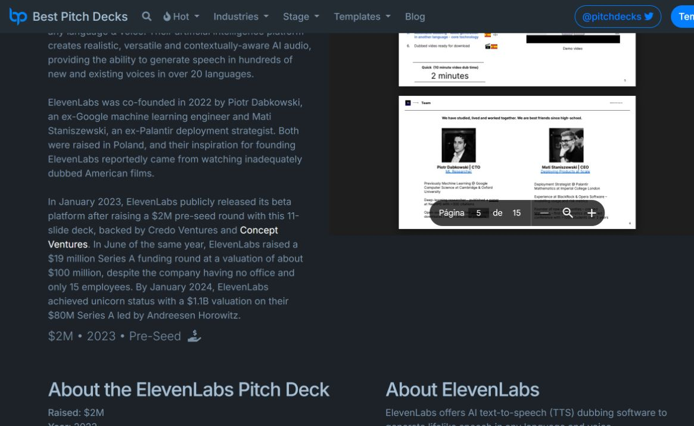

**Cómo comunica valor:** esta página aporta evidencia visual a la narrativa del deck. Su función es ayudar al lector a entender el problema, producto, mercado, tracción o ventaja competitiva que la empresa está construyendo. El valor se comunica al convertir una afirmación abstracta en una señal concreta que un cliente, socio o inversionista puede evaluar.

<strong>Página 6</strong>

**Cómo comunica valor:** esta página aporta evidencia visual a la narrativa del deck. Su función es ayudar al lector a entender el problema, producto, mercado, tracción o ventaja competitiva que la empresa está construyendo. El valor se comunica al convertir una afirmación abstracta en una señal concreta que un cliente, socio o inversionista puede evaluar.

<strong>Página 7</strong>

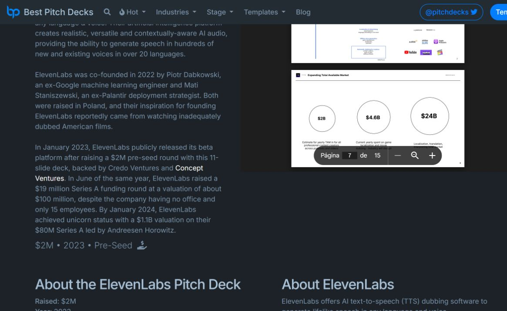

**Cómo comunica valor:** esta página aporta evidencia visual a la narrativa del deck. Su función es ayudar al lector a entender el problema, producto, mercado, tracción o ventaja competitiva que la empresa está construyendo. El valor se comunica al convertir una afirmación abstracta en una señal concreta que un cliente, socio o inversionista puede evaluar.

<strong>Página 8</strong>

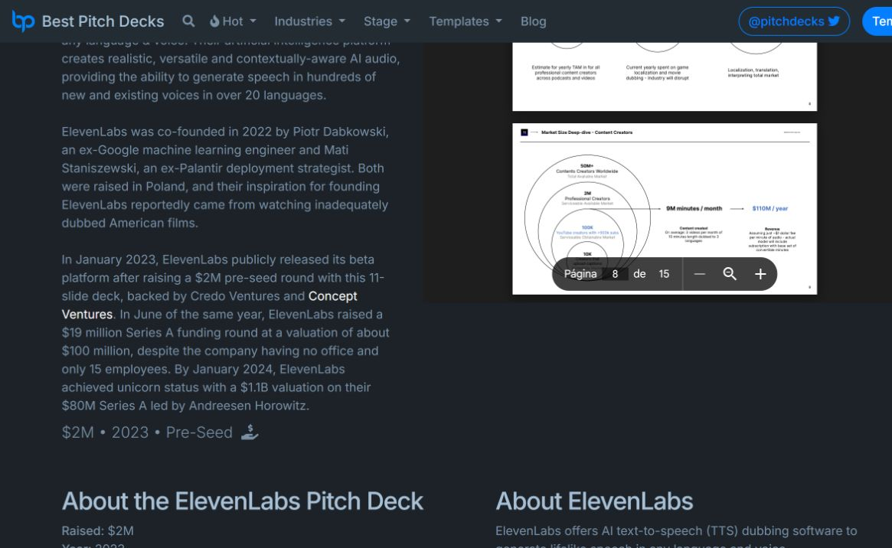

**Cómo comunica valor:** esta página aporta evidencia visual a la narrativa del deck. Su función es ayudar al lector a entender el problema, producto, mercado, tracción o ventaja competitiva que la empresa está construyendo. El valor se comunica al convertir una afirmación abstracta en una señal concreta que un cliente, socio o inversionista puede evaluar.

<strong>Página 9</strong>

**Cómo comunica valor:** esta página aporta evidencia visual a la narrativa del deck. Su función es ayudar al lector a entender el problema, producto, mercado, tracción o ventaja competitiva que la empresa está construyendo. El valor se comunica al convertir una afirmación abstracta en una señal concreta que un cliente, socio o inversionista puede evaluar.

<strong>Página 10</strong>

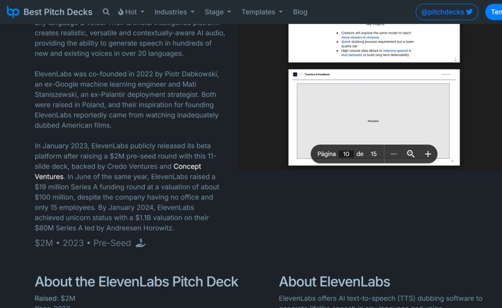

**Cómo comunica valor:** esta página aporta evidencia visual a la narrativa del deck. Su función es ayudar al lector a entender el problema, producto, mercado, tracción o ventaja competitiva que la empresa está construyendo. El valor se comunica al convertir una afirmación abstracta en una señal concreta que un cliente, socio o inversionista puede evaluar.

<strong>Página 11</strong>

**Cómo comunica valor:** esta página aporta evidencia visual a la narrativa del deck. Su función es ayudar al lector a entender el problema, producto, mercado, tracción o ventaja competitiva que la empresa está construyendo. El valor se comunica al convertir una afirmación abstracta en una señal concreta que un cliente, socio o inversionista puede evaluar.

<strong>Página 12</strong>

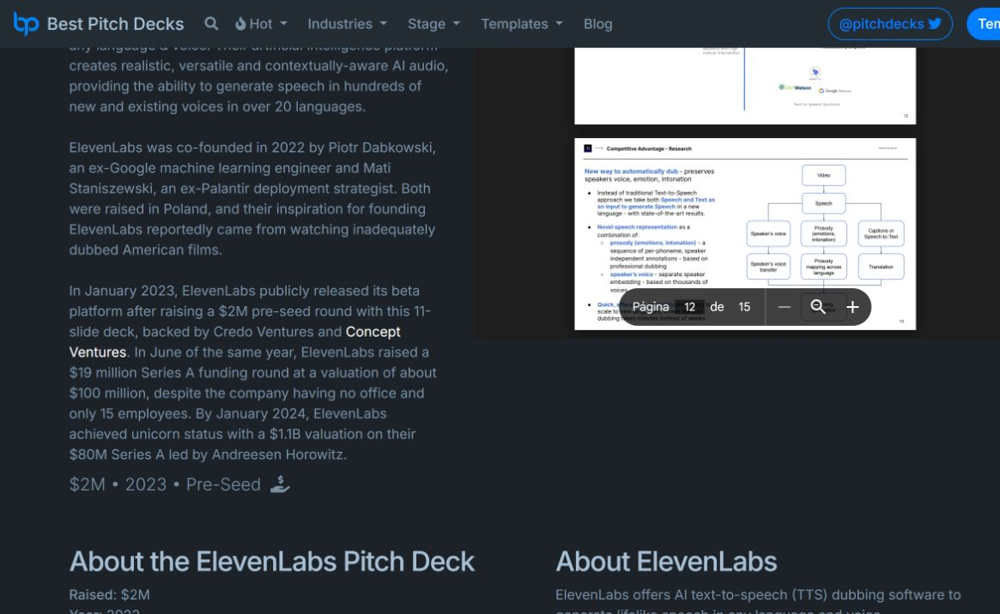

**Cómo comunica valor:** esta página aporta evidencia visual a la narrativa del deck. Su función es ayudar al lector a entender el problema, producto, mercado, tracción o ventaja competitiva que la empresa está construyendo. El valor se comunica al convertir una afirmación abstracta en una señal concreta que un cliente, socio o inversionista puede evaluar.

<strong>Página 13</strong>

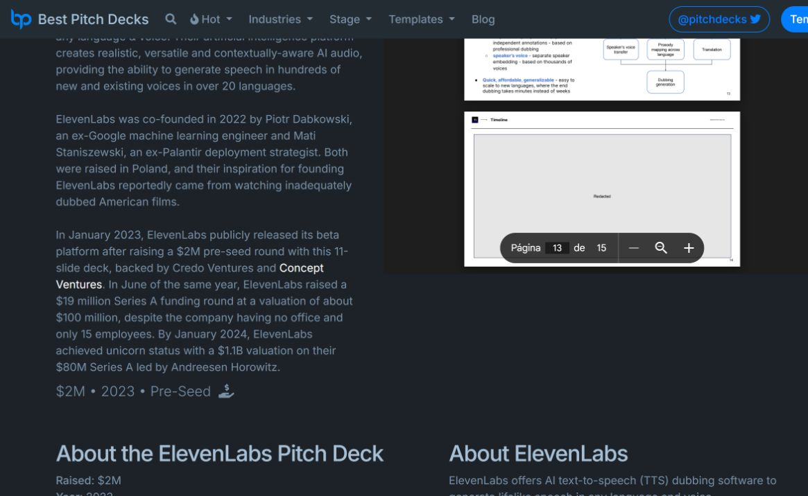

**Cómo comunica valor:** esta página aporta evidencia visual a la narrativa del deck. Su función es ayudar al lector a entender el problema, producto, mercado, tracción o ventaja competitiva que la empresa está construyendo. El valor se comunica al convertir una afirmación abstracta en una señal concreta que un cliente, socio o inversionista puede evaluar.

<strong>Página 14</strong>

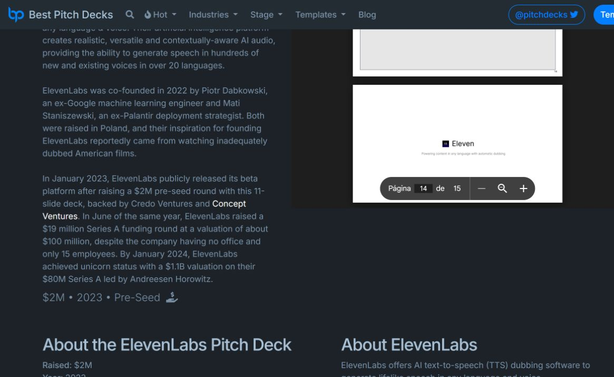

**Cómo comunica valor:** esta página aporta evidencia visual a la narrativa del deck. Su función es ayudar al lector a entender el problema, producto, mercado, tracción o ventaja competitiva que la empresa está construyendo. El valor se comunica al convertir una afirmación abstracta en una señal concreta que un cliente, socio o inversionista puede evaluar.

<strong>Página 15</strong>

**Cómo comunica valor:** esta página aporta evidencia visual a la narrativa del deck. Su función es ayudar al lector a entender el problema, producto, mercado, tracción o ventaja competitiva que la empresa está construyendo. El valor se comunica al convertir una afirmación abstracta en una señal concreta que un cliente, socio o inversionista puede evaluar.

## Lectura general

El deck debe leerse como una secuencia de problema, solución, evidencia y oportunidad. La creación de valor está en mostrar por qué la empresa merece atención y qué cambia para el usuario o el mercado si adopta su producto.
