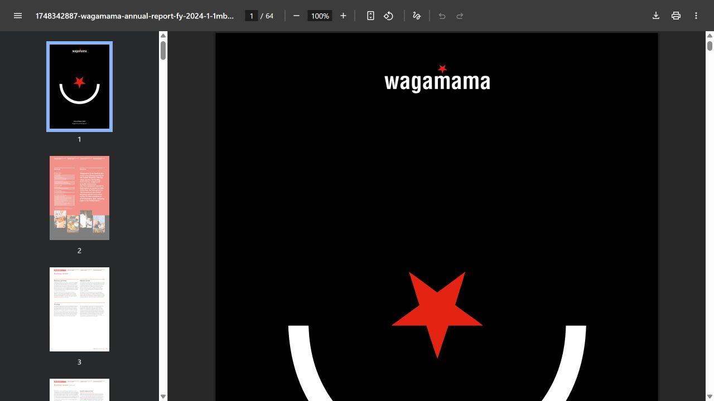
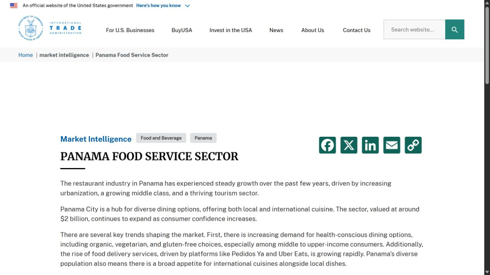
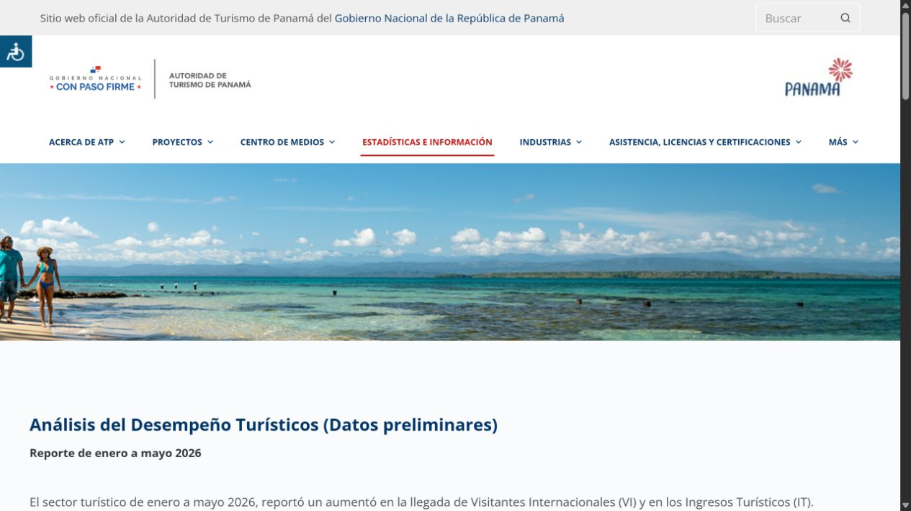

# Etapa 2 — Análisis del consumidor y validación de mercado

## Proyecto final: entrada de Wagamama a Panamá

> Esta entrega profundiza únicamente las dos primeras diapositivas. La información histórica y de franquicia proviene de fuentes oficiales; el segmento panameño sigue siendo una hipótesis que debe validarse con consumidores locales.

<strong>Slide 1 — Consumidor meta</strong>

### Cómo cumple los criterios

- Define un segmento inicial de **22 a 50 años**: jóvenes profesionales, ejecutivos, universitarios, extranjeros residentes y turistas urbanos.
- Conecta el perfil con el concepto real de Wagamama: comida asiática preparada al momento, ingredientes frescos, experiencia informal y cocina abierta.
- Propone contextos de consumo verificables en Panamá: zonas de oficinas, centros comerciales, áreas turísticas y corredores de alto tráfico.
- Prioriza motivaciones observables: probar una experiencia internacional, comer algo fresco, resolver una comida con rapidez y pedir por delivery.

### Qué se mejoró con la investigación

La segmentación ya no se basa solamente en “personas interesadas en comida asiática”. Se relaciona con los atributos que Wagamama comunica oficialmente desde su origen: nació en Londres en 1992 inspirada en los bares de ramen de Tokio y construyó su experiencia alrededor de ingredientes frescos, preparación al momento, cocina abierta y mesas compartidas. Eso permite formular una hipótesis más específica para Panamá: **consumidores urbanos que valoran una experiencia internacional fresca y conveniente**.

### Límite de la evidencia

La edad, las zonas prioritarias y la disposición a pagar son hipótesis de trabajo, no resultados de una encuesta panameña. Deben validarse con encuesta corta, entrevistas y observación en campo.

<strong>Slide 2 — Necesidad o deseo identificado</strong>

### Cómo cumple los criterios

- Explica que la oportunidad no es únicamente vender ramen: es ofrecer una experiencia internacional, fresca y preparada al momento.
- Organiza la necesidad en tres factores que pueden medirse: **frescura y calidad**, **diferenciación gastronómica** y **rapidez/conveniencia**.
- Traduce la propuesta oficial de la marca a una pregunta de mercado panameña: ¿existe un consumidor que quiera esa combinación y esté dispuesto a pagar por ella?
- Mantiene separados los hechos de la hipótesis: la propuesta de Wagamama está documentada; la demanda local todavía debe comprobarse.

### Qué se mejoró con la investigación

La slide deja de presentar “saludable y diferente” como una afirmación genérica. Ahora parte de una promesa concreta de marca: alimentos frescos, sabores asiáticos, preparación al momento y una experiencia informal. La validación debe medir si esa promesa resuelve una necesidad real frente a las alternativas actuales en Panamá.

### Preguntas para validar

- ¿Qué valora más el consumidor: frescura, sabor, rapidez, experiencia o precio?
- ¿Con qué frecuencia compra comida asiática o usa delivery?
- ¿Cuánto pagaría por una comida fresca de preparación rápida?
- ¿Qué platos reconoce y estaría dispuesto a probar?

<strong>Investigación de marca — historia y propuesta oficial</strong>

**Fuente:** [Wagamama — About us](https://www.wagamama.com/about-us)

La fuente oficial indica que Alan Yau se inspiró en los bares de ramen de Tokio y que el primer restaurante abrió en Bloomsbury, Londres, en 1992. También describe la preparación al momento, los ingredientes frescos, las cocinas abiertas y las mesas compartidas. Estos elementos sustentan los atributos usados en las slides 1 y 2.

<strong>Investigación de franquicia — capacidad de expansión</strong>

**Fuente:** [Wagamama — Franchise](https://www.wagamama.com/franchise)

La página oficial señala que Wagamama trabaja con franquicias internacionales desde hace más de 20 años, opera en 22 países mediante acuerdos de master franquicia y exige compromiso de desarrollo de 5 a 10 años, recursos financieros y capacidad operativa. Esto refuerza que la entrada a Panamá debe evaluarse como una operación de largo plazo, no solo como una novedad gastronómica.

<strong>Marca comparable — itsu como referencia de validación</strong>

**Fuente:** [itsu — Franchising](https://www.itsu.com/franchising/)

itsu funciona como referencia comparable de comida asiática rápida y saludable. Su página de franquicias destaca sistemas operativos construidos durante más de dos décadas, operaciones simples y la búsqueda de socios para nuevos territorios. No demuestra demanda en Panamá, pero ayuda a contrastar qué elementos de operación, ubicación y socio local habría que investigar.

<strong>Slide 3 — Evidencia de validación inicial</strong>

### Cómo se mejoró

La evidencia se organiza en tres niveles para no confundir la propuesta de la marca con la demanda panameña:

1. **Evidencia de la marca:** Wagamama comunica una experiencia de comida asiática fresca, preparada al momento y con una operación internacional de franquicias.
2. **Evidencia comparable:** itsu documenta sistemas operativos, franquicias y expansión hacia nuevos territorios en una categoría similar.
3. **Validación local pendiente:** todavía hay que medir en Panamá frecuencia de consumo, precio aceptable, interés por ramen y preferencia entre restaurante, delivery y centros comerciales.

### Qué debe comprobar el equipo

- Encuestar consumidores de 22 a 50 años en zonas urbanas y comerciales.
- Entrevistar a personas que consuman comida asiática o utilicen delivery.
- Observar horarios, tráfico y oferta de restaurantes comparables.
- Comparar precios, tiempos de servicio y formatos de menú.

### Interpretación correcta

Las fuentes oficiales validan que el concepto existe y puede operar internacionalmente. No prueban por sí solas que Panamá tenga demanda suficiente. Por eso la diapositiva presenta una **señal de oportunidad**, no una conclusión definitiva.

<strong>Slide 4 — Insight del consumidor</strong>

### Insight de trabajo

> “Quiero probar una experiencia asiática diferente y fresca, pero debe ser suficientemente rápida, clara y conveniente para integrarse a mi rutina.”

### Cómo se mejoró

El insight conecta tres elementos de la investigación:

- **Experiencia:** Wagamama nace de la inspiración de los bares de ramen de Tokio y construye una experiencia informal y compartida.
- **Producto:** la marca comunica ingredientes frescos y preparación al momento.
- **Operación:** la expansión mediante franquicia exige adaptar ubicación, precio, menú y ejecución al mercado local.

### Cómo se valida

El equipo debe preguntar qué pesa más en la decisión: sabor, frescura, rapidez, precio, ambiente, delivery o novedad. Si las respuestas confirman esa combinación, el insight puede convertirse en criterio para elegir ubicación, menú y comunicación de la franquicia en Panamá.

<strong>Investigación adicional 1 — posición internacional actual</strong>

**Fuente:** [Wagamama Annual Report 2024](https://www.datocms-assets.com/99160/1748342887-wagamama-annual-report-fy-2024-1-1mb.pdf)

El informe reporta **55 locales franquiciados internacionales al cierre de 2024**, cinco aperturas internacionales durante ese año y planes de expansión hacia India mediante aeropuertos. La lectura estratégica es que Wagamama no está probando por primera vez la franquicia internacional: ya tiene un sistema de expansión y continúa buscando nuevos territorios.

**Implicación para Panamá:** la oportunidad debe analizarse como una entrada de marca internacional con exigencias de operador, ubicación, capital y consistencia de ejecución. No basta con demostrar que existe interés por la comida asiática.

<strong>Investigación adicional 2 — condiciones del mercado de restaurantes en Panamá</strong>

**Fuente:** [U.S. Department of Commerce — Panama Food Service Sector](https://www.trade.gov/market-intelligence/panama-food-service-sector)

La fuente identifica crecimiento del sector impulsado por urbanización, clase media y turismo; también señala crecimiento del delivery, apetito por cocinas internacionales y espacio para opciones de precio medio con calidad. El mismo documento advierte que los márgenes del sector suelen ser estrechos, por lo que la propuesta debe validarse con precios, rotación y costos reales.

**Implicación para Panamá:** Wagamama podría encajar por su formato fast-casual, delivery y cocina internacional, pero la hipótesis depende de elegir una ubicación con tráfico y de alcanzar un precio accesible sin destruir el margen.

<strong>Investigación adicional 3 — demanda turística que puede apoyar la entrada</strong>

**Fuente:** [Autoridad de Turismo de Panamá — Estadísticas e información del mercado](https://www.atp.gob.pa/estadisticas-e-informacion-del-mercado-2/)

La Autoridad de Turismo concentra estadísticas oficiales de desempeño turístico y permite comprobar la evolución de llegadas, mercados emisores y comportamiento del visitante. Esta fuente debe usarse para seleccionar zonas y temporadas, no para asumir automáticamente que todo turista será cliente.

**Implicación para Panamá:** la primera ubicación debería contrastar tráfico residente y turístico. Las zonas con hoteles, centros comerciales, oficinas y conectividad pueden ofrecer una combinación más sólida que depender únicamente de turistas.

<strong>Conclusión provisional: ¿podría funcionar Wagamama en Panamá?</strong>

La investigación permite decir **“hay una hipótesis razonable de encaje, pero todavía no una validación definitiva”**.

**A favor:** marca con trayectoria desde 1992, propuesta diferenciada, experiencia de franquicia internacional, crecimiento en nuevos territorios, turismo y demanda local por comida internacional y delivery.

**Riesgos:** precio, competencia asiática existente, disponibilidad de ingredientes, costos operativos, tamaño real del segmento y necesidad de adaptar menú y comunicación.

**Siguiente prueba recomendada:** comparar tres ubicaciones en Ciudad de Panamá, entrevistar consumidores, medir precio aceptable y probar un menú reducido mediante pop-up o evento de degustación. La decisión debe basarse en frecuencia de compra, ticket promedio, margen y repetición, no solo en interés declarado.

## Frase obligatoria de cierre de la etapa

> Nuestro consumidor meta en Panamá es un público urbano de 22 a 50 años que busca una experiencia asiática fresca, internacional y conveniente. La oportunidad existe porque Wagamama combina una propuesta diferenciada con un modelo de expansión internacional ya probado. La evidencia inicial que encontramos fue la historia oficial de la marca, su propuesta de producto, su experiencia de franquicia y la referencia comparable de itsu. Por eso, la franquicia debe enfocarse en validar ubicación, precio, frecuencia de consumo y aceptación del menú antes de confirmar la entrada al mercado.

