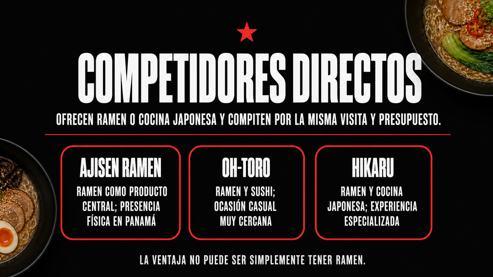
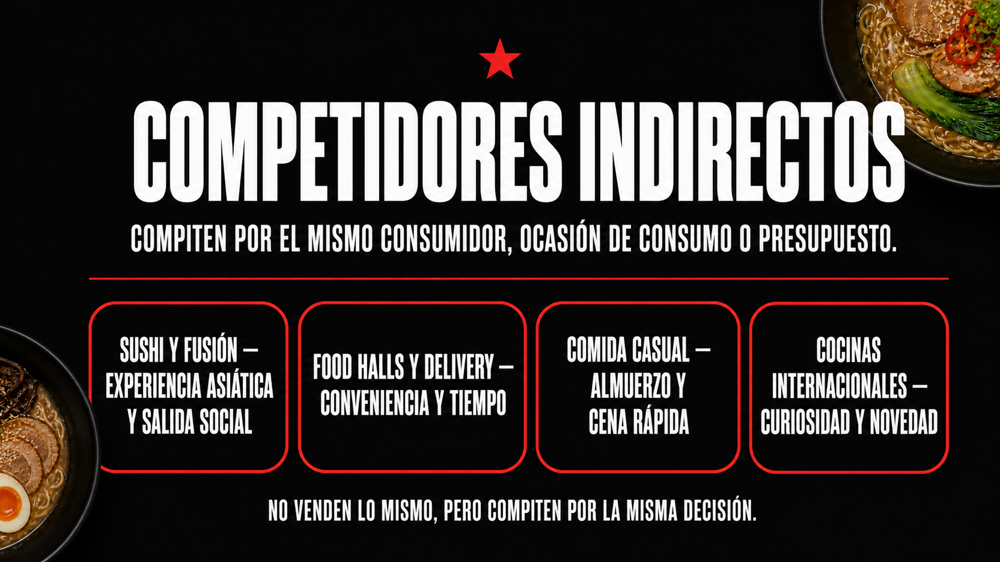
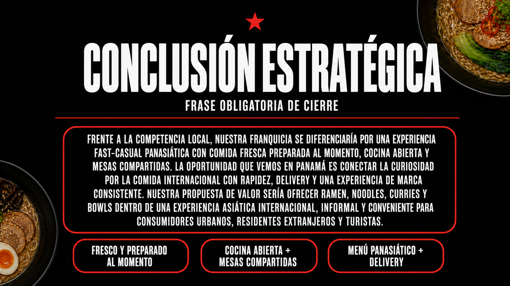

# Etapa 3 — Competencia, diferenciación y propuesta de valor local

## Proyecto final: entrada de Wagamama a Panamá

> Esta etapa analiza la competencia visible en Panamá y formula una diferenciación que debe comprobarse con visitas, precios y entrevistas. Las fuentes separan datos publicados de inferencias estratégicas.

<strong>Slide 1 — Competidores directos</strong>

### Ajisen Ramen

Es el competidor directo más evidente: ofrece ramen, cocina japonesa y una experiencia de restaurante especializada. Su sitio oficial indica que inició operaciones en Panamá en 2019, cuenta con seis sucursales y pertenece a una marca con más de 800 restaurantes a nivel mundial.

### Oh-Toro Ramen & Sushi

Compite por la ocasión de consumo de ramen, sushi y comida japonesa casual. Su menú publicado muestra una oferta centrada en ramen y platos japoneses.

### Hikaru

Compite por consumidores que buscan ramen y cocina japonesa de mayor especialización. Su presencia en Marbella y su oferta de ramen lo convierten en una referencia directa para comparar producto, ubicación y experiencia.

### Lectura estratégica

Wagamama no entraría en un mercado sin competencia. Entraría frente a operadores que ya educaron al consumidor sobre ramen y comida japonesa. La ventaja no puede ser simplemente “tener ramen”.

### Por qué son competidores directos

- **Ajisen Ramen:** ofrece ramen como producto central, tiene presencia física en Panamá y compite por el consumidor que busca una comida japonesa especializada.
- **Oh-Toro Ramen & Sushi:** combina ramen y sushi en una ocasión de consumo muy cercana a la de Wagamama: comida asiática casual para comer en el restaurante o pedir.
- **Hikaru:** compite por consumidores que buscan ramen y cocina japonesa en zonas urbanas de Panamá, especialmente por una experiencia de restaurante especializada.
- **Criterio común:** las tres opciones ofrecen productos japoneses o ramen y satisfacen una necesidad similar; por eso compiten directamente por atención, visita y presupuesto.

Evidencia y fuentes

- [Ajisen Ramen Panamá — Nosotros](https://ajisenramenpanama.com/nosotros/)
- [Ajisen Ramen Panamá — Contacto y sucursales](https://ajisenramenpanama.com/contacto/)
- [Oh-Toro — menú publicado](https://enam-cdn.carta.menu/storage/media/companies_menu_pdf/88840832/oh-toro-ramen-and-sushi-ciudad-de-panama-carta.pdf)
- [Hikaru — ficha pública con ramen y delivery](https://www.tripadvisor.com/Restaurant_Review-g294480-d11826563-Reviews-Restaurante_Hikaru-Panama_City_Panama_Province.html)

<strong>Slide 1.1 — Evidencia de competidores directos</strong>

**Fuentes:** [Ajisen Ramen Panamá](https://ajisenramenpanama.com/nosotros/), [Oh-Toro — menú publicado](https://enam-cdn.carta.menu/storage/media/companies_menu_pdf/88840832/oh-toro-ramen-and-sushi-ciudad-de-panama-carta.pdf) y [Hikaru](https://www.tripadvisor.com/Restaurant_Review-g294480-d11826563-Reviews-Restaurante_Hikaru-Panama_City_Panama_Province.html).

Estas fuentes respaldan que existen operadores de ramen y cocina japonesa en Panamá. La comparación competitiva debe confirmarse con capturas individuales de menús, precios y ubicaciones durante el trabajo de campo.

<strong>Slide 2.1 — Evidencia de competidores indirectos</strong>

**Fuentes:** [EATHH](https://www.eathh.com/en), [Makoto — menú de almuerzo](https://makotopanama.com/wp-content/uploads/2024/04/lunch.pdf) y [U.S. Department of Commerce — Panama Food Service Sector](https://www.trade.gov/market-intelligence/panama-food-service-sector).

La evidencia muestra que el consumidor también puede elegir sushi, fusión, food halls, delivery y otras comidas internacionales. Esto justifica analizar la competencia por ocasión de consumo y presupuesto, no solo por producto.

<strong>Slide 2 — Competidores indirectos</strong>

### Sushi y cocina japonesa

Makoto y otras marcas de sushi compiten por el mismo consumidor urbano que busca una experiencia asiática, una comida social y un ticket medio o alto.

### Cocina asiática amplia

Restaurantes de fusión, comida china, coreana, vietnamita y tailandesa compiten por la curiosidad gastronómica y el deseo de probar sabores internacionales.

### Delivery y food halls

EATHH compite por conveniencia: reúne 12 marcas en un solo pedido. No ofrece exactamente la misma experiencia que Wagamama, pero compite por la misma ocasión de consumo y por el presupuesto de delivery.

### Comida casual internacional

Hamburguesas, bowls, cafeterías y otras cadenas fast-casual compiten por almuerzos, cenas rápidas y reuniones informales.

### Por qué son competidores indirectos

- **Sushi y fusión:** no ofrecen exactamente el menú de Wagamama, pero compiten por el mismo deseo de probar comida asiática y por una salida social.
- **Food halls y delivery:** compiten por conveniencia, tiempo de entrega y presupuesto, aunque no reproduzcan la experiencia de restaurante.
- **Comida casual internacional:** compite por la misma decisión de almuerzo o cena rápida y por el dinero disponible del consumidor.
- **Criterio común:** la competencia indirecta se define por consumidor, ocasión y presupuesto, no por vender el mismo plato.

Evidencia y fuentes

- [Makoto Panamá — menú de almuerzo](https://makotopanama.com/wp-content/uploads/2024/04/lunch.pdf)
- [EATHH — food hall virtual y delivery](https://www.eathh.com/en)
- [U.S. Department of Commerce — Panama Food Service Sector](https://www.trade.gov/market-intelligence/panama-food-service-sector)

<strong>Slide 3.1 — Evidencia para la comparación competitiva</strong>

**Fuente:** [Wagamama — Franchise](https://www.wagamama.com/franchise).

La fuente respalda las variables de escala, modelo de franquicia, capacitación y desarrollo de largo plazo. Para completar la comparación local faltan capturas de precios, ubicaciones, delivery y redes sociales de cada competidor.

<strong>Slide 4.1 — Evidencia de la brecha de mercado</strong>

**Fuente:** [U.S. Department of Commerce — Panama Food Service Sector](https://www.trade.gov/market-intelligence/panama-food-service-sector).

El documento señala crecimiento del delivery, turismo, urbanización y demanda por cocinas internacionales. Esto respalda la hipótesis de una oportunidad para una propuesta asiática rápida y experiencial, pero no demuestra por sí solo que exista una brecha desatendida.

<strong>Slide 3 — Comparación competitiva</strong>

| Variable | Ajisen | Oh-Toro / Hikaru | Sushi y fusión | Wagamama potencial |
|---|---|---|---|---|
| Producto | Ramen especializado | Ramen y comida japonesa | Sushi y platos asiáticos | Menú panasiático con ramen, noodles, curries y bowls |
| Experiencia | Especialista en ramen | Casual y local | Social, japonesa o fusión | Cocina abierta, mesas compartidas y experiencia internacional |
| Escala | Franquicia internacional con presencia local | Operación local | Marcas locales o regionales | Franquicia internacional con 55 locales franquiciados internacionales al cierre de 2024 |
| Conveniencia | Restaurante y delivery según sucursal | Restaurante y delivery según oferta | Delivery y consumo social | Debe validar delivery, ubicación y velocidad en Panamá |
| Diferenciación | Ramen tonkotsu y reconocimiento | Variedad japonesa | Sushi, fusión o especialización | Sistema de marca: producto fresco + experiencia + menú amplio |

### Interpretación

La comparación evita afirmar que Wagamama es superior en todo. Su posible diferencia está en combinar amplitud de menú, experiencia de marca, operación fast-casual y expansión internacional; esa combinación debe probarse localmente.

<strong>Slide 5.1 — Evidencia de la propuesta de valor local</strong>

**Fuente:** [Wagamama — About us](https://www.wagamama.com/about-us).

La propuesta de valor local toma atributos que la propia marca comunica: comida fresca, preparación al momento, cocina abierta y experiencia compartida. La adaptación a Panamá —precio, menú, ubicación y delivery— todavía debe probarse localmente.

<strong>Slide 4 — Brecha u oportunidad en Panamá</strong>

### Brecha propuesta

Existe una oportunidad potencial entre dos extremos:

- restaurantes especializados en ramen o sushi;
- opciones amplias de delivery y comida casual sin una experiencia asiática integrada.

Wagamama podría ocupar el espacio de **comida asiática internacional, fresca, rápida y con una experiencia de marca reconocible**, sin posicionarse únicamente como ramen premium.

### Por qué esta brecha es plausible

- Panamá tiene demanda por cocinas internacionales y crecimiento del delivery.
- Wagamama tiene una propuesta histórica basada en comida fresca preparada al momento y una experiencia informal.
- La marca ya ha desarrollado un sistema de franquicia internacional.

### Qué puede invalidarla

Precio demasiado alto, baja frecuencia de consumo, poca familiaridad con noodles o curries, competencia mejor ubicada y costos de operación que impidan un ticket medio.

<strong>Slide 6.1 — Evidencia de la conclusión estratégica</strong>

**Fuente:** [Wagamama Annual Report 2024](https://www.datocms-assets.com/99160/1748342887-wagamama-annual-report-fy-2024-1-1mb.pdf).

El informe reporta 55 locales franquiciados internacionales al cierre de 2024 y nuevas aperturas. Esto respalda que Wagamama tiene experiencia de expansión, pero no elimina los riesgos locales de precio, competencia, ubicación y operación.

<strong>Slide 5 — Propuesta de valor local</strong>

> **Para profesionales, residentes extranjeros, estudiantes y turistas urbanos en Panamá que buscan una comida asiática diferente sin perder rapidez ni conveniencia, Wagamama ofrecería bowls, noodles, ramen y curries frescos preparados al momento, dentro de una experiencia internacional, informal y accesible.**

### Elementos que deben adaptarse

- Menú reducido inicialmente para controlar inventario y operación.
- Opciones vegetarianas y adaptaciones de picante sin perder identidad.
- Ubicación con mezcla de oficinas, residentes, centros comerciales y turismo.
- Delivery diseñado para conservar textura, temperatura y presentación.
- Precio que permita repetición, no solo una visita de novedad.

<strong>Slide 6 — Conclusión estratégica</strong>

Wagamama no debería competir contra Ajisen intentando ser “otro restaurante de ramen”. Su oportunidad sería entrar como una experiencia fast-casual panasiática: más amplia que un especialista de ramen, más estructurada que un restaurante independiente y más experiencial que una marca puramente de delivery.

La recomendación es **avanzar a una validación comercial**, no confirmar todavía la inversión. El siguiente paso debería ser comparar tres ubicaciones, levantar precios de competidores, entrevistar consumidores y probar un menú corto.

### Frase obligatoria de cierre

> Frente a la competencia local, nuestra franquicia se diferenciaría por combinar una experiencia panasiática internacional, un menú amplio y fresco y una operación fast-casual consistente. La oportunidad que vemos en Panamá es ocupar el espacio entre el ramen especializado y el delivery sin experiencia de marca, y nuestra propuesta de valor sería ofrecer comida asiática preparada al momento, rápida y conveniente para consumidores urbanos, residentes extranjeros y turistas.

