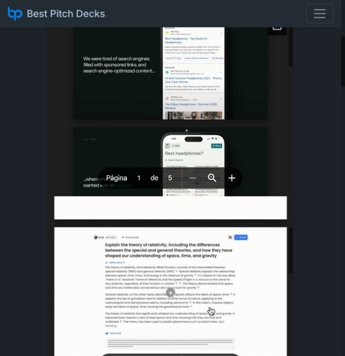
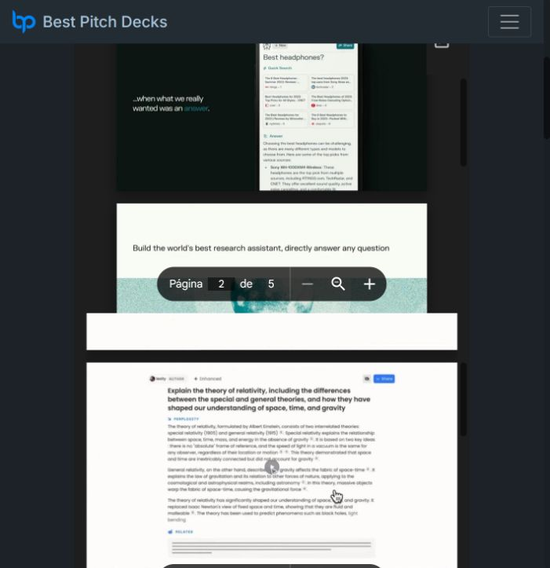
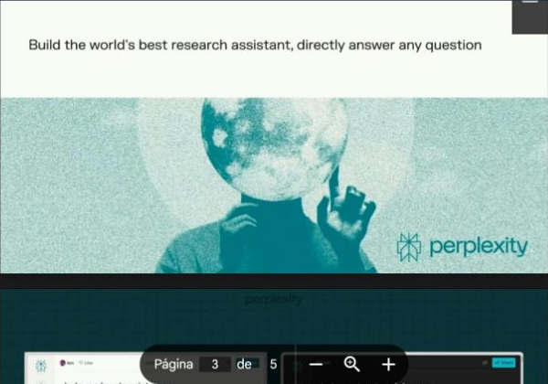
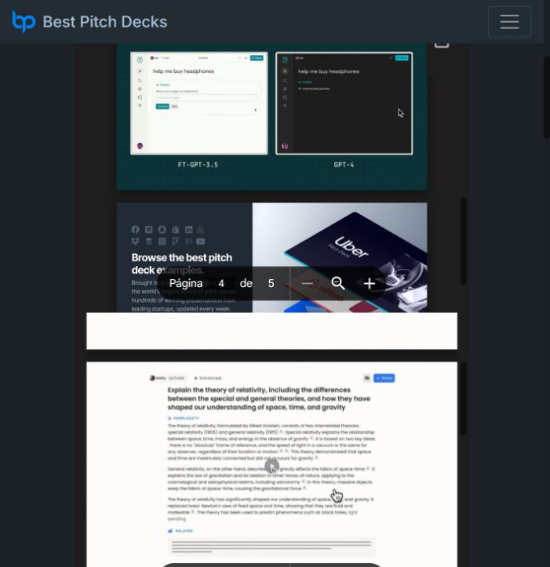
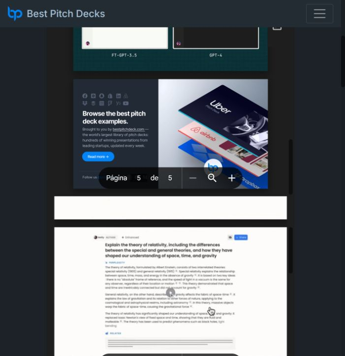

# Perplexity AI — pitch deck página por página

Fuente: [Perplexity AI Pitch Deck — Best Pitch Deck](https://bestpitchdeck.com/perplexity-ai)

Este documento contiene las cinco páginas que expone el visor del deck. Las capturas son evidencia visual; el análisis debajo de cada una es una interpretación estratégica, no una transcripción literal completa.

<strong>Página 1 — El problema: búsquedas llenas de anuncios y contenido optimizado para buscadores</strong>

**Cómo genera valor:** la página presenta una frustración conocida: los buscadores tradicionales pueden priorizar enlaces patrocinados y contenido creado para posicionarse, no necesariamente para responder bien. El valor de Perplexity se plantea como reducir el ruido y entregar una respuesta más directa, ahorrando tiempo al usuario.

<strong>Página 2 — De buscar enlaces a obtener una respuesta</strong>

**Cómo genera valor:** la propuesta cambia la unidad de valor de “una lista de resultados” a “una respuesta útil”. Eso mejora la experiencia cuando el usuario necesita entender, comparar o investigar, porque disminuye el trabajo de abrir múltiples páginas y sintetizar información manualmente.

<strong>Página 3 — Visión de producto: un asistente de investigación que responde directamente</strong>

**Cómo genera valor:** la visión amplía el producto desde un buscador hacia un asistente de investigación. El valor potencial está en combinar velocidad, contexto y claridad para que el usuario pase de una pregunta a una comprensión accionable con menos pasos.

<strong>Página 4 — Demostración del producto y comparación de calidad</strong>

**Cómo genera valor:** una demostración concreta hace visible la promesa: el usuario puede formular una pregunta y recibir una respuesta estructurada. La comparación entre modelos comunica que la experiencia no depende solo del modelo subyacente, sino de cómo el producto organiza la búsqueda, la respuesta y la interacción.

<strong>Página 5 — Contexto competitivo y referencia al mercado de pitch decks</strong>

**Cómo genera valor:** esta página funciona como cierre visual del visor y contexto del ecosistema. Para Perplexity, el aprendizaje estratégico es que una narrativa de producto necesita cerrar con una imagen memorable y una asociación clara con la categoría en la que quiere competir.

## Lectura general

El deck sigue una secuencia simple: problema → nueva forma de responder → visión de producto → demostración → cierre. La creación de valor se concentra en ahorrar tiempo de investigación, disminuir el ruido de los resultados y convertir información dispersa en respuestas que ayuden a decidir.
