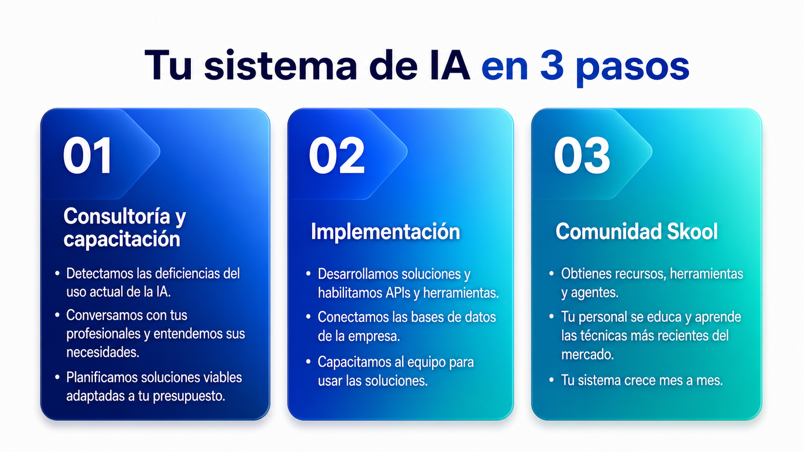
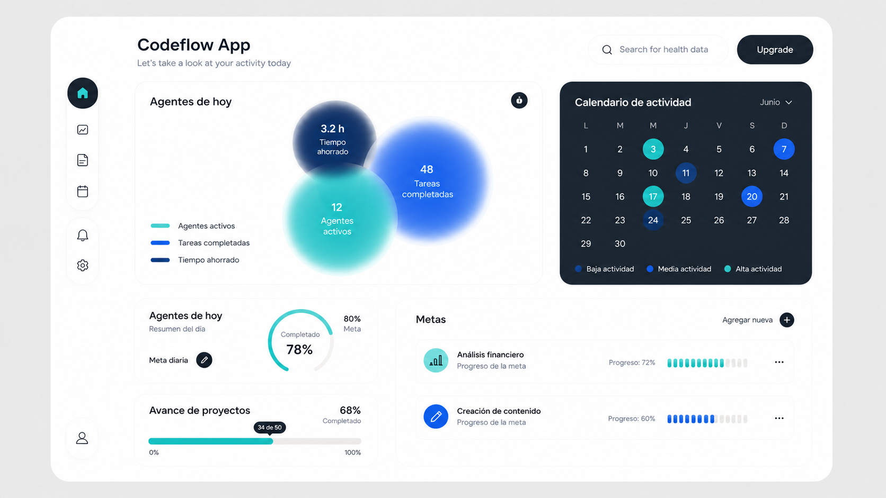
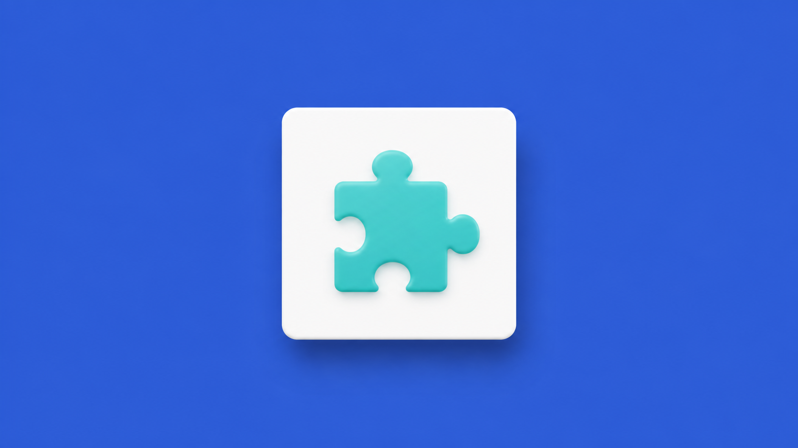
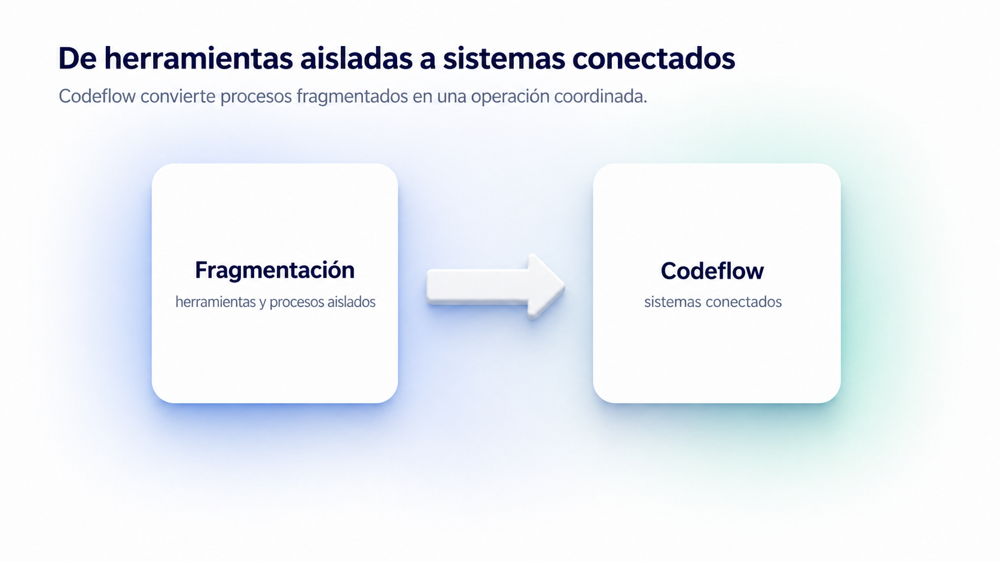
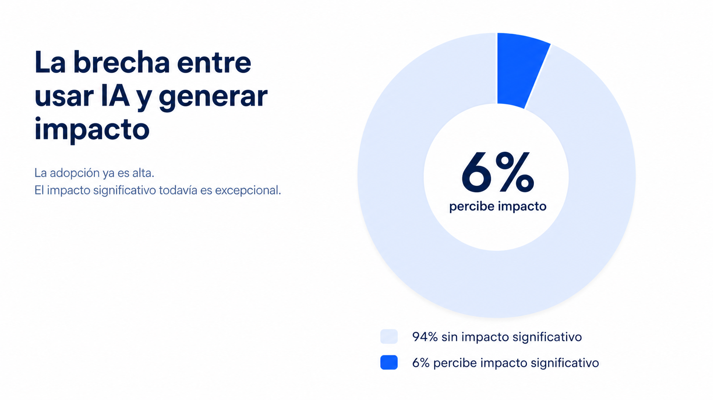
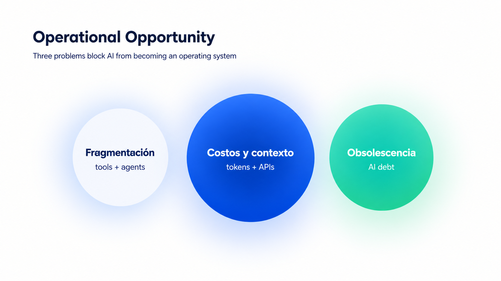

# Codeflow — Pitch revisado

<details>
<summary><strong>Diapositiva — tu sistema de IA en 3 pasos</strong></summary>



La propuesta organiza la oferta en tres fases: consultoría y capacitación, implementación y Comunidad Skool. La paleta reemplaza los tonos cálidos de la referencia por azul y turquesa Codeflow.
</details>

<details>
<summary><strong>Dashboard — Codeflow App</strong></summary>



Recreación de la arquitectura visual del dashboard de referencia: agentes de hoy, calendario de actividad, metas de análisis financiero y creación de contenido, avance de proyectos y métricas operativas. La paleta reemplaza los acentos coral/amarillo por turquesa y azul Codeflow.
</details>

<details>
<summary><strong>Diapositiva — pieza central / sistema Codeflow</strong></summary>



Composición minimalista: una pieza única turquesa dentro de un contenedor blanco 3D sobre fondo azul. La pieza representa un componente operativo listo para integrarse en un sistema mayor.
</details>

<details>
<summary><strong>Diapositiva — de herramientas aisladas a sistemas conectados</strong></summary>



La composición muestra la transición operativa: **Fragmentación → Codeflow**.
</details>

<details>
<summary><strong>Diapositiva — solo el 6% percibe impacto significativo</strong></summary>



Esta visualización sustituye las barras por un donut: el segmento azul representa el **6% que percibe impacto significativo** y el segmento azul pálido muestra el complemento visual del **94% restante**. La cifra se presenta como distribución complementaria del dato, no como una categoría independiente inventada.

**Fuente:** [BID — Inteligencia artificial: ¿motor de productividad o de desigualdad?](https://www.iadb.org/es/blog/analisis-economico/inteligencia-artificial-motor-de-productividad-o-de-desigualdad).
</details>

<details>
<summary><strong>Diapositiva — oportunidad operativa / modelo de negocio</strong></summary>



### Qué comunica

La oportunidad no se presenta como un mercado abstracto, sino como tres problemas operativos que Codeflow puede convertir en un sistema conectado:

- **Fragmentación:** herramientas, agentes y automatizaciones aisladas.
- **Costos y contexto:** tokens, APIs, suscripciones y pérdida de información sin control común.
- **Obsolescencia:** procesos que quedan atrás cuando cambian los modelos y las herramientas.

La composición replica la estructura de la referencia: tres círculos horizontales con tamaños relativos, halos y lectura de izquierda a derecha. El fondo blanco, azul y verde claro cambia el tono de “problema” a “oportunidad de construir una operación escalable”, sin convertirla en un gráfico financiero.

### Prompt de diseño

```text
Premium 16:9 B2B pitch deck slide for Codeflow, clean white background with pale blue and light green gradients, three glowing planet-like spheres labeled Fragmentación, Costos y contexto, and Obsolescencia, connected by thin orbital lines to a larger central sphere labeled Codeflow, strategic Silicon Valley technology aesthetic, spacious and analytical, no SAM/SOM/TAM, no dollar amounts, no logos, no extra text.
```
</details>

<details>
<summary><strong>Cómo funcionan los datos y el problema que Codeflow resuelve</strong></summary>

### Contexto

El BID reporta cerca del 80% de uso de herramientas de IA, pero solo 23% afirma obtener réditos económicos y 6% percibe impacto significativo. Esto mide uso e impacto reportado; no significa que el 80% tenga un sistema integrado.

**Fuente:** [BID — Inteligencia artificial: ¿motor de productividad o de desigualdad?](https://www.iadb.org/es/blog/analisis-economico/inteligencia-artificial-motor-de-productividad-o-de-desigualdad).

### Interés regional

ALC concentra 14% de las visitas globales a soluciones de IA frente a 11% de los usuarios globales de Internet. Es un proxy de interés, no una cifra de empresas implementando IA.

**Fuente:** [CEPAL/ILIA](https://www.cepal.org/es/comunicados/america-latina-caribe-acelera-la-adopcion-la-inteligencia-artificial-aunque-desafios).

### Problema 1 — herramientas individuales, no sistemas operativos

Los trabajadores construyen soluciones para su propia tarea: chats, hojas, agentes o workflows. Pueden resolver un paso, pero no conectar datos, permisos, decisiones y responsabilidades entre departamentos. Con el tiempo aparecen islas de automatización, duplicación de contexto y dependencia de personas.

**Fuente:** [`analisis-critico-codeflow-marca-personal.md`](../analisis-critico-codeflow-marca-personal.md), [`comparacion-pitch-codeflow.md`](../comparacion-pitch-codeflow.md).

### Problema 2 — consumo, tokens y presupuesto sin gobierno

Cada flujo puede consumir tokens, APIs, suscripciones, contexto y reintentos. Sin medición por workflow y departamento, la empresa no sabe qué automatización produce valor ni cuál agota el presupuesto.

**Referencia:** la [OCDE](https://www.oecd.org/content/dam/oecd/en/publications/reports/2025/06/governing-with-artificial-intelligence_398fa287/795de142-en.pdf) publica costos por millón de tokens y muestra que varían por modelo, entrada y salida.

**Dato propio que falta:** costo mensual por workflow, tokens por ejecución, reintentos, APIs, suscripciones y costo por resultado.

### Problema 3 — obsolescencia rápida

La empresa puede aplicar conocimiento actual, pero sin actualización constante de modelos, APIs, seguridad y prácticas se queda atrás. La solución necesita evaluación, documentación y mejora continua.

**Fuente:** [McKinsey — The State of AI 2025](https://www.mckinsey.com/capabilities/quantumblack/our-insights/the-state-of-ai), sobre pasar de pilotos a impacto escalado mediante procesos, infraestructura, talento y KPIs.

### El puente hacia Codeflow

Codeflow no inventa otra herramienta: monta un sistema de trabajo conectado usando APIs, suscripciones y herramientas existentes, coordinadas como un equipo. Integra agentes, automatizaciones, datos, reglas, personas y aprobaciones.

La lógica es tipo LEGO: cada bloque resuelve una función, pero puede conectarse con el siguiente. Una empresa puede empezar con una automatización y, en lugar de acumular cuatro soluciones aisladas, integrarlas dentro de una arquitectura que después escale a otros departamentos.

**Diferenciación:** reutilizar arquitectura, datos, permisos, métricas y patrones para ampliar el sistema sin reconstruir silos.

**Validación pendiente:** demostrar que integrar un segundo proceso requiere menos tiempo, costo y retrabajo que construirlo desde cero.
</details>

<details>
<summary><strong>Datos que faltan para validar Codeflow</strong></summary>

| Hipótesis | Qué medir | Evidencia aceptable | Umbral inicial |
|---|---|---|---|
| Demanda B2B real | 20–30 entrevistas con compradores | problema, urgencia y presupuesto registrados | 10 problemas recurrentes; 6 urgentes |
| Diagnóstico pagado | propuestas, pagos e informes entregados | cotización aceptada y pago recibido | 3 pagados; 2 avanzan |
| Flujo resoluble | pilotos con línea base | demo, logs y aceptación del usuario | 3 pilotos; 2 cumplen el resultado |
| Valor medible | horas, errores, tiempo o costo antes/después | datos del sistema y validación del cliente | ≥20% de mejora sin perder calidad |
| Entrega con margen | horas, excepciones y costos variables | time tracking, runbook y facturas | ≥70% repetible; margen bruto ≥50% |
| Recurrencia | uso, soporte y renovación | contrato, factura, actividad y backlog | 2 de 3 pilotos renuevan |
| Comunidad útil | onboarding, uso y casos resueltos | cohortes, asistencia y referidos | 70% onboarding; 60% uso mensual |
| Seguridad | secretos, accesos y aprobación humana | rotación, matriz de acceso y logs | cero secretos expuestos |
| Economía | CAC, costos, margen y churn | facturas, horas y cohortes | LTV/CAC ≥3; payback ≤6 meses |

**Orden:** seguridad → entrevistas → diagnósticos → 3–5 pilotos pagados → medición antes/después → continuidad → renovación a 30/90 días.

**Estado:** las fuentes externas validan la brecha entre uso de IA e impacto y muestran modelos de comunidad; todavía no prueban demanda, precio, retención ni capacidad operativa de Codeflow.
</details>

<details>
<summary><strong>Pitch completo</strong></summary>

1. **Contexto:** cerca del 80% usa herramientas de IA; 23% afirma obtener réditos económicos; 6% percibe impacto significativo.
2. **Interés regional:** 14% de visitas globales a soluciones de IA frente a 11% de usuarios globales de Internet; proxy, no adopción empresarial.
3. **Problema:** herramientas y procesos fragmentados pierden contexto, tiempo y control.
4. **Insight:** usar IA no es operar con IA; el valor aparece al integrar, medir, gobernar y mantener.
5. **Solución:** Codeflow ayuda a empresas latinoamericanas a pasar de herramientas aisladas a procesos conectados, medibles y mantenibles.
6. **Evidencia:** 3 horas → 10 minutos, 97% menos tiempo, 20% de cartera optimizada, 15 sistemas y 95–98% de precisión; publicar solo con contexto y autorización.
7. **Cliente:** empresas medianas de Panamá con procesos financieros, operativos o comerciales repetitivos; compradores en dirección, finanzas, operaciones o tecnología.
8. **Oferta:** diagnóstico → sprint conectado → operación continua; la comunidad acompaña la adopción.
9. **Validación:** 3–5 empresas, un proceso por empresa, línea base, piloto pagado, métrica primaria y decisión de renovación.
10. **Cierre:** **Empieza con un proceso crítico. Construye el sistema. Evoluciona con evidencia.** CTA: **Agendar diagnóstico.**
</details>

<details open>
<summary><strong>01 · La cifra de apertura — adopción no es impacto</strong></summary>

> **80%** usa herramientas de IA.
>
> Solo **23%** reporta réditos económicos.
>
> Apenas **6%** percibe impacto significativo.

**Fuente:** [`investigacion-codeflow-datos.md`](../investigacion-codeflow-datos.md), [`evidencia-estudios-oficiales-codeflow.md`](../evidencia-estudios-oficiales-codeflow.md), [BID](https://www.iadb.org/es/blog/analisis-economico/inteligencia-artificial-motor-de-productividad-o-de-desigualdad).


**Tesis:** el mercado no necesita otra herramienta aislada; necesita convertir uso de IA en valor operativo. En los documentos fuente aparece 23%, no 26%.
</details>

<details>
<summary><strong>02 · Latinoamérica ya está dentro de la conversación</strong></summary>

**Texto:** Latinoamérica ya muestra interés por la IA. El reto es transformar ese interés en capacidades, gobierno e integración empresarial.

**Dato visual:** 14% de visitas globales a soluciones de IA frente a 11% de usuarios globales de Internet en ALC.

**Fuente/captura:** [`evidencia-estudios-oficiales-codeflow.md`](../evidencia-estudios-oficiales-codeflow.md), [`codeflow-evidencia/cepal-14-11.png`](../codeflow-evidencia/cepal-14-11.png), [CEPAL](https://www.cepal.org/es/comunicados/america-latina-caribe-acelera-la-adopcion-la-inteligencia-artificial-aunque-desafios).


**Límite:** es un proxy de interés, no 14% de empresas implementando IA.

**Prompt:** `Pitch deck B2B 16:9, zoom desde Panamá hacia Latinoamérica, mapa oscuro, 14% visitas y 11% usuarios como cifras editoriales, nota proxy de interés, sin logos ni texto inventado.`
</details>

<details>
<summary><strong>03 · El mundo experimenta; el valor exige operación</strong></summary>

**Texto:** El mundo ya experimenta con IA. La ventaja está en convertirla en una operación que funcione.

**Visual:** cascada 80% usa → 23% obtiene réditos → 6% percibe impacto, terminando en “operación integrada”.

**Fuente:** [`analisis-critico-codeflow-marca-personal.md`](../analisis-critico-codeflow-marca-personal.md), [`evidencia-estudios-oficiales-codeflow.md`](../evidencia-estudios-oficiales-codeflow.md), [BID](https://www.iadb.org/es/blog/analisis-economico/inteligencia-artificial-motor-de-productividad-o-de-desigualdad).


**Prompt:** `Globo terráqueo oscuro, cascada tipográfica 80% usa, 23% obtiene réditos, 6% percibe impacto significativo, zona final operación integrada, estilo venture deck, sin cifras adicionales.`
</details>

<details>
<summary><strong>04 · La brecha — de probar a integrar y mantener</strong></summary>

**Texto:** La brecha no está entre sin IA y con IA. Está entre probar una herramienta y operar un sistema.

**Etapas:** conocer → experimentar → implementar → integrar → medir, gobernar y mantener.

**Fuente:** [`analisis-critico-codeflow-marca-personal.md`](../analisis-critico-codeflow-marca-personal.md), [`comparacion-pitch-codeflow.md`](../comparacion-pitch-codeflow.md), [`pitch-flow-ecosistema-ia.md`](../pitch-flow-ecosistema-ia.md).

**Límite:** las etapas son modelo narrativo; no asignar porcentajes sin fuente específica.
</details>

<details>
<summary><strong>05 · Las comunidades venden progreso, no solo contenido</strong></summary>

**Texto:** Contenido atrae. Acompañamiento retiene.

**Evidencia externa:** Angelica Automates, Learn.Community y Justin Welsh muestran modelos de contenido, acceso, eventos, pares, admisión y soporte.


**Fuentes:** [`investigacion-externa-codeflow/investigacion-modelo-comunidad-y-referentes.md`](../investigacion-externa-codeflow/investigacion-modelo-comunidad-y-referentes.md), [Circle — Angelica Automates](https://circle.so/blog/angelica-automates-membership), [Learn.Community](https://circle.so/customer-stories/learn-community), [Justin Welsh](https://www.outseta.com/customers/building-audience-income-with-justin-welsh).

**Capturas:** usar las imágenes existentes en `investigacion-externa-codeflow/capturas/` y etiquetarlas como señales externas, no como validación de Codeflow.

**Prompt:** `Pitch deck Silicon Valley, fondo claro, tres capturas auténticas alineadas a la derecha, frase Contenido atrae. Acompañamiento retiene. a la izquierda, sin métricas inventadas.`
</details>

<details>
<summary><strong>06 · Codeflow convierte la comunidad en una capa operativa</strong></summary>

**Texto:** Codeflow no añade otro grupo: conecta el ciclo completo de adopción.

**Ruta:** diagnosticar → implementar → capacitar → usar → medir → mejorar.

**Producto:** comunidad para aprendizaje y soporte; aplicación para revisión y office hours; operación para monitoreo, mantenimiento y mejoras.


**Fuentes:** [`investigacion-externa-codeflow/investigacion-modelo-comunidad-y-referentes.md`](../investigacion-externa-codeflow/investigacion-modelo-comunidad-y-referentes.md), [`investigacion-profunda-modelo-codeflow.md`](../investigacion-externa-codeflow/investigacion-profunda-modelo-codeflow.md), [AI Automation Society](https://aiautomationsociety.ai/).

**Prompt:** `Fondo oscuro, ruta luminosa de seis verbos, una captura real de comunidad a la derecha, estilo SaaS B2B premium, sin dashboards genéricos.`
</details>

<details>
<summary><strong>07 · La hipótesis se valida con un piloto</strong></summary>

**Texto:** El siguiente paso no es construir más contenido: es probar recurrencia.

**Experimento:** 3–5 empresas → 1 proceso prioritario → línea base → piloto pagado → renovación o churn.

**Métricas:** activación, uso, horas ahorradas, errores evitados, retención a 30/90 días y expansión.

**Límite:** los rangos de precio y retención son hipótesis, no tracción validada.


**Fuente:** [`investigacion-externa-codeflow/investigacion-modelo-comunidad-y-referentes.md`](../investigacion-externa-codeflow/investigacion-modelo-comunidad-y-referentes.md), [`borrador-modelo-comercial.md`](./borrador-modelo-comercial.md), [Skool pricing](https://www.skool.com/pricing).
</details>

<details>
<summary><strong>08 · La diferencia ocurre después del piloto</strong></summary>

**Texto:** Una automatización resuelve un paso. Codeflow sostiene el sistema.

**Contraste:** aislado: prompt → tarea. Codeflow: datos → reglas → revisión → resultado → aprendizaje.

**Fuente:** [`evidencia-estudios-oficiales-codeflow.md`](../evidencia-estudios-oficiales-codeflow.md), [`comparacion-pitch-codeflow.md`](../comparacion-pitch-codeflow.md).

**Visual:** nodo aislado frente a trayectoria conectada con revisión humana y resultado medible. Usar únicamente capturas existentes del repositorio como textura de interfaz, no como prueba de arquitectura.
</details>

<details>
<summary><strong>09 · El cliente entra por un proceso que ya siente</strong></summary>

**Texto:** Empieza con un proceso crítico; escala cuando la evidencia lo justifica.

**A:** diagnóstico — mapa, riesgos y línea base.

**B:** sprint conectado — un flujo implementado y medido.

**C:** operación continua — monitoreo, gobierno y mejora.

**Fuente:** [`investigacion-profunda-modelo-codeflow.md`](../investigacion-externa-codeflow/investigacion-profunda-modelo-codeflow.md), [`caso-estudio-anonimizado.md`](../caso-estudio-anonimizado.md).

**Límite:** no presentar precios como hechos hasta probar disposición a pagar.
</details>

<details>
<summary><strong>10 · Cierre — la oferta se valida en un flujo</strong></summary>

**Texto:** El siguiente paso es encontrar dónde se pierden horas, contexto o control.

**Preguntas:** ¿Qué flujo cruza áreas? ¿Dónde se copia o espera? ¿Qué métrica demostraría mejora?

**CTA:** **Agendar diagnóstico de un proceso prioritario.**

**Fuente:** [`caso-estudio-anonimizado.md`](../caso-estudio-anonimizado.md), [`pitch-flow-ecosistema-ia.md`](../pitch-flow-ecosistema-ia.md).

**Prompt:** `Diapositiva final B2B 16:9, fondo azul marino, línea cian atravesando tres puntos de control, captura real de interfaz a la derecha, CTA único Agendar diagnóstico, sin datos inventados.`
</details>

<details>
<summary><strong>Anexo visual — capturas originales usadas como evidencia</strong></summary>

### BID y CEPAL


### Referentes de comunidad


### Comunidades y plataformas


### Fuentes de investigación completas

- [`investigacion-modelo-comunidad-y-referentes.md`](../investigacion-externa-codeflow/investigacion-modelo-comunidad-y-referentes.md)
- [`investigacion-profunda-modelo-codeflow.md`](../investigacion-externa-codeflow/investigacion-profunda-modelo-codeflow.md)
- [`evidencia-estudios-oficiales-codeflow.md`](../evidencia-estudios-oficiales-codeflow.md)

Estas capturas son referencias de las fuentes investigadas. Las cifras de terceros deben conservar su atribución; no son tracción propia de Codeflow.
</details>
