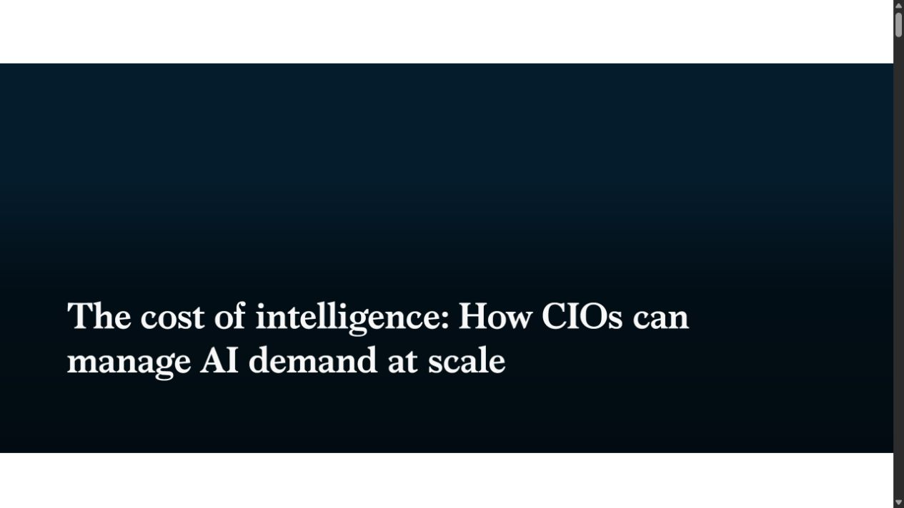
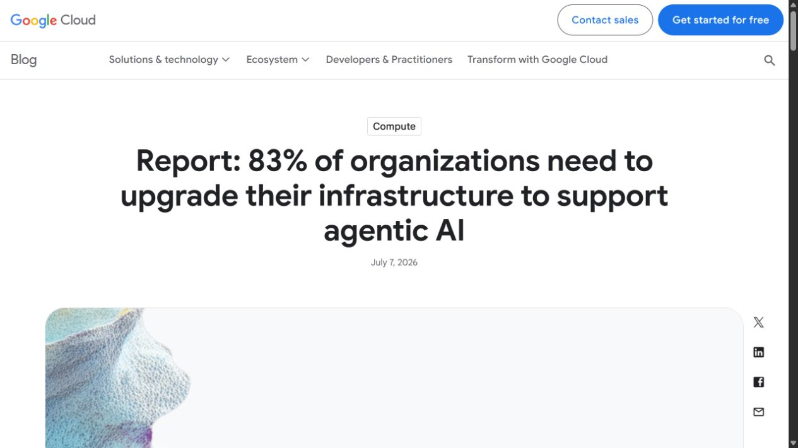
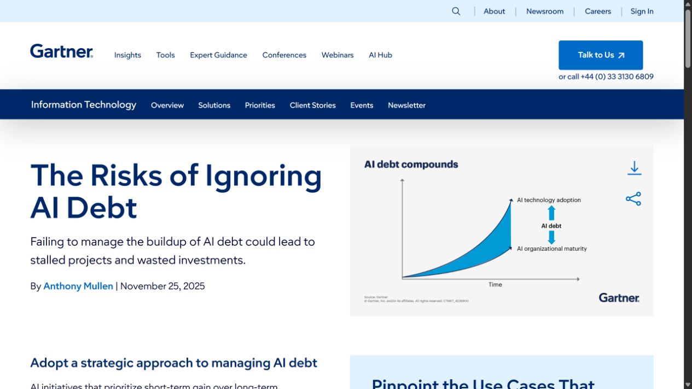

# Codeflow — tres propuestas para la sección “El problema”

<strong>Capturas web incorporadas — propuesta C</strong>

> Capturas tomadas directamente de las páginas citadas. Se usan como referencias visuales y de argumento, no como activos comerciales de Codeflow.

> Alcance: solo la sección inicial del pitch. Las tres propuestas parten del problema validado en el repositorio, pero cambian la tesis visual, el criterio narrativo y la forma de presentar los datos.

<strong>Propuesta A — Brecha adopción → impacto</strong>

## Criterio

Esta versión trata el problema como una brecha medible: las empresas ya experimentan con IA, pero pocas convierten ese uso en réditos o impacto significativo.

## Titular

> **La empresa ya usa IA. El valor todavía no llega a la operación.**

## Datos visibles

- Cerca del **80%** usa herramientas de IA.
- **23%** afirma obtener réditos económicos.
- **6%** percibe impacto significativo.

## Cómo funciona el dato

El 80% mide uso de herramientas; el 23% mide réditos económicos reportados; el 6% mide impacto significativo percibido. No son etapas del mismo embudo ni prueban causalidad. La slide debe mostrar la distancia entre adopción e impacto, no decir que el 80% tiene un sistema integrado.

## Fuente

[BID — Inteligencia artificial: ¿motor de productividad o de desigualdad?](https://www.iadb.org/es/blog/analisis-economico/inteligencia-artificial-motor-de-productividad-o-de-desigualdad)

## Diseño

Gráfico editorial de tres cifras en cascada. Fondo claro, tipografía negra, un color de acento ámbar para la brecha y cian para la oportunidad. Mucho espacio vacío. No usar dashboard ni tarjetas repetidas.

## Referencias visuales

- [Gapminder Tools](https://tools-stage.gapminder.org/) — posición entre dos variables.
- [Our World in Data](https://ourworldindata.org/grapher/joint-adoptions-same-sex-partners-equaldex) — gráfico editorial con conclusión visible y fuente.
- [Information is Beautiful](https://informationisbeautiful.net/2021/learn-a-concept-driven-approach-to-data-visualisation/) — tesis visual antes que decoración.

## Screenshot de referencia a capturar

Capturar una pantalla de un gráfico editorial de Gapminder u Our World in Data donde se vea: título conclusivo, gráfico único, anotación y fuente. Guardarla como `referencia-problema-adopcion-impacto.png` junto a este documento. No reutilizar el gráfico ni presentarlo como dato de Codeflow; es solo referencia de composición.

## Prompt

`Slide B2B de Silicon Valley, 16:9, gráfico editorial limpio con tres cifras grandes 80%, 23% y 6%, una cascada visual que muestre la brecha entre uso e impacto, fondo blanco cálido, tipografía negra, ámbar para la pérdida y cian para la oportunidad, una sola anotación, fuente visible, sin dashboard, sin logos, sin texto inventado.`

## Por qué usarla

Es la mejor apertura si quieres que el inversor o comprador entienda rápidamente que Codeflow no vende “otra herramienta”: resuelve la distancia entre probar IA y capturar valor.

<strong>Propuesta B — Fragmentación operativa</strong>

## Criterio

Esta versión trata el problema como arquitectura: cada trabajador o departamento construye una solución individual, pero la empresa no tiene un sistema común de contexto, datos, permisos y decisiones.

## Titular

> **Cada equipo tiene una herramienta. Nadie tiene el sistema completo.**

## Desarrollo del problema

1. Herramientas y agentes aislados.
2. Contexto que se pierde entre departamentos.
3. Coordinación humana como “pegamento”.
4. Retrabajo, retrasos y decisiones duplicadas.

## Fuente

- [`analisis-critico-codeflow-marca-personal.md`](../analisis-critico-codeflow-marca-personal.md)
- [`comparacion-pitch-codeflow.md`](../comparacion-pitch-codeflow.md)
- [`caso-estudio-anonimizado.md`](../caso-estudio-anonimizado.md)

## Diseño

Composición de torres/silos: CRM, ERP, hojas de cálculo, correo, agentes y reporting. Cada torre contiene una parte del proceso. Entre ellas hay puentes rotos. En el centro aparece una línea de trabajo cortada: `dato → decisión → acción`.

## Referencias visuales

- [AWS Well-Architected — silo isolation](https://docs.aws.amazon.com/wellarchitected/latest/saas-lens/silo-isolation.html) — metáfora ejecutiva de silos.
- [Multiplayer — Platform Design](https://www.multiplayer.app/platform-design/) — dependencias, contexto fragmentado y cambios manuales.
- [MeshLine — disconnected tools to operating layer](https://meshline.io/blog/from-disconnected-tools-to-operating-layer) — herramientas aisladas frente a una capa operativa.

## Screenshot de referencia a capturar

Capturar el diagrama de silos de AWS o la composición de dependencias de Multiplayer. Guardarla como `referencia-problema-fragmentacion.png`. No copiar logos ni ilustraciones literalmente; tomar únicamente la gramática visual de bloques, dependencias y puentes rotos.

## Prompt

`Slide B2B 16:9, seis torres aisladas representando ERP CRM email spreadsheet agents y reporting, cada torre contiene una parte del workflow, puentes rotos y flechas discontinuas, etiquetas pequeñas contexto perdido, handoff manual y decisión duplicada, fondo azul marino, diseño de arquitectura SaaS sobrio, sin logos ni personas.`

## Por qué usarla

Es la mejor versión para un COO, CFO o líder de operaciones porque convierte “IA fragmentada” en un problema operacional visible y cotidiano. También prepara naturalmente la solución de Codeflow como capa de conexión.

<strong>Propuesta C — Costo, deuda y obsolescencia</strong>

## Criterio

Esta versión presenta el problema como una consecuencia financiera y de gobierno: cada flujo consume tokens, APIs, suscripciones, reintentos, permisos y mantenimiento. Sin una capa de control, la IA escala más rápido que la capacidad de gobernarla.

## Titular

> **El costo de la IA no está solo en el modelo. Está en todo lo que ocurre alrededor.**

## Tres fugas

- **Consumo:** tokens, llamadas, modelos, contexto y reintentos sin atribución.
- **Riesgo:** permisos, calidad, trazabilidad y revisión dispersos.
- **Obsolescencia:** modelos, APIs, prompts y dependencias que envejecen sin dueño.

## Fuentes

- [McKinsey — The cost of intelligence](https://www.mckinsey.com/capabilities/quantumblack/our-insights/the-cost-of-intelligence-how-cios-can-manage-ai-demand-at-scale)
- [Google Cloud — State of AI Infrastructure](https://cloud.google.com/blog/products/compute/state-of-ai-infrastructure-report-overview/)
- [Gartner — AI Debt](https://www.gartner.com/en/articles/ai-debt)
- [OCDE — Governing with Artificial Intelligence](https://www.oecd.org/content/dam/oecd/en/publications/reports/2025/06/governing-with-artificial-intelligence_398fa287/795de142-en.pdf)

## Cómo funciona el dato de tokens

El costo depende del número de tokens de entrada y salida, del modelo, del tamaño del contexto, de la frecuencia de ejecución, de los reintentos y de la ruta de herramientas. Por eso no basta con saber el precio de una suscripción: hay que medir costo por workflow y costo por resultado.

## Diseño

Un iceberg o una barra apilada:

- visible: precio del modelo;
- oculto: contexto, loops, reintentos, observabilidad, mantenimiento y migraciones.

Al lado, una línea de tiempo `V1 → V2 → V3 → V4` que acumula parches y deuda de IA.

## Screenshot de referencia a capturar

Capturar una figura pública de McKinsey, Google Cloud o Gartner donde se vea la capa de control, la infraestructura o la acumulación de deuda. Guardarla como `referencia-problema-costo-deuda.png`. Usarla únicamente como referencia visual con atribución.

## Prompt

`Slide B2B 16:9, iceberg editorial de economía de IA, parte visible modelo y suscripción, parte sumergida tokens contexto reintentos permisos observabilidad mantenimiento y migraciones, a la derecha línea temporal V1 V2 V3 V4 acumulando deuda, fondo oscuro, ámbar para costo y violeta para riesgo, estilo consultoría estratégica premium, sin logos ni cifras inventadas.`

## Por qué usarla

Es la mejor versión para un comprador financiero o tecnológico: transforma la IA en un problema de presupuesto, riesgo y ciclo de vida. Codeflow aparece después como control plane operativo que atribuye costos, mantiene integraciones y evita que la deuda crezca sin gobierno.

<strong>Comparación y recomendación</strong>

| Propuesta | Problema dominante | Comprador ideal | Codeflow entra como |
|---|---|---|---|
| A | adopción sin impacto | CEO, innovación, transformación | capa que convierte uso en valor |
| B | fragmentación de procesos | COO, CFO, operaciones | sistema de trabajo conectado |
| C | costo, riesgo y obsolescencia | CFO, CIO, CTO | gobierno, medición y evolución |

**Recomendación inicial:** producir las tres y probarlas en entrevistas. Para venta empresarial empezaría con B; para una narrativa de mercado empezaría con A; para un comprador con control presupuestario usaría C.

## Datos propios que debemos obtener

- costo mensual por workflow;
- tokens y llamadas por ejecución;
- número de reintentos y excepciones;
- horas de coordinación manual;
- tiempo de integración de un segundo proceso;
- porcentaje de componentes reutilizados;
- costo antes/después;
- reducción de errores y tiempo de ciclo;
- evidencia de actualización y mantenimiento;
- permiso para publicar capturas y resultados.

