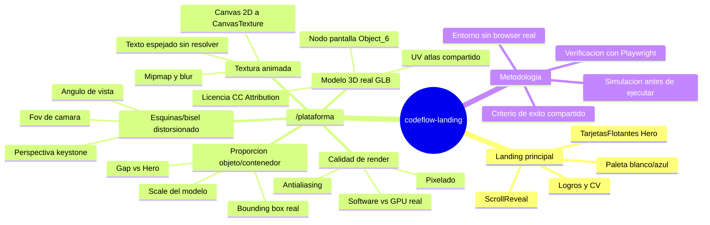
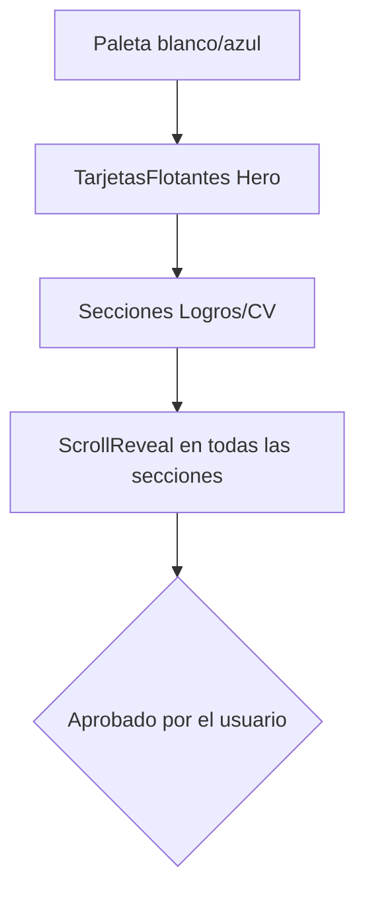
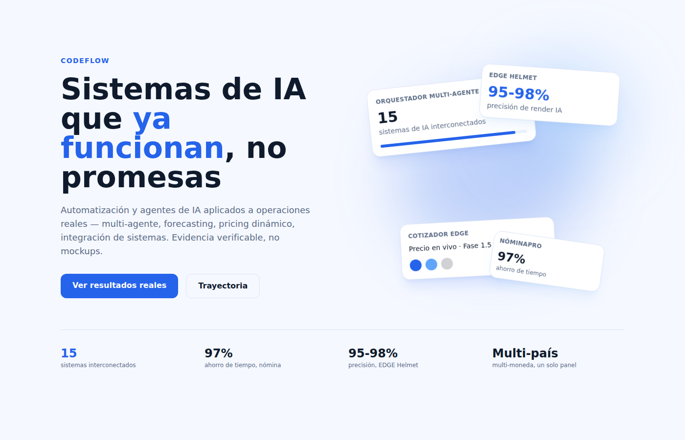
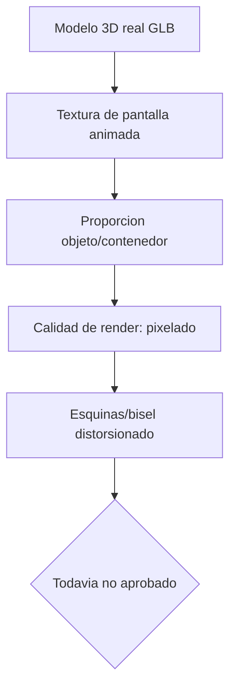
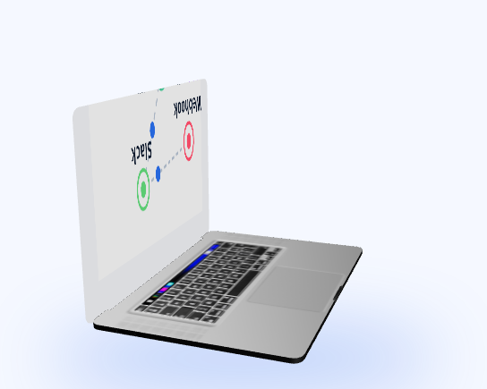
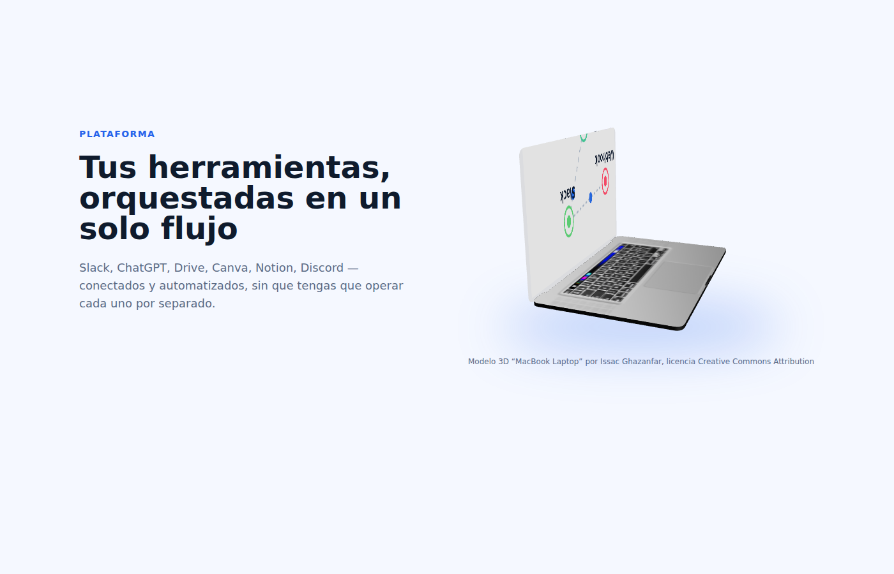

# Plan visual — codeflow-landing (Hero + /plataforma)

Este documento nace de una observación directa del usuario: después de varias
iteraciones sobre `/plataforma`, el resultado visual sigue sin estar a la
altura de lo que se considera "listo" — el objeto 3D se ve pixelado/distorsionado
en las esquinas y la proporción letra↔objeto no es la correcta. Antes de seguir
ejecutando intentos sueltos, este documento fija **qué vamos a considerar éxito
visual, por qué, y qué aprendimos hasta ahora** — sin que yo decida el criterio
en solitario.

## Limitación de entorno que hay que poner sobre la mesa

Todo el QA visual que hice hasta ahora salió de capturas de Playwright en
**Chromium headless con renderizado por software (swiftshader)**, no de un
navegador real con GPU. Esto importa porque:

- El software rendering es intrínsecamente más "sucio"/con más aliasing que
  el mismo WebGL en un navegador real con aceleración por hardware — parte de
  lo que se ve pixelado en mis capturas puede verse mejor en tu navegador real,
  y no lo puedo confirmar desde aquí.
- No tengo Cowork ni una extensión de Chrome en esta sesión — solo puedo
  navegar con ese Chromium headless. No puedo inspeccionar en vivo ni hacer
  zoom interactivo como lo harías tú.
- Conclusión práctica: cualquier criterio de "se ve bien" que fijemos acá debe
  ser **verificable con un método que no dependa únicamente de mi ojo en
  software rendering** — idealmente tú confirmando en tu navegador real antes
  de dar un paso por cerrado.

## Lluvia de ideas — todos los temas tocados hasta ahora

## Cómo leer las dos secciones siguientes

Cada página tiene: un diagrama de flujo de sus pasos, y debajo, un desplegable
por paso. Dentro de cada paso hay **dos** desplegables:

- **SMART (definitivo)** — el objetivo tal como debería quedar al final,
  redactado en formato SMART (Específico, Medible, Alcanzable, Relevante,
  Acotado en tiempo). Esto no es lo que se ejecutó, es la vara de medir.
- **Simulado (lo que se mandó a ejecutar)** — lo que realmente se probó,
  con captura, qué salió bien/mal, y la propuesta de ajuste al criterio
  definitivo. Si un paso todavía no se ha simulado, dice "no ejecutado".

---

## Página 1 — Landing principal (`app/page.tsx` + `Hero.tsx`)

<strong>▸ Paso 1 — Paleta blanco/azul</strong>

SMART (definitivo)

Reemplazar la paleta oscura morada/turquesa por una paleta clara blanco/azul
(`cf.bg`, `cf.accent #2563EB`) en el 100% de los componentes que usan tokens
`cf.*`, verificable con un `grep` de hex-codes viejos que debe devolver cero
resultados, en menos de 1 sesión de trabajo.

Simulado (lo que se ejecutó)

**Qué se hizo:** cambio de `tailwind.config.ts` + `globals.css`, siguiendo
como referencia real un screenshot de Cognify (Dribbble) que enviaste.

**Qué salió bien:** propagación automática a todos los componentes que ya
usaban tokens `cf.*` (Logros, CV, PlaceholderDashboard) sin tocarlos uno por
uno.

**Qué salió mal:** nada reportado — este paso no generó objeciones tuyas.

**Ajuste propuesto al criterio definitivo:** ninguno, se da por cerrado.

<strong>▸ Paso 2 — TarjetasFlotantes (Hero visual)</strong>

SMART (definitivo)

El elemento visual del Hero debe representar proyectos reales (no mockups
genéricos de UI), ocupar una proporción de columna comparable a el texto de
la izquierda, y verse sin overlaps en mobile (390px) y desktop (1400px),
confirmado con captura real de scroll, no `fullPage`.

Simulado (lo que se ejecutó)

**Qué se hizo:** 4 tarjetas CSS rotadas (`TiltCard`) con datos reales
(Orquestador multi-agente, EDGE Helmet 95-98%, Cotizador EDGE, NóminaPro 97%),
2 círculos de glow desenfocados detrás.

**Qué salió bien:** confirmaste explícitamente que "quedó súper bien
distribuido" en desktop y mobile — este es el único elemento visual de todo
el proyecto con aprobación explícita sin reservas.

**Qué salió mal:** nada — es la referencia de comparación que usamos para
`/plataforma`.

**Ajuste propuesto:** ninguno. **Este es el estándar de calidad contra el que
medimos `/plataforma` más abajo.**

<strong>▸ Paso 3 — Secciones Logros/CV + Paso 4 — ScrollReveal</strong>

SMART (definitivo)

Todo el contenido narrativo (Logros, CV, Dashboard) debe ser visible para un
usuario real con scroll natural, sin depender de animación `fullPage` de
testing, en menos de 1 sesión.

Simulado (lo que se ejecutó)

**Qué se hizo:** contenido con datos reales (Copper-1HVAC anonimizado, EDGE
Helmet, NóminaPro) + `ScrollReveal` con `whileInView`.

**Qué salió mal (falsa alarma):** un primer test con `fullPage:true` de
Playwright mostró un hueco enorme — pero `fullPage` no dispara
`IntersectionObserver`, así que parecía contenido "perdido" sin estarlo.

**Lección clave:** el método de verificación importa tanto como el código.
Un test mal diseñado puede generar una decisión equivocada (casi se
"arregla" un bug que no existía).

**Ajuste propuesto:** todo QA futuro de contenido con animación de scroll
debe usar `window.scrollTo` incremental real, nunca `fullPage` como única
prueba. Ya aplicado como práctica estándar.

---

## Página 2 — `/plataforma` (el punto de fricción real)

<strong>▸ Paso 1 — Integrar el modelo 3D real (GLB de Sketchfab)</strong>

SMART (definitivo)

Cargar el GLB real (licencia CC Attribution, con crédito visible) vía React
Three Fiber, con SSR deshabilitado, sin errores de build ni de consola, en
menos de 1 sesión.

Simulado (lo que se ejecutó)

**Qué se hizo:** `useGLTF` + `next/dynamic(ssr:false)`, GLB copiado a
`public/modelos-3d/macbook.glb`.

**Qué salió bien:** carga sin errores, sin el crash `self is not defined`
que sí ocurrió con `<model-viewer>` (abandonado por esto).

**Qué salió mal:** nada en este paso puntual.

**Ajuste propuesto:** ninguno.

<strong>▸ Paso 2 — Textura de pantalla animada (canvas → CanvasTexture)</strong>

SMART (definitivo)

La "pantalla" del laptop debe mostrar el grafo de nodos/conexiones (mismo
concepto que el resto del sitio) legible — texto correctamente orientado,
sin blur excesivo — verificable con zoom sobre la captura del canvas.

Simulado (lo que se ejecutó)

**Qué se hizo:** medición de UV bbox real de la malla `Object_6`, canvas 2D
animado con `useFrame`, mipmaps desactivados para evitar blur.

**Qué salió bien:** el contenido se ve (líneas, nodos, colores vívidos)
después de desactivar mipmaps.

**Qué salió mal:** el texto sale espejado (la malla tiene su UV invertido en
X). Intenté 3 fixes distintos (transform global del canvas, canvas auxiliar
con blit espejado, `drawImage` con ancho negativo) — **los dos primeros
rompieron el render por completo** (pantalla en blanco, causa no identificada
con certeza — probablemente una incompatibilidad entre `ctx.scale`/transform
y cómo three.js sube ese canvas específico a la GPU) y el tercero no tuvo
efecto visible.

**Lección clave:** no logré aislar la causa raíz en el tiempo disponible;
revertí a la versión estable en vez de seguir iterando a ciegas.

**Ajuste propuesto al criterio definitivo:** bajar la prioridad de este bug
(cosmético, en un elemento decorativo pequeño) hasta que el resto de errores
más visibles (pixelado, distorsión de esquinas) esté resuelto — atacarlo de
nuevo con un mejor método de diagnóstico (por ejemplo, exportar el canvas a
PNG estático y abrirlo directo, en vez de depurar dentro del loop de
render).

<strong>▸ Paso 3 — Proporción objeto/contenedor</strong>

SMART (definitivo)

El objeto 3D debe ocupar, dentro de su columna, una proporción de
ancho/alto comparable a `TarjetasFlotantes` en el Hero (± 15%), medido por
comparación directa de capturas a 1400×900 y 390×844, sin recortes
(clipping) contra los bordes del canvas.

Simulado (lo que se ejecutó)

**Qué se hizo:** medí el bounding box real del GLB
(`new THREE.Box3().setFromObject(scene)` → ~0.25×0.25×0.36), apliqué
`scale={1.8}` en `
` sin tocar cámara/fov, agregué `lg:gap-16` para
igualar el gap del Hero.

**Qué salió bien:** sin clipping en desktop ni mobile, el laptop ahora
ocupa una porción de columna visualmente parecida a las tarjetas.

**Qué salió mal (según tu observación, no la mía):** aunque el tamaño relativo
mejoró, **la proporción letra↔objeto todavía no es "la mejor"** según tu
criterio — yo di esto por cerrado con una sola comparación de capturas, sin
confirmarlo contigo primero. Ese fue el error de proceso: fijé un criterio de
éxito (comparación de %) sin validarlo antes con vos.

**Ajuste propuesto:** no volver a declarar "éxito" en proporción sin
mostrarte antes/después y esperar tu confirmación explícita — este documento
es ese punto de control.

<strong>▸ Paso 4 — Calidad de render (pixelado) — no resuelto</strong>

SMART (definitivo)

El modelo 3D y su pantalla deben verse sin aliasing/pixelado visible en
zoom 1:1 sobre la captura, en un navegador real con GPU (no software
rendering), verificado por vos directamente en tu navegador.

Simulado (lo que se ejecutó)

**Qué se hizo:** nada específico contra el pixelado todavía — el `<Canvas>`
de R3F no tiene `gl={{ antialias: true }}` explícito, y mi único método de
verificación fue Chromium headless con software rendering (swiftshader),
que es intrínsecamente más "sucio" que un navegador real.

**Qué salió mal:** no puedo distinguir, desde este entorno, cuánto del
pixelado que ves es real (arreglable con antialiasing/mayor resolución de
textura) y cuánto es un artefacto de mi método de verificación (swiftshader).

**Ajuste propuesto:** antes de tocar código, necesito que confirmes en tu
navegador real si el pixelado se ve igual de mal que en mis capturas — si es
igual, el fix es técnico (activar `antialias:true`, subir resolución del
canvas de 1024×640 a algo mayor, revisar `dpr` del `<Canvas>`); si en tu
navegador se ve mejor, el problema es solo de mi método de QA y no hace
falta tocar código de producción por esto.

<strong>▸ Paso 5 — Esquinas/bisel distorsionado — no resuelto</strong>

SMART (definitivo)

Las esquinas del laptop (bisel, marco) deben verse geométricamente rectas,
sin efecto de distorsión tipo "keystone" (perspectiva exagerada), comparando
el ángulo de cámara actual contra al menos 2 alternativas de fov/posición.

Simulado (lo que se ejecutó)

**Qué se hizo:** nada todavía — la cámara quedó fija en
`fov={32}`, posición `(-0.5, 0.4, -1.4)` desde la primera integración del
GLB, y nunca se re-evaluó específicamente contra distorsión de esquinas
tras subir el `scale` del modelo.

**Hipótesis técnica (no confirmada):** un fov relativamente ancho combinado
con una cámara muy cerca del objeto (distancia ≈1.49 unidades) puede generar
distorsión de perspectiva más notoria en los bordes/esquinas del objeto que
un fov más angosto con la cámara más lejos (efecto similar al "gran angular"
en fotografía).

**Ajuste propuesto:** antes de tocar la cámara, probar 2-3 combinaciones de
fov (ej. 20, 25, 32) + distancia de cámara ajustada para mantener el mismo
tamaño aparente del objeto, comparar capturas de las esquinas en zoom, y
recién ahí elegir — no cambiar a ciegas como pasó con el intento fallido del
texto espejado.

---

## Lo que este documento cambia hacia adelante

1. No vuelvo a declarar un paso de `/plataforma` como "listo" sin mostrar
   captura antes/después y esperar tu confirmación explícita.
2. Reconozco que mi verificación visual desde este entorno tiene un techo
   (software rendering, sin Cowork/Chrome real) — para pixelado específicamente
   necesito tu confirmación en navegador real antes de tocar código.
3. Los pasos 4 y 5 (pixelado, esquinas) quedan como próximos a trabajar, en
   ese orden, cada uno con una simulación acotada (probar 2-3 variantes,
   comparar, y recién ahí decidir) en vez de un solo intento "definitivo".
