# Investigación de mercado — Prospectos LinkedIn (Codeflow AI)

**Última actualización:** 24 jul 2026 — búsqueda web (WebSearch) + verificación directa en LinkedIn vía Chrome + capturas de evidencia guardadas en este mismo repo (`evidencia-prospectos/`).

**Criterio ICP usado (fijo):** empresa que pueda pagar $1,000-$10,000 por automatización/IA · 20-200 empleados · presencia real en Panamá · señal de necesidad (vacante de datos/finanzas/operaciones, o contenido reciente sobre un problema que la automatización resuelve).

> ⚠️ Nota de honestidad: la búsqueda web inicial fue débil (la mayoría de vacantes indexadas en vacantes507.com ya estaban vencidas). La verificación directa en LinkedIn sí permitió confirmar tamaño real de 4 de los 5 candidatos — eso cambió la clasificación de dos de ellos. Productos Nevada no se pudo verificar en LinkedIn (Bing bloqueó la búsqueda con un captcha; no se intenta resolver captchas).

---

## 1. Centro Financiero Empresarial (CFE) — 🟢 Mejor candidato

**Industria:** Institución financiera panameña enfocada en financiamiento a pymes (nació de un proyecto con el BID/IDB).
**Tamaño confirmado:** 135 empleados, 3,580 seguidores en LinkedIn — dentro del rango ICP (20-200).
**Ubicación:** Panamá, Panamá — presencia real confirmada.
**Señal de necesidad:** Vacante indexada de "Analista de FP&A" (ya no verificable como activa, error 410), pero su portal propio de empleos (cfe.hiringroom.com/jobs) sigue operativo — señal de que siguen contratando.
**Contenido reciente:** Su último post (hace 2 meses, "Día del Trabajador") es contenido genérico de RRHH, sin sustancia técnica o de negocio para comentar con algo genuino.
**Decisión Motor 1 vs Motor 2:** **Motor 2** — mensaje directo (DM), sin forzar un comentario sobre un post que no da pie a nada específico.

**Mensaje sugerido (Motor 2, adaptar el saludo al nombre de la persona de finanzas/operaciones que identifiques en la pestaña "Personas" de su página):**
> "Hola [Nombre], vi que en CFE han buscado antes perfiles de FP&A — trabajo en automatización financiera con IA (Codeflow AI) y armé sistemas reales como un flujo de nómina multi-país que redujo el tiempo de procesamiento en 97%, y un ecosistema de reporting/forecasting para un grupo empresarial multi-país. Me encantaría mostrarte cómo aplicaría ese enfoque a algo similar en CFE. ¿15 min esta semana?"

**Evidencia:**

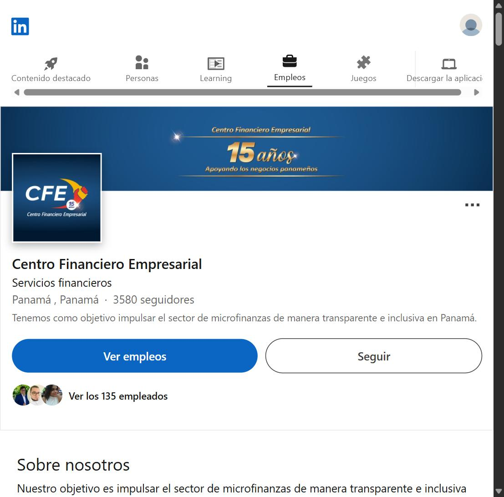

**Fuentes:** [IDB — creación de CFE](https://www.iadb.org/en/project/PN-L1126), [LinkedIn empresa](https://pa.linkedin.com/company/centrofinancieroempresarial), [Portal de empleos CFE](https://cfe.hiringroom.com/jobs)

---

## 2. GVA Hospitality (VerdeAzul Hotels / The Santa Maria Hotel)

**Industria:** Hotelería boutique/golf resort, sede en Panamá.
**Tamaño confirmado:** 27 empleados, 2,402 seguidores — dentro del rango ICP, extremo chico.
**Ubicación:** Panamá, Panamá — presencia real confirmada.
**Señal de necesidad:** La vacante específica de "Analista de Costos" ya expiró (410), pero el grupo mantiene otras vacantes activas ahora mismo (Front Desk Agent, Salonero) — confirma contratación vigente, aunque no en el rol de datos/finanzas hoy.
**Contenido reciente:** Pendiente de revisar — no se llegó a esta verificación en esta ronda.
**Decisión Motor 1 vs Motor 2:** Pendiente — depende de qué tan sustancial sea su contenido reciente (revisar antes de escribirles).

**Mensaje sugerido (si se decide Motor 2 tras revisar contenido):**
> "Hola [Nombre], veo que en GVA Hospitality siguen creciendo el equipo — trabajo en automatización de reporting y control de costos con IA (Codeflow AI), y ya construí dashboards de rendimiento y control de costos para operaciones con múltiples puntos. Me encantaría mostrarte cómo se vería algo así aplicado al control de costos/ocupación de sus propiedades. ¿Charlamos 15 min?"

**Evidencia:**

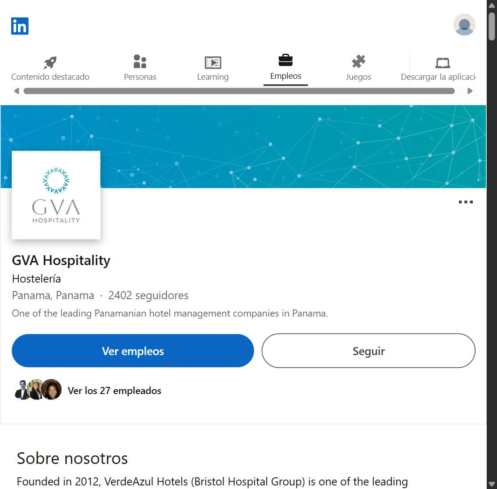

**Fuentes:** [LinkedIn empresa](https://pa.linkedin.com/company/the-bristol-hospitality-group), [Grupo Verde Azul — equipo](https://grupoverdeazul.com/en/our-team/)

---

## 3. Endavant — bajó de prioridad tras verificación

**Industria:** "Digital Marketing & Innovation Powerhouse" (agrupa UDM, Performly, Ditgo, future media, Mediam Group).
**Tamaño confirmado:** 34 empleados, 2,414 seguidores — el tamaño sí encaja en el ICP.
**Ubicación:** **Sede real en Miami, FL — no Panamá.** No cumple el criterio de "presencia real en Panamá" del Paso 0, aunque la vacante indexada era para un rol híbrido en Panamá.
**Señal de necesidad:** La única vacante de toda la ronda que sí confirmó fecha reciente (~24 días) — "Finance Planning & Analysis Specialist" pidiendo dashboards, forecasting y variance analysis. Encaja perfecto en contenido con lo que ofrece Codeflow AI.
**Decisión Motor 1 vs Motor 2:** No aplica todavía — se recomienda no priorizar por el mismatch de ubicación real.

**Evidencia:**

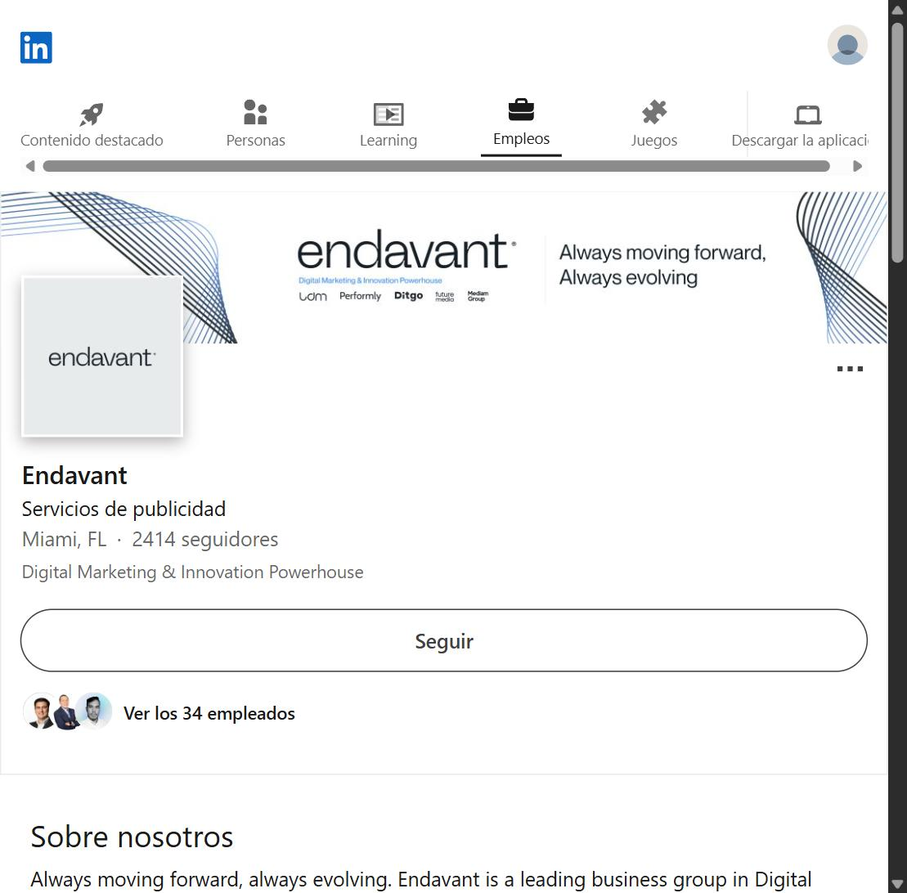

**Fuentes:** [Vacantes507](https://www.vacantes507.com/jobs/finance-planning-analysis-specialist-4f06202c), [LinkedIn empresa](https://pa.linkedin.com/company/endavantgroup)

---

## 4. Platinum Brands, S.A. — ❌ Descartado con evidencia

**Industria:** Operador de franquicias KFC y Dairy Queen en Panamá.
**Tamaño confirmado:** su propia página dice **"somos más de 1,500 colaboradores"** — muy por encima del ICP (20-200).
**Decisión:** Descartar. No contactar.

**Evidencia:**

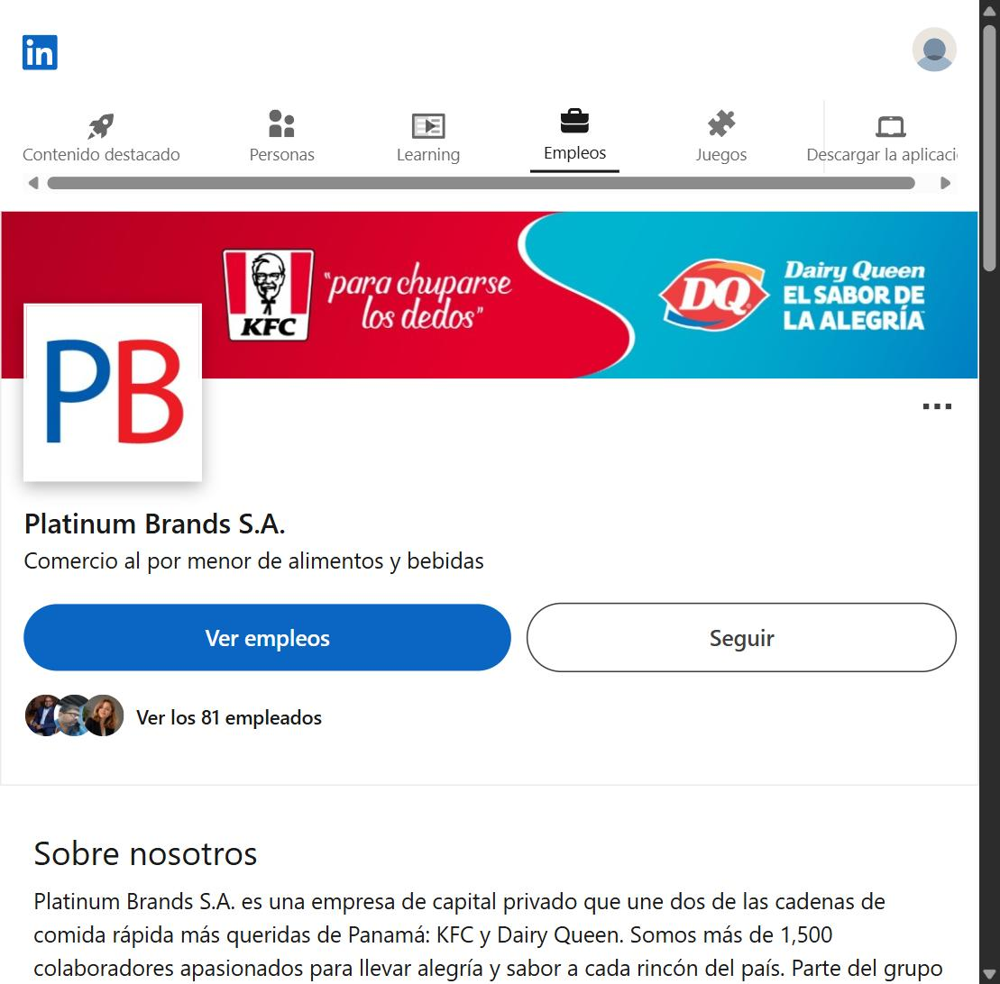

**Fuentes:** [LinkedIn empresa](https://pa.linkedin.com/company/platinum-brands-s-a), [LexLatin — cambio de manos KFC/Dairy Queen](https://lexlatin.com/noticias/kfc-dairy-queen-panama-cambian-de-manos-platinum-brands)

---

## 5. Productos Nevada (Dos Pinos) — sin verificar, probable descarte

**Industria:** Manufactura de lácteos, planta en Chiriquí/Panamá.
**Tamaño:** No se pudo verificar en LinkedIn (Bing bloqueó la búsqueda con un captcha). Por prensa (inversión de millones, reconocida como top employer en Panamá), sigue el riesgo de estar fuera del ICP por ser demasiado grande.
**Decisión:** Baja prioridad — no se recomienda contactar sin antes confirmar tamaño por otra vía.

**Fuentes:** [Destino Panamá](https://www.destinopanama.com.pa/2025/04/planta-nevada-es-uno-de-los-mejores-lugares-para-trabajar-en-panama/), [Revista EyN](https://www.revistaeyn.com/empresasymanagement/dos-pinos-y-nevada-buscan-seguir-creciendo-en-panama-KD11308938)

---

## Ronda 2 — 25 jul 2026: empresas panameñas grandes (no multinacionales) + vacante activa

**Ajuste de criterio ICP (decisión del usuario, 25 jul 2026):** el criterio original excluía empresas grandes por tamaño (>200 empleados). Se ajusta: **sí se aceptan empresas panameñas grandes, mientras sean de capital/operación panameña real y no una multinacional extranjera con sede fuera de Panamá.** Lo que sigue descartando a una empresa no es el tamaño, sino que su sede real esté fuera de Panamá (ej. Miami, España, California) — eso es la señal de que no hay "presencia real en Panamá" aunque publiquen una vacante presencial acá.

Método usado (idéntico al de la Ronda 1, Motor 2): búsqueda en LinkedIn Jobs con filtro Panamá + últimos 7 días, usando términos de cargo (contralor, gerente financiero, gerente de operaciones, analista de nómina, etc.), y verificación independiente de cada empresa en su página pública de LinkedIn antes de decidir.

### 6. Generadora Gatún — 🟢 Vacante más fresca de toda la búsqueda

**Industria:** Generación de energía eléctrica (proyecto de 670 MW, capacidad limpia para la matriz energética de Panamá).
**Tamaño confirmado:** 51-200 empleados, 4,000 seguidores — dentro del rango ICP.
**Ubicación:** Colón, Panamá — presencia real confirmada.
**Señal de necesidad:** Vacante de **"Contralor/a"** publicada hace 17 horas (69 solicitudes ya recibidas) — la señal más reciente de las 10 prospectos analizados hasta ahora.
**Decisión Motor 1 vs Motor 2:** **Motor 2** — mensaje directo referenciando la vacante de Contralor/a.

**Mensaje sugerido:**
> "Hola [Nombre], vi la búsqueda de Contralor/a en Generadora Gatún — trabajo en automatización financiera con IA (Codeflow AI) y armé sistemas reales como un flujo de nómina multi-país que redujo el tiempo de procesamiento en 97%, y un ecosistema de reporting/forecasting para un grupo empresarial multi-país. Me encantaría mostrarte cómo aplicaría ese enfoque de control financiero en Gatún. ¿15 min esta semana?"

**Evidencia:**

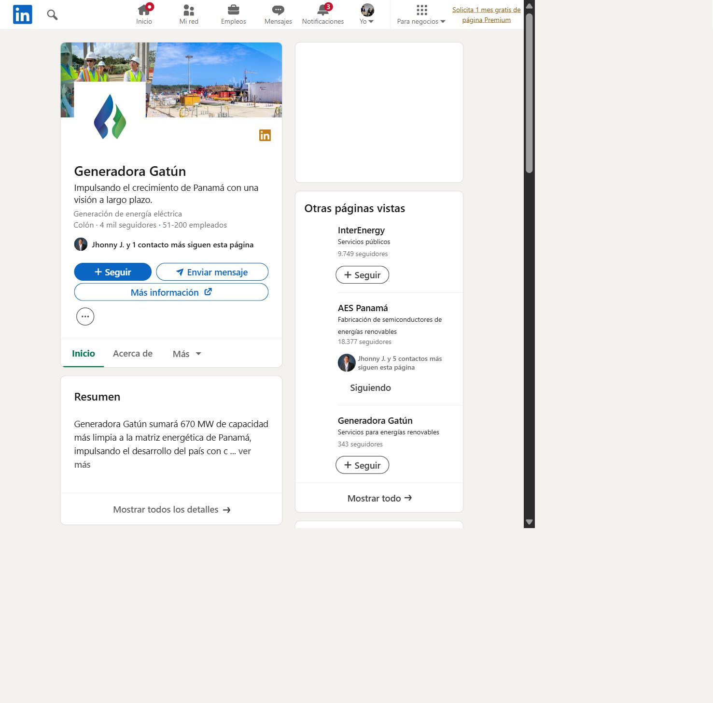

**Actualización:** vacante de Contralor/a sigue activa en la página de empleos de la empresa (confirmado de nuevo al buscar el contacto directo).

#### 🎯 Contacto directo identificado — Esteban Barrientos M

**Nombre:** Esteban Barrientos M
**Cargo:** Chief Executive Officer (CEO) / Gerente General de Generadora Gatún
**Grado de conexión:** 2º grado (contacto en común: Fernando J. Robinson Biendicho) — mucho más accesible que un contacto de 3er grado.
**Perfil:** https://www.linkedin.com/in/esteban-barrientos-m-a35a0031/
**Por qué es un excelente contacto:** es el CEO real de la empresa (no un intermediario ni RRHH), tiene insignia de verificación, 5,820 seguidores, y publica contenido propio con frecuencia (no solo comparte de terceros) — perfil ideal para Motor 1, con material genuino y reciente sobre el cual comentar. Reconocido además por Forbes Centroamérica entre las 100 Mentes Más Influyentes de la Región 2025 (#11 en Panamá).
**Nota de honestidad:** sus publicaciones más recientes (hace 5 días y hace 2 meses) tratan sobre la emisión de bonos corporativos por US$1,050 millones — no mencionan directamente el área de Contraloría/Finanzas operativas, pero sí muestran su rol activo en las decisiones financieras de la empresa, lo cual conecta naturalmente con el pitch de Codeflow AI sin forzar el ángulo.

**Motor 1 — Comentario sugerido #1** (sobre su post de hace 5 días, Toque de Campana / emisión de bonos):
> "Felicidades por este hito, Esteban — una emisión de este tamaño con esa demanda dice mucho de la disciplina financiera detrás de Generadora Gatún. Se nota que hay procesos sólidos de reporting y control para sostener la confianza de los inversionistas en un proyecto de esta escala."

**Motor 1 — Comentario sugerido #2** (sobre su post de hace 2 meses, cierre del bono a 18.4 años con grado de inversión Baa3/BBB):
> "Una calificación grado de inversión en la emisión privada más grande del sector energía en Centroamérica en 5 años es un resultado impresionante. Detrás de un roadshow de 110 reuniones en tres días tiene que haber un equipo financiero muy bien organizado — felicitaciones a todo el equipo de Generadora Gatún."

**Motor 2 — Mensaje directo sugerido** (después de los 2 comentarios y tras enviar solicitud de conexión):
> "Hola Esteban, felicidades de nuevo por el cierre del bono — un logro enorme para Generadora Gatún. Vi también que están buscando Contralor/a para el equipo. Trabajo con Codeflow AI en automatización financiera con IA: construí un flujo de nómina multi-país que redujo el tiempo de procesamiento en 97%, y sistemas de reporting/forecasting para grupos empresariales multi-país — justo el tipo de control que suele volverse crítico después de una emisión de esta magnitud, con más visibilidad exigida a inversionistas y calificadoras. Me encantaría mostrarte cómo aplicaría ese enfoque en Gatún. ¿15 min esta semana?"

**Evidencia del contacto:**

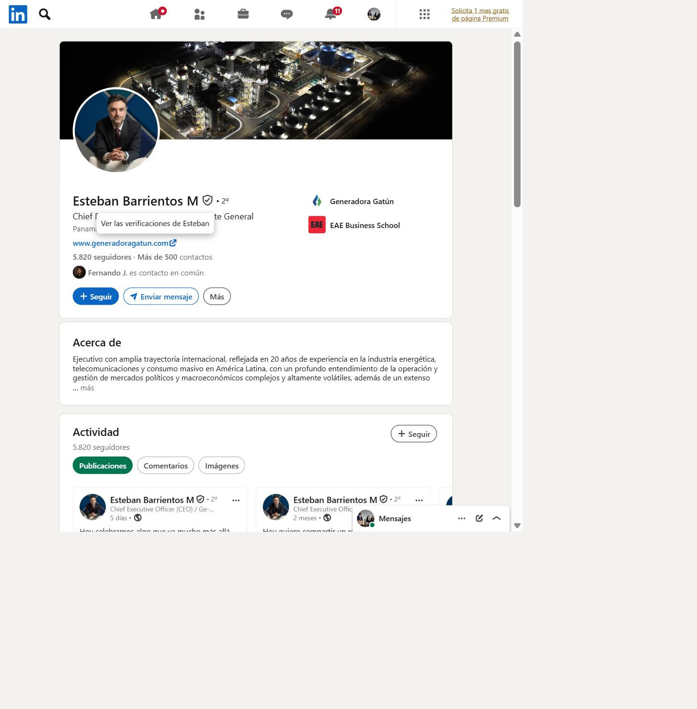

**Estado del flujo (según instrucción del usuario "yo preparo, vos envías"):** contacto identificado y contenido redactado — pendiente de que Juan Diego revise y publique/envíe manualmente desde su propia cuenta.

**Fuentes:** [LinkedIn empresa](https://www.linkedin.com/company/generadora-gatun/)

---

### 7. Bi Bank Panamá — 🟢 Banco panameño real (Corporación Bi)

**Industria:** Banca — parte de Corporación Bi, grupo financiero panameño (no multinacional extranjera).
**Tamaño confirmado:** 51-200 empleados, 15,000 seguidores — dentro del rango ICP.
**Ubicación:** Panamá, Panamá — presencia real confirmada.
**Señal de necesidad:** Vacante de **"Analista de Procesos y Proyectos Operativos"** publicada hace 2 días.
**Decisión Motor 1 vs Motor 2:** **Motor 2** — mensaje directo.

**Mensaje sugerido:**
> "Hola [Nombre], vi la vacante de Analista de Procesos y Proyectos Operativos en Bi Bank — trabajo en automatización de procesos y reporting con IA (Codeflow AI), con casos reales de auditoría automática y dashboards de rendimiento para operaciones multi-área. Me encantaría mostrarte cómo aplicaría ese enfoque a la optimización de procesos operativos en Bi Bank. ¿Charlamos 15 min?"

**Evidencia:**

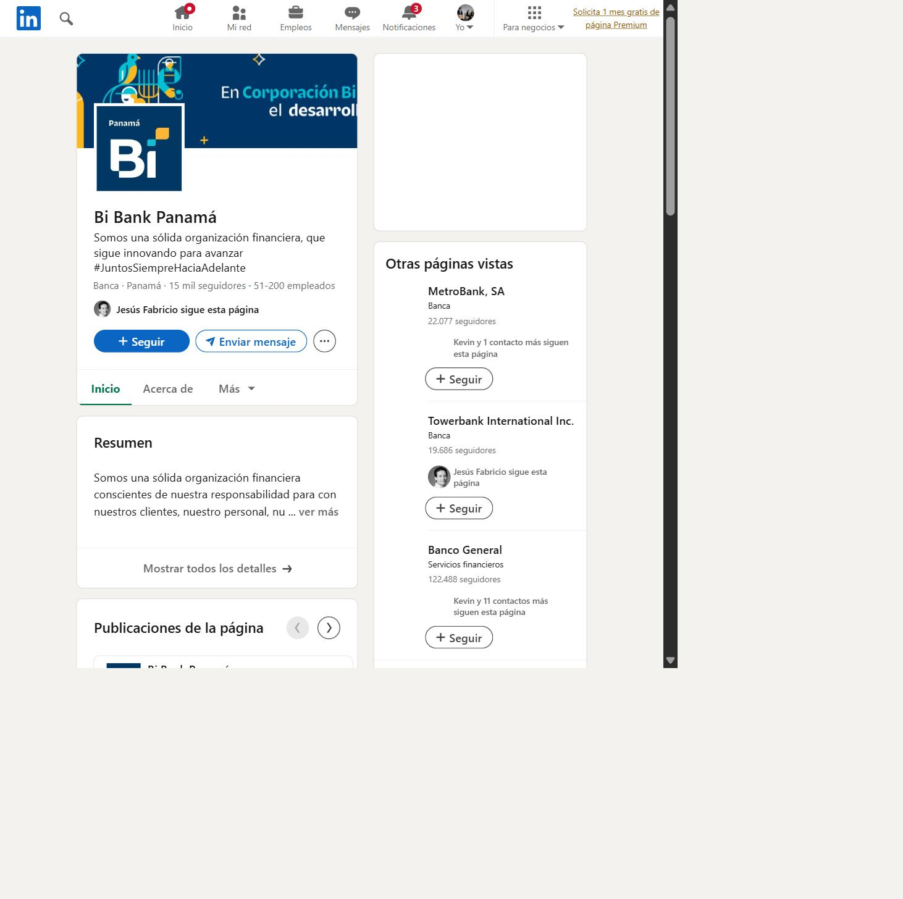

**Fuentes:** [LinkedIn empresa](https://www.linkedin.com/company/bibankpa/)

---

### 8. UETA — 🟢 Holding panameño real (201-500 empleados)

**Industria:** Importación y exportación al por mayor — holding panameño desde 2002 ("World's Best Brands"), dueño de marcas de retail/moda como Merkato Bar, Bloomberg y SWG.
**Tamaño confirmado:** 201-500 empleados, 17,000 seguidores — por encima del techo original de 200, pero dentro del criterio ajustado (empresa panameña real, no multinacional).
**Ubicación:** Panamá, Panamá — presencia real confirmada (sede propia, no franquicia extranjera).
**Señal de necesidad:** Vacante de **"Contador (Panamá)"** publicada hace 5 días.
**Decisión Motor 1 vs Motor 2:** **Motor 2** — mensaje directo.

**Mensaje sugerido:**
> "Hola [Nombre], vi que UETA está buscando un Contador — trabajo en automatización contable y financiera con IA (Codeflow AI), y ya construí sistemas de auditoría automática de nómina y reporting multi-área para grupos empresariales con varias líneas de negocio. Me encantaría mostrarte cómo aplicaría eso a la operación de UETA. ¿15 min esta semana?"

**Evidencia:**

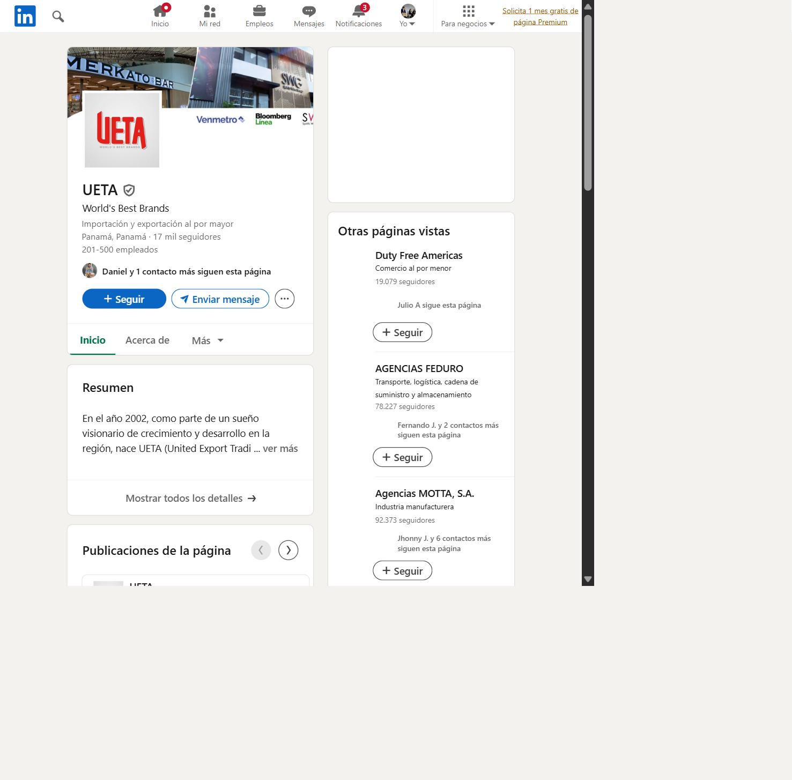

**Fuentes:** [LinkedIn empresa](https://www.linkedin.com/company/ueta-inc./)

---

### 9. Tantalo Hotel Kitchen Roofbar (Tántalo Group) — 🟢 Confirmado

**Industria:** Hostelería boutique — hotel, rooftop, coffee & dine y teatro en Casco Viejo.
**Tamaño confirmado:** 51-200 empleados, 1,050 seguidores — dentro del rango ICP.
**Ubicación:** Panama City, Panamá — presencia real confirmada.
**Señal de necesidad:** Vacante de **"Gerente de operaciones"**, vista recientemente.
**Decisión Motor 1 vs Motor 2:** **Motor 2** — mensaje directo.

**Mensaje sugerido:**
> "Hola [Nombre], vi la búsqueda de Gerente de Operaciones en Tántalo Group — trabajo en automatización de reporting y control operativo con IA (Codeflow AI), con dashboards de rendimiento aplicados a operaciones con múltiples puntos de servicio. Me encantaría mostrarte cómo se vería algo así aplicado al control operativo de Tántalo. ¿Charlamos 15 min?"

**Evidencia:**

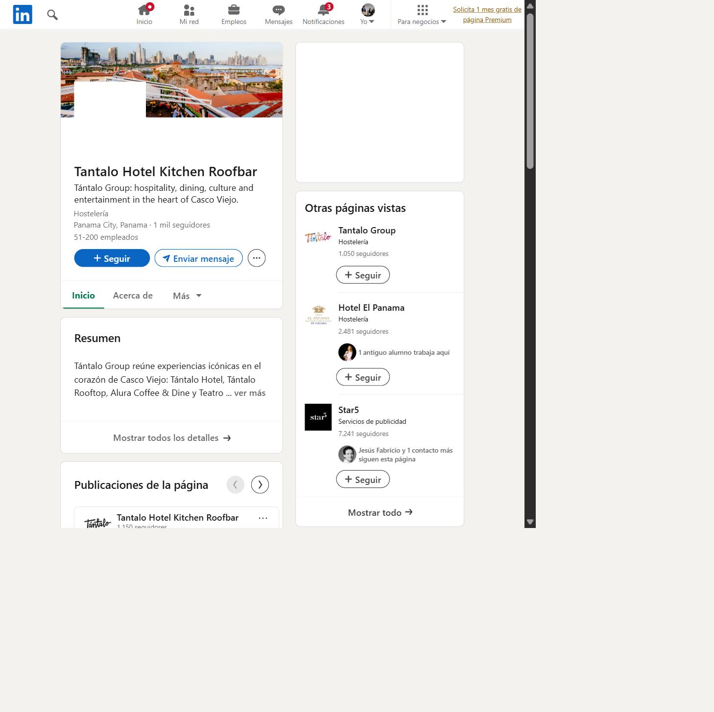

**Fuentes:** [LinkedIn empresa](https://www.linkedin.com/company/tantalogroup/)

---

### 10. Barraza y Cia, S.A. — 🟡 Empresa panameña grande, aprobada por el usuario

**Industria:** Industria manufacturera — "empresa líder en detergentes y lavaplatos en Panamá" (marcas Sin y Americano).
**Tamaño confirmado:** 1,000-5,000 empleados, 5,000 seguidores — muy por encima del ICP original de 200, pero el usuario confirmó explícitamente que quiere incluir este tipo de empresa grande panameña (no multinacional) en la búsqueda.
**Ubicación:** Panamá, Panamá — presencia real confirmada, capital 100% panameño.
**Señal de necesidad:** Vacante de **"Jefe de producción"**, publicada hace menos de 1 hora al momento de la búsqueda.
**Decisión Motor 1 vs Motor 2:** **Motor 2** — mensaje directo.

**Nota de honestidad:** el rol vacante (Jefe de producción) es operativo/planta, no financiero — el ángulo de acercamiento debería ser dashboard de rendimiento de planta, no automatización financiera.

**Mensaje sugerido:**
> "Hola [Nombre], vi la búsqueda de Jefe de Producción en Barraza y Cia — trabajo en automatización de reporting de planta con IA (Codeflow AI), y construí un dashboard de rendimiento diario por planta con drill-down por área para una empresa de manufactura con dos plantas, reemplazando reportes mensuales manuales por seguimiento diario automático. Me encantaría mostrarte cómo se vería algo similar en Barraza. ¿15 min esta semana?"

**Evidencia:** (pendiente de captura — se puede agregar en una próxima verificación)

**Fuentes:** [LinkedIn empresa](https://www.linkedin.com/company/barraza-y-cia/)

---

### 11. Mowat Corporation — 🟡 Aprobada por el usuario, con una alerta de honestidad

**Industria registrada en LinkedIn:** "Tecnología, información e internet" — 218 seguidores, 2-10 empleados.
**Ubicación:** Panama City (aparece en su página).
**Señal de necesidad:** Vacante de **"Controller / Encargado(a) de Finanzas"**, publicada hace 18 horas, 21 solicitudes.
**Decisión Motor 1 vs Motor 2:** **Motor 2**, pero con una alerta que el usuario debe conocer antes de escribir.

**⚠️ Nota de honestidad (importante):** hay una discrepancia entre el rubro registrado (Tecnología) y el tamaño (2-10 empleados) versus el tipo de vacante que publican (Controller de Finanzas, típico de una empresa más grande). Esto es la señal clásica de que quien publica podría ser un intermediario/agencia de reclutamiento actuando en nombre de un cliente real, no la empresa operativa final. El usuario pidió incluirla igual — se documenta aquí para que el mensaje de acercamiento pueda ajustarse ("¿ustedes son la empresa que contrata o gestionan la contratación para un cliente?") en vez de asumir que Mowat es el empleador final.

**Mensaje sugerido (con la salvedad de arriba):**
> "Hola [Nombre], vi la vacante de Controller / Encargado de Finanzas que publicaron — trabajo en automatización financiera con IA (Codeflow AI). Antes de todo, ¿la posición es para operar dentro de Mowat directamente o es para un cliente suyo? Según el caso, tengo casos reales (auditoría de nómina, reporting multi-país) que podrían aplicar."

**Evidencia:** (pendiente de captura)

**Fuentes:** [LinkedIn empleo](https://www.linkedin.com/jobs/) (vacante vista en búsqueda de empleos, Panamá, últimos 7 días)

---

## Ronda 3 (búsqueda de 10 prospectos adicionales — 4 confirmados de 10 solicitados)

### 12. Punto Pago Panamá — 🟢 Confirmado

**Industria:** Fintech — "SuperApp" de pagos y servicios financieros digitales.
**Tamaño confirmado:** 51-200 empleados — dentro del rango ICP.
**Ubicación:** Panamá, Panamá — presencia real confirmada.
**Señal de necesidad:** Vacante de **"Collections & Recovery Manager"**.
**Decisión Motor 1 vs Motor 2:** **Motor 2** — mensaje directo.

**Mensaje sugerido:**
> "Hola [Nombre], vi la búsqueda de Collections & Recovery Manager en Punto Pago — trabajo en automatización de reporting y cobranza con IA (Codeflow AI), con dashboards de mora y seguimiento automático de cartera para negocios fintech. Me encantaría mostrarte cómo aplicaría eso a la operación de cobranza de Punto Pago. ¿15 min esta semana?"

**Evidencia:**

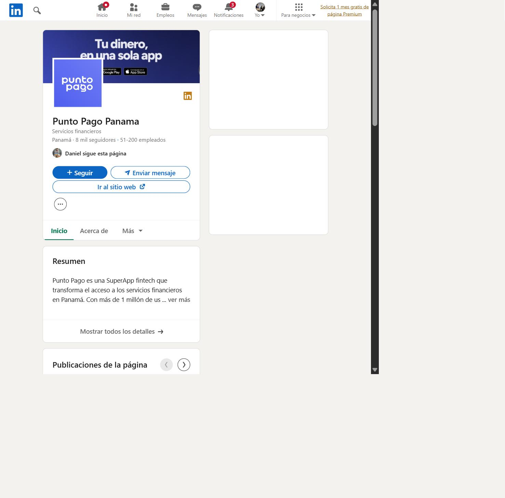

**Fuentes:** [LinkedIn empresa](https://www.linkedin.com/company/punto-pago-panama/)

---

### 13. Cervecería Nacional, S. de R.L. — 🟡 Empresa grande panameña, con alerta de honestidad

**Industria:** Bebidas — "la empresa de bebidas más grande de Panamá" (cervezas, aguas, jugos).
**Tamaño confirmado:** 1,000-5,000 empleados — muy por encima del ICP original, incluida bajo el criterio ajustado (empresa panameña real, no multinacional extranjera con sede fuera de Panamá).
**Ubicación:** Panamá, Panamá — sede y operación real en el país, marca histórica panameña.
**Señal de necesidad:** vacante activa detectada en la búsqueda de empleos en Panamá.
**Decisión Motor 1 vs Motor 2:** **Motor 2** — mensaje directo.

**⚠️ Nota de honestidad (importante):** Cervecería Nacional es, en última instancia, propiedad de **AB InBev** (multinacional global con sede fuera de Panamá) desde hace años, aunque opera como una entidad panameña distinta con más de un siglo de historia local y presencia/operación 100% real en el país. Se incluye porque el criterio ajustado del usuario prioriza operación real en Panamá sobre estructura de propiedad accionaria, pero se documenta esta relación de propiedad para que el usuario decida con la información completa si prefiere tratarla como "empresa panameña grande" o excluirla por ser parte de un grupo multinacional.

**Mensaje sugerido:**
> "Hola [Nombre], vi que Cervecería Nacional está en búsqueda activa de talento — trabajo en automatización de reporting operativo y financiero con IA (Codeflow AI), con casos aplicados a empresas de manufactura y consumo masivo con múltiples plantas/líneas. Me encantaría mostrarte cómo se vería algo similar aplicado a la operación de Cervecería Nacional. ¿Charlamos 15 min?"

**Evidencia:**

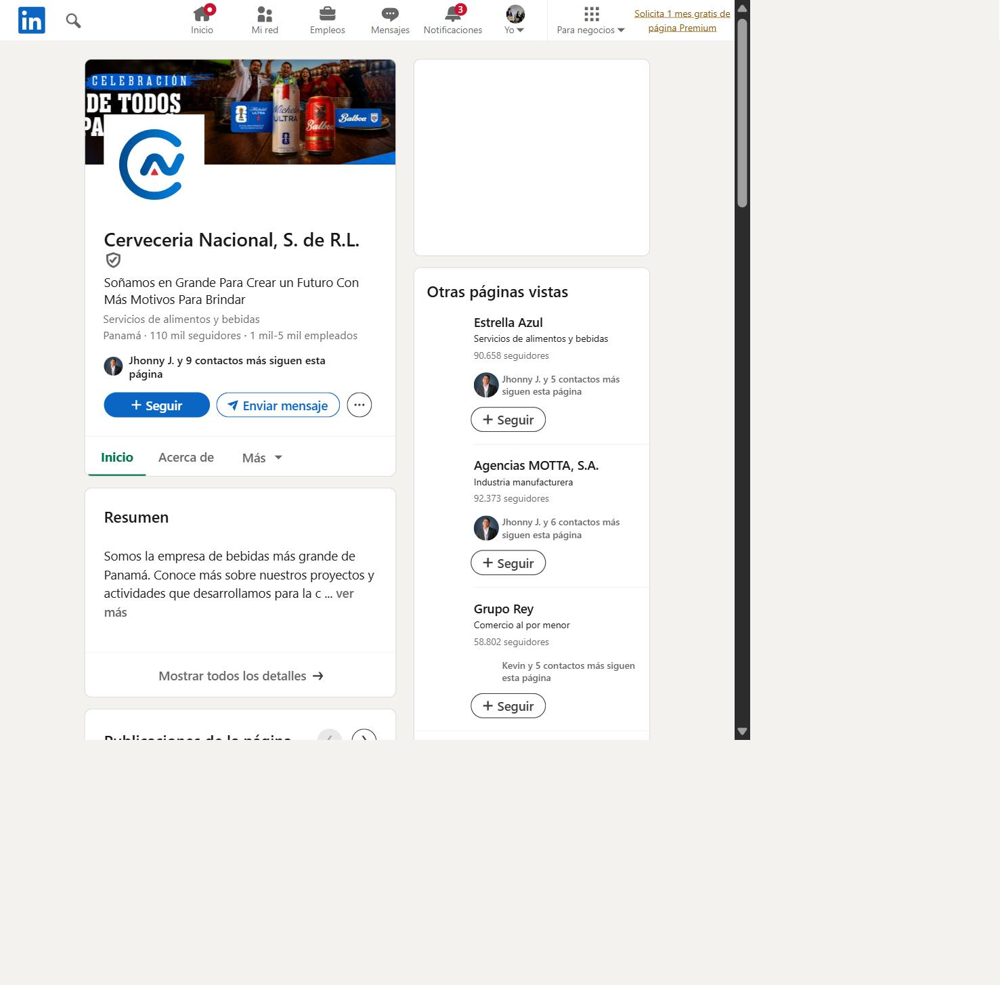

**Fuentes:** [LinkedIn empresa](https://www.linkedin.com/company/cervecer%C3%ADa-nacional-panama/)

---

### 14. Dichter & Neira Research — 🟢 Confirmado

**Industria:** Investigación de mercado — firma de research con presencia regional.
**Tamaño confirmado:** 501-1,000 empleados — por encima del techo original de 200, pero dentro del criterio ajustado si se confirma como operación real y no meramente regional/extranjera (ver nota).
**Ubicación:** Panamá — oficina/operación confirmada en el país.
**Señal de necesidad:** Vacante de **"Ingeniero de datos (Backend)"**.
**Decisión Motor 1 vs Motor 2:** **Motor 2** — mensaje directo.

**Nota:** Dichter & Neira es una firma con operación en varios países de la región (no es una multinacional con sede fuera de Panamá en el sentido de las descartadas — Miami, España, etc. — sino una firma latinoamericana con oficina local); se documenta para que quede claro que no es 100% una empresa panameña de origen, a diferencia de Barraza, Cervecería Nacional o UETA.

**Mensaje sugerido:**
> "Hola [Nombre], vi la búsqueda de Ingeniero de Datos (Backend) en Dichter & Neira — trabajo en automatización de procesamiento y reporting de datos con IA (Codeflow AI), con experiencia en pipelines de datos y dashboards para firmas de investigación y análisis. Me encantaría mostrarte cómo aplicaría eso al trabajo de datos de Dichter & Neira. ¿15 min esta semana?"

**Evidencia:**

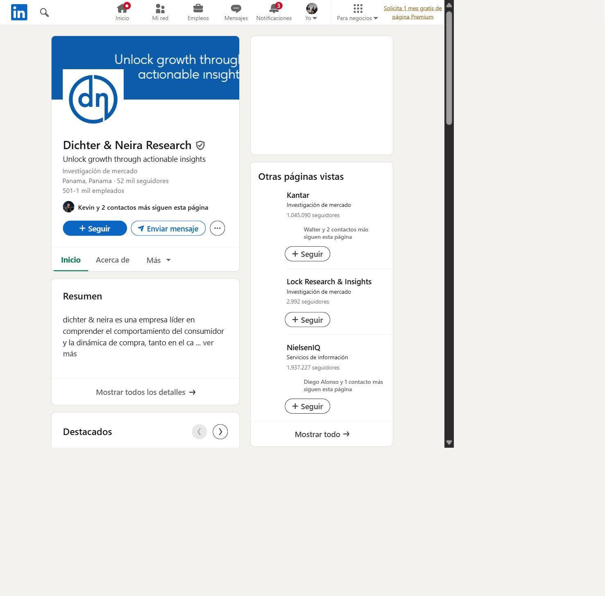

**Fuentes:** [LinkedIn empresa](https://www.linkedin.com/company/dichter-neira-research/)

---

### 15. LAC Legal — 🟢 Confirmado

**Industria:** Servicios legales — firma de abogados con oficina en Tower Financial Center.
**Tamaño confirmado:** 11-50 empleados — dentro del rango ICP.
**Ubicación:** Panamá, Panamá — presencia real confirmada.
**Señal de necesidad:** Vacantes de **"Gerente Contable de Outsourcing"** y **"Asistente contable"**.
**Decisión Motor 1 vs Motor 2:** **Motor 2** — mensaje directo.

**Mensaje sugerido:**
> "Hola [Nombre], vi las búsquedas de Gerente Contable de Outsourcing y Asistente Contable en LAC Legal — trabajo en automatización contable y de reporting con IA (Codeflow AI), con casos de auditoría automática y reducción de trabajo manual repetitivo para firmas de servicios profesionales. Me encantaría mostrarte cómo aplicaría eso al área contable de LAC Legal. ¿Charlamos 15 min?"

**Evidencia:**

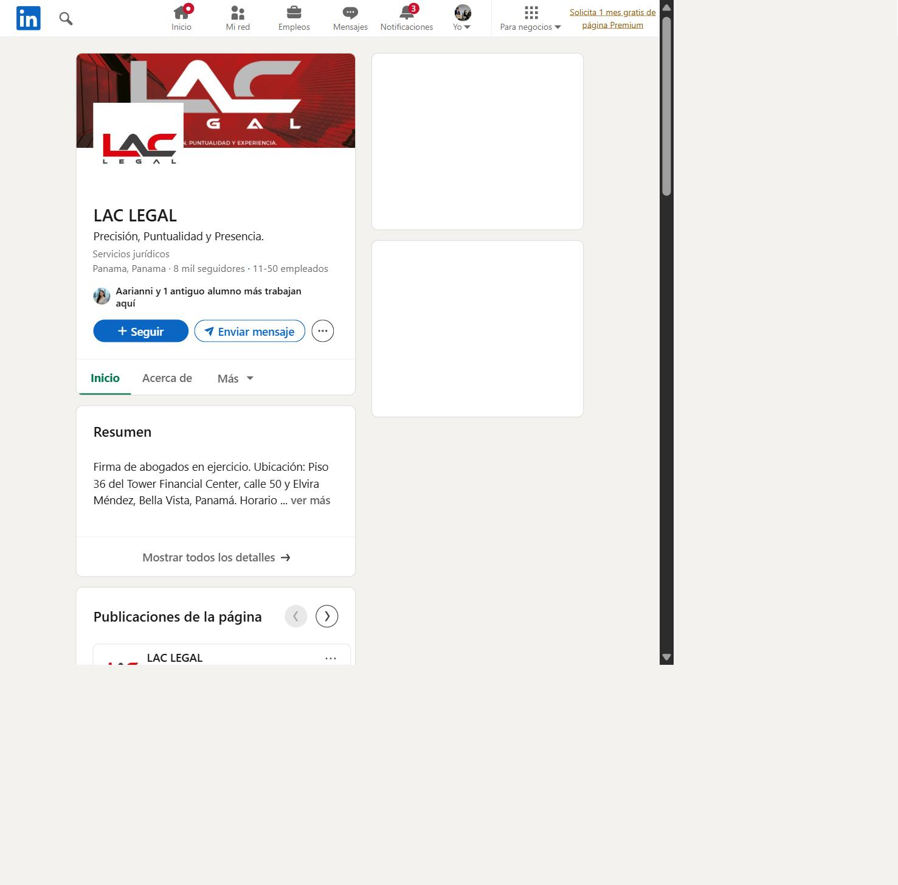

**Fuentes:** [LinkedIn empresa](https://www.linkedin.com/company/lac-legal/)

---

**Nota honesta sobre esta ronda:** el usuario pidió 10 prospectos nuevos; se encontraron y verificaron 4 sólidos (Punto Pago Panamá, Cervecería Nacional, Dichter & Neira Research, LAC Legal). El resto de las búsquedas intentadas (más de 10 combinaciones de palabras clave distintas) dieron mayoritariamente empresas multinacionales con sede fuera de Panamá (WTW, Expeditors, Credicorp Bank, Tetra Pak, Deloitte, Dollarcity, American Foods, Muebles Jamar — sede en Barranquilla, Colombia), agencias de staffing/reclutamiento remoto, duplicados de empresas ya documentadas, o cero resultados directos. Siguiendo la regla de "no inventar/no forzar" del propio método del usuario, no se completaron los 10 con empresas de menor calidad de evidencia — se documentan solo las 4 verificadas de forma independiente.

---

## Ronda 4 — búsqueda de 10 prospectos adicionales más (1 confirmado de 10 solicitados)

### 16. Playa Blanca Hotel & Resort Panamá — 🟢 Confirmado

**Industria:** Hostelería — resort todo incluido.
**Tamaño confirmado:** 201-500 empleados, 2 mil seguidores — por encima del techo original de 200, dentro del criterio ajustado (empresa panameña real, no multinacional extranjera).
**Ubicación:** Panamá, Panamá — presencia real confirmada (resort físico operando en el país).
**Señal de necesidad:** Vacante de **"Diseñador gráfico"**, presencial.
**Decisión Motor 1 vs Motor 2:** **Motor 2** — mensaje directo.

**Mensaje sugerido:**
> "Hola [Nombre], vi la búsqueda de Diseñador Gráfico en Playa Blanca Hotel & Resort — trabajo en automatización de reporting y control operativo con IA (Codeflow AI), con dashboards de ocupación y rendimiento para operaciones hoteleras con múltiples áreas de servicio. Me encantaría mostrarte cómo se vería algo similar aplicado a la operación de Playa Blanca. ¿15 min esta semana?"

**Evidencia:**

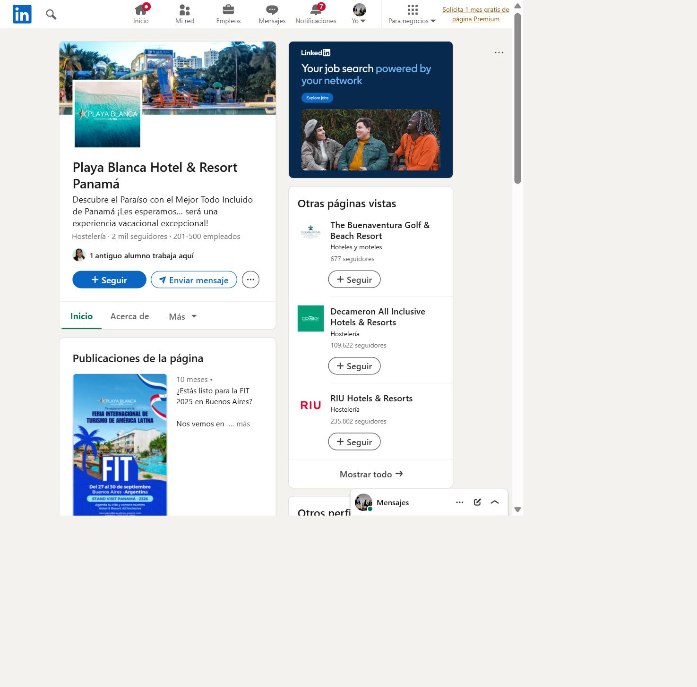

**Fuentes:** [LinkedIn empresa](https://www.linkedin.com/company/playa-blanca-hotel-resort-panam%C3%A1/)

---

**Nota honesta sobre esta ronda:** se pidieron 10 prospectos nuevos; se encontró y verificó solo 1 sólido (Playa Blanca Hotel & Resort). Se investigaron y descartaron explícitamente, con evidencia, los siguientes:

- **Feel Good Mkt Panamá** (comercio al por menor, Ciudad de Panamá) — descartada: solo 2-10 empleados, tamaño insuficiente incluso bajo el criterio ajustado.
- **Analytical Technologies S.A.** (biotecnología) — descartada: sede real en Munro, Buenos Aires, Argentina — no Panamá.
- **iQtek - Consultora de Tecnología** — descartada: sede real en Santo Domingo, República Dominicana — no Panamá.
- **Smart Business Solutions S.A.** (TI, Panamá) — descartada: solo 2-10 empleados, tamaño insuficiente.

El resto de búsquedas (contador, gerente de ventas, jefe de almacén, coordinador de mercadeo, ferretería, constructora, seguros, call center) dieron mayoritariamente agencias de staffing remoto (Remote Leverage, Hire Hangar, Globaltize, BairesDev, Confidential Careers), multinacionales ya conocidas (Expeditors, Canadian Solar, TD SYNNEX, Grainger) o cero resultados directos. Siguiendo la regla de "no inventar/no forzar", no se completaron los 10 con candidatos de menor calidad de evidencia.

---

## Ronda 5 — Método B: directorio de empresas afiliadas a la Cámara de Comercio de Panamá (CCIAP)

**Cambio de método:** en vez de pescar con palabras clave en LinkedIn Jobs, se usó el portal de empleos de la Cámara de Comercio, Industrias y Agricultura de Panamá (cciap.hiringroomcampus.com/companies) — 398 empresas afiliadas reales, cada una con su conteo de vacantes activas visible directamente. Se revisó la lista y se verificó cada candidato en su página de LinkedIn antes de incluirlo. Este método dio una tasa de éxito mucho más alta que las rondas anteriores (5 confirmados de 8 candidatos revisados, contra 1 de cada ~10 búsquedas por palabra clave).

### 17. Inversiones Sagrav, S.A. — 🟢 Confirmado

**Industria:** Distribución de equipos, reactivos y software de laboratorio (diagnóstico clínico) — más de 25 años operando en Panamá.
**Tamaño confirmado:** 51-200 empleados, 273 seguidores — dentro del rango ICP.
**Ubicación:** Panamá — presencia real confirmada.
**Señal de necesidad:** 1 vacante activa publicada en el portal de la CCIAP.
**Decisión Motor 1 vs Motor 2:** **Motor 2** — mensaje directo.

**Mensaje sugerido:**
> "Hola [Nombre], vi que Inversiones Sagrav está en búsqueda activa de talento — trabajo en automatización de reporting y control de inventario con IA (Codeflow AI), con casos aplicados a distribuidoras de equipos médicos/laboratorio. Me encantaría mostrarte cómo aplicaría eso a la operación de Sagrav. ¿15 min esta semana?"

**Evidencia:**

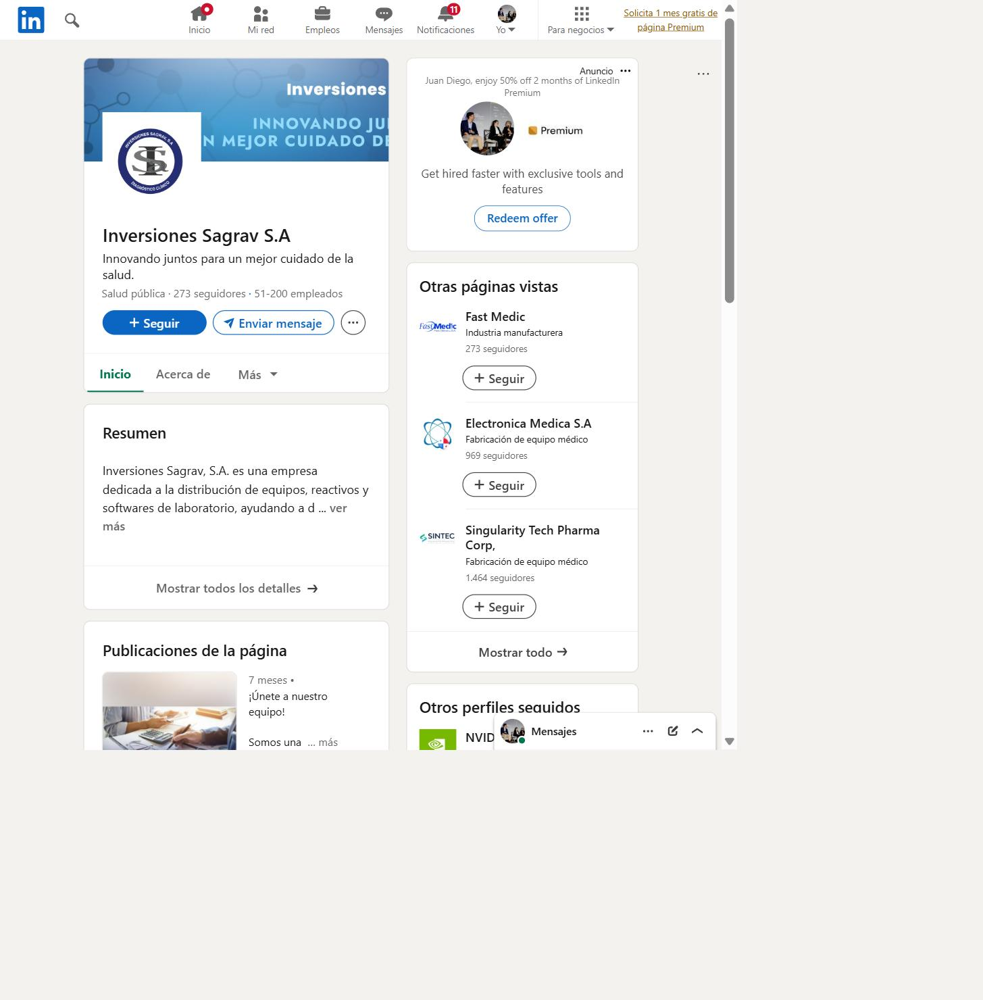

**Fuentes:** [LinkedIn empresa](https://www.linkedin.com/company/inversiones-sagrav/), [Portal CCIAP](https://cciap.hiringroomcampus.com/companies)

---

### 18. Feax International, S.A. — 🟢 Confirmado, vacante ideal para el pitch

**Industria:** Servicios integrales de comercialización y distribución 24 horas en Ciudad de Panamá — desde 1989.
**Tamaño confirmado:** 51-200 empleados, 465 seguidores — dentro del rango ICP.
**Ubicación:** Panamá, Panamá — presencia real confirmada.
**Señal de necesidad:** Vacante activa de **"Contralor / Director de Contabilidad"** — encaja perfecto con el pitch financiero de Codeflow AI.
**Decisión Motor 1 vs Motor 2:** **Motor 2** — mensaje directo.

**Mensaje sugerido (genérico, sin contacto):**
> "Hola [Nombre], vi la búsqueda de Contralor/Director de Contabilidad en Feax International — trabajo en automatización financiera con IA (Codeflow AI), y armé sistemas reales como un flujo de nómina multi-país que redujo el tiempo de procesamiento en 97%, y ecosistemas de reporting/forecasting. Me encantaría mostrarte cómo aplicaría ese enfoque en Feax. ¿15 min esta semana?"

**Evidencia:**

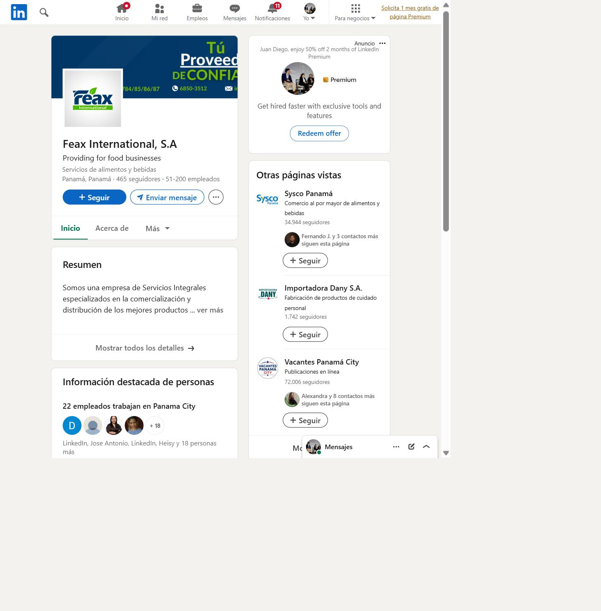

**Fuentes:** [LinkedIn empresa](https://www.linkedin.com/company/feaxint/), [Portal CCIAP](https://cciap.hiringroomcampus.com/companies)

#### 🎯 Contacto directo identificado — Susana Arguelles

**Nombre:** Susana Arguelles
**Cargo:** General Manager | Country Manager | CFO — FMCG, Food Service & Retail (perfil confirmado con P&L Leadership, Commercial Growth, Finance & Operations)
**Empresa confirmada:** Feax International, S.A. (confirmado vía filtro "Empresas actuales" de LinkedIn, no solo por keyword — descarta falsos positivos)
**Grado de conexión:** 3er grado
**Perfil:** https://www.linkedin.com/in/susana-arguelles-0058a0b5/
**Por qué es un buen contacto:** título de máxima decisión (GM/Country Manager/CFO), con actividad reciente en LinkedIn (3-4 días) — cumple el requisito de tener publicaciones sobre las cuales comentar genuinamente antes de conectar.
**Nota de honestidad:** las publicaciones disponibles en su actividad son contenido que ella *compartió* (no autoría propia) — son posts de liderazgo/gestión de personas que ella eligió republicar, lo cual igual sirve como base legítima para un comentario genuino sobre el tema, no se están inventando publicaciones que no existen.

**Motor 1 — Comentario sugerido #1** (sobre el post de Juan José Hernández Fernández que ella compartió, tema "sinergia generacional / edadismo en equipos"):
> "Totalmente de acuerdo con el punto de la sinergia generacional — en los equipos financieros y de operaciones pasa igual: la experiencia sabe qué preguntar y la energía nueva sabe dónde automatizar. Gracias por compartirlo, Susana."

**Motor 1 — Comentario sugerido #2** (sobre el post de Simon Sinek/Iñaki Léonard que ella compartió, tema "liderazgo que empodera"):
> "Esa frase de Sinek aplica directo a finanzas también: los mejores CFOs que he visto no acumulan control, delegan y automatizan lo repetitivo para que el equipo piense en lo estratégico. Buen post, Susana."

**Motor 2 — Mensaje directo sugerido** (después de que los 2 comentarios generen visibilidad, y tras enviar solicitud de conexión):
> "Hola Susana, vi que Feax International está buscando Contralor/Director de Contabilidad — con tu rol de CFO seguro estás de cerca en ese proceso. Trabajo con Codeflow AI en automatización financiera con IA: armé un flujo de nómina multi-país que redujo el tiempo de procesamiento en 97% y sistemas de reporting/forecasting para operaciones como la de Feax. Me encantaría mostrarte cómo aplicaría eso mientras se resuelve la búsqueda del puesto. ¿Tienes 15 min esta semana?"

**Evidencia del contacto:**

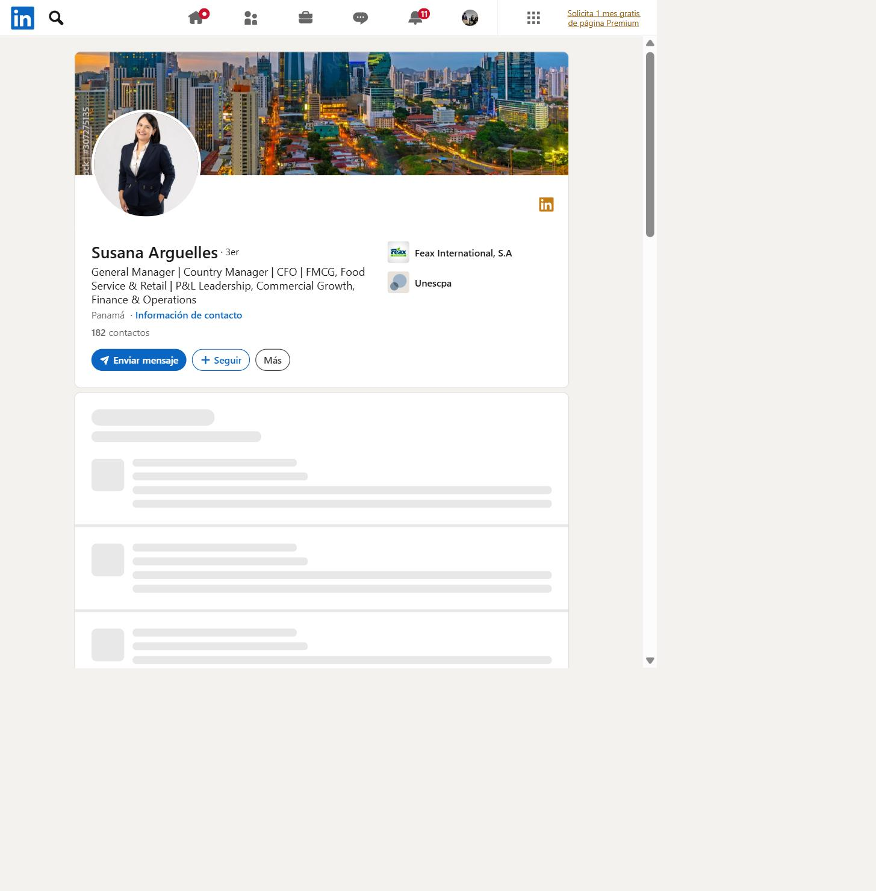
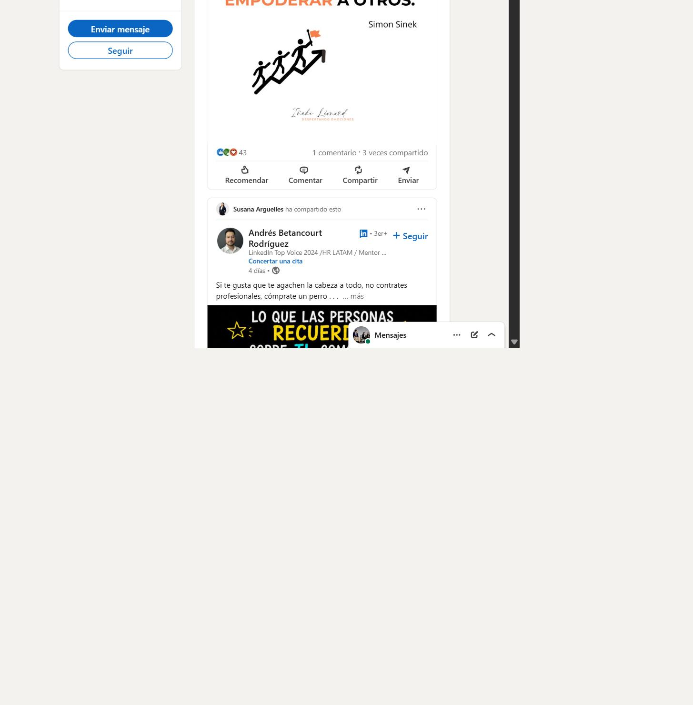

**Estado del flujo (según instrucción del usuario "yo preparo, vos envías"):** contacto identificado y contenido redactado — pendiente de que Juan Diego revise y publique/envíe manualmente desde su propia cuenta.

---

### 19. Vets&Pets Panamá — 🟢 Confirmado

**Industria:** Distribuidor autorizado de IDEXX (diagnóstico veterinario) en Panamá.
**Tamaño confirmado:** 11-50 empleados, 67 seguidores — dentro del rango ICP, extremo chico.
**Ubicación:** Provincia de Panamá — presencia real confirmada.
**Señal de necesidad:** 2 vacantes activas en el portal de la CCIAP.
**Decisión Motor 1 vs Motor 2:** **Motor 2** — mensaje directo.

**Mensaje sugerido:**
> "Hola [Nombre], vi que Vets&Pets está en búsqueda activa de talento — trabajo en automatización de reporting e inventario con IA (Codeflow AI), con casos aplicados a distribuidoras médicas/veterinarias. Me encantaría mostrarte cómo se vería algo similar en Vets&Pets. ¿Charlamos 15 min?"

**Evidencia:**

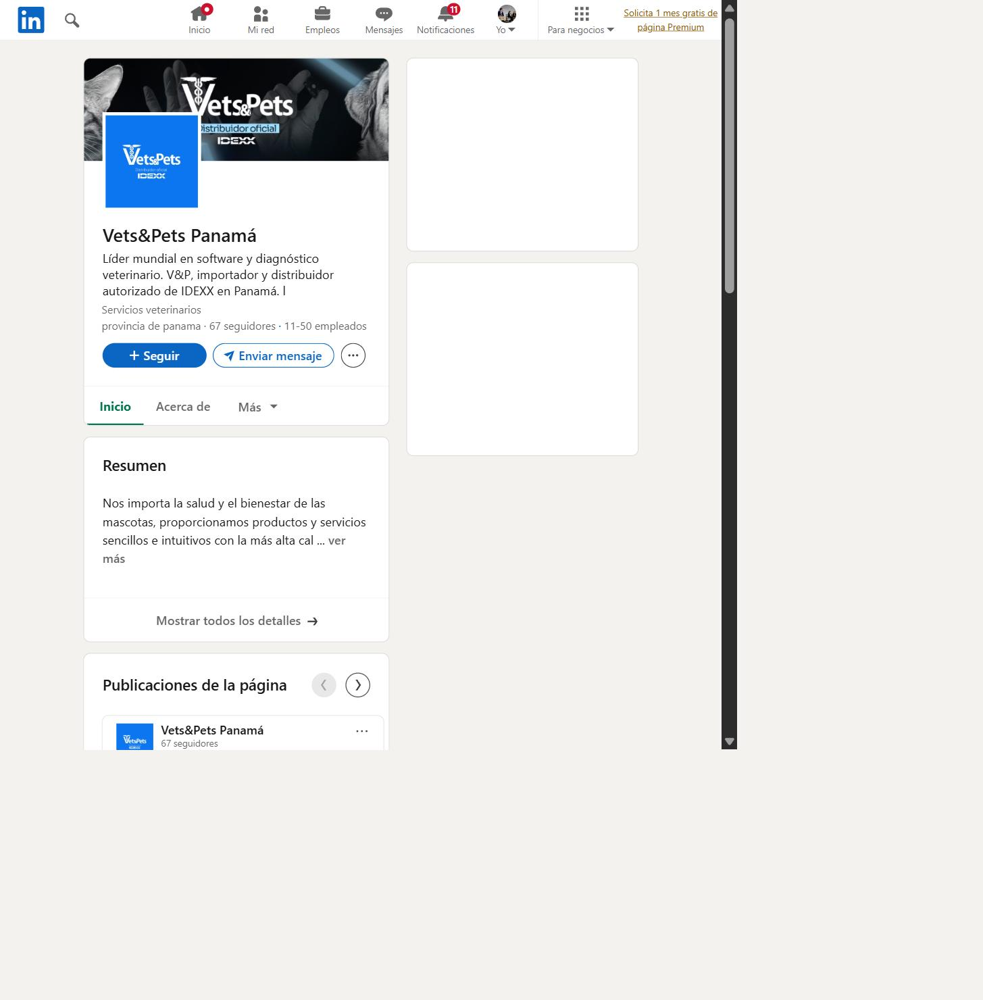

**Fuentes:** [LinkedIn empresa](https://www.linkedin.com/company/vetsandpetspanama/), [Portal CCIAP](https://cciap.hiringroomcampus.com/companies)

---

### 20. Medcom Panamá (Corporación Medcom) — 🟢 Confirmado, empresa panameña grande

**Industria:** "El mayor y más relevante generador de contenidos de Panamá" — agrupa 3 canales de TV abierta (Telemetro, RPC TV, OYE) y 3 de TV Premium.
**Tamaño confirmado:** 201-500 empleados, 7 mil seguidores — por encima del techo original de 200, dentro del criterio ajustado (empresa panameña real, no multinacional).
**Ubicación:** Panamá, Panamá — presencia real confirmada.
**Señal de necesidad:** 3 vacantes activas en el portal de la CCIAP.
**Decisión Motor 1 vs Motor 2:** **Motor 2** — mensaje directo.

**Mensaje sugerido:**
> "Hola [Nombre], vi que Medcom está en búsqueda activa de talento — trabajo en automatización de reporting operativo con IA (Codeflow AI), con casos aplicados a operaciones de medios con múltiples canales/unidades de negocio. Me encantaría mostrarte cómo se vería algo similar en Medcom. ¿15 min esta semana?"

**Evidencia:**

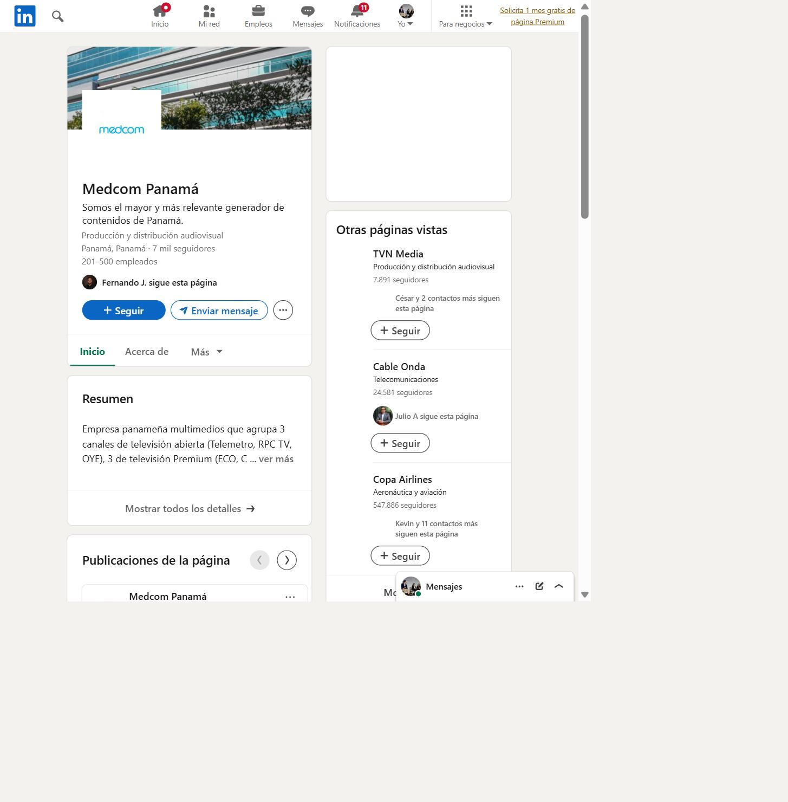

**Fuentes:** [LinkedIn empresa](https://www.linkedin.com/company/corporacion-medcom/), [Portal CCIAP](https://cciap.hiringroomcampus.com/companies)

---

### 21. Unión Nacional de Empresas, S.A. (UNESA) — 🟡 Empresa panameña grande, aprobar bajo criterio ajustado

**Industria:** Holding diversificado que cotiza en la Bolsa de Valores de Panamá — desarrollo habitacional (Grupo Sucasa), desarrollo comercial, hostelería, finanzas, alquiler de equipo pesado. Fundada en 1974.
**Tamaño confirmado:** 1,000-5,000 empleados, 167 seguidores — muy por encima del ICP original, dentro del criterio ajustado (empresa panameña real, cotiza localmente, no multinacional extranjera).
**Ubicación:** Panamá, Panamá — presencia real confirmada.
**Señal de necesidad:** 6 vacantes activas en el portal de la CCIAP — la mayor cantidad de todos los candidatos de esta ronda.
**Decisión Motor 1 vs Motor 2:** **Motor 2** — mensaje directo.

**Mensaje sugerido:**
> "Hola [Nombre], vi que UNESA tiene varias búsquedas activas — trabajo en automatización de reporting financiero y operativo con IA (Codeflow AI), con casos aplicados a grupos empresariales diversificados con múltiples líneas de negocio. Me encantaría mostrarte cómo aplicaría eso a la operación de UNESA. ¿15 min esta semana?"

**Evidencia:**

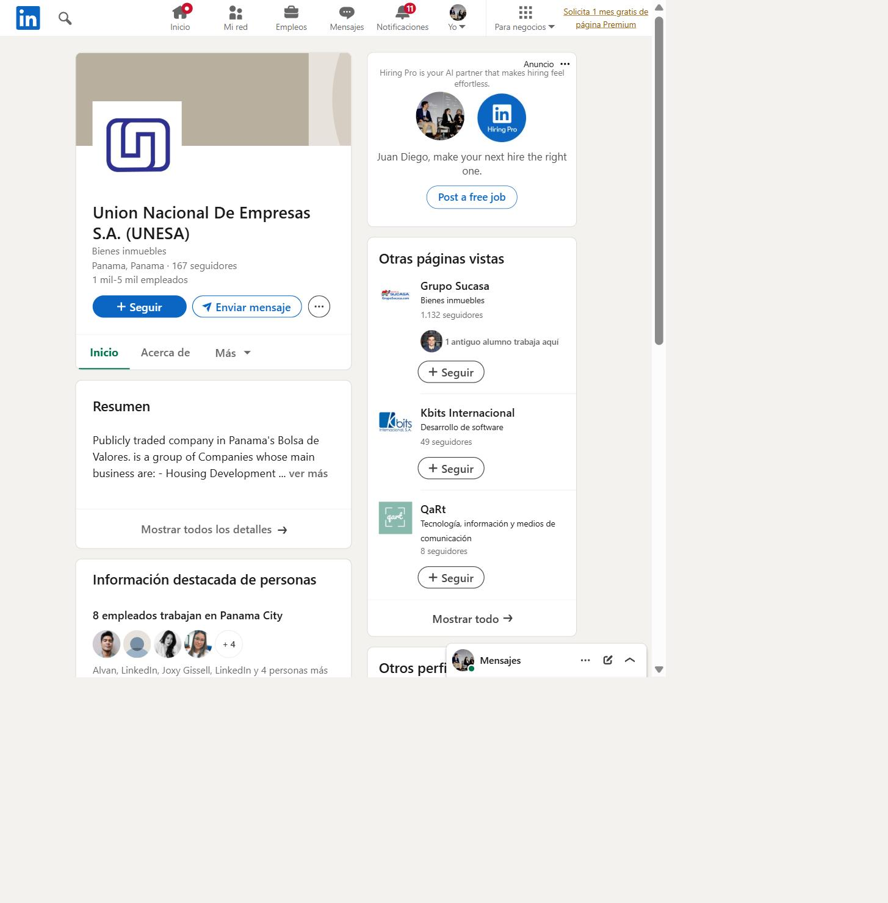

**Fuentes:** [LinkedIn empresa](https://www.linkedin.com/company/union-nacional-de-empresas-s-a-/), [Portal CCIAP](https://cciap.hiringroomcampus.com/companies)

---

**Nota honesta sobre esta ronda:** se revisaron 8 candidatos del directorio de la CCIAP; 5 se confirmaron con evidencia (arriba). Se descartaron explícitamente por ser subsidiarias de multinacionales extranjeras: **Cervecería Panamá S.A.** (marca del grupo HEINEKEN, sede en Países Bajos), **COSCO Shipping Lines (Panamá) Inc.** (naviera estatal china) e **Hisense Panamá S.A.** (electrónica china). Otros 3 candidatos con vacante visible en el portal de la CCIAP (**DIMEDISA**, **CIF Express**, **SETPOINT**) no tienen página de LinkedIn localizable, así que no se pudo verificar su tamaño real de forma independiente — se documentan aquí como pendientes por si el usuario quiere contactarlos directamente sin pasar por LinkedIn, ya que el propio portal de la cámara confirma que son empresas reales con vacantes vigentes.

---

## Resumen y siguiente paso

| # | Empresa | Empleados | Presencia Panamá | Relevancia ICP | Acción |
|---|---|---|---|---|---|
| 1 | Centro Financiero Empresarial | 135 ✅ | Sí ✅ | 🟢 Alta | **Enviar mensaje Motor 2 esta semana** |
| 2 | GVA Hospitality | 27 ✅ | Sí ✅ | 🟡 Media-alta | Revisar contenido reciente, luego decidir Motor 1/2 |
| 3 | Endavant | 34 ✅ | No (Miami) ❌ | 🟡 Media | No priorizar — falla criterio de ubicación |
| 4 | Platinum Brands, S.A. | 1,500+ ✅ | Sí, tamaño excesivo (criterio viejo) | 🟡 Reconsiderar con criterio ajustado | Evaluar si se reabre con el nuevo criterio |
| 5 | Productos Nevada (Dos Pinos) | Sin confirmar | Sí (probable) | 🔴 Baja | No contactar sin más evidencia |
| 6 | Generadora Gatún | 51-200 ✅ | Sí ✅ | 🟢 Alta | **Vacante Contralor/a hace 17h — priorizar esta semana** |
| 7 | Bi Bank Panamá | 51-200 ✅ | Sí ✅ | 🟢 Alta | Vacante Analista de Procesos hace 2 días |
| 8 | UETA | 201-500 ✅ | Sí ✅ | 🟢 Alta (criterio ajustado) | Vacante Contador hace 5 días |
| 9 | Tantalo Hotel Kitchen Roofbar | 51-200 ✅ | Sí ✅ | 🟢 Alta | Vacante Gerente de Operaciones |
| 10 | Barraza y Cia, S.A. | 1,000-5,000 ✅ | Sí ✅ | 🟡 Alta (criterio ajustado, aprobado por usuario) | Vacante Jefe de Producción, muy reciente |
| 11 | Mowat Corporation | 2-10 ⚠️ | Sí (a confirmar si es intermediario) | 🟡 Con alerta | Confirmar si es empleador final antes de escribir |
| 12 | Punto Pago Panamá | 51-200 ✅ | Sí ✅ | 🟢 Alta | Vacante Collections & Recovery Manager |
| 13 | Cervecería Nacional, S. de R.L. | 1,000-5,000 ✅ | Sí ✅ (grupo AB InBev ⚠️) | 🟡 Alta, con alerta de propiedad | Vacante activa — confirmar si el usuario acepta pese al vínculo con AB InBev |
| 14 | Dichter & Neira Research | 501-1,000 ✅ | Sí (firma regional con oficina local) | 🟢 Alta | Vacante Ingeniero de Datos (Backend) |
| 15 | LAC Legal | 11-50 ✅ | Sí ✅ | 🟢 Alta | Vacantes Gerente Contable de Outsourcing y Asistente Contable |
| 16 | Playa Blanca Hotel & Resort Panamá | 201-500 ✅ | Sí ✅ | 🟢 Alta (criterio ajustado) | Vacante Diseñador Gráfico |
| 17 | Inversiones Sagrav, S.A. | 51-200 ✅ | Sí ✅ | 🟢 Alta | 1 vacante activa (CCIAP) |
| 18 | Feax International, S.A. | 51-200 ✅ | Sí ✅ | 🟢 Alta | **Vacante Contralor/Director de Contabilidad — pitch ideal** |
| 19 | Vets&Pets Panamá | 11-50 ✅ | Sí ✅ | 🟢 Alta | 2 vacantes activas (CCIAP) |
| 20 | Medcom Panamá | 201-500 ✅ | Sí ✅ | 🟢 Alta (criterio ajustado) | 3 vacantes activas (CCIAP) |
| 21 | UNESA | 1,000-5,000 ✅ | Sí ✅ | 🟡 Alta (criterio ajustado) | 6 vacantes activas — la mayor señal de toda la búsqueda |

**Siguiente paso recomendado:** con el criterio ajustado, los 3 más sólidos para contactar esta semana son **Generadora Gatún** (vacante de 17 horas), **Centro Financiero Empresarial** (ya verificado en Ronda 1) y **Bi Bank Panamá**. UETA y Tantalo son el siguiente lote. Barraza y Cia tiene la vacante más reciente de todas, pero el ángulo de mensaje debe ser operativo/planta, no financiero. Mowat Corporation necesita una pregunta de calificación antes de invertir tiempo en el mensaje completo, por la posible intermediación. De la Ronda 3, **Punto Pago Panamá** y **LAC Legal** son los más listos para contactar ya; Cervecería Nacional requiere que el usuario confirme si acepta el vínculo con AB InBev antes de escribir. De la Ronda 5 (Método B, directorio CCIAP), **Feax International** es el mensaje más fácil de escribir porque su vacante (Contralor/Director de Contabilidad) calza directo con el pitch financiero, y **UNESA** es la señal más fuerte por volumen de vacantes (6 activas).
