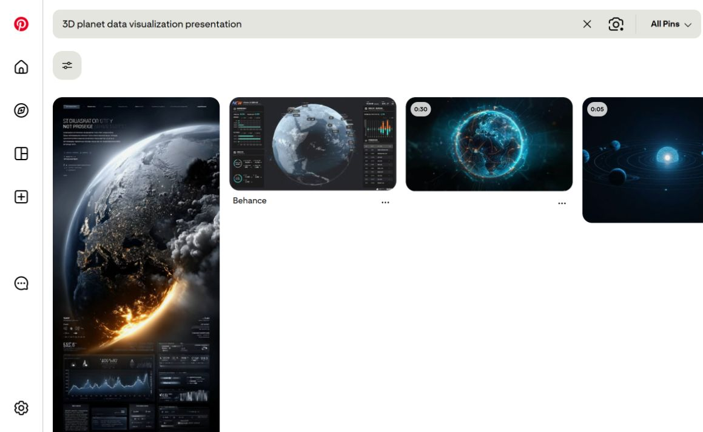
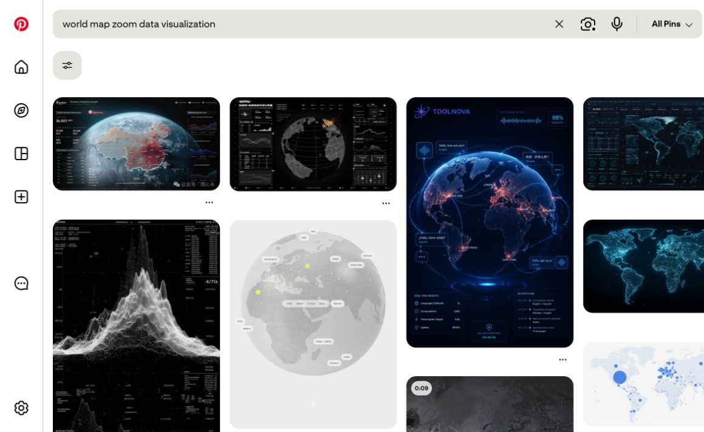
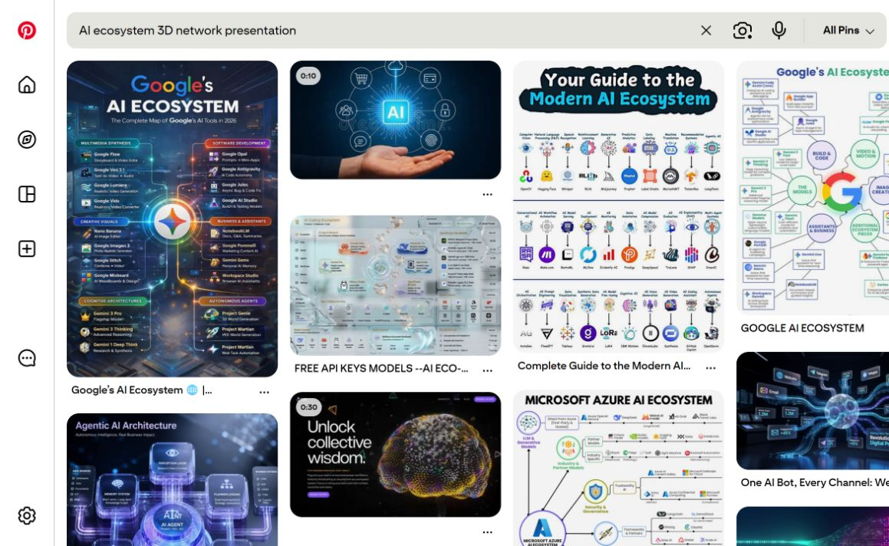

# Referencias visuales para el pitch de CodeFlow

Estas capturas son referencias de estilo encontradas en Pinterest. No son diseños finales ni deben copiarse literalmente. Sirven para definir dirección visual, composición, color y lenguaje de datos.

<strong>1. Planeta 3D y visualización global</strong>

[Abrir búsqueda en Pinterest](https://www.pinterest.com/search/pins/?q=3D%20planet%20data%20visualization%20presentation)

**Qué tomar:** planeta oscuro, iluminación cian, puntos conectados, datos alrededor del globo y sensación cinematográfica.

**Aplicación a CodeFlow:** comenzar con una vista del planeta enfocada en Panamá. Panamá aparece iluminado y el resto del mundo queda en gris oscuro. El globo debe comunicar que el problema es global, pero que la entrada inicial es local.

<strong>2. Mapa mundial con datos y zoom geográfico</strong>

[Abrir búsqueda en Pinterest](https://www.pinterest.com/search/pins/?q=world%20map%20zoom%20data%20visualization)

**Qué tomar:** países en tonos grises, regiones resaltadas, dashboards laterales, líneas de conexión y métricas grandes.

**Aplicación a CodeFlow:** usar la secuencia Panamá → Latinoamérica → mundo. Cada zoom puede cambiar el dato principal, manteniendo la misma composición para que la audiencia sienta continuidad.

<strong>3. Ecosistema 3D de inteligencia artificial</strong>

[Abrir búsqueda en Pinterest](https://www.pinterest.com/search/pins/?q=AI%20ecosystem%203D%20network%20presentation)

**Qué tomar:** nodo central, herramientas conectadas, agentes, datos, seguridad, canales y flujos operativos.

**Aplicación a CodeFlow:** después del planeta, mostrar que las empresas no necesitan otra herramienta aislada. Necesitan una capa que conecte sus herramientas, APIs, agentes, datos y procesos en un sistema operativo empresarial.

## Dirección visual recomendada

- Fondo: azul marino o negro carbón.
- Color de foco: turquesa/cian para Panamá y los flujos activos.
- Color secundario: violeta para inteligencia, agentes y datos.
- Países no seleccionados: gris frío y bajo contraste.
- Tipografía: título grande, pocos elementos y cifras muy visibles.
- Movimiento: zoom suave del planeta, no una transición rápida.
- Composición: una idea principal por slide.

## Secuencia visual propuesta

1. **Panamá:** punto de entrada local.
2. **Latinoamérica:** contexto regional y brecha de madurez.
3. **Mundo:** presión competitiva global.
4. **Fragmentación:** herramientas aisladas y datos separados.
5. **CodeFlow:** ecosistema integrado, modular y ampliable.

> La referencia visual debe ayudar a entender el argumento: del planeta y el problema global hacia un sistema concreto que CodeFlow puede construir para una empresa.

