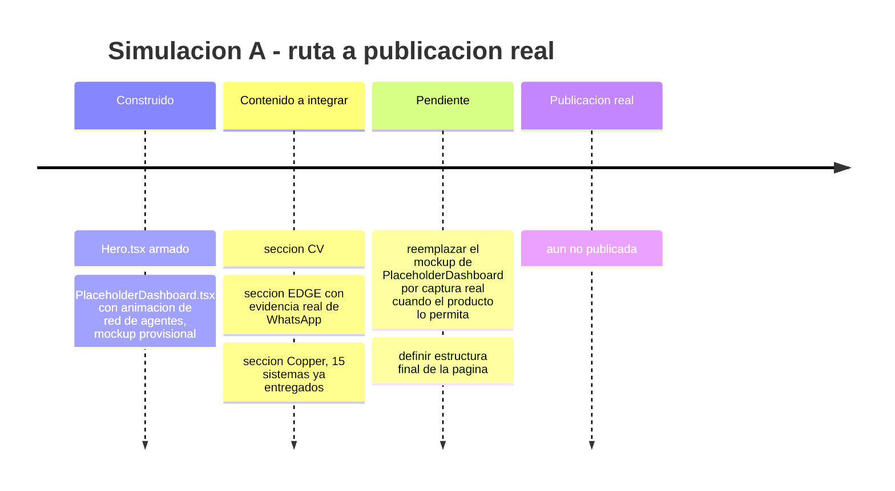
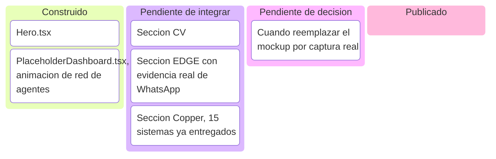
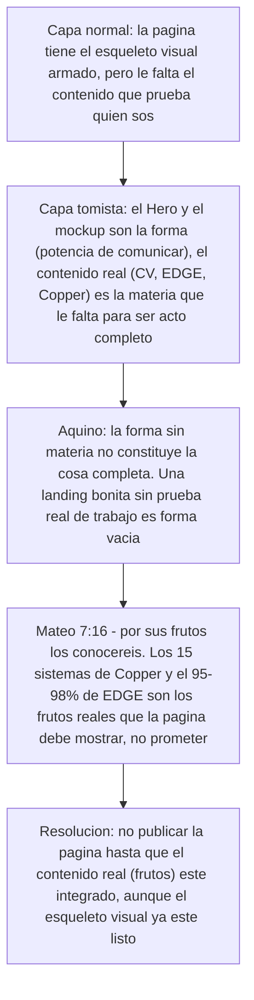
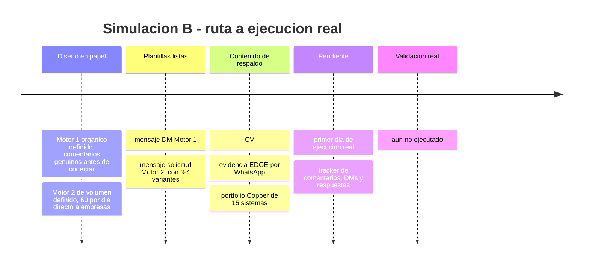
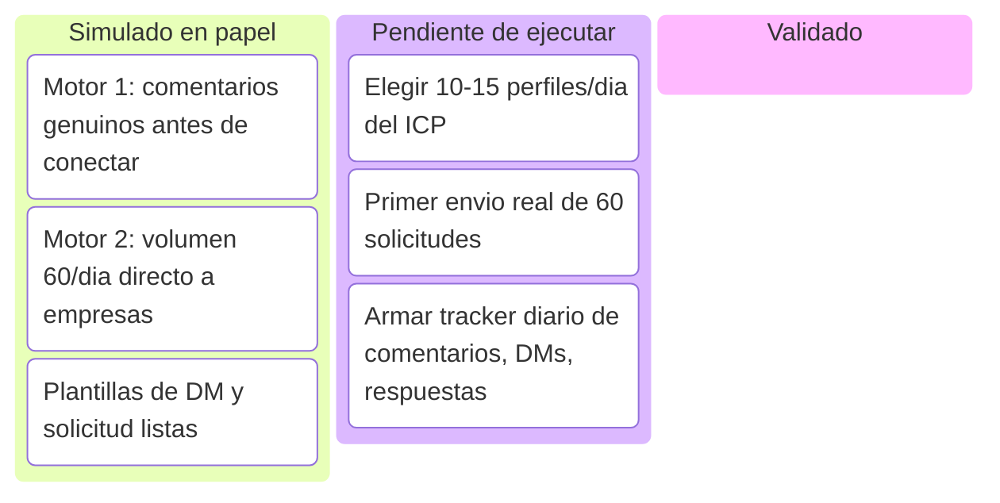
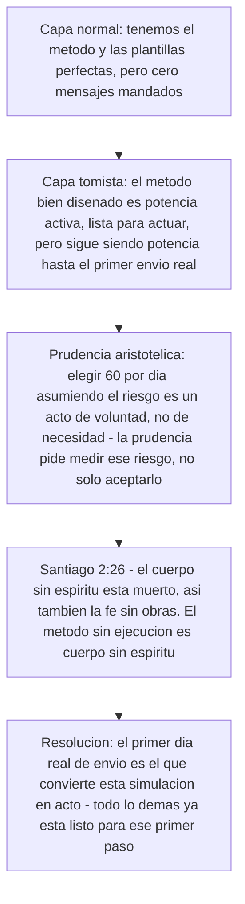

# Índice de simulaciones — Marca personal (Página web + LinkedIn)

**Qué es este documento:** el sub-índice de las simulaciones "en papel" para los dos frentes de marca personal — la página web (codeflow-landing) y la estrategia orgánica de LinkedIn. Igual que en EDGE, cada pieza se diseña y analiza antes de publicarse/ejecutarse real, con la misma regla: 🧪 **SIMULACIÓN — no publicado/ejecutado todavía**, y ✅ **VALIDADO** cuando pase a producción real.

**Base de contenido real ya construida (no simulada):**
- **Sistemas Copper** — 15 sistemas de IA/automatización ya construidos para Copper Group / 1HVAC (multi-agente, forecasting, pricing dinámico, data warehouse multi-país, IA on-premise, SaaS vertical B2B, digital twin, etc.). Esto es trabajo real ya entregado, no una idea — la nota "podría evolucionar a ser X" en cada ítem se refiere al siguiente paso de algo que ya existe, no a que falte construirlo.
- **EDGE Helmet** — evidencia real por WhatsApp: agentes llegando a 95-98% de precisión en adaptación de casco, 5-10 minutos por pieza, aprobación en curso de Jimmy Benzaquen y Jim Garzon.
- **CV** — NóminaPro, automatización multi-país (97% ahorro de tiempo), dashboard Power BI, sistema de cuentas por cobrar (20% de cartera optimizada).

---

<strong>▸ Simulación A — Página web personal (codeflow-landing)</strong>

### Línea de tiempo

### Kanban

### Contenido completo

Ver qué existe hoy y qué falta integrar

**Lo ya construido:** `Hero.tsx` (sección hero de la landing) y `PlaceholderDashboard.tsx` — este último es explícitamente un **mockup provisional**: el propio código lo marca así ("PROVISIONAL: mockup de producto genérico, NO es una captura real del producto todavía"). Es una animación de red de agentes (nodos que aparecen, se conectan con líneas curvas, pulsan) — flota directo sobre el contenedor, sin dashboard falso ni números inventados. Bien pensado para no mentir visualmente mientras no hay producto real que capturar.

**Lo que falta integrar como contenido:**
1. **Sección CV** — resumen de NóminaPro, automatización multi-país, Power BI, cuentas por cobrar, con las cifras ya verificadas (97% ahorro de tiempo, 20% de cartera optimizada).
2. **Sección EDGE** — evidencia real (no simulada) de que los agentes ya funcionan: 95-98% de precisión, 5-10 minutos por casco, con Jimmy Benzaquen y Jim Garzon aprobando el proceso en tiempo real.
3. **Sección Copper** — los 15 sistemas ya entregados para Copper Group/1HVAC (orquestador multi-agente, forecasting, pricing dinámico, data warehouse multi-país, plataforma de seguridad/compliance, IA on-premise, SaaS vertical B2B, digital twin, simulador financiero, integración de ERPs legacy, reconciliación financiera multi-país). Esto es el portfolio más fuerte — sistemas de misión crítica ya en producción para un cliente real.

**Pendiente de decisión:** en qué momento el `PlaceholderDashboard.tsx` deja de ser mockup y se reemplaza por una captura o demo real del producto — probablemente cuando EDGE o Copper tengan algo demostrable en pantalla, no antes.

### Lectura tomista

Ver lectura en 3 capas

---

<strong>▸ Simulación B — LinkedIn orgánico (networking activo)</strong>

### Línea de tiempo

### Kanban

### Contenido completo

Ver los dos motores y las plantillas

**ICP:** dueños/gerentes financieros de PYMEs de manufactura LatAm + founders/empresas tech que buscan automatización financiera y de marketing con agentes de IA.

**Motor 1 — Orgánico:** identificar 10-15 perfiles/día que publiquen contenido del nicho, comentar algo genuino y específico sobre su publicación (nunca genérico), y recién después de 1-2 intercambios reales mandar la solicitud/DM.

**Motor 2 — Volumen directo (60/día):** solicitud directa a decision-makers de empresas del ICP, sin paso previo de comentarios. Riesgo aceptado explícitamente por el usuario: LinkedIn puede restringir invitaciones temporalmente a ese ritmo — se asume el riesgo por velocidad.

**Plantilla DM Motor 1:** "Che [nombre], veía que veníamos coincidiendo en los comentarios de [tema específico] — quería conectar directo. Yo vengo del lado de automatización financiera con IA (armé sistemas que le ahorraron a un cliente 97% del tiempo en un proceso), y siempre es bueno tener más gente pensando en esto en la red."

**Plantilla solicitud Motor 2 (rotar 3-4 variantes):** "Hola [nombre], vi que [empresa] está en [industria/señal específica]. Trabajo automatizando procesos financieros y de marketing con agentes de IA — reduje un proceso de nómina de 3 horas a 10 minutos para un cliente similar, y construí 15 sistemas de misión crítica para un grupo multi-país (Copper Group). Si en algún momento tiene sentido una charla de 15 min, encantado."

🧪 **SIMULACIÓN** — método y plantillas diseñados, cero envíos reales todavía.

### Lectura tomista

Ver lectura en 3 capas

---

**Última actualización de este índice:** se actualiza manualmente cada vez que se ejecuta algo real (primera publicación de la web, primer día real de envíos en LinkedIn) o se agrega una simulación nueva.
